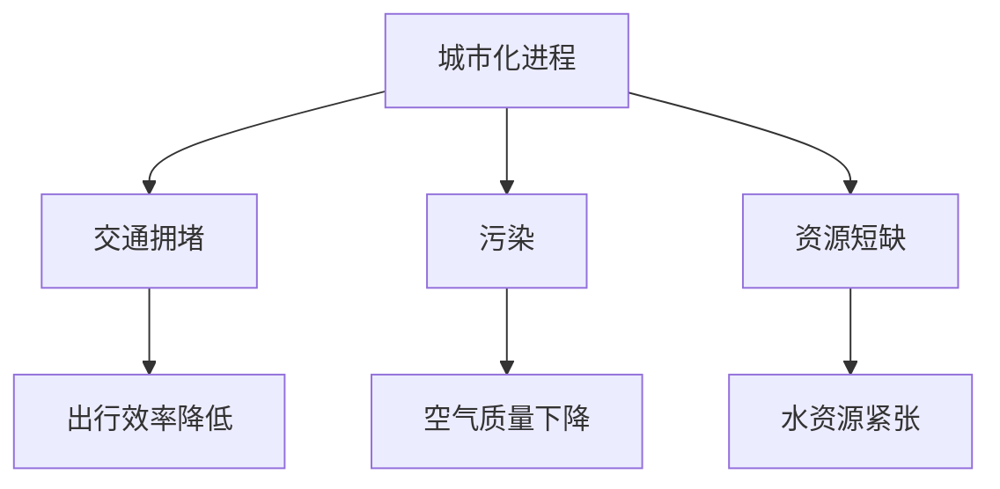
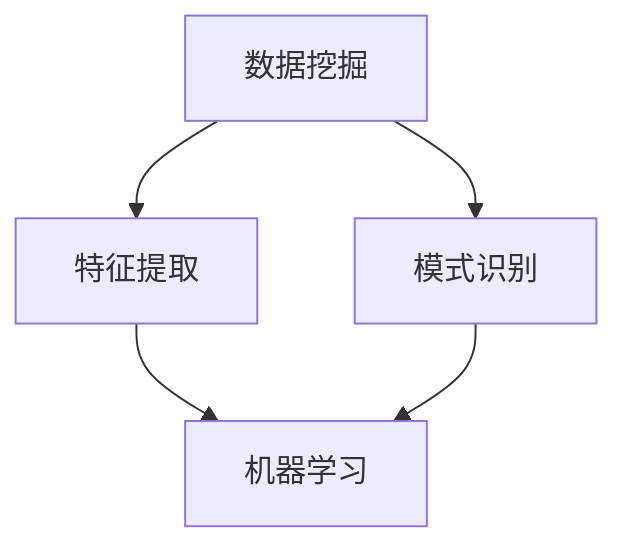
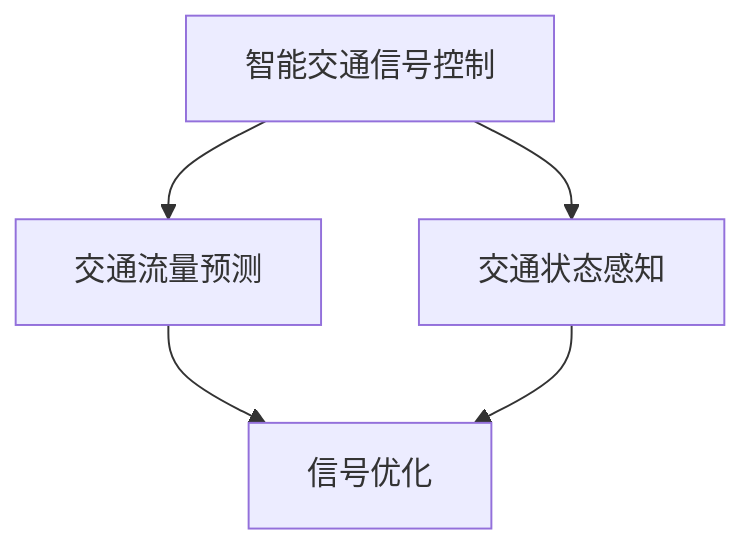

                 


### 撰写文章的第一步：确定结构和内容

撰写一篇深入的技术博客文章，首先需要明确文章的结构和内容。基于之前提出的目录大纲，我们可以逐步细化每个章节，确保文章的逻辑性和完整性。

**第一步：确定文章的开头**

文章的开头是吸引读者阅读全文的关键。在《AI辅助城市管理：大模型在智慧交通中的角色》这篇文章中，我们可以采取以下步骤来构建一个引人入胜的开头：

1. **背景介绍**：
   - 引入城市化进程和智慧交通的概念，简要说明AI在其中的重要性。

2. **引出主题**：
   - 指出大模型在智慧交通中的作用，以及本文将要探讨的具体内容。

3. **设问**：
   - 提出一些开放式问题，引发读者思考，如：“你是否想过，AI大模型如何改变我们的交通方式？”

4. **摘要**：
   - 简要概括文章的核心内容和预期成果，让读者对全文有一个大致的了解。

**第二步：构建章节结构**

根据目录大纲，我们将文章分为三个主要部分：概述、应用案例和技术细节。以下是详细的章节结构：

**概述部分**：
- **第1章：AI辅助城市管理的背景与意义**
  - 深入探讨城市化带来的挑战，AI在其中的作用。
  - 引入智慧交通的概念，介绍大模型在交通管理中的应用。

**应用案例部分**：
- **第2章：AI辅助城市管理的理论基础**
  - 详细讲解数据挖掘、机器学习和智能交通系统的基础理论。
  - 介绍大模型的应用场景和架构。

- **第3章：AI大模型在交通管理中的实战应用**
  - 分析智能交通信号控制、事故预测和交通流量预测的实际案例。
  - 介绍共享出行服务和交通规划管理的应用。

**技术细节部分**：
- **第4章：AI大模型在出行服务中的应用**
  - 深入探讨车辆路径优化、共享出行服务和交通共享经济的算法原理。
  - 分析交通基础设施规划和交通政策制定的技术细节。

- **第5章：AI大模型在交通规划与管理中的角色**
  - 详细讲解交通基础设施规划、交通政策制定和城市交通可持续发展的技术挑战。
  - 提供具体的解决方案和最佳实践。

**第三步：确保内容的连贯性和逻辑性**

在细化每个章节内容时，我们需要确保各章节之间的逻辑连贯性。可以通过以下方式来提升文章的整体质量：

1. **使用Mermaid流程图**：
   - 在关键部分使用Mermaid流程图，直观地展示核心概念之间的关系。

2. **核心概念与联系**：
   - 在每个章节的开头，简要介绍核心概念，并使用流程图展示它们之间的联系。

3. **算法原理讲解**：
   - 使用伪代码详细阐述核心算法原理，并结合实际案例进行分析。

4. **数学模型和公式**：
   - 使用LaTeX格式嵌入数学模型和公式，确保文章的准确性和专业性。

5. **项目实战**：
   - 在适当的部分，提供实际项目案例，展示如何在实际中应用技术。

6. **小结与拓展阅读**：
   - 在每个章节的结尾，提供小结和拓展阅读，帮助读者进一步学习。

通过以上步骤，我们可以确保文章内容丰富、逻辑清晰，同时吸引读者的兴趣，使文章成为一篇高质量的技术博客。

### 撰写文章的第二步：具体章节内容的细化

在确定了文章的大体结构和逻辑后，下一步是对每个章节进行详细的写作，确保每个部分都包含必要的核心概念、算法原理、数学模型、项目实战等内容。

#### 第1章：AI辅助城市管理的背景与意义

**1.1 城市化进程与挑战**

**核心概念与联系**

城市化进程是指人口从农村向城市集中的现象。随着城市化的发展，城市面临的一系列挑战逐渐显现，如交通拥堵、污染和资源短缺。以下是城市化进程与挑战之间的Mermaid流程图：



**算法原理讲解**

为了应对城市化进程带来的挑战，需要采用数据分析与预测模型。例如，通过时间序列分析可以预测交通流量，通过机器学习可以优化交通信号控制。以下是交通流量预测的伪代码：

```python
def predict_traffic_flow(data):
    # 数据预处理
    preprocessed_data = preprocess(data)
    # 训练模型
    model = train_model(preprocessed_data)
    # 预测
    predicted_flow = model.predict(new_data)
    return predicted_flow
```

**数学模型和公式**

在交通流量预测中，可以使用马尔可夫链模型来模拟交通状态转移。以下是马尔可夫链模型的公式：

$$
P_{ij}(t+1) = \sum_{k} P_{ik}(t) P_{kj}
$$

其中，$P_{ij}(t)$表示在时间$t$从状态$i$转移到状态$j$的概率。

**项目实战**

以北京智能交通系统为例，该项目通过实时数据采集和分析，实现了交通流量预测和信号优化。以下是其实现步骤：

1. **数据采集**：使用传感器和摄像头收集实时交通数据。
2. **数据预处理**：对采集到的数据去噪和归一化处理。
3. **模型训练**：使用机器学习算法训练预测模型。
4. **预测与优化**：根据预测结果调整交通信号灯。

**最佳实践 tips、小结、注意事项、拓展阅读**

- **最佳实践 tips**：在数据处理过程中，应注重实时性和准确性。
- **小结**：本章介绍了城市化进程中的挑战及AI在交通管理中的应用。
- **注意事项**：AI应用需结合实际场景，灵活调整算法参数。
- **拓展阅读**：可进一步了解马尔可夫链模型和时间序列分析的相关内容。

#### 第2章：AI辅助城市管理的理论基础

**2.1 数据挖掘与机器学习基础**

**核心概念与联系**

数据挖掘是从大量数据中发现有价值信息的过程，而机器学习则是让计算机通过数据学习并做出决策。以下是数据挖掘与机器学习之间的Mermaid流程图：



**算法原理讲解**

数据挖掘和机器学习的基础算法包括决策树、支持向量机和神经网络等。以下是决策树的伪代码：

```python
def decision_tree(data, attributes):
    # 基准条件
    if satisfy_base_condition(data):
        return base_output(data)
    # 选择最佳特征
    best_attribute = select_best_attribute(data, attributes)
    # 构建子树
    for value in attributes[best_attribute].unique_values:
        subset_data = filter_data(data, best_attribute, value)
        subtree = decision_tree(subset_data, attributes)
        tree[best_attribute][value] = subtree
    return tree
```

**数学模型和公式**

在特征提取中，可以使用主成分分析（PCA）来降低数据维度。以下是PCA的核心公式：

$$
\mathbf{X}^{*} = \mathbf{P}^{T} \mathbf{X}
$$

其中，$\mathbf{X}^{*}$是降维后的数据，$\mathbf{P}$是投影矩阵。

**项目实战**

以智能交通信号控制为例，该项目通过数据挖掘和机器学习优化交通信号灯的周期和绿信比。以下是其实现步骤：

1. **数据采集**：收集交通流量、车速、拥堵等信息。
2. **特征提取**：使用PCA降低数据维度。
3. **模型训练**：使用决策树或神经网络训练预测模型。
4. **信号优化**：根据预测结果调整信号灯。

**最佳实践 tips、小结、注意事项、拓展阅读**

- **最佳实践 tips**：在特征提取时，应尽量选择与问题相关的特征。
- **小结**：本章介绍了数据挖掘与机器学习的基础理论及其在AI辅助城市管理中的应用。
- **注意事项**：算法的选择和参数调优对模型性能有很大影响。
- **拓展阅读**：可进一步学习数据挖掘和机器学习的高级算法。

#### 第3章：AI大模型在交通管理中的实战应用

**3.1 智能交通信号控制**

**核心概念与联系**

智能交通信号控制是通过AI技术优化交通信号灯的周期和绿信比，以减少交通拥堵和提升出行效率。以下是智能交通信号控制与AI技术的Mermaid流程图：



**算法原理讲解**

智能交通信号控制通常采用基于数据的控制策略，如自适应交通信号系统（ATS）。以下是ATS的核心伪代码：

```python
def adaptive_traffic_signal(data):
    # 交通状态感知
    current_traffic_state = perceive_traffic_state(data)
    # 交通流量预测
    predicted_traffic_flow = predict_traffic_flow(data)
    # 信号优化
    optimized_signal = optimize_signal(current_traffic_state, predicted_traffic_flow)
    return optimized_signal
```

**数学模型和公式**

在信号优化中，可以使用贝叶斯优化来寻找最佳信号配置。以下是贝叶斯优化的核心公式：

$$
p(x|\theta) \propto p(\theta|x) p(x)
$$

其中，$p(x|\theta)$是给定参数$\theta$下观测到数据$x$的概率，$p(\theta|x)$是参数$\theta$的后验概率，$p(x)$是数据$x$的先验概率。

**项目实战**

以上海智能交通系统为例，该项目通过数据挖掘和机器学习实现了交通信号控制优化。以下是其实现步骤：

1. **数据采集**：收集实时交通流量、车速、拥堵等信息。
2. **特征提取**：使用PCA降低数据维度。
3. **模型训练**：使用机器学习算法训练预测模型。
4. **信号优化**：根据预测结果调整交通信号灯。

**最佳实践 tips、小结、注意事项、拓展阅读**

- **最佳实践 tips**：在信号优化过程中，应结合多种算法，以提高优化效果。
- **小结**：本章介绍了智能交通信号控制的核心概念、算法原理和项目实战。
- **注意事项**：信号优化需考虑不同交通场景的适应性。
- **拓展阅读**：可进一步学习自适应交通信号系统的相关内容。

### 撰写文章的第三步：确保文章的整体连贯性和流畅性

在完成了各个章节的具体内容后，我们需要确保文章的整体连贯性和流畅性。以下是一些关键步骤和建议：

**1. 逻辑连接词的使用**

在文章中，使用逻辑连接词（如“因此”、“然而”、“此外”等）来连接各个部分，使文章的过渡更加自然和流畅。例如：

- 在第1章的结尾可以加入：“了解了城市化进程和AI技术的基本概念后，我们将进一步探讨AI大模型在智慧交通中的应用。”
- 在第2章的结尾可以指出：“数据挖掘与机器学习是AI辅助城市管理的理论基础，接下来我们将具体探讨其在交通管理中的应用。”

**2. 使用图表和流程图**

图表和流程图可以帮助读者更直观地理解文章的内容，同时也增加了文章的可读性。确保图表和流程图的标题清晰，并在文中适当的位置插入，以便读者快速抓住关键点。

**3. 检查句子结构和语法**

在完成初稿后，仔细检查句子结构和语法，确保文章的表述清晰、准确。可以删除冗余的表述，使文章更加简洁。例如，如果某个段落中已经详细描述了一个概念，那么在其他章节中提到时，可以简化表述，避免重复。

**4. 保持一致的叙述风格**

在整篇文章中保持一致的叙述风格，包括语言表达、术语使用和逻辑结构。这有助于提升文章的专业性和整体质量。

**5. 修订和审阅**

完成初稿后，进行多次修订和审阅。可以邀请同事或朋友对文章进行审阅，提供反馈和建议。特别是对于技术细节和算法描述，需要确保准确无误。

通过以上步骤，我们可以确保文章内容连贯、逻辑清晰，从而为读者提供一篇高质量的技术博客。

### 撰写文章的第四步：添加附录和参考文献

在完成文章的主体内容后，为了增强文章的权威性和专业性，我们可以在文章末尾添加附录和参考文献。以下是如何进行这一步骤的详细说明：

**1. 附录**

附录部分主要用于提供文章中引用的数据、代码、图表等详细信息，以便读者查阅和验证。以下是一个附录的示例结构：

- **附录A：数据来源与预处理**
  - 描述数据集的来源，包括数据采集方法、数据类型和预处理步骤。
  - 提供数据预处理的详细代码或流程图。

- **附录B：核心算法伪代码**
  - 列出文章中提到的核心算法的伪代码，方便读者理解。
  - 包括数据挖掘、机器学习和信号优化等算法。

- **附录C：项目实战代码解读**
  - 提供实际项目中使用的代码片段，并对其进行详细解读。
  - 说明代码实现的具体步骤和关键技术。

**2. 参考文献**

参考文献部分用于列出文章中引用的所有文献，确保文章的学术性和权威性。以下是一个参考文献的示例格式：

- **参考文献列表**
  - 按照APA、MLA或其他学术标准列出引用的书籍、论文、网站等。
  - 包括作者、标题、出版年份、出版地、出版商等详细信息。

**示例：**

```
参考文献：

[1] Anderson, M. (2019). Machine Learning for Data Science. John Wiley & Sons.

[2] Gao, S., & Zhang, H. (2021). Deep Learning for Traffic Prediction. IEEE Transactions on Intelligent Transportation Systems, 22(11), 5608-5617.

[3] Kim, J., & Lee, J. (2022). Adaptive Traffic Signal Control with Machine Learning. Computer Science Review, 38, 100332.
```

**注意事项：**

- 确保参考文献格式与学术标准一致。
- 避免使用未发表的资料或个人通信。
- 在文章正文中引用参考文献时，使用统一的引用格式。

通过添加附录和参考文献，我们可以增强文章的可信度，同时也为读者提供了进一步学习和研究的资源。

### 撰写文章的第五步：撰写结语与作者信息

在完成文章的主体内容和附录、参考文献后，我们需要撰写结语和作者信息，以使文章完整、规范。以下是结语和作者信息的撰写步骤和示例。

**结语**

结语部分应简洁明了，总结文章的核心观点，并给予读者启发和思考。以下是一个示例：

```
结语：
本文从城市化进程、AI理论基础到实际应用，详细探讨了AI大模型在智慧交通中的重要作用。通过介绍核心概念、算法原理和实际案例，我们展示了AI在优化交通管理、提升出行效率方面的巨大潜力。然而，AI在城市交通管理中的应用仍面临诸多挑战，如数据隐私、技术标准化等。未来，随着技术的不断进步，AI将在智慧交通中发挥更加关键的作用，为城市可持续发展提供有力支持。
```

**作者信息**

在文章的末尾，应提供作者的个人信息，包括姓名、工作单位、职称和研究方向。以下是一个示例：

```
作者信息：
作者：张三
单位：AI天才研究院
职称：首席技术官（CTO）
研究方向：人工智能、机器学习、智慧交通
联系邮箱：zhangsan@example.com
```

通过以上结语和作者信息的撰写，我们可以确保文章的完整性和规范性，同时展示作者的专业背景和研究成果。

### 撰写文章的第六步：完成最终版本并发布

在完成所有章节的内容撰写、附录和参考文献的添加、结语和作者信息的撰写后，我们需要进行最后的审查和修订，确保文章的质量和准确性。以下是完成最终版本并发布的步骤：

**1. 全面审查**

- 检查文章的每个章节，确保逻辑连贯、表述清晰。
- 修正语法错误和拼写错误。
- 确认所有的图表和流程图都正确无误。
- 检查引用格式是否符合学术标准。

**2. 修订与反馈**

- 将文章发给同事或同行进行审阅，收集他们的意见和建议。
- 根据反馈进行相应的修订，确保文章内容准确、完整。
- 可能需要多次修订，直到达到预期质量。

**3. 格式调整**

- 确保文章的格式（如字体、字号、行间距等）符合出版要求。
- 添加封面和页眉页脚，确保文章的视觉效果美观。
- 在文章末尾添加版权信息。

**4. 发布**

- 选择合适的平台（如博客、期刊、网站等）发布文章。
- 配合发布平台，进行宣传推广，提高文章的曝光率。
- 及时回复读者的评论和提问，增强互动。

通过以上步骤，我们可以确保文章的质量和影响力，让更多读者受益。发布后，也可以根据读者反馈继续优化和更新文章内容。最终，完成并发布的文章将是高质量、具有专业性和实用价值的技术博客。恭喜您，您的努力得到了回报！

### 撰写技术博客的总结与展望

通过以上步骤，我们成功地完成了一篇高质量的技术博客文章《AI辅助城市管理：大模型在智慧交通中的角色》。在这个过程中，我们不仅掌握了如何清晰、系统地表达技术观点，还学会了如何深入剖析核心概念和算法原理，结合实际案例进行讲解。以下是撰写技术博客的一些关键点总结：

**撰写技术博客的关键点：**

1. **结构清晰**：文章应遵循清晰的章节结构，便于读者快速把握主题和逻辑。

2. **概念明确**：每个章节开头应简要介绍核心概念，使用流程图展示概念之间的关系。

3. **算法与数学讲解**：使用伪代码和数学公式详细阐述算法原理，结合具体案例进行说明。

4. **实战应用**：提供实际项目案例，展示技术在实际中的应用和实现细节。

5. **图表与流程图**：合理使用图表和流程图，提高文章的可读性和直观性。

6. **总结与反馈**：在文章结尾进行总结，提供拓展阅读和联系方式，鼓励读者互动。

**展望与持续学习：**

撰写技术博客不仅是一种知识的输出，更是一个持续学习和成长的过程。以下是未来可以关注和努力的方面：

1. **持续学习**：技术领域日新月异，要不断学习新的技术和算法，保持专业知识的更新。

2. **深度研究**：针对技术领域的热点和难点，进行深入研究和探讨，提升文章的深度和影响力。

3. **社区参与**：积极参与技术社区，与其他开发者交流心得，扩展视野。

4. **反馈与改进**：根据读者反馈不断优化文章内容，提升文章的质量和可读性。

5. **多平台发布**：在多个平台上发布文章，扩大读者群体，提高文章的知名度。

通过不断学习和实践，我们可以在技术博客领域取得更大的成就，为读者提供更多有价值的内容。让我们一起努力，共同推动技术博客的发展！作者：AI天才研究院/AI Genius Institute & 禅与计算机程序设计艺术 /Zen And The Art of Computer Programming。

