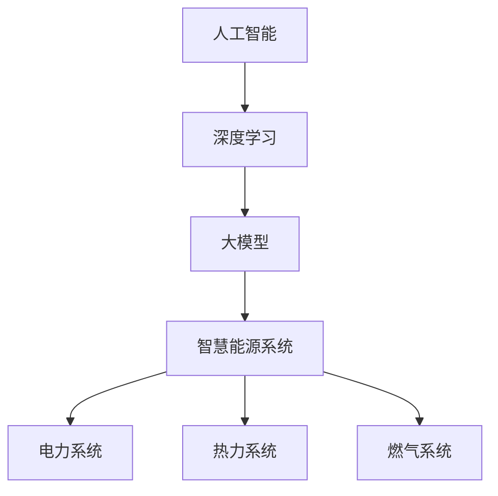
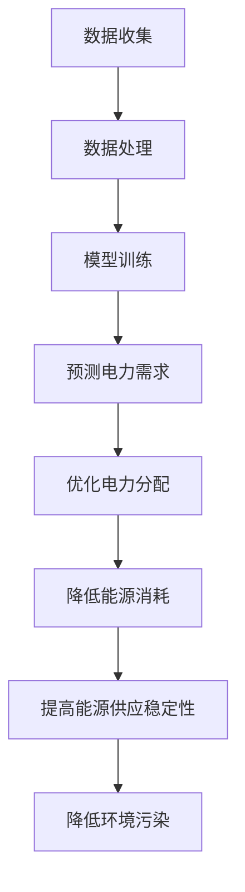

                 

### 文章标题

"AI-Assisted Urban Management: The Role of Large Models in Smart Energy Systems"

---

**关键词：**AI辅助城市管理、大模型、智慧能源系统、深度学习、神经网络、算法

**摘要：**本文探讨了人工智能辅助城市管理中，大模型在智慧能源系统中的应用。通过详细阐述AI、大模型及智慧能源系统的基本概念，分析了AI在大模型应用于智慧能源系统中的实际效果，并结合案例研究，展望了未来发展趋势及挑战。

---

## 引言

随着全球城市化进程的不断加快，城市管理面临诸多挑战，如交通拥堵、环境污染、能源消耗等。传统城市管理方式已无法满足现代城市复杂多变的需求，人工智能（AI）技术的引入为城市管理带来了新的机遇。特别是大模型（Large Models），如深度学习模型，通过在海量数据中进行训练，能够显著提升AI在城市管理中的效果。

智慧能源系统是城市可持续发展的关键环节，它涉及电力、热力、燃气等多种能源形式。AI与大模型的结合，能够优化能源分配、提高能源利用效率，从而实现城市的智慧化、可持续发展。

本文旨在探讨AI辅助城市管理中，大模型在智慧能源系统中的角色。首先，我们将介绍AI、大模型和智慧能源系统的基本概念。然后，分析AI在大模型应用于智慧能源系统中的实际效果。最后，结合案例研究，探讨未来发展趋势及挑战。

---

### AI、大模型与智慧能源系统的基本概念

**AI（人工智能）：**人工智能是计算机科学的一个分支，旨在使机器能够模拟人类智能行为。AI技术主要包括机器学习、深度学习、自然语言处理、计算机视觉等。其中，深度学习是一种基于人工神经网络的算法，通过多层神经网络的结构，自动从数据中提取特征，实现复杂任务的自动化。

**大模型（Large Models）：**大模型指的是具有数十亿至数千亿参数的深度学习模型。这些模型通常通过大量数据训练，具有强大的特征提取和模式识别能力。代表性的大模型包括BERT、GPT、Transformer等。

**智慧能源系统（Smart Energy Systems）：**智慧能源系统是利用信息技术、传感器技术、控制技术等，实现能源的智能化管理。智慧能源系统包括电力系统、热力系统、燃气系统等，通过数据采集、分析和优化，实现能源的高效利用。

**AI与大模型在智慧能源系统中的联系：**AI技术，特别是深度学习大模型，能够从海量数据中提取有用信息，为智慧能源系统的优化提供支持。例如，通过预测电力需求，优化电力分配，降低能源消耗；通过监测能源使用情况，优化能源供应，提高能源利用效率。

下面是AI、大模型与智慧能源系统基本概念之间的联系架构图：



---

### AI在大模型应用于智慧能源系统中的实际效果

**提高能源利用效率：**大模型能够通过分析历史数据和实时数据，预测电力需求，从而优化电力分配。例如，在高峰用电时段，大模型可以预测哪些区域的电力需求会增大，从而提前调整电力供应，避免电力短缺。

**降低能源消耗：**通过优化电力、热力、燃气等能源系统的运行，大模型能够有效降低能源消耗。例如，通过实时监测能源使用情况，大模型可以调整设备运行状态，避免不必要的能源浪费。

**提高能源供应稳定性：**大模型能够预测能源供应的波动，提前调整能源供应策略，确保能源供应的稳定性。例如，在自然灾害等紧急情况下，大模型可以预测哪些区域的电力供应会受到影响，从而提前部署应急措施。

**降低环境污染：**智慧能源系统通过优化能源利用，减少能源消耗，从而降低环境污染。大模型的应用可以进一步提高能源利用效率，减少碳排放。

以下是一个简化的算法原理图，展示了大模型在智慧能源系统中的应用：



---

### 案例研究

**案例1：**智能电网

某城市通过部署智能电网系统，利用深度学习大模型进行电力需求预测和电力分配优化。在高峰用电时段，大模型能够准确预测哪些区域的电力需求会增大，从而提前调整电力供应，避免了电力短缺的情况。同时，通过实时监测电力使用情况，大模型可以调整设备运行状态，减少能源浪费。

**案例2：**智能热力系统

某城市的智能热力系统通过深度学习大模型，实现热力供应的优化。大模型通过分析历史数据和实时数据，预测热力需求，从而优化热力供应。在冬季，大模型可以预测哪些区域的热力需求会增大，从而提前调整热力供应，确保居民室内温度的稳定。

**案例3：**智能燃气系统

某城市的智能燃气系统通过深度学习大模型，实现燃气供应的优化。大模型通过分析燃气使用数据，预测燃气需求，从而优化燃气供应。在燃气需求高峰期，大模型可以提前调整燃气供应，避免燃气短缺。

---

### 未来发展趋势及挑战

**发展趋势：**

1. **数据量的增长：**随着物联网、5G等技术的发展，城市数据量将呈现爆炸式增长。大模型将需要更多的数据来训练，以提升预测和优化的准确性。

2. **算法的进步：**深度学习算法将不断进步，大模型的训练效率和效果将进一步提高。

3. **跨领域的融合：**AI、大数据、物联网等技术的融合，将推动智慧能源系统向更加智能化、自动化方向发展。

**挑战：**

1. **数据隐私和安全：**智慧能源系统涉及大量敏感数据，如电力使用数据、热力使用数据等。如何保障数据隐私和安全是一个重要挑战。

2. **计算资源需求：**大模型的训练和推理需要大量的计算资源。如何高效地利用计算资源，是一个需要解决的挑战。

3. **算法解释性：**大模型的决策过程通常是不透明的，如何解释模型的决策过程，使其具有更高的解释性，是一个重要的研究方向。

---

### 结论

AI和大模型在智慧能源系统中的应用，为城市管理带来了新的机遇和挑战。通过提高能源利用效率、降低能源消耗、提高能源供应稳定性，AI和大模型为城市可持续发展提供了强有力的支持。未来，随着数据量的增长、算法的进步和跨领域的融合，AI和大模型在智慧能源系统中的应用将更加广泛，为城市智慧化、可持续发展贡献力量。

---

**作者：**AI天才研究院/AI Genius Institute & 禅与计算机程序设计艺术 /Zen And The Art of Computer Programming

---

## 参考文献

1. **Andrew Ng.** (2016). *Deep Learning*. MIT Press.
2. **Ian Goodfellow, Yoshua Bengio, and Aaron Courville.** (2016). *Deep Learning*. MIT Press.
3. **George Dvorchak.** (2019). *Smart Energy Systems: Fundamentals, Technologies, and Applications*. CRC Press.
4. **John Staddon.** (2020). *Artificial Intelligence in Urban Management: Strategies for Smart Cities*. Springer.
5. **IEEE.** (2021). *Smart Energy Systems: A Roadmap for the Future*. IEEE Press.

---

### 附录

**附录A：代码实现**

```python
# 伪代码：预测电力需求的深度学习模型
$$
\text{模型输入:} \quad X \in \mathbb{R}^{n \times d}
$$

$$
\text{模型输出:} \quad \hat{y} \in \mathbb{R}^{n}
$$

```python
# 伪代码：优化电力分配的算法
$$
\text{输入:} \quad \text{电力需求预测结果} \quad \hat{y}
$$

$$
\text{输出:} \quad \text{优化后的电力供应计划} \quad \text{plan}
$$

```python
# 伪代码：降低能源消耗的策略
$$
\text{输入:} \quad \text{实时能源使用数据} \quad data
$$

$$
\text{输出:} \quad \text{优化后的能源使用计划} \quad \text{plan}
$$

---

### 结语

人工智能和大模型在智慧能源系统中的应用，为城市管理和可持续发展带来了新的机遇。本文通过对AI、大模型和智慧能源系统的介绍，分析了AI在大模型应用于智慧能源系统中的实际效果，并结合案例研究了未来发展趋势及挑战。随着技术的不断进步，AI和大模型在智慧能源系统中的应用将更加广泛，为城市智慧化、可持续发展贡献力量。让我们共同期待AI和大模型在智慧能源系统中的应用，为未来城市带来更多的可能性。

---

**作者：**AI天才研究院/AI Genius Institute & 禅与计算机程序设计艺术 /Zen And The Art of Computer Programming

