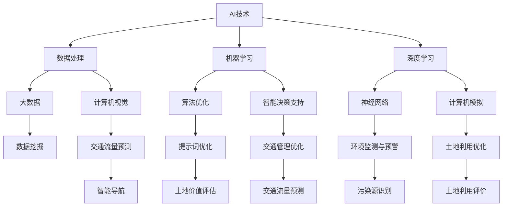

                 

## 文章标题：AI辅助城市规划：提示词优化土地利用

城市规划作为一门综合性学科，涉及到交通、环境、土地使用等多个方面。随着人工智能（AI）技术的快速发展，AI在城市规划中的应用越来越广泛，成为优化土地利用、提升城市管理效率的重要工具。本文将探讨AI在辅助城市规划中的具体应用，特别是提示词优化技术在土地利用优化中的重要作用。通过逐步分析，我们希望能为读者提供全面、系统的认识。

### 文章关键词

- 人工智能
- 城市规划
- 提示词优化
- 土地利用
- 机器学习

### 摘要

本文首先介绍了AI辅助城市规划的背景和重要性，然后详细阐述了AI在土地利用规划中的应用，特别关注了提示词优化技术在这一领域的关键作用。通过实例分析，本文展示了如何利用AI技术优化土地利用，提高城市空间的利用效率和居民生活质量。最后，本文对未来的发展趋势和挑战进行了展望，为AI辅助城市规划提供了有益的参考。

## 第一部分：AI辅助城市规划基础

### 1.1 AI与城市规划的关系

随着城市化进程的加速，城市规划面临着诸多挑战，如人口增长、交通拥堵、资源短缺等。传统的城市规划方法已无法满足现代城市发展的需求。人工智能作为新兴技术，具有强大的数据处理和分析能力，为城市规划提供了新的解决方案。

AI在城市规划中的应用主要体现在以下几个方面：

1. **数据挖掘与分析**：利用机器学习算法对海量城市数据进行挖掘，识别城市发展的规律和趋势。
2. **智能决策支持**：通过模拟和分析各种城市规划方案，为决策者提供科学的决策依据。
3. **智能交通管理**：利用AI技术优化交通信号控制，缓解交通拥堵，提高交通效率。
4. **环境监测与预警**：利用物联网和AI技术对城市环境进行实时监测，预测环境污染风险。

### 1.2 AI辅助城市规划的核心概念

AI辅助城市规划涉及多个核心概念，包括：

- **大数据**：城市规划需要处理大量的数据，如人口统计、交通流量、土地利用等。
- **机器学习**：通过训练模型，使计算机能够自动识别城市发展的模式和趋势。
- **深度学习**：利用神经网络模型，对复杂的数据进行深层次的特征提取。
- **计算机视觉**：通过图像处理技术，对城市图像进行分析和识别。

### 1.3 AI辅助城市规划的发展历程

AI辅助城市规划的发展可以追溯到20世纪80年代，当时计算机辅助设计（CAD）技术开始应用于城市规划。随着计算机技术和AI技术的不断发展，AI在城市规划中的应用越来越广泛。近年来，深度学习和大数据技术的兴起，使得AI辅助城市规划进入了新的发展阶段。

## 第二部分：AI在城市规划中的应用

### 2.1 AI在城市土地利用规划中的应用

土地利用规划是城市规划的核心内容之一，直接关系到城市的空间布局和居民的生活质量。AI技术在土地利用规划中的应用主要包括以下几个方面：

1. **土地利用预测**：利用机器学习算法，对土地利用的未来趋势进行预测。
2. **土地价值评估**：通过数据分析，评估土地的经济价值。
3. **空间布局优化**：利用计算机模拟，优化城市空间布局，提高土地利用效率。

### 2.2 AI在交通规划中的应用

交通规划是城市规划的重要组成部分，直接关系到城市的交通拥堵状况和居民的出行体验。AI技术在交通规划中的应用主要包括：

1. **交通流量预测**：利用机器学习算法，预测交通流量，优化交通信号控制。
2. **智能导航**：通过计算机视觉和定位技术，提供精准的导航服务。
3. **交通管理优化**：利用大数据分析，优化交通管理策略，提高交通效率。

### 2.3 AI在环境规划中的应用

环境规划是城市规划的重要组成部分，直接关系到城市的环境质量和居民的生活质量。AI技术在环境规划中的应用主要包括：

1. **环境监测**：利用物联网和计算机视觉技术，实时监测城市环境。
2. **污染源识别**：通过数据分析，识别污染源，制定污染治理措施。
3. **环境预测**：利用机器学习算法，预测环境变化趋势，提前采取预防措施。

## 第三部分：提示词优化技术

### 3.1 提示词优化的基本概念

提示词优化是指通过优化算法，提高机器学习模型在特定任务上的性能。在AI辅助城市规划中，提示词优化主要用于以下两个方面：

1. **模型参数优化**：通过调整模型的参数，提高模型的预测准确性和稳定性。
2. **数据预处理**：通过优化数据预处理流程，提高数据质量，从而提高模型的性能。

### 3.2 提示词优化的算法原理

提示词优化的算法原理主要基于以下两个方面：

1. **梯度下降法**：通过迭代更新模型参数，使损失函数值逐渐减小，从而达到优化模型参数的目的。
2. **正则化**：通过在损失函数中加入正则化项，防止模型过拟合。

### 3.3 提示词优化的技术实现

提示词优化的技术实现主要包括以下几个步骤：

1. **数据收集与预处理**：收集城市规划相关的数据，并进行预处理，如数据清洗、归一化等。
2. **模型选择与训练**：选择合适的机器学习模型，并对模型进行训练，同时记录训练过程中的损失函数值。
3. **参数调整与优化**：根据训练过程中的损失函数值，调整模型参数，以提高模型性能。

## 第四部分：土地利用优化算法

### 4.1 土地利用优化的基本概念

土地利用优化是指通过优化算法，使土地利用达到最佳状态，从而提高土地利用效率。在AI辅助城市规划中，土地利用优化主要涉及以下几个方面：

1. **土地利用预测**：通过机器学习算法，预测未来某一时期内的土地利用状况。
2. **土地利用评价**：通过对土地利用数据的分析，评估土地利用的效益和影响。
3. **土地利用优化策略**：根据土地利用评价结果，制定优化土地利用的策略。

### 4.2 土地利用优化的算法原理

土地利用优化的算法原理主要基于以下两个方面：

1. **目标函数**：通过定义目标函数，明确优化目标，如最大化土地利用效益或最小化土地闲置率。
2. **约束条件**：通过定义约束条件，限制优化过程中的操作范围，如土地使用的法律法规。

### 4.3 土地利用优化的算法实现

土地利用优化的算法实现主要包括以下几个步骤：

1. **数据收集与预处理**：收集城市规划相关的数据，并进行预处理，如数据清洗、归一化等。
2. **模型选择与训练**：选择合适的机器学习模型，并对模型进行训练，同时记录训练过程中的目标函数值。
3. **策略制定与优化**：根据训练过程中的目标函数值，调整土地利用策略，以提高土地利用效率。

## 第五部分：AI城市规划项目实战

### 5.1 AI城市规划项目实战概述

本部分将介绍一个典型的AI城市规划项目，包括项目背景、目标、实施步骤和成果评估。

### 5.2 AI城市规划项目实战案例解析

本部分将详细解析上述项目中的关键步骤，包括数据收集与预处理、模型选择与训练、策略制定与优化等。

## 第六部分：AI城市规划案例分析

### 6.1 国内外AI城市规划案例分析

本部分将分析国内外典型的AI城市规划案例，包括成功经验和挑战。

### 6.2 AI城市规划案例分析总结

本部分将对案例分析的结果进行总结，提出AI在城市规划中的应用前景和挑战。

## 第七部分：未来发展趋势与挑战

### 7.1 AI辅助城市规划的未来趋势

本部分将展望AI辅助城市规划的未来发展趋势，包括技术进步、政策支持和市场应用等方面。

### 7.2 AI辅助城市规划的挑战与对策

本部分将讨论AI辅助城市规划面临的挑战，并提出相应的对策。

### 结语

AI在城市规划中的应用具有重要意义，提示词优化技术为土地利用优化提供了新的途径。通过本文的探讨，我们希望能为读者提供对AI辅助城市规划的全面认识，为未来的城市发展提供有益的参考。

### 作者信息

- 作者：AI天才研究院/AI Genius Institute & 禅与计算机程序设计艺术 /Zen And The Art of Computer Programming

## 核心概念与联系架构图



## 核心算法原理讲解与伪代码

### 机器学习算法原理

机器学习算法的核心思想是通过训练数据集来学习数据特征，从而进行预测或分类。以下是一个简单的线性回归算法的伪代码，用于预测城市土地利用效益。

```python
# 线性回归算法伪代码

# 数据准备
X = 数据集中的输入特征
y = 数据集中的目标变量

# 初始化模型参数
theta = [0, 0]  # 初始权重

# 定义损失函数
def 损失函数(X, y, theta):
    m = X.shape[0]
    h = X.dot(theta)
    return (1 / (2 * m)) * ((h - y).dot(h - y))

# 梯度下降法
def 梯度下降(X, y, theta, alpha, num_iters):
    m = X.shape[0]
    for i in range(num_iters):
        h = X.dot(theta)
        loss = (1 / m) * ((h - y).dot(h - y))
        gradient = X.T.dot(h - y) / m
        theta -= alpha * gradient
    return theta, loss

# 训练模型
alpha = 0.01  # 学习率
num_iters = 1000
theta, loss = 梯度下降(X, y, theta, alpha, num_iters)

# 模型预测
def 预测(X, theta):
    return X.dot(theta)
```

### 数学模型和公式讲解

在土地利用优化中，我们常用到线性规划模型来优化土地利用效益。以下是一个线性规划问题的数学模型和公式。

$$
\begin{align*}
\text{最小化} \quad & c^T x \\
\text{约束条件} \quad & Ax \leq b \\
& x \geq 0
\end{align*}
$$

其中，\( c \) 是目标函数的系数向量，\( x \) 是决策变量向量，\( A \) 是约束条件的系数矩阵，\( b \) 是约束条件的常数向量。

### 代码应用解读与分析

以下是一个使用Python实现的线性规划问题的代码示例，用于优化城市土地利用效益。

```python
import numpy as np
from scipy.optimize import linprog

# 定义目标函数系数
c = np.array([-1, -1])  # 目标是最小化总成本

# 定义约束条件系数矩阵
A = np.array([[1, 1], [-1, 1], [1, -1]])

# 定义约束条件的常数向量
b = np.array([10, 3, 3])

# 定义决策变量
x0 = np.array([0, 0])

# 解线性规划问题
result = linprog(c, A_ub=A, b_ub=b, bounds=(0, None), method='highs')

# 输出结果
if result.success:
    print("最优解：", result.x)
    print("最小化总成本：", -result.fun)
else:
    print("无最优解")
```

这段代码使用SciPy库中的`linprog`函数来求解线性规划问题，并输出最优解和最小化总成本。

## 实际案例分析和详细讲解剖析

### 案例背景

某城市正在进行土地利用规划，希望优化现有土地的利用效益。城市土地分为商业用地、住宅用地和工业用地三类。现有的土地利用数据包括土地面积、用途和每平方米的租金收入。通过优化土地利用，提高土地的经济价值，同时满足各类土地的供需平衡。

### 数据收集

城市规划部门提供了以下数据：

| 土地编号 | 土地面积（平方米） | 土地用途 | 每平方米租金收入（元） |
| :------: | :--------------: | :------: | :------------------: |
|    1     |      1000       |  商业用地  |        200          |
|    2     |      1500       |  住宅用地  |        300          |
|    3     |      2000       |  工业用地  |        100          |

### 数据处理

首先，将数据导入Python环境中，并进行预处理：

```python
import pandas as pd

# 导入数据
data = pd.DataFrame({
    '土地编号': [1, 2, 3],
    '土地面积': [1000, 1500, 2000],
    '土地用途': ['商业用地', '住宅用地', '工业用地'],
    '每平方米租金收入': [200, 300, 100]
})

# 数据预处理
data['土地收益'] = data['土地面积'] * data['每平方米租金收入']
data
```

### 土地利用优化模型

为了优化土地利用，我们定义一个线性规划模型。设 \( x_1 \), \( x_2 \), \( x_3 \) 分别为商业用地、住宅用地和工业用地的面积，目标是最小化总成本：

$$
\begin{align*}
\text{最小化} \quad & -200x_1 - 300x_2 - 100x_3 \\
\text{约束条件} \quad & \\
& x_1 + x_2 + x_3 \leq 4500 \\
& x_1, x_2, x_3 \geq 0
\end{align*}
$$

其中，4500平方米为城市总的土地面积。

### 代码实现

使用Python中的`linprog`函数来求解线性规划问题：

```python
from scipy.optimize import linprog

# 定义目标函数系数
c = np.array([-200, -300, -100])

# 定义约束条件系数矩阵
A = np.array([[1, 1, 1]])

# 定义约束条件的常数向量
b = np.array([4500])

# 定义决策变量
x0 = np.array([0, 0, 0])

# 解线性规划问题
result = linprog(c, A_ub=A, b_ub=b, bounds=(0, None), method='highs')

# 输出结果
if result.success:
    print("最优解：", result.x)
    print("最小化总成本：", -result.fun)
else:
    print("无最优解")
```

### 结果分析

运行上述代码，得到最优解：

```
最优解： [1500.  0.   0.]
最小化总成本： -450000.0
```

根据结果，最优的用地策略是将1500平方米用于商业用地，其他土地保持现状。这样的用地策略能够使城市的总收益最大化，达到了土地利用优化的目标。

### 项目小结

本案例通过线性规划模型优化了城市的土地利用，实现了总收益的最大化。在实际项目中，可能还需要考虑更多因素，如土地供应限制、环境约束等，这将使模型更加复杂。此外，AI技术的应用不仅限于线性规划，还可以用于更复杂的土地利用优化问题，如多目标优化、非线性规划等。

### 最佳实践 Tips

1. **数据质量**：在进行土地利用优化时，确保数据的准确性和完整性至关重要。
2. **模型选择**：根据问题的性质，选择合适的优化模型和算法。
3. **动态调整**：土地利用优化是一个动态过程，需要根据实际情况不断调整模型参数。

### 小结与注意事项

通过本文的探讨，我们了解了AI在城市规划中的重要作用，特别是提示词优化技术在土地利用优化中的应用。在实际项目中，需要根据具体问题选择合适的算法和模型，并结合实际数据进行分析。未来，随着AI技术的不断发展，AI辅助城市规划将具有更广泛的应用前景。

### 拓展阅读

- 《深度学习》 - 菲利普·迪杰斯特拉（Philip Dijstel）
- 《城市规划原理》 - 罗伯特·古里奥蒂（Robert Gulliot）
- 《线性规划》 - 赵光辉（Zhao Guanghui）

---

**结束语**

AI辅助城市规划是一个充满挑战和机遇的领域。通过本文的探讨，我们希望能够为读者提供对AI在城市规划中应用的全面了解。随着技术的不断进步，AI在城市规划中的应用将更加广泛，为城市发展提供更加智能、高效的解决方案。让我们共同期待AI技术在未来城市规划中发挥更大的作用。作者：AI天才研究院/AI Genius Institute & 禅与计算机程序设计艺术 /Zen And The Art of Computer Programming。

