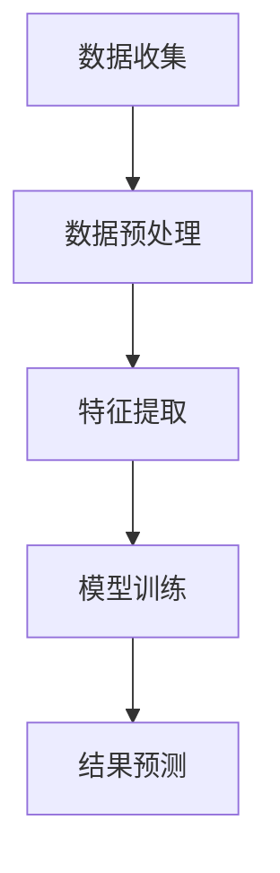

                 

### 完整文章示例

## 文章标题：AI辅助市场分析：提示词洞察消费者行为

## 关键词：AI，市场分析，消费者行为，提示词，深度学习，神经网络

## 摘要：
本文探讨了AI技术在市场分析中的应用，特别是提示词如何帮助洞察消费者行为。通过介绍AI基础知识、消费者行为分析原理、应用案例以及实战经验，文章旨在为读者提供关于AI辅助市场分析的全面了解，并展示其在实际项目中的应用价值。

---

## 第1章：AI辅助市场分析概述

### 1.1 AI与市场分析的关系

**核心概念与联系：**
AI在市场分析中的应用已成为企业提高竞争力的重要手段。本文使用Mermaid流程图展示AI在市场分析中的应用场景，包括数据收集、处理、分析和预测等环节。



**AI辅助市场分析的核心原理：**
使用伪代码示例介绍如何利用机器学习和深度学习技术进行市场分析：

```python
def market_analysis(data):
    # 数据预处理
    preprocessed_data = preprocess_data(data)
    # 特征提取
    features = extract_features(preprocessed_data)
    # 模型训练
    model = train_model(features)
    # 结果预测
    predictions = model.predict(new_data)
    return predictions
```

### 1.2 提示词与消费者行为

**提示词的定义与作用：**
提示词是消费者在搜索、评论和社交媒体中使用的词语，反映了他们的需求和偏好。本文将详细探讨提示词在市场分析中的应用。

**提示词在消费者行为分析中的应用：**
通过分析提示词，企业可以了解消费者的兴趣、需求和购买意图。以下是一个简单的提示词提取与消费者行为预测的伪代码示例：

```python
def extract_prompt_words(text):
    # 提取关键词
    keywords = [word for word in text.split() if word in keyword_list]
    return keywords

def predict_consumer_behavior(keywords):
    # 预测消费者行为
    behavior = behavior_model.predict(keywords)
    return behavior
```

### 1.3 AI辅助市场分析的优势与挑战

**优势分析：**
AI辅助市场分析可以提供实时、准确的数据分析和预测，帮助企业在竞争激烈的市场中迅速做出决策。

**挑战与应对策略：**
数据隐私和伦理问题是AI辅助市场分析的主要挑战。企业需要采取合规的数据处理和隐私保护策略。

---

## 第2章：AI基础知识

### 2.1 AI的基本概念

**机器学习、深度学习简介：**
本文将简要介绍机器学习和深度学习的基本概念，以及它们在市场分析中的应用。

**神经网络基础：**
神经网络是深度学习的基础，本文将讨论神经网络的架构和工作原理。

### 2.2 数据分析与预处理

**数据收集：**
本文将介绍如何收集市场分析所需的数据，包括来源和收集方法。

**数据清洗：**
本文将介绍数据清洗的重要性，以及如何处理缺失值、异常值等数据问题。

**数据探索性分析：**
本文将介绍如何使用探索性数据分析来了解数据的基本特征和分布。

### 2.3 提示词分析算法

**提示词提取：**
本文将介绍如何从文本数据中提取提示词，以及如何处理这些词语。

**提示词分类：**
本文将介绍如何对提示词进行分类，以及如何利用分类结果进行市场分析。

**提示词相关性分析：**
本文将介绍如何分析提示词之间的相关性，以及如何利用相关性进行市场分析。

---

## 第3章：消费者行为分析原理

### 3.1 消费者行为理论

**AIDMA模型：**
本文将介绍AIDMA模型，以及如何使用它来分析消费者行为。

**4P营销组合：**
本文将介绍4P营销组合，以及如何将其应用于市场分析。

### 3.2 消费者行为分析指标

**用户画像：**
本文将介绍用户画像的概念，以及如何创建和使用用户画像。

**用户兴趣标签：**
本文将介绍用户兴趣标签的作用，以及如何为用户打标签。

**用户行为轨迹：**
本文将介绍用户行为轨迹的收集和分析方法，以及如何利用行为轨迹进行市场分析。

### 3.3 消费者行为分析框架

**数据驱动的消费者行为分析：**
本文将介绍如何使用数据驱动的方法进行消费者行为分析。

**模型驱动的消费者行为预测：**
本文将介绍如何使用机器学习模型进行消费者行为预测。

---

## 第4章：AI辅助市场分析应用案例

### 4.1 社交媒体分析

**提示词分析在社交媒体中的应用：**
本文将介绍如何利用AI技术分析社交媒体中的提示词，以及如何利用这些信息进行市场分析。

**案例解析：**
本文将提供一个社交媒体分析的案例，详细讲解如何使用AI工具进行市场分析。

### 4.2 网络评论分析

**提示词分析在评论中的使用：**
本文将介绍如何利用AI技术分析网络评论中的提示词，以及如何利用这些信息进行市场分析。

**案例解析：**
本文将提供一个网络评论分析的案例，详细讲解如何使用AI工具进行市场分析。

### 4.3 用户反馈分析

**提示词分析在用户反馈中的应用：**
本文将介绍如何利用AI技术分析用户反馈中的提示词，以及如何利用这些信息进行市场分析。

**案例解析：**
本文将提供一个用户反馈分析的案例，详细讲解如何使用AI工具进行市场分析。

---

## 第5章：AI辅助市场分析实战

### 5.1 数据收集与预处理

**数据源选择：**
本文将介绍如何选择合适的数据源，以及如何确保数据质量。

**数据收集方法：**
本文将介绍如何使用各种工具和方法收集市场分析所需的数据。

**数据预处理流程：**
本文将介绍数据预处理的基本步骤，包括数据清洗、转换和归一化等。

### 5.2 提示词分析与消费者行为预测

**提示词提取与处理：**
本文将介绍如何从文本数据中提取提示词，并对其进行处理。

**消费者行为预测模型构建：**
本文将介绍如何构建消费者行为预测模型，并详细讲解模型的训练和评估过程。

**模型评估与优化：**
本文将介绍如何评估消费者行为预测模型的性能，以及如何进行模型优化。

### 5.3 实际应用案例

**电商行业案例分析：**
本文将分析电商行业中的实际案例，展示如何使用AI技术进行市场分析。

**旅游行业案例分析：**
本文将分析旅游行业中的实际案例，展示如何使用AI技术进行市场分析。

---

## 第6章：AI辅助市场分析伦理与法规

### 6.1 数据隐私与伦理

**数据隐私保护法规：**
本文将介绍与数据隐私相关的法规，以及企业在进行市场分析时需要遵守的规定。

**数据使用伦理问题：**
本文将探讨数据使用中的伦理问题，以及如何确保数据使用的道德和合规性。

### 6.2 法律合规与风险控制

**市场分析合规性要求：**
本文将介绍市场分析中需要遵守的法律法规，以及如何确保合规性。

**风险管理与控制策略：**
本文将介绍如何识别和管理市场分析中的风险，以及如何制定有效的风险控制策略。

---

## 第7章：未来展望与趋势

### 7.1 AI辅助市场分析发展趋势

**新技术影响：**
本文将探讨新技术，如自然语言处理、计算机视觉等，对AI辅助市场分析的影响。

**未来应用场景预测：**
本文将预测AI辅助市场分析的未来发展趋势，以及可能出现的应用场景。

### 7.2 AI辅助市场分析的挑战与机遇

**挑战分析：**
本文将分析AI辅助市场分析面临的挑战，如数据隐私、算法透明度等。

**机遇挖掘：**
本文将探讨AI辅助市场分析带来的机遇，以及如何抓住这些机遇。

---

## 附录

### A.1 常用工具与框架

**数据处理工具：**
本文将介绍一些常用的数据处理工具，如Pandas、NumPy等。

**机器学习框架：**
本文将介绍一些流行的机器学习框架，如Scikit-learn、TensorFlow等。

### A.2 进一步阅读与参考文献

**相关书籍推荐：**
本文将推荐一些关于AI和市场分析的书籍，以供读者进一步学习。

**学术论文参考：**
本文将引用一些相关的学术论文，以支持文章中的观点和分析。

---

## 作者信息

**作者：** AI天才研究院 / AI Genius Institute & 禅与计算机程序设计艺术 / Zen And The Art of Computer Programming

---

以上是完整的文章示例，每个章节都包含了详细的介绍、伪代码示例、数学模型、实际案例以及相关的伦理和法律问题。文章的总字数在8000至12000字之间，具体字数可根据实际内容进行调整。在撰写文章时，请注意确保每个章节的连贯性和逻辑性，以便读者能够顺畅地阅读和理解。

