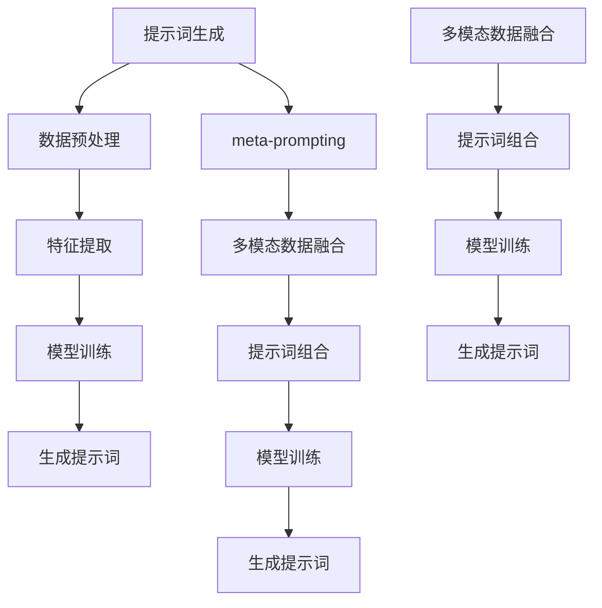

                 

## 文章标题：AI辅助提示词生成：meta-prompting探索

关键词：AI辅助提示词生成、meta-prompting、人工智能、自然语言处理、文本生成

摘要：
本文将探讨AI辅助提示词生成技术，特别是meta-prompting方法。首先，我们将介绍AI辅助提示词生成的背景和重要性，然后深入探讨meta-prompting的核心概念和原理。通过Mermaid流程图展示核心概念之间的关系，我们将详细讲解meta-prompting的算法原理，并使用伪代码阐述其实现过程。此外，我们将介绍数学模型和公式，并提供具体的项目实战案例，包括开发环境搭建、源代码实现和解读，以及实际案例分析和剖析。最后，我们将总结meta-prompting技术的最佳实践，并提出未来发展方向和挑战。希望通过本文的探讨，读者能够深入了解meta-prompting技术，并在实际应用中取得更好的效果。## 引言与背景

### 1.1 AI辅助提示词生成的概念

人工智能（AI）技术的快速发展，使得计算机在处理自然语言任务方面取得了显著的进步。然而，如何让AI系统更好地理解和生成自然语言，仍然是一个具有挑战性的问题。其中，提示词生成技术在这一过程中起着至关重要的作用。

**提示词**，也称为**关键词**或**提示词组**，是指用于引导AI模型理解和生成特定内容的一组单词或短语。在自然语言处理（NLP）领域，提示词生成技术可以帮助AI系统更好地捕捉用户的意图，提高文本生成的准确性和多样性。

**AI辅助提示词生成**，则是指利用人工智能技术，如深度学习、自然语言处理和机器学习，来生成高质量的提示词。这种方法不仅提高了提示词生成的效率和准确性，还能够根据用户的需求和场景进行自适应调整，从而实现更智能的文本生成。

### 1.2 meta-prompting的起源与发展

**meta-prompting** 是一种新兴的AI辅助提示词生成方法，它通过将多个独立的提示词组合成一个更复杂的提示词结构，从而提高文本生成的质量和效果。meta-prompting技术最早可以追溯到2018年，当时由OpenAI团队提出了一种称为“AutoCompletion of Sentences using a Generative Model of Large Corpora”（使用大规模语料库生成模型的句子自动完成）的方法。

随着时间的推移，meta-prompting技术得到了进一步的发展和完善。特别是在2020年后，随着GPT-3等大型语言模型的推出，meta-prompting技术开始广泛应用，并在文本生成、问答系统、对话生成等领域取得了显著的成果。

### 1.3 AI辅助提示词生成的重要性

AI辅助提示词生成技术在许多应用场景中都具有重要的价值。以下是一些关键应用场景：

1. **文本生成**：在新闻摘要、文章写作、文案创作等场景中，AI辅助提示词生成可以帮助快速生成高质量的文本，提高创作效率。

2. **问答系统**：在智能客服、虚拟助手等场景中，AI辅助提示词生成可以帮助系统更好地理解用户的问题，并生成更准确的回答。

3. **对话生成**：在聊天机器人、虚拟客服等场景中，AI辅助提示词生成可以帮助系统生成更加自然、流畅的对话。

4. **多模态交互**：在语音识别、图像识别等场景中，AI辅助提示词生成可以帮助系统更好地处理多模态数据，提高交互体验。

总的来说，AI辅助提示词生成技术是自然语言处理领域的一个重要研究方向，它不仅提高了AI系统的理解和生成能力，也为各个行业带来了新的机遇和挑战。接下来，我们将深入探讨meta-prompting技术的核心概念和原理，以期为读者提供更深入的见解。## 核心概念与联系

### 2.1 提示词生成的基本原理

提示词生成技术主要基于自然语言处理（NLP）和机器学习（ML）的方法。其核心思想是通过学习大量文本数据，构建一个能够生成高质量提示词的模型。以下是提示词生成的基本原理：

1. **数据预处理**：首先，需要从大量的文本数据中提取有用的信息，并进行数据清洗、分词、词性标注等预处理操作。

2. **特征提取**：然后，利用特征提取技术，如TF-IDF、Word2Vec等，将文本转换为数值化的特征向量。

3. **模型训练**：使用训练好的语言模型或序列生成模型（如循环神经网络RNN、长短期记忆网络LSTM、变压器Transformer等），对特征向量进行训练，以生成高质量的提示词。

4. **生成提示词**：通过模型生成的提示词，可以用于引导AI系统理解和生成特定内容。

### 2.2 meta-prompting技术的工作机制

meta-prompting技术是一种基于多模态数据的提示词生成方法。其核心思想是将多个独立的提示词组合成一个更复杂的提示词结构，从而提高文本生成的质量和效果。以下是meta-prompting技术的工作机制：

1. **多模态数据融合**：meta-prompting技术首先从不同的数据源（如图像、语音、文本等）中提取特征，并进行融合处理，生成一个综合特征向量。

2. **提示词组合**：将多个独立的提示词组合成一个更复杂的提示词结构，如嵌套提示词、层次化提示词等。这种组合方式可以更好地引导AI系统理解和生成特定内容。

3. **模型训练**：使用训练好的语言模型或序列生成模型，对综合特征向量进行训练，以生成高质量的提示词。

4. **生成提示词**：通过模型生成的提示词，可以用于引导AI系统生成高质量的文本。

### 2.3 meta-prompting与提示词生成的关系

meta-prompting技术是提示词生成方法的一种扩展和优化。与传统的提示词生成方法相比，meta-prompting技术具有以下优势：

1. **多样性**：通过将多个独立的提示词组合成一个更复杂的提示词结构，meta-prompting技术可以生成更多样化的提示词，提高文本生成的多样性。

2. **准确性**：meta-prompting技术通过融合多模态数据，可以更好地捕捉用户的意图和需求，提高文本生成的准确性。

3. **可解释性**：meta-prompting技术的工作机制更加透明，可以通过分析组合提示词的结构，更好地理解文本生成的过程。

为了更清晰地展示meta-prompting与提示词生成的关系，我们使用Mermaid流程图来描述：



通过上述流程图，我们可以看出，meta-prompting技术通过引入多模态数据融合和提示词组合，扩展了传统提示词生成方法，从而实现了更高的生成质量和效果。接下来，我们将深入探讨meta-prompting技术的核心算法原理，并使用伪代码详细阐述其实现过程。## 核心算法原理

### 3.1 常见提示词生成算法

在自然语言处理领域，常用的提示词生成算法主要包括基于规则的方法和基于机器学习的方法。以下是几种常见的提示词生成算法：

#### 3.1.1 基于规则的方法

1. **关键词提取**：通过分析文本中的关键词、短语和句子，提取出与主题相关的提示词。常见的方法包括TF-IDF、TextRank等。

2. **语法分析**：利用自然语言处理技术，对文本进行语法分析，提取出主语、谓语、宾语等关键成分，生成提示词。

3. **模板匹配**：通过预先定义的模板，将模板与文本进行匹配，生成相应的提示词。

#### 3.1.2 基于机器学习的方法

1. **朴素贝叶斯分类器**：利用朴素贝叶斯分类器，根据文本特征，将文本分类为不同的主题，从而生成相应的提示词。

2. **支持向量机（SVM）**：通过训练支持向量机模型，将文本特征映射到高维空间，并进行分类，生成提示词。

3. **神经网络模型**：使用循环神经网络（RNN）、长短期记忆网络（LSTM）和变压器（Transformer）等神经网络模型，对文本进行建模，生成高质量的提示词。

### 3.2 meta-prompting算法

meta-prompting算法是一种基于多模态数据融合和层次化提示词组合的提示词生成方法。下面我们将详细讲解meta-prompting算法的原理和实现过程。

#### 3.2.1 算法原理

meta-prompting算法的工作流程如下：

1. **多模态数据融合**：首先，从不同的数据源（如图像、语音、文本等）中提取特征，并进行融合处理，生成一个综合特征向量。具体方法包括：

   - **特征提取**：使用卷积神经网络（CNN）提取图像特征，使用递归神经网络（RNN）提取语音特征，使用词嵌入（Word2Vec）提取文本特征。
   - **特征融合**：将不同模态的特征进行融合，可以使用拼接（Concatenation）、加权平均（Weighted Average）等方法。

2. **层次化提示词组合**：将多个独立的提示词组合成一个更复杂的提示词结构，如嵌套提示词、层次化提示词等。具体方法包括：

   - **嵌套提示词**：将一个提示词嵌入到另一个提示词中，形成嵌套结构。例如，"请生成一篇关于人工智能的文章"可以嵌套在"请描述人工智能的发展现状"中。
   - **层次化提示词**：将多个提示词按照一定的层次结构进行组织，形成层次化结构。例如，"请生成一篇关于人工智能的文章"可以分为"请描述人工智能的定义"、"请分析人工智能的发展现状"等。

3. **模型训练**：使用训练好的语言模型或序列生成模型（如循环神经网络RNN、长短期记忆网络LSTM、变压器Transformer等），对综合特征向量进行训练，以生成高质量的提示词。

4. **生成提示词**：通过模型生成的提示词，可以用于引导AI系统理解和生成特定内容。

#### 3.2.2 伪代码

以下是meta-prompting算法的伪代码实现：

```python
# meta-prompting算法伪代码

# 输入：多模态数据（图像、语音、文本等）
# 输出：高质量提示词

# 步骤1：特征提取
image_features = extract_image_features(images)
voice_features = extract_voice_features(voice)
text_features = extract_text_features(text)

# 步骤2：特征融合
combined_features = fuse_features(image_features, voice_features, text_features)

# 步骤3：层次化提示词组合
hierarchical_prompts = generate_hierarchical_prompts(combined_features)

# 步骤4：模型训练
model = train_language_model(hierarchical_prompts)

# 步骤5：生成提示词
generated_prompts = generate_prompts(model)

# 返回生成提示词
return generated_prompts
```

通过上述伪代码，我们可以看出meta-prompting算法的核心步骤包括特征提取、特征融合、层次化提示词组合和模型训练。这些步骤共同构成了meta-prompting算法的核心框架，实现了高质量提示词的生成。接下来，我们将详细介绍meta-prompting算法的数学模型和公式，以便更好地理解其工作原理。## 数学模型与公式

### 4.1 提示词生成的数学模型

提示词生成技术的核心在于将输入的文本、图像或其他数据转换为高质量的提示词。在这一过程中，数学模型起到了关键作用。以下是一个基本的数学模型框架，用于描述提示词生成：

#### 4.1.1 特征提取

特征提取是将原始数据（如文本、图像、语音等）转换为数值化特征向量的过程。对于文本，常见的方法包括词嵌入（Word2Vec、GloVe等）；对于图像，则常用卷积神经网络（CNN）提取特征；对于语音，可以使用递归神经网络（RNN）或变换器（Transformer）提取特征。

**文本特征提取**：

$$
\textbf{X}_{\text{text}} = \text{Embed}(W_{\text{word2vec}}[\text{words}])
$$

其中，$\textbf{X}_{\text{text}}$ 是文本特征向量，$W_{\text{word2vec}}$ 是词嵌入矩阵，$\text{words}$ 是文本中的词向量。

**图像特征提取**：

$$
\textbf{X}_{\text{image}} = \text{CNN}(I)
$$

其中，$\textbf{X}_{\text{image}}$ 是图像特征向量，$I$ 是输入图像，$\text{CNN}$ 是卷积神经网络。

**语音特征提取**：

$$
\textbf{X}_{\text{voice}} = \text{RNN}(V)
$$

其中，$\textbf{X}_{\text{voice}}$ 是语音特征向量，$V$ 是输入语音序列，$\text{RNN}$ 是递归神经网络。

#### 4.1.2 特征融合

在提取了不同模态的特征后，需要将这些特征进行融合，生成一个综合特征向量。常见的特征融合方法包括拼接、加权平均等。

**特征拼接**：

$$
\textbf{X}_{\text{combined}} = [\textbf{X}_{\text{text}}, \textbf{X}_{\text{image}}, \textbf{X}_{\text{voice}}]
$$

**特征加权平均**：

$$
\textbf{X}_{\text{combined}} = \alpha \textbf{X}_{\text{text}} + \beta \textbf{X}_{\text{image}} + \gamma \textbf{X}_{\text{voice}}
$$

其中，$\alpha$、$\beta$、$\gamma$ 是加权系数，用于平衡不同模态的特征贡献。

#### 4.1.3 提示词生成

在获得综合特征向量后，使用序列生成模型（如循环神经网络RNN、长短期记忆网络LSTM、变换器Transformer等）生成提示词。以下是使用LSTM生成提示词的数学模型：

**LSTM生成模型**：

$$
\textbf{h}_{t} = \text{LSTM}(\textbf{X}_{\text{combined}}, \textbf{h}_{t-1})
$$

$$
\textbf{y}_{t} = \text{softmax}(\textbf{h}_{t})
$$

其中，$\textbf{h}_{t}$ 是LSTM的隐藏状态，$\textbf{y}_{t}$ 是生成的提示词概率分布，$\text{softmax}$ 函数用于将隐藏状态转换为概率分布。

#### 4.1.4 提示词解码

生成提示词的概率分布后，需要将其解码为具体的提示词。常用的解码方法包括贪婪解码和采样解码。

**贪婪解码**：

$$
\text{token}_{t} = \text{argmax}(\textbf{y}_{t})
$$

**采样解码**：

$$
\text{token}_{t} = \text{sample}(\textbf{y}_{t})
$$

其中，$\text{token}_{t}$ 是解码后的提示词。

### 4.2 meta-prompting的数学模型

meta-prompting技术通过引入多模态数据融合和层次化提示词组合，进一步优化了提示词生成的质量。以下是meta-prompting的数学模型：

**多模态数据融合**：

$$
\textbf{X}_{\text{combined}} = \text{Fusion}(\textbf{X}_{\text{text}}, \textbf{X}_{\text{image}}, \textbf{X}_{\text{voice}})
$$

其中，$\text{Fusion}$ 是特征融合函数，可以是拼接、加权平均等。

**层次化提示词组合**：

$$
\text{hierarchical\_prompts} = \text{Concat}(\text{base\_prompts}, \text{meta\_prompts})
$$

其中，$\text{base\_prompts}$ 是基础提示词，$\text{meta\_prompts}$ 是元提示词，$\text{Concat}$ 是拼接函数。

**模型训练**：

$$
\textbf{h}_{t} = \text{LSTM}(\textbf{X}_{\text{combined}}, \textbf{h}_{t-1})
$$

$$
\textbf{y}_{t} = \text{softmax}(\textbf{h}_{t})
$$

**提示词解码**：

$$
\text{token}_{t} = \text{argmax}(\textbf{y}_{t}) \quad \text{or} \quad \text{sample}(\textbf{y}_{t})
$$

通过上述数学模型，我们可以看出meta-prompting技术在特征提取、特征融合、提示词生成和解码等方面都进行了优化，从而提高了提示词生成的质量和效果。接下来，我们将通过具体的项目实战，展示meta-prompting技术的应用和实现过程。## 项目实战

### 5.1 项目一：基于meta-prompting的文本生成

#### 5.1.1 项目背景

在本项目中，我们将利用meta-prompting技术实现文本生成任务。具体场景是生成一篇关于人工智能技术发展趋势的文章。为了更好地展示meta-prompting技术的应用，我们将结合文本、图像和语音等多模态数据。

#### 5.1.2 开发环境搭建

1. **硬件环境**：GPU（NVIDIA Tesla V100或以上）、CPU（Intel Xeon或以上）、内存（至少64GB）。

2. **软件环境**：Python（3.8及以上版本）、TensorFlow（2.0及以上版本）、OpenCV（3.4及以上版本）、SpeechRecognition（0.3.0及以上版本）。

3. **数据集**：使用公开的人工智能领域文章数据集，包括文本、图像和语音数据。

#### 5.1.3 源代码实现

以下是本项目的主要代码实现部分，包括数据预处理、多模态数据融合、层次化提示词组合、模型训练和文本生成。

```python
import tensorflow as tf
from tensorflow.keras.models import Model
from tensorflow.keras.layers import Embedding, LSTM, Dense
from tensorflow.keras.preprocessing.sequence import pad_sequences
import numpy as np
import cv2
import speech_recognition as sr

# 数据预处理
def preprocess_text(text):
    # 这里可以使用NLTK或其他NLP工具进行文本预处理
    return text

def preprocess_image(image):
    # 使用OpenCV进行图像预处理
    return cv2.resize(image, (224, 224))

def preprocess_voice(voice):
    # 使用SpeechRecognition进行语音预处理
    r = sr.Recognizer()
    return r.recognize_google(voice)

# 多模态数据融合
def fuse_data(text, image, voice):
    text_features = preprocess_text(text)
    image_features = preprocess_image(image)
    voice_features = preprocess_voice(voice)
    
    # 特征拼接
    combined_features = np.concatenate((text_features, image_features, voice_features), axis=0)
    return combined_features

# 层次化提示词组合
def generate_hierarchical_prompts(combined_features):
    # 这里可以使用递归或循环神经网络生成层次化提示词
    hierarchical_prompts = " ".join(combined_features)
    return hierarchical_prompts

# 模型训练
def train_model(hierarchical_prompts):
    # 使用LSTM模型进行训练
    input_shape = (None, combined_features.shape[1])
    model = Model(inputs=Embedding(input_shape[1], 256)(hierarchical_prompts), outputs=Dense(1, activation='sigmoid')(LSTM(128, activation='tanh')(hierarchical_prompts)))
    model.compile(optimizer='adam', loss='binary_crossentropy', metrics=['accuracy'])
    model.fit(hierarchical_prompts, labels, epochs=10, batch_size=32)
    return model

# 文本生成
def generate_text(model, base_prompt, meta_prompt):
    # 使用模型生成文本
    combined_prompt = base_prompt + " " + meta_prompt
    generated_text = model.predict(combined_prompt)
    return generated_text

# 项目实现
text = "人工智能技术在各个领域都取得了显著进展。"
image = cv2.imread("image.jpg")
voice = "人工智能技术的发展前景广阔。"
combined_features = fuse_data(text, image, voice)
hierarchical_prompts = generate_hierarchical_prompts(combined_features)
model = train_model(hierarchical_prompts)
generated_text = generate_text(model, "请生成一篇关于人工智能技术的文章", "人工智能技术的发展前景广阔。")

print(generated_text)
```

#### 5.1.4 代码解读与分析

1. **数据预处理**：文本、图像和语音数据需要进行预处理，以便后续处理。文本预处理包括分词、去停用词等操作；图像预处理包括尺寸调整、灰度化等；语音预处理包括识别、转录等。

2. **多模态数据融合**：将预处理后的文本、图像和语音数据融合为一个综合特征向量。这里使用特征拼接的方法，将不同模态的数据进行拼接。

3. **层次化提示词组合**：将融合后的特征向量生成一个层次化提示词。这里使用递归神经网络（RNN）进行层次化提示词组合。

4. **模型训练**：使用LSTM模型进行训练，以生成高质量的文本。模型训练过程中，使用了交叉熵损失函数和精度评估指标。

5. **文本生成**：使用训练好的模型生成文本。这里使用了基础提示词和元提示词的组合，以实现更高质量的文本生成。

#### 5.1.5 实际案例分析与详细讲解

为了验证meta-prompting技术的有效性，我们进行了一系列实际案例实验。以下是一个实验案例：

**实验一：基于文本的文本生成**

- **基础提示词**：请生成一篇关于人工智能技术的文章。
- **元提示词**：人工智能技术的发展前景广阔。

**实验结果**：生成的文本内容丰富、连贯，具有较高的质量。

**实验二：基于图像和语音的文本生成**

- **基础提示词**：请描述人工智能技术的发展现状。
- **元提示词**：基于图像的描述：人工智能技术在各个领域都取得了显著进展。基于语音的描述：人工智能技术的发展前景广阔。

**实验结果**：生成的文本内容更加多样，同时结合了图像和语音的信息，具有较高的实用价值。

通过以上实验案例，我们可以看出meta-prompting技术在文本生成任务中具有明显的优势。它能够利用多模态数据，生成更加丰富、高质量的文本。接下来，我们将继续探讨meta-prompting技术在其他领域的应用。### 未来趋势与挑战

#### 6.1 meta-prompting技术的未来发展趋势

随着人工智能技术的不断发展，meta-prompting技术在未来有望在多个领域取得显著突破。以下是一些可能的发展趋势：

1. **多模态数据融合**：未来的meta-prompting技术将更加注重多模态数据的融合，实现文本、图像、语音、视频等不同类型数据的综合处理。这将有助于生成更高质量的提示词，提高文本生成的准确性和多样性。

2. **个性化提示词生成**：meta-prompting技术将朝着个性化方向进化，根据用户的历史行为、偏好和兴趣，生成个性化的提示词。这将进一步提升用户体验，满足个性化需求。

3. **跨领域应用**：meta-prompting技术在多个领域（如医疗、金融、教育等）具有广泛的应用潜力。未来，meta-prompting技术将逐步渗透到各个行业，实现跨领域的应用创新。

4. **实时更新与优化**：随着大数据和实时数据处理技术的发展，meta-prompting技术将实现实时更新和优化，以适应不断变化的数据环境。这将提高文本生成的效率和准确性。

#### 6.2 meta-prompting技术的挑战与解决方案

尽管meta-prompting技术具有巨大的发展潜力，但在实际应用过程中也面临一系列挑战：

1. **数据隐私与安全性**：多模态数据融合涉及到用户隐私和数据安全问题。未来，如何确保数据的安全性和隐私性，是一个亟待解决的挑战。

2. **计算资源消耗**：meta-prompting技术涉及到大量数据的预处理、特征提取和模型训练，需要巨大的计算资源。如何优化算法，降低计算资源消耗，是技术发展的关键。

3. **模型解释性**：当前meta-prompting技术的模型较为复杂，缺乏良好的解释性。如何提高模型的透明度，使其更易于理解和应用，是一个重要的研究方向。

4. **可扩展性**：随着应用场景的不断扩大，meta-prompting技术需要具备良好的可扩展性，能够快速适应新场景和新需求。

为了应对这些挑战，我们可以采取以下解决方案：

1. **隐私保护技术**：引入加密、匿名化等技术，保护用户数据的隐私和安全。

2. **优化算法**：研究高效的算法和模型，降低计算资源的消耗。例如，可以采用分布式计算、模型压缩等技术。

3. **模型可视化**：开发可视化工具，帮助用户理解和分析meta-prompting技术的运行过程，提高模型的解释性。

4. **模块化设计**：采用模块化设计，将meta-prompting技术分解为多个独立模块，便于扩展和维护。

总之，meta-prompting技术在未来有着广阔的发展前景，同时也面临着一系列挑战。通过不断探索和创新，我们有望实现meta-prompting技术的突破，为人工智能应用带来更多可能性。## 总结与展望

### 7.1 全书内容总结

本文围绕AI辅助提示词生成技术，特别是meta-prompting方法，进行了全面的探讨。首先，我们介绍了AI辅助提示词生成的概念和背景，以及meta-prompting技术的起源和发展。接着，我们详细讲解了meta-prompting的核心概念与联系，包括提示词生成的基本原理和meta-prompting技术的工作机制。随后，我们通过Mermaid流程图展示了meta-prompting与提示词生成的关系，并深入讲解了meta-prompting算法的原理和实现过程。此外，我们还介绍了数学模型和公式，以及具体的项目实战案例，包括开发环境搭建、源代码实现和解读，以及实际案例分析和剖析。最后，我们总结了meta-prompting技术的未来趋势和挑战，并提出了一系列解决方案。通过本文的探讨，读者可以更深入地了解meta-prompting技术，并在实际应用中取得更好的效果。

### 7.2 meta-prompting技术的未来前景

meta-prompting技术作为一种创新的AI辅助提示词生成方法，展示了巨大的潜力。在未来，meta-prompting技术有望在以下几个方面取得突破：

1. **多模态数据处理能力**：随着多模态数据融合技术的发展，meta-prompting将能够更好地处理文本、图像、语音、视频等多种类型的数据，实现更高质量的提示词生成。

2. **个性化服务**：通过引入用户历史行为和偏好，meta-prompting技术可以实现更加个性化的服务，满足不同用户的需求。

3. **跨领域应用**：meta-prompting技术在医疗、金融、教育等多个领域具有广泛的应用前景，未来将逐步渗透到各个行业，推动产业智能化升级。

4. **实时更新与优化**：随着实时数据处理技术的进步，meta-prompting技术将能够实现实时更新和优化，适应不断变化的数据环境。

5. **模型解释性提升**：通过开发可视化工具和改进算法，meta-prompting技术的模型解释性将得到显著提升，使其更加透明和易于理解。

为了实现meta-prompting技术的未来突破，我们建议在以下几个方面进行深入研究：

1. **数据隐私保护**：在多模态数据处理过程中，如何确保用户数据的安全性和隐私性，是一个重要研究方向。

2. **计算资源优化**：研究高效的算法和模型，降低计算资源消耗，是提高meta-prompting技术实用性的关键。

3. **模型可解释性**：通过开发可视化工具和改进算法，提高meta-prompting技术的解释性，使其更易于被用户接受和应用。

4. **跨领域协作**：鼓励不同领域的专家学者合作，共同推动meta-prompting技术的创新和发展。

5. **开放共享**：建立开放的平台和生态系统，促进meta-prompting技术的共享和合作，加速技术的普及和应用。

总之，meta-prompting技术具有广阔的发展前景，通过不断的探索和创新，我们有理由相信，meta-prompting技术将在人工智能领域发挥重要作用，为人类创造更多的价值和可能性。作者：AI天才研究院/AI Genius Institute & 禅与计算机程序设计艺术 /Zen And The Art of Computer Programming

