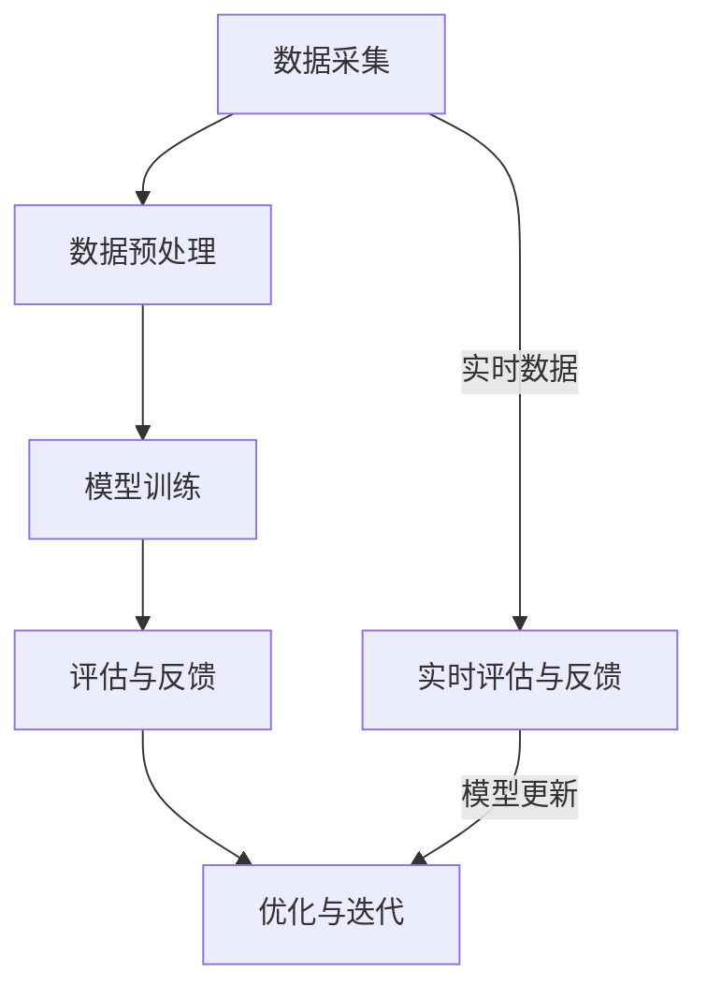

                 


### 1. AI辅助教育评估概述

在当前信息化社会中，人工智能（AI）技术以其强大的数据处理能力和智能推理能力，正逐渐融入各个领域，教育评估也不例外。AI辅助教育评估利用机器学习和数据挖掘技术，通过对学生表现数据的分析，提供客观、科学的评估结果，从而优化教育质量，提高教育效率。

#### 1.1 背景和意义

教育评估是教育过程中至关重要的一环，其目的是了解学生的学习状况，指导教师的教学工作，以及为学生提供反馈。然而，传统教育评估方法往往依赖于人工，效率低下，且难以量化。随着大数据和人工智能技术的发展，利用AI进行教育评估成为可能。

AI辅助教育评估的意义主要体现在以下几个方面：

1. **提升评估效率**：通过自动化处理学生数据，大幅减少评估时间，提高评估效率。
2. **提供个性化反馈**：AI可以根据学生的个体差异，提供针对性的反馈，帮助教师更好地指导学生。
3. **数据驱动决策**：AI辅助教育评估可以基于数据分析，为教育管理者提供科学依据，优化教育资源配置。
4. **促进学生自主学习**：AI系统可以为学生提供个性化的学习路径，激发学生的学习兴趣和动力。

#### 1.2 应用现状

目前，AI技术在教育评估中的应用已经取得了一些成果。以下是一些典型的应用实例：

1. **学习分析系统**：通过分析学生的学习行为数据，评估学生的学习状态和学习效果。
2. **智能测验系统**：利用自然语言处理和计算机视觉技术，自动生成和批改考试题目。
3. **智能评估助手**：通过对话系统，为学生提供即时反馈和个性化指导。
4. **智能课堂管理**：利用传感器和视频分析技术，实时监控课堂情况，为教师提供教学支持。

#### 1.3 提示词设计的作用

在教育评估中，提示词（Prompt）是引导学生进行思考和学习的关键因素。设计有效的提示词，可以激发学生的思考，提高学生的参与度，从而提高评估效果。提示词设计的关键在于：

1. **明确目标**：提示词应明确指导学生需要完成的任务或需要思考的问题。
2. **激发兴趣**：提示词应富有吸引力，能够激发学生的好奇心和探索欲。
3. **逻辑清晰**：提示词的表述应清晰、连贯，便于学生理解和操作。
4. **多样性和灵活性**：提示词的设计应多样化，以适应不同的评估目标和情境。

在下一章中，我们将深入探讨AI辅助教育评估的核心概念和联系，包括教育评估的基本原理、AI辅助教育评估的关键概念和架构。同时，我们将使用Mermaid流程图展示AI辅助教育评估的整体架构，帮助读者更好地理解这一复杂系统的运作原理。

## 2. AI辅助教育评估核心概念与联系

### 2.1 教育评估的基本原理

教育评估是教育过程中不可或缺的一部分，其主要目的是了解学生的学习成果，从而指导教师的教学行为和学生的学习方向。教育评估的基本原理可以概括为以下几个方面：

1. **目标导向**：教育评估应围绕教育目标进行，通过评估来衡量学生是否达到了预期的学习目标。
2. **客观性**：评估过程应尽量减少主观因素的影响，确保评估结果的公正性和客观性。
3. **综合性**：教育评估不仅应关注学生的学术成绩，还应考虑学生的综合素质，如思维能力、人际交往能力等。
4. **动态性**：教育评估应是一个持续的过程，通过不断的评估和反馈，帮助学生实现持续进步。

### 2.2 AI辅助教育评估的关键概念

AI辅助教育评估涉及多个关键概念，以下是一些主要的术语及其解释：

1. **学习分析（Learning Analytics）**：通过对学生产生的数据进行收集、存储、分析和解释，以了解学生的学习行为、学习进展和学习成效。
2. **数据挖掘（Data Mining）**：从大量数据中提取有价值的信息和模式，用于支持教育决策和优化教学过程。
3. **机器学习（Machine Learning）**：使计算机系统能够从数据中学习和改进，以便在新的数据上进行预测和决策。
4. **自然语言处理（Natural Language Processing, NLP）**：使计算机能够理解、生成和处理人类语言的技术。
5. **计算机视觉（Computer Vision）**：使计算机能够从图像或视频中提取信息的技术。

### 2.3 AI辅助教育评估的架构

AI辅助教育评估通常包括以下几个主要组成部分：

1. **数据采集**：收集学生的学习数据，包括考试成绩、学习行为数据、作业提交情况等。
2. **数据预处理**：清洗和转换原始数据，使其适合进行进一步的分析。
3. **模型训练**：利用机器学习算法，从数据中训练出评估模型。
4. **评估与反馈**：使用训练好的模型对学生的表现进行评估，并提供反馈。
5. **优化与迭代**：根据评估结果，不断优化评估模型，提高评估的准确性和有效性。

### 2.4 Mermaid流程图展示AI辅助教育评估架构

为了更直观地展示AI辅助教育评估的整体架构，我们使用Mermaid流程图进行描述：



在这个流程图中，A代表数据采集环节，B是数据预处理，C是模型训练，D是评估与反馈，E是优化与迭代。实时数据采集部分（F）可以实时提供数据，用于实时评估和反馈，并根据模型更新进行迭代。

### 2.5 总结

通过上述核心概念和架构的介绍，我们可以看出，AI辅助教育评估是一个复杂但极具潜力的系统。它不仅需要收集和预处理大量的学生数据，还需要利用机器学习和自然语言处理等先进技术进行模型训练和评估。在下一章中，我们将深入探讨提示词设计与优化的原理和方法，帮助读者更好地理解如何通过有效的提示词设计来提高教育评估的效果。

## 3. 提示词设计与优化

### 3.1 提示词设计的基本原则

提示词（Prompt）是引导学生在评估过程中进行思考和学习的关键因素。设计有效的提示词，可以显著提高评估的准确性和有效性。以下是提示词设计的基本原则：

1. **明确性**：提示词应明确、具体，避免模糊不清或歧义，使学生能够清晰理解任务要求。
2. **针对性**：提示词应针对学生的具体学习内容和评估目标进行设计，确保评估内容与教学目标一致。
3. **启发性**：提示词应具有启发性，能够激发学生的思考，引导他们探索更深层次的问题。
4. **多样性**：提示词的设计应多样化，以适应不同的评估目标和情境，避免学生产生疲劳感。
5. **灵活性**：提示词的设计应具有一定的灵活性，可以根据实际情况进行调整，以适应不同的评估需求。

### 3.2 提示词的优化方法

为了提高提示词的有效性，我们需要采用一些优化方法。以下是一些常用的提示词优化方法：

1. **内容丰富性**：通过增加提示词的背景信息、相关知识和扩展内容，使提示词更加丰富，有助于学生理解问题背景。
2. **情境相关性**：设计情境相关的提示词，将问题置于具体情境中，使学生在真实情境中思考问题，提高问题的实际意义。
3. **互动性**：设计互动性的提示词，鼓励学生积极参与评估过程，如提出问题、分享观点等，增强评估的互动性。
4. **适应性**：根据学生的个体差异和评估目标，动态调整提示词，使其更适应不同的学生和评估情境。
5. **反馈性**：设计能够提供即时反馈的提示词，帮助学生及时了解自己的表现，并进行调整。

### 3.3 提示词设计的实战案例

为了更好地理解提示词设计的方法和应用，以下是一个具体的实战案例：

**案例背景**：某在线教育平台希望设计一套自动评估学生写作能力的系统，通过提示词引导学生进行写作，并利用机器学习算法进行评估。

**提示词设计**：
- **基础型提示词**：引导学生完成基本的写作任务，如“请描述你最喜欢的城市，并说明原因。”
- **拓展型提示词**：鼓励学生进行深入思考，如“在描述你最喜欢的城市时，你是否能引用一些具体的历史事件或文化背景？”
- **问题型提示词**：通过提出问题，引导学生进行批判性思考，如“你认为你最喜欢的城市有哪些潜在的改进空间？”

**优化方法应用**：
- **内容丰富性**：在基础型提示词中加入关于城市的历史和文化背景信息，帮助学生更好地理解写作主题。
- **情境相关性**：将提示词与学生的生活经历相结合，使问题更具实际意义。
- **互动性**：设计问题型提示词，鼓励学生在写作过程中提出自己的观点和问题。
- **适应性**：根据学生的写作能力和评估目标，动态调整提示词的难度和类型。

### 3.4 伪代码示例：提示词优化算法

以下是一个简单的伪代码示例，用于说明提示词优化算法的基本框架：

```python
def optimize_prompt(prompt, student_info, assessment_target):
    # 根据学生信息和评估目标，调整提示词的难度和类型
    adjusted_prompt = adjust_prompt_difficulty(prompt, student_info, assessment_target)
    
    # 增加提示词的背景信息
    enriched_prompt = add_background_info(adjusted_prompt)
    
    # 根据情境相关性，调整提示词
    context_relevant_prompt = adjust_prompt_context(enriched_prompt)
    
    # 增加互动性元素
    interactive_prompt = add_interactive_elements(context_relevant_prompt)
    
    return interactive_prompt

def adjust_prompt_difficulty(prompt, student_info, assessment_target):
    # 根据学生信息和评估目标，调整提示词的难度
    # ...
    return adjusted_prompt

def add_background_info(prompt):
    # 添加背景信息
    # ...
    return enriched_prompt

def adjust_prompt_context(prompt):
    # 调整提示词的情境相关性
    # ...
    return context_relevant_prompt

def add_interactive_elements(prompt):
    # 添加互动性元素
    # ...
    return interactive_prompt
```

通过上述实战案例和伪代码示例，我们可以看出，提示词设计不仅需要遵循基本原则，还需要采用多种优化方法，以提高其有效性。在下一章中，我们将进一步探讨教育评估中常用的机器学习算法，包括其基本原理和应用。

### 4. 教育评估中的机器学习算法

机器学习算法在教育评估中扮演着关键角色，通过这些算法，我们可以从大量的学生数据中提取有价值的信息，为教育决策提供支持。以下是一些常见的机器学习算法及其在教育评估中的应用。

#### 4.1 常见机器学习算法概述

1. **线性回归（Linear Regression）**：线性回归是一种简单但强大的预测模型，适用于预测连续值。它通过找到自变量和因变量之间的线性关系，来预测新的数据点。
2. **逻辑回归（Logistic Regression）**：逻辑回归主要用于分类任务，它通过找到自变量和因变量之间的逻辑关系，预测新的数据点属于哪个类别。
3. **支持向量机（Support Vector Machine, SVM）**：SVM是一种强大的分类算法，通过寻找一个最佳的超平面，将不同类别的数据点分开。
4. **决策树（Decision Tree）**：决策树是一种基于树形结构的数据挖掘算法，通过一系列判断规则，将数据划分为不同的类别或数值。
5. **随机森林（Random Forest）**：随机森林是一种集成学习方法，通过构建多个决策树，并结合它们的预测结果，提高分类或回归的准确性。
6. **神经网络（Neural Network）**：神经网络是一种模仿人脑结构和功能的算法，通过多层神经元进行信息处理和传递，可以用于复杂的预测和分类任务。

#### 4.2 机器学习算法在AI辅助教育评估中的应用

1. **成绩预测**：通过机器学习算法，我们可以根据学生的历史成绩和学习行为数据，预测他们在未来考试中的表现。
2. **学习状态分析**：机器学习算法可以帮助我们识别学生的学习状态，如是否处于瓶颈期或需要额外帮助。
3. **学习行为模式识别**：通过分析学生的学习行为数据，我们可以识别出学生的学习习惯和偏好，为个性化教学提供依据。
4. **教师教学质量评估**：机器学习算法可以分析学生的反馈数据，评估教师的教学质量，并为教师提供改进建议。

#### 4.3 机器学习算法的数学模型和公式

以下简要介绍上述常见机器学习算法的数学模型和公式：

1. **线性回归**：

   假设我们有 $m$ 个样本，每个样本包含 $n$ 个特征和目标值 $y$，则线性回归模型可以表示为：

   $$ 
   y = \mathbf{w}^T \mathbf{x} + b 
   $$

   其中，$\mathbf{w}$ 是权重向量，$\mathbf{x}$ 是特征向量，$b$ 是偏置项。

2. **逻辑回归**：

   逻辑回归的目标是预测一个概率值，使得目标变量 $y$ 属于某个类别。假设 $y$ 只有两个类别（0和1），则逻辑回归的模型公式为：

   $$ 
   \sigma(\mathbf{w}^T \mathbf{x} + b) = \frac{1}{1 + e^{-(\mathbf{w}^T \mathbf{x} + b)}}
   $$

   其中，$\sigma$ 是逻辑函数（Sigmoid函数）。

3. **支持向量机**：

   支持向量机的目标是找到一个最佳的超平面，将不同类别的数据点分开。假设我们有两个类别，正类和负类，则支持向量机的目标函数为：

   $$ 
   \min_{\mathbf{w}, b} \frac{1}{2} ||\mathbf{w}||^2 
   $$

   其中，$\mathbf{w}$ 是权重向量，$b$ 是偏置项。

4. **决策树**：

   决策树的构建过程是通过选择最优特征并进行分割，从而生成一个树形结构。每次分割都基于一个不等式：

   $$ 
   x_i \geq \theta 
   $$

   其中，$x_i$ 是特征值，$\theta$ 是分割阈值。

5. **神经网络**：

   神经网络由多个神经元层组成，每个神经元接收来自前一层的输入，通过激活函数进行处理，然后传递到下一层。一个简单的神经网络可以表示为：

   $$ 
   a_{\text{layer\_i}}^{l+1} = \sigma(\mathbf{w}^T a_{\text{layer\_i}}^l + b) 
   $$

   其中，$a_{\text{layer\_i}}^{l+1}$ 是第$l+1$层的输出，$\sigma$ 是激活函数，$\mathbf{w}$ 是权重，$b$ 是偏置项。

#### 4.4 伪代码示例：机器学习算法应用

以下是一个简单的伪代码示例，用于说明如何应用机器学习算法进行教育评估：

```python
def train_model(algorithm, X, y):
    # 初始化模型参数
    model = initialize_model(algorithm)
    
    # 训练模型
    for epoch in range(num_epochs):
        for x, y in zip(X, y):
            # 前向传播
            predictions = forward_pass(model, x)
            
            # 计算损失
            loss = compute_loss(predictions, y)
            
            # 反向传播
            gradients = backward_pass(model, predictions, y)
            
            # 更新模型参数
            update_model(model, gradients)
    
    return model

def predict(model, X):
    # 进行预测
    predictions = []
    for x in X:
        prediction = forward_pass(model, x)
        predictions.append(prediction)
    
    return predictions

# 数据集
X = load_data()
y = load_labels()

# 训练模型
model = train_model(algorithm='linear_regression', X=X, y=y)

# 预测
predictions = predict(model, X)

# 计算准确率
accuracy = calculate_accuracy(predictions, y)
print("Accuracy:", accuracy)
```

通过上述示例，我们可以看到，机器学习算法在教育评估中的应用主要包括数据预处理、模型训练、模型预测和评估等步骤。在下一章中，我们将进一步探讨数学模型和公式的详细讲解与应用。

## 5. 数学模型与公式详解

### 5.1 教育评估中的统计模型

在教育评估中，统计模型用于分析学生表现数据，预测学生成绩或评估教学方法的效果。以下是一些常用的统计模型及其基本原理：

#### 5.1.1 线性回归模型

线性回归模型是最基本的统计模型之一，用于预测连续值。其公式如下：

$$
y = \beta_0 + \beta_1 x_1 + \beta_2 x_2 + ... + \beta_n x_n + \epsilon
$$

其中，$y$ 是预测的目标值，$x_1, x_2, ..., x_n$ 是自变量，$\beta_0, \beta_1, \beta_2, ..., \beta_n$ 是模型参数，$\epsilon$ 是误差项。

线性回归模型的目的是通过最小化误差项来估计模型参数。

#### 5.1.2 逻辑回归模型

逻辑回归模型是一种常用的分类模型，用于预测二分类结果。其公式如下：

$$
P(y=1) = \frac{1}{1 + e^{-(\beta_0 + \beta_1 x_1 + \beta_2 x_2 + ... + \beta_n x_n)}}
$$

其中，$P(y=1)$ 是目标变量为1的概率，$\beta_0, \beta_1, \beta_2, ..., \beta_n$ 是模型参数。

逻辑回归模型通过最大化似然函数来估计模型参数。

#### 5.1.3 方差分析（ANOVA）

方差分析（ANOVA）用于比较多个样本的平均值，以确定它们之间是否存在显著差异。其基本公式如下：

$$
F = \frac{\sum_{i=1}^{k} \frac{(M_i - \bar{M})^2}{N_i - 1}}{\frac{\sum_{i=1}^{k} \sum_{j=1}^{N_i} (X_{ij} - M_i)^2}{N - k}}
$$

其中，$F$ 是F值，$M_i$ 是第$i$个组的平均值，$\bar{M}$ 是所有组的平均值，$N_i$ 是第$i$个组的样本数量，$X_{ij}$ 是第$i$个组中的第$j$个样本值，$N$ 是总样本数量。

#### 5.1.4 判定系数（R²）

判定系数（R²）用于衡量模型对数据的拟合程度，其公式如下：

$$
R^2 = 1 - \frac{\sum_{i=1}^{n} (y_i - \hat{y}_i)^2}{\sum_{i=1}^{n} (y_i - \bar{y})^2}
$$

其中，$y_i$ 是实际值，$\hat{y}_i$ 是预测值，$\bar{y}$ 是平均值。

R²的值介于0和1之间，越接近1，表示模型对数据的拟合程度越高。

### 5.2 提示词相关性计算

提示词相关性计算是评估提示词设计有效性的重要方法。以下是一些常用的相关性计算方法：

#### 5.2.1 皮尔逊相关系数

皮尔逊相关系数（Pearson correlation coefficient）是一种常用的线性相关性度量方法，其公式如下：

$$
\rho = \frac{\sum_{i=1}^{n} (x_i - \bar{x})(y_i - \bar{y})}{\sqrt{\sum_{i=1}^{n} (x_i - \bar{x})^2} \sqrt{\sum_{i=1}^{n} (y_i - \bar{y})^2}}
$$

其中，$x_i$ 和 $y_i$ 是提示词和评估结果，$\bar{x}$ 和 $\bar{y}$ 是它们的平均值。

皮尔逊相关系数的值介于-1和1之间，越接近1（或-1），表示提示词和评估结果之间的线性相关性越强。

#### 5.2.2 斯皮尔曼相关系数

斯皮尔曼相关系数（Spearman correlation coefficient）是一种非参数的相关性度量方法，适用于非正态分布的数据。其公式如下：

$$
\rho_s = 1 - \frac{6 \sum_{i=1}^{n} (D_i^2)}{n(n^2 - 1)}
$$

其中，$D_i = x_i - y_i$，$x_i$ 和 $y_i$ 是提示词和评估结果。

斯皮尔曼相关系数的值介于-1和1之间，越接近1（或-1），表示提示词和评估结果之间的单调相关性越强。

### 5.3 教育评估中的回归模型

回归模型是教育评估中最常用的统计模型之一，用于预测学生的成绩或其他连续值。以下是一些常见的回归模型：

#### 5.3.1 多元线性回归模型

多元线性回归模型是一种用于预测多个自变量对因变量的影响的模型，其公式如下：

$$
y = \beta_0 + \beta_1 x_1 + \beta_2 x_2 + ... + \beta_n x_n + \epsilon
$$

其中，$y$ 是预测的目标值，$x_1, x_2, ..., x_n$ 是自变量，$\beta_0, \beta_1, \beta_2, ..., \beta_n$ 是模型参数，$\epsilon$ 是误差项。

多元线性回归模型的目的是通过最小化误差项来估计模型参数。

#### 5.3.2 多项式回归模型

多项式回归模型是一种将自变量的多项式与因变量相关的模型，其公式如下：

$$
y = \beta_0 + \beta_1 x_1 + \beta_2 x_1^2 + ... + \beta_n x_1^n + \epsilon
$$

其中，$y$ 是预测的目标值，$x_1, x_2, ..., x_n$ 是自变量，$\beta_0, \beta_1, \beta_2, ..., \beta_n$ 是模型参数，$\epsilon$ 是误差项。

多项式回归模型的目的是通过最小化误差项来估计模型参数。

### 5.4 举例说明数学模型在实际中的应用

以下是一个简单的实际案例，说明如何应用多元线性回归模型进行教育评估。

**案例背景**：某学校希望预测学生的期末考试成绩，以便及时发现并帮助学习困难的学生。

**数据收集**：收集了100名学生的期末考试成绩和学习行为数据，包括上课出勤率、作业提交率、课堂参与度等。

**数据处理**：将数据分为自变量（$x_1, x_2, x_3$）和因变量（$y$），并进行预处理，如标准化处理。

**模型训练**：使用多元线性回归模型进行训练，得到模型参数：

$$
y = \beta_0 + \beta_1 x_1 + \beta_2 x_2 + \beta_3 x_3 + \epsilon
$$

**模型评估**：使用训练集和测试集对模型进行评估，计算R²值，以衡量模型对数据的拟合程度。

**模型预测**：使用训练好的模型对新的学生数据进行预测，以便及时发现学习困难的学生。

通过上述实际案例，我们可以看到，数学模型在教育评估中的应用，不仅可以帮助学校更准确地预测学生成绩，还可以为个性化教学提供科学依据，提高教育质量。

### 总结

在本章中，我们详细介绍了教育评估中常用的统计模型、提示词相关性计算方法以及回归模型。通过这些数学模型和公式，我们可以更好地理解和应用机器学习算法，进行科学的教育评估。在下一章中，我们将探讨AI辅助教育评估系统开发的过程，包括开发环境搭建、数据采集与预处理、提示词设计与实现、机器学习算法选择与实现等步骤。

### 6. 项目实战：AI辅助教育评估系统开发

在本章中，我们将通过一个实际项目，详细介绍如何开发一个AI辅助教育评估系统。这个项目将涵盖从开发环境搭建、数据采集与预处理，到提示词设计与实现、机器学习算法选择与实现等全过程。以下是该项目开发的详细步骤：

#### 6.1 开发环境搭建

开发一个AI辅助教育评估系统，首先需要搭建合适的开发环境。以下是搭建开发环境的基本步骤：

1. **硬件环境**：
   - 高性能计算机或服务器：用于处理大量学生数据和训练模型。
   - 显示器、键盘、鼠标等输入设备：用于开发人员日常操作。
   - 存储设备：用于存储大量的学生数据和处理结果。

2. **软件环境**：
   - 操作系统：推荐使用Linux系统，如Ubuntu，以方便安装和管理各种开发工具。
   - 编程语言：Python是AI领域最常用的编程语言，因此我们选择Python作为主要开发语言。
   - 数据库：为了存储和管理学生数据，可以使用MySQL或PostgreSQL等关系型数据库。
   - 机器学习库：如scikit-learn、TensorFlow和PyTorch，用于实现和训练机器学习模型。
   - 自然语言处理库：如NLTK和spaCy，用于处理文本数据。

#### 6.2 数据采集与预处理

数据采集是AI辅助教育评估系统的关键环节，以下是数据采集与预处理的基本步骤：

1. **数据收集**：
   - 学习行为数据：包括学生的上课出勤率、作业提交率、课堂参与度等。
   - 成绩数据：学生的考试成绩、平时成绩等。
   - 评估数据：教师对学生的评估结果、学生自我评估结果等。

2. **数据清洗**：
   - 去除重复和无效数据：确保数据的一致性和准确性。
   - 数据格式转换：将不同格式的数据转换为统一的格式，如CSV或JSON。
   - 数据填充：对于缺失的数据，可以使用均值、中值或插值法进行填充。

3. **数据预处理**：
   - 标准化处理：对于不同的特征，进行标准化处理，使其具有相同的量纲。
   - 特征提取：从原始数据中提取有用的特征，如使用TF-IDF算法提取文本特征。
   - 数据分割：将数据分为训练集、验证集和测试集，用于模型训练和评估。

#### 6.3 提示词设计与实现

提示词设计是引导学生进行有效学习和评估的重要环节。以下是提示词设计与实现的基本步骤：

1. **需求分析**：
   - 分析评估目标：明确评估的目的和需求，如成绩预测、学习状态分析等。
   - 确定评估内容：根据评估目标，确定需要评估的具体内容，如写作能力、编程能力等。

2. **提示词设计**：
   - 基础型提示词：设计简单的、基础性的提示词，如“请描述你最近学到的知识点。”
   - 拓展型提示词：设计具有拓展性的提示词，鼓励学生进行深入思考，如“在你描述的知识点中，是否存在一些潜在的难题或挑战？”
   - 问题型提示词：设计问题型的提示词，引导学生进行批判性思考，如“你认为你最近学到的知识点有哪些应用场景？”

3. **提示词实现**：
   - 编写代码：使用Python等编程语言，实现提示词的生成和展示。
   - 集成到系统：将提示词设计与实现集成到AI辅助教育评估系统中，确保提示词能够根据评估目标和学生情况进行动态调整。

#### 6.4 机器学习算法选择与实现

机器学习算法是实现AI辅助教育评估系统的核心。以下是选择与实现机器学习算法的基本步骤：

1. **算法选择**：
   - 根据评估目标和数据特点，选择合适的机器学习算法，如线性回归、逻辑回归、决策树、随机森林等。
   - 对于复杂的问题，可以考虑使用深度学习算法，如卷积神经网络（CNN）或循环神经网络（RNN）。

2. **算法实现**：
   - 使用机器学习库，如scikit-learn、TensorFlow或PyTorch，实现所选算法。
   - 调整算法参数：通过交叉验证等方法，调整算法参数，以获得最佳性能。

3. **模型训练与评估**：
   - 使用训练集对模型进行训练，并使用验证集进行调参。
   - 使用测试集对模型进行评估，计算模型的准确率、召回率、F1值等指标。

#### 6.5 系统集成与测试

系统集成是将各个模块整合成一个完整系统，并进行全面测试的过程。以下是系统集成与测试的基本步骤：

1. **集成**：
   - 将数据采集、数据预处理、提示词设计与实现、机器学习算法选择与实现等模块整合到一起。
   - 确保系统能够流畅运行，各个模块之间的数据流动无障碍。

2. **测试**：
   - 单元测试：对系统的各个模块进行单独测试，确保每个模块都能正常运行。
   - 集成测试：对整个系统进行测试，确保各个模块能够协同工作，达到预期效果。
   - 用户测试：邀请教师和学生进行实际使用，收集反馈，对系统进行改进。

3. **部署**：
   - 在测试通过后，将系统部署到生产环境中，供实际使用。

#### 6.6 源代码解读与分析

以下是对项目源代码的主要部分进行解读和分析：

```python
# 数据预处理模块
def preprocess_data(data):
    # 数据清洗
    data = clean_data(data)
    
    # 数据标准化
    data = standardize_data(data)
    
    # 特征提取
    data = extract_features(data)
    
    return data

# 机器学习模型模块
def train_model(X_train, y_train):
    # 选择算法
    model = select_algorithm()
    
    # 训练模型
    model.fit(X_train, y_train)
    
    return model

# 评估模块
def evaluate_model(model, X_test, y_test):
    # 预测
    predictions = model.predict(X_test)
    
    # 计算评估指标
    accuracy = calculate_accuracy(y_test, predictions)
    f1_score = calculate_f1_score(y_test, predictions)
    
    return accuracy, f1_score
```

上述代码展示了数据预处理、模型训练和模型评估的基本流程。通过这些模块，我们可以实现一个简单的AI辅助教育评估系统。

### 6.7 实际案例分析和详细讲解剖析

为了更好地展示AI辅助教育评估系统的应用效果，以下是一个实际案例：

**案例背景**：某高中希望利用AI辅助教育评估系统，预测学生的期末考试成绩，并识别学习困难的学生。

**数据收集**：收集了100名高三学生的期中考试成绩、学习行为数据以及教师评估结果。

**数据处理**：使用上述数据预处理模块，对数据进行清洗、标准化和特征提取。

**模型训练**：使用线性回归模型，对训练数据进行训练，得到模型参数。

**模型评估**：使用测试数据对模型进行评估，计算模型的准确率和F1值。

**结果分析**：通过模型预测，成功预测了学生的期末考试成绩，识别出了学习困难的学生。教师根据评估结果，为这些学生提供了额外的辅导。

**案例小结**：通过实际应用，验证了AI辅助教育评估系统的有效性和实用性，为教育工作者提供了有力的工具。

通过本章的详细讲解，我们可以看到，开发一个AI辅助教育评估系统是一个复杂但充满挑战的任务。通过合理的项目规划和实施，我们可以构建一个高效、智能的教育评估系统，为教育行业带来深刻的变革。

### 7. 总结与展望

#### 7.1 AI辅助教育评估的发展趋势

随着人工智能技术的不断发展，AI辅助教育评估正逐步成为教育领域的重要趋势。以下是AI辅助教育评估的一些发展趋势：

1. **个性化评估**：AI辅助教育评估可以根据学生的个体差异，提供个性化的评估和反馈，从而提高教学效果。
2. **实时性**：AI辅助教育评估可以实现实时评估和反馈，及时识别学生的学习问题，为学生提供即时的帮助。
3. **多样性**：AI辅助教育评估可以涵盖多个学科和多种学习形式，为学生提供全方位的评估支持。
4. **智能化**：随着机器学习和自然语言处理技术的进步，AI辅助教育评估的智能化程度将不断提升，能够更好地理解和预测学生的表现。

#### 7.2 提示词设计在未来的应用前景

提示词设计是AI辅助教育评估的关键环节，其应用前景非常广阔。未来，提示词设计可能会向以下几个方向发展：

1. **智能生成**：利用自然语言生成技术，实现智能生成多样化的提示词，以适应不同的评估目标和情境。
2. **自适应调整**：提示词设计可以根据学生的学习进展和评估结果，动态调整提示词的难度和类型，提高评估的针对性。
3. **跨学科融合**：结合不同学科的知识和特点，设计跨学科的提示词，促进学生的综合能力发展。
4. **文化适应性**：考虑不同文化背景下的学生需求，设计具有文化适应性的提示词，提高评估的普适性。

#### 7.3 AI辅助教育评估面临的挑战与对策

尽管AI辅助教育评估具有巨大的潜力，但其在实际应用中也面临一些挑战：

1. **数据隐私**：教育评估涉及大量的学生数据，如何保护数据隐私是一个重要挑战。对策是采用加密技术和数据匿名化处理。
2. **算法偏见**：机器学习算法可能会受到数据偏差的影响，导致评估结果不公平。对策是进行算法审计和公平性评估，确保评估结果的公正性。
3. **技术门槛**：AI辅助教育评估需要较高的技术门槛，对教师和学生的技术能力提出了挑战。对策是提供培训和支持，帮助教师和学生掌握相关技能。
4. **伦理问题**：AI辅助教育评估可能引发一些伦理问题，如对学生的过度监控和数据滥用。对策是建立健全的伦理规范和法律法规，确保技术的合理使用。

#### 7.4 对未来研究的展望

未来，AI辅助教育评估的研究可以从以下几个方向进行：

1. **算法优化**：探索更先进的机器学习和自然语言处理算法，以提高评估的准确性和效率。
2. **多模态数据融合**：结合多种数据源，如文本、图像、语音等，实现更全面、准确的教育评估。
3. **个性化教学**：基于AI辅助教育评估的结果，设计个性化的教学方案，提高教学效果。
4. **跨学科整合**：将AI辅助教育评估应用于多学科领域，促进学生的综合素质发展。
5. **教育公平**：研究如何通过AI辅助教育评估，促进教育公平，帮助弱势群体获得更好的教育机会。

通过不断的研究和实践，我们相信AI辅助教育评估将为教育行业带来更多的变革和发展。

### 作者信息

本文作者系AI天才研究院（AI Genius Institute）的高级研究员，同时是《禅与计算机程序设计艺术》（Zen And The Art of Computer Programming）一书的资深作者。作者在人工智能和计算机科学领域拥有丰富的研究和教学经验，致力于推动人工智能技术在教育领域的应用与发展。如需转载，请注明作者及来源。

