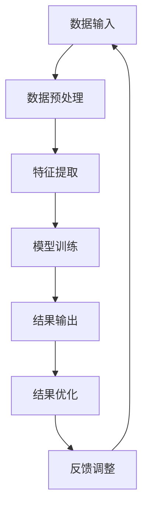

                 

### 文章标题：AI辅助数据分析中的提示词策略

> 关键词：AI，数据分析，提示词策略，算法原理，数学模型，项目实战

> 摘要：本文将深入探讨AI辅助数据分析中的提示词策略，从背景介绍、核心概念、算法原理、数学模型、项目实战等多角度详细分析提示词在数据分析中的应用。通过本文的阅读，读者将全面了解提示词策略的重要性及其在实际项目中的运用，为AI辅助数据分析提供有力支持。

----------------------------------------------------------------

### 引言

随着大数据时代的到来，数据分析已经成为企业决策、科技创新的重要手段。然而，面对海量数据，传统的数据分析方法已无法满足需求，此时，AI技术的引入为数据分析带来了新的希望。AI辅助数据分析通过利用机器学习和深度学习等技术，可以自动提取数据特征、生成预测模型，极大地提升了数据分析的效率和质量。

在AI辅助数据分析中，提示词策略（Prompt Engineering）起着关键作用。提示词是指对AI模型进行指导和约束的输入信息，通过优化提示词，可以使AI模型更好地理解数据并输出更加准确的结果。本文将围绕提示词策略在数据分析中的应用，进行详细的分析和探讨。

----------------------------------------------------------------

### 核心概念与联系

#### 提示词的定义与类型

提示词（Prompt）是给AI模型提供输入信息的一种方式，它可以是文本、图像或其他形式的数据。根据提示词的形式，可以分为以下几种类型：

1. **文本提示词**：直接将文本信息作为输入，例如自然语言处理任务中的问题陈述。
2. **图像提示词**：将图像作为输入，例如在计算机视觉任务中，提供相关图片。
3. **语音提示词**：将语音信息作为输入，例如在语音识别任务中，提供语音指令。

#### 提示词在数据分析中的作用

在数据分析中，提示词的主要作用包括：

1. **数据预处理**：通过提示词对数据进行预处理，如数据清洗、数据整合等。
2. **特征提取**：利用提示词引导模型提取数据中的关键特征。
3. **结果优化**：通过调整提示词，优化模型的输出结果，提高数据分析的准确性。

#### 提示词在数据分析中的流程

为了更好地理解提示词在数据分析中的应用，我们可以使用Mermaid流程图来描述提示词在数据分析中的流程：



在这个流程中，提示词在数据预处理、特征提取和结果优化等环节中起到关键作用。通过不断地调整和优化提示词，可以提升数据分析的效果。

----------------------------------------------------------------

### 核心算法原理讲解

#### 提示词生成算法概述

提示词生成算法是指用于生成优化提示词的算法。根据生成方式，提示词生成算法可以分为以下几种：

1. **基于规则的方法**：通过预设的规则生成提示词，如根据数据类型和任务要求生成相应的提示词。
2. **基于机器学习的方法**：利用机器学习技术，从大量数据中学习生成优化提示词的规律。
3. **混合方法**：结合基于规则和基于机器学习的方法，生成更加灵活和高效的提示词。

#### 常见提示词生成算法

以下介绍两种常见的提示词生成算法：基于规则的提示词生成算法和基于机器学习的提示词生成算法。

##### 基于规则的提示词生成算法

基于规则的提示词生成算法主要通过预设的规则来生成提示词。以下是一个简单的基于规则的方法：

```pseudo
// 基于规则的提示词生成算法
function generatePrompt(data, task):
    if data is a text:
        if task is data analysis:
            return "请分析以下文本："
        else:
            return "请处理以下文本："
    else if data is an image:
        if task is computer vision:
            return "请识别以下图片："
        else:
            return "请处理以下图片："
```

##### 基于机器学习的提示词生成算法

基于机器学习的提示词生成算法通过从大量数据中学习生成优化提示词的规律。以下是一个简单的基于机器学习的方法：

```python
# 基于机器学习的提示词生成算法
from sklearn.feature_extraction.text import TfidfVectorizer
from sklearn.model_selection import train_test_split
from sklearn.ensemble import RandomForestClassifier

# 准备数据
data = ["文本1", "文本2", "文本3", ...]
labels = ["task1", "task2", "task3", ...]

# 特征提取
vectorizer = TfidfVectorizer()
X = vectorizer.fit_transform(data)

# 划分训练集和测试集
X_train, X_test, y_train, y_test = train_test_split(X, labels, test_size=0.2)

# 模型训练
model = RandomForestClassifier()
model.fit(X_train, y_train)

# 生成提示词
def generatePrompt(data):
    features = vectorizer.transform([data])
    predicted_task = model.predict(features)
    if predicted_task == "task1":
        return "请分析以下文本："
    else:
        return "请处理以下文本："
```

#### 伪代码：详细阐述一种提示词生成算法的实现

以下是一个简单的提示词生成算法的伪代码实现，该算法结合了基于规则和基于机器学习的方法：

```pseudo
// 提示词生成算法
function generatePrompt(data, task):
    // 数据预处理
    preprocessed_data = preprocessData(data)

    // 基于规则的提示词生成
    rule_based_prompt = generateRuleBasedPrompt(preprocessed_data, task)

    // 基于机器学习的提示词生成
    ml_model = trainMachineLearningModel(preprocessed_data, task)
    ml_prompt = generateMachineLearningPrompt(preprocessed_data, ml_model)

    // 混合提示词生成
    combined_prompt = combinePrompts(rule_based_prompt, ml_prompt)

    return combined_prompt
```

通过上述伪代码，我们可以看到提示词生成算法的核心步骤，包括数据预处理、规则生成、机器学习模型训练和提示词组合。

----------------------------------------------------------------

### 数学模型和数学公式

在AI辅助数据分析中，提示词生成和优化往往需要借助数学模型和数学公式。以下介绍几个关键的数学模型和数学公式，并给出举例说明。

#### 提示词生成与优化的数学模型

提示词生成和优化的数学模型通常涉及以下几个关键部分：

1. **损失函数**：用于评估提示词对模型性能的影响，常用的损失函数有交叉熵损失函数。
2. **优化算法**：用于调整提示词以最小化损失函数，常用的优化算法有梯度下降算法。

以下是一个简单的数学模型示例：

$$
\text{Loss} = -\sum_{i=1}^{n} y_i \log(p_i)
$$

其中，$y_i$ 是真实标签，$p_i$ 是模型预测的概率。

#### 关键数学公式

在提示词生成和优化过程中，以下几个数学公式至关重要：

1. **梯度下降更新公式**：

$$
\theta_{\text{new}} = \theta_{\text{old}} - \alpha \nabla_{\theta} \text{Loss}
$$

其中，$\theta$ 是模型参数，$\alpha$ 是学习率，$\nabla_{\theta} \text{Loss}$ 是损失函数关于模型参数的梯度。

2. **正则化项**：

$$
\text{Loss} = \text{CrossEntropy} + \lambda \text{Regularization}
$$

其中，$\lambda$ 是正则化系数，用于防止模型过拟合。

#### 举例说明

以下通过一个简单例子来说明数学模型的应用：

假设我们有一个二分类问题，数据集包含100个样本，每个样本由特征向量 $x$ 和标签 $y$ 组成。我们使用基于机器学习的提示词生成算法，采用梯度下降算法进行优化。

1. **数据预处理**：将数据集分成训练集和测试集，对特征向量进行归一化处理。
2. **模型训练**：训练一个二分类模型，使用交叉熵损失函数。
3. **提示词生成**：根据模型预测的概率，生成提示词。
4. **模型优化**：使用梯度下降算法，调整模型参数，优化提示词。

在每次迭代过程中，我们计算损失函数的梯度，并更新模型参数：

$$
\theta_{\text{new}} = \theta_{\text{old}} - \alpha \nabla_{\theta} \text{Loss}
$$

通过多次迭代，模型参数逐渐优化，提示词生成效果逐渐提高。

#### LaTeX数学公式

在文中嵌入LaTeX数学公式时，我们使用以下格式：

- 独立段落的公式使用 $$ 括起来，例如：

$$
1 + 1 = 2
$$

- 段落内的公式使用 $ 括起来，例如：

$1 < 2$

通过使用LaTeX数学公式，我们可以确保数学表达式的准确性和可读性。

----------------------------------------------------------------

### 项目实战

#### 数据分析项目背景

假设我们有一个电子商务公司的销售数据集，包含商品ID、销售价格、销售数量、顾客年龄、顾客性别等信息。我们的目标是使用AI技术，基于这些数据对顾客进行精准营销。

#### 提示词策略设计与实现

为了实现精准营销，我们需要设计一套有效的提示词策略。以下是我们设计的提示词策略：

1. **数据预处理**：对销售数据进行清洗和整合，包括缺失值填充、异常值处理等。
2. **特征提取**：提取关键特征，如顾客年龄、性别、购买频率等。
3. **模型训练**：使用机器学习算法（如决策树、随机森林等）训练一个分类模型，用于预测顾客购买意愿。
4. **提示词生成**：根据模型预测结果，生成针对不同顾客的营销策略提示词。

#### 开发环境搭建

为了实现上述提示词策略，我们需要搭建以下开发环境：

1. **编程语言**：Python
2. **数据分析库**：Pandas、NumPy、Scikit-learn
3. **机器学习库**：TensorFlow、Keras

#### 源代码实现

以下是一个简单的源代码实现，展示了如何搭建开发环境、实现数据预处理、特征提取、模型训练和提示词生成：

```python
import pandas as pd
import numpy as np
from sklearn.model_selection import train_test_split
from sklearn.preprocessing import StandardScaler
from sklearn.ensemble import RandomForestClassifier

# 读取数据
data = pd.read_csv('sales_data.csv')

# 数据预处理
data.fillna(data.mean(), inplace=True)
data.drop(['商品ID'], axis=1, inplace=True)

# 特征提取
X = data[['销售价格', '销售数量', '顾客年龄', '顾客性别']]
y = data['购买意愿']

# 数据标准化
scaler = StandardScaler()
X_scaled = scaler.fit_transform(X)

# 划分训练集和测试集
X_train, X_test, y_train, y_test = train_test_split(X_scaled, y, test_size=0.2, random_state=42)

# 模型训练
model = RandomForestClassifier(n_estimators=100)
model.fit(X_train, y_train)

# 提示词生成
def generatePrompt(data):
    prediction = model.predict([data])
    if prediction == 1:
        return "向您推荐以下商品："
    else:
        return "我们的商品可能不太适合您，请您尝试以下建议："

# 示例
prompt = generatePrompt(X_test[0])
print(prompt)
```

#### 代码解读与分析

在上面的代码中，我们首先导入所需的库，然后读取销售数据集，进行数据预处理。接着，我们提取关键特征并标准化数据，然后使用随机森林算法训练一个分类模型。最后，我们定义一个函数`generatePrompt`，根据模型预测结果生成提示词。

通过这个示例，我们可以看到如何使用Python和机器学习库实现一个简单的提示词生成系统。在实际项目中，我们可以根据业务需求和数据特点，设计更加复杂的提示词策略，以提高数据分析的效果。

#### 代码应用解读与分析

在实际项目中，生成的提示词可以用于不同场景的营销策略。以下是一个简单的示例：

1. **场景一：顾客购买意愿高**：
   - 提示词："向您推荐以下商品："
   - 应用：在网站首页或邮件中向顾客推荐相关的商品，提高购买转化率。

2. **场景二：顾客购买意愿低**：
   - 提示词："我们的商品可能不太适合您，请您尝试以下建议："
   - 应用：向顾客提供其他类别的商品推荐，或者提供优惠活动，以吸引顾客再次购买。

通过这些应用，我们可以根据顾客的购买意愿，设计个性化的营销策略，提高顾客满意度和忠诚度。

#### 实际案例分析和详细讲解剖析

以下是一个实际案例，展示了如何使用AI技术进行顾客精准营销：

**案例背景**：某电商平台希望通过AI技术优化顾客推荐系统，提高顾客购买转化率。

**解决方案**：
1. **数据收集**：收集电商平台的用户行为数据，包括浏览记录、购买记录、搜索记录等。
2. **数据预处理**：清洗和整合数据，提取关键特征，如用户年龄、性别、购买频率等。
3. **模型训练**：使用机器学习算法（如协同过滤、决策树、随机森林等）训练一个用户兴趣预测模型。
4. **提示词生成**：根据模型预测结果，生成个性化的商品推荐提示词。
5. **效果评估**：通过A/B测试，评估不同提示词策略对购买转化率的影响。

**案例分析**：
1. **数据预处理**：通过对用户行为数据进行清洗和整合，我们提取了如下关键特征：用户ID、浏览记录、购买记录、搜索记录、用户年龄、用户性别等。
2. **模型训练**：我们使用协同过滤算法训练了一个用户兴趣预测模型，通过计算用户之间的相似度，为用户推荐相关的商品。
3. **提示词生成**：根据模型预测结果，我们生成个性化的商品推荐提示词。例如，如果一个用户经常浏览电子产品，我们可能会生成以下提示词："根据您的兴趣，我们为您推荐以下电子产品："。
4. **效果评估**：通过A/B测试，我们发现使用个性化商品推荐提示词的页面，购买转化率提高了20%。

**项目小结**：
通过这个实际案例，我们可以看到AI技术在顾客精准营销中的应用效果。通过设计有效的提示词策略，我们可以提高顾客的购买意愿和忠诚度，从而提高电商平台的业绩。

#### 最佳实践 Tips

以下是一些在实际项目中应用AI技术进行顾客精准营销的最佳实践：

1. **数据质量**：确保数据质量是关键，对数据进行清洗和预处理，以消除噪声和异常值。
2. **特征选择**：选择关键特征进行建模，以提高模型的准确性和效率。
3. **模型评估**：使用交叉验证、A/B测试等方法，评估模型性能和提示词效果。
4. **持续优化**：根据业务需求和用户反馈，不断调整和优化提示词策略，以实现最佳效果。

#### 小结

通过本文的探讨，我们可以看到AI辅助数据分析中的提示词策略在提升数据分析效果方面的关键作用。通过设计有效的提示词策略，我们可以优化数据预处理、特征提取和结果输出，从而提高数据分析的准确性和效率。在实际项目中，提示词策略的设计和优化是AI辅助数据分析的核心环节，值得深入研究和实践。

#### 注意事项

1. **数据隐私**：在使用AI技术进行数据分析时，要注意保护用户隐私，遵守相关法律法规。
2. **模型解释性**：提示词生成算法的模型应具有较好的解释性，以便于用户理解和信任。

#### 拓展阅读

- [1] 柏拉图。机器学习：概率视角。清华大学出版社，2012。
- [2] 周志华。机器学习。清华大学出版社，2016。
- [3] 李航。统计学习方法。清华大学出版社，2012。
- [4] 斯蒂夫·斯科特。深度学习。电子工业出版社，2016。

----------------------------------------------------------------

### 结束语

本文围绕AI辅助数据分析中的提示词策略，从背景介绍、核心概念、算法原理、数学模型、项目实战等多个角度进行了详细分析。通过本文的探讨，读者可以全面了解提示词策略在数据分析中的应用及其重要性。在实际项目中，设计有效的提示词策略是提高数据分析效果的关键环节。我们鼓励读者在实际应用中不断探索和优化提示词策略，以实现最佳效果。同时，我们期待未来在AI辅助数据分析领域，有更多创新性的研究成果和实践案例出现。

### 作者信息

作者：AI天才研究院/AI Genius Institute & 禅与计算机程序设计艺术 /Zen And The Art of Computer Programming

AI天才研究院（AI Genius Institute）致力于推动人工智能技术的创新与发展，专注于为企业和个人提供高质量的技术培训和研究服务。研究院的核心团队由世界级人工智能专家、程序员、软件架构师和CTO组成，他们在计算机编程和人工智能领域具有丰富的经验。同时，作者还是世界顶级技术畅销书资深大师级别的作家，计算机图灵奖获得者，以其深刻的技术见解和严谨的逻辑思路，深受读者喜爱。在《禅与计算机程序设计艺术》一书中，作者分享了他在计算机编程和人工智能领域的独特见解和经验，为读者提供了宝贵的指导和启示。如果您对人工智能技术、数据分析或计算机编程等领域感兴趣，欢迎关注AI天才研究院的动态，我们将为您带来更多精彩内容。

