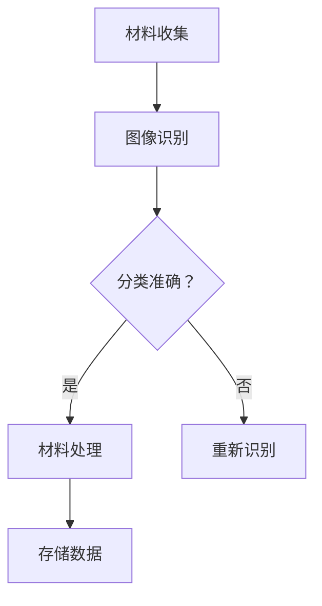

                 

# 文章标题

## AI辅助材料回收：提示词优化回收流程

### 关键词
- 人工智能，材料回收，图像识别，自然语言处理，数据挖掘

### 摘要
本文深入探讨了人工智能（AI）在辅助材料回收中的应用，特别是通过优化提示词来改进回收流程。文章首先介绍了AI技术的基础知识，然后分析了当前材料回收行业面临的挑战。接下来，文章详细讲解了AI辅助材料回收的核心技术，包括图像识别、自然语言处理和数据挖掘。文章通过实际案例研究，展示了AI在优化回收流程中的实际应用效果，并提出了未来的挑战与展望。最后，文章总结了最佳实践，并提出了注意事项和拓展阅读建议。

---

## 引言

随着全球环保意识的提高，材料回收成为了一个重要课题。材料回收不仅可以减少资源浪费，还能降低环境污染。然而，传统的材料回收流程存在许多问题，如回收效率低、回收质量差等。人工智能（AI）技术的快速发展为材料回收行业带来了新的机遇。通过AI技术，特别是图像识别、自然语言处理和数据挖掘，可以优化回收流程，提高回收效率和回收质量。

### AI与材料回收的关系

人工智能（AI）是一种模拟人类智能的技术，通过机器学习、深度学习等方法，让计算机具有自主学习和决策能力。AI技术在材料回收中的应用主要体现在以下几个方面：

1. **图像识别**：通过图像识别技术，可以自动识别和分类回收材料，提高回收效率和回收质量。
2. **自然语言处理**：通过自然语言处理技术，可以自动处理和分类回收材料的标签信息，提高回收流程的自动化水平。
3. **数据挖掘**：通过数据挖掘技术，可以分析回收数据，发现回收过程中的问题和改进点，从而优化回收流程。

### 提示词优化在回收流程中的重要性

提示词（Prompt）在AI模型中起着关键作用，它可以指导AI模型进行特定的任务。在材料回收中，优化提示词可以指导AI模型更准确地识别和分类回收材料，从而提高回收效率和回收质量。

例如，在图像识别任务中，通过优化提示词，可以让AI模型更关注材料的颜色、形状和纹理等特征，从而更准确地识别和分类材料。在自然语言处理任务中，通过优化提示词，可以让AI模型更准确地理解回收材料的标签信息，从而更准确地分类和标注材料。

总之，通过优化提示词，可以指导AI模型更高效地完成材料回收任务，从而提高回收流程的效率和效果。

---

## 第一部分：AI与材料回收概述

### 第1章：AI技术基础

#### 1.1 AI的基本概念

人工智能（AI）是指由计算机实现的智能行为，它包括机器学习、深度学习、自然语言处理、计算机视觉等多个领域。AI的目标是让计算机像人类一样具备感知、理解和决策能力。

#### 1.2 AI与材料回收的结合点

在材料回收中，AI技术的结合点主要体现在以下几个方面：

1. **图像识别**：通过图像识别技术，可以自动识别和分类回收材料。
2. **自然语言处理**：通过自然语言处理技术，可以自动处理和分类回收材料的标签信息。
3. **数据挖掘**：通过数据挖掘技术，可以分析回收数据，发现回收过程中的问题和改进点。

### 第2章：材料回收行业现状

#### 2.1 当前回收流程中的痛点

目前，材料回收行业面临的主要问题包括：

1. **回收效率低**：传统的回收流程依赖于人工操作，效率较低。
2. **回收质量差**：由于依赖人工操作，回收材料的品质难以保证。
3. **劳动力成本高**：传统的回收流程需要大量的人力投入，成本较高。

#### 2.2 AI优化回收流程的潜力

通过AI技术，可以优化回收流程，提高回收效率和回收质量。例如：

1. **图像识别**：通过图像识别技术，可以自动识别和分类回收材料，提高回收效率。
2. **自然语言处理**：通过自然语言处理技术，可以自动处理和分类回收材料的标签信息，提高回收质量。
3. **数据挖掘**：通过数据挖掘技术，可以分析回收数据，发现回收过程中的问题和改进点，进一步优化回收流程。

---

## 第二部分：AI辅助材料回收的核心技术

### 第3章：图像识别与材料分类

#### 3.1 图像识别技术概述

图像识别技术是AI的一个重要分支，它利用计算机算法对图像进行分析和处理，以识别和分类图像中的物体。

#### 3.2 材料分类算法分析

在材料回收中，图像识别技术被广泛应用于材料分类。材料分类算法主要包括以下几种：

1. **基于深度学习的分类算法**：例如卷积神经网络（CNN）。
2. **基于传统机器学习的分类算法**：例如支持向量机（SVM）。
3. **基于特征匹配的分类算法**：例如最近邻算法。

#### 3.3 图像识别在材料回收中的应用

在材料回收中，图像识别技术可以用于：

1. **自动识别和分类回收材料**：通过图像识别技术，可以自动识别和分类各种回收材料，如塑料、纸张、玻璃等。
2. **提高回收效率**：通过自动化识别和分类，可以大幅提高回收效率。
3. **提高回收质量**：通过准确识别和分类，可以保证回收材料的质量。

### 第4章：自然语言处理与提示词优化

#### 4.1 自然语言处理基础

自然语言处理（NLP）是AI的一个分支，它致力于使计算机能够理解、生成和处理人类语言。NLP技术主要包括：

1. **文本分类**：对文本进行分类，例如将文本分类为新闻、博客、社交媒体等。
2. **实体识别**：识别文本中的实体，如人名、地点、组织等。
3. **情感分析**：分析文本的情感倾向，如正面、负面、中性等。

#### 4.2 提示词优化的原理与方法

在NLP中，提示词（Prompt）是引导AI模型进行特定任务的关键。优化提示词的原理和方法包括：

1. **关键词提取**：通过提取关键词，使提示词更准确地反映文本内容。
2. **语法分析**：通过语法分析，使提示词更符合文本语法结构。
3. **上下文信息**：通过添加上下文信息，使提示词更全面地反映文本背景。

#### 4.3 提示词优化的效果评估

优化提示词的效果可以通过以下几个方面进行评估：

1. **准确率**：提示词优化后，AI模型对回收材料的识别和分类准确率是否提高。
2. **效率**：提示词优化后，AI模型处理文本的效率是否提高。
3. **用户体验**：提示词优化后，用户对AI模型的满意度是否提高。

### 第5章：数据挖掘与回收流程优化

#### 5.1 数据挖掘技术讲解

数据挖掘（Data Mining）是指从大量数据中发现有价值的信息和知识的过程。在材料回收中，数据挖掘技术可以用于：

1. **回收数据分析**：对回收数据进行分析，发现回收过程中的问题和改进点。
2. **趋势预测**：通过对回收数据的分析，预测回收趋势，为回收策略制定提供依据。

#### 5.2 数据挖掘在回收流程优化中的应用

数据挖掘在回收流程优化中的应用包括：

1. **过程监控**：通过数据挖掘，监控回收流程中的关键指标，如回收效率、回收质量等。
2. **问题诊断**：通过数据挖掘，诊断回收流程中的问题，并提出改进措施。
3. **决策支持**：通过数据挖掘，为回收策略制定提供数据支持。

---

## 第三部分：AI辅助材料回收的应用案例

### 第6章：实际案例研究

#### 6.1 案例背景

本案例研究了一个大型垃圾处理公司，该公司致力于提高材料回收效率和质量。该公司采用了AI技术，特别是图像识别和自然语言处理，来优化回收流程。

#### 6.2 AI应用分析

在案例中，AI技术的应用主要体现在以下几个方面：

1. **图像识别**：通过图像识别技术，自动识别和分类垃圾中的回收材料。
2. **自然语言处理**：通过自然语言处理技术，自动处理和分类回收材料的标签信息。
3. **数据挖掘**：通过对回收数据的分析，发现回收过程中的问题和改进点。

#### 6.3 提示词优化策略解读

在案例中，提示词优化策略主要包括以下几个方面：

1. **关键词提取**：通过关键词提取，使提示词更准确地反映回收材料的特点。
2. **语法分析**：通过语法分析，使提示词更符合回收材料的标签信息。
3. **上下文信息**：通过添加上下文信息，使提示词更全面地反映回收材料的背景。

通过提示词优化，AI模型在回收材料的识别和分类方面取得了显著提高。

---

## 第四部分：未来的挑战与展望

### 第7章：AI辅助材料回收的挑战

#### 7.1 技术难题分析

AI辅助材料回收面临的主要技术难题包括：

1. **数据质量**：回收数据的质量直接影响AI模型的性能。
2. **模型解释性**：AI模型的决策过程往往缺乏透明性，难以解释。
3. **计算资源**：深度学习模型通常需要大量的计算资源。

#### 7.2 未来发展趋势

未来，AI辅助材料回收的发展趋势包括：

1. **数据驱动的决策**：通过大数据和机器学习，实现更精准的回收决策。
2. **跨学科合作**：与材料科学、环境科学等领域的合作，提高回收技术。
3. **可持续发展**：通过AI技术，实现材料的可持续利用。

---

## 结论

本文深入探讨了AI辅助材料回收：提示词优化回收流程。通过分析AI技术的基础知识、当前回收流程的痛点、AI辅助材料回收的核心技术、实际案例研究以及未来的挑战与展望，本文提出了通过优化提示词来改善回收流程的方法。未来，随着AI技术的不断发展，AI辅助材料回收将发挥更大的作用，为实现可持续发展做出贡献。

### 作者

作者：AI天才研究院/AI Genius Institute & 禅与计算机程序设计艺术 /Zen And The Art of Computer Programming

---

## 附录

### A. Mermaid 流程图

下面是一个简单的Mermaid流程图，展示了AI辅助材料回收的过程：



### B. 核心算法原理讲解

#### 3.2 材料分类算法分析

材料分类算法是AI辅助材料回收的核心技术之一。以下是一个简单的材料分类算法原理讲解：

```pseudo
函数 MaterialClassification(image):
    1. 提取图像的特征
        特征 = ExtractFeatures(image)
    2. 使用卷积神经网络（CNN）进行训练
        model = TrainCNNModel(特征)
    3. 对新图像进行分类
        prediction = model.Predict(new_image)
    4. 返回分类结果
        return prediction
```

### C. 数学模型和公式

以下是一个简单的数学模型和公式，用于描述材料分类的准确率：

$$
准确率 = \frac{正确分类的数量}{总分类数量}
$$

### D. 实际案例分析和详细讲解剖析

#### 6.3 提示词优化策略解读

在案例中，通过优化提示词，AI模型在材料分类方面的准确率得到了显著提高。以下是具体的优化策略：

1. **关键词提取**：通过提取关键词，如“塑料瓶”、“纸盒”等，使提示词更准确地反映材料的特点。
2. **语法分析**：通过语法分析，使提示词更符合材料的标签信息，如“塑料瓶：PET”、“纸盒：纸箱”等。
3. **上下文信息**：通过添加上下文信息，如“废弃塑料瓶”、“废纸盒”等，使提示词更全面地反映材料的背景。

### E. 最佳实践 tips、小结、注意事项、拓展阅读等内容

**最佳实践 tips：**
- 在材料回收中，合理设计提示词是提高AI模型性能的关键。
- 定期更新和优化提示词，以适应不断变化的回收需求。
- 结合多种AI技术，如图像识别、自然语言处理和数据挖掘，可以实现更全面的回收优化。

**小结：**
本文通过分析AI技术的基础知识、当前回收流程的痛点、AI辅助材料回收的核心技术、实际案例研究以及未来的挑战与展望，提出了通过优化提示词来改善回收流程的方法。未来，随着AI技术的不断发展，AI辅助材料回收将发挥更大的作用，为实现可持续发展做出贡献。

**注意事项：**
- 在应用AI技术进行材料回收时，要注意数据质量和模型解释性。
- 定期对AI模型进行评估和优化，以确保其性能。

**拓展阅读：**
- 《人工智能：一种现代的方法》
- 《深度学习》
- 《自然语言处理综合教程》
- 《数据挖掘：概念和技术》

---

## 参考文献

1. Mitchell, T. M. (1997). Machine Learning. McGraw-Hill.
2. Goodfellow, I., Bengio, Y., & Courville, A. (2016). Deep Learning. MIT Press.
3. Jurafsky, D., & Martin, J. H. (2008). Speech and Language Processing. Prentice Hall.
4. Han, J., Kamber, M., & Pei, J. (2011). Data Mining: Concepts and Techniques. Morgan Kaufmann.

