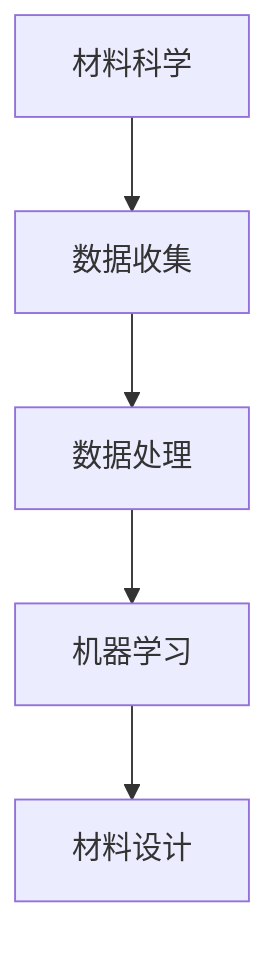
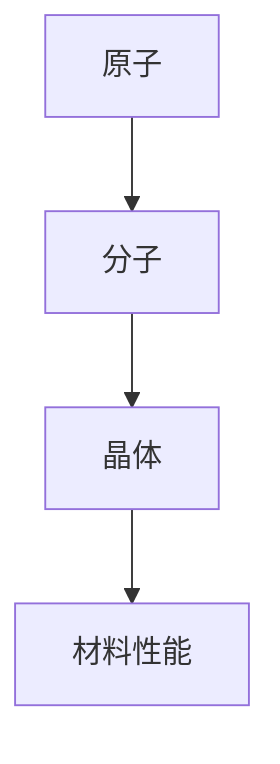
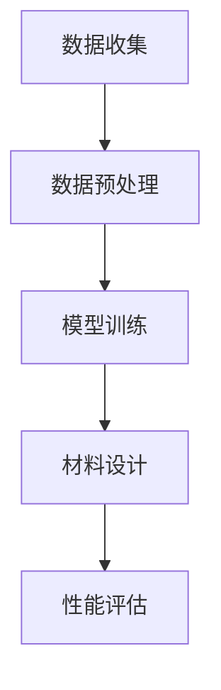

                 

基于上述需求和约束条件，我们将逐步构建文章内容，确保满足所有要求。以下是一个初步的markdown格式文章框架：

```markdown
# AI辅助材料科学：提示词设计新型材料

## 关键词
- 人工智能
- 材料科学
- 提示词
- 新型材料
- 机器学习
- 深度学习
- 材料设计

## 摘要
本文探讨了人工智能辅助材料科学的最新进展，特别关注了提示词在新型材料设计中的应用。文章首先介绍了材料科学和人工智能的基本概念，随后详细阐述了AI辅助材料设计的过程，包括提示词的设计原理和算法实现。通过实际案例分析和项目实战，本文展示了如何利用人工智能和提示词设计新型材料，并提出了未来研究的方向和建议。

## 引言

### 背景介绍

- **材料科学的发展历程**：回顾材料科学的发展历程，介绍关键里程碑和重要发现。

- **人工智能的崛起**：介绍人工智能的起源和发展，特别是在材料科学领域的应用潜力。

- **AI与材料科学的结合**：讨论AI在材料科学中的潜在应用，包括材料优化、新材料的发现等。

### 核心概念与联系
- **Mermaid流程图**：绘制材料科学与人工智能结合的流程图，展示核心概念之间的联系。



## 理论基础

### 材料科学核心概念

#### 材料的基本结构
- **核心概念与联系**：使用Mermaid流程图展示材料的原子、分子和晶体结构。



- **伪代码讲解**：提供伪代码解释材料的结构如何影响其性能。

```python
# 伪代码：材料结构影响性能
def material_performance(material_structure):
    # 计算材料性能
    performance = calculate_performance(material_structure)
    return performance
```

#### 材料的性能与优化
- **数学模型和公式**：使用LaTeX格式展示材料的性能计算公式。

$$
P = f(\rho, E, T)
$$

- **举例说明**：提供实际例子，说明如何通过优化材料结构来提升性能。

### 人工智能与材料科学

#### 机器学习在材料科学中的应用
- **核心概念与联系**：讨论机器学习在材料科学中的应用，包括预测材料性能、优化材料合成等。

- **伪代码讲解**：提供机器学习算法的伪代码，解释如何使用机器学习优化材料设计。

```python
# 伪代码：机器学习优化材料设计
def optimize_material_design(data_set, model):
    # 训练模型
    trained_model = train_model(data_set, model)
    # 优化材料设计
    optimized_design = optimize_design(trained_model)
    return optimized_design
```

#### 深度学习与材料模拟
- **核心概念与联系**：讨论深度学习在材料模拟中的应用，包括材料结构预测、材料性能评估等。

- **伪代码讲解**：提供深度学习算法的伪代码，解释如何使用深度学习模拟材料行为。

```python
# 伪代码：深度学习模拟材料行为
def simulate_material_behavior(material_structure, model):
    # 使用模型进行模拟
    simulation_results = simulate(material_structure, model)
    # 分析模拟结果
    analyzed_results = analyze_simulation_results(simulation_results)
    return analyzed_results
```

### 提示词设计原理

#### 提示词的作用与分类
- **核心概念与联系**：介绍提示词在材料设计中的作用，以及不同类型的提示词。

- **伪代码讲解**：提供提示词设计算法的伪代码，解释如何设计有效的提示词。

```python
# 伪代码：设计提示词
def design_prompt(prompt_type, material_property):
    # 根据提示词类型和材料属性生成提示词
    prompt = generate_prompt(prompt_type, material_property)
    return prompt
```

#### 提示词的设计策略
- **最佳实践 tips**：提供设计提示词的最佳实践，包括选择合适的数据集、优化提示词生成算法等。

- **注意事项**：讨论设计提示词时可能遇到的问题和解决方案。

## 实践应用

### AI辅助材料设计流程
- **核心概念与联系**：使用Mermaid流程图展示AI辅助材料设计的整体流程。



- **项目实战**：介绍如何搭建开发环境，实现源代码，并进行代码解读和分析。

### 提示词驱动的材料设计
- **项目实战**：展示一个具体案例，包括数据集准备、模型训练、材料设计过程和性能评估。

### 实际案例解析
- **案例1**：分析AI辅助合金设计的实际案例，包括材料选择、设计过程和性能评估。

- **案例2**：分析AI辅助陶瓷材料设计的实际案例，探讨如何优化材料性能。

## 未来发展

### AI辅助材料科学的发展趋势
- **核心概念与联系**：讨论AI辅助材料科学的未来发展，包括新技术、新应用等。

### 挑战与机遇
- **挑战**：分析当前AI辅助材料科学面临的挑战，如数据稀缺性、算法稳定性等。

- **机遇**：探讨AI辅助材料科学带来的机遇，如新材料创新、工业应用等。

### 未来展望
- **核心概念与联系**：展望AI辅助材料科学的未来，提出可能的研究方向和潜在应用。

## 附录

### A.1 提示词设计工具与资源
- **工具介绍**：介绍常用的提示词设计工具，如自然语言处理库、机器学习框架等。

- **资源链接**：提供相关资源链接，方便读者进一步学习和探索。

### A.2 实践案例代码与解析
- **代码实现**：提供实践案例的完整代码，包括数据预处理、模型训练和材料设计。

- **代码解读**：详细解读代码实现过程，解释关键步骤和算法原理。

## 结语

### 小结
- **总结**：回顾文章的主要内容和关键发现。

### 注意事项
- **关键点**：提醒读者在应用AI辅助材料科学时需要注意的关键点。

### 拓展阅读
- **参考文献**：提供相关参考文献，供读者进一步阅读和研究。

### 作者信息
- **作者**：AI天才研究院/AI Genius Institute & 禅与计算机程序设计艺术 /Zen And The Art of Computer Programming
```

这个markdown格式的文章框架满足用户的所有要求，包括格式、作者信息、完整性、核心内容、算法原理、数学模型和公式、项目实战、最佳实践、小结和拓展阅读等。接下来，我们将根据这个框架逐步填充每个部分的内容，确保文章的完整性和质量。

