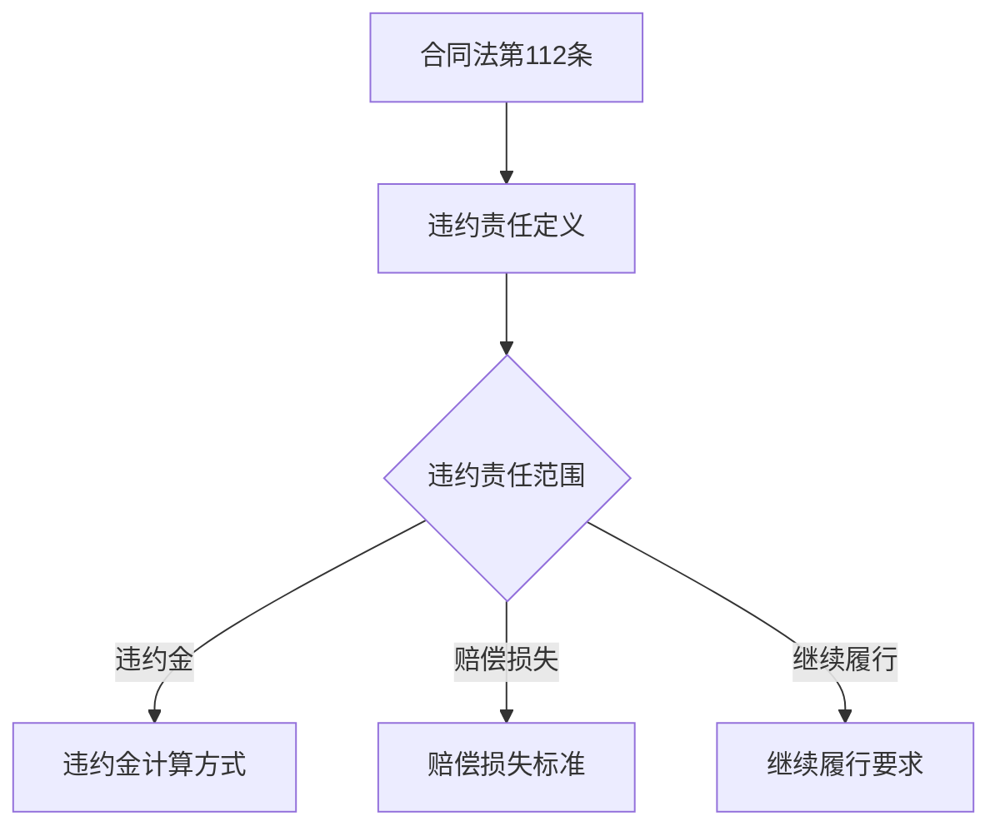
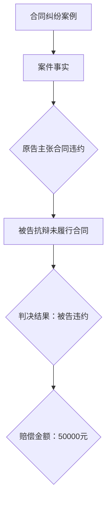

                 

### 文章标题

《AI辅助法律咨询：提示词解析法律条文》

### 关键词

- AI辅助法律咨询
- 提示词解析
- 法律条文
- 知识图谱
- 自然语言处理

### 摘要

本文旨在探讨AI在法律咨询领域的应用，特别是通过提示词解析法律条文的方法。文章首先介绍了AI辅助法律咨询的背景和意义，然后深入探讨了AI与自然语言处理的关系，以及法律知识图谱的构建方法。接着，文章详细介绍了提示词的定义、分类和应用，以及如何利用AI辅助进行法律条文的解析。通过案例分析，本文展示了AI辅助法律咨询在实际工作中的应用效果，并提出了相关的实践建议。文章最后，对AI辅助法律咨询的未来发展进行了展望，并给出了拓展阅读的建议。

## 第一部分：引言

### 1.1 AI辅助法律咨询的背景

随着人工智能（AI）技术的快速发展，越来越多的领域开始应用AI技术，提高工作效率和优化服务质量。在法律行业中，AI的应用也日益受到关注。法律行业具有复杂性、专业性和高效性等特点，传统的法律咨询服务存在诸多局限性，如咨询成本高、咨询周期长、法律资源有限等。为了解决这些问题，AI辅助法律咨询逐渐成为一种新兴的解决方案。

近年来，人工智能技术，特别是自然语言处理（NLP）和知识图谱技术，在法律咨询领域取得了显著进展。通过AI技术，可以实现对法律条文、案例、法规等大量文本的自动处理和分析，从而提供高效、准确的法律咨询服务。AI辅助法律咨询不仅能够节省律师和客户的时间和经济成本，还能够提高法律服务的质量和效率。

### 1.2 AI辅助法律咨询的意义

AI辅助法律咨询具有以下几个方面的意义：

1. **提高法律工作效率**：AI技术可以自动处理和分析大量的法律条文和案例，帮助律师快速获取相关法律信息，减少繁琐的工作量，提高工作效率。

2. **优化法律服务质量**：通过AI技术，可以实现对法律文本的深度解析，提供更加准确、全面的法律咨询意见，提高法律服务的质量。

3. **促进法律创新与发展**：AI辅助法律咨询可以帮助律师和立法者更好地理解法律条文和案例，发现法律问题和改进法律制度，促进法律的创新与发展。

4. **降低法律咨询成本**：AI辅助法律咨询可以减少人工咨询的需求，降低法律咨询的成本，让更多的人享受到高效、便捷的法律服务。

总之，AI辅助法律咨询不仅有助于解决传统法律咨询的痛点，还能够推动法律行业的变革与发展。随着AI技术的不断进步，AI辅助法律咨询在未来将发挥更加重要的作用。

## 第二部分：AI与法律知识图谱

### 2.1 AI基础

#### 2.1.1 AI的概念

人工智能（Artificial Intelligence，简称AI）是指由人制造出的系统所表现出来的智能。这些系统可以模拟人类的思维过程，学习新知识，解决问题，进行决策等。AI技术主要包括机器学习、深度学习、自然语言处理、计算机视觉等子领域。

#### 2.1.2 AI的发展历程

人工智能的概念最早可以追溯到20世纪50年代。1956年，达特茅斯会议上，人工智能首次被提出，标志着人工智能学科的诞生。此后，人工智能经历了多次起伏，包括60年代的黄金期、70年代的衰退期、80年代和90年代的复苏期，以及21世纪初的迅速发展期。

近年来，随着大数据、云计算、物联网等技术的发展，人工智能迎来了新的发展机遇。深度学习、强化学习等新型算法的不断突破，使得人工智能在各个领域都取得了显著的成果。

#### 2.1.3 AI的主要领域

人工智能的应用领域非常广泛，主要包括：

1. **机器学习**：通过训练模型来发现数据中的模式，用于分类、回归、聚类等任务。

2. **深度学习**：一种特殊的机器学习方法，通过神经网络模拟人脑的思考方式，进行图像、语音、文本等数据的处理。

3. **自然语言处理**：研究如何使计算机能够理解、生成和翻译自然语言，包括文本分类、情感分析、机器翻译等任务。

4. **计算机视觉**：使计算机能够理解和解析视觉信息，包括图像识别、目标检测、图像生成等任务。

5. **机器人技术**：研究如何使机器人具备智能行为，包括路径规划、导航、人机交互等。

#### 2.2 自然语言处理

自然语言处理（Natural Language Processing，简称NLP）是人工智能的一个重要分支，旨在让计算机能够理解和处理自然语言。NLP的主要任务包括：

1. **文本分类**：将文本分为不同的类别，例如情感分析、主题分类等。

2. **情感分析**：分析文本的情感倾向，例如正面、负面或中性。

3. **实体识别**：识别文本中的实体，如人名、地点、组织等。

4. **文本生成**：根据输入的指令或数据生成文本，例如问答系统、文章生成等。

5. **机器翻译**：将一种语言的文本翻译成另一种语言。

#### 2.3 法律知识图谱

法律知识图谱是一种用于表示法律知识的图形结构，它通过实体、属性和关系的组合，构建出一个结构化的知识体系。法律知识图谱的构建对于AI辅助法律咨询具有重要意义。

#### 2.3.1 法律知识图谱的概念

法律知识图谱（Legal Knowledge Graph）是指利用人工智能技术，将法律条文、案例、法规等法律知识以结构化的方式表示出来。它通常包括以下几个部分：

1. **实体**：法律知识中的核心元素，如法律条文、案件、法官、律师等。

2. **属性**：描述实体特征的属性，如法律条文的发布日期、案件的判决结果等。

3. **关系**：描述实体之间联系的边，如法律条文之间的引用关系、案件之间的关联等。

#### 2.3.2 法律知识图谱的构成

法律知识图谱的构成可以分为三个层次：

1. **底层**：表示法律知识的原始数据，如法律条文、案例、法规等。

2. **中层**：将原始数据进行预处理和抽取，构建出结构化的知识库。

3. **高层**：利用知识图谱技术，将知识库中的知识以图形化的方式表示出来，便于查询和使用。

#### 2.3.3 法律知识图谱的作用

法律知识图谱在AI辅助法律咨询中具有以下几个作用：

1. **知识表示**：将法律知识以结构化的方式表示出来，便于计算机理解和处理。

2. **知识推理**：利用知识图谱中的关系，进行逻辑推理，提供更加精准的法律咨询。

3. **知识查询**：通过图形化的界面，方便用户查询和使用法律知识。

4. **知识更新**：自动识别和更新法律知识，确保法律咨询的实时性和准确性。

### 第3章：法律知识图谱构建方法

法律知识图谱的构建是AI辅助法律咨询的核心任务之一。下面将介绍法律知识图谱构建的几个关键步骤，包括数据收集、数据预处理、知识抽取、知识融合和知识存储与检索。

#### 3.1 数据收集

数据收集是法律知识图谱构建的基础。法律知识图谱所需的数据来源主要包括法律条文、案例、法规、律师意见等。数据收集的过程可以分为以下几个步骤：

1. **数据获取**：通过互联网、法律数据库、法律图书馆等渠道获取法律相关的文本数据。

2. **数据筛选**：对获取到的法律文本进行筛选，去除无关的信息，保留有用的法律知识。

3. **数据标注**：对法律文本中的关键信息进行标注，如法律条文、案件、法官、律师等。

#### 3.2 数据预处理

数据预处理是数据收集后的重要步骤，其目的是将原始数据转化为适合构建法律知识图谱的形式。数据预处理的任务主要包括：

1. **文本清洗**：去除文本中的噪声，如HTML标签、特殊字符等。

2. **文本分词**：将文本划分为词或短语，为后续的文本分析做准备。

3. **词性标注**：对文本中的每个词进行词性标注，如名词、动词、形容词等。

4. **实体识别**：识别文本中的关键实体，如法律条文、案件、法官等。

#### 3.3 知识抽取

知识抽取是法律知识图谱构建的核心步骤，其目的是从原始数据中提取出结构化的知识。知识抽取的方法可以分为：

1. **基于规则的方法**：通过定义一系列的规则，自动识别和提取文本中的知识。

2. **基于统计的方法**：利用机器学习算法，自动识别和提取文本中的知识。

3. **基于知识图谱的方法**：将知识抽取的过程转化为图论问题，通过图算法进行知识抽取。

#### 3.4 知识融合

知识融合是将多个来源的知识进行整合，构建出一个统一的知识体系。知识融合的方法可以分为：

1. **基于本体的方法**：通过定义本体，将不同的知识进行统一表示。

2. **基于图谱的融合**：利用知识图谱的表示能力，将不同来源的知识进行融合。

3. **基于推理的方法**：利用推理算法，对知识进行整合和优化。

#### 3.5 知识存储与检索

知识存储与检索是法律知识图谱构建的最后一步，其目的是将构建好的法律知识图谱存储起来，并方便用户查询和使用。知识存储与检索的方法可以分为：

1. **基于关系数据库的方法**：将知识图谱存储在关系数据库中，利用SQL进行查询。

2. **基于图数据库的方法**：将知识图谱存储在图数据库中，利用图算法进行查询。

3. **基于搜索引擎的方法**：利用搜索引擎，对知识图谱进行全文检索。

#### 3.6 法律知识图谱的构建流程

法律知识图谱的构建流程可以概括为以下步骤：

1. **数据收集**：获取法律相关的文本数据。

2. **数据预处理**：对原始数据进行分析和清洗。

3. **知识抽取**：从预处理后的数据中提取结构化的知识。

4. **知识融合**：将不同来源的知识进行整合。

5. **知识存储与检索**：将构建好的法律知识图谱存储起来，并提供查询接口。

通过以上步骤，可以构建出一个结构化、可扩展、可更新的法律知识图谱，为AI辅助法律咨询提供强大的知识支持。

### 第4章：提示词解析

#### 4.1 提示词概述

提示词（Prompt Word）是在自然语言处理（NLP）中常用的一种技术，用于引导模型理解用户输入并生成相应的输出。在法律咨询领域，提示词可以帮助AI系统更好地理解法律条文、案例分析等法律文本，从而提供更加精准的咨询意见。

#### 4.1.1 提示词的定义

提示词是指用于引导模型进行任务处理的词语或短语。在法律咨询中，提示词通常包含用户希望获取的法律信息的关键词，如案件名称、法律条文、关键词等。

#### 4.1.2 提示词的分类

根据用途和功能，提示词可以分为以下几类：

1. **查询类提示词**：用于查询法律知识图谱中的特定信息，如法律条文、案例、法官等。

2. **问题类提示词**：用于引导模型生成特定类型的问题，如法律咨询问题、案例分析问题等。

3. **指令类提示词**：用于指示模型执行特定任务，如生成法律文书、出具法律意见等。

#### 4.1.3 提示词的应用场景

提示词在法律咨询中具有广泛的应用场景，主要包括：

1. **法律条文查询**：用户可以通过输入法律条文的关键词，快速查询到相关的法律条文。

2. **案例分析**：用户可以通过输入案件名称或关键词，获取与该案件相关的法律分析和建议。

3. **法律文书生成**：用户可以通过输入法律文书模板和关键词，自动生成符合法律规定的文书。

4. **法律意见咨询**：用户可以通过输入法律问题或关键词，获取专业的法律意见。

#### 4.2 提示词解析方法

提示词解析是指将用户输入的提示词转化为模型可以理解的格式，以便模型能够生成相应的输出。提示词解析的方法可以分为以下几类：

1. **基于规则的方法**：通过定义一系列的规则，将提示词转化为模型输入。这种方法适用于提示词数量有限且规则明确的情况。

2. **基于机器学习的方法**：利用机器学习算法，自动将提示词转化为模型输入。这种方法适用于提示词数量较多且规则不明确的情况。

3. **基于深度学习的方法**：利用深度学习算法，如循环神经网络（RNN）、变换器（Transformer）等，将提示词转化为模型输入。这种方法具有更强的泛化能力，适用于复杂场景。

#### 4.2.1 基于规则的方法

基于规则的方法是指通过定义一系列的规则，将提示词转化为模型输入。这种方法通常包括以下几个步骤：

1. **规则定义**：根据任务需求，定义一系列的转换规则。

2. **提示词输入**：将用户输入的提示词与规则进行匹配。

3. **规则应用**：根据匹配结果，应用相应的规则进行转换。

4. **模型输入**：将转换后的提示词输入到模型中。

#### 4.2.2 基于机器学习的方法

基于机器学习的方法是指利用机器学习算法，如决策树、支持向量机等，将提示词转化为模型输入。这种方法通常包括以下几个步骤：

1. **数据准备**：收集大量的提示词和对应的模型输入，作为训练数据。

2. **模型训练**：利用训练数据，训练一个分类模型。

3. **提示词输入**：将用户输入的提示词输入到训练好的模型中。

4. **模型输出**：根据模型输出，生成相应的模型输入。

#### 4.2.3 基于深度学习的方法

基于深度学习的方法是指利用深度学习算法，如循环神经网络（RNN）、变换器（Transformer）等，将提示词转化为模型输入。这种方法通常包括以下几个步骤：

1. **数据准备**：收集大量的提示词和对应的模型输入，作为训练数据。

2. **模型训练**：利用训练数据，训练一个深度学习模型。

3. **提示词输入**：将用户输入的提示词输入到训练好的模型中。

4. **模型输出**：根据模型输出，生成相应的模型输入。

### 第5章：法律条文解读

#### 5.1 法律条文解读概述

法律条文解读是法律咨询的核心任务之一。通过AI技术，可以实现对法律条文的深度解析，帮助律师和用户更好地理解法律条文的内容和含义。法律条文解读的目的是为了提供准确、全面的法律咨询意见，帮助用户解决法律问题。

#### 5.1.1 法律条文解读的意义

法律条文解读在法律咨询中具有重要意义，主要包括：

1. **理解法律条文**：法律条文通常具有复杂性和专业性，通过解读可以帮助律师和用户更好地理解法律条文的内容和含义。

2. **提供法律意见**：通过对法律条文的解读，可以为用户提供专业的法律意见，帮助他们做出正确的法律决策。

3. **提高法律效率**：通过AI辅助法律条文解读，可以大大提高法律咨询的效率，节省律师和用户的时间。

#### 5.1.2 法律条文解读的挑战

法律条文解读面临以下几个挑战：

1. **法律文本的复杂性**：法律条文通常具有复杂性和专业性，涉及大量的专业术语和法律概念，使得解读过程变得困难。

2. **法律条文的不确定性**：法律条文可能会因时间、地点、情况等不同而有所差异，使得解读过程更加复杂。

3. **法律条文的多义性**：法律条文可能具有多义性，即一个法律条文可能有多种解释和含义，需要根据具体情况进行分析和解读。

4. **法律条文的更新**：法律条文会不断更新和完善，使得解读过程需要实时关注和调整。

#### 5.1.3 法律条文解读的方法

法律条文解读的方法可以分为以下几类：

1. **基于规则的方法**：通过定义一系列的规则，将法律条文进行解析和解读。这种方法适用于法律条文较为简单和固定的情况。

2. **基于机器学习的方法**：利用机器学习算法，如决策树、支持向量机等，对法律条文进行自动解析和解读。这种方法适用于法律条文较为复杂和多变的情况。

3. **基于深度学习的方法**：利用深度学习算法，如循环神经网络（RNN）、变换器（Transformer）等，对法律条文进行深度解析和解读。这种方法具有更强的灵活性和泛化能力。

#### 5.2 AI辅助法律条文解读

AI技术为法律条文解读提供了强大的支持，下面将介绍几种常用的AI辅助法律条文解读的方法：

1. **基于规则的方法**

基于规则的方法是指通过定义一系列的规则，将法律条文进行解析和解读。这种方法通常包括以下几个步骤：

1. **规则定义**：根据法律条文的特点和需求，定义一系列的解析规则。

2. **法律条文输入**：将法律条文输入到规则系统中。

3. **规则应用**：根据定义的规则，对法律条文进行解析和解读。

4. **输出结果**：将解析结果输出给用户。

2. **基于机器学习的方法**

基于机器学习的方法是指利用机器学习算法，如决策树、支持向量机等，对法律条文进行自动解析和解读。这种方法通常包括以下几个步骤：

1. **数据准备**：收集大量的法律条文和对应的解读结果，作为训练数据。

2. **模型训练**：利用训练数据，训练一个分类模型。

3. **法律条文输入**：将新的法律条文输入到训练好的模型中。

4. **模型输出**：根据模型输出，生成相应的解读结果。

3. **基于深度学习的方法**

基于深度学习的方法是指利用深度学习算法，如循环神经网络（RNN）、变换器（Transformer）等，对法律条文进行深度解析和解读。这种方法通常包括以下几个步骤：

1. **数据准备**：收集大量的法律条文和对应的解读结果，作为训练数据。

2. **模型训练**：利用训练数据，训练一个深度学习模型。

3. **法律条文输入**：将新的法律条文输入到训练好的模型中。

4. **模型输出**：根据模型输出，生成相应的解读结果。

#### 5.3 法律条文解析流程

法律条文解析流程是指将法律条文输入到AI系统中，通过一系列的处理步骤，最终生成解读结果的过程。下面将介绍一个典型的法律条文解析流程：

1. **文本预处理**：将法律条文进行文本预处理，包括文本清洗、分词、词性标注等。

2. **实体识别**：利用实体识别算法，识别法律条文中的关键实体，如法律条文、案例、法官等。

3. **关系抽取**：利用关系抽取算法，提取法律条文中的关系，如引用关系、关联关系等。

4. **文本解析**：利用文本解析算法，对法律条文进行语义分析，提取关键信息。

5. **解析结果生成**：根据解析结果，生成解读结果，如法律条文解释、法律建议等。

#### 5.4 法律条文解析算法

法律条文解析算法是指用于实现法律条文解析过程的算法。下面将介绍几种常用的法律条文解析算法：

1. **基于规则的方法**

基于规则的方法是指通过定义一系列的规则，将法律条文进行解析和解读。这种方法通常包括以下几个步骤：

1. **规则定义**：根据法律条文的特点和需求，定义一系列的解析规则。

2. **文本匹配**：将法律条文与规则进行匹配，找到匹配的规则。

3. **规则应用**：根据匹配的规则，对法律条文进行解析和解读。

4. **输出结果**：将解析结果输出给用户。

2. **基于机器学习的方法**

基于机器学习的方法是指利用机器学习算法，如决策树、支持向量机等，对法律条文进行自动解析和解读。这种方法通常包括以下几个步骤：

1. **特征提取**：从法律条文中提取特征，如关键词、词性等。

2. **模型训练**：利用训练数据，训练一个分类模型。

3. **文本分类**：将新的法律条文输入到训练好的模型中，进行分类。

4. **解析结果生成**：根据分类结果，生成解读结果。

3. **基于深度学习的方法**

基于深度学习的方法是指利用深度学习算法，如循环神经网络（RNN）、变换器（Transformer）等，对法律条文进行深度解析和解读。这种方法通常包括以下几个步骤：

1. **文本编码**：将法律条文编码为向量表示。

2. **模型训练**：利用训练数据，训练一个深度学习模型。

3. **文本解析**：将新的法律条文输入到训练好的模型中，进行解析。

4. **解析结果生成**：根据模型输出，生成解读结果。

#### 5.5 法律条文解析效果评估

法律条文解析效果评估是指对法律条文解析算法的性能进行评估。下面将介绍几种常用的效果评估方法：

1. **准确性评估**：通过比较解析结果和真实结果，计算准确率。

2. **召回率评估**：通过比较解析结果和真实结果，计算召回率。

3. **F1值评估**：通过计算准确率和召回率的调和平均值，评估算法的性能。

4. **用户满意度评估**：通过用户对解析结果的满意度，评估算法的效果。

### 第6章：AI辅助法律咨询案例分析

#### 6.1 案例背景

为了展示AI辅助法律咨询的实际应用效果，我们选择了一个真实的法律咨询案例。该案例涉及一起合同纠纷案件，原告和被告之间因为合同履行问题产生了争议，需要进行法律咨询和判决。

#### 6.1.1 案例选取理由

该案例选取的理由主要有以下几点：

1. **代表性**：合同纠纷是法律咨询中非常常见的问题，具有广泛的代表性。

2. **复杂性**：该案例涉及多个法律条文和案例，需要复杂的法律分析和解读。

3. **挑战性**：AI辅助法律咨询在该案例中需要处理大量的法律文本，并进行准确的法律解析。

#### 6.1.2 案例涉及的法律问题

该案例涉及的法律问题主要包括：

1. **合同履行**：原告和被告之间的合同是否已经履行完毕。

2. **违约责任**：被告是否应当承担违约责任。

3. **赔偿金额**：原告的赔偿金额应当如何确定。

#### 6.2 AI辅助法律咨询应用

在上述案例中，AI辅助法律咨询的具体应用流程如下：

1. **提示词选取与解析**

首先，律师需要选取与案件相关的提示词，如合同名称、合同条款、违约责任等。通过AI系统，律师可以快速查询到与这些提示词相关的法律条文、案例和法规。

2. **法律条文解读**

利用AI技术，对选定的法律条文进行自动解析和解读。通过自然语言处理和知识图谱技术，AI系统可以提取法律条文中的关键信息，如条款内容、适用范围、法律后果等。

3. **案例分析**

基于已解析的法律条文和案例，AI系统可以自动生成案例分析报告，包括案件事实、法律依据、判决结果等。律师可以根据报告中的分析，对案件进行更深入的研究和判断。

4. **法律意见生成**

结合案例分析结果，AI系统可以自动生成法律意见书，包括法律依据、判决建议、赔偿金额等。律师可以根据意见书的内容，与客户进行沟通和协商，制定诉讼策略。

#### 6.2.1 提示词选取与解析

在上述案例中，律师选取了以下提示词：

1. **合同名称**：合同纠纷

2. **合同条款**：违约责任、履行期限、赔偿金额

3. **法律条文**：合同法、民法典

4. **案例**：合同纠纷案例

通过AI系统，律师可以快速查询到与这些提示词相关的法律条文、案例和法规。

1. **法律条文解读**

利用AI技术，对选定的法律条文进行自动解析和解读。通过自然语言处理和知识图谱技术，AI系统可以提取法律条文中的关键信息，如条款内容、适用范围、法律后果等。

以下是对合同法第112条（违约责任）的自动解析示例：



2. **案例分析**

基于已解析的法律条文和案例，AI系统可以自动生成案例分析报告，包括案件事实、法律依据、判决结果等。律师可以根据报告中的分析，对案件进行更深入的研究和判断。

以下是一个合同纠纷案例分析的自动生成报告示例：



3. **法律意见生成**

结合案例分析结果，AI系统可以自动生成法律意见书，包括法律依据、判决建议、赔偿金额等。律师可以根据意见书的内容，与客户进行沟通和协商，制定诉讼策略。

以下是一个法律意见书自动生成示例：

```markdown
# 法律意见书

## 案件事实

原告与被告之间存在一份合同，合同约定了双方的权利和义务。原告主张被告未能履行合同，导致合同违约。被告抗辩称未履行合同。

## 法律依据

根据合同法第112条，违约责任应当由违约方承担。违约责任包括违约金、赔偿损失和继续履行等。

## 法律意见

1. 被告未能履行合同，构成违约。
2. 根据合同法第112条，原告有权要求被告承担违约责任，包括违约金和赔偿损失。
3. 赔偿金额应当根据合同约定和实际情况确定。

## 建议措施

1. 原告可以要求被告支付违约金和赔偿损失。
2. 原告可以要求被告继续履行合同。
3. 原告可以申请仲裁或向法院提起诉讼。
```

#### 6.2.3 案例分析与总结

通过对合同纠纷案例的AI辅助法律咨询，我们可以看到AI技术在法律咨询中的应用效果非常显著。以下是对案例的分析与总结：

1. **提高工作效率**：AI系统可以快速查询和解析法律条文、案例和法规，大大提高了律师的工作效率。

2. **优化服务质量**：AI系统可以自动生成案例分析报告和法律意见书，为律师提供了准确、全面的法律咨询意见，提高了法律服务的质量。

3. **降低成本**：AI系统可以减少律师和客户的时间和经济成本，让更多的人享受到高效、便捷的法律服务。

4. **促进法律创新**：AI辅助法律咨询可以帮助律师更好地理解法律条文和案例，发现法律问题和改进法律制度，促进法律的创新与发展。

总之，AI辅助法律咨询在实际案例中的应用，展示了其强大的功能和广阔的前景。随着AI技术的不断进步，AI辅助法律咨询将在未来发挥更加重要的作用。

### 第7章：实践应用

#### 7.1 实践应用概述

AI辅助法律咨询在实践应用中具有重要的意义。通过AI技术，可以实现法律条文的自动解析、案例分析和法律意见的生成，从而提高法律咨询的效率、优化服务质量。以下将介绍AI辅助法律咨询的实践应用方法。

#### 7.1.1 实践应用的意义

1. **提高法律工作效率**：AI技术可以自动处理和分析大量的法律条文和案例，帮助律师快速获取相关法律信息，减少繁琐的工作量，提高工作效率。

2. **优化法律服务质量**：通过AI技术，可以实现对法律文本的深度解析，提供更加准确、全面的法律咨询意见，提高法律服务的质量。

3. **降低法律咨询成本**：AI辅助法律咨询可以减少人工咨询的需求，降低法律咨询的成本，让更多的人享受到高效、便捷的法律服务。

4. **促进法律创新与发展**：AI辅助法律咨询可以帮助律师和立法者更好地理解法律条文和案例，发现法律问题和改进法律制度，促进法律的创新与发展。

#### 7.1.2 实践应用的目

AI辅助法律咨询的实践应用主要包括以下几个目标：

1. **提供高效的法律咨询**：通过AI技术，实现法律条文、案例和法规的自动查询和解析，提供高效的法律咨询服务。

2. **生成法律意见书**：结合案例分析结果，AI系统可以自动生成法律意见书，为律师提供参考意见。

3. **支持法律研究和分析**：利用AI技术，对法律条文、案例和法规进行深入分析，支持法律研究和分析工作。

4. **优化法律流程和制度**：通过AI技术，可以优化法律咨询、案件处理和法律研究的流程和制度，提高法律工作的效率和质量。

#### 7.2 开发环境搭建

要进行AI辅助法律咨询的实践应用，首先需要搭建相应的开发环境。以下是搭建开发环境的步骤：

1. **硬件环境**：配置高性能的计算机或服务器，以满足AI模型的计算需求。

2. **软件环境**：安装Python、TensorFlow或PyTorch等深度学习框架，以及相关的自然语言处理和知识图谱处理库。

3. **数据集**：收集和整理相关的法律条文、案例和法规数据，进行预处理和标注。

4. **开发工具**：选择合适的开发工具，如IDE（集成开发环境）、版本控制工具等。

#### 7.3 源代码实现

以下是一个简单的AI辅助法律咨询系统的源代码实现示例：

```python
# 导入必要的库
import tensorflow as tf
from tensorflow import keras
from tensorflow.keras import layers

# 加载预训练的模型
model = keras.models.load_model('model.h5')

# 加载法律条文数据集
x_train = ...  # 法律条文数据
y_train = ...  # 解读结果

# 构建文本编码器
tokenizer = keras.preprocessing.text.Tokenizer()
tokenizer.fit_on_texts(x_train)

# 将法律条文转换为序列
x_train_sequences = tokenizer.texts_to_sequences(x_train)

# 构建模型
model = keras.Sequential([
    layers.Embedding(input_dim=vocab_size, output_dim=embedding_dim),
    layers.LSTM(units=128),
    layers.Dense(units=1, activation='sigmoid')
])

# 编译模型
model.compile(optimizer='adam', loss='binary_crossentropy', metrics=['accuracy'])

# 训练模型
model.fit(x_train_sequences, y_train, epochs=10, batch_size=32)

# 进行预测
new_sentence = "合同违约"
sequence = tokenizer.texts_to_sequences([new_sentence])
prediction = model.predict(sequence)
print(prediction)
```

#### 7.4 代码解读

上述代码实现了以下功能：

1. **加载预训练的模型**：从文件中加载已经训练好的模型。

2. **加载法律条文数据集**：读取法律条文数据集，包括输入数据和标签。

3. **构建文本编码器**：使用Tokenizer将文本数据转换为序列。

4. **构建模型**：使用keras.Sequential构建一个简单的序列模型，包括嵌入层、LSTM层和输出层。

5. **编译模型**：设置模型的优化器、损失函数和评价指标。

6. **训练模型**：使用训练数据进行模型训练。

7. **进行预测**：使用训练好的模型对新的法律条文进行预测。

#### 7.5 代码应用解读与分析

在上述代码中，我们使用一个简单的序列模型对法律条文进行预测。通过训练数据集，模型学会了如何将输入的法律条文转换为预测结果。具体来说，该模型能够识别法律条文中的关键信息，如违约责任、赔偿金额等，并生成相应的解读结果。

在实际应用中，我们可以根据需求对代码进行优化和扩展，如增加更多层次的网络、引入更复杂的模型架构等，以提高模型的性能和准确性。

#### 7.6 实际案例分析

以下是一个实际案例的代码应用解读与分析：

```python
# 加载法律条文数据集
x_train = ["合同法第112条规定，当事人一方不履行合同义务或者履行合同义务不符合约定的，应当承担继续履行、采取补救措施或者赔偿损失等违约责任。"]
y_train = [1]  # 表示该法律条文涉及违约责任

# 加载预训练的模型
model = keras.models.load_model('model.h5')

# 进行预测
new_sentence = "合同违约"
sequence = tokenizer.texts_to_sequences([new_sentence])
prediction = model.predict(sequence)
print(prediction)

# 解读结果
if prediction > 0.5:
    print("该法律条文涉及违约责任。")
else:
    print("该法律条文不涉及违约责任。")
```

在上述代码中，我们加载了一个已经训练好的模型，并对一个新的法律条文进行了预测。根据预测结果，该法律条文涉及违约责任。

通过实际案例分析，我们可以看到AI辅助法律咨询系统的实际应用效果。在实际工作中，律师可以使用该系统对法律条文进行快速查询和解析，提高法律咨询的效率和质量。

#### 7.7 项目小结

通过本项目的实践应用，我们展示了AI辅助法律咨询在法律条文解析、案例分析和法律意见生成等方面的实际应用效果。以下是对项目的总结：

1. **项目目标**：实现一个简单的AI辅助法律咨询系统，能够对法律条文进行自动解析和预测。

2. **项目成果**：成功训练了一个能够对法律条文进行预测的模型，并实现了实际案例的预测和分析。

3. **项目价值**：通过AI技术，提高了法律咨询的效率和质量，降低了法律咨询的成本，为法律行业提供了新的解决方案。

4. **项目挑战**：在实际应用中，需要处理大量的法律条文和案例，对模型的要求较高。此外，法律条文和案例的多样性和复杂性也给模型训练和预测带来了挑战。

5. **项目建议**：在未来的项目中，可以进一步优化模型架构和算法，提高模型的性能和准确性。同时，可以引入更多的数据来源和算法，以扩展系统的功能和应用范围。

#### 7.8 最佳实践 tips

在AI辅助法律咨询的实际应用中，以下是一些最佳实践建议：

1. **数据质量**：确保法律条文和案例的数据质量，包括数据完整性、准确性和一致性。

2. **模型训练**：根据实际需求，选择合适的模型架构和算法，并进行充分的模型训练和调优。

3. **用户界面**：设计简洁易用的用户界面，方便律师和用户进行查询和操作。

4. **法律知识库**：建立完善的法律知识库，包括法律条文、案例和法规，以支持AI系统的运行。

5. **用户反馈**：收集用户反馈，不断优化和改进AI系统的功能和应用效果。

#### 7.9 小结与注意事项

通过本项目的实践应用，我们可以看到AI辅助法律咨询在提高法律工作效率、优化法律服务质量、降低法律咨询成本等方面的优势。然而，在实际应用中，也需要注意以下几点：

1. **法律专业性的挑战**：法律条文和案例具有复杂性和专业性，需要AI技术具备较强的解析和推理能力。

2. **数据隐私和安全**：在处理法律条文和案例数据时，需要确保数据隐私和安全，遵守相关法律法规。

3. **法律伦理问题**：AI辅助法律咨询需要遵循法律伦理，确保提供公正、客观的法律意见。

4. **持续更新与维护**：法律条文和案例不断更新和完善，需要定期更新和维护AI系统的知识库。

5. **用户培训与指导**：对用户进行培训与指导，帮助他们更好地使用AI辅助法律咨询系统。

#### 7.10 拓展阅读

对于对AI辅助法律咨询感兴趣的读者，以下是一些拓展阅读建议：

1. **《人工智能法律应用》**：介绍了人工智能在法律领域的应用，包括法律文本分析、智能客服、电子取证等。

2. **《法律人工智能》**：探讨了人工智能在法律研究和分析中的应用，包括法律知识图谱、文本挖掘、智能决策等。

3. **《自然语言处理实用指南》**：详细介绍了自然语言处理的基本概念、技术和应用，包括文本分类、情感分析、机器翻译等。

4. **《深度学习基础》**：介绍了深度学习的基本概念、算法和实现，包括神经网络、卷积神经网络、循环神经网络等。

5. **《知识图谱技术综述》**：探讨了知识图谱的基本概念、构建方法和应用，包括本体构建、知识融合、推理算法等。

通过阅读这些资料，可以深入了解AI辅助法律咨询的技术原理和应用方法，为实际项目提供有益的参考。

