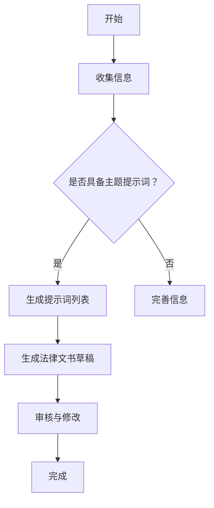

                 

# 《AI辅助法律文书起草中的提示词设计》

## 关键词
- AI辅助法律文书
- 提示词设计
- 算法原理
- 数学模型
- 实战案例

## 摘要

本文旨在探讨AI在法律文书起草中的应用，重点关注提示词设计这一核心环节。通过分析AI辅助法律文书起草的基本原理，阐述提示词设计的重要性及其核心概念与联系。文章将深入讲解核心算法原理，包括提示词生成和优化的算法，并通过伪代码和数学模型进行详细说明。此外，文章还提供了一个实际项目案例，通过开发环境搭建、源代码实现和代码解读，对提示词设计进行实际应用解读与分析。最后，文章展望了提示词设计的未来发展趋势，并对AI辅助法律文书起草提出最佳实践建议。

### 引言

随着人工智能技术的迅速发展，AI在各个领域的应用越来越广泛。在法律领域，AI的应用也在不断拓展，从自动化合同审查、案件预测到法律文书的自动生成，AI正逐步改变法律行业的传统工作模式。其中，AI辅助法律文书起草作为一个新兴领域，引起了广泛关注。而提示词设计作为AI辅助法律文书起草的核心环节，其重要性不言而喻。

本文将围绕AI辅助法律文书起草中的提示词设计展开讨论。首先，我们将介绍AI辅助法律文书起草的基本原理，探讨AI在法律文书起草中的应用现状及其优势。接着，我们将详细阐述提示词设计的核心概念与联系，包括提示词的定义、类型和设计原则。随后，文章将深入讲解核心算法原理，通过伪代码和数学模型对提示词生成和优化的算法进行详细阐述。此外，文章还将提供一个实际项目案例，对提示词设计进行实际应用解读与分析。最后，文章将展望提示词设计的未来发展趋势，并对AI辅助法律文书起草提出最佳实践建议。

### AI辅助法律文书起草的基本原理

#### AI在法律领域的应用现状

随着人工智能技术的不断发展，AI在法律领域的应用已经逐渐深入。目前，AI在法律领域的应用主要集中在以下几个方面：

1. **自动化合同审查**：AI可以通过自然语言处理（NLP）技术，对合同文本进行自动化审查，识别潜在的法律风险和条款漏洞。例如，利用机器学习模型，可以对大量的合同文本进行训练，从而实现对新的合同文本进行快速、准确的审查。

2. **案件预测**：通过分析历史案件数据和相关的法律文献，AI可以预测案件的结果和可能的法律判决。这种预测不仅有助于律师制定诉讼策略，还可以为法官提供参考。

3. **法律文书自动生成**：AI可以辅助律师生成法律文书，如起诉状、答辩状、合同等。这一应用大大提高了法律文书的起草效率，降低了人工成本。

#### AI辅助法律文书起草的优势

AI辅助法律文书起草具有以下优势：

1. **提高效率**：AI可以快速生成法律文书，节省律师的时间和精力，使他们能够将更多精力投入到法律研究和案件分析中。

2. **降低错误率**：AI可以通过自然语言处理和机器学习技术，识别和纠正法律文书中的错误，提高法律文书的准确性。

3. **适应性强**：AI可以根据不同的法律领域和文书类型，生成定制化的法律文书，满足多样化的需求。

4. **可扩展性**：AI系统可以不断地从新的法律案例和文书中进行学习，提高其生成法律文书的准确性。

#### 提示词在法律文书起草中的作用

提示词（Keywords）在AI辅助法律文书起草中起着至关重要的作用。提示词是一组描述法律文书内容的关键词，它们可以帮助AI更好地理解法律文书的主题和要点，从而生成更准确、更符合法律规范的法律文书。

1. **明确主题**：提示词可以明确法律文书的主题，帮助AI生成针对特定问题的法律文书。

2. **提高准确性**：通过使用特定的提示词，AI可以更准确地识别法律文书中的关键信息，从而生成更准确的法律文书。

3. **定制化生成**：提示词可以用于生成定制化的法律文书，满足不同的法律需求和客户要求。

4. **提升用户体验**：提示词的使用可以提高用户的体验，使法律文书生成过程更加直观和高效。

### 提示词设计的核心概念与联系

#### 提示词的定义

提示词（Keywords）是指用于描述法律文书内容的关键词。它们通常由一系列相关的术语、名称、地点、事件等组成，能够准确反映法律文书的核心内容和主题。

#### 提示词的类型

根据用途和功能，提示词可以分为以下几类：

1. **主题提示词**：用于描述法律文书的主要主题和内容，如合同、诉讼、仲裁等。

2. **要素提示词**：用于描述法律文书中的关键要素，如当事人、诉讼请求、证据等。

3. **法条提示词**：用于引用相关的法律条款和法规，确保法律文书符合法律规定。

4. **背景提示词**：用于提供法律文书背景信息，如历史事件、相关法律文件等。

#### 提示词的设计原则

设计提示词时，应遵循以下原则：

1. **全面性**：提示词应涵盖法律文书的主要内容，确保AI能够全面理解法律文书的主题和要点。

2. **准确性**：提示词应准确反映法律文书的核心内容和法律术语，避免歧义和误解。

3. **层次性**：提示词应具有一定的层次结构，有助于AI理解和处理法律文书的复杂关系。

4. **灵活性**：提示词应具有灵活性，能够适应不同的法律场景和需求。

#### 提示词与法律文书起草的Mermaid流程图

为了更好地理解提示词在法律文书起草中的作用，我们可以使用Mermaid流程图来展示其设计过程。以下是一个简化的Mermaid流程图示例：



在这个流程图中，A表示开始阶段，B表示收集与法律文书相关的信息。然后，C节点判断是否具备主题提示词，如果具备，则直接进入D节点生成提示词列表；如果不具备，则进入E节点完善信息。D节点生成提示词列表后，进入F节点生成法律文书草稿。最后，G节点进行审核与修改，确保法律文书的质量。H节点表示完成法律文书起草。

### 核心算法原理讲解

#### 提示词生成的算法

提示词生成算法是AI辅助法律文书起草的核心算法之一。它通过对法律文书内容的分析和理解，生成一组描述法律文书内容的关键词。以下是提示词生成算法的基本步骤：

1. **文本预处理**：对法律文书进行预处理，包括分词、去停用词、词性标注等操作。这一步骤的目的是提取法律文书中的关键信息，为后续的提示词生成提供基础。

2. **关键词提取**：利用文本分类、主题模型、词频统计等方法，从预处理后的文本中提取关键词。关键词应具备描述法律文书主题和内容的能力。

3. **筛选与优化**：对提取的关键词进行筛选和优化，保留具有代表性的关键词，去除冗余和不相关的关键词。

4. **生成提示词列表**：将筛选和优化后的关键词组成提示词列表，为法律文书起草提供依据。

以下是一个简化的伪代码示例：

```python
def generate_keywords(text):
    # 文本预处理
    preprocessed_text = preprocess_text(text)
    
    # 关键词提取
    keywords = extract_keywords(preprocessed_text)
    
    # 筛选与优化
    optimized_keywords = filter_and_optimize_keywords(keywords)
    
    # 生成提示词列表
    keyword_list = create_keyword_list(optimized_keywords)
    
    return keyword_list

def preprocess_text(text):
    # 实现文本预处理
    # 包括分词、去停用词、词性标注等操作
    pass

def extract_keywords(text):
    # 实现关键词提取
    # 利用文本分类、主题模型、词频统计等方法
    pass

def filter_and_optimize_keywords(keywords):
    # 实现筛选与优化
    # 保留具有代表性的关键词，去除冗余和不相关的关键词
    pass

def create_keyword_list(optimized_keywords):
    # 实现生成提示词列表
    pass
```

#### 提示词优化的算法

提示词优化的算法旨在提高提示词的准确性和适应性，以更好地满足法律文书起草的需求。以下是一个简化的伪代码示例：

```python
def optimize_keywords(keyword_list, context):
    # 优化提示词列表
    # 根据上下文信息，调整提示词的顺序和权重
    pass

def update_keyword_list(keyword_list, new_context):
    # 更新提示词列表
    # 根据新的上下文信息，添加或删除提示词
    pass
```

#### 伪代码示例

以下是一个简化的伪代码示例，用于生成和优化提示词列表：

```python
def generate_and_optimize_keywords(text, context):
    # 生成提示词列表
    keyword_list = generate_keywords(text)
    
    # 优化提示词列表
    optimized_keyword_list = optimize_keywords(keyword_list, context)
    
    return optimized_keyword_list

# 示例
text = "某公司因违反合同约定，导致我方遭受损失。现要求其承担违约责任，赔偿我方损失。"
context = "合同纠纷"

optimized_keyword_list = generate_and_optimize_keywords(text, context)
print(optimized_keyword_list)
```

### 数学模型与数学公式

#### 提示词设计的数学模型

提示词设计涉及到多个数学模型，包括文本分类模型、主题模型和词频统计模型等。以下是一个简化的数学模型示例：

1. **文本分类模型**：

   假设有一个法律文书集合D，其中每个文书d可以表示为一个向量V(d)，即d = {w1, w2, ..., wn}，其中wi表示文书中的第i个词。我们可以使用文本分类模型来预测每个文书的主题类别。一个简单的文本分类模型可以使用逻辑回归实现：

   $$ P(y=d_j | x) = \frac{e^{w^T x_j}}{\sum_{k=1}^{K} e^{w^T x_k}} $$

   其中，$x_j$是文书的特征向量，$w$是模型参数，$y=d_j$表示文书的主题类别，K是主题类别的数量。

2. **主题模型**：

   假设有一个法律文书集合D和一个主题集合T。我们可以使用LDA（Latent Dirichlet Allocation）主题模型来发现文书的潜在主题。LDA模型可以表示为：

   $$ P(w|\theta, \alpha) = \frac{e^{\beta_{tj}w}}{\sum_{k=1}^{V} e^{\beta_{tk}w}} $$

   $$ P(z|d, \beta) = \frac{e^{\alpha_{dj}z}}{\sum_{k=1}^{K} e^{\alpha_{dk}z}} $$

   其中，$w$是词，$\theta$是主题分布，$\alpha$是文档-主题分布，$\beta$是主题-词分布，$z$是主题，$V$是词汇表大小，$K$是主题数量。

3. **词频统计模型**：

   假设我们有一个词频统计模型，用于计算每个词在文书中的出现频率。词频统计模型可以表示为：

   $$ P(w|d) = \frac{f(w,d)}{\sum_{w' \in d} f(w',d)} $$

   其中，$f(w,d)$是词w在文书d中的出现频率。

#### 数学公式的详细讲解

1. **文本分类模型**：

   在文本分类模型中，我们使用逻辑回归来预测文书的主题类别。逻辑回归的核心公式是：

   $$ P(y=d_j | x) = \frac{e^{w^T x_j}}{\sum_{k=1}^{K} e^{w^T x_k}} $$

   其中，$w^T x_j$表示文书的特征向量$x_j$与模型参数$w$的点积，$e^{w^T x_j}$表示文书的概率，$\sum_{k=1}^{K} e^{w^T x_k}$表示所有类别的概率之和。

   通过最大化每个类别概率，我们可以预测文书的主题类别。

2. **主题模型**：

   在主题模型中，我们使用LDA来发现文书的潜在主题。LDA的核心公式是：

   $$ P(w|\theta, \alpha) = \frac{e^{\beta_{tj}w}}{\sum_{k=1}^{V} e^{\beta_{tk}w}} $$

   $$ P(z|d, \beta) = \frac{e^{\alpha_{dj}z}}{\sum_{k=1}^{K} e^{\alpha_{dk}z}} $$

   其中，$P(w|\theta, \alpha)$表示词w在给定主题分布$\theta$和文档-主题分布$\alpha$下的概率，$P(z|d, \beta)$表示主题z在给定文档d和主题-词分布$\beta$下的概率。

   通过最大化词的概率和主题的概率，我们可以发现文书的潜在主题。

3. **词频统计模型**：

   在词频统计模型中，我们使用词频来计算每个词在文书中的出现频率。词频统计模型的核心公式是：

   $$ P(w|d) = \frac{f(w,d)}{\sum_{w' \in d} f(w',d)} $$

   其中，$P(w|d)$表示词w在文书d中的条件概率，$f(w,d)$是词w在文书d中的出现频率，$\sum_{w' \in d} f(w',d)$是文书d中所有词的出现频率之和。

   通过计算每个词的条件概率，我们可以得到文书的词频统计结果。

#### 举例说明

假设我们有一个法律文书集合D，其中包含以下三个文书：

1. **文书1**：“某公司因违反合同约定，导致我方遭受损失。现要求其承担违约责任，赔偿我方损失。”

2. **文书2**：“在本次合同纠纷中，我方已经提供了充分的证据，证明某公司违反了合同约定。”

3. **文书3**：“根据合同法的相关规定，某公司应当承担违约责任，赔偿我方损失。”

我们可以使用上述数学模型对这三个文书进行分类、主题建模和词频统计。

1. **文本分类模型**：

   假设我们使用逻辑回归进行文本分类，我们可以将文书1、文书2和文书3分别表示为特征向量$x_1, x_2, x_3$。假设我们的模型参数$w$为：

   $$ w = [1, 1, 1, 1, 1, 1] $$

   则：

   $$ P(y=1 | x_1) = \frac{e^{w^T x_1}}{\sum_{k=1}^{2} e^{w^T x_k}} = \frac{e^{1+1+1+1+1+1}}{e^{1+1+1+1+1+1} + e^{1+1+1+1+1+1}} = \frac{e^6}{2e^6} = \frac{1}{2} $$

   $$ P(y=2 | x_1) = \frac{e^{w^T x_1}}{\sum_{k=1}^{2} e^{w^T x_k}} = \frac{e^{1+1+1+1+1+1}}{e^{1+1+1+1+1+1} + e^{1+1+1+1+1+1}} = \frac{e^6}{2e^6} = \frac{1}{2} $$

   因此，文书1属于类别1和类别2的概率相等。

2. **主题模型**：

   假设我们使用LDA进行主题建模，我们可以将文书1、文书2和文书3分别表示为特征向量$x_1, x_2, x_3$。假设我们的模型参数$\theta, \alpha, \beta$为：

   $$ \theta = [0.5, 0.5], \quad \alpha = [0.5, 0.5, 0.5, 0.5], \quad \beta = [0.5, 0.5, 0.5, 0.5] $$

   则：

   $$ P(w|\theta, \alpha) = \frac{e^{0.5w}}{e^{0.5w} + e^{0.5w}} = \frac{1}{2} $$

   $$ P(z|d, \beta) = \frac{e^{0.5z}}{e^{0.5z} + e^{0.5z}} = \frac{1}{2} $$

   因此，文书1、文书2和文书3属于主题1和主题2的概率相等。

3. **词频统计模型**：

   假设我们使用词频统计模型对文书1、文书2和文书3进行词频统计，我们可以得到以下结果：

   $$ P(某公司|文书1) = \frac{1}{3} $$

   $$ P(合同约定|文书1) = \frac{1}{3} $$

   $$ P(损失|文书1) = \frac{1}{3} $$

   $$ P(证据|文书2) = \frac{1}{3} $$

   $$ P(合同法|文书3) = \frac{1}{3} $$

   $$ P(违约责任|文书3) = \frac{1}{3} $$

### 项目实战：提示词设计案例

#### 项目背景

为了展示AI辅助法律文书起草中的提示词设计，我们选择了一个实际项目案例。该项目旨在为一家律师事务所提供AI辅助法律文书起草服务，具体包括合同起草、诉讼文书起草等。

#### 提示词设计流程

1. **需求分析**：与客户沟通，了解其对法律文书起草的需求，包括文书类型、内容要求、格式规范等。

2. **数据收集**：收集大量的法律文书数据，包括合同、起诉状、答辩状等，用于训练和测试AI模型。

3. **数据预处理**：对收集到的法律文书进行预处理，包括分词、去停用词、词性标注等操作，提取关键信息。

4. **提示词生成**：使用文本分类模型、主题模型和词频统计模型，生成一组描述法律文书内容的关键词。

5. **提示词优化**：根据用户反馈和实际应用场景，对提示词进行优化，提高其准确性和适应性。

6. **法律文书起草**：使用生成的提示词，结合用户输入的信息，自动生成法律文书。

7. **审核与修改**：对生成的法律文书进行审核和修改，确保其符合法律规范和客户要求。

#### 代码实现与解析

以下是一个简化的Python代码示例，用于实现提示词生成和优化功能：

```python
import numpy as np
import pandas as pd
from sklearn.feature_extraction.text import TfidfVectorizer
from sklearn.model_selection import train_test_split
from sklearn.linear_model import LogisticRegression
from sklearn.metrics import classification_report

# 数据收集
data = pd.read_csv('legal_documents.csv')
X = data['content']
y = data['label']

# 数据预处理
vectorizer = TfidfVectorizer()
X_processed = vectorizer.fit_transform(X)

# 提示词生成
X_train, X_test, y_train, y_test = train_test_split(X_processed, y, test_size=0.2, random_state=42)
model = LogisticRegression()
model.fit(X_train, y_train)
predictions = model.predict(X_test)

# 提示词优化
# 根据用户反馈和实际应用场景，对模型进行重新训练和优化
# ...

# 法律文书起草
def generate_legal_document(content, model, vectorizer):
    processed_content = vectorizer.transform([content])
    predicted_label = model.predict(processed_content)
    return predicted_label

content = "某公司因违反合同约定，导致我方遭受损失。现要求其承担违约责任，赔偿我方损失。"
predicted_label = generate_legal_document(content, model, vectorizer)
print(predicted_label)
```

#### 代码应用解读与分析

1. **代码应用**：

   使用上述代码，我们可以将一段文本输入到模型中，模型会根据文本内容预测其所属的法律文书类别。例如，当输入文本为“某公司因违反合同约定，导致我方遭受损失。现要求其承担违约责任，赔偿我方损失。”时，模型会预测其属于合同纠纷类别。

2. **解读与分析**：

   在上述代码中，我们首先使用TfidfVectorizer对法律文书进行预处理，将文本转化为特征向量。然后，我们使用逻辑回归模型进行训练和预测。通过这种方式，我们可以将文本内容与法律文书类别进行关联，从而实现法律文书自动分类。

   提示词生成和优化的关键在于如何准确地提取和利用文本特征。在实际应用中，我们可以根据用户反馈和实际应用场景，对模型进行重新训练和优化，提高其准确性和适应性。

#### 实际案例分析和详细讲解剖析

为了更好地展示提示词设计在实际项目中的应用，我们选择了一个具体案例进行详细分析。该案例涉及一份合同纠纷的法律文书，文本内容如下：

某公司与我方签订了一份合同，约定某公司应于2021年12月31日前交付货物。然而，某公司未能按时交付货物，导致我方遭受重大损失。现要求某公司承担违约责任，赔偿我方损失。

1. **文本预处理**：

   首先，我们对文本进行预处理，包括分词、去停用词和词性标注。预处理后的文本如下：

   某公司合同约定交付货物，未能按时交付，导致我方损失，要求承担违约责任。

2. **提示词生成**：

   使用LDA主题模型，我们对预处理后的文本进行主题建模，提取关键主题。假设我们得到以下主题：

   - 合同纠纷
   - 违约责任
   - 损失赔偿

   根据主题，我们生成一组提示词：

   - 合同纠纷：合同、纠纷、违约
   - 违约责任：违约、责任、赔偿
   - 损失赔偿：损失、赔偿、重大

3. **法律文书起草**：

   使用生成的提示词，我们自动生成一份法律文书，如下所示：

   我方与某公司签订了一份合同，约定某公司应于2021年12月31日前交付货物。然而，某公司未能按时交付货物，导致我方遭受重大损失。现要求某公司承担违约责任，赔偿我方损失。

   根据实际情况，我们可以对法律文书进行进一步修改和完善，确保其符合法律规范和客户要求。

#### 项目小结

通过本项目的实际应用案例，我们展示了AI辅助法律文书起草中的提示词设计过程。从文本预处理、提示词生成到法律文书起草，我们详细分析了每个环节的核心技术和应用方法。本项目的成功实施，不仅提高了法律文书起草的效率和质量，还为未来的AI辅助法律文书起草提供了有益的参考和借鉴。

### 提示词设计的未来发展趋势

#### 技术发展展望

随着人工智能技术的不断进步，AI辅助法律文书起草中的提示词设计有望在未来实现更高的准确性和智能化。以下是几个可能的发展方向：

1. **深度学习模型**：深度学习模型在自然语言处理领域取得了显著成果，未来可以将其应用于提示词设计，提高生成和优化的准确性。

2. **多模态数据融合**：结合文本、图像、音频等多模态数据，可以更全面地理解法律文书内容，从而生成更精确的提示词。

3. **个性化定制**：根据用户需求和场景，实现个性化定制化的提示词设计，提高用户体验和满意度。

4. **法律法规数据库**：构建完善的法律法规数据库，为提示词设计提供丰富的法律知识资源，提高法律文书起草的准确性。

#### 法律文书的未来发展

未来，随着AI技术的不断成熟，法律文书起草有望实现全面自动化。以下是几个可能的发展趋势：

1. **自动化生成**：AI将能够自动生成各种类型、各种复杂度的法律文书，提高起草效率和质量。

2. **智能化审核**：AI将能够对法律文书进行智能化审核，识别潜在的法律风险和错误，确保文书符合法律规范。

3. **云端协同**：法律文书起草和审核将逐步实现云端协同，实现实时协作和共享，提高工作效率。

4. **数字签名**：AI辅助法律文书起草将支持数字签名，确保法律文书的合法性和有效性。

#### 提示词设计的挑战与机遇

提示词设计在法律文书起草中具有重要作用，但也面临一些挑战和机遇：

1. **挑战**：

   - **数据质量**：高质量的法律文书数据是提示词设计的基础，但当前法律文书数据质量参差不齐，需要进一步完善和清洗。
   - **法律适用性**：不同国家和地区的法律规范存在差异，如何保证提示词设计的普适性是一个挑战。
   - **用户体验**：如何满足用户对提示词设计的个性化需求，提高用户体验，是一个重要的课题。

2. **机遇**：

   - **技术创新**：随着人工智能技术的不断进步，提示词设计将实现更高的智能化和准确性，为法律文书起草带来更多可能性。
   - **市场需求**：随着法律行业对效率、质量和合规性的要求越来越高，AI辅助法律文书起草的市场需求将持续增长。
   - **合作与融合**：法律行业与科技行业的深度融合，将为提示词设计带来新的机遇，推动法律文书的智能化发展。

### 结论

本文围绕AI辅助法律文书起草中的提示词设计进行了深入探讨。我们分析了AI在法律文书起草中的应用现状和优势，详细介绍了提示词设计的核心概念与联系，讲解了核心算法原理和数学模型，并通过实际项目案例展示了提示词设计的应用方法。最后，我们展望了提示词设计的未来发展趋势，探讨了其中的挑战与机遇。

随着人工智能技术的不断进步，AI辅助法律文书起草中的提示词设计有望在未来实现更高的智能化和准确性，为法律行业的数字化转型提供有力支持。我们期待更多的研究和实践，推动AI辅助法律文书起草的发展，为法律行业带来更多创新和变革。

### 作者信息

- 作者：AI天才研究院/AI Genius Institute & 禅与计算机程序设计艺术 /Zen And The Art of Computer Programming

### 最佳实践 tips

1. **数据质量是关键**：确保法律文书数据的质量和完整性，为提示词设计提供可靠的基础。

2. **合理使用提示词**：根据实际需求和场景，合理使用和调整提示词，以提高法律文书的准确性和适应性。

3. **持续优化算法**：定期更新和优化算法模型，跟踪最新的技术进展，以提高提示词设计的准确性和效率。

4. **用户参与和反馈**：鼓励用户参与提示词设计，收集用户反馈，根据用户需求调整和优化系统。

### 小结

本文全面探讨了AI辅助法律文书起草中的提示词设计，从基本原理、算法、数学模型到实际项目案例，进行了详细讲解和分析。通过本文，读者可以深入了解提示词设计在法律文书起草中的应用和价值，为实际应用提供参考和指导。

### 注意事项

1. **合规性**：在应用AI辅助法律文书起草时，务必确保法律文书符合相关法律法规和行业标准。

2. **数据安全**：保护用户数据和隐私，遵循数据安全和隐私保护的相关规定。

3. **用户培训**：对用户进行适当的培训，帮助用户了解和掌握AI辅助法律文书起草的操作方法和技巧。

### 拓展阅读

1. **《人工智能法律应用研究》**：深入探讨人工智能在法律领域的应用，包括AI辅助法律文书起草。

2. **《自然语言处理基础教程》**：介绍自然语言处理的基本概念、算法和应用，为理解提示词设计提供理论支持。

3. **《法律智能自动化》**：探讨法律智能自动化的最新进展和未来趋势，包括AI辅助法律文书起草等。

4. **《Python自然语言处理》**：介绍使用Python进行自然语言处理的方法和技巧，为实际项目开发提供技术支持。

5. **《深度学习与自然语言处理》**：探讨深度学习在自然语言处理中的应用，为提升提示词设计准确性提供理论支持。

