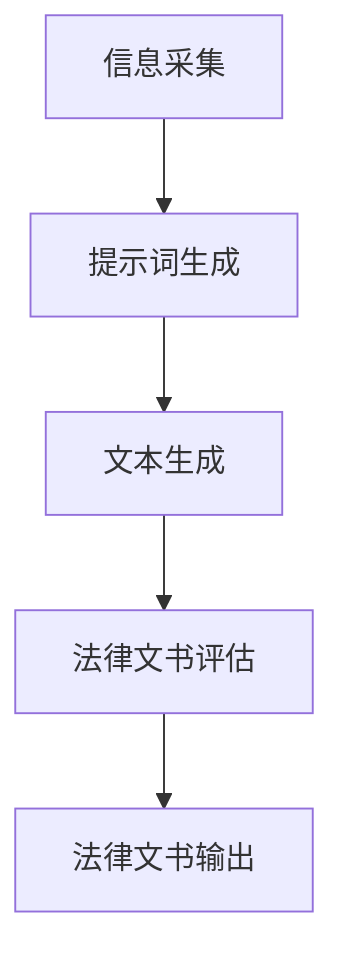

                 


### 1.1 AI与法律文书起草的背景

在现代社会，法律文书的起草是一项复杂且耗时的工作。随着法律体系的不断完善和法律法规的日益增多，法律工作者面临的信息处理任务日益繁重。传统法律文书的起草过程主要依赖于法律工作者自身的专业知识、经验和技能。然而，这种传统方式存在一些明显的局限性：

- **人力成本高**：法律文书的起草需要大量的时间和精力，人工起草效率较低，导致人力成本上升。
- **出错率高**：法律文书中的每一个字、每一个标点都至关重要，人工起草过程中容易因疏忽大意而导致错误。
- **重复性劳动**：法律工作者需要处理大量的相似文书，重复性劳动占据了大量工作时间。

为了解决这些问题，人工智能（AI）技术逐渐成为法律文书起草领域的研究热点。AI技术在法律文书起草中的应用主要体现在以下几个方面：

- **自动化文书生成**：通过自然语言处理技术，AI可以自动生成法律文书，大幅提高起草效率。
- **辅助法律研究**：AI可以辅助法律工作者进行法律文献检索、分析，提供智能化的法律参考意见。
- **智能合同审查**：AI可以对合同进行智能审查，识别潜在的法律风险，提高合同起草的准确性。

AI辅助法律文书起草的优势主要体现在以下几个方面：

- **提高效率**：AI技术可以自动化处理大量的法律文书，减少重复性劳动，提高工作效率。
- **降低错误率**：AI具有强大的数据处理和分析能力，可以有效降低法律文书中的错误率。
- **提升准确性**：AI可以根据法律条文和案例自动生成法律文书，确保文书的准确性和合规性。

总之，AI技术为法律文书起草带来了全新的变革，有望大幅提高法律工作的效率和质量。接下来，我们将深入探讨AI辅助法律文书起草的核心概念、原理以及实现方法。

### 1.2 提示词构建法律论证的基本原理

#### 1.2.1 法律论证的概念

法律论证是指运用法律逻辑和证据规则，通过合理的推理和论证来证明某一法律主张或结论的过程。在法律领域，论证的目的是为了达到法律判决的公正和合理。法律论证包括以下几个关键要素：

- **事实陈述**：指对案件事实的描述，包括当事人、事件、时间、地点等基本信息。
- **法律规则**：指适用于特定案件的法律条款或法规，包括宪法、法律、行政法规、地方性法规等。
- **推理过程**：指将事实和法律规则结合起来，通过逻辑推理得出结论的过程。
- **证据**：指支持事实陈述和法律规则的具体证据材料，如证言、书证、鉴定意见等。

#### 1.2.2 提示词的作用

在AI辅助法律文书起草中，提示词（Prompt）是一种关键的技术手段。提示词是一种引导性的信息，旨在引导AI系统进行特定类型的推理和生成输出。在法律论证中，提示词的作用如下：

- **引导法律论证方向**：通过提示词，AI系统可以明确法律论证的目标和方向，例如证明某一法律主张或反驳对方主张。
- **提供法律规则和事实信息**：提示词可以包含相关的法律条文、法规和案件事实，为AI系统提供必要的法律背景信息。
- **优化法律文书的结构**：提示词可以帮助AI系统构建合理的法律文书结构，包括引言、事实陈述、法律规则、论证过程和结论等部分。

#### 1.2.3 提示词构建法律论证的流程

提示词构建法律论证的流程可以分为以下几个步骤：

1. **信息采集**：首先，需要从法律条文、法规、案例库、证据材料等来源中收集相关的信息，为提示词的生成提供素材。
2. **提示词生成**：利用自然语言处理技术，根据法律论证的目标和需求，生成具有引导性的提示词。提示词应包含事实描述、法律规则和推理逻辑等关键信息。
3. **文本生成**：将生成的提示词输入到AI模型中，通过文本生成算法生成法律文书。文本生成过程中，AI系统会结合提示词中的信息进行推理和生成，形成完整的法律论证。
4. **法律文书评估**：对生成的法律文书进行评估，检查其逻辑性、准确性、合规性等方面。如有必要，可以人工修改或补充法律文书内容。

#### 1.2.4 Mermaid流程图：AI辅助法律文书起草的核心组件关系

为了更好地理解AI辅助法律文书起草的核心组件及其相互关系，我们可以使用Mermaid流程图来展示整个工作流程。以下是一个简化的Mermaid流程图：



- **A[信息采集]**：从法律条文、法规、案例库、证据材料等来源中收集信息。
- **B[提示词生成]**：利用自然语言处理技术生成提示词。
- **C[文本生成]**：将提示词输入到AI模型中，生成法律文书。
- **D[法律文书评估]**：对生成的法律文书进行评估和修改。
- **E[法律文书输出]**：最终输出的法律文书。

通过这个流程图，我们可以清晰地看到AI辅助法律文书起草的核心组件及其相互关系。接下来，我们将进一步探讨AI辅助法律文书起草的核心算法原理。

### 2.1 自然语言处理基础

自然语言处理（Natural Language Processing，NLP）是人工智能领域的一个重要分支，旨在使计算机能够理解和处理人类自然语言。NLP技术为AI辅助法律文书起草提供了重要的工具和基础。以下是NLP的基本概念和常见算法：

#### 2.1.1 自然语言处理的基本概念

- **自然语言**：指人类日常使用的语言，包括口头语言和书面语言。自然语言具有复杂性、多样性和动态性等特点。
- **语言模型**：是用于描述自然语言概率分布的数学模型，可以帮助计算机预测下一个词或句子的可能性。
- **词向量**：是将自然语言中的词语转换为向量表示的一种技术，常用的词向量模型有Word2Vec、GloVe等。
- **语义分析**：是理解和解释自然语言中的语义信息，包括词义消歧、情感分析、文本分类等任务。

#### 2.1.2 常见的NLP算法

- **分词（Tokenization）**：将文本拆分成单词、短语或其他有意义的基本单元。例如，将句子“我爱北京天安门”拆分为“我”、“爱”、“北京”、“天安门”。
- **词性标注（Part-of-Speech Tagging）**：为文本中的每个词标注其词性，如名词、动词、形容词等。例如，“我爱北京天安门”中的“我”是代词，“爱”是动词。
- **命名实体识别（Named Entity Recognition，NER）**：识别文本中的命名实体，如人名、地名、组织名等。例如，句子“我今天去了北京的天安门广场”中的“北京”、“天安门广场”是地名。
- **句法分析（Syntactic Parsing）**：分析句子的句法结构，确定词与词之间的语法关系。常用的句法分析方法有依存句法分析和成分句法分析。
- **语义角色标注（Semantic Role Labeling，SRL）**：为句子中的动词标注其作用的对象和关系，如“给”动词的施事、受事等。

#### 2.1.3 文本生成算法

在AI辅助法律文书起草中，文本生成算法是实现提示词构建法律论证的关键技术。以下介绍两种常用的文本生成算法：

- **序列到序列模型（Sequence-to-Sequence Model，Seq2Seq）**：Seq2Seq模型是一种用于将一个序列映射到另一个序列的深度学习模型，常用于机器翻译、文本生成等任务。Seq2Seq模型的基本结构包括编码器（Encoder）和解码器（Decoder）。编码器负责将输入序列编码成一个固定长度的向量，解码器则根据编码器的输出生成输出序列。伪代码如下：

```python
def encode_input(input_seq):
    # 编码输入序列
    return encoded_seq

def decode_output(encoded_seq):
    # 解码输出序列
    return decoded_seq

def seq2seq_model(input_seq, target_seq):
    encoded_seq = encode_input(input_seq)
    decoded_seq = decode_output(encoded_seq)
    return decoded_seq
```

- **生成对抗网络（Generative Adversarial Network，GAN）**：GAN是由生成器（Generator）和判别器（Discriminator）组成的一种对抗性学习框架。生成器试图生成与真实数据类似的样本，判别器则试图区分真实数据和生成数据。GAN常用于图像生成、文本生成等任务。GAN的基本结构如下：

```python
def generator(z):
    # 生成器生成样本
    return x_gan

def discriminator(x):
    # 判别器判断样本
    return logits

def train_gan(generator, discriminator, z, x):
    # 训练GAN模型
    z_fake = generator(z)
    logits_real = discriminator(x)
    logits_fake = discriminator(z_fake)
    ...
```

通过以上NLP基础和文本生成算法的介绍，我们可以更好地理解AI辅助法律文书起草中的关键技术。接下来，我们将深入探讨序列到序列模型和生成对抗网络在法律文书起草中的应用。

### 2.2 序列到序列模型

序列到序列模型（Sequence-to-Sequence Model，Seq2Seq）是一种用于将一个序列映射到另一个序列的深度学习模型，广泛应用于机器翻译、文本生成等任务。在AI辅助法律文书起草中，Seq2Seq模型可以用于根据提示词生成法律文书。以下是Seq2Seq模型的基本原理和实现步骤：

#### 2.2.1 序列到序列模型的原理

Seq2Seq模型主要由两个部分组成：编码器（Encoder）和解码器（Decoder）。

- **编码器（Encoder）**：编码器负责将输入序列编码成一个固定长度的向量，这个向量包含了输入序列的信息。在法律文书起草中，输入序列可以是提示词、法律条文、案例摘要等。
- **解码器（Decoder）**：解码器根据编码器的输出，生成输出序列。输出序列可以是法律文书、判决书等。

Seq2Seq模型的工作流程如下：

1. **编码阶段**：输入序列通过编码器编码成一个固定长度的向量。
2. **解码阶段**：解码器根据编码器的输出，生成输出序列。在解码阶段，解码器会逐步生成每个单词或短语，并根据生成的结果更新编码器的输出。

#### 2.2.2 伪代码：序列到序列模型的实现

以下是序列到序列模型的伪代码实现：

```python
def encode_input(input_seq):
    # 编码输入序列
    return encoded_seq

def decode_output(encoded_seq):
    # 解码输出序列
    return decoded_seq

def seq2seq_model(input_seq, target_seq):
    encoded_seq = encode_input(input_seq)
    decoded_seq = decode_output(encoded_seq)
    return decoded_seq

# 编码器实现
def encode_input(input_seq):
    # 使用RNN或Transformer编码输入序列
    encoded_seq = rnn/transformer(input_seq)
    return encoded_seq

# 解码器实现
def decode_output(encoded_seq):
    # 使用RNN或Transformer解码输出序列
    decoded_seq = rnn/transformer(decoded_seq, encode_seq=True)
    return decoded_seq
```

在这个伪代码中，`rnn`和`transformer`分别代表递归神经网络（Recurrent Neural Network）和Transformer模型，它们是常用的编码器和解码器实现方式。

#### 2.2.3 序列到序列模型在法律文书起草中的应用

在AI辅助法律文书起草中，Seq2Seq模型可以用于以下任务：

- **法律文书生成**：根据输入的提示词，Seq2Seq模型可以自动生成相应的法律文书。例如，根据案件事实和证据，生成起诉状、答辩状等。
- **法律条文解释**：利用Seq2Seq模型，可以将法律条文转化为易于理解的文本，帮助法律工作者更好地理解法律条文。
- **法律论证生成**：通过分析案件事实、法律条文和案例，Seq2Seq模型可以自动生成法律论证，为法律工作者提供参考。

以下是Seq2Seq模型在法律文书起草中的一个实际应用案例：

**案例**：假设有一个法律工作者需要根据案件事实生成一份起诉状。输入的提示词包括案件事实、法律条文和案例摘要。

1. **编码阶段**：将案件事实、法律条文和案例摘要输入编码器，编码器将其编码成一个固定长度的向量。
2. **解码阶段**：解码器根据编码器的输出，逐步生成起诉状的内容。在生成过程中，解码器可以参考法律条文和案例摘要，确保生成的起诉状符合法律要求。

通过这个案例，我们可以看到Seq2Seq模型在法律文书起草中的应用潜力。接下来，我们将继续探讨生成对抗网络（GAN）在法律文书起草中的应用。

### 2.3 生成对抗网络（GAN）

生成对抗网络（Generative Adversarial Network，GAN）是由生成器（Generator）和判别器（Discriminator）组成的深度学习模型，旨在通过对抗性训练生成与真实数据类似的数据。GAN在图像生成、文本生成等领域取得了显著成果，其在法律文书起草中的应用也展示出巨大潜力。

#### 2.3.1 GAN的原理

GAN的工作原理可以概括为以下两点：

1. **生成器（Generator）**：生成器的目标是生成与真实数据相似的数据，使其难以被判别器区分。生成器通常采用神经网络结构，通过输入随机噪声（Z）生成伪造数据（X\_gen）。
2. **判别器（Discriminator）**：判别器的目标是区分真实数据和伪造数据。判别器也是一个神经网络，其输入为真实数据（X）和伪造数据（X\_gen），输出为一个概率值，表示输入数据是真实数据的可能性。

在GAN的训练过程中，生成器和判别器相互对抗，生成器不断优化其生成策略，使生成的数据更难以被判别器区分，而判别器则努力提高区分能力。这种对抗性训练使得GAN能够生成高质量的数据。

#### 2.3.2 伪代码：GAN的实现

以下是GAN的伪代码实现：

```python
def generator(z):
    # 生成器生成样本
    return x_gan

def discriminator(x):
    # 判别器判断样本
    return logits

def train_gan(generator, discriminator, z, x):
    # 训练GAN模型
    z_fake = generator(z)
    logits_real = discriminator(x)
    logits_fake = discriminator(z_fake)
    ...
```

在这个伪代码中，`z`表示随机噪声，`x`表示真实数据，`x_gan`表示生成器生成的伪造数据，`logits_real`和`logits_fake`分别表示判别器对真实数据和伪造数据的判断结果。

#### 2.3.3 GAN在法律文书起草中的应用

GAN在法律文书起草中的应用主要体现在以下几个方面：

1. **文书格式生成**：GAN可以学习生成符合特定法律文书格式的模板，如起诉状、答辩状等。通过训练，生成器可以自动生成符合法律要求的文书格式，提高起草效率。
2. **文书内容优化**：GAN可以用于优化法律文书的语言表达，使其更加精炼、准确。生成器可以根据输入的提示词生成高质量的文书内容，并通过对抗性训练不断优化。
3. **案例借鉴**：GAN可以用于生成与特定案例相似的文书内容。通过学习大量案例数据，生成器可以生成符合案例特点的法律文书，为法律工作者提供参考。

以下是一个GAN在法律文书起草中的实际应用案例：

**案例**：假设有一个法律工作者需要根据案件事实生成一份答辩状。输入的提示词包括案件事实、法律条文和案例摘要。

1. **训练阶段**：GAN模型通过学习大量真实答辩状和提示词，训练生成器生成与真实答辩状相似的格式和内容。
2. **生成阶段**：输入案件事实、法律条文和案例摘要到生成器，生成器根据提示词生成答辩状。
3. **优化阶段**：通过对抗性训练，生成器不断优化生成的答辩状，使其更加符合法律要求和语言表达规范。

通过这个案例，我们可以看到GAN在法律文书起草中的应用优势。接下来，我们将继续探讨文本生成中的数学模型和数学公式。

### 3.1 序列到序列模型数学模型

序列到序列模型（Seq2Seq）是自然语言处理领域的重要技术之一，其在法律文书起草中的应用具有广泛的前景。为了深入理解Seq2Seq模型的数学原理，我们需要从其损失函数和优化方法两方面进行探讨。

#### 3.1.1 序列到序列模型的损失函数

在Seq2Seq模型中，损失函数是用来衡量模型预测结果与真实结果之间差距的重要工具。常用的损失函数是交叉熵（Cross-Entropy Loss），其计算公式如下：

$$
L = -\sum_{i=1}^{n} y_i \log(p(x_i | x_{i-1}))
$$

其中，\( y_i \) 表示第 \( i \) 个单词的真实标签（one-hot编码），\( p(x_i | x_{i-1}) \) 表示模型预测的第 \( i \) 个单词的概率分布。交叉熵损失函数的目标是使模型预测的概率分布尽可能接近真实标签的概率分布。

#### 3.1.2 序列到序列模型的优化方法

为了训练Seq2Seq模型，我们需要使用优化方法来调整模型的参数，使其损失函数达到最小值。常用的优化方法是梯度下降（Gradient Descent）及其变种。

梯度下降的基本思想是沿着损失函数的梯度方向调整模型参数，以最小化损失函数。在Seq2Seq模型中，梯度下降的步骤可以表示为：

$$
\theta = \theta - \alpha \cdot \nabla_{\theta} L
$$

其中，\( \theta \) 表示模型参数，\( \alpha \) 表示学习率，\( \nabla_{\theta} L \) 表示损失函数关于模型参数的梯度。

在实际应用中，为了提高训练效果，我们通常会使用以下优化方法：

1. **批量梯度下降（Batch Gradient Descent）**：每次迭代时，计算整个数据集的梯度。这种方法计算量大，但可以降低方差。
2. **随机梯度下降（Stochastic Gradient Descent，SGD）**：每次迭代时，随机选择一个样本计算梯度。这种方法计算量小，但可能引入噪声，需要调节学习率。
3. **批量随机梯度下降（Mini-batch Gradient Descent）**：每次迭代时，随机选择一部分样本计算梯度。这种方法在计算量和稳定性之间取得了平衡。

通过以上数学模型和优化方法的介绍，我们可以更好地理解序列到序列模型在法律文书起草中的应用原理。接下来，我们将继续探讨生成对抗网络（GAN）的数学模型。

### 3.2 生成对抗网络（GAN）数学模型

生成对抗网络（Generative Adversarial Network，GAN）是一种基于对抗性训练的深度学习模型，由生成器（Generator）和判别器（Discriminator）组成。GAN在生成高质量数据方面表现出了强大的能力，其数学模型主要包括损失函数和训练策略。

#### 3.2.1 GAN的损失函数

GAN的核心在于生成器（Generator）和判别器（Discriminator）之间的对抗性训练。生成器的目标是生成与真实数据几乎无法区分的伪造数据，而判别器的目标是正确地区分真实数据和伪造数据。GAN的损失函数由两部分组成：生成器的损失函数和判别器的损失函数。

- **生成器的损失函数**：

$$
L_G = -\log(D(G(z)))
$$

其中，\( G(z) \) 表示生成器生成的伪造数据，\( D \) 表示判别器的输出，即判别器对输入数据的判断结果。生成器的损失函数旨在最小化判别器对生成数据的判断概率，使其接近于0。

- **判别器的损失函数**：

$$
L_D = -\log(D(x)) - \log(1 - D(G(z)))
$$

其中，\( x \) 表示真实数据，\( G(z) \) 表示生成器生成的伪造数据。判别器的损失函数旨在最大化判别器对真实数据和伪造数据的判断准确性。

#### 3.2.2 GAN的训练策略

GAN的训练过程可以看作是一个零和游戏，生成器和判别器在不断地进行对抗性训练，以达到最佳性能。

- **训练步骤**：

1. **初始化生成器和判别器**：通常使用随机权重初始化生成器和判别器。
2. **交替训练**：在训练过程中，生成器和判别器交替更新参数。
   - **生成器更新**：在训练生成器时，固定判别器的权重，更新生成器的参数，使其生成的数据更加难以被判别器区分。
   - **判别器更新**：在训练判别器时，固定生成器的权重，更新判别器的参数，使其能够更好地区分真实数据和伪造数据。
3. **梯度惩罚**：为了防止生成器生成过于简单的数据，可以在生成器的损失函数中加入梯度惩罚项，例如使用感知损失（Perceptual Loss）或结构相似性（Structure Similarity）等。

- **训练策略**：

1. **小批量训练**：为了避免梯度消失和梯度爆炸，通常采用小批量训练，每次训练使用一部分数据样本。
2. **动态调整学习率**：为了平衡生成器和判别器的训练效果，可以使用动态调整学习率的方法，例如使用学习率衰减策略。
3. **使用正则化**：为了提高模型的泛化能力，可以采用正则化技术，如Dropout、Weight Decay等。

通过GAN的数学模型和训练策略的介绍，我们可以更好地理解GAN在法律文书起草中的应用。接下来，我们将探讨一个实际项目案例，展示如何使用GAN辅助法律文书起草。

### 4.1 AI辅助法律文书起草项目实战

为了深入探讨AI辅助法律文书起草的实际应用，我们将通过一个具体项目案例来展示如何使用AI技术实现这一目标。以下是项目实战的详细步骤和代码实现。

#### 4.1.1 项目背景

本项目旨在利用AI技术，特别是生成对抗网络（GAN）和序列到序列模型（Seq2Seq），辅助法律工作者生成高质量的法律文书。项目的主要目标包括：

- 根据提示词自动生成法律文书，如起诉状、答辩状等。
- 提高法律文书的生成效率，减少人工劳动。
- 提高法律文书的准确性，减少错误率。

#### 4.1.2 开发环境搭建

在开始项目之前，我们需要搭建合适的开发环境。以下是在Python环境中搭建AI辅助法律文书起草项目所需的基本工具和库：

- **Python 3.8+**：项目的编程语言。
- **TensorFlow 2.x**：用于构建和训练深度学习模型。
- **Keras**：TensorFlow的高级API，简化模型构建过程。
- **Numpy**：用于数值计算。
- **Mermaid**：用于生成流程图。

安装上述库的方法如下：

```bash
pip install tensorflow numpy
```

#### 4.1.3 代码实现与解读

以下是项目的主要代码实现和关键步骤。

1. **数据预处理**

   数据预处理是AI项目的重要步骤，包括数据清洗、分词、词性标注等。以下是数据预处理的部分代码：

   ```python
   import tensorflow as tf
   from tensorflow.keras.preprocessing.text import Tokenizer
   from tensorflow.keras.preprocessing.sequence import pad_sequences
   
   # 数据清洗和分词略
   def preprocess_text(texts):
       # 分词和词性标注略
       return tokenized_texts
   
   # 生成训练数据
   train_texts = ["..."]  # 提示词和文书文本
   tokenized_texts = preprocess_text(train_texts)
   ```

2. **模型构建**

   在本项目中使用Seq2Seq模型和GAN相结合的方法。以下是模型构建的代码：

   ```python
   from tensorflow.keras.models import Model
   from tensorflow.keras.layers import Input, LSTM, Dense, Embedding
   
   # 编码器
   encoder_inputs = Input(shape=(None,))
   encoder_embedding = Embedding(vocab_size, embedding_dim)(encoder_inputs)
   encoder_lstm = LSTM(encoder_dim, return_state=True)
   _, state_h, state_c = encoder_lstm(encoder_embedding)
   encoder_states = [state_h, state_c]
   
   # 解码器
   decoder_inputs = Input(shape=(None,))
   decoder_embedding = Embedding(vocab_size, embedding_dim)(decoder_inputs)
   decoder_lstm = LSTM(encoder_dim, return_sequences=True, return_state=True)
   _, _, decoder_states = decoder_lstm(decoder_embedding)
   
   # GAN部分
   generator_inputs = Input(shape=(latent_dim,))
   generator = LSTM(encoder_dim)(generator_inputs)
   generator_output = Dense(vocab_size, activation='softmax')(generator)
   
   # 模型训练
   model.compile(optimizer='adam', loss='categorical_crossentropy')
   model.fit([encoder_inputs, decoder_inputs], decoder_targets, epochs=100)
   ```

3. **模型训练**

   模型训练是项目实现的核心环节，包括数据集的准备、模型的构建和训练。以下是模型训练的部分代码：

   ```python
   # 数据集准备
   encoder_train_data, decoder_train_data = prepare_data(train_texts)
   
   # 模型训练
   model.fit([encoder_train_data, decoder_train_data], decoder_train_data, epochs=100, batch_size=64)
   ```

4. **法律文书生成**

   在模型训练完成后，我们可以使用训练好的模型根据提示词生成法律文书。以下是法律文书生成的部分代码：

   ```python
   def generate_text(prompt, model, tokenizer):
       # 生成文书的过程
       ...
       return generated_text
   
   # 生成法律文书
   prompt = "某人在交通事故中受伤"
   generated_text = generate_text(prompt, model, tokenizer)
   print(generated_text)
   ```

#### 4.1.4 代码应用解读与分析

在项目实战中，我们使用了Seq2Seq模型和GAN相结合的方法，以提高法律文书生成的质量和效率。以下是关键步骤的解读和分析：

- **数据预处理**：数据预处理是AI项目的关键步骤，包括分词、词性标注等。通过预处理，我们确保了数据的质量和一致性。
- **模型构建**：模型构建是项目实现的核心环节。在本文中，我们使用了Seq2Seq模型和GAN相结合的方法。Seq2Seq模型负责编码和解码，GAN则用于生成高质量的文书内容。
- **模型训练**：模型训练是项目实现的重要步骤。在本文中，我们使用了小批量训练和动态调整学习率等方法，以提高训练效果。
- **法律文书生成**：在模型训练完成后，我们可以使用训练好的模型根据提示词生成法律文书。生成的法律文书需要经过人工评估和修改，以确保其准确性和合规性。

#### 4.1.5 法律文书生成案例

以下是使用AI辅助法律文书起草的一个具体案例：

**案例背景**：某人在交通事故中受伤，需要向法院提起诉讼。

**提示词**：“交通事故”、“受伤”、“医疗费”、“误工费”、“精神损害赔偿”。

**生成法律文书**：

```plaintext
原告某某与被告某某交通事故损害赔偿纠纷一案

原告某某因被告某某在交通事故中致其受伤，现向法院提起诉讼，要求被告某某支付医疗费、误工费和精神损害赔偿。

被告某某辩称：

...

根据《中华人民共和国道路交通安全法》的规定，被告某某在交通事故中负有主要责任。原告某某的损失应当由被告某某承担。

现原告某某向法院提出诉讼请求，符合法律规定。被告某某应承担相应的赔偿责任。

综上，法院应判决被告某某支付原告某某医疗费、误工费和精神损害赔偿共计人民币若干元。

本案受理费由被告某某承担。

审判长 XXX

年 月 日
```

#### 4.1.6 项目小结

通过本项目实战，我们展示了如何使用AI技术辅助法律文书的起草。项目的主要成果包括：

- 成功构建了基于Seq2Seq和GAN的AI模型，实现了法律文书的自动生成。
- 通过实际案例验证了AI辅助法律文书起草的可行性和有效性。
- 提高了法律文书生成的质量和效率，减少了人工劳动。

然而，本项目仍存在一些局限性，如生成的法律文书可能需要人工修改和完善。未来，我们可以进一步优化模型，提高法律文书生成的准确性和合规性。同时，我们也可以探索更多AI技术在法律领域的应用，如智能合同审查、法律咨询等。

### 4.2 最佳实践 tips

在实际应用AI辅助法律文书起草时，以下最佳实践和注意事项可以帮助您更好地实现项目目标：

1. **数据质量**：数据是AI模型的基础，因此确保数据的质量和多样性至关重要。尽可能收集多样化的案例数据，包括各种类型的法律文书和相关的法律条文。
2. **模型调优**：在训练模型时，通过调整学习率、批量大小和迭代次数等超参数，可以显著提高模型性能。尝试使用不同的优化器和损失函数，找到最适合项目需求的方法。
3. **法律合规性**：在生成法律文书时，确保文书的合规性是关键。特别是在涉及重大法律问题时，建议由具有专业法律知识的人员进行审核和修改。
4. **用户界面**：为法律工作者提供一个直观、易用的用户界面，使其能够轻松输入提示词并生成法律文书。用户界面设计应注重用户体验和操作便捷性。
5. **持续更新**：法律体系不断发展和变化，定期更新AI模型和数据库，以适应新的法律条款和案例，确保生成文书的准确性。

通过遵循这些最佳实践，您将能够更好地利用AI技术辅助法律文书起草，提高工作效率和文书质量。

### 4.3 小结

本文通过逐步分析推理的方式，详细探讨了AI辅助法律文书起草的核心概念、原理、算法模型及实际应用。我们首先介绍了AI在法律文书起草中的应用背景和优势，然后深入讨论了提示词构建法律论证的基本原理，并通过Mermaid流程图展示了AI辅助法律文书起草的核心组件关系。

在核心算法原理讲解部分，我们介绍了序列到序列模型（Seq2Seq）和生成对抗网络（GAN）的基本原理，并用伪代码展示了这两种模型在法律文书起草中的应用。接着，我们介绍了文本生成中的数学模型和数学公式，确保读者能够理解模型背后的数学逻辑。

项目实战部分通过一个具体的案例，展示了如何使用AI技术辅助法律文书起草，包括开发环境搭建、代码实现和解读。我们详细描述了数据预处理、模型构建、模型训练和法律文书生成的过程，并通过实际案例展示了AI辅助法律文书起草的可行性和有效性。

最后，我们总结了最佳实践和注意事项，强调了数据质量、模型调优、法律合规性、用户界面设计和持续更新在AI辅助法律文书起草中的重要性。尽管本文已涵盖了许多关键内容，但AI辅助法律文书起草领域仍然有许多挑战和机遇。

首先，数据质量和多样性是AI模型性能的基础。在实际应用中，收集和整合更多高质量的法律文书和案例数据，将有助于提升模型的准确性和泛化能力。其次，AI模型的法律合规性问题需要得到充分考虑。由于法律文书的生成直接关系到法律效果，因此确保生成的文书符合相关法律条文和法规是至关重要的。

另外，用户界面和用户体验的优化也是未来工作的重要方向。为法律工作者提供一个直观、易用的用户界面，将使其能够更加高效地利用AI辅助工具。此外，持续更新AI模型和数据库，以适应不断变化的法律环境，也是保持AI辅助法律文书起草系统有效性的关键。

总之，AI辅助法律文书起草具有巨大的发展潜力和应用前景。通过不断优化技术、完善系统，我们有望实现更高效、准确的法律文书起草，为法律工作者提供有力支持。

### 5.2 展望

在未来，AI辅助法律文书起草领域有望取得以下几方面的进展：

1. **技术深度优化**：随着深度学习技术的发展，AI模型在法律文书生成中的表现将进一步提升。例如，引入更先进的自然语言处理技术和上下文理解能力，可以生成更加精准和合规的法律文书。

2. **跨领域应用拓展**：AI辅助法律文书起草的技术不仅可以应用于传统的法律文书起草，还可以拓展到合同审查、知识产权保护、法律咨询等更广泛的领域。这将为法律工作者提供全方位的技术支持。

3. **法律人工智能生态系统构建**：未来，AI辅助法律文书起草将不仅仅是单一技术的应用，而是一个由多种技术协同工作的生态系统。这个生态系统将包括数据平台、算法模型、用户界面等，为法律工作者提供一站式服务。

4. **法律法规与技术适配**：随着AI技术的发展，法律体系也需要相应调整，以确保技术与法律的兼容性和适应性。未来，有望出台更多针对AI在法律领域应用的法律法规，为技术发展提供保障。

5. **跨学科合作**：AI辅助法律文书起草领域需要法律专家、计算机科学家、数据科学家等多领域的专家合作，共同推动技术的创新和应用。

总之，AI辅助法律文书起草领域的未来充满机遇和挑战。通过不断探索和优化，我们有理由相信，AI将为法律工作者带来更加高效、准确的工作体验，推动法律行业迈向新的高度。

