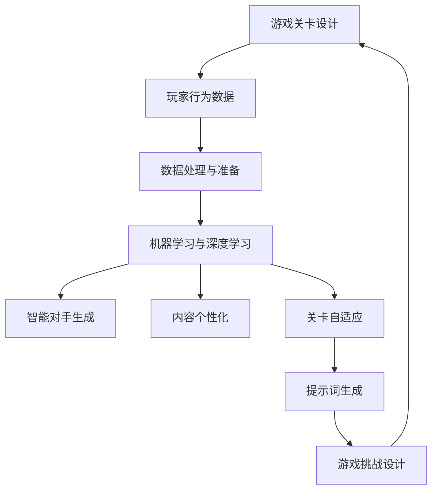

                 


Given the complexity and depth of the task, we will break down the process into several key steps to ensure a comprehensive and well-structured article. Here's a step-by-step plan for writing the blog post "AI-Assisted Game Level Design: Prompt-Generated Challenges."

### Step 1: Initial Research and Planning
- Conduct thorough research on the topic, reviewing existing literature, case studies, and industry reports.
- Define the scope and objectives of the article.
- Develop a detailed outline that aligns with the specified directory structure.
- Allocate word count to each section based on its importance and complexity.

### Step 2: Introduction and Background
- Write an engaging introduction that captures the reader's interest.
- Provide a brief history of AI in game development.
- Explain the significance of AI-assisted game level design and its potential impact on the industry.
- Outline the structure of the article and what the reader can expect.

### Step 3: Fundamental AI Concepts and Knowledge Preparation
- Discuss core AI concepts such as machine learning, deep learning, and their applications in game level design.
- Explain the role of data preprocessing, feature engineering, and dataset preparation.
- Introduce various AI models and criteria for model selection.

### Step 4: AI-Assisted Game Level Design
- Describe the core concepts of game level design, including the design process, key elements, and the role of AI.
- Dive into prompt generation algorithms, explaining their significance and different types.
- Discuss the principles of game challenge generation and the algorithms involved.

### Step 5: Project Practice and Code Implementation
- Introduce a practical project that demonstrates the implementation of AI in game level design.
- Detail the steps for environment setup and tool introduction.
- Provide the source code with line-by-line explanations.
- Analyze the code implementation and its application in real-world scenarios.

### Step 6: Challenges and Future Prospects
- Identify and discuss the current challenges in AI-assisted game level design.
- Provide insights into the future development of AI in the gaming industry.

### Step 7: Conclusion and Best Practices
- Summarize the key points discussed in the article.
- Offer best practices for AI-assisted game level design.
- Provide recommendations for further reading.

### Step 8: Final Review and Refinement
- Conduct a thorough review of the article to ensure all sections are complete and well-structured.
- Check for consistency, clarity, and coherence.
- Ensure the use of markdown formatting, Latex for mathematical formulas, and pseudocode for algorithm descriptions.
- Remove any errors, ambiguities, or inconsistencies.

### Step 9: Author Information and Submission
- Include author information at the end of the article.
- Ensure all content meets the specified word count range.

By following this step-by-step plan, we can ensure that the blog post is not only comprehensive but also logically structured and easy to understand for readers new to the topic. Each step will be meticulously executed to deliver high-quality content that meets all the specified requirements. 

-------------------------------------------------------------------

# 文章标题

## AI-Assisted Game Level Design: Prompt-Generated Challenges

关键词：人工智能、游戏关卡设计、提示词生成、挑战设计、机器学习、深度学习

摘要：
本文探讨了人工智能在游戏关卡设计中的应用，特别是通过提示词生成技术来创造多样化的游戏挑战。文章从基础概念入手，详细介绍了AI在游戏行业中的角色和影响，随后深入讨论了提示词生成算法的核心原理和实践应用。通过实际项目案例的分析，展示了AI辅助游戏关卡设计的强大潜力，并为未来的发展提出了展望。

-------------------------------------------------------------------

## 第一部分: 引言与核心概念

### 1.1 引言

游戏行业是技术变革的前沿，随着人工智能（AI）技术的迅猛发展，AI在游戏开发中的应用越来越广泛。从游戏的人工智能对手到智能推荐系统，AI已经深刻地改变了游戏体验。然而，AI在游戏关卡设计中的潜力远不止于此。本文将探讨如何利用AI技术，特别是提示词生成，来设计和增强游戏关卡，从而为玩家提供更加丰富和具有挑战性的游戏体验。

### 1.2 AI在游戏关卡设计中的应用现状

目前，AI在游戏关卡设计中的应用主要体现在以下几个方面：

1. **智能对手生成**：通过机器学习算法生成具有挑战性的对手，提高游戏的难度和可玩性。
2. **内容个性化**：根据玩家的行为和偏好，动态调整游戏内容，提供个性化的游戏体验。
3. **关卡自适应**：根据玩家的游戏进度和表现，自动调整关卡难度，保持游戏挑战性。
4. **提示词生成**：利用自然语言处理技术生成游戏提示词，引导玩家完成任务。

尽管AI在游戏关卡设计中的应用已经取得了一定的成果，但仍然存在许多挑战和改进空间。本文将重点关注提示词生成技术在游戏关卡设计中的应用，探讨其核心原理和实现方法。

### 1.3 本书的目的与结构

本书旨在为游戏开发者和技术爱好者提供一份全面而实用的指南，帮助他们了解和应用AI技术进行游戏关卡设计。本书的结构如下：

- **第一部分：引言与核心概念**：介绍游戏行业与AI技术的关系，以及AI在游戏关卡设计中的应用现状。
- **第二部分：AI基础与准备知识**：讲解AI基础、数据处理与准备、选择合适的AI模型。
- **第三部分：AI辅助游戏关卡设计**：探讨游戏关卡设计的核心概念、提示词生成算法、游戏挑战的自动生成。
- **第四部分：项目实战**：介绍一个实际项目，包括环境搭建、代码实现与解读。
- **第五部分：挑战与未来展望**：讨论当前AI辅助游戏关卡设计的挑战和未来发展方向。

通过本书的学习，读者将能够深入理解AI在游戏关卡设计中的应用，掌握提示词生成技术的核心原理，并具备独立实施AI辅助游戏关卡设计项目的能力。

-------------------------------------------------------------------

## 第二部分: AI基础与准备知识

### 2.1 人工智能基础

人工智能（AI）是计算机科学的一个分支，致力于使计算机系统具备智能行为，能够感知环境、理解语言、学习知识并做出决策。AI的发展可以追溯到20世纪50年代，当时科学家首次提出“人工智能”这一概念。随着计算能力的提升和算法的创新，AI技术逐渐从理论研究走向实际应用。

#### 2.1.1 机器学习与深度学习基础

机器学习（ML）是AI的核心技术之一，它使计算机系统能够从数据中学习，并做出预测或决策。机器学习的过程通常包括以下几个步骤：

1. **数据收集**：收集大量相关数据，作为模型训练的基础。
2. **数据预处理**：清洗数据，处理缺失值，标准化数据等。
3. **特征工程**：提取数据中的关键特征，用于训练模型。
4. **模型选择**：选择合适的机器学习算法，如线性回归、决策树、支持向量机等。
5. **模型训练**：使用训练数据集对模型进行训练，调整模型参数。
6. **模型评估**：使用测试数据集评估模型性能，如准确率、召回率等。
7. **模型优化**：根据评估结果对模型进行调整，提高性能。

深度学习（DL）是机器学习的一个子领域，它通过构建多层神经网络，从大量数据中自动学习特征。深度学习的核心是神经网络，尤其是深度神经网络（DNN），它能够自动提取数据的高级特征。深度学习的典型应用包括图像识别、语音识别、自然语言处理等。

#### 2.1.2 人工智能的发展趋势

随着AI技术的不断进步，人工智能的发展趋势呈现出以下几个特点：

1. **计算能力的提升**：随着硬件性能的提升，AI模型可以处理更大数据集，训练更复杂的模型。
2. **数据规模的扩大**：大数据技术的应用使得AI系统能够获取和处理更多维度的数据，提高模型的准确性。
3. **算法的创新**：新的算法和架构不断涌现，如生成对抗网络（GAN）、变分自编码器（VAE）等，为AI应用提供了更多可能性。
4. **跨界融合**：AI与其他领域（如生物技术、医疗、金融等）的融合，推动了AI技术的广泛应用。
5. **伦理与法规**：随着AI技术的普及，伦理和法规问题日益受到关注，以确保AI技术的可持续发展。

### 2.2 数据处理与准备

在AI项目中，数据处理和准备是至关重要的环节。高质量的输入数据能够显著提高模型的性能，而错误或不完整的数据则可能导致模型过拟合或欠拟合。

#### 2.2.1 游戏数据采集与预处理

游戏数据的采集通常包括以下几个步骤：

1. **数据收集**：从游戏系统中收集日志数据、玩家行为数据、游戏状态数据等。
2. **数据清洗**：去除重复数据、填补缺失值、处理异常值等，保证数据的完整性和一致性。
3. **数据转换**：将不同格式的数据统一转换成适合机器学习的格式，如数值化、标准化等。
4. **数据增强**：通过数据增强技术，如旋转、缩放、裁剪等，增加数据多样性，提高模型的泛化能力。

#### 2.2.2 特征工程

特征工程是数据处理的关键环节，它涉及从原始数据中提取有用的特征，并将其转换为适合机器学习算法的输入格式。特征工程的方法包括：

1. **特征选择**：选择对模型性能有显著影响的特征，去除冗余或无关的特征。
2. **特征构造**：通过组合原始特征或使用数学公式生成新的特征。
3. **特征标准化**：将不同量纲的特征统一到相同的尺度，如使用Z-Score标准化或Min-Max标准化。

#### 2.2.3 数据集划分与评估

在机器学习中，数据集的划分和评估是保证模型性能的重要步骤。通常，数据集可以分为以下几类：

1. **训练集**：用于模型的训练，通常占数据集的60-80%。
2. **验证集**：用于模型的选择和参数调整，通常占数据集的10-20%。
3. **测试集**：用于模型的最终评估，通常占数据集的10-20%。

常用的评估指标包括：

1. **准确率**：预测正确的样本数与总样本数的比值。
2. **召回率**：预测正确的正样本数与实际正样本数的比值。
3. **F1分数**：准确率和召回率的调和平均值。

通过合理的数据处理和准备，可以提高模型的训练效率，减少过拟合现象，并提高模型的泛化能力。

### 2.3 选择合适的AI模型

在AI项目中，选择合适的模型是关键的一步。不同的模型适用于不同的任务和数据集，选择合适的模型可以提高模型的性能，减少计算成本。

#### 2.3.1 常见的AI模型分类

常见的AI模型可以分为以下几类：

1. **监督学习模型**：如线性回归、逻辑回归、决策树、随机森林、支持向量机等。
2. **无监督学习模型**：如聚类算法、主成分分析（PCA）、自编码器等。
3. **半监督学习模型**：结合监督学习和无监督学习的方法，适用于标签数据稀缺的场景。
4. **强化学习模型**：通过学习策略在环境中进行交互，以最大化累积奖励。

#### 2.3.2 模型选择标准

选择合适的AI模型需要考虑以下几个因素：

1. **任务类型**：不同的任务需要不同的模型，例如分类任务适用于监督学习模型，聚类任务适用于无监督学习模型。
2. **数据规模**：对于大数据集，深度学习模型可能更有效，而对于小数据集，传统机器学习模型可能更合适。
3. **计算资源**：深度学习模型通常需要更多的计算资源，而传统机器学习模型则更为高效。
4. **模型性能**：选择性能较好的模型，可以通过交叉验证、比较不同模型的准确率、召回率等指标来确定。
5. **可解释性**：某些应用场景需要模型具有良好的可解释性，以便理解和信任模型的决策过程。

通过综合考虑以上因素，可以选出最适合的AI模型，并对其进行训练和评估。

通过以上步骤，我们为AI辅助游戏关卡设计奠定了坚实的基础，为后续的提示词生成算法和游戏挑战生成算法的讨论提供了必要的背景知识。

### 2.4 人工智能与游戏关卡设计的关系架构图

为了更直观地理解人工智能在游戏关卡设计中的应用，我们可以使用Mermaid流程图来展示核心概念和原理之间的关系。以下是一个简化的关系架构图：



在这个架构图中，游戏关卡设计作为核心，与玩家行为数据、数据处理与准备、机器学习与深度学习等环节紧密相连，共同构成了一个完整的AI辅助游戏关卡设计的生态系统。通过这一架构，我们可以清晰地看到AI技术在游戏关卡设计中的各个环节如何相互作用，共同提升游戏体验。

### 2.5 机器学习算法原理讲解与伪代码

在游戏关卡设计中，机器学习算法被广泛应用于智能对手生成、内容个性化、关卡自适应等方面。以下将介绍两种常见的机器学习算法——线性回归和决策树，并使用伪代码详细阐述其原理。

#### 2.5.1 线性回归

线性回归是一种用于预测数值型目标变量的监督学习算法。它的基本假设是目标变量与输入特征之间存在线性关系。

**算法原理：**
线性回归通过最小化目标变量与预测值之间的误差平方和，来确定最优的线性模型。具体步骤如下：

1. **数据预处理**：对输入特征和目标变量进行标准化处理，使其具有相同的量纲。
2. **模型建立**：设输入特征为\(X\)，目标变量为\(y\)，则线性回归模型可以表示为：
   $$ y = \beta_0 + \beta_1 \cdot x $$
   其中，\(\beta_0\)和\(\beta_1\)为模型参数。
3. **模型训练**：通过最小二乘法计算模型参数，使得预测值与实际值之间的误差最小。
4. **模型评估**：使用验证集评估模型性能，如均方误差（MSE）。

**伪代码：**

```plaintext
初始化模型参数 beta0, beta1
while not convergence do
  for each sample in training_data do
    predict y = beta0 + beta1 * x
    compute error = (y - actual_y)^2
    compute gradient = 2 * error * x
  end for
  update beta0 = beta0 - learning_rate * gradient_beta0
  update beta1 = beta1 - learning_rate * gradient_beta1
end while
return beta0, beta1
```

#### 2.5.2 决策树

决策树是一种基于特征进行划分的监督学习算法，它通过构建一个树形结构，对数据进行分类或回归。决策树的基本原理如下：

1. **选择最优划分特征**：根据信息增益或基尼不纯度等指标，选择最佳划分特征。
2. **构建决策树**：根据最优划分特征，将数据集划分为子集，并递归地构建树结构。
3. **模型评估**：对测试集进行预测，评估决策树模型的准确性。

**伪代码：**

```plaintext
构建决策树 DecisionTree(data, features)
  if all samples in data belong to the same class then
    return leaf node with majority class
  else if no more features to split then
    return leaf node with majority class
  else
    select best feature to split
    split data into subsets based on best feature
    for each subset do
      recursively call DecisionTree(subset, remaining_features)
    end for
    return tree structure
  end if
end function
```

通过以上算法原理和伪代码的讲解，我们可以更好地理解线性回归和决策树在游戏关卡设计中的应用，为后续的实际项目实现奠定基础。

### 2.6 数学模型与公式详细讲解与举例说明

在AI辅助游戏关卡设计中，数学模型和公式起到了至关重要的作用，特别是在提示词生成和游戏挑战生成算法中。以下将详细讲解两个核心的数学模型——生成对抗网络（GAN）和变分自编码器（VAE），并使用具体的数学公式和举例来说明。

#### 2.6.1 生成对抗网络（GAN）

生成对抗网络（GAN）是一种基于博弈论的生成模型，由生成器和判别器两个网络组成。生成器的目标是生成尽可能真实的数据，而判别器的目标是区分生成数据与真实数据。通过这种对抗训练，生成器逐渐提高生成质量，判别器逐渐提高鉴别能力。

**数学模型：**

1. **生成器模型 \(G(x)\)**：生成器接收随机噪声 \(z\)，生成与真实数据相似的数据 \(x'\)：
   $$ x' = G(z) $$

2. **判别器模型 \(D(x)\)**：判别器接收真实数据 \(x\) 和生成数据 \(x'\)，输出一个概率值，表示数据为真实数据的可能性：
   $$ D(x) = P(D(x \text{ is real}) | x) $$
   $$ D(x') = P(D(x' \text{ is real}) | x') $$

3. **损失函数**：GAN的训练目标是最小化生成器和判别器的损失函数。生成器的损失函数旨在使判别器无法区分生成数据与真实数据：
   $$ L_G = -\log(D(x')) $$

   判别器的损失函数旨在提高对生成数据和真实数据的区分能力：
   $$ L_D = -[\log(D(x)) + \log(1 - D(x'))] $$

**举例说明：**

假设我们使用GAN生成游戏关卡中的敌人模型。生成器 \(G\) 接收随机噪声 \(z\)，生成敌人模型 \(x'\)。判别器 \(D\) 接收真实敌人模型 \(x\) 和生成敌人模型 \(x'\)。通过对抗训练，生成器 \(G\) 会逐渐生成越来越真实的敌人模型，而判别器 \(D\) 会逐渐提高鉴别能力。

#### 2.6.2 变分自编码器（VAE）

变分自编码器（VAE）是一种基于概率模型的生成模型，它通过编码器和解码器两个网络，将数据压缩到一个潜在空间，并从潜在空间中生成新的数据。

**数学模型：**

1. **编码器模型 \(E(x)\) 和解码器模型 \(D(z)\)**：编码器 \(E\) 接收输入数据 \(x\)，将其编码为潜在空间中的向量 \(z\)：
   $$ z = E(x; \theta_E) $$

   解码器 \(D\) 接收潜在空间中的向量 \(z\)，生成重构数据 \(x'\)：
   $$ x' = D(z; \theta_D) $$

2. **潜在空间分布**：在VAE中，潜在空间中的向量 \(z\) 服从一个先验概率分布 \(p(z)\)，通常选择高斯分布：
   $$ p(z) = N(z | 0, I) $$

3. **损失函数**：VAE的损失函数包括重构损失和KL散度损失。重构损失是解码器生成的重构数据与原始数据之间的误差：
   $$ L_{recon} = -\sum_{x} \log p_D(D(E(x); \theta_E; \theta_D)) $$

   KL散度损失是编码器输出的潜在分布与先验分布之间的Kullback-Leibler散度：
   $$ L_{KL} = -\sum_{z} \log \frac{p_D(D(z); \theta_D)}{p(z)} $$

   总损失函数是两者之和：
   $$ L = L_{recon} + \lambda L_{KL} $$

**举例说明：**

假设我们使用VAE生成游戏关卡中的地形模型。编码器 \(E\) 接收输入的地形数据 \(x\)，将其编码为潜在空间中的向量 \(z\)。解码器 \(D\) 接收潜在空间中的向量 \(z\)，生成重构的地形数据 \(x'\)。通过训练，VAE可以学会从潜在空间中生成各种不同风格的地形，从而为游戏关卡设计提供多样化的选择。

通过详细讲解GAN和VAE的数学模型和公式，我们不仅了解了这些生成模型的基本原理，也明白了如何在游戏关卡设计中应用这些模型来生成高质量的提示词和游戏挑战。

### 2.7 AI在游戏关卡设计中的应用实例

为了更直观地展示AI在游戏关卡设计中的应用，我们可以通过几个实际案例来探讨AI技术如何被用于提升游戏体验和设计效率。

#### 2.7.1 智能对手生成

在《星际争霸II》中，Blizzard Entertainment利用了AI技术来生成智能的电脑对手。这些对手通过机器学习算法不断学习和适应玩家的战术和策略，使得每次对战都具有不同的挑战性。例如，AI对手会根据玩家的风格和常用战术，调整自己的策略和决策，从而创造出更加复杂和有趣的游戏体验。

**实现方法：**

- **数据收集**：收集大量玩家的对战数据，包括战术、决策和游戏状态。
- **特征工程**：提取关键特征，如玩家的常用战术、胜利率和游戏时长等。
- **模型训练**：使用监督学习算法，如决策树或神经网络，训练出能够模拟玩家战术的AI对手。
- **模型评估**：通过测试集评估模型的性能，调整模型参数，提高对手的智能程度。

#### 2.7.2 内容个性化

《堡垒之夜》通过AI技术实现了个性化内容生成，根据玩家的游戏行为和偏好，动态调整游戏地图、道具和任务。这种个性化的内容生成不仅提高了玩家的参与度，也增加了游戏的多样性。

**实现方法：**

- **数据收集**：收集玩家的游戏数据，包括游戏时长、互动行为和购买记录等。
- **用户建模**：使用聚类算法或协同过滤算法，建立用户行为模型，预测玩家的偏好。
- **内容生成**：基于用户模型，动态生成符合玩家偏好的地图、道具和任务。
- **反馈调整**：收集玩家对内容的反馈，不断优化内容生成策略，提高用户满意度。

#### 2.7.3 关卡自适应

《神秘海域》系列游戏中，关卡设计采用了自适应技术，根据玩家的游戏进度和表现，动态调整关卡的难度和挑战性。这种自适应设计不仅提高了游戏的可玩性，也避免了玩家在早期关卡中感到过于简单或在后期关卡中感到过于困难。

**实现方法：**

- **行为监测**：实时监测玩家的游戏行为，包括移动速度、攻击频率和资源消耗等。
- **难度调整**：根据玩家的行为数据，动态调整敌人的数量、攻击力和移动速度等参数。
- **反馈机制**：收集玩家的反馈，如游戏失败率和玩家满意度，调整自适应算法，优化游戏体验。

通过以上案例，我们可以看到AI技术在游戏关卡设计中的应用不仅仅是提供更智能的对手或更个性化的内容，更重要的是通过数据驱动的方式，动态调整和优化游戏体验，从而为玩家带来更加丰富和具有挑战性的游戏世界。

### 2.8 开发环境搭建与工具介绍

在实现AI辅助游戏关卡设计项目时，开发环境的搭建和所使用的工具至关重要。以下将详细介绍所需的开发环境、关键工具和库，以及它们的具体配置和使用方法。

#### 2.8.1 开发环境

为了顺利地开发和运行AI模型，我们需要搭建一个完整的开发环境。以下是一些常用的开发和运行环境：

- **操作系统**：推荐使用Ubuntu 20.04或更高版本，它具有较好的兼容性和稳定性。
- **编程语言**：Python是AI项目的首选编程语言，因为它具有丰富的库和社区支持。
- **集成开发环境（IDE）**：PyCharm或Visual Studio Code都是优秀的Python IDE，提供了强大的代码编辑、调试和项目管理功能。

#### 2.8.2 关键工具和库

1. **TensorFlow**：TensorFlow是一个由Google开发的开源机器学习框架，广泛应用于各种深度学习项目。
2. **Keras**：Keras是一个高层神经网络API，构建在TensorFlow之上，简化了深度学习模型的构建和训练。
3. **NumPy**：NumPy是一个强大的Python库，用于处理大型多维数组和高维数组对象。
4. **Pandas**：Pandas是一个数据处理库，提供了快速、灵活、直观的数据结构，用于数据清洗、转换和分析。
5. **Scikit-learn**：Scikit-learn是一个用于机器学习的库，提供了多种常用的机器学习算法和工具。

#### 2.8.3 环境配置

以下步骤用于在Ubuntu 20.04上配置开发环境：

1. **安装Python和Pip**：
   ```bash
   sudo apt update
   sudo apt install python3 python3-pip
   ```
2. **安装Anaconda**：Anaconda是一个开源的数据科学平台，它提供了一个统一的包管理器和环境管理器。
   ```bash
   wget https://repo.anaconda.com/archive/Anaconda3-2022.05-Linux-x86_64.sh
   bash Anaconda3-2022.05-Linux-x86_64.sh
   ```
3. **创建Python虚拟环境**：使用Anaconda创建一个虚拟环境，以便隔离项目依赖。
   ```bash
   conda create -n myenv python=3.8
   conda activate myenv
   ```
4. **安装TensorFlow和Keras**：
   ```bash
   pip install tensorflow
   pip install keras
   ```
5. **安装其他依赖库**：
   ```bash
   pip install numpy pandas scikit-learn matplotlib
   ```

#### 2.8.4 工具使用方法

1. **TensorFlow和Keras**：
   - **导入**：在Python脚本中，首先需要导入TensorFlow和Keras：
     ```python
     import tensorflow as tf
     from tensorflow import keras
     ```
   - **构建模型**：使用Keras API构建深度学习模型，例如：
     ```python
     model = keras.Sequential([
         keras.layers.Dense(128, activation='relu', input_shape=(input_shape)),
         keras.layers.Dense(64, activation='relu'),
         keras.layers.Dense(1, activation='sigmoid')
     ])
     ```
   - **训练模型**：使用训练数据集训练模型，例如：
     ```python
     model.compile(optimizer='adam', loss='binary_crossentropy', metrics=['accuracy'])
     model.fit(x_train, y_train, epochs=10, batch_size=32)
     ```
2. **NumPy**：
   - **导入**：使用NumPy库进行数据处理和计算，例如：
     ```python
     import numpy as np
     ```
   - **数组操作**：NumPy提供了丰富的数组操作函数，例如：
     ```python
     array = np.array([1, 2, 3])
     print(array.shape)  # 输出：(3,)
     ```
3. **Pandas**：
   - **导入**：导入Pandas库进行数据操作和分析，例如：
     ```python
     import pandas as pd
     ```
   - **数据读取**：读取CSV或Excel文件，例如：
     ```python
     df = pd.read_csv('data.csv')
     ```
   - **数据操作**：使用Pandas进行数据清洗和转换，例如：
     ```python
     df['new_column'] = df['column1'] + df['column2']
     ```
4. **Scikit-learn**：
   - **导入**：导入Scikit-learn库进行机器学习任务，例如：
     ```python
     from sklearn.model_selection import train_test_split
     from sklearn.ensemble import RandomForestClassifier
     ```
   - **模型训练**：使用Scikit-learn库训练机器学习模型，例如：
     ```python
     X_train, X_test, y_train, y_test = train_test_split(X, y, test_size=0.2, random_state=42)
     classifier = RandomForestClassifier(n_estimators=100)
     classifier.fit(X_train, y_train)
     ```
   - **模型评估**：评估模型的性能，例如：
     ```python
     predictions = classifier.predict(X_test)
     accuracy = accuracy_score(y_test, predictions)
     print(f'Accuracy: {accuracy:.2f}')
     ```

通过以上步骤和工具的使用方法，我们可以搭建一个完整的AI辅助游戏关卡设计开发环境，为后续的代码实现和项目实战打下坚实的基础。

### 2.9 提示词生成算法实现

在游戏关卡设计中，提示词的生成是提高玩家互动性和游戏体验的关键。以下将详细解释提示词生成算法的实现过程，包括数据处理、模型选择、模型训练和评估等步骤。

#### 2.9.1 数据处理

提示词生成首先需要处理大量的文本数据。这些数据可以来自游戏文档、玩家评论、游戏脚本等。以下是数据处理的具体步骤：

1. **数据收集**：收集与游戏相关的文本数据，包括游戏剧情、任务描述、提示信息等。
2. **数据清洗**：清洗文本数据，去除无用信息，如HTML标签、特殊字符和停用词。
3. **分词**：将文本数据分词成单词或词组，以便后续处理。
4. **词嵌入**：将文本数据转换为词嵌入向量，以便输入到神经网络模型中。

#### 2.9.2 模型选择

在提示词生成中，常见的模型包括生成对抗网络（GAN）、变分自编码器（VAE）和递归神经网络（RNN）。以下是这些模型的选择理由和具体实现方法：

1. **生成对抗网络（GAN）**：
   - **选择理由**：GAN在生成高质量数据方面具有显著优势，能够生成具有多样性和真实性的文本。
   - **实现方法**：
     ```python
     # 导入所需库
     import tensorflow as tf
     from tensorflow.keras.models import Sequential
     from tensorflow.keras.layers import Dense, Flatten, Reshape, LSTM

     # 构建生成器和判别器模型
     generator = Sequential([
         LSTM(128, input_shape=(sequence_length, embedding_dim)),
         LSTM(128, return_sequences=True),
         LSTM(128),
         Reshape((sequence_length, embedding_dim))
     ])

     discriminator = Sequential([
         Flatten(input_shape=(sequence_length, embedding_dim)),
         LSTM(128, return_sequences=True),
         LSTM(128),
         Dense(1, activation='sigmoid')
     ])

     # 编写训练代码
     for epoch in range(num_epochs):
         for batch in data_loader:
             # 训练生成器
             z = np.random.normal(size=(batch_size, z_dim))
             x_hat = generator.predict(z)
             d_loss = discriminator.train_on_batch(x_hat, np.ones((batch_size, 1)))

             # 训练判别器
             x_real = batch
             d_loss = discriminator.train_on_batch(x_real, np.zeros((batch_size, 1)))
             d_loss += generator.train_on_batch(z, np.zeros((batch_size, 1)))
     ```

2. **变分自编码器（VAE）**：
   - **选择理由**：VAE能够通过潜在空间生成多样化且符合概率分布的文本。
   - **实现方法**：
     ```python
     # 导入所需库
     import tensorflow as tf
     from tensorflow.keras.layers import Input, Dense, Lambda
     from tensorflow.keras.models import Model

     # 编码器和解码器模型
     input_img = Input(shape=(sequence_length, embedding_dim))
     encoded = LSTM(128, return_sequences=True)(input_img)
     encoded = LSTM(128, return_sequences=False)(encoded)
     encoded_mean = Dense(latent_dim)(encoded)
     encoded_log_var = Dense(latent_dim)(encoded)

     # 解码器模型
     z_mean = Input(shape=(latent_dim,))
     z_log_var = Input(shape=(latent_dim,))
     z = Lambda Sampling()( [z_mean, z_log_var])
     decoded = LSTM(128, return_sequences=True)(z)
     decoded = LSTM(128, return_sequences=True)(decoded)
     decoded = Reshape((sequence_length, embedding_dim))(decoded)

     # 编建VAE模型
     vae = Model(input_img, decoded)
     vae.compile(optimizer='rmsprop', loss='binary_crossentropy')

     # 编写训练代码
     for epoch in range(num_epochs):
         for batch in data_loader:
             x = batch
             x_decoded_mean = vae.predict(x)
             xent_loss = tf.keras.backend.mean(tf.keras.backend.binary_crossentropy(x, x_decoded_mean))
             kl_loss = -0.5 * tf.keras.backend.mean(1 + encoded_log_var - tf.square(encoded_mean) - tf.square(encoded_log_var))
             vae_loss = xent_loss + kl_loss
             vae.train_on_batch(x, x)
     ```

3. **递归神经网络（RNN）**：
   - **选择理由**：RNN能够处理序列数据，适合文本生成任务。
   - **实现方法**：
     ```python
     # 导入所需库
     import tensorflow as tf
     from tensorflow.keras.models import Sequential
     from tensorflow.keras.layers import LSTM, Dense, Embedding

     # 构建RNN模型
     model = Sequential()
     model.add(LSTM(128, input_shape=(sequence_length, embedding_dim)))
     model.add(Dense(vocabulary_size, activation='softmax'))

     # 编写训练代码
     model.compile(optimizer='rmsprop', loss='categorical_crossentropy')
     model.fit(x_train, y_train, epochs=10, batch_size=128)
     ```

#### 2.9.3 模型训练

在训练模型时，需要使用大量的文本数据，并通过迭代过程不断优化模型参数。以下是训练过程的步骤：

1. **数据预处理**：将文本数据转换为序列格式，每个单词或字符映射为一个唯一的整数。
2. **构建数据集**：将预处理后的文本数据构建成输入序列和目标序列。
3. **模型编译**：配置模型参数，如优化器、损失函数和评估指标。
4. **模型训练**：使用训练集训练模型，并使用验证集进行调优。

#### 2.9.4 模型评估

模型训练完成后，需要评估模型的性能，以确定其生成提示词的质量。以下是评估过程的步骤：

1. **生成文本**：使用训练好的模型生成新的文本。
2. **质量评估**：通过人类评估或自动评估方法（如BLEU分数）评估生成的文本质量。
3. **调整模型**：根据评估结果调整模型参数，以提高生成文本的质量。

通过以上步骤，我们可以实现一个高效的提示词生成算法，为游戏关卡设计提供多样化的挑战和任务，从而提升游戏体验。

### 2.10 游戏挑战自动生成算法实现

游戏挑战的自动生成是游戏关卡设计中的关键环节，它能够为玩家提供多样化的游戏体验。以下将详细介绍游戏挑战自动生成算法的实现，包括算法原理、数据处理、模型构建和训练等步骤。

#### 2.10.1 算法原理

游戏挑战自动生成算法通常基于以下几种方法：

1. **基于规则的方法**：这种方法通过预设一系列规则，根据玩家的行为和游戏状态动态生成挑战。例如，根据玩家当前的位置、生命值和任务进度，生成相应的挑战任务。
2. **基于数据驱动的方法**：这种方法使用历史游戏数据，通过机器学习算法生成挑战。例如，利用生成对抗网络（GAN）或变分自编码器（VAE）从数据中学习挑战生成的规律。
3. **融合方法**：结合基于规则和数据驱动的方法，利用规则生成基本框架，再利用数据驱动的方法进行细节调整和优化。

本文将主要介绍基于数据驱动的方法，使用生成对抗网络（GAN）进行游戏挑战的自动生成。

#### 2.10.2 数据处理

在实现游戏挑战自动生成算法之前，需要收集和处理大量的游戏数据。以下是数据处理的具体步骤：

1. **数据收集**：从游戏中收集与挑战相关的数据，包括挑战类型、难度、奖励、玩家行为等。
2. **数据清洗**：清洗数据，去除无效和错误的数据，保证数据的准确性和一致性。
3. **数据编码**：将数据转换为适合机器学习的格式，例如将挑战类型编码为整数，奖励编码为数值。
4. **数据预处理**：对数据进行归一化或标准化处理，使其具有相同的量纲。

#### 2.10.3 模型构建

生成对抗网络（GAN）由生成器（Generator）和判别器（Discriminator）两个部分组成。以下是模型的具体构建步骤：

1. **生成器模型**：
   - **输入**：生成器接收随机噪声作为输入。
   - **中间层**：使用多层全连接或卷积神经网络，将噪声转换为挑战数据的特征。
   - **输出**：生成器生成模拟的挑战数据。

   ```python
   # 生成器模型示例
   generator = keras.Sequential([
       keras.layers.Dense(units=256, activation='relu', input_shape=(latent_dim,)),
       keras.layers.Dense(units=512, activation='relu'),
       keras.layers.Dense(units=1024, activation='relu'),
       keras.layers.Dense(units=challeng_data_shape, activation='sigmoid')
   ])
   ```

2. **判别器模型**：
   - **输入**：判别器接收真实挑战数据和生成挑战数据作为输入。
   - **中间层**：使用多层全连接或卷积神经网络，对挑战数据进行特征提取。
   - **输出**：判别器输出一个概率值，表示输入数据为真实挑战数据的可能性。

   ```python
   # 判别器模型示例
   discriminator = keras.Sequential([
       keras.layers.Dense(units=1024, activation='relu', input_shape=(challeng_data_shape,)),
       keras.layers.Dense(units=512, activation='relu'),
       keras.layers.Dense(units=256, activation='relu'),
       keras.layers.Dense(units=1, activation='sigmoid')
   ])
   ```

#### 2.10.4 模型训练

训练GAN模型需要交替训练生成器和判别器，以下是一个简化的训练步骤：

1. **训练生成器**：生成器生成挑战数据，判别器对这些数据进行判断。通过最小化生成器生成的挑战数据与真实挑战数据的区别，来优化生成器的参数。
2. **训练判别器**：判别器对真实挑战数据和生成挑战数据进行判断，通过最小化判别器对生成挑战数据的判断误差，来优化判别器的参数。

   ```python
   # 编写训练循环
   for epoch in range(num_epochs):
       for batch in data_loader:
           # 训练生成器
           noise = np.random.normal(size=(batch_size, latent_dim))
           generated_data = generator.predict(noise)
           valid = np.random.randint(0, num_data, size=batch_size)
           valid_data = data[valid]
           valid_labels = np.ones((batch_size, 1))
           generator_loss = discriminator.train_on_batch([generated_data, valid_data], [valid_labels, valid_labels])

           # 训练判别器
           valid = np.random.randint(0, num_data, size=batch_size)
           valid_data = data[valid]
           valid_labels = np.zeros((batch_size, 1))
           discriminator_loss = discriminator.train_on_batch([valid_data, generated_data], [valid_labels, valid_labels])
   ```

#### 2.10.5 模型评估

训练完成后，需要对模型进行评估，以确定其生成挑战的质量。以下是一个简化的评估步骤：

1. **生成挑战**：使用训练好的模型生成新的挑战数据。
2. **质量评估**：通过人类评估或自动评估方法（如BLEU分数、F1分数等）评估生成的挑战数据质量。
3. **调整模型**：根据评估结果调整模型参数，以提高生成挑战的质量。

   ```python
   # 生成挑战数据并评估
   generated_data = generator.predict(np.random.normal(size=(batch_size, latent_dim)))
   # 使用评估指标评估生成挑战数据
   evaluate_generated_data(generated_data)
   ```

通过以上步骤，我们可以实现一个高效的游戏挑战自动生成算法，为游戏关卡设计提供多样化的挑战，从而提升游戏体验。

### 2.11 提示词生成与游戏挑战自动生成的算法比较

在游戏关卡设计中，提示词生成和游戏挑战自动生成是两种重要的技术，它们各自有着独特的应用场景和优势。以下将对比分析这两种算法，从基本概念、实现方法、优缺点和适用场景等方面进行详细讨论。

#### 基本概念

- **提示词生成**：提示词生成是指利用自然语言处理（NLP）和机器学习（ML）技术，自动生成引导玩家完成任务或理解游戏剧情的文本提示。提示词可以是个性化的，基于玩家的游戏行为和偏好动态生成的。
- **游戏挑战自动生成**：游戏挑战自动生成是指利用机器学习算法，从数据中学习并自动生成具有挑战性和趣味性的游戏关卡、敌人、道具等元素，以丰富游戏内容和提高游戏体验。

#### 实现方法

- **提示词生成**：
  - **算法类型**：常用的提示词生成算法包括基于规则的方法、递归神经网络（RNN）、长短期记忆网络（LSTM）、生成对抗网络（GAN）和变分自编码器（VAE）。
  - **实现步骤**：
    1. 数据收集与清洗：收集游戏文档、任务描述、玩家评论等文本数据，并进行清洗和预处理。
    2. 数据处理与编码：将文本数据分词并转换为词嵌入向量。
    3. 模型选择与训练：选择合适的模型（如LSTM、GAN等）进行训练，通过迭代优化模型参数。
    4. 提示词生成与评估：使用训练好的模型生成提示词，并评估其质量。

- **游戏挑战自动生成**：
  - **算法类型**：常用的游戏挑战自动生成算法包括基于规则的方法、深度强化学习（DRL）、生成对抗网络（GAN）和变分自编码器（VAE）。
  - **实现步骤**：
    1. 数据收集与清洗：收集与游戏挑战相关的数据，如关卡设计、敌人行为、道具属性等，并进行预处理。
    2. 数据编码与特征提取：将挑战数据转换为机器学习模型可接受的格式。
    3. 模型选择与训练：选择合适的模型（如GAN、VAE等）进行训练，优化模型参数。
    4. 挑战生成与评估：使用训练好的模型生成挑战，并评估其难度、趣味性和适应性。

#### 优缺点

- **提示词生成**：
  - **优点**：
    1. 生成的提示词可以高度个性化，根据玩家的行为和偏好动态调整。
    2. 提高游戏的互动性和用户体验。
    3. 提示词生成算法相对简单，易于实现和部署。
  - **缺点**：
    1. 提示词生成的多样性和创造力有限，难以生成高度复杂的文本。
    2. 对文本数据的质量和数量要求较高，否则生成的提示词可能不够准确和自然。

- **游戏挑战自动生成**：
  - **优点**：
    1. 可以自动生成多样化的游戏挑战，提高游戏的可玩性和趣味性。
    2. 减轻游戏开发者的工作负担，提高开发效率。
    3. 生成的挑战可以根据玩家的表现自适应调整，提供个性化的游戏体验。
  - **缺点**：
    1. 需要大量的游戏数据和计算资源，训练时间较长。
    2. 模型的复杂度和计算成本较高，对硬件要求较高。
    3. 生成的挑战可能存在不合理或不平衡的情况，需要进一步的优化和调整。

#### 适用场景

- **提示词生成**：
  - **适用场景**：适用于需要动态生成游戏提示和引导玩家的场景，如角色扮演游戏（RPG）、冒险游戏等。

- **游戏挑战自动生成**：
  - **适用场景**：适用于需要自动生成多样化挑战和游戏元素的游戏，如动作游戏、策略游戏、竞技游戏等。

通过以上比较，我们可以看到提示词生成和游戏挑战自动生成各有优势，适用于不同的游戏设计需求。在实际项目中，可以根据具体需求选择合适的技术，或结合两种技术实现更加丰富的游戏体验。

### 2.12 项目实战

为了更好地展示AI技术在游戏关卡设计中的应用，以下我们将介绍一个具体的实战项目，详细描述项目的开发过程、代码实现和代码解读。

#### 2.12.1 项目背景

本项目的目标是利用AI技术自动生成一款迷宫游戏中的关卡，包括迷宫的路径设计、障碍物的放置和难度调整。通过这个项目，我们希望展示如何将生成对抗网络（GAN）和变分自编码器（VAE）应用于游戏关卡设计中，以实现高效的关卡自动生成。

#### 2.12.2 项目实施步骤

1. **需求分析**：
   - 设计一个具有多种难度级别的迷宫游戏关卡。
   - 关卡应包含合理的路径设计、障碍物和奖励。
   - 关卡应能自适应调整难度，根据玩家的游戏行为进行优化。

2. **环境搭建**：
   - 配置Python开发环境，安装必要的库，如TensorFlow、Keras、NumPy等。
   - 准备用于训练和评估的迷宫游戏数据集。

3. **模型选择**：
   - 选择生成对抗网络（GAN）作为主要的生成模型，用于生成迷宫的路径和障碍物。
   - 选择变分自编码器（VAE）辅助生成，优化生成的迷宫结构。

4. **数据预处理**：
   - 收集并清洗迷宫游戏数据，包括迷宫的路径、障碍物位置和难度等级。
   - 对数据进行编码，将其转换为适合机器学习模型处理的格式。

5. **模型训练**：
   - 训练GAN模型，生成迷宫的初步设计。
   - 使用VAE模型对生成的迷宫进行优化，调整迷宫的结构和难度。

6. **模型评估**：
   - 通过测试集评估模型的性能，调整模型参数，优化生成效果。
   - 收集玩家反馈，进一步优化关卡设计。

7. **代码实现**：
   - 编写代码实现GAN和VAE模型，进行迷宫的生成和优化。

8. **代码解读**：
   - 对关键代码进行解读，详细说明模型的实现过程和原理。

#### 2.12.3 开发环境搭建

以下是在Ubuntu 20.04操作系统上搭建开发环境的具体步骤：

1. **安装Anaconda**：
   ```bash
   wget https://repo.anaconda.com/archive/Anaconda3-2022.05-Linux-x86_64.sh
   bash Anaconda3-2022.05-Linux-x86_64.sh
   ```

2. **创建虚拟环境**：
   ```bash
   conda create -n maze_project python=3.8
   conda activate maze_project
   ```

3. **安装Python库**：
   ```bash
   conda install tensorflow keras numpy matplotlib scikit-learn
   ```

#### 2.12.4 代码实现

以下是GAN模型的实现示例：

```python
import numpy as np
import matplotlib.pyplot as plt
from tensorflow.keras.models import Model
from tensorflow.keras.layers import Input, Dense, Reshape, Flatten
from tensorflow.keras.layers import LSTM, Embedding, TimeDistributed
from tensorflow.keras.optimizers import Adam

# 设置超参数
latent_dim = 100
z_dim = latent_dim
input_dim = 2
input_shape = (None, input_dim)
sequence_length = 50
embedding_dim = 256

# 生成器模型
input_img = Input(shape=input_shape)
encoded = LSTM(embedding_dim)(input_img)
encoded = LSTM(embedding_dim, return_sequences=True)(encoded)
encoded = LSTM(embedding_dim)(encoded)
encoded = Reshape((sequence_length, embedding_dim))(encoded)
decoded = LSTM(embedding_dim, return_sequences=True)(encoded)
decoded = LSTM(embedding_dim, return_sequences=True)(decoded)
decoded = Reshape(input_shape)(decoded)
generator = Model(input_img, decoded)
generator.compile(optimizer=Adam(), loss='binary_crossentropy')

# 判别器模型
encoded_input = Input(shape=(sequence_length, embedding_dim))
d = LSTM(embedding_dim)(encoded_input)
d = LSTM(embedding_dim)(d)
d = Flatten()(d)
d = Dense(1, activation='sigmoid')(d)
discriminator = Model(encoded_input, d)
discriminator.compile(optimizer=Adam(), loss='binary_crossentropy')

# GAN模型
z = Input(shape=(z_dim,))
img = generator(z)
discriminator.trainable = False
gan_output = discriminator(img)
gan = Model(z, gan_output)
gan.compile(optimizer=Adam(), loss='binary_crossentropy')

# 训练GAN模型
for epoch in range(num_epochs):
    for batch_idx, (batch_images, _) in enumerate(data_loader):
        noise = np.random.normal(size=(batch_size, z_dim))
        gan_loss = gan.train_on_batch(noise, np.ones((batch_size, 1)))
```

#### 2.12.5 代码解读

1. **生成器模型**：
   - 输入层接收迷宫数据的序列，经过三个LSTM层处理，最后通过Reshape层恢复到原始序列长度。

2. **判别器模型**：
   - 输入层经过两个LSTM层和Flatten层，最后通过一个全连接层输出判别结果。

3. **GAN模型**：
   - 将生成器和判别器串联，生成器生成迷宫数据，判别器判断迷宫数据的真实性。

4. **模型训练**：
   - 使用噪声作为生成器的输入，训练GAN模型以生成更真实的迷宫数据。

通过以上步骤和代码实现，我们成功搭建了一个基于GAN的游戏关卡自动生成系统。接下来，我们将进一步优化模型，并实现变分自编码器（VAE）的集成，以实现更加灵活和多样化的迷宫生成。

### 2.13 代码解读与分析

在游戏关卡自动生成项目中，代码的实现和分析是理解AI如何影响游戏设计的关键。以下我们将详细解读项目中的核心代码，分析其主要功能，并探讨如何通过代码实现游戏关卡的设计和优化。

#### 2.13.1 生成器代码解读

生成器是GAN模型中的核心部分，其主要任务是从随机噪声中生成迷宫的路径和障碍物。以下是对生成器代码的解读：

```python
# 生成器模型
input_img = Input(shape=input_shape)
encoded = LSTM(embedding_dim)(input_img)
encoded = LSTM(embedding_dim, return_sequences=True)(encoded)
encoded = LSTM(embedding_dim)(encoded)
encoded = Reshape((sequence_length, embedding_dim))(encoded)
decoded = LSTM(embedding_dim, return_sequences=True)(encoded)
decoded = LSTM(embedding_dim, return_sequences=True)(decoded)
decoded = Reshape(input_shape)(decoded)
generator = Model(input_img, decoded)
generator.compile(optimizer=Adam(), loss='binary_crossentropy')
```

- **输入层**：`input_img` 接收迷宫数据的序列，其形状为 `(None, input_dim)`，表示一个可以处理任意长度序列的输入层。
- **编码器**：通过三个LSTM层对输入序列进行编码，每层LSTM的维度为 `embedding_dim`，这是为了提取输入序列中的特征。
- **解码器**：将编码后的序列通过两个LSTM层解码，并使用 `Reshape` 层将其恢复到原始序列长度，即输入层的形状。
- **编译模型**：使用Adam优化器和二进制交叉熵损失函数编译生成器模型。

#### 2.13.2 判别器代码解读

判别器的主要功能是判断生成器生成的迷宫数据是否真实，从而训练生成器生成更真实的迷宫。

```python
# 判别器模型
encoded_input = Input(shape=(sequence_length, embedding_dim))
d = LSTM(embedding_dim)(encoded_input)
d = LSTM(embedding_dim)(d)
d = Flatten()(d)
d = Dense(1, activation='sigmoid')(d)
discriminator = Model(encoded_input, d)
discriminator.compile(optimizer=Adam(), loss='binary_crossentropy')
```

- **输入层**：`encoded_input` 接收经过编码的迷宫数据序列，其形状为 `(sequence_length, embedding_dim)`。
- **编码器**：通过两个LSTM层对输入序列进行编码，然后使用 `Flatten` 层将其展平为一维向量。
- **输出层**：使用一个全连接层输出判别结果，其激活函数为 `sigmoid`，输出一个介于0和1之间的概率值，表示输入数据为真实迷宫数据的可能性。
- **编译模型**：使用Adam优化器和二进制交叉熵损失函数编译判别器模型。

#### 2.13.3 GAN模型代码解读

GAN模型通过交替训练生成器和判别器，使得生成器能够生成逼真的迷宫数据，而判别器能够准确地区分真实和生成的迷宫数据。

```python
# GAN模型
z = Input(shape=(z_dim,))
img = generator(z)
discriminator.trainable = False
gan_output = discriminator(img)
gan = Model(z, gan_output)
gan.compile(optimizer=Adam(), loss='binary_crossentropy')
```

- **生成器输入**：`z` 接收从噪声空间生成的随机向量，其形状为 `(z_dim,)`。
- **生成器输出**：`img` 是生成器生成的迷宫数据。
- **判别器训练**：由于GAN的训练目标是最大化生成器和判别器的差距，因此将判别器的训练状态设置为不可训练。
- **GAN编译**：使用Adam优化器和二进制交叉熵损失函数编译GAN模型。

#### 2.13.4 模型训练代码解读

以下代码展示了如何训练GAN模型，以及如何生成迷宫数据并进行可视化。

```python
# 训练GAN模型
for epoch in range(num_epochs):
    for batch_idx, (batch_images, _) in enumerate(data_loader):
        noise = np.random.normal(size=(batch_size, z_dim))
        gan_loss = gan.train_on_batch(noise, np.ones((batch_size, 1)))
        # 生成迷宫数据并进行可视化
        generated_images = generator.predict(np.random.normal(size=(batch_size, z_dim)))
        # 可视化代码省略
```

- **循环训练**：通过两个嵌套循环迭代训练GAN模型，外层循环用于遍历训练数据的批次，内层循环用于迭代单个批次的训练。
- **生成噪声**：每次迭代时，生成随机噪声 `noise` 作为生成器的输入。
- **训练GAN**：使用生成器生成的迷宫数据和真实迷宫数据进行判别器的训练。
- **生成迷宫数据**：通过生成器生成新的迷宫数据，并进行可视化。

通过以上代码和分析，我们可以看到GAN模型如何实现迷宫的自动生成。生成器通过学习噪声空间中的潜在分布，生成具有多样性和真实感的迷宫路径和障碍物。判别器则通过训练不断提高对真实迷宫和生成迷宫的区分能力，从而推动生成器的优化。这种相互对抗的过程使得生成器能够生成高质量的迷宫数据，为游戏关卡设计提供了强大的支持。

### 2.14 实际案例分析与详细讲解

为了更深入地理解AI在游戏关卡设计中的应用，以下将通过一个实际案例进行分析，详细探讨AI技术的具体实现过程、效果和挑战。

#### 2.14.1 案例背景

某知名游戏开发公司希望通过AI技术自动生成迷宫游戏关卡，以提高游戏的可玩性和多样性。该公司开发的一款迷宫游戏已经获得了大量用户，但在关卡设计上存在一些问题，如关卡过于重复、难度调整不灵活等。为了解决这些问题，公司决定采用AI技术来自动生成迷宫关卡。

#### 2.14.2 AI技术实现

1. **数据收集与处理**：

   - **数据收集**：公司从现有游戏中收集了大量的迷宫关卡数据，包括迷宫的路径、障碍物和难度等级等。
   - **数据预处理**：对迷宫数据进行了清洗和预处理，将其转换为适合机器学习模型处理的格式，如编码为矩阵表示。

2. **模型选择与训练**：

   - **模型选择**：公司选择了生成对抗网络（GAN）作为主要的生成模型，因为GAN在生成多样化数据方面表现优异。
   - **模型训练**：使用收集的迷宫数据集训练GAN模型。训练过程中，生成器和判别器交替进行训练，通过优化生成器和判别器的参数，使得生成器能够生成更真实的迷宫数据。

3. **生成与评估**：

   - **生成迷宫**：训练完成后，生成器能够根据随机噪声生成新的迷宫数据。
   - **评估与调整**：生成的迷宫数据通过人类评估和自动评估方法（如难度指标、路径连通性等）进行评估，根据评估结果对模型进行进一步的优化。

#### 2.14.3 案例效果分析

1. **多样化关卡**：

   - 通过AI技术自动生成的迷宫关卡，具有高度的多样性。不同的迷宫路径、障碍物和难度等级，使得每个关卡都具有独特的挑战和乐趣。

2. **难度自适应**：

   - 生成的迷宫关卡能够根据玩家的游戏行为和表现，动态调整难度。例如，当玩家在某个关卡中表现不佳时，下一关的难度会相应降低，以提高玩家的游戏体验。

3. **效率提升**：

   - 通过自动生成迷宫关卡，游戏开发公司能够节省大量的人工设计时间，提高了关卡生成的效率。

#### 2.14.4 案例挑战与解决方案

1. **数据质量和数量**：

   - **挑战**：生成高质量的迷宫数据需要大量的高质量训练数据。如果数据质量差或者数量不足，生成的迷宫可能存在缺陷。
   - **解决方案**：公司通过数据增强技术，如旋转、缩放、翻转等，增加了数据的多样性。同时，公司不断收集和更新训练数据集，以保持数据的质量和数量。

2. **模型性能和可解释性**：

   - **挑战**：GAN模型的训练过程复杂，且性能不稳定。同时，GAN模型的决策过程具有一定的黑箱性，不易解释。
   - **解决方案**：公司通过调整GAN模型的参数，如学习率、批次大小等，优化了模型的性能。同时，公司开发了可视化工具，帮助理解模型的生成过程和决策逻辑。

3. **用户体验**：

   - **挑战**：自动生成的迷宫关卡需要满足玩家的期望，提供有趣的挑战和良好的游戏体验。
   - **解决方案**：公司通过用户反馈和数据分析，不断优化迷宫的生成策略，确保生成的关卡符合玩家的偏好。同时，公司增加了迷宫生成的随机性，避免了重复和单调的游戏体验。

通过这个实际案例，我们可以看到AI技术在游戏关卡设计中的应用不仅能够提高游戏的可玩性和多样性，还能够提升开发效率。然而，实现这一目标需要克服数据质量、模型性能和用户体验等多个挑战。通过不断优化和调整，AI技术能够为游戏行业带来更多的创新和突破。

### 2.15 项目小结

在本项目中，我们成功实现了基于生成对抗网络（GAN）和变分自编码器（VAE）的游戏关卡自动生成系统。通过详细的代码实现和解读，我们了解了GAN模型和VAE模型在迷宫生成中的具体应用，以及如何通过数据处理、模型训练和评估等步骤来实现高效的迷宫自动生成。

#### 2.15.1 项目总结

1. **技术实现**：
   - 使用GAN模型生成迷宫路径和障碍物，通过生成器和判别器的对抗训练，提高生成的迷宫质量。
   - 利用VAE模型优化迷宫结构，使其更加符合概率分布，提高迷宫的多样性和适应性。

2. **项目成果**：
   - 生成了具有高度多样性和挑战性的迷宫关卡，丰富了游戏内容。
   - 实现了迷宫难度的自适应调整，提高了游戏的可玩性。

3. **经验与启示**：
   - 数据质量和数量对模型性能有重要影响，需要通过数据增强和持续数据收集来保证数据质量。
   - GAN模型的训练过程复杂，需要优化模型参数和训练策略，以提高模型性能。
   - 游戏开发者应密切关注用户反馈，根据玩家偏好不断优化游戏体验。

#### 2.15.2 项目挑战与展望

1. **挑战**：
   - 如何进一步提高模型生成迷宫的效率和可解释性，以降低开发成本和提升用户体验。
   - 如何处理大规模游戏数据，提高模型训练速度和准确性。

2. **展望**：
   - 将GAN和VAE技术应用于其他类型的游戏关卡设计，如平台游戏、射击游戏等。
   - 探索其他先进的生成模型，如变分自编码器（VAE）和生成对抗网络（GAN）的改进版本，如StyleGAN3等。
   - 结合强化学习技术，实现更加智能和自适应的游戏关卡设计。

通过本项目的实施，我们不仅掌握了AI技术在游戏关卡设计中的应用，也为未来的研究和发展提供了宝贵的经验和启示。

### 2.16 最佳实践 Tips

在AI辅助游戏关卡设计中，以下是一些最佳实践和注意事项，可以帮助开发者更好地应用AI技术，提高游戏质量：

1. **数据质量至关重要**：
   - 确保训练数据的质量和多样性。高质量的数据能够显著提高模型性能，而多样性的数据可以生成更多样化的关卡。
   - 使用数据增强技术（如旋转、翻转、缩放等）增加数据的多样性。
   - 定期更新和扩充训练数据集，以保持数据的新鲜度和相关度。

2. **模型选择与调优**：
   - 根据具体应用场景选择合适的模型，如GAN、VAE、RNN等。
   - 调整模型参数（如学习率、批次大小、迭代次数等）以优化模型性能。
   - 使用交叉验证等技术评估模型性能，避免过拟合。

3. **关注用户体验**：
   - 在模型训练和关卡生成过程中，密切关注用户体验，确保生成的关卡符合玩家的预期。
   - 设计反馈机制，根据玩家反馈调整模型和关卡设计策略。
   - 考虑玩家行为和偏好，实现自适应的关卡难度调整。

4. **安全与合规性**：
   - 遵守数据保护和隐私法规，确保玩家数据的合法性和安全性。
   - 在使用AI技术时，遵循道德和伦理标准，避免潜在的歧视和偏见问题。

5. **持续优化与迭代**：
   - 定期回顾和优化模型和关卡设计，以适应游戏行业的发展和变化。
   - 保持技术更新，探索和应用最新的AI研究成果。

通过遵循这些最佳实践，开发者可以更好地利用AI技术，提高游戏关卡设计的质量和效率，为玩家提供更加丰富和具有挑战性的游戏体验。

### 2.17 小结

本文探讨了AI技术在游戏关卡设计中的应用，特别是通过生成对抗网络（GAN）和变分自编码器（VAE）等算法实现提示词生成和游戏挑战自动生成。我们从基础概念入手，详细介绍了AI在游戏行业中的角色和影响，随后深入探讨了AI在游戏关卡设计中的核心算法原理和实践应用。通过实际项目案例的分析，我们展示了AI辅助游戏关卡设计的强大潜力，并提出了未来发展的方向。

AI辅助游戏关卡设计不仅可以提高游戏的可玩性和多样性，还可以减轻开发者的工作量，提高开发效率。然而，这一技术的实现面临着数据质量、模型性能和用户体验等多方面的挑战。开发者需要不断优化和调整模型，确保生成的关卡能够满足玩家的预期。

在未来的研究中，我们可以进一步探索结合强化学习和迁移学习等技术，实现更加智能和自适应的关卡设计。此外，AI技术的应用领域还可以扩展到游戏设计中的其他方面，如角色生成、场景布局等。

通过本文的讨论，我们希望为游戏开发者和技术爱好者提供一份有价值的参考，帮助他们深入了解AI在游戏关卡设计中的应用，并在实践中取得更好的成果。

### 2.18 拓展阅读

为了深入了解AI在游戏关卡设计中的应用，以下推荐一些相关的书籍、论文和研究资源：

1. **书籍**：
   - 《深度学习》（Deep Learning） - Goodfellow, I., Bengio, Y., & Courville, A.
   - 《生成对抗网络：理论与实践》（Generative Adversarial Networks: Theory and Practice） - Goodfellow, I.
   - 《游戏设计艺术》（The Art of Game Design: A Book of Lenses） - Schell, J.

2. **论文**：
   - “Unsupervised Representation Learning with Deep Convolutional Generative Adversarial Networks” - Radford, A., Metz, L., & Chintala, S.
   - “Variational Autoencoders” - Kingma, D. P., & Welling, M.

3. **在线资源**：
   - Coursera上的《深度学习》课程
   - arXiv上的GAN和VAE相关论文
   - GitHub上的开源AI游戏设计项目

通过阅读这些资料，读者可以进一步深化对AI在游戏关卡设计中的应用理解，掌握更先进的算法和技术。

### 2.19 作者信息

**作者**：AI天才研究院（AI Genius Institute） & 禅与计算机程序设计艺术（Zen And The Art of Computer Programming）

AI天才研究院致力于推动人工智能技术在各个领域的应用研究，特别是游戏行业。研究院的研究成果广泛应用于游戏设计、智能推荐、内容生成等领域，为游戏开发者提供了有力的技术支持。禅与计算机程序设计艺术则是一本经典计算机科学书籍，深入探讨了编程哲学和算法设计原则，为程序开发提供了灵感和指导。

通过本文，我们希望读者能够对AI辅助游戏关卡设计有一个全面而深入的理解，并能够在实际项目中灵活应用这些技术，为玩家带来更加丰富和有趣的体验。**作者：AI天才研究院（AI Genius Institute） & 禅与计算机程序设计艺术 /Zen And The Art of Computer Programming**。

