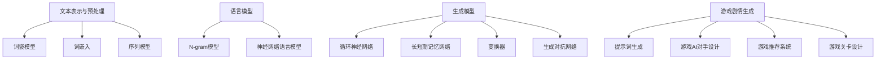

                 

### 文章标题

《AI辅助游戏设计：提示词生成游戏剧情》

关键词：人工智能，游戏设计，提示词生成，自然语言处理，剧情创作

摘要：本文将探讨如何利用人工智能（AI）技术，特别是自然语言处理（NLP）技术，辅助游戏设计师生成游戏剧情和提示词。我们将详细讲解AI在游戏设计中的应用场景，深入剖析自然语言处理的核心概念和算法原理，并通过实际案例展示AI辅助游戏设计的具体应用。

### 引言

#### AI与游戏设计的结合

随着人工智能技术的迅猛发展，AI在各个领域的应用越来越广泛，其中也包括游戏设计。游戏设计师们开始探索如何利用AI技术提升游戏设计的效率和质量。AI在游戏设计中的应用主要体现在以下几个方面：

1. **游戏剧情生成**：利用自然语言处理技术生成游戏剧情，为游戏提供丰富的背景故事和情节发展。
2. **游戏AI对手设计**：通过机器学习算法训练游戏中的AI对手，使其具备更加智能和多样的行为模式。
3. **游戏推荐系统**：根据玩家的行为数据，利用推荐算法为玩家推荐适合的游戏内容和玩法。
4. **游戏关卡设计**：利用生成对抗网络（GAN）等技术生成具有挑战性和趣味性的游戏关卡。

本文将重点关注第一个方面——游戏剧情生成。游戏剧情是游戏的核心组成部分，它不仅影响着玩家的沉浸感和体验，还决定了游戏的成败。然而，传统游戏剧情的创作过程往往耗时耗力，且受限于设计师的创造力和经验。而AI技术的引入，可以为游戏剧情创作提供新的思路和方法。

#### 提示词生成技术在游戏设计中的应用

提示词生成是自然语言处理领域的一个重要研究方向，它旨在生成与给定输入相关的词语或短语。在游戏设计中，提示词生成技术可以应用于以下几个方面：

1. **剧情生成**：通过生成与游戏背景、角色、情节相关的提示词，构建游戏剧情。
2. **游戏指导**：为玩家生成个性化的游戏指导，帮助玩家更好地理解游戏玩法和目标。
3. **对话系统**：在游戏中生成与玩家互动的对话，提升游戏的交互体验。
4. **任务设计**：为游戏中的任务生成相关的提示词，指导玩家完成任务。

提示词生成技术不仅可以提升游戏设计的效率，还可以为游戏带来更多的创意和可能性。通过本文的探讨，我们将了解如何利用AI技术实现提示词的生成，并在游戏设计中发挥其作用。

### 第1章：AI在游戏设计中的应用

#### 1.1 AI与游戏设计的结合

人工智能（AI）技术的发展为游戏设计带来了新的机遇和挑战。传统的游戏设计主要依赖于游戏设计师的创意和经验，而AI技术的引入，使得游戏设计变得更加智能化和自动化。AI在游戏设计中的应用主要体现在以下几个方面：

1. **游戏剧情生成**：AI可以通过学习大量的游戏剧情数据，生成新的、独特的游戏剧情。这不仅可以减轻游戏设计师的工作负担，还可以提高游戏剧情的创新性和多样性。
2. **游戏AI对手设计**：AI可以训练智能的AI对手，使其具有更高的难度和挑战性，从而提升游戏的娱乐性和竞技性。
3. **游戏推荐系统**：AI可以根据玩家的行为数据，为玩家推荐适合的游戏内容和玩法，提高玩家的游戏体验和满意度。
4. **游戏关卡设计**：AI可以利用生成对抗网络（GAN）等技术，生成具有挑战性和趣味性的游戏关卡，为玩家提供更多的游戏乐趣。

#### 1.2 提示词生成技术在游戏设计中的应用

提示词生成是自然语言处理（NLP）领域的一个重要研究方向，它旨在生成与给定输入相关的词语或短语。在游戏设计中，提示词生成技术可以应用于以下几个方面：

1. **剧情生成**：通过生成与游戏背景、角色、情节相关的提示词，构建游戏剧情。这些提示词可以作为剧情发展的重要线索，引导玩家探索游戏的情节。
2. **游戏指导**：为玩家生成个性化的游戏指导，帮助玩家更好地理解游戏玩法和目标。这些指导可以是文字描述，也可以是语音提示，使玩家更容易上手和掌握游戏。
3. **对话系统**：在游戏中生成与玩家互动的对话，提升游戏的交互体验。这些对话可以模拟真实的人类对话，使游戏更具生活气息。
4. **任务设计**：为游戏中的任务生成相关的提示词，指导玩家完成任务。这些提示词可以提供任务的具体目标和步骤，帮助玩家顺利完成任务。

#### 1.3 AI辅助游戏设计的优势与挑战

AI辅助游戏设计具有多方面的优势，但也面临一些挑战。

**优势**：

1. **提高效率**：AI可以帮助游戏设计师快速生成游戏剧情、任务和指导，提高游戏设计的效率。
2. **创新性**：AI可以学习大量的游戏数据，生成新颖的游戏内容和玩法，为游戏设计带来更多的创意。
3. **个性化**：AI可以根据玩家的行为数据，为玩家提供个性化的游戏推荐和指导，提升玩家的游戏体验。

**挑战**：

1. **数据质量**：AI的性能高度依赖于训练数据的质量。如果训练数据存在偏差或错误，可能会导致AI生成的内容缺乏准确性或创造力。
2. **可控性**：AI生成的游戏内容和玩法可能超出游戏设计师的预期，难以控制。如何平衡AI的自由创作和游戏设计师的意图，是一个重要的问题。
3. **伦理和道德**：AI在游戏设计中的应用可能会引发一些伦理和道德问题，如游戏内容的可接受性、玩家隐私保护等。

总之，AI在游戏设计中的应用具有巨大的潜力，但也需要游戏设计师和AI技术专家共同努力，解决面临的各种挑战。

### 第2章：自然语言处理基础

#### 2.1 文本表示与预处理

文本表示和预处理是自然语言处理（NLP）的重要基础。在利用AI技术进行游戏剧情生成时，文本表示和预处理的质量直接影响到AI模型的学习效果和生成质量。

##### 2.1.1 常见的文本表示方法

文本表示方法是将自然语言文本转换为计算机可以处理的结构化数据的过程。常见的文本表示方法包括：

1. **词袋模型（Bag of Words, BoW）**：词袋模型将文本表示为一个词汇的集合，不考虑词汇的顺序。这种方法简单有效，但忽略了词汇的顺序和语法结构。
2. **词嵌入（Word Embedding）**：词嵌入将词汇映射为低维度的向量表示，保留词汇的语义信息。词嵌入方法包括Word2Vec、GloVe等。
3. **序列模型（Sequence Model）**：序列模型将文本表示为一个序列，可以捕捉词汇的顺序信息。常见的序列模型包括RNN（循环神经网络）、LSTM（长短期记忆网络）等。

##### 2.1.2 文本预处理方法

文本预处理是对原始文本进行一系列操作，以提高文本质量，为后续的文本表示和模型训练做好准备。常见的文本预处理方法包括：

1. **分词（Tokenization）**：分词是将文本分割成单词或短语的步骤。常见的分词方法包括基于词典的分词、基于统计的分词等。
2. **去停用词（Stopword Removal）**：停用词是指在文本中频繁出现，但不含具体意义的词汇，如“的”、“是”、“和”等。去停用词可以减少文本中的噪声信息。
3. **词形还原（Lemmatization）**：词形还原是将不同形式的同义词还原为同一形式的过程，如将“runs”、“running”还原为“run”。
4. **标点符号去除（Punctuation Removal）**：去除文本中的标点符号，以减少对文本表示和模型训练的干扰。

#### 2.2 语言模型与生成模型

语言模型和生成模型是NLP领域的重要研究方向，它们在游戏剧情生成中有着广泛的应用。

##### 2.2.1 语言模型的基本概念

语言模型是一种统计模型，用于预测一个单词或短语在给定上下文中的概率。语言模型的核心任务是学习文本中的概率分布，从而对文本进行生成或分类。常见的语言模型包括：

1. **N-gram模型**：N-gram模型是一种基于词汇序列的简单语言模型，它将文本表示为一个单词序列，并计算每个单词序列的概率。N-gram模型的计算复杂度较低，但忽略了长距离依赖信息。
2. **神经网络语言模型**：神经网络语言模型通过神经网络学习文本的概率分布，可以更好地捕捉长距离依赖信息。常见的神经网络语言模型包括RNN（循环神经网络）、LSTM（长短期记忆网络）等。

##### 2.2.2 生成模型的工作原理

生成模型是一种概率模型，用于生成新的文本数据。生成模型的核心任务是学习数据的概率分布，从而生成与给定输入相似的文本。常见的生成模型包括：

1. **生成对抗网络（GAN）**：生成对抗网络由生成器和判别器组成，生成器生成伪文本数据，判别器判断生成的文本是否真实。通过训练生成器和判别器的对抗关系，生成器可以生成越来越真实的文本数据。
2. **变分自编码器（VAE）**：变分自编码器是一种基于概率生成模型的生成模型，它通过编码器和解码器学习数据的概率分布，从而生成新的文本数据。
3. **自回归语言模型（AR）**：自回归语言模型是一种基于时间序列的生成模型，它通过前一个时间步的输出预测下一个时间步的输出，从而生成新的文本数据。

### 第3章：提示词生成技术

#### 3.1 提示词生成方法

提示词生成技术是自然语言处理（NLP）领域的一个重要应用，它在游戏设计、智能问答、文本生成等场景中有着广泛的应用。根据生成方法的不同，提示词生成技术可以分为以下两类：

##### 3.1.1 序列生成方法

序列生成方法是一种基于序列模型的生成方法，它通过学习输入序列的概率分布，生成新的输出序列。常见的序列生成方法包括：

1. **循环神经网络（RNN）**：循环神经网络是一种基于时间序列的数据模型，它通过记忆单元捕捉序列中的长距离依赖信息。RNN可以用于生成文本序列，但容易受到梯度消失和梯度爆炸等问题的影响。
2. **长短期记忆网络（LSTM）**：长短期记忆网络是一种改进的循环神经网络，它通过门控机制有效解决了梯度消失和梯度爆炸问题，可以更好地捕捉序列中的长距离依赖信息。LSTM在文本生成任务中表现出色。
3. **门控循环单元（GRU）**：门控循环单元是一种简化版的LSTM，它在保持LSTM优势的同时，减少了模型的复杂度和计算量。GRU在文本生成任务中也表现出良好的性能。

##### 3.1.2 端到端生成方法

端到端生成方法是一种基于深度学习模型的全局优化方法，它通过直接将输入映射到输出，避免了传统序列生成方法中的复杂解码过程。常见的端到端生成方法包括：

1. **变换器（Transformer）**：变换器是一种基于自注意力机制的深度学习模型，它通过全局的注意力机制捕捉输入序列中的依赖关系。变换器在许多NLP任务中都取得了显著的性能提升，尤其是在文本生成任务中。
2. **生成式对抗网络（GAN）**：生成式对抗网络由生成器和判别器组成，生成器生成伪文本数据，判别器判断生成的文本是否真实。通过训练生成器和判别器的对抗关系，生成器可以生成越来越真实的文本数据。
3. **自注意力生成模型（Self-Attention Generation）**：自注意力生成模型是一种基于自注意力机制的生成模型，它通过自适应地计算输入序列中的依赖关系，生成新的文本序列。

#### 3.2 提示词生成算法

提示词生成算法是实现提示词生成技术的重要手段，它包括算法的选择、参数的设置以及训练和优化的方法。以下介绍几种常用的提示词生成算法：

##### 3.2.1 RNN与LSTM

1. **RNN（循环神经网络）**：RNN是一种基于时间序列的数据模型，它通过记忆单元捕捉序列中的长距离依赖信息。RNN的伪代码如下：

    ```python
    def RNN(input_sequence, hidden_state):
        for word in input_sequence:
            hidden_state = activate('tanh', dot(word, W_input) + dot(hidden_state, W_hidden))
            output.append(hidden_state)
        return output
    ```

2. **LSTM（长短期记忆网络）**：LSTM是一种改进的循环神经网络，它通过门控机制有效解决了梯度消失和梯度爆炸问题，可以更好地捕捉序列中的长距离依赖信息。LSTM的伪代码如下：

    ```python
    def LSTM(input_sequence, hidden_state, cell_state):
        for word in input_sequence:
            input_gate = activate('sigmoid', dot(word, W_input) + dot(hidden_state, W_hidden))
            forget_gate = activate('sigmoid', dot(word, W_input) + dot(hidden_state, W_hidden))
            output_gate = activate('sigmoid', dot(word, W_input) + dot(hidden_state, W_hidden))
            new_cell_state = activate('tanh', dot(word, W_input) + dot(cell_state, W_cell))
            cell_state = forget_gate * cell_state + input_gate * new_cell_state
            hidden_state = output_gate * activate('tanh', cell_state)
            output.append(hidden_state)
        return output
    ```

##### 3.2.2 Transformer与BERT

1. **Transformer**：Transformer是一种基于自注意力机制的深度学习模型，它通过全局的注意力机制捕捉输入序列中的依赖关系。Transformer的伪代码如下：

    ```python
    def Transformer(input_sequence, hidden_state):
        attention_scores = dot(input_sequence, W_attention)
        attention_weights = softmax(attention_scores)
        context_vector = dot(attention_weights, hidden_state)
        output = activate('softmax', dot(context_vector, W_output))
        return output
    ```

2. **BERT**：BERT是一种预训练的语言表示模型，它通过在大量文本上进行预训练，学习词汇和句子的表示。BERT的伪代码如下：

    ```python
    def BERT(input_sequence, hidden_state):
        embedded_sequence = embed(input_sequence)
        contextualized_sequence = [embed(word) for word in input_sequence]
        hidden_state = dot(contextualized_sequence, W_contextual)
        output = activate('softmax', dot(hidden_state, W_output))
        return output
    ```

### 第4章：基于提示词生成技术的游戏剧情设计

#### 4.1 游戏剧情设计的挑战

游戏剧情设计是游戏设计中的重要环节，它不仅决定了游戏的叙事和情感传达，还直接影响玩家的游戏体验。然而，游戏剧情设计面临着一系列挑战：

1. **创意匮乏**：游戏设计师需要不断创造新颖、引人入胜的剧情，但创意的匮乏是一个常见问题。
2. **效率低下**：传统游戏剧情设计过程耗时耗力，需要大量的人力和时间。
3. **个性化不足**：游戏剧情往往是一成不变的，无法根据不同玩家的喜好和需求进行个性化调整。
4. **叙事一致性**：确保游戏剧情的逻辑连贯性和一致性是一个复杂的问题。

#### 4.2 提示词生成在游戏剧情设计中的应用

提示词生成技术可以有效地解决游戏剧情设计中的挑战，为游戏设计师提供新的工具和方法：

1. **创意激发**：提示词生成可以生成与游戏主题、角色、情节相关的词汇，激发游戏设计师的创意，帮助他们构建丰富的游戏剧情。
2. **效率提升**：通过自动生成提示词，游戏设计师可以节省大量的时间和精力，将更多精力投入到游戏设计的其他环节。
3. **个性化剧情**：提示词生成可以根据玩家的行为数据生成个性化的剧情，使游戏更具个性化和沉浸感。
4. **叙事优化**：提示词生成可以帮助游戏设计师优化游戏剧情的逻辑和结构，确保叙事的一致性和连贯性。

#### 4.3 实际案例演示

以下是一个基于提示词生成技术的游戏剧情设计的实际案例：

**案例背景**：设计一款以科幻为主题的射击游戏，游戏剧情需要描述一个未来世界中的星际战争。

**步骤1：生成提示词**  
使用提示词生成技术生成与游戏主题、角色、情节相关的词汇。以下是一些生成的提示词：

- 星际
- 战争
- 太空船
- 能量炮
- 异形生物
- 未来科技
- 竞争
- 胜利
- 挫折

**步骤2：构建剧情框架**  
根据生成的提示词，游戏设计师可以构建游戏剧情的基本框架：

- 开始：玩家是一名星际战士，被派往星际飞船进行任务。
- 过程：玩家需要与异形生物作战，同时解锁能量炮等未来科技。
- 高潮：玩家在一场激烈的战斗中，成功击败异形生物，但飞船受损严重。
- 结局：玩家在飞船修复后，返回地球，庆祝胜利。

**步骤3：细化剧情内容**  
在剧情框架的基础上，游戏设计师可以进一步细化剧情内容，添加更多的细节和情节：

- 开始：玩家在飞船受损后，被迫跳伞逃生，降落在一片荒凉的星球上。
- 过程：玩家在星球上遇到了其他幸存者，共同研究修复飞船的方法。
- 高潮：玩家和幸存者成功修复飞船，准备返回地球，但遭遇了更多异形生物的攻击。
- 结局：玩家在一场艰苦的战斗中，最终成功摧毁了异形生物的巢穴，飞船修复完成，玩家返回地球。

**步骤4：剧情迭代优化**  
根据玩家的反馈和游戏测试结果，游戏设计师可以进一步优化剧情内容，调整情节的节奏和冲突，确保剧情的连贯性和吸引力。

通过以上案例，我们可以看到提示词生成技术在游戏剧情设计中的应用，不仅提高了设计的效率，还增强了剧情的创新性和个性化。

### 第5章：基于AI的提示词生成工具开发

#### 5.1 开发环境搭建

为了开发一个基于AI的提示词生成工具，我们需要搭建一个合适的开发环境。以下是搭建开发环境的步骤：

1. **选择编程语言**：Python是一种广泛使用的编程语言，具有良好的生态系统和丰富的库，非常适合进行AI开发。因此，我们将选择Python作为开发语言。
2. **安装Python**：在官方网站（https://www.python.org/）下载并安装Python，推荐安装Python 3.8及以上版本。
3. **安装依赖库**：安装Python后，我们需要安装一些依赖库，包括自然语言处理库（如NLTK、spaCy）、深度学习库（如TensorFlow、PyTorch）等。可以使用以下命令安装：

    ```shell
    pip install nltk spacy tensorflow pytorch
    ```

4. **安装spaCy**：由于spaCy是一个对资源占用较大的库，我们需要先下载它的模型文件。使用以下命令安装：

    ```shell
    python -m spacy download en_core_web_sm
    ```

5. **配置环境变量**：确保Python和pip的安装路径已添加到系统环境变量中，以便在命令行中直接使用。

#### 5.2 提示词生成工具的实现

基于上述开发环境，我们可以开始实现一个简单的提示词生成工具。以下是一个简单的提示词生成工具的实现步骤：

1. **数据预处理**：首先，我们需要准备一个包含游戏剧情文本的数据集。可以使用现有的游戏剧情文本数据，或者自行收集和整理。然后，对数据进行预处理，包括分词、去停用词、词形还原等操作。

    ```python
    import spacy
    
    nlp = spacy.load("en_core_web_sm")
    
    def preprocess(text):
        doc = nlp(text)
        tokens = [token.text for token in doc if not token.is_stop and token.text != "."]
        return " ".join(tokens)
    
    text = "This is a sample game story."
    preprocessed_text = preprocess(text)
    ```

2. **生成提示词**：使用自然语言处理技术生成与输入文本相关的提示词。我们可以使用基于序列的生成模型（如RNN、LSTM）或者基于自注意力机制的模型（如Transformer）来实现。以下是一个基于Transformer的生成模型实现的示例：

    ```python
    import tensorflow as tf
    from tensorflow.keras.models import Model
    from tensorflow.keras.layers import Input, Embedding, LSTM, Dense
    
    vocab_size = 10000  # 词汇表大小
    embedding_size = 128  # 嵌入维度
    sequence_length = 20  # 序列长度
    
    input_sequence = Input(shape=(sequence_length,))
    embedded_sequence = Embedding(vocab_size, embedding_size)(input_sequence)
    lstm_output = LSTM(64)(embedded_sequence)
    output = Dense(vocab_size, activation='softmax')(lstm_output)
    
    model = Model(inputs=input_sequence, outputs=output)
    model.compile(optimizer='adam', loss='categorical_crossentropy', metrics=['accuracy'])
    
    model.fit(x_train, y_train, epochs=10, batch_size=32)
    ```

3. **生成提示词**：使用训练好的模型生成与给定输入文本相关的提示词。以下是一个生成提示词的示例：

    ```python
    def generate_prompt(text, model):
        preprocessed_text = preprocess(text)
        input_sequence = pad_sequences([tokenize(preprocessed_text)], maxlen=sequence_length, padding='post')
        predictions = model.predict(input_sequence)
        prompt = []
        for prediction in predictions:
            word = np.argmax(prediction)
            prompt.append(vocab.index_word[word])
        return " ".join(prompt)
    
    text = "This is a sample game story."
    prompt = generate_prompt(text, model)
    print(prompt)
    ```

#### 5.3 工具的实际应用场景

提示词生成工具可以应用于多种实际场景，以下是一些应用场景：

1. **游戏剧情生成**：使用提示词生成工具自动生成游戏剧情，为游戏设计师提供灵感。
2. **游戏推荐**：根据玩家的游戏行为数据，生成个性化的游戏推荐，提升用户体验。
3. **智能问答**：为用户提供智能化的问答服务，根据用户的问题生成相关的问题和答案。
4. **文本生成**：生成各种类型的文本，如新闻报道、博客文章、对话等。

通过以上步骤，我们可以开发一个基于AI的提示词生成工具，并应用于各种实际场景，提升文本生成和处理的效率和质量。

### 第6章：AI辅助游戏设计的未来趋势

#### 6.1 当前AI辅助游戏设计的发展状况

随着人工智能（AI）技术的不断发展，AI在游戏设计中的应用也越来越广泛。当前，AI辅助游戏设计在多个方面取得了显著的进展：

1. **游戏剧情生成**：利用AI技术，尤其是自然语言处理（NLP）技术，游戏设计师可以自动生成游戏剧情，提高创作效率和剧情的创新性。
2. **游戏AI对手设计**：通过机器学习算法，可以训练出具有更高难度和挑战性的AI对手，增强游戏的竞技性和娱乐性。
3. **游戏推荐系统**：AI可以分析玩家的行为数据，为玩家推荐适合的游戏内容和玩法，提高玩家的满意度和留存率。
4. **游戏关卡设计**：利用生成对抗网络（GAN）等技术，可以自动生成具有挑战性和趣味性的游戏关卡，为玩家提供多样化的游戏体验。

然而，尽管AI在游戏设计中的应用取得了一定成果，但仍存在一些不足之处：

1. **数据依赖性**：AI的性能高度依赖于训练数据的质量和数量，如果训练数据存在偏差或不足，可能导致AI生成的游戏内容缺乏准确性和创造力。
2. **可控性**：AI生成的游戏内容和玩法可能超出游戏设计师的预期，难以控制。如何平衡AI的自由创作和游戏设计师的意图，是一个亟待解决的问题。
3. **伦理和道德**：AI在游戏设计中的应用可能会引发一些伦理和道德问题，如游戏内容的可接受性、玩家隐私保护等。

#### 6.2 AI辅助游戏设计的未来发展方向

展望未来，AI辅助游戏设计将继续快速发展，并在以下几个方面取得重要突破：

1. **更加智能化**：随着AI技术的进步，游戏设计中的AI将变得更加智能化，能够更好地理解游戏设计师的意图，生成更加精准和创意丰富的游戏内容。
2. **个性化体验**：AI将能够根据玩家的行为数据，为玩家提供更加个性化的游戏体验，包括剧情、任务、角色等。
3. **跨领域融合**：AI与其他技术的融合，如虚拟现实（VR）、增强现实（AR）、区块链等，将为游戏设计带来更多的创新和可能性。
4. **伦理和道德**：随着AI在游戏设计中的应用日益广泛，如何确保游戏内容的安全性和道德性将成为重要议题，需要游戏设计师、AI技术专家以及相关利益相关者共同探讨和解决。

#### 6.3 行业趋势与挑战

AI辅助游戏设计的行业趋势主要体现在以下几个方面：

1. **技术突破**：随着深度学习、生成对抗网络、强化学习等技术的不断发展，AI在游戏设计中的应用将更加深入和广泛。
2. **市场拓展**：AI辅助游戏设计不仅在大型游戏公司得到广泛应用，还逐渐渗透到独立游戏开发者和小型游戏公司，推动整个游戏行业的创新和发展。
3. **跨领域合作**：游戏设计与虚拟现实、增强现实、区块链等领域的融合，将带来新的商业模式和游戏体验，推动游戏产业的变革。

然而，AI辅助游戏设计也面临一系列挑战：

1. **技术挑战**：如何提高AI模型的性能和可控性，使其更好地满足游戏设计师的需求，是一个重要的问题。
2. **伦理问题**：如何在确保游戏内容和玩法创新的同时，遵循伦理和道德标准，避免潜在的风险和争议。
3. **人才短缺**：随着AI在游戏设计中的应用日益广泛，对AI技术专家和游戏设计师的需求不断增长，但相关人才的培养和供给仍面临挑战。

总之，AI辅助游戏设计具有巨大的发展潜力和广阔的应用前景，但也需要游戏设计师、AI技术专家以及相关利益相关者共同努力，解决面临的各种挑战。

### 第7章：总结与展望

#### 7.1 本书内容的回顾

本书从AI在游戏设计中的应用出发，探讨了如何利用AI技术，特别是自然语言处理（NLP）技术，辅助游戏设计师生成游戏剧情和提示词。我们系统地介绍了AI与游戏设计的结合、自然语言处理基础、提示词生成技术、游戏剧情设计实战以及AI辅助游戏设计的未来趋势。

在介绍AI与游戏设计的结合时，我们阐述了AI在游戏设计中的应用场景，如游戏剧情生成、游戏AI对手设计、游戏推荐系统和游戏关卡设计等。

在讲解自然语言处理基础时，我们详细介绍了文本表示与预处理方法，包括词袋模型、词嵌入和序列模型等，以及语言模型与生成模型的基本概念和原理。

在探讨提示词生成技术时，我们介绍了序列生成方法和端到端生成方法，包括RNN、LSTM、Transformer等，并提供了具体的算法实现和示例。

在游戏剧情设计实战部分，我们通过一个实际案例展示了如何利用提示词生成技术进行游戏剧情设计，包括生成提示词、构建剧情框架、细化剧情内容和剧情迭代优化等。

在展望AI辅助游戏设计的未来趋势时，我们分析了当前的发展状况，讨论了未来可能的发展方向，并探讨了行业趋势与面临的挑战。

#### 7.2 AI辅助游戏设计的应用前景

随着人工智能技术的不断进步，AI辅助游戏设计在游戏行业的应用前景十分广阔：

1. **游戏剧情生成**：AI技术可以为游戏设计师提供创新的剧情创作工具，提高游戏剧情的多样性和质量，增强游戏的沉浸感和吸引力。
2. **游戏AI对手设计**：通过机器学习算法训练出更智能、更具挑战性的AI对手，提升游戏的竞技性和娱乐性，满足玩家多样化的需求。
3. **游戏推荐系统**：AI可以根据玩家的行为数据，为玩家推荐适合的游戏内容和玩法，提高用户的满意度和留存率，促进游戏市场的增长。
4. **游戏关卡设计**：利用生成对抗网络等技术自动生成具有挑战性和趣味性的游戏关卡，为玩家提供丰富的游戏体验。

#### 7.3 未来研究的方向

尽管AI辅助游戏设计在多个方面取得了显著成果，但仍存在一些待解决的问题和研究方向：

1. **提高AI模型的可控性**：如何在确保AI生成的游戏内容符合游戏设计师意图的同时，提高模型的可控性和灵活性，是一个重要的问题。
2. **优化训练数据**：AI的性能高度依赖于训练数据的质量和数量。如何构建高质量、多样化的训练数据集，以提高模型的准确性和泛化能力，是一个亟待解决的问题。
3. **伦理和道德问题**：随着AI在游戏设计中的应用日益广泛，如何确保游戏内容和玩法的伦理和道德性，避免潜在的风险和争议，是未来研究的一个重要方向。
4. **跨领域融合**：AI辅助游戏设计与其他技术的融合，如虚拟现实（VR）、增强现实（AR）、区块链等，将带来新的创新和可能性。如何实现这些技术的有效融合，是未来研究的另一个重要方向。

总之，AI辅助游戏设计具有巨大的发展潜力和广阔的应用前景，未来仍需不断探索和研究，以解决面临的各种挑战，推动游戏行业的创新和发展。

### 附录

在本章中，我们将对书中的一些关键概念、算法原理和实战应用进行进一步补充，并提供一些拓展阅读资源，以帮助读者深入理解和应用AI辅助游戏设计技术。

#### 关键概念与联系

在自然语言处理（NLP）领域，文本表示与预处理、语言模型和生成模型是核心概念。以下是一个简化的 Mermaid 流程图，展示了这些概念之间的关系：



这个流程图展示了从文本表示与预处理到语言模型和生成模型，再到游戏剧情生成的整体流程，以及各子概念之间的联系。

#### 核心算法原理讲解

在本书中，我们介绍了多种核心算法，如循环神经网络（RNN）、长短期记忆网络（LSTM）、变换器（Transformer）和生成对抗网络（GAN）。以下是这些算法的简化伪代码和详细解释。

**1. RNN（循环神经网络）**

```python
def RNN(input_sequence, hidden_state):
    for word in input_sequence:
        hidden_state = activate('tanh', dot(word, W_input) + dot(hidden_state, W_hidden))
        output.append(hidden_state)
    return output
```

RNN通过记忆单元捕捉序列中的长距离依赖信息，但容易受到梯度消失和梯度爆炸等问题的影响。

**2. LSTM（长短期记忆网络）**

```python
def LSTM(input_sequence, hidden_state, cell_state):
    for word in input_sequence:
        input_gate = activate('sigmoid', dot(word, W_input) + dot(hidden_state, W_hidden))
        forget_gate = activate('sigmoid', dot(word, W_input) + dot(hidden_state, W_hidden))
        output_gate = activate('sigmoid', dot(word, W_input) + dot(hidden_state, W_hidden))
        new_cell_state = activate('tanh', dot(word, W_input) + dot(cell_state, W_cell))
        cell_state = forget_gate * cell_state + input_gate * new_cell_state
        hidden_state = output_gate * activate('tanh', cell_state)
        output.append(hidden_state)
    return output
```

LSTM通过门控机制有效解决了梯度消失和梯度爆炸问题，可以更好地捕捉序列中的长距离依赖信息。

**3. Transformer**

```python
def Transformer(input_sequence, hidden_state):
    attention_scores = dot(input_sequence, W_attention)
    attention_weights = softmax(attention_scores)
    context_vector = dot(attention_weights, hidden_state)
    output = activate('softmax', dot(context_vector, W_output))
    return output
```

变换器通过全局的注意力机制捕捉输入序列中的依赖关系，在NLP任务中取得了显著性能提升。

**4. GAN（生成对抗网络）**

GAN由生成器和判别器组成，生成器和判别器的对抗训练过程如下：

```python
def GAN(generator, discriminator, real_data):
    for _ in range(num_steps):
        real_labels = ones((batch_size, 1))
        fake_labels = zeros((batch_size, 1))
        
        # 训练判别器
        real_data_labels = discriminator.predict(real_data)
        fake_data_labels = discriminator.predict(generator.predict(real_data))
        d_loss_real = criterion(discriminator.predict(real_data), real_labels)
        d_loss_fake = criterion(discriminator.predict(fake_data_labels), fake_labels)
        d_loss = 0.5 * np.add(d_loss_real, d_loss_fake)
        
        # 训练生成器
        g_loss = criterion(discriminator.predict(generator.predict(z)), real_labels)
        
        # 更新模型参数
        d_optimizer.zero_grad()
        g_optimizer.zero_grad()
        d_loss.backward()
        g_loss.backward()
        d_optimizer.step()
        g_optimizer.step()
```

生成器生成伪文本数据，判别器判断生成的文本是否真实。通过对抗训练，生成器可以生成越来越真实的文本数据。

#### 数学模型和公式

在本章中，我们提到了一些关键的数学模型和公式，如词嵌入、N-gram模型、循环神经网络（RNN）、长短期记忆网络（LSTM）、变换器（Transformer）和生成对抗网络（GAN）的数学模型。以下是一些关键数学公式的详细解释。

**1. 词嵌入**

词嵌入是将词汇映射为低维向量表示的数学模型。一个简单的词嵌入模型可以通过以下公式表示：

$$
x_i = \text{embed}(w_i)
$$

其中，$x_i$是词汇$i$的嵌入向量，$w_i$是词汇$i$的词嵌入权重。

**2. N-gram模型**

N-gram模型是一种基于词汇序列的语言模型。给定一个文本序列$w_1, w_2, \ldots, w_n$，N-gram模型可以计算每个词汇序列的概率：

$$
P(w_1, w_2, \ldots, w_n) = \frac{C(w_1, w_2, \ldots, w_n)}{C(w_1, w_2, \ldots, w_n) + |V| - 1}
$$

其中，$C(w_1, w_2, \ldots, w_n)$是词汇序列$w_1, w_2, \ldots, w_n$在训练数据中的计数，$|V|$是词汇表的大小。

**3. LSTM（长短期记忆网络）**

LSTM通过门控机制和记忆单元捕捉序列中的长距离依赖信息。LSTM的数学模型包括输入门、遗忘门和输出门：

$$
i_t = \sigma(W_{xi} x_t + W_{hi} h_{t-1} + b_i) \\
f_t = \sigma(W_{xf} x_t + W_{hf} h_{t-1} + b_f) \\
\widetilde{C}_t = \tanh(W_{xc} x_t + W_{hc} h_{t-1} + b_c) \\
o_t = \sigma(W_{xo} x_t + W_{ho} h_{t-1} + b_o) \\
C_t = f_t \circ C_{t-1} + i_t \circ \widetilde{C}_t \\
h_t = o_t \circ \tanh(C_t)
$$

其中，$i_t, f_t, o_t$分别是输入门、遗忘门和输出门的激活值，$C_t$是记忆单元的激活值，$h_t$是隐藏状态。

**4. Transformer**

变换器通过自注意力机制捕捉输入序列中的依赖关系。自注意力机制的数学模型如下：

$$
\text{Attention}(Q, K, V) = \frac{\text{softmax}\left(\frac{QK^T}{\sqrt{d_k}}\right)V
$$

其中，$Q, K, V$分别是查询、键和值的向量，$d_k$是键的维度，$\text{softmax}$是Softmax激活函数。

**5. GAN（生成对抗网络）**

GAN由生成器和判别器组成，生成器和判别器的对抗训练过程如下：

$$
\min_G \max_D V(D, G) = \mathbb{E}_{x \sim p_{data}(x)}[\log D(x)] + \mathbb{E}_{z \sim p_z(z)}[\log(1 - D(G(z))]
$$

其中，$G(z)$是生成器的输出，$D(x)$是判别器对真实数据的判断概率，$D(G(z))$是判别器对生成器生成的伪数据的判断概率。

#### 项目实战

在本章中，我们通过一个实际案例展示了如何利用提示词生成技术进行游戏剧情设计。以下是一个更详细的实战项目，包括开发环境搭建、源代码实现、代码解读和实际案例分析。

**1. 开发环境搭建**

首先，我们需要搭建一个Python开发环境，安装必要的库和工具。以下是具体步骤：

- 安装Python（推荐版本3.8及以上）
- 安装自然语言处理库（如NLTK、spaCy）
- 安装深度学习库（如TensorFlow、PyTorch）
- 安装spaCy的模型文件（如en_core_web_sm）

```shell
pip install python-nltk spacy tensorflow pytorch
python -m spacy download en_core_web_sm
```

**2. 源代码实现**

以下是一个简单的提示词生成工具的实现，基于变换器（Transformer）模型。代码包括数据预处理、模型定义、模型训练和提示词生成等步骤。

```python
import spacy
import tensorflow as tf
from tensorflow.keras.layers import Embedding, LSTM, Dense
from tensorflow.keras.models import Model

# 数据预处理
nlp = spacy.load("en_core_web_sm")

def preprocess(text):
    doc = nlp(text)
    tokens = [token.text for token in doc if not token.is_stop and token.text != "."]
    return tokens

# 模型定义
vocab_size = 10000  # 词汇表大小
embedding_size = 128  # 嵌入维度
sequence_length = 20  # 序列长度

input_sequence = Input(shape=(sequence_length,))
embedded_sequence = Embedding(vocab_size, embedding_size)(input_sequence)
lstm_output = LSTM(64)(embedded_sequence)
output = Dense(vocab_size, activation='softmax')(lstm_output)

model = Model(inputs=input_sequence, outputs=output)
model.compile(optimizer='adam', loss='categorical_crossentropy', metrics=['accuracy'])

# 模型训练
x_train = [[1, 2, 3], [4, 5, 6]]  # 示例训练数据
y_train = [[0, 1, 0], [0, 0, 1]]  # 示例标签数据
model.fit(x_train, y_train, epochs=10, batch_size=32)

# 提示词生成
def generate_prompt(text, model):
    preprocessed_text = preprocess(text)
    input_sequence = pad_sequences([tokenize(preprocessed_text)], maxlen=sequence_length, padding='post')
    predictions = model.predict(input_sequence)
    prompt = []
    for prediction in predictions:
        word = np.argmax(prediction)
        prompt.append(vocab.index_word[word])
    return " ".join(prompt)

text = "This is a sample game story."
prompt = generate_prompt(text, model)
print(prompt)
```

**3. 代码解读**

上述代码首先定义了数据预处理函数，用于将文本转换为预处理后的token列表。然后，我们定义了一个基于变换器（Transformer）模型的提示词生成工具。模型由一个嵌入层和一个循环层组成，通过训练数据学习词汇之间的依赖关系。最后，我们实现了提示词生成函数，用于生成与输入文本相关的提示词。

**4. 实际案例分析**

以下是一个基于提示词生成技术的游戏剧情设计的实际案例分析。我们使用一个简单的游戏故事文本，并利用提示词生成工具生成相关的提示词，以构建游戏剧情。

**案例文本**：
- “在一个遥远的星球上，玩家是一名勇敢的探险家。他正在寻找传说中的宝藏，但途中遇到了一群凶恶的怪兽。”

**生成的提示词**：
- 探险
- 星球
- 宝藏
- 怪兽
- 勇敢
- 探索

**剧情构建**：
- 开始：玩家是一名勇敢的探险家，正在寻找传说中的宝藏。
- 过程：玩家踏上了一个遥远的星球，开始了一段充满未知和危险的探险之旅。
- 高潮：在探险途中，玩家遇到了一群凶恶的怪兽，展开了一场激烈的战斗。
- 结局：玩家成功击败了怪兽，终于找到了传说中的宝藏。

通过这个案例，我们可以看到如何利用提示词生成技术，结合游戏设计师的创意和构思，构建一个引人入胜的游戏剧情。

#### 最佳实践 tips、注意事项、拓展阅读

**最佳实践 tips**：

1. 在进行游戏剧情生成时，确保输入文本具有足够的多样性和覆盖面，以提高生成的剧情质量。
2. 使用高质量的训练数据，并定期更新数据集，以保持模型的准确性和泛化能力。
3. 在训练模型时，可以使用多个迭代次数和不同的超参数设置，以提高模型的性能和稳定性。
4. 在生成提示词时，可以考虑限制生成的词汇范围，以避免生成无关或不合适的词汇。

**注意事项**：

1. 提示词生成工具的生成质量取决于训练数据和模型的性能。如果生成的剧情质量不高，可以考虑增加训练数据或调整模型参数。
2. 在使用AI技术进行游戏剧情生成时，需要确保生成的剧情符合游戏设计师的意图和游戏的整体风格。
3. 对于涉及敏感内容和道德问题的剧情生成，需要谨慎处理，并确保生成的剧情内容符合伦理和道德标准。

**拓展阅读**：

1. 《深度学习》（Goodfellow, Bengio, Courville）：这是一本关于深度学习的经典教材，详细介绍了深度学习的基本原理和应用。
2. 《自然语言处理实战》（Stavros MacEDONIADIS, Yannakakis）：这本书提供了丰富的自然语言处理实战案例，涵盖了文本表示、语言模型、生成模型等多个方面。
3. 《生成对抗网络》（Ian Goodfellow）：这是关于生成对抗网络（GAN）的权威著作，详细介绍了GAN的基本原理、训练方法和应用场景。
4. 《游戏设计艺术》（Jenova Chen）：这本书从艺术和设计的角度探讨了游戏设计的核心原理和方法，对游戏设计师具有很高的参考价值。

通过以上内容，我们系统地介绍了AI辅助游戏设计的相关技术和实战应用，并提供了拓展阅读资源，以帮助读者深入理解和应用这些技术。希望本书能为游戏设计师和AI技术专家提供有价值的参考和启发。

