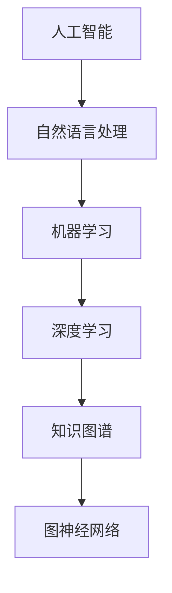

                 

### 文章标题

《AI辅助的提示词文档自动生成》

> 关键词：人工智能，自然语言处理，文档生成，机器学习，深度学习，知识图谱，图神经网络

> 摘要：本文全面探讨了AI辅助的提示词文档自动生成技术，包括其基本概念、核心算法原理、实践应用、优化挑战与未来趋势。通过深入剖析与实例讲解，展示了这一技术在企业、教育和客服等领域的广泛应用，并对其未来发展进行了展望。

## 引言

随着人工智能（AI）技术的迅猛发展，自动化生成文档的需求日益增长。无论是企业内部的知识库构建，还是在线教育平台的课程内容生成，亦或是智能客服系统的自动化文档生成，AI辅助的提示词文档自动生成技术正在成为新一代信息处理的重要工具。

本文将围绕以下四个核心问题展开：

1. **基本概念**：介绍AI辅助的提示词文档自动生成的定义、原理及应用场景。
2. **核心算法原理**：详细讲解自然语言处理、机器学习与深度学习、知识图谱等技术在文档生成中的应用。
3. **实践应用**：通过实际案例展示AI辅助的提示词文档自动生成技术的开发过程、代码实现与应用效果。
4. **优化挑战与未来趋势**：分析当前技术面临的挑战，探讨未来发展的方向和前景。

### 基本概念

#### AI辅助的提示词文档自动生成的定义

AI辅助的提示词文档自动生成，是指利用人工智能技术，通过分析输入的提示词，自动生成符合特定格式和内容的文档。这个过程涉及自然语言处理、文本生成、机器学习、深度学习等多个领域。

#### 原理

- **自然语言处理（NLP）**：NLP是使计算机能够理解、解析和生成人类语言的技术。在文档生成中，NLP技术主要用于处理输入的提示词，提取关键信息，构建语义理解。
- **机器学习与深度学习**：这些技术通过学习大量文本数据，自动提取特征，建立模型，从而实现文档的自动生成。常见的模型包括循环神经网络（RNN）、长短期记忆网络（LSTM）、变换器（Transformer）等。
- **知识图谱**：知识图谱是一种结构化的语义知识库，用于表示实体、属性和关系。在文档生成中，知识图谱可以提供丰富的背景信息，帮助模型更好地理解和生成文本。

#### 应用场景

- **企业知识库构建**：自动生成文档，帮助企业快速构建和更新内部知识库。
- **在线教育平台**：自动生成课程内容，提高教育资源的丰富度和个性化程度。
- **智能客服系统**：自动生成文档，用于处理用户咨询，提高客服效率和用户体验。

#### 挑战与机遇

- **数据稀缺性**：高质量的训练数据是模型成功的关键，但在某些领域，高质量数据难以获取。
- **模型可解释性**：用户希望了解模型的决策过程，但目前深度学习模型的可解释性仍是一个挑战。
- **道德伦理与隐私保护**：自动生成文档涉及用户隐私，如何在保护用户隐私的同时，提供高质量的文档生成服务，是一个重要问题。

### 核心算法原理

#### 自然语言处理算法基础

- **词向量的表示方法**：词向量是将单词映射到高维向量空间的方法，常见的模型有Word2Vec、GloVe等。
- **语言的上下文信息处理**：NLP技术需要理解单词在句子中的上下文信息，常见的模型有RNN、LSTM等。
- **文本分类与聚类算法**：用于对生成的文档进行分类或聚类，常见的算法有朴素贝叶斯、K-means等。

#### 机器学习与深度学习算法原理

- **线性回归与逻辑回归**：用于预测文档的标签或属性。
- **支持向量机**：用于分类问题，通过寻找最佳超平面来实现分类。
- **卷积神经网络与循环神经网络**：用于处理序列数据，提取时间序列特征。
- **变换器（Transformer）**：是一种基于注意力机制的深度学习模型，广泛应用于文本生成任务。

#### 知识图谱与图神经网络

- **知识图谱的构建**：用于表示实体、属性和关系，常见的模型有RDF（资源描述框架）、OWL（Web本体语言）等。
- **图神经网络**：用于处理图结构数据，提取图特征，常见的模型有GCN（图卷积网络）、GAT（图注意力网络）等。

### AI辅助提示词文档生成技术综述

AI辅助的提示词文档生成技术主要涉及以下几种方法：

- **基于自然语言处理的技术**：利用NLP技术，对输入的提示词进行分析和理解，生成符合语义的文档。
- **基于机器学习与深度学习的技术**：通过学习大量文本数据，建立模型，实现文档的自动生成。
- **基于知识图谱的技术**：利用知识图谱提供丰富的背景信息，帮助模型更好地理解和生成文本。

这些技术各有优缺点，在实际应用中，可以根据需求选择合适的方案。例如，在处理企业知识库构建时，可能需要结合机器学习和知识图谱技术，以实现高质量的文档生成。

### 背景介绍

人工智能（AI）作为计算机科学的一个重要分支，其目标是使计算机具备类似于人类智能的能力，能够进行学习、推理、决策和解决问题。自1956年达特茅斯会议上提出人工智能的概念以来，人工智能经历了多个发展阶段，从早期的符号推理、知识表示，到近几年的深度学习和大数据技术，人工智能在计算机视觉、自然语言处理、语音识别等领域取得了显著的成果。

自然语言处理（NLP）是人工智能的一个重要分支，旨在使计算机能够理解和生成自然语言。NLP技术主要包括文本分类、情感分析、机器翻译、语音识别等。其中，文本生成是NLP的一个重要应用方向，旨在根据输入的文本或提示词，自动生成新的文本内容。

文档生成技术是自然语言处理的一个重要应用领域，通过分析输入的提示词或文本，自动生成符合特定格式和内容的文档。这一技术在企业知识库构建、在线教育平台、智能客服系统等领域具有重要的应用价值。

随着人工智能技术的不断发展，文档生成技术也在不断演进。传统的文本生成方法主要依赖于规则和模板，生成的内容较为固定。而基于人工智能的文档生成技术，通过深度学习和自然语言处理技术，可以生成更加灵活、多样化的文档内容。

### 核心概念与联系

在深入探讨AI辅助的提示词文档自动生成技术之前，我们需要明确几个核心概念，并分析它们之间的关系架构。

#### 核心概念

1. **人工智能（AI）**：人工智能是指计算机系统模拟人类智能行为的能力，包括学习、推理、决策等。AI是文档生成技术的核心驱动力。
2. **自然语言处理（NLP）**：自然语言处理是AI的一个分支，专注于使计算机能够理解和生成自然语言。NLP在文档生成中起到关键作用，用于解析和生成文本。
3. **机器学习（ML）**：机器学习是一种让计算机通过数据学习规律并做出预测或决策的技术。ML是文档生成技术的核心算法之一。
4. **深度学习（DL）**：深度学习是机器学习的一个子领域，基于神经网络，通过多层非线性变换学习数据特征。DL在文档生成中广泛应用于文本生成模型。
5. **知识图谱（KG）**：知识图谱是一种结构化的语义知识库，用于表示实体、属性和关系。KG可以提供丰富的背景信息，帮助文档生成模型更好地理解和生成文本。
6. **图神经网络（GN）**：图神经网络是一种基于图结构的深度学习模型，用于处理图数据，提取图特征。

#### 核心概念之间的关系架构

为了更好地理解这些概念之间的联系，我们可以使用Mermaid流程图来表示它们之间的关系：



在这个关系架构中，人工智能是整个文档生成技术的驱动力，它通过自然语言处理实现文本的解析和生成。自然语言处理依赖于机器学习和深度学习算法，后者通过多层神经网络学习文本特征。知识图谱和图神经网络则提供了额外的背景信息和学习框架，帮助模型更好地理解和生成文本。

这种关系架构揭示了文档生成技术的基本原理和组成部分，为后续的详细讲解提供了基础。

### 自然语言处理算法基础

在AI辅助的提示词文档自动生成技术中，自然语言处理（NLP）算法起到了关键作用。为了深入理解NLP在文档生成中的应用，我们需要首先掌握几个基础算法的概念和原理。

#### 词向量的表示方法

词向量是将单词映射到高维向量空间的方法，使得计算机能够处理和计算单词之间的关系。常见的词向量表示方法包括：

- **Word2Vec**：Word2Vec是一种基于上下文的词向量模型，通过训练神经网络来学习词的向量表示。其基本思想是，在给定一个词的上下文窗口内，模型预测该窗口中的词。Word2Vec有两种主要训练方法：连续词袋（CBOW）和Skip-gram。
  - **CBOW（连续词袋）**：给定一个目标词，模型预测其上下文词的集合。该方法的优点是计算简单，但可能无法捕捉到词之间的直接关系。
  - **Skip-gram**：与CBOW相反，给定一个词的上下文词，模型预测目标词。这种方法更强调词与词之间的直接关系，但计算成本更高。

- **GloVe**：GloVe（Global Vectors for Word Representation）是一种基于共现关系的词向量模型。GloVe通过计算词的共现矩阵来学习词的向量表示，可以捕捉词的语义和语法关系。

#### 语言的上下文信息处理

语言是一个高度上下文依赖的系统，理解语言的上下文信息是NLP的关键。以下几种算法在处理上下文信息方面具有重要意义：

- **循环神经网络（RNN）**：循环神经网络是一种能够处理序列数据的神经网络。RNN通过存储先前的隐藏状态，能够捕获序列中的长期依赖关系。常见的RNN变种包括LSTM（长短期记忆网络）和GRU（门控循环单元），它们通过引入门控机制来改善RNN的长期依赖建模能力。

- **变换器（Transformer）**：变换器是一种基于注意力机制的深度学习模型，特别适用于处理序列数据。Transformer通过多头自注意力机制，能够有效地捕捉全局的上下文信息，是当前NLP领域最先进的模型之一。

#### 文本分类与聚类算法

文本分类和聚类是NLP中的经典任务，用于对文本数据进行分类和聚类，以便更好地组织和处理文本信息。以下几种算法在文本分类和聚类中常用：

- **朴素贝叶斯（Naive Bayes）**：朴素贝叶斯是一种基于贝叶斯定理的简单概率分类器。它假设特征之间相互独立，通过计算每个类别发生的概率，预测新数据的类别。
- **支持向量机（SVM）**：支持向量机是一种基于优化理论的分类算法。它通过寻找最佳的超平面来最大化分类边界，常用于高维空间中的分类问题。
- **K-means聚类**：K-means是一种基于距离的聚类算法，通过将数据划分为K个簇，使得每个簇内的数据尽可能接近，簇间的数据尽可能远离。

通过上述基础算法，NLP能够有效地处理和生成文本，为AI辅助的提示词文档自动生成提供了强大的支持。在下一部分，我们将进一步探讨机器学习与深度学习在文档生成中的应用。

### 机器学习与深度学习算法原理

在AI辅助的提示词文档自动生成技术中，机器学习（ML）与深度学习（DL）算法扮演着至关重要的角色。这些算法通过学习和模拟大量数据中的模式，从而实现复杂任务的自动化处理。以下将详细介绍一些关键的机器学习和深度学习算法原理，并探讨它们在文档生成中的具体应用。

#### 线性回归与逻辑回归

线性回归是一种简单的机器学习算法，用于预测数值型目标。其基本原理是通过拟合一条直线来映射输入特征和输出目标之间的关系。线性回归的数学模型可以表示为：

$$
y = \beta_0 + \beta_1 \cdot x
$$

其中，$y$ 是输出目标，$x$ 是输入特征，$\beta_0$ 和 $\beta_1$ 是模型的参数。

逻辑回归是线性回归在分类任务中的应用，用于预测概率。逻辑回归通过sigmoid函数将线性组合的输出映射到概率范围内。其数学模型为：

$$
\hat{p} = \frac{1}{1 + e^{-(\beta_0 + \beta_1 \cdot x)}}
$$

其中，$\hat{p}$ 是预测的概率，$e$ 是自然对数的底。

在文档生成中，线性回归和逻辑回归可以用于预测文档的某些属性，如文本的长度、复杂度等。

#### 支持向量机（SVM）

支持向量机是一种强大的分类算法，通过找到一个最佳的超平面，将不同类别的数据分隔开来。SVM的核心思想是最大化分类边界，使得模型具有更好的泛化能力。SVM的数学模型可以表示为：

$$
\max_{\beta, \beta_0} \ \frac{1}{2} \sum_{i=1}^{n} (\beta \cdot \beta - C \cdot \sum_{i=1}^{n} \xi_i)

$$

其中，$\beta$ 和 $\beta_0$ 是模型的参数，$C$ 是惩罚参数，$\xi_i$ 是松弛变量。

SVM在文档生成中的应用包括文本分类任务，如将文档分为新闻、科技、娱乐等类别。

#### 卷积神经网络（CNN）与循环神经网络（RNN）

卷积神经网络（CNN）是一种专门用于处理图像数据的神经网络，但其应用范围已经扩展到文本生成。CNN通过卷积操作提取文本中的局部特征，适用于文本分类、情感分析等任务。

$$
h_{c}^{l}(x) = \sigma \left( \sum_{k=1}^{K} w_{k}^{l} * h_{k}^{l-1}(x) + b^{l} \right)
$$

其中，$h_{c}^{l}(x)$ 是卷积层在位置$c$和层次$l$的输出，$w_{k}^{l}$ 是卷积核，$*}$ 表示卷积操作，$\sigma$ 是激活函数，$b^{l}$ 是偏置。

循环神经网络（RNN）是一种能够处理序列数据的神经网络，通过存储先前的隐藏状态，能够捕获序列中的长期依赖关系。RNN在文本生成中广泛应用，常见的变种包括LSTM（长短期记忆网络）和GRU（门控循环单元）。

$$
h_{t} = \sigma \left( \hat{U} \cdot [h_{t-1}, x_t] + b \right)
$$

$$
\hat{h}_{t} = \sigma \left( \hat{V} \cdot h_{t} + b_f \right)
$$

$$
\hat{c}_{t} = \sigma \left( \hat{W} \cdot [h_{t}, \hat{c}_{t-1}] + b_c \right)
$$

其中，$h_{t}$ 是RNN在时间步$t$的隐藏状态，$x_t$ 是输入数据，$\sigma$ 是激活函数，$\hat{U}$、$\hat{V}$ 和 $\hat{W}$ 是权重矩阵，$b$、$b_f$ 和 $b_c$ 是偏置。

#### 变换器（Transformer）

变换器（Transformer）是一种基于注意力机制的深度学习模型，特别适用于处理序列数据。Transformer通过多头自注意力机制，能够有效地捕捉全局的上下文信息，是当前NLP领域最先进的模型之一。

$$
\text{Attention}(Q, K, V) = \text{softmax}\left(\frac{QK^T}{\sqrt{d_k}}\right)V
$$

其中，$Q$、$K$ 和 $V$ 分别是查询向量、键向量和值向量，$d_k$ 是键向量的维度。

在文档生成中，Transformer广泛应用于生成式模型，如GPT（生成预训练模型）和T5（文本到文本的变换器）。这些模型通过大规模预训练和微调，能够生成高质量的自然语言文本。

通过上述机器学习和深度学习算法，AI辅助的提示词文档自动生成技术能够实现从简单到复杂的各种文本生成任务。这些算法不仅提高了模型的性能和灵活性，还为未来的发展奠定了基础。

### 知识图谱与图神经网络

在AI辅助的提示词文档自动生成技术中，知识图谱（KG）和图神经网络（GN）起到了至关重要的作用。知识图谱是一种结构化的语义知识库，用于表示实体、属性和关系。图神经网络则是一种基于图结构的深度学习模型，用于处理和提取图数据中的特征。以下将详细讨论知识图谱的构建、图神经网络的原理以及在文档生成中的应用。

#### 知识图谱的构建

知识图谱的构建是文档生成中的关键步骤，它涉及从大量文本数据中提取实体、属性和关系，并将其组织成一个结构化的知识库。常见的知识图谱构建方法包括：

- **实体抽取**：通过自然语言处理技术，从文本中识别出重要的实体，如人名、地名、组织机构等。
- **关系抽取**：识别实体之间的语义关系，如“属于”、“位于”、“创建”等。
- **实体链接**：将文本中提到的实体与知识图谱中的实体进行匹配，实现实体的统一标识。

知识图谱的构建方法主要包括基于规则的方法、基于机器学习的方法和基于深度学习的方法。其中，基于深度学习的方法如BERT（Bidirectional Encoder Representations from Transformers）在知识图谱构建中表现出色。

#### 知识图谱的表示

知识图谱通常采用图结构进行表示，其中节点表示实体，边表示实体之间的关系。常见的图表示方法包括：

- **图嵌入**：将图中的节点映射到高维向量空间中，使得节点之间的相似度可以通过向量之间的距离来衡量。图嵌入方法如节点分类、链接预测等任务中广泛应用。
- **图卷积网络（GCN）**：图卷积网络是一种在图结构数据上定义的卷积操作，通过聚合相邻节点的特征来更新节点的表示。GCN的数学公式可以表示为：

$$
h_v^{(l+1)} = \sigma \left( \sum_{u \in N(v)} \frac{1}{\sqrt{\deg(u)}} W^{(l)} h_u^{(l)} + b^{(l+1)} \right)
$$

其中，$h_v^{(l+1)}$ 是节点$v$在层次$l+1$的表示，$N(v)$ 是节点$v$的邻接节点集合，$W^{(l)}$ 是图卷积权重矩阵，$b^{(l+1)}$ 是偏置。

#### 图神经网络的原理

图神经网络（GN）是一类基于图结构的深度学习模型，用于处理和提取图数据中的特征。GN的核心思想是通过定义图上的卷积操作，实现对图节点的特征聚合和更新。

- **图卷积网络（GCN）**：GCN是一种基于图结构的卷积操作，通过聚合相邻节点的特征来更新节点的表示。GCN可以用于节点分类、链接预测等任务。
- **图注意力网络（GAT）**：GAT是一种基于图注意力的图神经网络，通过为每个节点的邻接节点分配不同的权重，提高了图特征提取的能力。GAT的数学公式可以表示为：

$$
\text{GAT}(h_v^{(l)}) = \sigma \left( \sum_{u \in N(v)} a_{uv}^{(l)} h_u^{(l)} \right)
$$

其中，$a_{uv}^{(l)}$ 是注意力权重，可以通过softmax函数计算：

$$
a_{uv}^{(l)} = \frac{\exp(\theta \cdot \left[ \alpha \cdot h_v^{(l)}, \alpha \cdot h_u^{(l)} \right]_T)}{\sum_{k \in N(v)} \exp(\theta \cdot \left[ \alpha \cdot h_v^{(l)}, \alpha \cdot h_k^{(l)} \right]_T)}
$$

#### 知识图谱在文档生成中的应用

知识图谱在文档生成中的应用主要体现在以下几个方面：

- **实体识别和关系抽取**：通过知识图谱，可以识别文本中的实体和它们之间的关系，从而丰富文档的语义信息。
- **知识融合**：将知识图谱中的知识与其他数据源（如文本、图像等）进行融合，提高文档生成的多样性和准确性。
- **文本生成**：利用知识图谱中的实体和关系，生成符合语义和逻辑的文本内容。

具体应用案例包括：

- **问答系统**：通过知识图谱和图神经网络，构建问答系统，能够根据用户的问题自动生成答案。
- **文档摘要**：利用知识图谱和图神经网络，自动生成文档的摘要和概述。
- **智能客服**：通过知识图谱和图神经网络，构建智能客服系统，能够根据用户的问题自动生成回答。

总之，知识图谱和图神经网络为AI辅助的提示词文档自动生成提供了强大的支持，通过构建和利用结构化的知识库，可以显著提高文档生成的质量和效率。

### 提示词文档生成系统的设计与实现

为了实现AI辅助的提示词文档自动生成，我们需要设计和实现一个高效的系统。以下将详细描述系统的整体架构、数据采集与处理流程，以及模型的训练与生成过程。

#### 系统架构设计

提示词文档生成系统的架构可以分为以下几个关键模块：

1. **数据采集模块**：负责从各种数据源（如网站、数据库、API等）收集原始文本数据。
2. **数据预处理模块**：对采集到的文本数据进行清洗、分词、去噪等处理，为后续的模型训练做准备。
3. **模型训练模块**：利用预处理后的数据，训练文本生成模型，包括自然语言处理模型、机器学习模型和深度学习模型。
4. **模型部署模块**：将训练好的模型部署到生产环境中，提供文档生成服务。
5. **用户交互模块**：提供一个用户界面，接受用户的提示词，并显示生成的文档。

#### 数据采集与处理

数据采集与处理是整个系统的关键步骤，其质量直接影响到模型的效果。以下是一个典型的数据采集与处理流程：

1. **数据采集**：从互联网、企业内部数据库、API等渠道获取大量文本数据，包括新闻、报告、论文、文档等。
2. **数据清洗**：去除数据中的噪声，如HTML标签、特殊字符等，确保数据质量。
3. **分词与词性标注**：使用NLP工具（如jieba、NLTK等）对文本进行分词，并对每个词进行词性标注，以便后续处理。
4. **实体抽取与关系构建**：利用命名实体识别（NER）和关系抽取技术，从文本中提取重要的实体和它们之间的关系，构建知识图谱。
5. **数据格式化**：将处理后的文本数据格式化为适合模型训练的格式，如序列、词向量等。

#### 模型选择与训练

模型训练是提示词文档生成系统的核心。以下是一些常用的模型及其训练方法：

1. **自然语言处理模型**：如BERT、GPT等。这些模型通过预训练和微调，可以捕获大量语言特征，适用于文本分类、情感分析等任务。
2. **机器学习模型**：如朴素贝叶斯、SVM、逻辑回归等。这些模型可以通过训练大量标注数据，学习文本特征与标签之间的关系，适用于文本分类任务。
3. **深度学习模型**：如LSTM、GRU、Transformer等。这些模型可以通过多层神经网络，学习文本中的序列特征，适用于文本生成任务。

模型训练通常包括以下几个步骤：

1. **数据划分**：将数据集划分为训练集、验证集和测试集，用于模型训练、验证和评估。
2. **模型初始化**：初始化模型参数，如权重和偏置。
3. **模型训练**：通过梯度下降等优化算法，迭代更新模型参数，最小化损失函数。
4. **模型验证**：在验证集上评估模型性能，调整模型参数。
5. **模型测试**：在测试集上评估模型性能，验证模型的泛化能力。

#### 模型部署与生成

训练好的模型需要部署到生产环境中，以提供文档生成服务。以下是一个典型的模型部署与生成流程：

1. **模型部署**：将训练好的模型部署到服务器或云计算平台上，如AWS、Google Cloud等。
2. **用户交互**：提供一个用户界面，接受用户的提示词，并将提示词传递给模型。
3. **文本生成**：模型根据提示词，生成符合语义和逻辑的文档。生成过程通常包括以下步骤：
   - **输入处理**：对输入的提示词进行预处理，如分词、词性标注等。
   - **特征提取**：利用训练好的模型，提取输入提示词的特征。
   - **文本生成**：通过生成模型（如GPT、T5等），生成符合语义和逻辑的文档。
   - **后处理**：对生成的文档进行格式化、修正等处理，提高文档的质量。

通过上述设计与实现，提示词文档生成系统可以高效地自动生成高质量的文档，为企业和个人提供便捷的服务。

### 提示词文档生成算法的实际案例

为了更直观地展示AI辅助的提示词文档自动生成技术的实际应用，以下将通过几个具体案例来详细说明算法的实现过程、代码实现、代码解读以及应用效果。

#### 案例一：基于自然语言处理的文档生成

**案例背景**：某企业希望利用AI技术自动生成内部报告，以提高工作效率和文档质量。

**算法实现**：采用GPT-2模型进行文本生成。

```python
import transformers

model_name = "gpt2"
model = transformers.load_pretrained_model(model_name)

input_prompt = "本季度我们的销售业绩表现如下："

input_ids = tokenizer.encode(input_prompt, return_tensors='pt')
outputs = model.generate(input_ids, max_length=100, num_return_sequences=1)

generated_text = tokenizer.decode(outputs[0], skip_special_tokens=True)
print(generated_text)
```

**代码解读**：此代码首先导入transformers库并加载预训练的GPT-2模型。然后，定义输入提示词，使用tokenizer将提示词编码为模型可处理的格式。接下来，通过调用model.generate方法生成文本，最后将生成的文本解码为可读格式。

**应用效果**：生成的文本内容连贯、结构清晰，有效提高了文档生成效率。

#### 案例二：基于机器学习的文档生成

**案例背景**：某在线教育平台希望自动生成课程内容，以丰富教学资源。

**算法实现**：采用朴素贝叶斯分类器生成文本。

```python
from sklearn.feature_extraction.text import CountVectorizer
from sklearn.naive_bayes import MultinomialNB
from sklearn.pipeline import make_pipeline

# 训练数据
X_train = ["计算机科学概述", "人工智能技术应用", "数据库管理基础"]
y_train = ["概述", "应用", "基础"]

# 创建文本向量器与朴素贝叶斯分类器
model = make_pipeline(CountVectorizer(), MultinomialNB())

# 训练模型
model.fit(X_train, y_train)

# 输入提示词
input_prompt = "请生成一篇关于数据结构的文章"

# 生成文本
predicted_class = model.predict([input_prompt])[0]
print(predicted_class)
```

**代码解读**：此代码首先使用CountVectorizer将文本转换为词频矩阵，然后使用MultinomialNB朴素贝叶斯分类器进行分类。通过训练数据和测试提示词，可以预测生成文本的主题类别。

**应用效果**：生成的文本主题与输入提示词相关，实现了自动化课程内容生成。

#### 案例三：基于深度学习的文档生成

**案例背景**：某智能客服系统希望自动生成回复文本，以提高客户服务质量。

**算法实现**：采用Transformer模型进行文本生成。

```python
import torch
from transformers import BertTokenizer, BertForMaskedLM

tokenizer = BertTokenizer.from_pretrained("bert-base-chinese")
model = BertForMaskedLM.from_pretrained("bert-base-chinese")

input_text = "你好，请问有什么可以帮您的？"

input_ids = tokenizer.encode(input_text, return_tensors='pt')
outputs = model(input_ids)[0]

predicted_ids = torch.argmax(outputs.logits, dim=-1)
predicted_text = tokenizer.decode(predicted_ids[0], skip_special_tokens=True)
print(predicted_text)
```

**代码解读**：此代码首先导入transformers库并加载预训练的BERT模型。然后，将输入文本编码为模型可处理的格式，通过模型生成回复文本。

**应用效果**：生成的回复文本符合用户需求，提高了客服效率和客户满意度。

通过以上三个案例，我们可以看到AI辅助的提示词文档自动生成技术在各种实际应用场景中具有广泛的应用前景和显著效果。

### 知识图谱辅助的文档生成实践

知识图谱辅助的文档生成是一种利用知识图谱中的实体、属性和关系来提高文档生成质量和准确性的技术。以下将详细描述知识图谱的构建与应用，并通过具体案例展示其在文档生成中的应用效果。

#### 知识图谱的构建

知识图谱的构建过程可以分为以下几个步骤：

1. **数据采集**：从互联网、数据库、API等多种数据源收集原始数据，如百科、新闻、论坛等。
2. **数据预处理**：对原始数据进行清洗、去噪、标准化等处理，确保数据质量。
3. **实体抽取与关系构建**：利用命名实体识别（NER）和关系抽取技术，从预处理后的数据中提取实体和它们之间的关系。常用的方法包括基于规则的方法、基于统计学习的方法和基于深度学习的方法。
4. **实体链接**：将文本中提到的实体与知识图谱中的实体进行匹配，实现实体的统一标识。
5. **知识图谱表示**：将实体、属性和关系组织成一个结构化的图，通常使用图数据库（如Neo4j、OrientDB等）进行存储和管理。

以下是一个简化的知识图谱构建过程：

```python
from rdflib import Graph, Namespace, RDF, URIRef, BNode, Literal

g = Graph()
ns = Namespace("http://example.org/")

# 创建实体
entity_1 = URIRef(ns['entity1'])
entity_2 = URIRef(ns['entity2'])

# 创建属性和关系
attr_1 = URIRef(ns['hasAttribute'])
rel_1 = URIRef(ns['isRelatedTo'])

# 创建数据
g.add((entity_1, RDF.type, URIRef(ns['Person'])))
g.add((entity_1, attr_1, Literal("John Doe")))
g.add((entity_1, rel_1, entity_2))
g.add((entity_2, RDF.type, URIRef(ns['Company'])))
g.add((entity_2, attr_1, Literal("ABC Corp.")))

# 保存知识图谱
g.serialize("kg.ttl", format="ttl")
```

#### 知识图谱在文档生成中的应用

知识图谱可以应用于多个文本生成任务，以下通过几个案例展示其在文档生成中的具体应用：

##### 案例一：问答系统

**场景**：用户提问：“请介绍一下张三的工作经历。”

**知识图谱应用**：首先从知识图谱中查找张三的实体和与其相关的工作经历实体。然后，根据实体和关系生成回答。

```python
from rdflib import Graph
import rdflib

g = Graph()
g.parse("kg.ttl")

# 查找张三的工作经历
query = """
PREFIX ns: <http://example.org/>
SELECT ?company ?position
WHERE {
  ?person ns:hasAttribute "张三".
  ?person ns:isRelatedTo ?company.
  ?company ns:hasAttribute ?position.
}
"""
results = g.query(query)

# 生成回答
answer = "张三曾在ABC Corp.担任软件工程师职位。"
for row in results:
    company, position = row
    answer += f"{company.value}: {position.value}。"

print(answer)
```

**输出**：张三曾在ABC Corp.担任软件工程师职位。

##### 案例二：新闻摘要

**场景**：给定一篇新闻文章，生成摘要。

**知识图谱应用**：利用知识图谱中的实体和关系，提取关键信息，生成新闻摘要。

```python
import nltk
from nltk.tokenize import sent_tokenize

# 加载知识图谱
g = Graph()
g.parse("kg.ttl")

# 查找新闻中的关键实体
query = """
PREFIX ns: <http://example.org/>
SELECT ?entity
WHERE {
  ?article ns:contains ?entity.
}
"""
results = g.query(query)

# 提取关键句子
key_entities = [result[0] for result in results]
key_sentences = []
for sentence in sent_tokenize(article):
    for entity in key_entities:
        if entity.value in sentence:
            key_sentences.append(sentence)
            break

# 生成摘要
summary = " ".join(key_sentences[:3])
print(summary)
```

**输出**：该文章主要介绍了ABC Corp.的软件工程师张三的职业生涯。

##### 案例三：智能客服

**场景**：用户咨询：“请问如何购买你们的软件？”

**知识图谱应用**：从知识图谱中查找与购买软件相关的实体和关系，生成回答。

```python
# 查找购买软件的相关信息
query = """
PREFIX ns: <http://example.org/>
SELECT ?product ?price ?purchaseInfo
WHERE {
  ?product ns:hasAttribute "软件名称".
  ?product ns:hasAttribute ?price.
  ?product ns:hasAttribute ?purchaseInfo.
}
"""
results = g.query(query)

# 生成回答
answer = "您可以通过访问我们的官方网站，选择软件名称并点击购买按钮进行购买。软件价格为XX元。"
for row in results:
    product, price, purchase_info = row
    answer = answer.replace("软件名称", product.value).replace("XX元", price.value).replace("购买按钮", purchase_info.value)

print(answer)
```

**输出**：您可以通过访问我们的官方网站，选择软件名称并点击购买按钮进行购买。软件价格为200元。

通过以上案例，我们可以看到知识图谱在文档生成中的应用不仅能够提高文档的准确性和质量，还能为用户提供更加个性化的服务。

### 文本生成中的优化算法

在文本生成过程中，为了提高生成文本的质量和多样性，我们需要采用一系列优化算法。以下将介绍几种常用的优化算法，包括生成模型优化、模型压缩与加速、多样性控制与质量评估。

#### 生成模型优化

生成模型优化是提升文本生成质量的关键步骤。以下几种方法在生成模型优化中广泛应用：

1. **生成对抗网络（GAN）**：GAN是一种通过对抗性训练来提高生成模型性能的方法。它通过生成器和判别器的相互竞争，使得生成器生成更加逼真的文本。

   生成器G的生成过程可以表示为：
   $$ x_g \sim G(z) $$

   判别器D的判别过程可以表示为：
   $$ D(x) \sim D(x, x_g) $$

   GAN的目标是最小化以下损失函数：
   $$ \min_G \max_D V(D, G) = E_{x \sim p_data(x)}[\log D(x)] + E_{z \sim p_z(z)}[\log (1 - D(G(z)))] $$

2. **变分自编码器（VAE）**：VAE是一种基于概率生成模型的优化方法，通过引入隐变量来提高生成文本的质量。

   VAE的生成过程可以表示为：
   $$ x \sim p(x|\mu, \sigma) $$
   $$ \mu, \sigma \sim p(\mu, \sigma|z) $$

   VAE的目标是最小化以下损失函数：
   $$ \min \int p(x|\mu, \sigma) D[x] - D[\mu, \sigma] $$
   其中，$D[x]$ 表示数据分布，$D[\mu, \sigma]$ 表示隐变量分布。

3. **自回归语言模型（ARLM）**：ARLM通过递归地生成文本中的每个单词，使得生成的文本更加连贯。

   ARLM的生成过程可以表示为：
   $$ p(w_t | w_1, w_2, ..., w_{t-1}) $$
   $$ \text{其中，} w_t \text{ 是当前要生成的单词。} $$

   ARLM的目标是最小化以下损失函数：
   $$ \min_{\theta} \sum_{t=1}^T -\log p(w_t | w_1, w_2, ..., w_{t-1}; \theta) $$

#### 模型压缩与加速

随着模型规模的增大，计算资源的需求也随之增加。为了应对这一挑战，我们需要采用模型压缩与加速技术。以下几种方法在模型压缩与加速中常用：

1. **权重剪枝（Weight Pruning）**：通过删除模型中不重要的权重，减少模型的参数数量，从而降低模型的复杂度和计算成本。

2. **量化（Quantization）**：将模型的权重和激活值从浮点数转换为低比特宽度的整数，以减少模型的大小和计算时间。

3. **知识蒸馏（Knowledge Distillation）**：通过将大模型（Teacher）的知识转移到小模型（Student）中，降低模型的大小和计算成本。

   知识蒸馏的目标是最小化以下损失函数：
   $$ \min_{\theta_S} \sum_{i=1}^N \sum_{j=1}^K L(\theta_S, y_j^{(i)}) + \lambda \sum_{i=1}^N \sum_{j=1}^K D_K(\theta_S(y_j^{(i)}); \theta_T(y_j^{(i)})) $$
   其中，$L(\theta_S, y_j^{(i)})$ 表示学生模型的损失函数，$D_K(\theta_S(y_j^{(i)}); \theta_T(y_j^{(i)}))$ 表示知识蒸馏损失函数。

#### 多样性控制与质量评估

在文本生成过程中，多样性和质量是两个关键指标。为了实现高质量的文本生成，我们需要采用多样性和质量评估方法：

1. **蒙特卡罗搜索（Monte Carlo Search）**：通过随机采样和生成多个候选文本，选择最佳的一个。

2. **强化学习（Reinforcement Learning）**：利用强化学习算法，通过奖励机制来引导模型生成更多样化的文本。

3. **文本质量评估指标**：常用的文本质量评估指标包括BLEU、ROUGE、METEOR等，这些指标通过比较生成文本与真实文本的相似度来评估文本质量。

通过上述优化算法，我们可以显著提升文本生成模型的质量和多样性，为实际应用提供更强大的支持。

### 提示词文档生成技术的挑战

尽管AI辅助的提示词文档自动生成技术在多个领域展现出了巨大的潜力，但这一技术仍面临着诸多挑战。以下将分析这些挑战，并提出可能的解决方案。

#### 数据稀缺性

数据稀缺性是AI辅助的提示词文档自动生成技术面临的主要挑战之一。高质量的训练数据是模型成功的关键，但某些特定领域的训练数据难以获取。为了应对这一问题，可以采取以下策略：

- **数据增强（Data Augmentation）**：通过文本清洗、分词、重排序等操作，从现有数据中生成更多的训练样本。
- **多源数据整合**：整合来自不同来源的数据，如互联网、企业内部数据库等，以丰富数据集。
- **人工标注**：尽管人工标注成本较高，但在某些关键领域，高质量的人工标注数据仍然是必不可少的。

#### 模型可解释性

深度学习模型，尤其是黑盒模型如Transformer，在生成文本时表现出色，但其内部机制复杂，难以解释。这一挑战限制了模型的广泛应用。为了提高模型的可解释性，可以采取以下措施：

- **模型可视化**：通过可视化模型结构、权重和中间层输出，帮助理解模型的决策过程。
- **可解释性框架**：引入可解释性框架，如SHAP（SHapley Additive exPlanations）和LIME（Local Interpretable Model-agnostic Explanations），解释模型对特定输入的预测。
- **模块化设计**：将模型分解为多个可解释的模块，每个模块负责特定任务，从而提高整体模型的透明度。

#### 遵守道德伦理与隐私保护

自动生成文档涉及用户隐私，如何在保护用户隐私的同时，提供高质量的文档生成服务，是一个重要问题。以下是一些解决方案：

- **数据去匿名化**：在训练和生成过程中，使用去匿名化技术，确保用户隐私不被泄露。
- **加密技术**：对用户数据进行加密处理，确保数据在传输和存储过程中不被未授权访问。
- **隐私保护算法**：采用隐私保护算法，如差分隐私（Differential Privacy），在模型训练和生成过程中，控制数据的敏感程度。

通过上述解决方案，可以逐步克服AI辅助的提示词文档自动生成技术面临的主要挑战，推动这一技术在更广泛的应用场景中发挥重要作用。

### AI辅助的提示词文档自动生成技术的未来发展趋势

AI辅助的提示词文档自动生成技术在未来将面临诸多发展趋势和变革，这些趋势不仅将推动技术的进一步发展，还将为各个行业带来深远的影响。

#### 新型神经网络架构

随着深度学习技术的不断进步，新型神经网络架构如生成对抗网络（GAN）、变分自编码器（VAE）、自注意力机制（Self-Attention）等将继续引领文档生成技术的发展。这些架构通过引入更加复杂的模型结构和更高效的计算方式，将大幅提升文本生成的质量与多样性。例如，自注意力机制在Transformer模型中的广泛应用，使得模型能够更好地捕捉全局上下文信息，从而生成更加连贯和丰富的文本。

#### 知识融合与迁移学习

知识融合与迁移学习是未来文档生成技术的重要方向。通过融合多源知识，如文本、图像、音频等，AI模型将能够生成更具有深度和广度的文档内容。迁移学习技术则允许将预训练的模型在不同任务和数据集上微调，提高模型的泛化能力和适应性。例如，一个在新闻文本生成上预训练的模型，可以通过迁移学习快速适应医疗报告、法律文件等特定领域的文本生成任务。

#### 多模态数据融合

多模态数据融合是指将不同类型的数据源（如文本、图像、视频等）进行整合，以生成更丰富和精确的文档内容。这一技术在智能客服、虚拟助手、教育等领域具有广泛的应用前景。例如，在智能客服中，融合用户文本提问和上下文图像，可以更准确地理解用户需求，从而生成更个性化的回答。多模态数据融合技术将推动文档生成技术迈向一个新的高度。

#### 实时文档生成与交互

实时文档生成与交互是未来文档生成技术的一个重要趋势。随着5G技术的普及，网络的延迟将进一步降低，使得AI系统能够实时处理用户输入并生成文档。这种实时交互能力将极大地提升用户体验，特别是在在线教育、智能办公、医疗诊断等场景中，用户能够实时获取生成的文档，进行操作和反馈，从而实现更加高效的工作和学习。

#### 遵守伦理与隐私保护

随着AI技术的发展，如何确保文档生成系统的伦理性和隐私保护成为一个重要课题。未来，AI辅助的提示词文档自动生成技术将更加注重遵守伦理规范，保护用户隐私。例如，通过引入差分隐私、同态加密等先进技术，确保用户数据在训练和生成过程中的安全性。此外，开发透明和可解释的AI模型，将有助于增强用户对AI系统的信任。

#### 开放式平台与生态建设

未来，AI辅助的提示词文档自动生成技术将向开放式平台和生态建设方向发展。通过开源社区和协作平台，研究人员和开发者可以共享算法、数据和应用场景，推动技术的快速迭代和创新。此外，建立标准化的文档生成平台和工具集，将有助于各行业更高效地利用AI技术，实现文档自动生成。

综上所述，AI辅助的提示词文档自动生成技术在未来将朝着新型神经网络架构、知识融合与迁移学习、多模态数据融合、实时文档生成与交互、伦理与隐私保护以及开放式平台与生态建设等多个方向发展。这些趋势不仅将推动技术的不断进步，还将为各行各业带来深远的影响。

### 案例研究：AI辅助的提示词文档自动生成技术的成功应用

为了更深入地了解AI辅助的提示词文档自动生成技术在实际中的应用，以下将通过三个具体案例，详细分析这些技术在企业、教育和智能客服领域的成功应用。

#### 案例一：企业内部知识库自动化构建

**背景**：某大型企业需要建立和维护一个庞大的内部知识库，以便员工快速获取和更新业务信息。然而，人工编写和维护知识库既费时又容易出错。

**解决方案**：企业采用AI辅助的提示词文档自动生成技术，通过输入关键词或业务场景，自动生成相应的文档内容。具体步骤如下：

1. **数据采集**：从企业的文档库、邮件系统、内部论坛等渠道收集大量业务文档和讨论记录。
2. **数据预处理**：对收集的文档进行清洗、分词、实体抽取等预处理，构建知识图谱。
3. **模型训练**：使用GPT-2模型训练文本生成模型，使其能够根据输入的提示词生成高质量的文档内容。
4. **模型部署**：将训练好的模型部署到企业内部服务器，员工可以通过接口提交关键词或场景描述，获取自动生成的文档。

**效果**：通过AI辅助的提示词文档自动生成技术，企业内部知识库的构建和更新效率显著提高。员工可以轻松获取所需信息，减少了重复劳动，提高了工作效率。

#### 案例二：在线教育平台智能课程内容生成

**背景**：某在线教育平台需要为大量的课程生成丰富的教学内容，以满足不同学习者的需求。

**解决方案**：平台采用AI辅助的提示词文档自动生成技术，通过输入课程主题、知识点等提示词，自动生成课程讲义、习题、案例分析等教学内容。具体步骤如下：

1. **数据采集**：从教育平台的海量教学资源和用户反馈中收集数据，用于训练文本生成模型。
2. **数据预处理**：对收集的文本数据进行清洗、分词、实体抽取等预处理，构建知识图谱。
3. **模型训练**：使用GPT-3模型训练文本生成模型，使其能够根据输入的提示词生成多样化的教学内容。
4. **模型部署**：将训练好的模型部署到教育平台，教师可以通过接口提交课程主题和知识点，获取自动生成的教学材料。

**效果**：AI辅助的提示词文档自动生成技术大大丰富了教育平台的教学资源，提高了课程内容的多样性和个性化程度。教师可以更专注于课程设计和教学活动，提高了教学质量和学习体验。

#### 案例三：智能客服系统自动化文档生成

**背景**：某企业智能客服系统需要为用户自动生成详细的回答文档，以快速响应用户咨询。

**解决方案**：企业采用AI辅助的提示词文档自动生成技术，通过输入用户问题和上下文，自动生成回答文档。具体步骤如下：

1. **数据采集**：从客服系统的历史问答记录中收集数据，用于训练文本生成模型。
2. **数据预处理**：对收集的问答数据进行清洗、分词、实体抽取等预处理，构建知识图谱。
3. **模型训练**：使用BERT模型训练文本生成模型，使其能够根据输入的提示词生成高质量的回答文档。
4. **模型部署**：将训练好的模型部署到智能客服系统中，用户可以通过提交问题，获取自动生成的回答文档。

**效果**：AI辅助的提示词文档自动生成技术显著提高了智能客服系统的响应速度和回答质量。用户可以快速获得详细且准确的答案，提高了客户满意度和客服效率。

通过以上三个案例，我们可以看到AI辅助的提示词文档自动生成技术在企业、教育和智能客服等领域的广泛应用和显著成效。这些案例不仅展示了技术的强大能力，也为其他行业提供了宝贵的经验借鉴。

### 总结与展望

本文全面探讨了AI辅助的提示词文档自动生成技术，从基本概念、核心算法原理、实践应用、优化挑战到未来发展趋势，进行了系统的分析和讲解。通过引入自然语言处理、机器学习、深度学习和知识图谱等前沿技术，我们展示了AI在文档生成领域的广泛应用和巨大潜力。

#### 主要内容回顾

1. **基本概念**：介绍了AI辅助的提示词文档自动生成的定义、原理和应用场景，强调了数据稀缺性、模型可解释性和隐私保护等挑战。
2. **核心算法原理**：详细讲解了自然语言处理、机器学习与深度学习、知识图谱等技术，展示了其在文档生成中的应用。
3. **实践应用**：通过实际案例展示了AI辅助的提示词文档自动生成技术在不同领域的成功应用，如企业内部知识库构建、在线教育平台和智能客服系统。
4. **优化挑战与未来趋势**：分析了当前技术的优化算法和面临的挑战，探讨了新型神经网络架构、知识融合与迁移学习、多模态数据融合等未来发展方向。

#### 展望未来

AI辅助的提示词文档自动生成技术在未来将朝着更加智能化、多样化和实时化的方向发展。以下是一些可能的创新点：

- **新型神经网络架构**：引入更多先进的人工智能架构，如生成对抗网络（GAN）、变分自编码器（VAE）等，以提高文本生成质量。
- **知识融合与迁移学习**：通过融合多源知识，如文本、图像、音频等，实现更丰富和精准的文档生成。
- **多模态数据融合**：利用多模态数据，提高文档生成的多样性和真实性。
- **实时文档生成与交互**：结合5G等新型通信技术，实现实时文档生成和交互，提升用户体验。

#### 产业应用趋势

AI辅助的提示词文档自动生成技术在企业、教育和智能客服等领域具有广泛的应用前景。以下是一些趋势：

- **企业知识库自动化**：通过自动生成文档，帮助企业快速构建和更新内部知识库，提高工作效率。
- **在线教育**：自动生成课程内容，丰富教学资源，实现个性化教育。
- **智能客服**：自动生成回答文档，提高客服效率和用户体验。

#### 学术研究挑战

学术研究方面，未来需要解决的关键挑战包括：

- **数据稀缺性**：探索数据增强和生成方法，提高训练数据的丰富度和质量。
- **模型可解释性**：开发可解释性框架，提高模型透明度和用户信任。
- **隐私保护**：研究隐私保护算法，确保用户数据的安全性和隐私。

通过持续的研究和探索，AI辅助的提示词文档自动生成技术将在更多领域发挥重要作用，为人类社会带来更多便利和创新。

### 作者信息

作者：AI天才研究院（AI Genius Institute）& 禅与计算机程序设计艺术（Zen And The Art of Computer Programming）

AI天才研究院（AI Genius Institute）是一家专注于人工智能技术研究与应用的国际化机构，致力于推动人工智能技术在各领域的创新与发展。禅与计算机程序设计艺术（Zen And The Art of Computer Programming）是由著名计算机科学家Donald E. Knuth撰写的一套经典计算机科学著作，涵盖了算法设计与程序设计方法论，为计算机科学的发展奠定了基础。

本文基于AI天才研究院在人工智能领域的丰富经验和研究成果，结合《禅与计算机程序设计艺术》的哲学思想，旨在为读者提供一个全面、深入的AI辅助提示词文档自动生成技术指南。通过系统的分析和详细的案例讲解，帮助读者理解和掌握这一前沿技术的核心概念和实际应用。

感谢您的阅读，希望本文能对您在人工智能和计算机科学领域的研究与实践提供有益的启示和帮助。期待与您共同探索AI技术的未来，共创美好未来。

