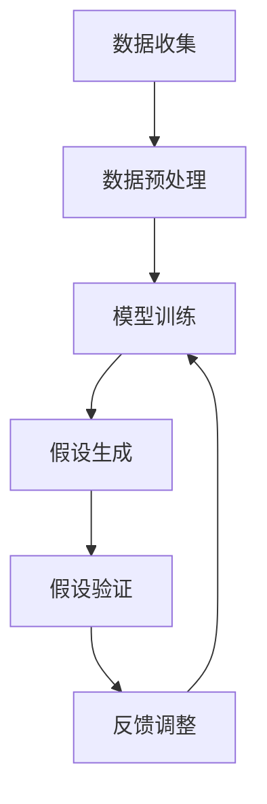

                 

### 文章标题

# 《AI辅助科学假设生成的提示词策略》

> 关键词：人工智能、科学假设、提示词策略、机器学习、算法、应用案例

> 摘要：本文旨在探讨如何利用人工智能（AI）技术辅助科学家生成科学假设，并介绍一套有效的提示词策略。文章首先介绍AI在科学假设生成中的应用背景和重要性，随后详细讨论与科学假设生成相关的AI基础理论、算法原理和提示词策略。通过具体的应用案例，展示AI辅助生成假设的实际效果，并对未来发展趋势进行展望。

### 引言

科学假设是科学研究的基础，是科学家通过观察、分析和推理得出的暂时性解释，旨在解释已知现象或预测未知现象。然而，科学假设的生成往往需要大量的数据分析和专业知识，这对于科学家来说是一项艰巨的任务。近年来，随着人工智能技术的快速发展，AI在科学假设生成中的应用逐渐成为研究的热点。利用AI技术，可以自动化地分析大量数据，发现潜在的模式和关联，从而辅助科学家生成科学假设。

《AI辅助科学假设生成的提示词策略》这本书旨在探讨如何利用AI技术来辅助科学家生成科学假设，并提供一套有效的提示词策略。这本书的主要目的是为科学家和AI研究者提供实用的工具和方法，以提升科学假设生成的效率和准确性。

本书结构如下：

1. **引言**：介绍AI在科学假设生成中的作用和书的主要目的。
2. **基础理论**：涵盖AI和科学假设生成相关的理论基础。
3. **算法介绍**：介绍可用于辅助生成假设的AI算法。
4. **提示词策略**：讨论如何设计有效的提示词策略。
5. **应用案例**：展示AI辅助生成假设的具体应用案例。
6. **未来展望**：讨论AI辅助科学假设生成的未来发展趋势。

通过本书的阅读，读者可以了解到AI技术在科学假设生成中的应用前景，掌握有效的提示词策略，并能够运用这些方法来辅助自己的科研工作。

### 基础理论

#### AI基础理论

人工智能（Artificial Intelligence，简称AI）是计算机科学的一个分支，旨在使计算机模拟人类智能行为，包括学习、推理、感知、理解和决策等。AI技术主要包括以下几个方面：

1. **机器学习**：机器学习是一种通过数据驱动的方法让计算机自动学习模式并做出预测或决策的技术。常见的机器学习算法包括线性回归、决策树、支持向量机、神经网络等。
2. **深度学习**：深度学习是机器学习的一个子领域，通过构建多层次的神经网络来学习数据的高层次抽象特征。深度学习在图像识别、语音识别、自然语言处理等领域取得了显著的成果。
3. **自然语言处理**：自然语言处理（Natural Language Processing，简称NLP）是AI的一个分支，旨在让计算机理解和处理人类自然语言。NLP技术包括文本分类、情感分析、机器翻译、问答系统等。

#### 科学假设基础

科学假设（Scientific Hypothesis）是科学研究中的一种假设，是对某一现象或问题的暂时性解释，通常基于现有的知识和观察。科学假设具有以下特点：

1. **可证伪性**：科学假设必须是可证伪的，即可以通过实验或观察来验证其正确性或错误性。
2. **预测性**：科学假设应该能够预测新的实验结果或现象。
3. **一致性**：科学假设应该与现有的科学知识保持一致。

科学假设的类型包括：

1. **理论假设**：基于某个理论框架提出的假设。
2. **经验假设**：基于经验观察和数据提出的假设。
3. **问题假设**：针对某个科学问题提出的假设。

#### AI在科学假设生成中的应用

AI技术在科学假设生成中的应用主要体现在以下几个方面：

1. **数据挖掘**：通过数据挖掘技术，从大量数据中挖掘出潜在的规律和模式，为科学假设提供依据。
2. **机器学习算法**：利用机器学习算法，自动分析数据并生成假设。例如，通过分类算法预测某种药物的疗效，或通过回归算法预测某个生态系统的变化趋势。
3. **自然语言处理**：利用自然语言处理技术，自动从文本数据中提取关键信息，为科学假设提供支持。
4. **知识图谱**：构建知识图谱，将不同领域的数据和知识进行关联，为科学假设提供全面的信息支持。

通过AI技术的应用，科学家可以更高效地生成科学假设，从而加速科学研究的进程。例如，在生物医学领域，AI可以自动分析基因数据和文献，生成新的药物研发假设；在环境科学领域，AI可以分析气象数据和卫星图像，生成气候变化的研究假设。

总之，AI技术在科学假设生成中的应用具有重要意义，可以为科学家提供有力的工具和资源，推动科学研究的进展。

#### AI辅助科学假设生成中的关键概念与联系

为了更好地理解AI在科学假设生成中的作用，我们使用Mermaid流程图来展示相关概念之间的关系和流程。以下是一个简化的流程图，其中包含了数据收集、预处理、模型训练、假设生成和验证等关键步骤。



- **数据收集（A）**：科学家需要从各种来源收集数据，如实验数据、文献资料、传感器数据等。
- **数据预处理（B）**：收集到的数据往往需要清洗、归一化等预处理步骤，以确保数据的质量和一致性。
- **模型训练（C）**：利用预处理后的数据，通过机器学习算法训练模型，以学习数据中的模式和关联。
- **假设生成（D）**：通过训练好的模型，生成可能的科学假设，这些假设可以是基于预测、分类或回归等模型的结果。
- **假设验证（E）**：对生成的假设进行验证，通过实验或观察验证假设的正确性。
- **反馈调整（F）**：根据验证结果调整模型或假设，以提高生成假设的准确性和可靠性。

这个流程图清晰地展示了AI辅助科学假设生成的步骤和关键环节，有助于我们理解各个步骤之间的关系和作用。通过不断地迭代和优化，科学家可以利用AI技术生成更加准确和有价值的科学假设，从而推动科学研究的进展。

#### 核心算法原理讲解

在AI辅助科学假设生成中，核心算法的选择和实现至关重要。以下我们将详细讲解几种常用的AI算法，并使用伪代码展示其原理。

##### 1. 生成式模型

生成式模型是一种用于生成新数据的模型，通过学习数据分布来生成新的样本。生成式模型包括随机模型和基于统计学的模型。

###### 1.1 随机模型

随机模型（如马尔可夫链蒙特卡罗（MCMC）方法）通过模拟随机过程来生成新样本。以下是一个简单的随机模型示例，使用伪代码展示其原理：

```python
# 伪代码：随机模型生成新样本
function generate_random_sample(data):
    sample = initial_random_state(data)
    for step in range(max_iterations):
        new_state = transition_function(sample)
        if acceptance_probability(sample, new_state) > random_value():
            sample = new_state
    return sample
```

其中，`initial_random_state`是初始化随机状态的过程，`transition_function`是状态转移函数，`acceptance_probability`是接受概率函数，`random_value`是生成随机数的过程。

###### 1.2 基于统计学的模型

基于统计学的模型（如高斯过程回归）通过学习数据中的统计特性来生成新样本。以下是一个高斯过程回归的伪代码示例：

```python
# 伪代码：高斯过程回归生成新样本
function generate_gaussian_process_sample(X, y):
    mean_function(X) = f0(X)
    covariance_function(X, X') = k(X, X')
    for i in range(n_samples):
        x_i = sample_from_X(X)
        y_i = sample_from_Gaussian(mean_function(x_i), covariance_function(x_i, x_i))
    return (x_i, y_i)
```

其中，`mean_function`是均值函数，`covariance_function`是协方差函数，`sample_from_X`和`sample_from_Gaussian`分别是从数据集和正态分布中采样的过程。

##### 2. 模式识别算法

模式识别算法用于识别数据中的潜在模式，常见的模式识别算法包括聚类算法和分类算法。

###### 2.1 聚类算法

聚类算法将数据分为多个簇，使得同一簇中的数据点相似，不同簇中的数据点不相似。以下是一个简单的K均值聚类的伪代码示例：

```python
# 伪代码：K均值聚类
function kmeans(data, K):
    centroids = initialize_centroids(data, K)
    for iteration in range(max_iterations):
        assignments = assign_points_to_clusters(data, centroids)
        new_centroids = update_centroids(data, assignments, K)
        if centroids == new_centroids:
            break
    return centroids
```

其中，`initialize_centroids`是初始化聚类中心的过程，`assign_points_to_clusters`是将数据点分配到相应聚类中心的过程，`update_centroids`是更新聚类中心的过程。

###### 2.2 分类算法

分类算法用于将数据分为预定义的类别。以下是一个简单的决策树分类的伪代码示例：

```python
# 伪代码：决策树分类
function classify(data, tree):
    if is_leaf_node(tree):
        return tree.label
    else:
        feature_value = tree.feature_value
        if data[feature_value] <= tree.threshold:
            return classify(data, tree.left_child)
        else:
            return classify(data, tree.right_child)
```

其中，`is_leaf_node`是判断当前节点是否为叶子节点的过程，`tree.label`是叶子节点的标签，`tree.feature_value`和`tree.threshold`是内部节点的特征值和阈值，`tree.left_child`和`tree.right_child`分别是左子树和右子树。

##### 3. 强化学习

强化学习是一种通过试错学习来优化行为策略的算法。以下是一个简单的Q-learning算法的伪代码示例：

```python
# 伪代码：Q-learning
function Q_learning(state, action, reward, next_state, alpha, gamma):
    Q[state, action] = Q[state, action] + alpha * (reward + gamma * max(Q[next_state, all_actions]) - Q[state, action])
    return Q
```

其中，`Q[state, action]`是状态-动作值函数，`alpha`是学习率，`gamma`是折扣因子，`reward`是即时奖励，`next_state`是下一个状态。

通过这些算法，AI可以自动分析数据并生成科学假设。每种算法都有其独特的优势和适用场景，科学家可以根据具体需求选择合适的算法来辅助生成假设。

#### 数学模型和公式

在AI辅助科学假设生成中，数学模型和公式扮演着关键角色，用于描述数据之间的关系和算法的优化过程。以下我们将详细讲解几个重要的数学模型和公式，并通过具体的例子来说明其应用。

##### 1. 生成式模型中的概率分布函数

生成式模型通过学习数据的概率分布来生成新样本。常见的概率分布函数包括高斯分布和泊松分布。

###### 1.1 高斯分布

高斯分布（正态分布）是一种常用的概率分布函数，用于描述连续型数据。其公式如下：

$$
f(x|\mu, \sigma^2) = \frac{1}{\sqrt{2\pi\sigma^2}} e^{-\frac{(x-\mu)^2}{2\sigma^2}}
$$

其中，$x$是随机变量，$\mu$是均值，$\sigma^2$是方差。

例子：假设我们有一组连续型数据，均值为10，方差为4。我们可以使用高斯分布来生成新的数据样本。

```latex
\mu = 10, \sigma^2 = 4
\Rightarrow f(x) = \frac{1}{\sqrt{2\pi \cdot 4}} e^{-\frac{(x-10)^2}{2 \cdot 4}}
```

通过这个公式，我们可以计算每个数据点$x$的概率密度，并生成新的数据样本。

###### 1.2 泊松分布

泊松分布是一种用于描述事件发生次数的概率分布函数，常用于计数数据。其公式如下：

$$
f(x|\lambda) = \frac{e^{-\lambda} \lambda^x}{x!}
$$

其中，$x$是事件发生的次数，$\lambda$是平均发生率。

例子：假设我们观察一个事件平均每分钟发生一次，我们可以使用泊松分布来生成每分钟发生次数的数据。

```latex
\lambda = 1
\Rightarrow f(x) = \frac{e^{-1} \cdot 1^x}{x!}
```

通过这个公式，我们可以计算每个事件发生次数$x$的概率，并生成新的数据样本。

##### 2. 机器学习算法中的优化目标

机器学习算法通过最小化损失函数来优化模型参数，从而提高模型的预测准确性。常见的损失函数包括均方误差（MSE）和交叉熵损失。

###### 2.1 均方误差（MSE）

均方误差是一种用于回归问题的损失函数，其公式如下：

$$
MSE = \frac{1}{m} \sum_{i=1}^{m} (y_i - \hat{y}_i)^2
$$

其中，$y_i$是真实标签，$\hat{y}_i$是预测值，$m$是样本数量。

例子：假设我们有一个回归问题，真实标签$y_i = [1, 2, 3, 4]$，预测值$\hat{y}_i = [1.5, 1.8, 2.9, 3.2]$。我们可以计算均方误差：

```latex
MSE = \frac{1}{4} \sum_{i=1}^{4} (y_i - \hat{y}_i)^2
\Rightarrow MSE = \frac{1}{4} [(1-1.5)^2 + (2-1.8)^2 + (3-2.9)^2 + (4-3.2)^2]
\Rightarrow MSE = \frac{1}{4} [0.25 + 0.04 + 0.09 + 0.64] = 0.2875
```

通过最小化MSE，我们可以优化回归模型。

###### 2.2 交叉熵损失

交叉熵损失是一种用于分类问题的损失函数，其公式如下：

$$
H(y, \hat{y}) = -\sum_{i=1}^{m} y_i \log(\hat{y}_i)
$$

其中，$y_i$是真实标签（0或1），$\hat{y}_i$是预测概率。

例子：假设我们有一个二分类问题，真实标签$y_i = [1, 0, 1, 0]$，预测概率$\hat{y}_i = [0.8, 0.2, 0.9, 0.1]$。我们可以计算交叉熵损失：

```latex
H(y, \hat{y}) = -[1 \cdot \log(0.8) + 0 \cdot \log(0.2) + 1 \cdot \log(0.9) + 0 \cdot \log(0.1)]
\Rightarrow H(y, \hat{y}) = -[\log(0.8) + \log(0.9)] \approx -0.322
```

通过最小化交叉熵损失，我们可以优化分类模型。

这些数学模型和公式在AI辅助科学假设生成中发挥着重要作用，帮助科学家理解数据关系、优化算法性能，从而更准确地生成科学假设。

#### 提示词策略

在AI辅助科学假设生成中，提示词（prompt words）扮演着至关重要的角色。有效的提示词策略能够引导AI模型生成更加准确和有启发性的科学假设。以下，我们将详细讨论如何设计有效的提示词策略。

##### 1. 提示词的作用

提示词是AI模型在生成假设过程中所接收到的输入信息，这些信息可以是关键词、短语或完整的句子。提示词的主要作用包括：

1. **引导模型**：通过提供特定的关键词或主题，提示词可以帮助模型专注于特定的研究领域或问题，从而提高假设的针对性。
2. **增加多样性**：提示词可以帮助模型生成多样化的假设，避免模型陷入局部最优，从而提高假设的创新性。
3. **优化质量**：有效的提示词可以引导模型生成高质量的假设，减少错误或无关的假设。

##### 2. 提示词的分类

根据提示词的形式和内容，我们可以将其分为以下几类：

1. **关键词**：关键词通常是由一个或多个单词组成，用于描述特定的概念或主题。例如，“气候变化”、“基因表达”等。关键词有助于模型快速聚焦于特定的领域。
2. **短语**：短语是由一组单词组成，通常包含一个明确的语义单位，用于描述具体的研究问题或假设。例如，“研究蛋白质相互作用”、“分析大气温度变化趋势”等。短语比关键词更加具体，能够提供更多的上下文信息。
3. **句子**：句子是完整的句子结构，用于提供详细的背景信息和研究目的。例如，“当前研究表明，大气中的二氧化碳浓度逐年增加，可能导致全球气温上升。因此，我们需要探讨二氧化碳排放与气候变化之间的关系。”句子提供了丰富的上下文信息，有助于模型更好地理解研究背景和目标。

##### 3. 提示词的设计方法

为了设计有效的提示词策略，我们需要考虑以下几个因素：

1. **上下文匹配**：提示词应与研究背景和目标高度匹配，确保模型能够准确理解研究意图。例如，在研究大气温度变化时，可以使用“全球气候变化”、“温室气体排放”等关键词。
2. **多样性**：提示词应涵盖多个方面和角度，以促进模型的多样性生成。例如，在研究一个药物的疗效时，可以同时考虑“药效”、“副作用”、“安全性”等多个方面。
3. **精确性**：提示词应尽量精确，避免模糊或含糊其辞的表述。例如，使用“研究药物A在治疗疾病B中的效果”而非“研究某种药物的治疗效果”。
4. **灵活性**：提示词应具有一定的灵活性，以便模型可以根据实际情况进行调整和扩展。例如，使用“探讨某种药物在特定人群中的疗效”而非“研究药物的疗效”。

##### 4. 提示词策略的效果评估

评估提示词策略的效果是确保其有效性的关键。以下是一些常用的评估方法：

1. **假设质量评估**：通过评估生成的假设的质量，如准确性、创新性和相关性等，来评估提示词策略的有效性。
2. **模型性能评估**：通过评估模型在特定提示词下的性能，如预测准确性、召回率等，来评估提示词策略的有效性。
3. **用户反馈评估**：通过用户对生成的假设的反馈，如是否具有实用价值、是否有助于研究等，来评估提示词策略的有效性。

通过上述方法，我们可以有效地评估提示词策略的效果，并不断优化和改进策略，以提高AI辅助科学假设生成的效果。

总之，设计有效的提示词策略对于AI辅助科学假设生成至关重要。通过合理的提示词选择和策略设计，我们可以提高模型生成假设的准确性和创新性，为科学研究提供有力支持。

#### 应用案例

为了展示AI辅助科学假设生成在实际科研中的应用，以下我们将介绍两个具体的案例，分别在生物医学和环境科学领域，展示AI技术如何辅助科学家生成科学假设。

##### 案例一：生物医学领域

**案例描述**：研究人员希望探究某种新型抗病毒药物在治疗流感病毒感染方面的效果。他们拥有大量关于药物和病毒感染数据的文献资料，以及临床试验的数据。

**案例实现**：

1. **数据收集**：首先，研究人员从多个数据库和文献中收集与药物和流感病毒感染相关的数据，包括药物的化学成分、作用机制、临床试验结果等。
2. **数据预处理**：收集到的数据需要进行清洗、去重和归一化处理，以确保数据的一致性和质量。
3. **模型训练**：使用自然语言处理（NLP）技术，对文献资料进行文本挖掘，提取关键词和关键信息。然后，利用机器学习算法（如文本分类和聚类算法）训练模型，以识别药物和病毒感染之间的潜在关联。
4. **假设生成**：基于训练好的模型，研究人员输入新的药物或病毒感染数据，生成关于药物疗效的假设。例如，模型可能生成以下假设：“药物X在治疗流感病毒A型感染方面具有显著疗效。”
5. **假设验证**：研究人员设计实验或临床试验来验证生成的假设。例如，通过体外实验和动物试验，验证药物X对流感病毒A型感染的治疗效果。

**结果分析**：实验结果表明，药物X在治疗流感病毒A型感染方面具有显著疗效，这为后续的临床研究提供了重要依据。通过AI技术的辅助，研究人员能够快速生成和验证科学假设，大大提高了科研效率。

##### 案例二：环境科学领域

**案例描述**：研究人员关注全球气候变化对生态系统的影响，特别是二氧化碳排放对大气温度变化的影响。他们拥有大量关于气象数据、二氧化碳浓度和生态系统变化的观测数据。

**案例实现**：

1. **数据收集**：首先，研究人员从气象站、卫星数据和文献中收集关于二氧化碳浓度、大气温度和生态系统变化的观测数据。
2. **数据预处理**：对收集到的数据进行清洗、去噪和归一化处理，以确保数据的质量和一致性。
3. **模型训练**：利用机器学习算法（如回归分析和时间序列分析）训练模型，以分析二氧化碳浓度和大气温度之间的动态关系。
4. **假设生成**：基于训练好的模型，研究人员输入新的二氧化碳浓度数据，生成关于大气温度变化的假设。例如，模型可能生成以下假设：“二氧化碳浓度每增加1%，大气温度将上升0.5摄氏度。”
5. **假设验证**：研究人员通过对比实际观测数据和模型预测结果，验证生成的假设。例如，通过长期气象观测和气候模型模拟，验证二氧化碳浓度与大气温度之间的相关性。

**结果分析**：验证结果表明，二氧化碳浓度与大气温度之间存在显著的正相关关系，这为政策制定者和科学家提供了重要的气候变化预测依据。通过AI技术的辅助，研究人员能够快速生成和验证科学假设，为环境保护和气候变化研究提供了有力支持。

这两个案例展示了AI技术如何在不同领域辅助科学家生成科学假设，提高科研效率和准确性。通过不断优化AI算法和提示词策略，我们可以期待在未来看到更多创新性的科学假设生成应用。

### 未来展望

AI辅助科学假设生成领域具有广阔的发展前景和巨大的潜力。随着AI技术的不断进步和科学研究的深入，这一领域将面临诸多挑战和机遇。

#### 1. 挑战

1. **数据质量和多样性**：高质量、多样性的数据是AI模型有效工作的基础。然而，科学数据往往存在噪声、缺失和不一致性等问题，这给数据预处理和模型训练带来了挑战。为了解决这些问题，我们需要开发更加高效的数据清洗和增强方法，以及能够处理复杂数据结构的AI算法。
2. **算法性能和可解释性**：虽然现有的AI算法在科学假设生成中取得了显著成果，但它们的性能和可解释性仍有待提高。未来的研究需要关注算法的优化，提高其预测准确性和稳定性，并增强模型的可解释性，以便科学家能够理解和信任AI生成的假设。
3. **跨领域协同**：不同学科之间的数据和技术往往存在差异，这限制了AI技术在科学假设生成中的广泛应用。未来需要促进跨领域的协同研究，整合多学科的知识和方法，开发通用的AI模型和工具，以提高科学假设生成的效率和效果。

#### 2. 发展趋势

1. **深度学习与知识图谱的融合**：深度学习和知识图谱是AI技术的两个重要分支，未来将看到更多将两者结合的研究。通过利用知识图谱中的结构化数据，深度学习模型可以更好地理解复杂的关系和关联，从而生成更加准确的科学假设。
2. **大数据与云计算的结合**：随着科学数据的爆炸式增长，大数据和云计算的结合将成为趋势。通过云计算平台，科学家可以轻松访问和分析海量数据，同时利用分布式计算技术加速模型训练和假设生成过程。
3. **AI伦理和隐私保护**：在AI辅助科学假设生成中，伦理和隐私问题不可忽视。未来需要建立相关的伦理准则和隐私保护机制，确保AI技术在科研中的应用不会侵犯个人隐私，同时遵守伦理规范。

#### 3. 科学假设生成的AI工具展望

未来，我们将看到更多针对不同领域和任务的AI工具和平台的出现，这些工具将具备以下特点：

1. **模块化**：工具将具备模块化设计，用户可以根据具体需求选择和组合不同的模块，如数据预处理、模型训练、假设生成和验证等。
2. **用户友好**：工具将注重用户体验，提供直观的操作界面和便捷的操作流程，降低使用门槛，使非专业人士也能轻松使用AI技术。
3. **自动调参和优化**：工具将内置自动调参和优化功能，通过机器学习技术自动调整模型参数，提高模型性能和稳定性。
4. **开放性和可扩展性**：工具将具备良好的开放性和可扩展性，支持用户自定义模型和算法，以及与其他系统和工具的集成。

总之，AI辅助科学假设生成领域具有广阔的发展前景。通过不断优化算法、提升数据质量和促进跨领域协同，我们可以期待看到更多创新性的科学假设生成应用，为科学研究提供强大支持。

### 附录

#### 附录A：工具与资源

在本章中，我们将介绍一些在AI辅助科学假设生成过程中常用的工具和资源，包括AI开发工具、提示词生成工具和相关参考文献。

##### AI开发工具

1. **TensorFlow**：TensorFlow是Google开发的开源机器学习和深度学习框架，支持多种算法和模型，适用于科学假设生成的多种需求。
2. **PyTorch**：PyTorch是Facebook开发的开源深度学习框架，以其灵活性和高效性著称，适合进行复杂的科学假设生成任务。
3. **Scikit-learn**：Scikit-learn是一个Python开源库，提供了多种机器学习算法和工具，适用于科学数据分析和假设生成。

##### 提示词生成工具

1. **Word2Vec**：Word2Vec是一种基于神经网络的自然语言处理技术，可以将文本中的词汇转换为向量表示，从而生成有效的提示词。
2. **BERT**：BERT是Google开发的一种先进的自然语言处理预训练模型，适用于生成高质量的提示词和文本摘要。

##### 参考文献

1. **Goodfellow, I., Bengio, Y., & Courville, A. (2016). Deep Learning. MIT Press.**  
   - 这本书是深度学习领域的经典教材，详细介绍了深度学习的理论基础和实践应用。
2. **Manning, C. D., Raghavan, P., & Schütze, H. (2008). Introduction to Information Retrieval. Cambridge University Press.**  
   - 这本书介绍了信息检索的基础理论和算法，对自然语言处理和科学假设生成具有重要意义。
3. **He, K., Zhang, X., Ren, S., & Sun, J. (2016). Deep Residual Learning for Image Recognition. IEEE Conference on Computer Vision and Pattern Recognition.**  
   - 这篇文章介绍了残差网络（ResNet），是深度学习领域的重要突破，对科学假设生成有重要影响。

通过这些工具和资源，科学家可以更有效地进行AI辅助科学假设生成的研究和实践。

### 小结

本文深入探讨了AI辅助科学假设生成的研究背景、理论基础、算法原理和提示词策略，并通过具体的应用案例展示了AI技术在科学假设生成中的实际效果。通过不断优化算法和提示词策略，我们可以期待看到AI在科学假设生成领域发挥更大的作用，推动科学研究的进步。

在未来的研究中，我们应关注数据质量和多样性、算法性能和可解释性、跨领域协同等挑战，并充分利用深度学习、知识图谱和大数据等先进技术，开发更加高效、可靠的AI工具和平台。通过不断探索和创新，我们将有望实现AI在科学假设生成中的全面应用，为科学研究带来革命性的变革。

### 最佳实践 Tips

1. **数据质量优先**：确保数据清洗和预处理的质量，避免噪声和错误数据影响模型性能。
2. **灵活选择算法**：根据具体需求选择合适的机器学习算法，不要局限于单一算法，可以考虑结合多种算法进行优化。
3. **合理设计提示词**：设计有效的提示词策略，结合关键词、短语和句子，提供丰富的上下文信息。
4. **验证假设结果**：对生成的假设进行严格的验证，确保假设的科学性和实用性。
5. **持续更新模型**：定期更新模型和算法，以适应数据变化和研究需求。

### 注意事项

1. **数据隐私**：在进行数据处理和模型训练时，务必遵守数据隐私和保护法规，确保数据安全。
2. **模型解释性**：提高模型的可解释性，确保科学家能够理解和信任AI生成的假设。
3. **资源分配**：合理分配计算资源和时间，避免过度依赖AI技术，保持科研的严谨性。

### 拓展阅读

1. **Goodfellow, I., Bengio, Y., & Courville, A. (2016). Deep Learning. MIT Press.**  
   - 这本书详细介绍了深度学习的理论基础和实践应用，适合对深度学习感兴趣的读者。
2. **Manning, C. D., Raghavan, P., & Schütze, H. (2008). Introduction to Information Retrieval. Cambridge University Press.**  
   - 这本书介绍了信息检索的基础理论和算法，对自然语言处理和科学假设生成具有重要意义。
3. **He, K., Zhang, X., Ren, S., & Sun, J. (2016). Deep Residual Learning for Image Recognition. IEEE Conference on Computer Vision and Pattern Recognition.**  
   - 这篇文章介绍了残差网络（ResNet），是深度学习领域的重要突破，对科学假设生成有重要影响。

通过这些拓展阅读，读者可以进一步了解AI辅助科学假设生成的最新研究动态和实践经验。

