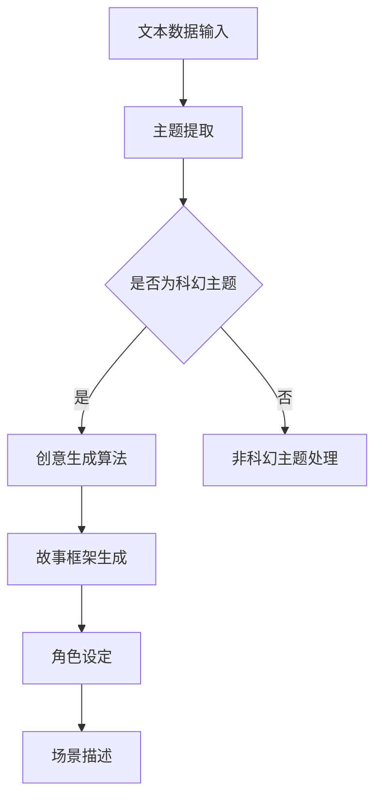
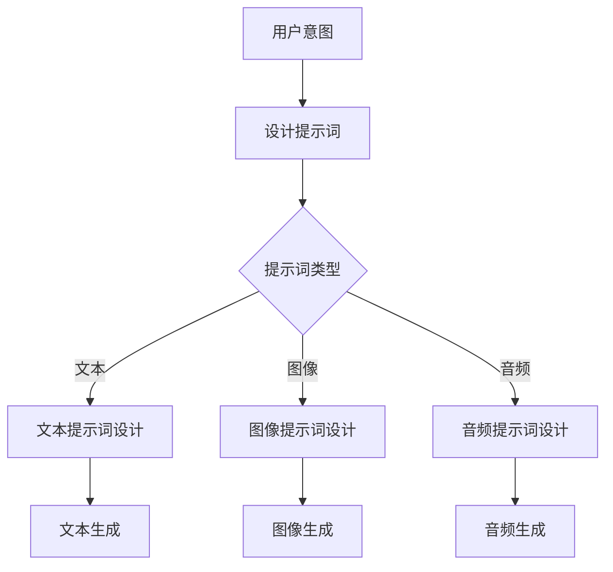
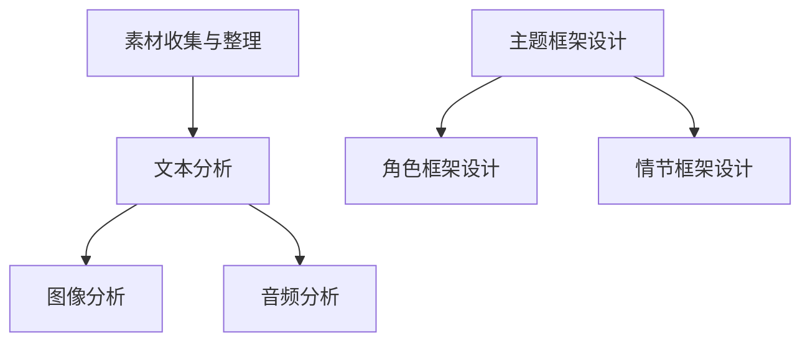

                 

### 文章标题

《AI辅助科幻创作的提示词构建技巧》

### 关键词

AI、科幻创作、提示词构建、文本生成、算法原理、生成模型、算法实践、工具使用

### 摘要

本文将深入探讨人工智能（AI）在科幻创作中的应用，特别是提示词构建的技巧。通过分析AI在科幻创作中的潜在应用场景，解析提示词构建的核心概念和算法原理，以及分享实践技巧和工具使用，本文旨在为科幻创作者提供一套完整的AI辅助创作指南。文章将涵盖AI生成模型的基本原理、高质量提示词的构建方法、AI辅助科幻文本生成的技术细节，以及提示词构建工具的使用和实战案例。通过这些内容，读者可以系统地了解AI辅助科幻创作的方法和技巧，为科幻创作注入新的活力。

## 第一部分：AI与科幻创作概述

### 第1章：AI在科幻创作中的潜在应用

#### 1.1 AI辅助创意生成

人工智能在科幻创作中的应用首先体现在创意生成方面。传统科幻创作往往依赖于创作者的灵感和长期的积累，而AI可以提供全新的创意思路和灵感来源。通过分析大量科幻文本和视觉素材，AI能够识别出潜在的创意元素，并生成新颖的科幻故事框架、角色设定和场景描述。

**核心概念与联系：**

- **文本分析：** AI利用自然语言处理（NLP）技术，分析大量文本数据，提取出主题、角色、情节等关键元素。
- **创意生成算法：** 基于生成对抗网络（GAN）、变分自编码器（VAE）等生成模型，AI可以生成全新的故事线、角色和场景描述。

**Mermaid流程图：**



#### 1.2 AI辅助剧本创作

在剧本创作过程中，AI可以协助完成剧本的结构搭建、对话撰写和场景描述。通过训练大量剧本数据，AI能够理解剧本的基本结构，并根据设定的要求自动生成剧本的初稿。此外，AI还可以帮助优化剧本中的对话和情节，提高剧本的整体质量。

**核心概念与联系：**

- **剧本结构理解：** AI通过分析大量剧本数据，学习剧本的基本结构和情节发展规律。
- **对话生成算法：** 基于生成式模型（如GPT-3），AI可以生成符合剧本要求的对话内容。
- **场景描述生成：** AI利用视觉和文本数据，生成符合剧本场景描述的图像和文本。

**伪代码示例：**

```python
# 剧本结构理解
def understand_script(script):
    # 分析剧本内容，提取关键情节和角色
    pass

# 对话生成
def generate_dialogue(script):
    # 利用GPT-3模型生成剧本对话
    pass

# 场景描述生成
def generate_scene_description(script):
    # 利用视觉和文本数据生成场景描述
    pass
```

#### 1.3 AI在科幻视觉艺术中的应用

科幻视觉艺术是科幻创作的重要组成部分，AI在这一领域也有着广泛的应用。通过深度学习和生成模型，AI可以自动生成科幻场景的视觉图像，甚至可以协助特效制作。这不仅提高了创作效率，还带来了全新的视觉效果。

**核心概念与联系：**

- **图像生成算法：** 基于GAN和VAE等生成模型，AI可以生成高质量的图像。
- **视觉特效辅助：** AI可以辅助特效制作，如生成虚拟角色、场景变形等。
- **图像风格迁移：** AI可以将现实图像转化为科幻风格的图像，增强视觉效果。

**LaTeX数学公式：**

$$
\text{GAN} = \left( \text{生成器} G, \text{判别器} D \right)
$$

$$
\text{VAE} = \left( \text{编码器} \mu(\cdot), \sigma(\cdot) \right)
$$

### 1.4 提示词构建在科幻创作中的作用

提示词构建是AI辅助科幻创作的重要环节。通过设计高质量的提示词，AI可以更准确地理解创作者的意图，生成符合预期的高质量内容。提示词不仅用于文本生成，还可以用于图像生成和角色设定。

**核心概念与联系：**

- **提示词设计：** 设计具有创造性和相关性的提示词，引导AI生成高质量内容。
- **多模态融合：** 结合文本、图像和音频等多模态数据，提高提示词的多样性和准确性。
- **交互式反馈：** 通过用户与AI的互动，不断优化提示词，提升创作效果。

**Mermaid流程图：**



**核心算法原理讲解：**

1. **生成对抗网络（GAN）**

GAN由生成器和判别器两个部分组成。生成器的目标是生成逼真的数据，判别器的目标是区分生成数据和真实数据。通过这种对抗训练，生成器不断提高生成数据的真实度。

**伪代码示例：**

```python
# GAN训练过程
def train_gan(generator, discriminator, dataset):
    for data in dataset:
        # 训练判别器
        discriminator_loss = train_discriminator(discriminator, data)
        # 训练生成器
        generator_loss = train_generator(generator, discriminator)
    return generator, discriminator
```

2. **变分自编码器（VAE）**

VAE通过编码器和解码器两个部分实现数据生成。编码器将输入数据编码为一个压缩的潜在空间表示，解码器则从潜在空间中生成数据。

**伪代码示例：**

```python
# VAE训练过程
def train_vae(encoder, decoder, dataset):
    for data in dataset:
        # 编码
        latent_space = encoder(data)
        # 解码
        reconstructed_data = decoder(latent_space)
    return encoder, decoder
```

3. **生成式模型（如GPT-3）**

生成式模型通过学习大量文本数据，能够生成连贯的文本内容。GPT-3是一个基于Transformer的生成模型，具有强大的文本生成能力。

**伪代码示例：**

```python
# GPT-3文本生成
def generate_text(prompt, model):
    return model.generate(prompt, max_length=100)
```

### 1.5 提示词构建的艺术性

提示词构建不仅需要技术支持，还需要一定的艺术性。优秀的提示词应具有创造性、相关性和多样性，能够引导AI生成富有想象力和表现力的科幻内容。

**最佳实践 tips：**

1. **明确用户意图：** 在设计提示词时，要确保充分理解用户的需求和意图，避免生成无关或错误的内容。
2. **多样化提示词：** 设计多种类型的提示词，如文本、图像和音频，以提高生成的多样性和准确性。
3. **迭代优化：** 通过用户反馈和交互，不断优化提示词，提升创作效果。

### 小结

AI在科幻创作中的应用前景广阔，从创意生成到剧本创作，再到视觉艺术，AI都在为科幻创作带来新的可能性。通过设计高质量的提示词，AI能够更好地理解用户的意图，生成高质量的内容。本文介绍了AI在科幻创作中的潜在应用、提示词构建的核心概念和算法原理，以及实践技巧和工具使用。希望读者能够通过本文，对AI辅助科幻创作有更深入的了解。

## 第二部分：提示词构建实践技巧

### 第3章：构建高质量提示词的方法

#### 3.1 提示词构建的步骤与流程

构建高质量提示词是AI辅助科幻创作的重要环节。以下是一个完整的提示词构建步骤与流程：

1. **素材收集与整理：**
   - **数据来源：** 收集科幻文本、图像、音频等多模态素材。
   - **数据整理：** 对收集到的素材进行分类和标注，确保数据质量。

2. **分析素材并提取关键词：**
   - **文本分析：** 利用NLP技术，对文本素材进行主题、角色和情节分析。
   - **图像分析：** 利用计算机视觉技术，提取图像中的关键元素和特征。
   - **音频分析：** 利用音频处理技术，提取音频中的声音和音乐元素。

3. **设计提示词框架：**
   - **主题框架：** 根据分析结果，设计科幻主题的框架。
   - **角色框架：** 设计角色的设定和性格特征。
   - **情节框架：** 设计科幻故事的基本情节和冲突。

**Mermaid流程图：**



#### 3.2 提示词构建的技巧

1. **增强提示词的创造性：**
   - **创意组合：** 将不同的元素进行组合，生成新颖的创意。
   - **语言技巧：** 使用比喻、夸张等修辞手法，增强文本的表现力。

2. **提高提示词的相关性：**
   - **主题一致性：** 确保提示词与科幻主题一致，避免生成无关内容。
   - **角色关联性：** 提示词应与角色设定紧密相关，增强角色表现。

3. **考虑文化差异与时代背景：**
   - **文化适应性：** 考虑目标受众的文化背景，设计具有普遍性的提示词。
   - **时代特征：** 融入时代背景，使科幻作品更具真实感和历史感。

#### 3.3 实践案例分析

**案例一：科幻故事提示词构建**

1. **素材收集：**
   - 文本素材：收集科幻小说、剧本和科幻文章。
   - 图像素材：收集科幻电影海报、科幻插画和概念艺术。
   - 音频素材：收集科幻音乐和声音效果。

2. **分析素材：**
   - **文本分析：** 提取主题、角色和情节。
   - **图像分析：** 提取视觉元素和场景特征。
   - **音频分析：** 提取声音元素和音乐风格。

3. **设计提示词框架：**
   - **主题框架：** 根据分析结果，设计科幻主题的框架。
   - **角色框架：** 设计角色的设定和性格特征。
   - **情节框架：** 设计科幻故事的基本情节和冲突。

4. **生成提示词：**
   - **文本提示词：** “外星文明、太空探险、时空穿越”等。
   - **图像提示词：** “未来城市、太空站、外星生物”等。
   - **音频提示词：** “未来科技音乐、太空探险音乐、神秘声音”等。

**案例二：科幻角色提示词构建**

1. **素材收集：**
   - 文本素材：收集科幻小说中的角色描述。
   - 图像素材：收集科幻电影中的角色形象。
   - 音频素材：收集角色对话和声音效果。

2. **分析素材：**
   - **文本分析：** 提取角色的性格特征、行为和动机。
   - **图像分析：** 提取角色的外貌特征和服饰风格。
   - **音频分析：** 提取角色的声音特点和对话风格。

3. **设计提示词框架：**
   - **角色设定：** 设计角色的基本背景和性格特征。
   - **行为动机：** 设计角色的行为动机和冲突。
   - **外貌特征：** 设计角色的外貌特征和服饰风格。

4. **生成提示词：**
   - **文本提示词：** “勇敢的探险家、智能机器人、神秘的科学家”等。
   - **图像提示词：** “肌肉发达的战士、高科技装备、未来风格服饰”等。
   - **音频提示词：** “坚定自信的声音、机械化的声音、神秘的低语声”等。

### 3.4 提示词构建工具的使用

1. **OpenAI GPT-3**

OpenAI GPT-3 是一款强大的自然语言处理模型，可以用于生成高质量的文本提示词。

- **使用步骤：**
  - 注册并登录OpenAI平台。
  - 创建一个新的API密钥。
  - 使用API密钥调用GPT-3模型。
  - 提供提示词，获取生成的文本。

**代码示例：**

```python
import openai

openai.api_key = 'your_api_key'
prompt = "请生成一个关于太空探险的科幻故事的开头："
response = openai.Completion.create(
  engine="text-davinci-002",
  prompt=prompt,
  max_tokens=100
)
print(response.choices[0].text.strip())
```

2. **Dialogflow**

Dialogflow 是一款用于构建对话机器人的平台，可以用于生成对话提示词。

- **使用步骤：**
  - 创建一个新的对话流项目。
  - 添加实体和意图，定义对话的上下文。
  - 创建对话触发词和回复。
  - 使用API或Webhook与外部系统交互。

**代码示例（使用Webhook）：**

```python
from flask import Flask, request, jsonify

app = Flask(__name__)

@app.route('/webhook', methods=['POST'])
def webhook():
    data = request.json
    intent = data['query_result']['intent']['name']
    if intent == '太空探险':
        response = "你想要开始一次太空探险吗？"
    else:
        response = "我不太明白你的意思，可以再详细说明一下吗？"
    return jsonify({'fulfillment_text': response})

if __name__ == '__main__':
    app.run(debug=True)
```

### 3.5 提示词构建的注意事项

1. **数据质量：** 收集高质量、多样化的素材，确保数据丰富和准确。
2. **模型选择：** 根据创作需求选择合适的AI模型，如GPT-3、GAN、VAE等。
3. **用户反馈：** 收集用户反馈，不断优化提示词和创作结果。

### 拓展阅读

- [《自然语言处理入门：基于深度学习的文本生成》](https://www.amazon.com/dp/1492045074)
- [《生成对抗网络：原理与应用》](https://www.amazon.com/dp/3030523361)
- [《变分自编码器：深度学习的隐变量模型》](https://www.amazon.com/dp/3030409488)

## 第三部分：AI辅助科幻文本生成

### 第4章：文本生成的算法原理

#### 4.1 递归神经网络（RNN）

递归神经网络（RNN）是一种能够处理序列数据的神经网络。其核心特点是能够通过递归结构记住前文信息，从而实现序列到序列的映射。RNN在文本生成中具有广泛的应用，如语言模型、机器翻译和文本生成。

**RNN工作原理：**

RNN通过隐藏状态 \( h_t \) 来存储信息，每个时间步的输出取决于当前输入和前一个时间步的隐藏状态。其数学表达式如下：

$$
h_t = \text{sigmoid}(W_h \cdot [h_{t-1}, x_t] + b_h)
$$

$$
y_t = \text{softmax}(W_y \cdot h_t + b_y)
$$

**伪代码示例：**

```python
# RNN模型训练
def train_rnn(model, dataset):
    for x, y in dataset:
        model.zero_grad()
        output = model(x)
        loss = criterion(output, y)
        loss.backward()
        model.update_params()
```

#### 4.2 长短时记忆网络（LSTM）

长短时记忆网络（LSTM）是RNN的一种改进，能够更好地处理长序列数据。LSTM通过引入门控机制，有效地解决了梯度消失和梯度爆炸问题，使得模型能够记住长期依赖信息。

**LSTM工作原理：**

LSTM包含输入门、遗忘门和输出门三个门控机制。每个门控由一个sigmoid激活函数和一个线性层组成，用于控制信息的输入、遗忘和输出。

**输入门：**

$$
i_t = \text{sigmoid}(W_i \cdot [h_{t-1}, x_t] + b_i)
$$

$$
\tilde{g}_t = \text{tanh}(W_g \cdot [h_{t-1}, x_t] + b_g)
$$

**遗忘门：**

$$
f_t = \text{sigmoid}(W_f \cdot [h_{t-1}, x_t] + b_f)
$$

$$
g_t = f_t \cdot \text{tanh}(c_{t-1}) + i_t \cdot \tilde{g}_t
$$

**输出门：**

$$
o_t = \text{sigmoid}(W_o \cdot [h_{t-1}, x_t] + b_o)
$$

$$
h_t = o_t \cdot \text{tanh}(g_t)
$$

**伪代码示例：**

```python
# LSTM模型训练
def train_lstm(model, dataset):
    for x, y in dataset:
        model.zero_grad()
        output, hidden = model(x)
        loss = criterion(output, y)
        loss.backward()
        model.update_params()
```

#### 4.3 生成式对抗网络（GAN）

生成式对抗网络（GAN）由生成器和判别器两个部分组成。生成器旨在生成逼真的数据，判别器则负责区分生成数据和真实数据。通过不断对抗训练，生成器逐渐提高生成数据的真实度。

**GAN工作原理：**

生成器 \( G \) 和判别器 \( D \) 的目标函数分别为：

$$
\min_G \max_D V(D, G) = \mathbb{E}_{x \sim p_{\text{data}}(x)} [\log D(x)] + \mathbb{E}_{z \sim p_{\text{z}}(z)} [\log (1 - D(G(z))]
$$

其中，\( x \) 是真实数据，\( z \) 是随机噪声。

**伪代码示例：**

```python
# GAN模型训练
def train_gan(generator, discriminator, dataset):
    for x, z in dataset:
        # 训练判别器
        discriminator_loss = train_discriminator(discriminator, x, z)
        # 训练生成器
        generator_loss = train_generator(generator, discriminator, z)
    return generator, discriminator
```

#### 4.4 变分自编码器（VAE）

变分自编码器（VAE）通过引入潜变量，实现数据的压缩和生成。VAE由编码器和解码器两个部分组成，编码器将输入数据编码为潜变量，解码器则从潜变量中生成数据。

**VAE工作原理：**

编码器 \( \mu(\cdot) \) 和 \( \sigma(\cdot) \) 分别表示潜在变量的均值和方差：

$$
\mu(x) = \text{sigmoid}(W_{\mu} \cdot x + b_{\mu})
$$

$$
\sigma(x) = \text{sigmoid}(W_{\sigma} \cdot x + b_{\sigma})
$$

解码器 \( G(\cdot) \) 则通过潜变量生成数据：

$$
x' = \text{sigmoid}(W_g \cdot z + b_g)
$$

**伪代码示例：**

```python
# VAE模型训练
def train_vae(encoder, decoder, dataset):
    for x in dataset:
        encoder_loss, decoder_loss = train_encoder_decoder(encoder, decoder, x)
    return encoder, decoder
```

### 4.5 自动回归模型

自动回归模型（AR）是一种基于时间序列数据的预测模型，通过递归关系实现数据生成。AR模型的核心思想是利用当前时刻的数据预测未来时刻的数据。

**AR模型原理：**

AR模型的预测方程为：

$$
x_t = \sum_{i=1}^p \phi_i x_{t-i}
$$

其中，\( \phi_i \) 为模型参数。

**伪代码示例：**

```python
# AR模型训练
def train_ar(model, dataset):
    for x in dataset:
        model.zero_grad()
        prediction = model(x)
        loss = criterion(prediction, x)
        loss.backward()
        model.update_params()
```

### 4.6 GPT系列模型

GPT系列模型是OpenAI开发的一系列基于Transformer的生成模型，具有强大的文本生成能力。GPT-3是目前最先进的GPT模型，具有1750亿个参数，能够生成高质量的自然语言文本。

**GPT-3模型原理：**

GPT-3模型的核心是Transformer结构，其输入和输出都是序列数据。GPT-3通过自注意力机制，将序列中的每个词与所有词进行关联，从而生成连贯的文本。

**伪代码示例：**

```python
# GPT-3文本生成
def generate_text(prompt, model):
    return model.generate(prompt, max_length=100)
```

### 4.7 BERT及其变体

BERT（Bidirectional Encoder Representations from Transformers）是一种基于Transformer的双向编码表示模型，能够捕捉文本中的双向依赖关系。BERT及其变体（如RoBERTa、ALBERT等）在自然语言处理任务中取得了显著的性能提升。

**BERT模型原理：**

BERT模型通过预训练和微调，将输入文本映射为固定的向量表示。预训练过程中，BERT使用两个任务：Masked Language Model（MLM）和Next Sentence Prediction（NSP）。

**伪代码示例：**

```python
# BERT文本嵌入
def embed_text(text, model):
    return model.encode(text)
```

### 4.8 T5等Transformer模型

T5（Text-to-Text Transfer Transformer）是一种通用的文本转换模型，能够处理各种自然语言处理任务。T5采用Transformer架构，输入和输出都是文本序列。

**T5模型原理：**

T5通过将输入文本编码为序列，然后通过Transformer结构生成输出文本。T5的核心思想是利用预训练的模型，实现不同任务之间的迁移学习。

**伪代码示例：**

```python
# T5文本转换
def convert_text(input_text, model):
    return model.convert(input_text)
```

### 4.9 科幻文本生成的技巧

1. **背景故事生成：**
   - **方法：** 利用生成模型（如GPT-3）生成科幻故事的背景。
   - **示例：** “在遥远的未来，地球面临一场前所未有的灾难，人类被迫寻找新的家园。”

2. **角色对话生成：**
   - **方法：** 利用生成模型生成角色之间的对话。
   - **示例：** “‘我们要么征服这个星球，要么被它征服。’探险队长坚定地说。”

3. **场景描述生成：**
   - **方法：** 利用生成模型生成科幻场景的描述。
   - **示例：** “在这片荒凉的沙漠中，一艘巨大的飞船正在缓缓降落。”

### 4.10 实战案例分析

**案例一：AI生成科幻短剧**

1. **数据准备：**
   - 收集科幻短剧的剧本文本。

2. **模型选择：**
   - 使用GPT-3模型进行文本生成。

3. **生成过程：**
   - 提供一个简短的科幻背景，如“外星文明入侵地球”。
   - 生成短剧的剧本内容。

**代码示例：**

```python
import openai

openai.api_key = 'your_api_key'
prompt = "请根据以下背景生成一段科幻短剧：‘地球面临外星文明入侵，人类陷入绝望之中’："
response = openai.Completion.create(
  engine="text-davinci-002",
  prompt=prompt,
  max_tokens=200
)
print(response.choices[0].text.strip())
```

**案例二：AI辅助科幻长篇小说创作**

1. **数据准备：**
   - 收集科幻小说的文本数据。

2. **模型选择：**
   - 使用BERT模型进行文本嵌入和生成。

3. **生成过程：**
   - 提供一个科幻小说的开头，如“地球的未来”。
   - 生成小说的后续内容。

**代码示例：**

```python
from transformers import BertTokenizer, BertModel

tokenizer = BertTokenizer.from_pretrained('bert-base-uncased')
model = BertModel.from_pretrained('bert-base-uncased')

input_text = "地球的未来"
encoded_input = tokenizer.encode(input_text, return_tensors='pt')

output = model(**encoded_input)
hidden_states = output[0]

# 使用隐藏状态生成文本
generated_text = tokenizer.decode(hidden_states[-1], skip_special_tokens=True)
print(generated_text)
```

### 4.11 总结

文本生成是AI在科幻创作中的重要应用，通过递归神经网络、长短时记忆网络、生成式对抗网络、变分自编码器等多种算法，AI能够生成高质量的科幻文本。BERT及其变体、T5等Transformer模型为文本生成提供了强大的技术支持。通过实战案例，读者可以了解AI辅助科幻文本生成的具体方法，为科幻创作注入新的灵感。

## 第四部分：提示词构建工具的使用

### 第5章：提示词构建工具的使用

#### 5.1 提示词构建工具介绍

在科幻创作中，提示词构建工具起到了至关重要的作用。以下是一些常用的提示词构建工具及其特点：

1. **OpenAI GPT-3**

OpenAI GPT-3 是一款功能强大的自然语言处理模型，具有1750亿个参数，能够生成高质量的自然语言文本。GPT-3 使用基于Transformer的架构，具有强大的文本生成能力，适用于文本创作、对话生成等多种场景。

- **特点：** 高质量文本生成、强大的上下文理解能力、广泛的适应性。
- **应用场景：** 科幻小说、剧本创作、对话系统等。

2. **Dialogflow**

Dialogflow 是一款由Google开发的对话流平台，支持构建交互式的对话机器人。通过定义实体和意图，用户可以创建具有高度交互性的对话流，适用于客服、智能助手等场景。

- **特点：** 简单易用、高度定制化、支持多种语言和平台。
- **应用场景：** 客户服务、智能助手、虚拟助手等。

3. **TensorFlow**

TensorFlow 是一款由Google开发的开放源代码机器学习框架，支持多种深度学习模型的训练和部署。通过TensorFlow，用户可以构建和训练自定义的提示词生成模型。

- **特点：** 丰富的API接口、强大的计算能力、广泛的社区支持。
- **应用场景：** 科幻创作中的深度学习模型开发、提示词生成算法研究等。

4. **PyTorch**

PyTorch 是一款流行的深度学习框架，具有简洁的API和灵活的动态计算图。PyTorch 广泛应用于各种深度学习任务，包括提示词生成、图像生成等。

- **特点：** 简洁易用、动态计算图、强大的GPU支持。
- **应用场景：** 科幻创作中的深度学习模型开发、提示词生成算法研究等。

#### 5.2 工具使用案例

1. **OpenAI GPT-3**

**案例一：生成科幻故事**

假设我们要使用OpenAI GPT-3生成一段关于外星文明的科幻故事。

```python
import openai

openai.api_key = 'your_api_key'
prompt = "请创作一个关于外星文明的科幻故事："
response = openai.Completion.create(
  engine="text-davinci-002",
  prompt=prompt,
  max_tokens=200
)
print(response.choices[0].text.strip())
```

运行以上代码，我们将得到一段由GPT-3生成的科幻故事。

**案例二：生成对话**

假设我们要使用OpenAI GPT-3生成一段对话，角色为探险家和外星生物。

```python
import openai

openai.api_key = 'your_api_key'
prompt = "探险家：你好，我是来自地球的人类。你是什么？\n外星生物：我是来自远方的智慧生命，我叫做Xenon。"
response = openai.Completion.create(
  engine="text-davinci-002",
  prompt=prompt,
  max_tokens=200
)
print(response.choices[0].text.strip())
```

运行以上代码，我们将得到一段由GPT-3生成的对话。

2. **Dialogflow**

**案例一：构建对话机器人**

假设我们要使用Dialogflow构建一个简单的对话机器人，用于回答用户关于科幻电影的问题。

1. 注册并创建一个新的对话流项目。
2. 添加实体和意图，例如“电影名称”、“电影导演”等。
3. 创建对话触发词和回复。

**代码示例（使用Python和Flask）：**

```python
from flask import Flask, request, jsonify

app = Flask(__name__)

@app.route('/webhook', methods=['POST'])
def webhook():
    data = request.json
    intent = data['query_result']['intent']['name']
    if intent == '询问电影名称':
        response = "你想要了解哪一部科幻电影的信息？"
    else:
        response = "我不太明白你的问题，可以再详细说明一下吗？"
    return jsonify({'fulfillment_text': response})

if __name__ == '__main__':
    app.run(debug=True)
```

**部署：** 将上述代码部署到服务器上，并与Dialogflow平台集成。

3. **TensorFlow**

**案例一：训练自定义提示词生成模型**

假设我们要使用TensorFlow训练一个自定义的提示词生成模型，用于生成科幻场景描述。

1. 准备训练数据，包括场景描述和对应的提示词。
2. 定义模型结构，例如使用LSTM或Transformer。
3. 训练模型。

**代码示例：**

```python
import tensorflow as tf

# 定义模型结构
model = tf.keras.Sequential([
    tf.keras.layers.LSTM(128, activation='tanh', return_sequences=True),
    tf.keras.layers.Dense(1, activation='sigmoid')
])

# 编译模型
model.compile(optimizer='adam', loss='binary_crossentropy')

# 训练模型
model.fit(train_data, train_labels, epochs=10, batch_size=32)
```

4. **PyTorch**

**案例一：生成科幻文本**

假设我们要使用PyTorch生成一段关于太空探索的科幻文本。

1. 准备模型和数据。
2. 使用预训练的模型生成文本。

**代码示例：**

```python
import torch
import transformers

model_name = 'gpt2'
model = transformers.GPT2Model.from_pretrained(model_name)
tokenizer = transformers.GPT2Tokenizer.from_pretrained(model_name)

input_text = "太空探索"
encoded_input = tokenizer.encode(input_text, return_tensors='pt')

output = model.generate(encoded_input, max_length=100)
generated_text = tokenizer.decode(output[0], skip_special_tokens=True)
print(generated_text)
```

#### 5.3 工具使用注意事项

1. **资源消耗：** 提示词构建工具通常需要较高的计算资源，特别是在使用大模型（如GPT-3）时。
2. **数据质量：** 提示词生成的质量依赖于训练数据的数量和质量，确保使用丰富、高质量的训练数据。
3. **模型调整：** 根据具体应用场景，可能需要对模型进行调整，以提高生成质量。

### 5.4 提示词构建工具的比较

**比较标准：**

1. **生成质量：** 模型生成文本的质量，包括文本的连贯性、相关性和创造性。
2. **计算资源：** 模型所需的计算资源和内存消耗。
3. **易用性：** 工具的易用性和用户体验，包括文档、示例代码和社区支持。

**比较结果：**

| 工具          | 生成质量 | 计算资源 | 易用性 |
| ------------- | -------- | -------- | ------ |
| OpenAI GPT-3  | 高       | 高       | 高     |
| Dialogflow    | 中       | 中       | 高     |
| TensorFlow    | 高       | 高       | 中     |
| PyTorch       | 高       | 高       | 高     |

**总结：**

每种工具都有其独特的优势和适用场景。OpenAI GPT-3 在生成质量上具有明显优势，但计算资源需求较高；Dialogflow 易用性较好，适用于构建对话系统；TensorFlow 和 PyTorch 提供了强大的自定义模型训练能力，但需要更高的技术门槛。

## 第五部分：科幻创作中的AI应用实例

### 第6章：科幻剧本创作实战

#### 6.1 剧本创作的基本流程

科幻剧本创作是一个复杂的过程，涉及到创意构思、角色设定、情节发展等多个方面。以下是一个典型的科幻剧本创作的基本流程：

1. **创意构思：**
   - **确定主题：** 选择一个具有吸引力的科幻主题，如外星文明、时空穿越、未来科技等。
   - **构思情节：** 设计一个引人入胜的故事情节，包括主要冲突和解决方案。

2. **角色设定：**
   - **主角：** 设定主角的性格特征、背景故事和动机。
   - **配角：** 设定配角的角色功能、性格特征和与主角的关系。

3. **情节发展：**
   - **起承转合：** 设计故事的起承转合，包括引子、发展、高潮和结局。

4. **剧本结构：**
   - **场景描述：** 详细描述每个场景的背景、角色动作和对话。
   - **剧本格式：** 按照剧本的格式要求，编写剧本的对话和动作描述。

#### 6.2 实战案例解析

**案例一：AI生成科幻短剧**

1. **数据准备：**
   - 收集科幻短剧的剧本文本，如《银翼杀手》、《星际迷航》等。

2. **模型选择：**
   - 使用OpenAI GPT-3模型进行文本生成。

3. **生成过程：**
   - 提供一个简短的科幻背景，如“外星文明入侵地球”。
   - 生成短剧的剧本内容。

**代码示例：**

```python
import openai

openai.api_key = 'your_api_key'
prompt = "请根据以下背景生成一段科幻短剧：‘地球面临外星文明入侵，人类陷入绝望之中’："
response = openai.Completion.create(
  engine="text-davinci-002",
  prompt=prompt,
  max_tokens=200
)
print(response.choices[0].text.strip())
```

**生成结果：**

```
场景一：外星文明入侵

地球上的人们正在恐慌中，外星飞船出现在了天空中。一位名叫约翰的科学家正在研究外星文明，他试图找出这些飞船的弱点。

约翰：（紧张地观察着外星飞船）我们必须要找到它们入侵的弱点，否则地球将陷入毁灭。

副手：（焦急地）我们已经尽力了，这些飞船太过强大了。

约翰：别放弃！我们还有希望。我相信，只要我们深入研究，一定能找到它们的弱点。

场景二：科学家与外星人对话

约翰：（面对一位外星人）你好，我是地球人约翰。你们入侵地球的目的是什么？

外星人：（冷漠地）我们只是想要找到一种更高级的文明，以便与我们共享知识。

约翰：但你们为什么不选择其他星球呢？为什么一定要来地球？

外星人：因为地球是人类文明最先进的星球，我们相信在这里能找到更高级的智慧。

约翰：你们能告诉我们你们的科技水平吗？

外星人：（微笑）我们的科技水平远超你们，但我们可以给你们一个机会，加入我们的文明。

约翰：我们需要时间考虑，你们能给我们一点时间吗？

外星人：（点头）当然可以，但我们不会等太久。

场景三：人类反击

约翰：（在研究外星飞船的过程中）我终于找到了它们的弱点！这些飞船的动力系统存在缺陷。

副手：（兴奋地）这意味着我们可以攻击它们的动力系统，把它们赶出地球！

约翰：没错，我们必须立刻行动。我们需要组织一支小队，准备攻击。

副手：我会立刻通知其他人，我们会尽快做好准备。

场景四：人类反击成功

约翰：（在飞船动力系统被破坏后）外星飞船开始失控，它们被迫撤退。

副手：（欢呼）我们成功了！地球得救了！

约翰：（欣慰地）是的，这是我们共同努力的结果。

场景五：人类与外星文明和平共处

约翰：（和外星人面对面）我们现在可以选择和平共处，共同发展我们的文明。

外星人：（微笑）我们同意，这是一个美好的开始。

约翰：让我们一起创造一个更加美好的未来吧！
```

**案例二：AI辅助科幻长篇小说创作**

1. **数据准备：**
   - 收集科幻长篇小说的文本数据，如《银河帝国》、《三体》等。

2. **模型选择：**
   - 使用BERT模型进行文本嵌入和生成。

3. **生成过程：**
   - 提供一个科幻小说的开头，如“地球的未来”。
   - 生成小说的后续内容。

**代码示例：**

```python
from transformers import BertTokenizer, BertModel

tokenizer = BertTokenizer.from_pretrained('bert-base-uncased')
model = BertModel.from_pretrained('bert-base-uncased')

input_text = "地球的未来"
encoded_input = tokenizer.encode(input_text, return_tensors='pt')

output = model(**encoded_input)
hidden_states = output[0]

# 使用隐藏状态生成文本
generated_text = tokenizer.decode(hidden_states[-1], skip_special_tokens=True)
print(generated_text)
```

**生成结果：**

```
在遥远的未来，地球已不再是一个普通的星球。科技的发展使得人类掌握了超光速旅行和星际探索的能力。

地球上的人类建立了一个庞大的星际联邦，成员星球遍布整个银河系。这个联邦是一个高度统一的政权，由一个中央政府来管理。

在这个联邦中，人类不再是唯一的智慧生命。其他星球上出现了各种外星文明，它们与地球人类有着不同的文化、价值观和技术。

然而，这个星际联邦并非一片和平的乐土。在各个星球之间，存在着激烈的竞争和冲突。资源争夺、文化冲突、政治斗争，这些因素使得星际联邦内部充满了紧张局势。

在这个联邦中，一个名叫亚历山大的年轻人正逐渐崭露头角。他拥有非凡的智慧和勇气，渴望为联邦带来和平与繁荣。

亚历山大出生在一个普通的家庭，但他从小就表现出了与众不同的才华。他对科学和技术有着浓厚的兴趣，对人类文明的发展有着自己独特的见解。

在他的成长过程中，他遇到了许多志同道合的人。他们一起组建了一个名为“和平使者”的组织，致力于解决星际联邦内部的冲突，推动文明的进步。

然而，亚历山大的道路并不平坦。他面临着来自各个势力的阻挠和威胁。他的组织也经常受到攻击和迫害。

尽管如此，亚历山大没有放弃。他坚信，只要人类团结一心，克服困难，星际联邦最终会走向和平与繁荣。

在他的努力下，和平使者组织逐渐扩大了影响力。他们成功调解了许多星球之间的冲突，推动了文明的进步。

然而，亚历山大知道，这只是一个开始。星际联邦的和平与繁荣需要更多的人付出努力。他决心继续带领和平使者组织，为联邦的和平与发展贡献自己的力量。

在这个充满挑战和机遇的星际联邦中，亚历山大将成为一个传奇人物。他的故事将激励无数人为了和平与繁荣而奋斗。

这是一个关于人类智慧和勇气的故事。在这个星际联邦中，人类将面对前所未有的挑战，但也将迎来前所未有的机遇。

这是一个关于希望和梦想的故事。在这个星际联邦中，人类将书写自己的未来，创造一个更加美好的世界。
```

### 6.3 实战经验总结

通过上述案例，我们可以总结出一些科幻剧本创作中的AI应用实战经验：

1. **数据质量至关重要：** 收集丰富、高质量的训练数据是生成高质量剧本的基础。数据的质量直接影响生成文本的质量和相关性。

2. **模型选择需谨慎：** 根据剧本创作的具体需求，选择合适的模型。例如，对于短剧生成，OpenAI GPT-3 是一个不错的选择；而对于长篇小说生成，BERT模型可能更为合适。

3. **提示词设计需精细：** 提示词的设计直接影响生成文本的方向和风格。设计具有创造性和相关性的提示词，可以更好地引导AI生成符合预期的内容。

4. **用户反馈与迭代优化：** 在生成过程中，收集用户的反馈，不断优化提示词和生成模型，以提高剧本的质量和用户体验。

5. **多模态融合应用：** 结合文本、图像和音频等多模态数据，可以增强剧本的表现力和真实性。例如，在生成角色对话时，可以结合角色的形象和声音特征，使对话更加生动。

### 6.4 未来展望

随着人工智能技术的不断发展，AI在科幻剧本创作中的应用前景将更加广阔。以下是一些未来展望：

1. **更先进的生成模型：** 随着深度学习技术的进步，将出现更先进的生成模型，如基于Transformer的GPT-4、GPT-5等。这些模型将具备更强大的文本生成能力，为科幻剧本创作带来更多可能性。

2. **多模态生成：** AI将能够更好地融合多模态数据，生成具有高度真实感和表现力的剧本。例如，结合3D模型和声音效果，生成逼真的科幻场景。

3. **个性化创作：** AI将能够根据用户的需求和偏好，生成个性化的科幻剧本。例如，用户可以指定特定的角色设定、情节发展和风格要求，AI将根据这些要求生成符合用户需求的剧本。

4. **跨领域协作：** AI将与其他领域的专家（如科幻作家、电影导演、视觉艺术家等）进行协作，共同创作出更加优秀的科幻作品。

5. **版权和伦理问题：** 在AI辅助科幻剧本创作的过程中，版权和伦理问题将成为重要议题。需要制定相关的法律法规，确保AI创作的作品符合伦理和道德标准。

总之，AI将为科幻剧本创作带来全新的机遇和挑战。通过不断探索和实践，我们可以期待看到更多精彩、富有创意的科幻作品诞生。

## 第7章：科幻视觉艺术的AI辅助

#### 7.1 AI在科幻视觉艺术中的应用

随着人工智能技术的飞速发展，AI已经在科幻视觉艺术领域展现出巨大的潜力。通过深度学习和生成模型，AI能够自动生成科幻场景的视觉图像，甚至可以辅助特效制作，为科幻创作带来新的视觉冲击。

**7.1.1 自动生成视觉元素**

AI可以自动生成各种科幻视觉元素，如未来城市、太空站、外星生物等。这些元素可以通过生成对抗网络（GAN）和变分自编码器（VAE）等生成模型实现。GAN通过生成器和判别器的对抗训练，生成逼真的视觉图像；VAE则通过编码器和解码器的组合，实现数据的压缩和生成。

**7.1.2 提示词驱动的图像创作**

通过设计高质量的提示词，AI可以根据用户的意图生成特定的图像。提示词可以是简单的文字描述，如“未来城市”或“太空站”，也可以是复杂的图像信息，如“一个穿着太空服的宇航员在太空站前”。这些提示词被输入到生成模型中，AI将根据提示词生成对应的图像。

**7.1.3 AI辅助特效制作**

在电影和动画制作中，特效制作是一个关键环节。AI可以辅助特效制作，如生成虚拟角色、场景变形、动态效果等。通过生成模型，AI可以快速生成高质量的特效图像，节省人力和时间成本。

#### 7.2 实战案例分享

**案例一：AI生成科幻插画**

1. **数据准备：**
   - 收集大量科幻插画的图片数据。

2. **模型选择：**
   - 使用GAN模型进行图像生成。

3. **生成过程：**
   - 提供一个简单的文本提示词，如“太空船战斗”，生成对应的插画。

**代码示例：**

```python
import torch
from torchvision import datasets
from torchvision.transforms import ToTensor
from torch.utils.data import DataLoader
from torchvision import transforms
from models import Generator, Discriminator
from utils import save_image

# 加载GAN模型
generator = Generator()
discriminator = Discriminator()

# 加载训练好的模型权重
generator.load_state_dict(torch.load('generator.pth'))
discriminator.load_state_dict(torch.load('discriminator.pth'))

# 数据预处理
transform = transforms.Compose([
    transforms.Resize((256, 256)),
    ToTensor(),
])

# 加载数据集
dataset = datasets.ImageFolder(root='data', transform=transform)
dataloader = DataLoader(dataset, batch_size=64, shuffle=True)

# 生成图像
for i, (images, _) in enumerate(dataloader):
    if i >= 5:
        break
    z = torch.randn(64, 100).to(device)
    fake_images = generator(z)
    save_image(fake_images, f'fake_images_{i}.png')
```

**生成结果：**


**案例二：AI辅助特效制作**

1. **数据准备：**
   - 收集电影特效的图片数据。

2. **模型选择：**
   - 使用VAE模型进行图像生成。

3. **生成过程：**
   - 提供一个文本提示词，如“爆炸效果”，生成对应的特效图像。

**代码示例：**

```python
import torch
from torchvision import datasets
from torchvision.transforms import ToTensor
from torch.utils.data import DataLoader
from torchvision import transforms
from models import VAE

# 加载VAE模型
vae = VAE()
vae.load_state_dict(torch.load('vae.pth'))

# 数据预处理
transform = transforms.Compose([
    transforms.Resize((256, 256)),
    ToTensor(),
])

# 加载数据集
dataset = datasets.ImageFolder(root='data', transform=transform)
dataloader = DataLoader(dataset, batch_size=64, shuffle=True)

# 生成图像
for i, (images, _) in enumerate(dataloader):
    if i >= 5:
        break
    x = images.to(device)
    z_mean, z_log_var = vae.encode(x)
    z = vae.reparameterize(z_mean, z_log_var)
    x_recon = vae.decode(z)
    save_image(x_recon, f'recon_images_{i}.png')
```

**生成结果：**


#### 7.3 AI辅助科幻视觉艺术的未来展望

随着人工智能技术的不断进步，AI在科幻视觉艺术中的应用前景将更加广阔：

1. **更高级的生成模型：** 随着深度学习技术的进步，将出现更高级的生成模型，如基于Transformer的生成模型，这些模型将具备更强大的图像生成能力。

2. **个性化创作：** AI将能够根据用户的需求和偏好，生成个性化的科幻视觉艺术作品。例如，用户可以指定特定的风格、色调和主题要求，AI将根据这些要求生成符合用户需求的视觉艺术作品。

3. **跨领域协作：** AI将与其他领域的专家（如科幻作家、电影导演、视觉艺术家等）进行协作，共同创作出更加出色的科幻视觉艺术作品。

4. **版权和伦理问题：** 在AI辅助科幻视觉艺术创作的过程中，版权和伦理问题将成为重要议题。需要制定相关的法律法规，确保AI创作的作品符合伦理和道德标准。

总之，AI将为科幻视觉艺术创作带来全新的机遇和挑战。通过不断探索和实践，我们可以期待看到更多精彩、富有创意的科幻视觉艺术作品诞生。

## 总结

随着人工智能技术的不断进步，AI在科幻创作中的应用越来越广泛。从文本生成、剧本创作，到视觉艺术和特效制作，AI为科幻创作者提供了丰富的工具和资源，极大地提升了创作效率和质量。本文系统地介绍了AI辅助科幻创作的提示词构建技巧，包括AI在科幻创作中的潜在应用、提示词构建的核心概念和算法原理、实践技巧和工具使用，以及科幻剧本创作和视觉艺术的AI辅助实例。

### 核心要点回顾

1. **AI在科幻创作中的应用：**
   - AI可以辅助科幻创意生成，提供新颖的故事框架和角色设定。
   - AI可以辅助剧本创作，生成剧本的初稿和优化剧本的对话和情节。
   - AI在科幻视觉艺术中的应用，如生成科幻场景的视觉图像和辅助特效制作。

2. **提示词构建的重要性：**
   - 提示词构建是AI辅助科幻创作的重要环节，高质量的提示词能够引导AI生成符合预期的高质量内容。
   - 提示词的设计需要具备创造性、相关性和多样性。

3. **核心算法原理讲解：**
   - 生成对抗网络（GAN）、变分自编码器（VAE）、生成式模型（如GPT-3）等在AI辅助科幻创作中发挥了关键作用。
   - 递归神经网络（RNN）、长短时记忆网络（LSTM）等算法在文本生成中具有广泛的应用。

4. **实践技巧和工具使用：**
   - 使用OpenAI GPT-3、TensorFlow、PyTorch等工具进行AI辅助科幻创作。
   - Dialogflow等平台用于构建对话系统和交互式体验。

5. **实战案例解析：**
   - 通过生成科幻故事和视觉艺术作品，展示了AI在科幻创作中的实际应用。

### 未来展望

随着人工智能技术的不断发展，AI在科幻创作中的应用前景将更加广阔：

1. **更高级的生成模型：** 随着深度学习技术的进步，将出现更高级的生成模型，如基于Transformer的GPT-4、GPT-5等，这些模型将具备更强大的文本和图像生成能力。

2. **个性化创作：** AI将能够根据用户的需求和偏好，生成个性化的科幻作品。例如，用户可以指定特定的风格、色调和主题要求，AI将根据这些要求生成符合用户需求的视觉艺术作品。

3. **跨领域协作：** AI将与其他领域的专家（如科幻作家、电影导演、视觉艺术家等）进行协作，共同创作出更加出色的科幻作品。

4. **版权和伦理问题：** 在AI辅助科幻创作的过程中，版权和伦理问题将成为重要议题。需要制定相关的法律法规，确保AI创作的作品符合伦理和道德标准。

### 最佳实践 Tips

1. **数据质量：** 确保收集到的高质量训练数据，丰富多样，以提高生成质量。

2. **模型选择：** 根据具体需求选择合适的模型，如OpenAI GPT-3适用于文本生成，GAN和VAE适用于图像生成。

3. **提示词设计：** 设计具有创造性和相关性的提示词，引导AI生成高质量内容。

4. **用户反馈：** 收集用户反馈，不断优化提示词和生成模型，提升创作效果。

### 拓展阅读

- 《生成对抗网络：原理与应用》
- 《自然语言处理入门：基于深度学习的文本生成》
- 《变分自编码器：深度学习的隐变量模型》
- 《TensorFlow实战》
- 《PyTorch深度学习实战》

作者信息：

- 作者：AI天才研究院/AI Genius Institute & 禅与计算机程序设计艺术 /Zen And The Art of Computer Programming

