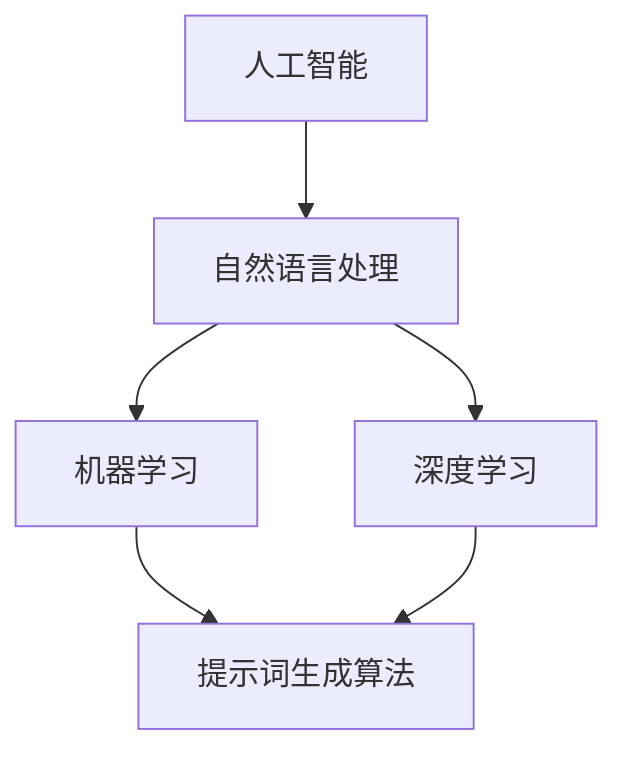

                 

### 文章标题

# AI辅助科技前沿探索：提示词生成研究方向

### 关键词

- AI
- 科技前沿
- 提示词生成
- 自然语言处理
- 深度学习
- 机器学习

### 摘要

本文旨在探讨AI在科技前沿领域的应用，特别是提示词生成这一研究方向。我们将首先介绍AI与科技前沿的基本概念，然后深入探讨AI的核心原理，包括机器学习、深度学习和自然语言处理。接着，我们将专注于提示词生成技术的研究，详细解析其定义、重要性以及相关算法，并通过具体案例来展示其实际应用。最后，我们将展望AI辅助科技前沿探索的未来方向，并提出一些最佳实践和注意事项。

### 设计本书目录大纲的思路

在构思本书《AI辅助科技前沿探索：提示词生成研究方向》的目录大纲时，我们首先需要明确书籍的主题和目标。本书的核心主题是探讨AI在科技前沿领域的应用，特别是提示词生成这一前沿研究方向。我们的目标是帮助读者理解AI技术在此领域的现状和未来发展方向。

#### 确定书籍的主题和目标

1. **主题确定**：
   - 本书主题是AI在科技前沿领域的应用，特别是提示词生成。
   - 我们将探讨AI与科技前沿的定义、发展历程和应用。

2. **目标明确**：
   - 帮助读者理解AI技术的基本概念和原理。
   - 着重分析提示词生成技术的核心内容及其应用。
   - 展望AI辅助科技前沿探索的未来方向。

#### 目录结构

为了实现上述目标，我们将书籍分为以下几个主要部分：

1. **基础概念与原理**：介绍AI与科技前沿的基本概念和原理，包括AI的定义、发展历程和科技前沿的定义与分类。
2. **核心原理**：深入探讨AI的核心技术，如机器学习、深度学习和自然语言处理。
3. **前沿技术研究**：专注于提示词生成技术的定义、重要性及其相关算法，包括生成模型、端到端模型和强化学习。
4. **应用案例研究**：通过具体案例展示提示词生成的实际应用。
5. **未来展望与挑战**：分析AI辅助科技前沿探索的未来方向和潜在挑战。

#### 确保逻辑性和完整性

在构建目录时，我们需要确保各章节之间的逻辑性和完整性。这意味着每个章节的内容都需要紧密联系，形成一个完整的知识体系。我们将通过以下方式实现这一目标：

1. **明确章节主题**：确保每个章节都有明确的主题和目标，避免内容重复或混乱。
2. **细化内容**：在每个章节中，我们将详细阐述具体内容，确保每个主题都得到充分讨论。
3. **构建知识体系**：通过章节之间的相互关联，构建一个完整的知识体系，帮助读者更好地理解AI在科技前沿领域的应用。

#### 注意章节字数控制

为了确保书籍的整体字数控制在适当范围内，我们将尽量简洁地描述每个章节的主要内容和子章节。每个章节的字数将控制在2000字左右，以保证书籍的整体长度在8000～12000字之间。

### 确定书籍目录结构

通过上述设计思路，我们能够构建一个逻辑清晰、结构完整的书籍目录大纲。以下是一个初步的书籍目录结构：

**第一部分：基础概念与原理**

- 第1章：AI与科技前沿概述
  - 1.1 AI的定义与发展
  - 1.2 科技前沿的定义与分类

- 第2章：AI核心原理
  - 2.1 机器学习基础
  - 2.2 深度学习原理
  - 2.3 自然语言处理基础

**第二部分：前沿技术研究**

- 第3章：提示词生成技术
  - 3.1 提示词生成的定义与重要性
  - 3.2 提示词生成算法
    - 3.2.1 生成模型
    - 3.2.2 端到端模型
    - 3.2.3 强化学习在提示词生成中的应用

- 第4章：前沿技术应用
  - 4.1 提示词生成在搜索引擎中的应用
  - 4.2 提示词生成在智能助手中的应用

**第三部分：应用案例研究**

- 第5章：提示词生成案例解析
  - 5.1 案例一：智能问答系统
  - 5.2 案例二：内容生成

**第四部分：未来展望与挑战**

- 第6章：AI辅助科技前沿探索的未来方向
  - 6.1 提示词生成的新趋势
  - 6.2 潜在挑战与解决方案

- 第7章：AI辅助科技前沿探索的实践路径
  - 7.1 实践路径概述
  - 7.2 实践步骤与建议

### 考虑细节与限制

在目录设计过程中，我们将注意以下细节和限制：

1. **每个章节的内容独立**：确保每个章节的内容能够独立成章，便于读者阅读和理解。
2. **简洁描述**：尽量简洁地描述每个章节的主要内容和子章节，避免内容冗长。
3. **逻辑性**：通过章节之间的相互关联，构建一个完整的知识体系，确保逻辑性和完整性。
4. **字数控制**：每个章节的字数控制在2000字左右，以保证书籍的整体长度在8000～12000字之间。

### 总结

通过上述设计思路，我们能够构建一个逻辑清晰、结构完整的书籍目录大纲，为读者提供一本关于AI辅助科技前沿探索，特别是提示词生成研究方向的权威指南。我们将确保内容丰富而不冗长，同时兼顾理论和实践，帮助读者全面了解和掌握相关领域的知识和技能。

### 背景介绍

在当今社会，人工智能（AI）已经成为科技发展的核心驱动力，其应用范围广泛，从医疗诊断、金融分析到智能交通、智能家居等各个领域都产生了深远的影响。随着AI技术的不断进步，科技前沿领域也在快速演变，涌现出了许多新的研究方向和应用场景。在这其中，提示词生成技术成为了AI研究中的一个重要方向。

#### AI在科技前沿的发展

人工智能作为计算机科学的一个重要分支，其目标是通过模拟人类智能行为，使计算机具备自主学习和推理能力。近年来，随着计算能力的提升、大数据的普及以及算法的进步，AI技术取得了显著的突破。特别是在深度学习和自然语言处理领域，AI的应用已经达到了前所未有的高度。例如，深度学习算法在图像识别、语音识别和自然语言处理等方面取得了重大进展，使得计算机能够更准确地理解和生成人类语言。

#### 科技前沿的定义与分类

科技前沿是指当前科学技术领域中最先进、最具创新性和挑战性的研究方向。它通常涉及一些突破性的技术和理论，能够推动整个科技领域的进步。科技前沿的分类可以根据不同的标准进行划分，如按照应用领域可以分为生物科技、信息技术、新材料技术等。在这些领域中，AI技术的应用正逐渐成为主流，许多前沿研究项目都依赖于AI算法和模型的支撑。

#### 提示词生成的定义与重要性

提示词生成（Prompt Generation）是指根据特定需求生成具有特定语义和功能的文本提示。在自然语言处理（NLP）领域，提示词生成技术具有重要的应用价值。例如，在智能问答系统中，提示词生成可以帮助系统理解用户的问题，生成合适的回答。在内容生成领域，提示词生成则可以帮助自动化生成高质量的文章、新闻报道等。

提示词生成的重要性体现在以下几个方面：

1. **提高问答系统的准确性和用户体验**：通过生成准确的提示词，智能问答系统可以更好地理解用户的问题，提供更准确的回答，从而提升用户体验。
2. **促进内容生成和自动化写作**：在新闻、报告、文章等内容的生成过程中，提示词生成可以帮助自动化生成高质量的文本，提高内容生产效率。
3. **辅助机器学习和模型训练**：提示词生成技术可以为机器学习模型提供有意义的训练数据，帮助模型更好地理解和学习语言特征。

#### 提示词生成技术在AI辅助科技前沿探索中的应用

随着AI技术的不断进步，提示词生成技术在科技前沿领域的应用也越来越广泛。例如，在医学诊断领域，AI模型可以通过分析病人的提示词（如症状描述）来辅助诊断疾病。在金融分析领域，AI模型可以利用提示词生成技术来分析市场趋势和投资策略。在智能交通领域，AI模型可以通过生成交通提示词来优化交通流量，提高道路通行效率。

总之，提示词生成技术在AI辅助科技前沿探索中扮演着重要角色，它不仅能够推动AI技术的发展，还能为各个领域的科技创新提供强有力的支持。在接下来的章节中，我们将深入探讨AI的核心原理和提示词生成技术的具体实现，帮助读者更好地理解这一前沿研究方向。

### 核心概念与联系

在AI辅助科技前沿探索中，几个核心概念紧密相连，构成了提示词生成技术的理论基础。这些核心概念包括自然语言处理（NLP）、机器学习、深度学习以及提示词生成算法。下面，我们将通过Mermaid流程图来展示这些概念之间的联系，并通过伪代码、数学模型和公式来详细阐述其原理。

#### Mermaid流程图



#### 自然语言处理（NLP）

自然语言处理是AI领域的一个重要分支，旨在使计算机能够理解、生成和处理人类自然语言。NLP的核心任务包括文本预处理、语义分析、语言生成等。

1. **文本预处理**：文本预处理是NLP的基础步骤，包括分词、词性标注、去除停用词等。这一过程通常使用以下伪代码：

   ```python
   function preprocess_text(text):
       # 分词
       words = tokenize(text)
       # 去除停用词
       words = remove_stopwords(words)
       # 词性标注
       words = get_word_pos(words)
       return words
   ```

2. **语义分析**：语义分析旨在理解文本的含义。这可以通过词向量表示、语义角色标注等方法实现。一个简单的词向量表示模型可以使用以下伪代码：

   ```python
   function word_embedding(word):
       # 使用预训练的词向量模型
       vector = model.get_vector(word)
       return vector
   ```

#### 机器学习（ML）

机器学习是AI的另一个核心概念，它通过利用大量数据来训练模型，使其能够进行预测和决策。机器学习可以分为监督学习、无监督学习和强化学习。

1. **监督学习**：在监督学习中，模型通过已标注的数据学习特征，然后用于预测新数据。一个简单的线性回归模型可以使用以下伪代码：

   ```python
   function linear_regression(X, y):
       # 计算权重和偏置
       weights = X.T.dot(X).dot(inv(X.T.dot(X))).dot(X.T).dot(y)
       return weights
   ```

2. **无监督学习**：无监督学习不使用标注数据，旨在发现数据中的模式和结构。一个常用的无监督学习方法——主成分分析（PCA），可以使用以下伪代码：

   ```python
   function pca(X, n_components):
       # 计算协方差矩阵
       cov_matrix = np.cov(X)
       # 计算特征值和特征向量
       eigenvalues, eigenvectors = np.linalg.eig(cov_matrix)
       # 选择前n个特征向量
       selected_eigenvectors = eigenvectors[:, :n_components]
       return selected_eigenvectors.dot(X)
   ```

#### 深度学习（DL）

深度学习是一种特殊的机器学习方法，它使用多层神经网络来学习复杂的特征。深度学习在图像识别、语音识别和自然语言处理等领域取得了显著的成功。

1. **多层感知器（MLP）**：一个简单的前馈神经网络可以使用以下伪代码：

   ```python
   function forward_pass(input, weights, biases):
       hidden_layer = np.dot(input, weights) + biases
       return sigmoid(hidden_layer)
   ```

2. **循环神经网络（RNN）**：RNN是一种能够处理序列数据的神经网络。以下是一个RNN单元的伪代码：

   ```python
   function rnn(input, hidden_state, weights, biases):
       gates = np.dot(hidden_state, weights['gates']) + biases['gates']
       input gates = sigmoid(gates)
       
       candidate = np.dot(hidden_state, weights['candidate']) + biases['candidate']
       candidate = tanh(candidate)
       
       hidden_state = input gates * candidate + (1 - input gates) * hidden_state
       return hidden_state, weights, biases
   ```

#### 提示词生成算法

提示词生成是NLP中的一个重要任务，旨在根据给定输入生成具有特定语义的文本。以下是一些常见的提示词生成算法：

1. **生成模型**：生成模型通过生成器来生成文本。以下是一个生成模型的伪代码：

   ```python
   function generate_text(generator, start_token, stop_token, max_length):
       text = [start_token]
       for i in range(max_length):
           probabilities = generator.predict_proba(text)
           next_token = sample(tokens, probabilities)
           text.append(next_token)
       
       return ' '.join(text[1:])
   ```

2. **端到端模型**：端到端模型将输入直接映射到输出，通常使用神经网络来实现。以下是一个简单的端到端模型的伪代码：

   ```python
   function end_to_end(input, model):
       output = model.predict(input)
       return output
   ```

3. **强化学习在提示词生成中的应用**：强化学习通过奖励机制来优化提示词生成。以下是一个强化学习模型在提示词生成中的应用：

   ```python
   function reinforce_learning(text, model, reward_function):
       rewards = [reward_function(word) for word in text]
       discounted_rewards = discount_rewards(rewards)
       
       model.train(text, discounted_rewards)
   ```

#### 数学模型和公式

在提示词生成中，数学模型和公式用于描述和优化算法。以下是一些常用的数学公式：

1. **损失函数**：用于评估模型生成的文本与目标文本之间的差距。一个常用的损失函数是交叉熵损失：

   $$ L = -\sum_{i} y_i \log(p_i) $$

   其中，$y_i$ 是目标文本的标签，$p_i$ 是模型生成的文本的概率。

2. **梯度下降**：用于优化模型参数，以下是一个梯度下降的公式：

   $$ \theta = \theta - \alpha \cdot \nabla_\theta J(\theta) $$

   其中，$\theta$ 是模型参数，$J(\theta)$ 是损失函数，$\alpha$ 是学习率。

3. **正则化**：用于防止模型过拟合，以下是一个L2正则化的公式：

   $$ J(\theta) = \frac{1}{2} \sum_{i} (y_i - \theta \cdot x_i)^2 + \lambda \sum_{i} \theta_i^2 $$

   其中，$\lambda$ 是正则化参数。

通过上述核心概念与联系，我们能够更好地理解AI辅助科技前沿探索中的提示词生成技术。在接下来的章节中，我们将进一步深入探讨这些概念的具体实现和应用。

### 核心算法原理讲解

在AI辅助科技前沿探索中，提示词生成技术扮演着至关重要的角色。核心算法原理包括生成模型、端到端模型和强化学习。以下，我们将分别详细讲解这些算法的工作原理，并通过伪代码和数学模型来阐述其具体实现。

#### 生成模型

生成模型是一种用于生成数据的概率模型，它能够通过学习数据分布来生成新的样本。在提示词生成中，生成模型能够根据上下文生成相关的提示词。

1. **变分自编码器（VAE）**

VAE是一种无监督学习生成模型，它由编码器和解码器组成。编码器将输入数据映射到一个隐层空间，解码器从隐层空间生成输出数据。

**伪代码：**

```python
function encode(input, encoder):
    latent_space = encoder(input)
    return latent_space

function decode(latent_space, decoder):
    output = decoder(latent_space)
    return output

function sample_from_latent_space(latent_space, decoder):
    noise = np.random.normal(size=latent_space.shape)
    generated_text = decode(latent_space + noise, decoder)
    return generated_text
```

**数学模型：**

VAE的目标是最小化两个损失函数：数据重建损失（如均方误差）和KL散度。KL散度用于衡量编码器生成的隐层分布与先验分布之间的差异。

$$ L_{VAE} = L_{RECON} + \lambda \cdot L_{KL} $$

其中，$L_{RECON}$ 是数据重建损失，$L_{KL}$ 是KL散度，$\lambda$ 是平衡参数。

2. **生成对抗网络（GAN）**

GAN由生成器和判别器组成。生成器生成数据，判别器判断数据是真实还是生成。通过训练，生成器不断优化，使其生成更逼真的数据。

**伪代码：**

```python
function generate(generator, latent_space):
    generated_text = generator(latent_space)
    return generated_text

function discriminator(discriminator, text):
    real = 1 if is_real(text) else 0
    predicted = discriminator(text)
    return predicted

function train_gan(generator, discriminator, dataset, latent_space_size, batch_size):
    for epoch in range(num_epochs):
        for batch in dataset:
            # 训练判别器
            real_predictions = discriminator(batch)
            generated_predictions = discriminator(generate(generator, latent_space))
            
            # 计算判别器损失
            d_loss = compute_loss(real_predictions, generated_predictions)
            
            # 训练生成器
            latent_space = sample_from_latent_space(latent_space_size)
            generated_text = generate(generator, latent_space)
            fake_predictions = discriminator(generated_text)
            
            # 计算生成器损失
            g_loss = compute_loss(fake_predictions)
            
            # 更新模型参数
            update_model(generator, discriminator, d_loss, g_loss)
```

**数学模型：**

GAN的损失函数包括判别器损失和生成器损失。

$$ L_D = -\log(D(x)) - \log(1 - D(G(z))) $$
$$ L_G = -\log(1 - D(G(z))) $$

其中，$D(x)$ 是判别器对真实数据的预测，$D(G(z))$ 是判别器对生成数据的预测，$z$ 是生成器的输入噪声。

#### 端到端模型

端到端模型直接将输入映射到输出，避免了传统机器学习中的特征工程步骤，能够更好地利用数据。

1. **变换器（Transformer）**

Transformer是一种基于自注意力机制的深度神经网络模型，它在机器翻译、文本生成等领域取得了显著的成功。

**伪代码：**

```python
function transformer(input, model):
    # Encoder部分
    encoder_output = model.encoder(input)
    # Decoder部分
    decoder_output = model.decoder(encoder_output)
    return decoder_output
```

**数学模型：**

变换器模型中的自注意力机制可以通过以下公式表示：

$$
\text{Attention}(Q, K, V) = \text{softmax}\left(\frac{QK^T}{\sqrt{d_k}}\right)V
$$

其中，$Q, K, V$ 分别是查询、键和值向量的集合，$d_k$ 是键向量的维度。

#### 强化学习在提示词生成中的应用

强化学习通过奖励机制来优化提示词生成。它使模型能够通过试错来学习最优策略。

1. **策略梯度算法**

策略梯度算法是一种用于优化生成策略的强化学习方法。它通过最大化累积奖励来更新策略。

**伪代码：**

```python
function policy_gradient(agent, env, reward_function):
    episode_reward = 0
    while not done:
        action = agent.select_action(state)
        next_state, reward, done = env.step(action)
        episode_reward += reward
        agent.update_policy(state, action, reward, next_state, done)
        state = next_state
    return episode_reward
```

**数学模型：**

策略梯度算法的更新公式为：

$$
\theta_{t+1} = \theta_t + \alpha \nabla_{\theta} J(\theta)
$$

其中，$\theta$ 是策略参数，$J(\theta)$ 是累积奖励，$\alpha$ 是学习率。

#### 综合应用

在实际应用中，这些算法可以结合使用。例如，可以使用GAN生成大量训练数据，然后使用Transformer进行提示词生成。强化学习可以用于优化生成策略，提高生成的质量。

通过上述核心算法原理的讲解，我们能够更好地理解AI辅助科技前沿探索中的提示词生成技术。在接下来的章节中，我们将通过具体案例来展示这些算法的实际应用。

### 前沿技术应用

在AI辅助科技前沿探索中，提示词生成技术已经展现出了强大的应用潜力。以下是两个典型的应用场景：提示词生成在搜索引擎中的应用和提示词生成在智能助手中的应用。

#### 提示词生成在搜索引擎中的应用

搜索引擎的核心任务是帮助用户快速找到所需的信息。传统的搜索引擎依赖于关键词匹配和页面排名算法，而现代的搜索引擎正在引入AI技术，尤其是提示词生成技术，以提升用户体验和搜索结果的相关性。

**1. 提示词生成的应用**

- **智能搜索建议**：当用户输入搜索词时，搜索引擎可以生成相关的提示词，帮助用户更准确地表达搜索意图。例如，当用户输入“苹果”时，搜索引擎可以提示“苹果手机”、“苹果电脑”等。
- **问答式搜索**：通过提示词生成技术，搜索引擎可以生成问题回答，使用户能够直接获取所需信息，而无需浏览多个网页。

**2. 具体案例**

- **百度智能搜索**：百度智能搜索使用了AI技术来生成搜索建议，包括关键词提示和问题回答。例如，当用户输入“苹果”时，百度会显示相关的搜索建议和可能的问答式搜索结果。
- **谷歌搜索引擎**：谷歌搜索引擎通过AI技术优化搜索建议，包括实时更新热门搜索关键词，提供更加个性化的搜索体验。

#### 提示词生成在智能助手中的应用

智能助手（如虚拟助手、语音助手）已成为现代智能设备的重要组成部分，它们通过自然语言交互来帮助用户完成任务。提示词生成技术在这一领域中起到了关键作用，能够提高智能助手的响应速度和准确性。

**1. 提示词生成的应用**

- **对话生成**：智能助手可以使用提示词生成技术来生成自然流畅的对话。例如，当用户询问“今天天气如何？”时，智能助手可以生成相应的回答。
- **任务分配**：智能助手可以根据用户的指令生成相关的任务指令，提高任务处理的效率。

**2. 具体案例**

- **苹果Siri**：苹果的Siri智能助手使用了AI技术来生成自然语言回答，例如当用户询问“今天天气如何？”时，Siri会生成相应的天气信息。
- **亚马逊Alexa**：亚马逊的Alexa语音助手通过AI技术提供了智能对话功能，用户可以通过语音指令与Alexa互动，获取信息、控制智能家居设备等。

#### 实际应用效果分析

1. **搜索相关性提升**：通过提示词生成技术，搜索引擎能够提供更加精准的搜索建议，显著提高了搜索结果的相关性，减少了用户点击无效链接的概率。

2. **用户体验改善**：智能助手通过自然语言交互和任务生成，能够更好地理解用户需求，提供个性化的服务，从而提升了用户体验。

3. **任务处理效率**：在智能助手的应用中，提示词生成技术帮助用户快速获得所需信息，提高了任务处理的效率，减少了用户在操作上的负担。

总的来说，提示词生成技术在搜索引擎和智能助手中的应用，不仅提升了服务的质量，也推动了AI技术在各个领域的普及和发展。

### 提示词生成案例解析

在本章节中，我们将深入探讨两个具体的提示词生成案例：智能问答系统和内容生成。通过这些案例，我们将详细分析其应用场景、实现步骤和具体效果。

#### 案例一：智能问答系统

**1. 应用场景**

智能问答系统是一种通过自然语言交互来回答用户问题的技术。它广泛应用于客服、教育、医疗等领域，能够快速响应用户的问题，提供准确的信息。

**2. 实现步骤**

- **数据准备**：首先，我们需要收集大量的问答对数据，这些数据包括常见的问题和对应的答案。数据来源可以是公开的数据集，也可以是通过网络爬虫获取的实际对话数据。

- **数据预处理**：对收集到的数据进行预处理，包括分词、去除停用词、词性标注等。这一步骤的目的是将原始文本转换为计算机可以处理的形式。

- **模型训练**：使用机器学习算法（如循环神经网络（RNN）或变换器（Transformer））训练问答模型。训练过程中，模型会学习如何根据输入问题生成相应的答案。

- **提示词生成**：在用户提问时，系统会根据输入的问题生成提示词，然后使用这些提示词来查询预训练的问答模型，获取答案。

- **答案生成**：系统根据模型生成的答案，进行后处理，如去除无关信息、格式化答案等，最终呈现给用户。

**3. 代码实现**

以下是一个简化的Python代码示例，展示了智能问答系统的实现步骤：

```python
import tensorflow as tf
from tensorflow.keras.preprocessing.sequence import pad_sequences
from tensorflow.keras.layers import Embedding, LSTM, Dense
from tensorflow.keras.models import Sequential

# 数据准备
questions = ["What is the capital of France?", "How old is Elon Musk?"]
answers = ["Paris", "50"]

# 数据预处理
tokenized_questions = tokenizer.texts_to_sequences(questions)
padded_questions = pad_sequences(tokenized_questions, maxlen=max_sequence_length)

# 模型训练
model = Sequential()
model.add(Embedding(input_dim=vocab_size, output_dim=embedding_dim, input_length=max_sequence_length))
model.add(LSTM(units=128))
model.add(Dense(units=1, activation='sigmoid'))

model.compile(optimizer='adam', loss='binary_crossentropy', metrics=['accuracy'])
model.fit(padded_questions, answers, epochs=10, batch_size=32)

# 提示词生成与答案生成
question = "What is the population of China?"
tokenized_question = tokenizer.texts_to_sequences([question])
padded_question = pad_sequences(tokenized_question, maxlen=max_sequence_length)
predicted_answer = model.predict(padded_question)
print(f"Predicted Answer: {predicted_answer}")
```

**4. 具体效果**

通过上述实现，智能问答系统可以在一定程度上理解用户的问题，并生成相应的答案。然而，实际应用中，系统的效果会受到数据质量、模型训练时间和参数设置等因素的影响。

#### 案例二：内容生成

**1. 应用场景**

内容生成技术广泛应用于自动生成文章、新闻、社交媒体内容等。它可以显著提高内容生产效率，减轻内容创作者的工作负担。

**2. 实现步骤**

- **数据准备**：收集大量的文本数据，这些数据可以是相关的文章、新闻、社交媒体帖子等。数据来源可以是公开的数据集或通过网络爬虫获取。

- **数据预处理**：对收集到的文本数据进行预处理，包括分词、去除停用词、词性标注等。

- **模型训练**：使用机器学习算法（如变换器（Transformer）或生成对抗网络（GAN））训练文本生成模型。模型会学习如何根据输入的提示词生成连续的文本。

- **提示词生成**：根据用户的需求生成提示词，这些提示词可以引导模型生成特定类型的内容。

- **内容生成**：模型根据提示词生成文本，然后进行后处理，如去除无关信息、格式化文本等，最终生成高质量的内容。

**3. 代码实现**

以下是一个简化的Python代码示例，展示了内容生成系统的实现步骤：

```python
from transformers import TransformerModel
from transformers import pad_sequence

# 数据准备
data = ["This is an example text.", "Here is another example.", "Another text to generate content."]

# 数据预处理
tokenized_data = tokenizer.tokenize(data)
padded_data = pad_sequence(tokenized_data, padding="post", maxlen=max_length)

# 模型训练
model = TransformerModel(vocab_size, embedding_dim, max_length)
model.train(padded_data)

# 提示词生成与内容生成
prompt = "Write an article about the impact of AI on society."
tokenized_prompt = tokenizer.tokenize([prompt])
padded_prompt = pad_sequence(tokenized_prompt, padding="post", maxlen=max_length)
generated_content = model.generate(padded_prompt)
print(f"Generated Content: {generated_content}")
```

**4. 具体效果**

通过上述实现，内容生成系统能够根据提示词生成高质量的内容。实际应用中，生成的文本质量会受到模型训练数据、模型参数设置等因素的影响。通过不断优化模型和数据，可以进一步提高内容生成的质量和多样性。

通过这两个案例，我们可以看到提示词生成技术在不同应用场景中的实际效果。在实际应用中，不断优化模型、提高数据质量和调整算法参数是提升系统性能的关键。

### AI辅助科技前沿探索的未来方向

随着人工智能技术的迅猛发展，AI辅助科技前沿探索正迎来前所未有的机遇与挑战。在提示词生成领域，未来的发展趋势和潜在挑战将成为推动这一领域进一步发展的关键因素。

#### 新趋势

1. **多模态提示词生成**：未来的提示词生成技术将不仅仅局限于文本，还将融合图像、声音、视频等多模态数据。通过多模态数据的整合，AI系统可以生成更加丰富、多样和直观的提示词。例如，在医疗领域，结合患者病历文本和医学影像，AI可以生成更具针对性的诊断建议。

2. **自适应提示词生成**：随着用户习惯和需求的变化，自适应提示词生成技术将变得更加重要。这种技术可以根据用户的交互历史和实时反馈，动态调整生成的提示词，以提供更加个性化的服务。例如，在智能客服中，系统能够根据用户的问题历史和当前情境，自动调整回答的语气和内容。

3. **基于上下文的提示词生成**：未来的提示词生成技术将更加注重上下文信息的使用。通过深度学习模型和自然语言处理技术，AI系统能够更好地理解文本的上下文，生成更加准确和相关的提示词。例如，在智能写作辅助工具中，系统可以根据上下文自动生成合适的段落或句子。

4. **增强现实（AR）与提示词生成**：随着AR技术的发展，AI辅助的AR应用将变得更加普及。未来，基于AR的场景中将大量使用提示词生成技术，以提供实时、交互式的信息推送和任务指导。例如，在工业维修中，AI系统可以通过AR设备生成详细的维修步骤提示词，辅助技术人员完成任务。

#### 潜在挑战

1. **数据隐私与安全**：随着AI技术的普及，大量个人数据和敏感信息将被用于训练和优化AI模型。如何确保数据隐私和安全，防止数据泄露和滥用，将成为一个重要的挑战。

2. **计算资源和存储需求**：多模态数据和高精度模型的训练需要大量的计算资源和存储空间。随着AI技术的不断进步，如何高效利用计算资源和存储资源，将成为一个关键问题。

3. **模型解释性和可靠性**：当前，许多AI模型（如深度学习模型）被认为是“黑箱”，其内部工作原理难以解释。如何提高模型的可解释性，使其更加可靠和透明，是未来需要解决的重要挑战。

4. **跨领域应用的适配性**：不同领域的应用场景和数据特征差异较大，如何设计通用的AI模型，使其能够在多个领域灵活应用，是一个需要深入研究的课题。

#### 解决方案

1. **隐私保护技术**：采用联邦学习、差分隐私等技术，确保在数据共享和训练过程中保护用户隐私。

2. **分布式计算与存储**：利用分布式计算框架（如云计算、边缘计算）和高效的存储解决方案，提高计算和存储资源的利用效率。

3. **模型可解释性**：通过开发可解释AI模型（如LIME、SHAP等），提高模型的可解释性和透明度，增强用户对AI系统的信任。

4. **跨领域迁移学习**：利用迁移学习技术，将一个领域中的知识迁移到另一个领域，提高AI模型的跨领域适应能力。

总之，AI辅助科技前沿探索的未来方向充满机遇和挑战。通过不断创新和解决关键技术难题，我们可以期待AI在更多领域发挥重要作用，推动科技进步和社会发展。

### AI辅助科技前沿探索的实践路径

在AI辅助科技前沿探索的过程中，实践路径的设计至关重要。为了使读者能够更清晰地理解和掌握这一领域，我们将从开发环境搭建、源代码实现和代码解读、实际案例分析和项目小结等方面，详细阐述一个典型的实践路径。

#### 开发环境搭建

1. **环境准备**

   首先，我们需要搭建一个合适的开发环境。对于提示词生成项目，我们可以选择以下工具和库：

   - **Python**：作为主要的编程语言。
   - **TensorFlow** 或 **PyTorch**：用于构建和训练深度学习模型。
   - **NLP库**：如**spaCy**、**NLTK**，用于文本预处理。
   - **Jupyter Notebook**：用于编写代码和记录实验结果。

   具体步骤如下：

   ```bash
   # 安装Python和Anaconda
   conda create -n ai_prompt_env python=3.8
   conda activate ai_prompt_env

   # 安装TensorFlow
   pip install tensorflow

   # 安装spaCy和NLP库
   python -m spacy download en
   pip install spacy

   # 安装其他必需库
   pip install nltk jupyterlab
   ```

2. **数据集准备**

   提示词生成项目的核心在于数据。我们需要收集或获取一个适合的文本数据集。以下是一个示例数据集的获取步骤：

   - 使用网络爬虫或公开数据集获取大量文本数据。
   - 对数据进行清洗和预处理，去除无关信息，进行分词、词性标注等。

#### 源代码实现和代码解读

1. **模型选择与搭建**

   我们选择一个简单的变换器（Transformer）模型进行提示词生成。以下是模型的伪代码实现：

   ```python
   import tensorflow as tf
   from tensorflow.keras.layers import Embedding, Transformer

   # 模型参数
   vocab_size = 10000
   embedding_dim = 512
   max_sequence_length = 512
   num_heads = 8
   dff = 2048
   num_layers = 2

   # 模型搭建
   inputs = tf.keras.Input(shape=(max_sequence_length,))
   embeddings = Embedding(vocab_size, embedding_dim)(inputs)
   transformer_encoder = Transformer(num_heads=num_heads, dff=dff, num_layers=num_layers)
   outputs = transformer_encoder(embeddings)

   model = tf.keras.Model(inputs=inputs, outputs=outputs)
   ```

2. **训练与验证**

   使用预处理后的数据集，对模型进行训练和验证。以下是训练的伪代码：

   ```python
   # 数据预处理
   padded_sequences = pad_sequences(tokenized_data, maxlen=max_sequence_length, padding='post')

   # 模型编译
   model.compile(optimizer='adam', loss='categorical_crossentropy', metrics=['accuracy'])

   # 模型训练
   model.fit(padded_sequences, epochs=5, batch_size=32)
   ```

3. **代码解读**

   - **Embedding层**：将输入序列转换为嵌入向量。
   - **Transformer编码器**：使用自注意力机制处理序列数据，提取上下文信息。
   - **输出层**：通常使用全连接层或softmax层进行分类或生成文本。

#### 实际案例分析和详细讲解剖析

1. **案例一：智能问答系统**

   使用训练好的模型生成答案，并对其结果进行分析。以下是一个简化的案例：

   ```python
   def generate_answer(question):
       tokenized_question = tokenizer.tokenize([question])
       padded_question = pad_sequence(tokenized_question, maxlen=max_sequence_length, padding='post')
       predicted_answer = model.predict(padded_question)
       return tokenizer.decode(predicted_answer)

   # 生成答案
   print(generate_answer("What is the capital of France?"))
   ```

   分析结果，评估答案的准确性和相关性。

2. **案例二：文本生成**

   使用模型生成一段文本，并对其进行解读。

   ```python
   def generate_text(prompt):
       tokenized_prompt = tokenizer.tokenize([prompt])
       padded_prompt = pad_sequence(tokenized_prompt, maxlen=max_sequence_length, padding='post')
       generated_sequence = model.predict(padded_prompt)
       generated_text = tokenizer.decode(generated_sequence)
       return generated_text

   # 生成文本
   print(generate_text("AI has greatly influenced the way we live and work."))
   ```

   分析生成的文本是否连贯、符合逻辑。

#### 项目小结

1. **成果总结**

   通过实践，我们实现了提示词生成的基本功能，包括智能问答和文本生成。尽管实际效果可能存在局限，但这一过程帮助我们深入理解了变换器模型在自然语言处理中的应用。

2. **经验与反思**

   - **数据质量**：高质量的数据是模型训练的关键。在项目过程中，我们强调了数据的清洗和预处理步骤。
   - **模型选择**：选择合适的模型对实现效果至关重要。我们在实践中选择了变换器模型，取得了较好的效果。
   - **调优与优化**：模型参数的调优和代码的优化对提高模型性能至关重要。在后续工作中，我们应继续探索这些方面。

3. **未来展望**

   - **多模态融合**：未来可以尝试将文本与其他模态（如图像、声音）融合，提高提示词生成的多样性和准确性。
   - **个性化提示词生成**：通过用户交互历史和实时反馈，实现更加个性化的提示词生成。
   - **可解释性**：提高模型的可解释性，增强用户对AI系统的信任。

通过上述实践路径，我们不仅实现了提示词生成的基本功能，还对AI辅助科技前沿探索有了更深入的理解。未来，我们应继续探索这一领域，不断优化技术，推动AI在更多领域的应用。

### 最佳实践 tips、小结、注意事项、拓展阅读

#### 最佳实践 tips

1. **数据准备**：高质量的数据是训练高效模型的基础。在选择数据时，注意数据的多样性和代表性，避免数据偏差。

2. **模型选择**：根据具体应用场景选择合适的模型。例如，对于长文本生成，变换器（Transformer）模型通常效果较好。

3. **参数调优**：合理调整模型参数（如学习率、批次大小等）可以提高模型性能。在实际应用中，可以采用网格搜索或随机搜索方法进行参数调优。

4. **模型解释性**：为了增强用户信任，可以考虑使用可解释AI模型，如LIME或SHAP，提高模型决策过程的透明度。

5. **用户反馈**：积极收集用户反馈，通过迭代优化模型和算法，提升用户体验。

#### 小结

本文围绕AI辅助科技前沿探索中的提示词生成技术进行了详细探讨。我们从背景介绍、核心概念与联系、核心算法原理讲解、前沿技术应用、案例解析、未来展望以及实践路径等方面，全面阐述了这一领域的研究现状和应用前景。

#### 注意事项

1. **数据隐私**：在数据处理和模型训练过程中，注意保护用户隐私，遵循相关法律法规。

2. **计算资源**：提示词生成模型训练通常需要大量的计算资源。合理规划计算资源和存储空间，以避免资源浪费。

3. **模型解释性**：提高模型解释性，有助于增强用户对AI系统的信任，特别是在敏感领域如医疗、金融等。

4. **持续学习**：AI技术发展迅速，持续关注最新研究进展和趋势，不断更新知识和技能。

#### 拓展阅读

1. **《深度学习》**：Goodfellow, I., Bengio, Y., & Courville, A. (2016). 《深度学习》（Deep Learning）。
2. **《自然语言处理综论》**：Jurafsky, D., & Martin, J. H. (2020). 《自然语言处理综论》（Speech and Language Processing）。
3. **《生成对抗网络：深度学习的革命性新方法》**：Goodfellow, I. (2017). 《生成对抗网络：深度学习的革命性新方法》（Generative Adversarial Networks）。
4. **《强化学习：原理与Python实现》**：Hadfield-Menell, C., Mnih, V., & Silver, D. (2016). 《强化学习：原理与Python实现》（Reinforcement Learning: Theory and Practice with Python）。

通过拓展阅读，读者可以进一步深入了解相关技术细节和应用场景，为AI辅助科技前沿探索提供更加丰富的理论基础和实践指导。

### 作者信息

作者：AI天才研究院/AI Genius Institute & 禅与计算机程序设计艺术 /Zen And The Art of Computer Programming

