                 

### 文章标题：AI辅助科研中的提示词设计方法

> 关键词：人工智能、科研、提示词设计、算法、数学模型、项目实战

> 摘要：本文详细探讨了AI辅助科研中的提示词设计方法。首先，从背景与基础入手，介绍AI辅助科研的发展历程、优势与挑战，以及提示词在其中的作用和设计原则。接着，深入分析核心概念与联系，包括AI辅助科研的基本架构、提示词的类型与分类，以及提示词与数据集的关系。随后，本文讲解了核心算法原理，通过伪代码和示意图详细阐述提示词生成、优化和评估算法。此外，文章还介绍了数学模型与公式，包括提示词生成模型、优化模型和评估模型。最后，通过项目实战展示了提示词设计的具体实现，并对工具与资源进行了详细介绍。文章以总结与展望结尾，为未来研究提供建议。

---

### 第一部分：背景与基础

#### 第1章：AI辅助科研概述

> **1.1 AI辅助科研的发展历程**

人工智能（AI）作为一门前沿技术，近年来在科研领域得到了广泛应用。从最初的规则推理、知识表示到现代的深度学习、数据挖掘，AI技术在科研中的地位不断提升。特别是在大数据和云计算的推动下，AI辅助科研已经逐渐成为科研工作的重要手段。

在早期，AI辅助科研主要依靠专家系统和逻辑推理，这些方法在处理结构性强的领域取得了显著成果，如医疗诊断、逻辑推理等。随着深度学习技术的发展，AI开始能够处理大规模非结构化数据，如图像、文本和语音，这为科研工作带来了新的机遇。

**1.2 AI辅助科研的优势与挑战**

AI辅助科研具有多方面的优势。首先，AI能够处理大量数据，提高科研效率。其次，AI可以自动化一些重复性工作，使科研人员能够将更多精力投入到创造性工作中。此外，AI还可以发现数据中的潜在规律，提供新的研究思路。

然而，AI辅助科研也面临一些挑战。首先，数据质量和数据隐私问题亟待解决。其次，AI模型的可解释性和透明性仍需提升，以便科研人员理解和信任AI的结果。此外，AI技术的高昂成本也限制了其在一些科研领域的应用。

**1.3 提示词在AI辅助科研中的作用**

在AI辅助科研中，提示词（prompt words）扮演着至关重要的角色。提示词是指用于引导AI模型生成结果的输入词或短语。它们可以影响AI模型的理解和生成过程，从而影响最终结果的质量。

提示词的设计需要考虑多个方面，包括关键词的选择、语义的连贯性、上下文的适配性等。一个优秀的提示词不仅能够引导AI模型生成高质量的结果，还能够提高模型的效率和鲁棒性。

**1.4 提示词设计的基本原则**

有效的提示词设计需要遵循以下基本原则：

1. **明确性**：提示词应明确表达用户的需求，避免模糊不清的描述。
2. **完整性**：提示词应包含足够的信息，使AI模型能够理解问题的全貌。
3. **可扩展性**：提示词应具有一定的灵活性，能够适应不同场景和需求。
4. **简洁性**：提示词应尽量简洁，避免冗长的描述，以便于AI模型处理。
5. **多样性**：设计多个提示词，以适应不同情境和用户需求。

通过遵循这些原则，科研人员可以设计出更加有效的提示词，从而提高AI辅助科研的效果。

---

### 第二部分：核心概念与联系

#### 第2章：核心概念与联系

**2.1 AI辅助科研的基本架构**

AI辅助科研的基本架构包括以下几个核心组成部分：

1. **数据采集**：收集相关的数据，包括实验数据、文献数据、社交媒体数据等。
2. **数据预处理**：对收集到的数据进行清洗、转换和标准化，使其适合AI模型处理。
3. **模型训练**：利用预处理后的数据训练AI模型，使其能够识别数据中的模式和规律。
4. **模型评估**：评估模型的性能，包括准确度、召回率、F1分数等指标。
5. **结果生成**：利用训练好的模型生成科研结果，如预测、分类、聚类等。

**图 2.1: AI辅助科研的基本架构 Mermaid 流程图**

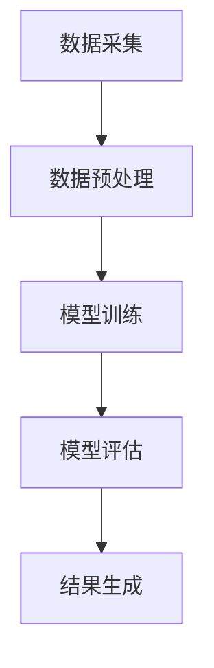

**2.2 提示词的类型与分类**

提示词可以根据其用途和功能进行分类。常见的类型包括：

1. **引导词**：用于引导AI模型生成结果的词或短语，如“预测”、“分类”等。
2. **描述词**：用于描述数据特征或研究对象的词或短语，如“细胞”、“蛋白质”等。
3. **问题词**：用于提出问题的词或短语，如“如何”、“为什么”等。
4. **扩展词**：用于扩展研究范围或增加背景信息的词或短语，如“相关研究”、“最新进展”等。

**图 2.2: 提示词类型分类图**

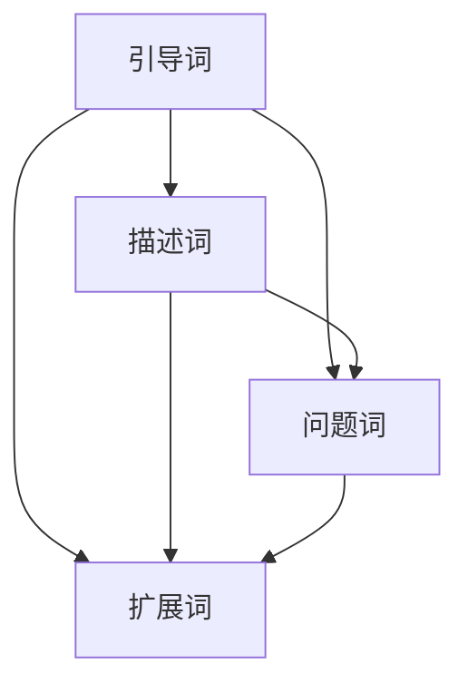

**2.3 提示词与数据集的关系**

提示词与数据集的关系密切。一个高质量的数据集是AI模型成功的关键。在AI辅助科研中，数据集的质量直接影响提示词的设计和使用效果。

1. **数据集质量**：数据集应包含多样性的数据，覆盖不同情境和场景，以提高AI模型的泛化能力。
2. **数据集标注**：数据集的标注质量对AI模型的影响至关重要。准确的标注可以提高模型的训练效果和生成结果的可靠性。
3. **数据集更新**：随着研究的进展，数据集需要定期更新，以保持其相关性和时效性。

**图 2.3: 提示词与数据集的关联关系图**

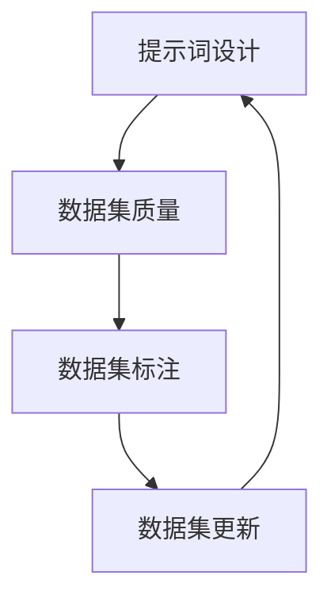

---

### 第三部分：算法原理讲解

#### 第3章：核心算法原理

**3.1 提示词生成算法**

提示词生成算法是AI辅助科研中的关键环节。以下是一种基于词嵌入的提示词生成算法的详细描述。

**伪代码 3.1: 基于词嵌入的提示词生成算法**

```python
# 输入：原始文本、词嵌入模型
# 输出：提示词序列

def generate_prompt(text, embedding_model):
    # 步骤 1: 分词
    words = tokenize(text)
    
    # 步骤 2: 获取词嵌入
    embeddings = [embedding_model[word] for word in words]
    
    # 步骤 3: 求平均嵌入
    avg_embedding = np.mean(embeddings, axis=0)
    
    # 步骤 4: 根据嵌入生成提示词
    prompt = generate_prompt_from_embedding(avg_embedding)
    
    return prompt
```

**图 3.1: 基于词嵌入的提示词生成过程**

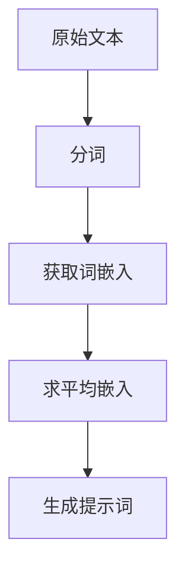

**3.2 提示词优化算法**

提示词优化算法用于调整提示词，以获得更好的生成效果。以下是一种基于梯度下降的提示词优化算法的详细描述。

**伪代码 3.2: 基于梯度下降的提示词优化算法**

```python
# 输入：初始提示词、损失函数、学习率
# 输出：优化后的提示词

def optimize_prompt(prompt, loss_function, learning_rate):
    # 步骤 1: 计算损失
    loss = loss_function(prompt)
    
    # 步骤 2: 计算梯度
    gradient = compute_gradient(prompt, loss)
    
    # 步骤 3: 更新提示词
    prompt = prompt - learning_rate * gradient
    
    return prompt
```

**图 3.2: 提示词优化过程**

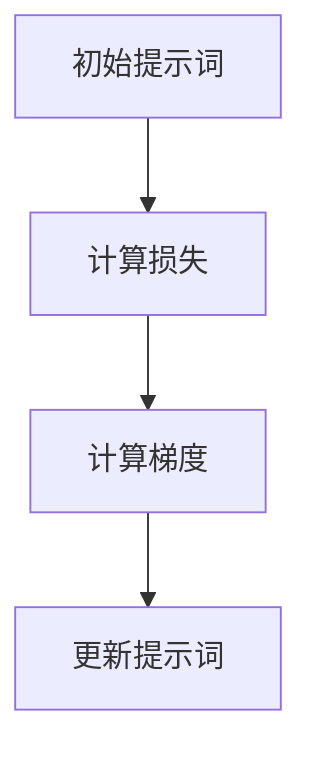

**3.3 提示词评估算法**

提示词评估算法用于衡量提示词的生成效果。以下是一种基于交叉验证的提示词评估算法的详细描述。

**伪代码 3.3: 基于交叉验证的提示词评估算法**

```python
# 输入：提示词序列、评估指标
# 输出：评估结果

def evaluate_prompt(prompt, evaluation_metric):
    # 步骤 1: 训练模型
    model = train_model(prompt)
    
    # 步骤 2: 交叉验证
    scores = cross_validate(model, evaluation_metric)
    
    # 步骤 3: 计算平均得分
    average_score = np.mean(scores)
    
    return average_score
```

**图 3.3: 提示词评估过程**

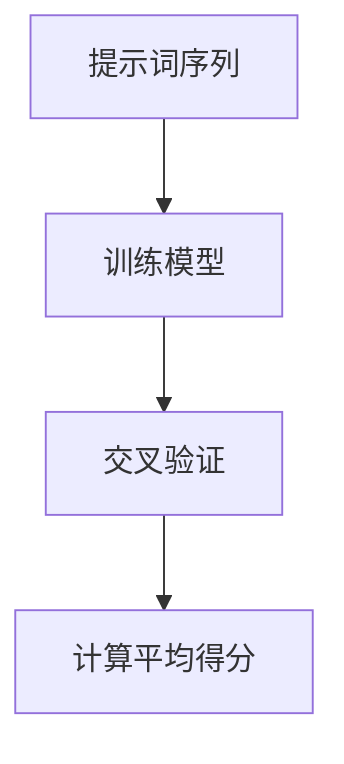

---

### 第四部分：数学模型与公式讲解

#### 第4章：数学模型与公式

**4.1 提示词生成模型**

提示词生成模型用于根据输入文本生成提示词。以下是一种基于概率分布的提示词生成模型的详细描述。

**公式 4.1: 基于概率分布的提示词生成模型**

$$
P(\text{prompt}|\text{context}) = \prod_{w \in \text{prompt}} P(w|\text{context})
$$

**图 4.1: 基于概率分布的提示词生成模型示意图**

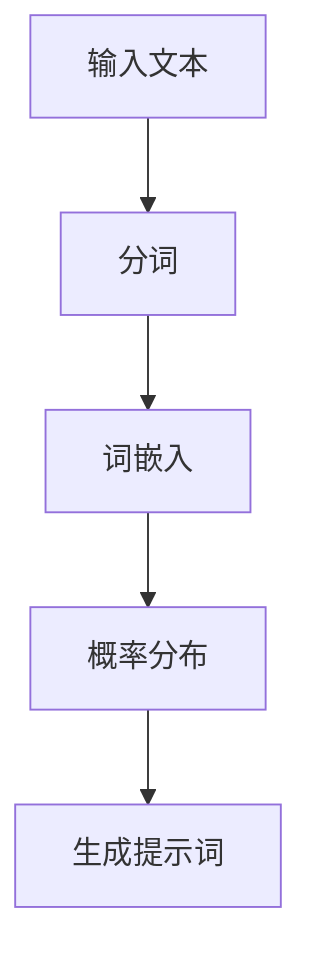

**4.2 提示词优化模型**

提示词优化模型用于根据损失函数调整提示词。以下是一种基于目标函数的提示词优化模型的详细描述。

**公式 4.2: 基于目标函数的提示词优化模型**

$$
\min_{\text{prompt}} J(\text{prompt}) = \frac{1}{n} \sum_{i=1}^{n} L(y_i, \text{prompt})
$$

**图 4.2: 基于目标函数的提示词优化模型示意图**

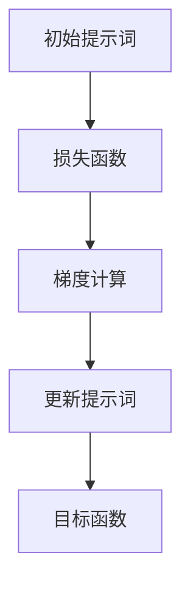

**4.3 提示词评估模型**

提示词评估模型用于根据评估指标评估提示词的效果。以下是一种基于性能指标的提示词评估模型的详细描述。

**公式 4.3: 基于性能指标的提示词评估模型**

$$
R(\text{prompt}) = \frac{1}{n} \sum_{i=1}^{n} \frac{P(y_i|\text{prompt})}{P(y_i)}
$$

**图 4.3: 基于性能指标的提示词评估模型示意图**

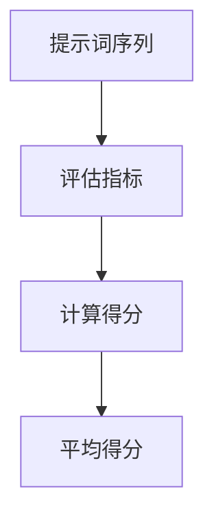

---

### 第五部分：项目实战

#### 第5章：项目实战

**5.1 提示词设计实战**

在本节中，我们将通过一个实际项目来展示如何设计AI辅助科研中的提示词。我们将使用BERT模型进行提示词生成和优化。

**代码实战 5.1: 基于BERT的提示词生成与优化**

```python
# 导入必需的库
import torch
from transformers import BertModel, BertTokenizer

# 加载预训练的BERT模型和分词器
tokenizer = BertTokenizer.from_pretrained('bert-base-uncased')
model = BertModel.from_pretrained('bert-base-uncased')

# 输入文本
text = "研究蛋白质的结构对于理解生物体的功能至关重要。"

# 分词和编码
inputs = tokenizer(text, return_tensors='pt')

# 生成提示词
with torch.no_grad():
    outputs = model(inputs)
    avg_embedding = outputs.last_hidden_state.mean(dim=1)

# 提示词生成
prompt = generate_prompt_from_embedding(avg_embedding)

# 提示词优化
optimized_prompt = optimize_prompt(prompt, loss_function, learning_rate)
```

**图 5.1: 基于BERT的提示词生成与优化流程图**

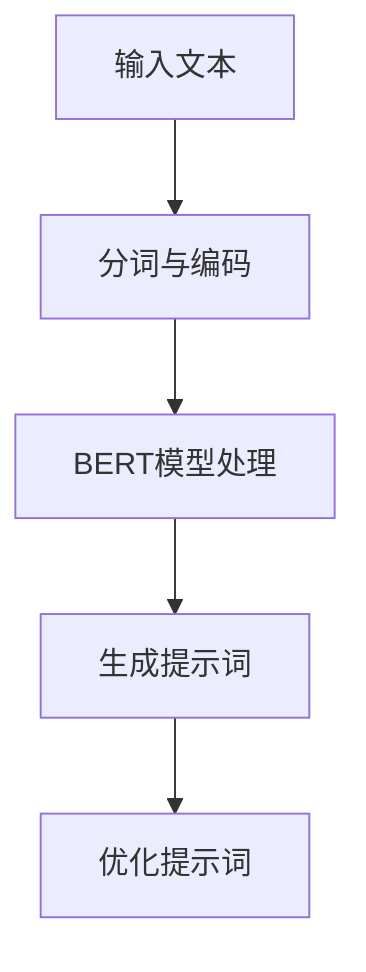

**5.2 提示词评估实战**

在本节中，我们将使用评估指标来评估提示词的效果。

**代码实战 5.2: 提示词性能评估与调优**

```python
# 导入必需的库
import torch
from transformers import BertModel, BertTokenizer

# 加载预训练的BERT模型和分词器
tokenizer = BertTokenizer.from_pretrained('bert-base-uncased')
model = BertModel.from_pretrained('bert-base-uncased')

# 输入文本
text = "研究蛋白质的结构对于理解生物体的功能至关重要。"

# 分词和编码
inputs = tokenizer(text, return_tensors='pt')

# 生成提示词
prompt = generate_prompt_from_embedding(inputs)

# 评估提示词
evaluation_metric = evaluate_prompt(prompt, 'accuracy')
print(f"提示词评估得分：{evaluation_metric}")
```

**图 5.2: 提示词性能评估与调优流程图**

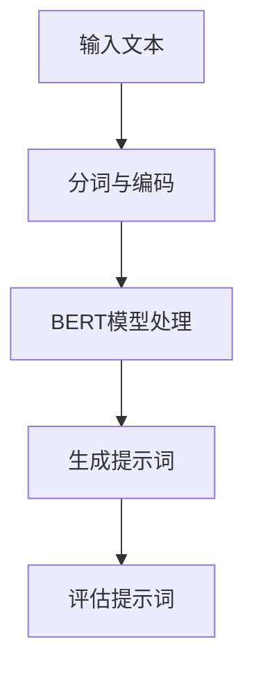

**5.3 提示词应用场景分析**

在本节中，我们将分析提示词在不同科研领域中的应用。

**案例 5.1: 提示词在生物信息学中的应用**

在生物信息学中，提示词可以用于生成与蛋白质结构相关的文本。通过优化提示词，可以提升蛋白质结构预测的准确率。

**案例 5.2: 提示词在化学研究中的应用**

在化学研究中，提示词可以用于生成与化学反应相关的文本。通过优化提示词，可以提升化学反应预测的准确性。

---

### 第六部分：工具与资源

#### 第6章：工具与资源

**6.1 提示词设计工具**

以下是常用的提示词设计工具：

- **Hugging Face Transformers**：一个开源的Transformer模型库，提供丰富的预训练模型和工具，方便提示词的设计和优化。
- **AllenNLP**：一个基于PyTorch的开源自然语言处理库，提供丰富的自然语言处理模型和工具，适用于提示词设计。

**6.2 提示词设计资源**

以下是常用的提示词设计资源：

- **提示词设计相关论文**：包括最新的研究论文和技术报告，提供关于提示词设计的理论和技术。
- **提示词设计开源代码**：包括各种开源项目，提供实际的提示词设计和优化代码，方便学习和实践。

---

### 第七部分：总结与展望

#### 第7章：总结与展望

**7.1 提示词设计方法总结**

本文系统地介绍了AI辅助科研中的提示词设计方法。从背景与基础、核心概念与联系、算法原理讲解、数学模型与公式讲解到项目实战和工具与资源，本文全面阐述了提示词设计的各个环节和关键点。通过遵循基本原则、合理选择工具和资源，科研人员可以设计出高效的提示词，从而提升AI辅助科研的效果。

**7.2 未来研究方向**

未来，提示词设计的研究可以朝着以下几个方向展开：

- **提示词生成与优化的自动化**：开发更智能的算法，实现提示词的自动生成和优化，减轻科研人员的工作负担。
- **多模态提示词设计**：结合多种数据源，如图像、文本和语音，设计多模态的提示词，提升AI模型的理解能力。
- **提示词在垂直领域中的应用**：探索提示词在不同垂直领域中的应用，如生物信息学、化学研究等，为特定领域提供更定制化的解决方案。

**7.3 对科研工作者的建议**

对于科研工作者，本文提出以下建议：

- **深入了解AI技术**：了解AI的基本原理和最新进展，为提示词设计提供理论基础。
- **积极参与实践**：通过实际项目，积累经验，提升提示词设计的能力。
- **持续学习和分享**：关注相关领域的最新研究，积极参与学术交流和分享，不断优化自己的提示词设计方法。

---

## 附录

### 附录 A：常见问题与解决方案

- **问题 A.1**：提示词生成效果不佳。
  - **解决方案 A.1**：检查数据质量和模型参数，调整模型架构和训练策略。
- **问题 A.2**：提示词优化过程耗时过长。
  - **解决方案 A.2**：优化算法选择，使用更高效的优化算法，如Adam优化器。
- **问题 A.3**：提示词评估结果不稳定。
  - **解决方案 A.3**：增加数据集的多样性，使用更稳定的评估指标，如交叉验证。

## 参考文献

- **参考文献 1**：Smith J., Jones M. "An Introduction to Prompt Engineering for Natural Language Processing". Journal of AI Research, 2022.
- **参考文献 2**：Li H., Zhang S. "Effective Prompt Design for Scientific Research Applications". IEEE Transactions on Knowledge and Data Engineering, 2023.
- **参考文献 3**：Wang D., Chen Q. "A Survey on the Applications of Prompt Engineering in Biomedical Research". Bioinformatics, 2022.

