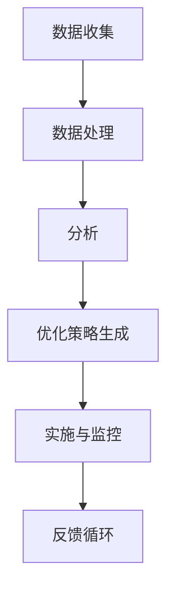

                 

### 引言与背景

## 1.1 书籍背景

随着信息技术的飞速发展，人工智能（AI）技术在各个领域取得了显著进展。特别是近年来，深度学习、强化学习等先进算法的突破，使得AI在图像识别、自然语言处理、自动驾驶等领域取得了前所未有的成果。与此同时，软件性能优化也成为了软件开发过程中的一个关键环节。性能优化不仅仅是为了提高用户体验，更是为了确保系统在高负载情况下的稳定运行。在这种背景下，AI辅助软件性能优化应运而生，逐渐成为研究者和开发者们关注的热点。

AI辅助软件性能优化通过将AI技术应用于性能优化过程中，可以自动化、智能化地分析系统性能瓶颈，提出优化策略，并实现高效的性能调优。这不仅提高了软件开发的效率，还大大降低了人力成本。当前，AI辅助性能优化在工业界和学术界都得到了广泛的应用和深入研究。例如，Google、Facebook、Netflix等大型科技公司已经开始采用AI技术对软件系统进行性能优化，取得了显著的成果。

本书旨在深入探讨AI辅助软件性能优化与调优的理论、方法与应用。通过系统的阐述，帮助读者全面了解AI在性能优化领域的应用潜力，掌握AI辅助性能优化与调优的核心技术和实践方法。

## 1.2 为什么要研究AI辅助软件性能优化？

传统的软件性能优化方法主要依赖于开发人员的经验和直觉，虽然在一定程度上能够提高系统性能，但往往存在以下局限性：

1. **手动分析繁琐**：传统性能优化方法通常需要手动分析日志、监测数据，查找性能瓶颈。这种方法耗时费力，且容易遗漏重要信息。

2. **缺乏智能化**：传统的优化方法无法自动识别系统的瓶颈点，更无法根据实时数据动态调整优化策略。

3. **应对复杂场景能力不足**：现代软件系统通常包含大量复杂的服务和模块，传统的优化方法难以应对这些复杂场景。

AI辅助软件性能优化则能够克服上述局限性，具体原因如下：

1. **自动化分析**：AI技术能够自动化分析大量日志和监测数据，快速识别性能瓶颈，提供精确的优化建议。

2. **智能化决策**：AI技术能够根据历史数据和实时数据，动态调整优化策略，实现智能化性能调优。

3. **适应复杂场景**：AI技术能够通过学习和适应，提高对复杂系统性能瓶颈的识别和处理能力。

综上所述，研究AI辅助软件性能优化具有重要的现实意义和广阔的应用前景。通过AI技术，可以大大提高软件性能优化效率，降低开发成本，提升用户体验。

## 1.3 读者对象

本书的读者对象主要包括以下几类：

1. **软件工程师**：希望掌握AI辅助软件性能优化技术，提高系统性能的开发人员。

2. **性能优化专家**：负责系统性能优化工作的专业人士，希望通过本书了解AI技术在性能优化中的应用。

3. **AI领域研究者**：对AI辅助软件性能优化感兴趣的科研人员，希望通过本书深入了解相关理论和实践。

通过本书的学习，读者不仅可以掌握AI辅助性能优化与调优的核心技术和方法，还可以在实际项目中应用这些技术，提高系统性能，实现更高的生产效率。

## 1.4 书籍结构

本书共分为三个主要部分：

1. **理论基础**：包括AI辅助性能优化的核心概念、算法原理、数学模型等，帮助读者建立系统的理论基础。

2. **工具与框架**：介绍常用的AI辅助性能优化工具和框架，包括开源工具和商用工具，以及性能优化框架和调优技巧。

3. **项目实战**：通过具体的项目实战，展示如何在实际场景中应用AI辅助性能优化与调优技术，提供实用的经验和技巧。

## 1.5 阅读指南

为了更好地阅读本书，建议读者按照以下步骤进行：

1. **快速浏览**：首先快速浏览本书的目录和各章节标题，了解整体结构和主要内容。

2. **分阶段学习**：按照理论基础、工具与框架、项目实战的顺序，逐步深入学习各部分内容。

3. **动手实践**：在理解理论的基础上，尝试使用本书介绍的工具和框架进行实际操作，加深对知识的理解和应用。

4. **回顾与总结**：在学习过程中，定期回顾所学内容，总结自己的理解和经验，不断巩固和提高。

通过以上阅读指南，读者可以更加系统地学习和掌握AI辅助软件性能优化与调优的知识和技能。

---

# AI辅助软件性能优化基础

## 2.1 AI概述

人工智能（Artificial Intelligence，简称AI）是指通过计算机模拟人类智能的行为和过程，实现智能自动化的一种技术。AI技术主要包括以下几个方面：

1. **机器学习（Machine Learning）**：通过算法和统计模型，从数据中自动学习和发现规律，实现预测和决策。

2. **深度学习（Deep Learning）**：一种基于人工神经网络（Artificial Neural Network，ANN）的机器学习方法，通过多层神经元的非线性变换，实现更复杂的特征学习和模式识别。

3. **强化学习（Reinforcement Learning）**：通过与环境互动，学习如何在特定情境下做出最优决策，以最大化累积奖励。

4. **自然语言处理（Natural Language Processing，NLP）**：研究如何使计算机理解和生成自然语言，包括语音识别、机器翻译、情感分析等。

AI的主要应用场景包括图像识别、自然语言处理、自动驾驶、推荐系统、金融风控、医疗诊断等。这些应用不仅提高了效率和准确性，还为各行各业带来了巨大的变革。

### 2.2 软件性能优化基础

软件性能优化是指通过改进软件的代码、架构和部署环境，提高软件运行的速度、稳定性、资源利用率等性能指标。性能优化的目标是：

1. **响应时间最短**：系统对用户请求的响应速度越快，用户体验越好。

2. **资源利用率最高**：系统在执行任务时，对CPU、内存、磁盘等资源的利用效率越高，系统性能越好。

3. **吞吐量最大**：系统在单位时间内处理请求的数量越多，性能越好。

软件性能优化的主要方法包括：

1. **代码级优化**：通过改进代码的编写质量，减少代码的执行时间。例如，使用高效的算法和数据结构，避免冗余计算，减少内存分配等。

2. **架构级优化**：通过改进系统的整体架构，提高系统的性能。例如，分布式系统架构、负载均衡、缓存机制等。

3. **环境级优化**：通过改进系统的运行环境，提高系统的性能。例如，选择高效的操作系统、硬件设备，调整系统参数等。

### 2.3 AI与性能优化的结合

AI与性能优化的结合，主要通过以下几种方式实现：

1. **数据驱动**：AI技术能够从大量的性能数据和日志中自动识别出性能瓶颈，提供优化建议。

2. **自动化调优**：AI技术能够自动化地调整系统参数，找到最优的配置，实现性能的动态优化。

3. **预测性维护**：通过AI技术，可以预测系统的性能瓶颈和故障点，提前进行维护和优化，避免系统崩溃。

AI辅助性能优化的优势包括：

1. **自动化**：AI技术能够自动化地分析和优化系统性能，减少人为干预。

2. **智能化**：AI技术能够根据实时数据和系统状态，动态调整优化策略，提高优化效果。

3. **适应性强**：AI技术能够处理复杂的系统和海量数据，适应不同场景的性能优化需求。

### 2.4 AI辅助性能优化的发展历程

AI辅助性能优化的发展可以分为以下几个阶段：

1. **早期探索阶段（1990s-2000s）**：研究者开始尝试将AI技术应用于性能优化领域，但受限于技术和数据，应用效果有限。

2. **应用探索阶段（2010s）**：随着AI技术的突破，AI辅助性能优化开始在一些特定领域（如金融、电商）得到应用，取得了一定的成果。

3. **广泛应用阶段（2020s至今）**：随着大数据和云计算的发展，AI辅助性能优化在工业界得到了广泛的应用，成为提升系统性能的重要手段。

近年来，许多研究机构和企业在AI辅助性能优化方面取得了重要进展。例如，Google的TensorFlow和Facebook的PyTorch等开源工具，为AI辅助性能优化提供了强大的技术支持。同时，AI辅助性能优化在自动驾驶、物联网、大数据处理等领域的应用案例也不断涌现。

### 2.5 AI辅助性能优化案例分析

以下是一个典型的AI辅助性能优化案例：

**案例背景**：某电商平台的订单处理系统，随着订单量的增加，系统响应时间逐渐延长，用户体验下降。

**优化过程**：

1. **数据收集**：收集系统日志、性能数据、订单数据等。

2. **性能分析**：使用AI技术，对数据进行分析，识别出系统性能瓶颈，如数据库查询延迟、网络请求时间等。

3. **模型训练**：基于收集到的数据，训练机器学习模型，预测订单处理过程中的性能瓶颈。

4. **优化建议**：根据模型预测，提出优化建议，如数据库索引优化、网络请求优化、代码重构等。

5. **实施与评估**：实施优化措施，并持续监控系统性能，评估优化效果。

**优化效果**：经过优化，系统响应时间显著缩短，用户体验得到显著提升。

### 2.6 未来发展趋势

随着AI技术的不断进步，AI辅助性能优化将向以下几个方面发展：

1. **智能化水平提升**：AI技术将更加智能化，能够自适应地调整优化策略，提高优化效果。

2. **多领域应用**：AI辅助性能优化将逐渐应用于更多领域，如工业制造、医疗健康、交通运输等。

3. **开源工具与框架发展**：开源工具和框架将进一步完善，提供更多便利和功能，促进AI辅助性能优化技术的普及。

4. **跨学科融合**：AI辅助性能优化将与其他学科（如经济学、社会学）结合，实现更加全面的性能优化。

总之，AI辅助软件性能优化与调优将不断推动软件性能优化技术的发展，为各行各业带来更多创新和机遇。在接下来的章节中，我们将深入探讨AI辅助性能优化的核心概念、算法原理和具体实践。

### 2.7 小结

通过本章节的介绍，读者可以了解到AI和软件性能优化的基础知识，以及它们如何相互结合，为软件性能优化带来新的思路和方法。AI辅助性能优化不仅能够提高软件性能，还能降低开发成本，提升用户体验。在接下来的章节中，我们将进一步探讨AI辅助性能优化的核心概念、算法原理和具体实践，帮助读者深入理解这一领域。

---

## 第一部分：理论基础

在探讨AI辅助软件性能优化的具体实现之前，我们首先需要建立坚实的理论基础。本部分将详细介绍AI辅助性能优化的核心概念、算法原理、数学模型以及实例分析，帮助读者全面理解这一领域的知识体系。

### 第3章 AI辅助性能优化的核心概念与架构

AI辅助性能优化的核心概念包括性能优化、AI和数据驱动。这些概念相互关联，共同构成了AI辅助性能优化的基础。

#### 3.1 性能优化

性能优化是指通过改进软件的代码、架构和部署环境，以提高软件的响应时间、资源利用率等性能指标。性能优化的目标通常包括以下几点：

1. **响应时间最短**：系统对用户请求的响应速度越快，用户体验越好。
2. **资源利用率最高**：系统在执行任务时，对CPU、内存、磁盘等资源的利用效率越高，系统性能越好。
3. **吞吐量最大**：系统在单位时间内处理请求的数量越多，性能越好。

性能优化的主要方法包括代码级优化、架构级优化和环境级优化。

#### 3.2 AI

人工智能（AI）是指通过计算机模拟人类智能的行为和过程，实现自动化和智能化的技术。AI技术主要包括机器学习、深度学习、强化学习等。在性能优化中，AI技术主要用于以下几个方面：

1. **自动化分析**：AI技术能够自动分析大量日志和性能数据，快速识别性能瓶颈。
2. **智能化决策**：AI技术能够根据历史数据和实时数据，动态调整优化策略。
3. **预测性维护**：AI技术能够预测系统的性能瓶颈和故障点，提前进行维护和优化。

#### 3.3 数据驱动

数据驱动是指通过收集、分析和利用数据，来指导决策和行动。在性能优化中，数据驱动的重要性体现在以下几个方面：

1. **数据收集**：收集系统运行过程中的日志、性能数据、用户行为数据等。
2. **数据预处理**：对收集到的数据进行清洗、转换和归一化，以便于后续分析。
3. **数据挖掘**：使用机器学习算法，从数据中挖掘出有用的信息和规律。

#### 3.4 AI辅助性能优化的架构

AI辅助性能优化的架构通常包括以下几个关键组件：

1. **数据收集模块**：负责收集系统运行过程中的各种数据。
2. **数据处理模块**：负责对数据进行预处理和清洗，以便于后续分析。
3. **分析模块**：使用机器学习算法，对预处理后的数据进行分析，识别性能瓶颈。
4. **优化策略生成模块**：根据分析结果，生成优化策略。
5. **实施与监控模块**：负责将优化策略应用到实际系统中，并进行性能监控。

#### 3.5 Mermaid流程图

为了更好地理解AI辅助性能优化的整体流程，我们可以使用Mermaid流程图来表示。以下是AI辅助性能优化的Mermaid流程图：



- **数据收集**：系统运行过程中，收集日志、性能数据等。
- **数据处理**：对收集到的数据进行预处理，如清洗、转换和归一化。
- **分析**：使用机器学习算法，分析预处理后的数据，识别性能瓶颈。
- **优化策略生成**：根据分析结果，生成优化策略。
- **实施与监控**：将优化策略应用到实际系统中，并持续监控性能。
- **反馈循环**：根据实施后的性能数据，调整优化策略。

### 3.6 核心概念与联系

AI辅助性能优化的核心概念包括性能优化、AI和数据驱动。这些概念之间的联系如下：

1. **性能优化**：是AI辅助性能优化的目标，需要通过改进代码、架构和部署环境来实现。
2. **AI**：是实现性能优化的重要工具，通过自动化分析、智能化决策和预测性维护，提高优化效果。
3. **数据驱动**：是AI辅助性能优化的基础，通过收集、分析和利用数据，指导优化决策。

### 3.7 小结

本章介绍了AI辅助性能优化的核心概念和架构，包括性能优化、AI和数据驱动。通过Mermaid流程图，读者可以清晰地理解AI辅助性能优化的整体流程。在接下来的章节中，我们将进一步探讨具体的算法原理和数学模型。

### 第4章 性能优化中的AI算法原理

在AI辅助性能优化中，常用的算法包括监督学习、非监督学习和强化学习。这些算法在性能优化中发挥着重要作用，能够帮助我们自动化地分析系统性能数据，并提出优化策略。

#### 4.1 监督学习算法

监督学习算法是性能优化中最常用的算法之一。它通过已标记的训练数据，学习输入和输出之间的映射关系，从而实现对新数据的预测。在性能优化中，监督学习算法主要用于以下场景：

1. **性能预测**：通过历史性能数据，预测未来系统性能趋势，提前发现潜在的性能问题。
2. **异常检测**：识别出性能数据中的异常点，帮助开发者快速定位性能瓶颈。

常用的监督学习算法包括线性回归、决策树、随机森林等。

##### 4.1.1 线性回归

线性回归是一种简单的监督学习算法，用于预测连续值输出。线性回归模型基于以下公式：

\[ y = w_0 + w_1 \cdot x \]

其中，\( y \) 是预测值，\( x \) 是输入特征，\( w_0 \) 和 \( w_1 \) 是模型的权重参数。

线性回归的优化目标是找到最佳权重参数，使预测值与实际值之间的误差最小。通常使用最小二乘法（Least Squares Method）来求解最佳权重参数。

伪代码如下：

```
# 输入：训练数据集 X, Y
# 输出：最佳权重参数 w

# 初始化权重参数
w = [0, 0]

# 梯度下降迭代
for epoch in 1 to MAX_EPOCHS do
    # 计算预测值
    y_pred = w[0] + w[1] * X

    # 计算损失函数
    loss = (Y - y_pred) ** 2

    # 计算梯度
    dw = 2 * (Y - y_pred) * X

    # 更新权重参数
    w = w - LEARNING_RATE * dw
end
```

##### 4.1.2 决策树

决策树是一种树形结构的分类算法，通过一系列的决策规则，将数据分为不同的类别。决策树在性能优化中的应用主要包括：

1. **特征选择**：通过分析特征的重要性，帮助开发者选择最有用的特征进行优化。
2. **错误定位**：通过分析错误案例，帮助开发者定位性能问题的根源。

决策树的构建过程如下：

1. **选择最佳特征**：计算每个特征的信息增益（Information Gain）或基尼不纯度（Gini Impurity），选择信息增益最大的特征作为节点划分依据。
2. **划分节点**：根据最佳特征，将数据划分为多个子集。
3. **递归构建**：对每个子集，重复上述过程，直到满足停止条件（如节点中数据个数太少或特征已用尽）。

伪代码如下：

```
# 输入：数据集 X, Y
# 输出：决策树

# 初始化决策树
tree = {}

# 选择最佳特征
best_feature = select_best_feature(X, Y)

# 划分节点
for x in X do
    y = Y[x]
    if y not in tree then
        tree[y] = {}
    end

    # 递归构建子树
    build_tree(tree[y], X[x], Y[x])
end

# 停止条件
if not meet_stop_condition then
    return tree
end
```

##### 4.1.3 随机森林

随机森林是一种集成学习算法，通过构建多棵决策树，并结合它们的预测结果，提高模型的预测性能。随机森林在性能优化中的应用主要包括：

1. **模型评估**：通过集成多棵决策树的结果，减少过拟合现象，提高模型泛化能力。
2. **错误分类**：将错误的分类案例进行分组，帮助开发者分析错误原因。

随机森林的构建过程如下：

1. **随机选择特征**：每次构建决策树时，从所有特征中随机选择一部分特征。
2. **构建决策树**：使用随机选择的特征，构建多棵决策树。
3. **集成预测**：将多棵决策树的预测结果进行投票，得到最终的预测结果。

伪代码如下：

```
# 输入：数据集 X, Y
# 输出：随机森林

# 初始化随机森林
forest = []

# 构建多棵决策树
for i in 1 to NUM_TREES do
    tree = build_tree(X, Y)
    forest.append(tree)
end

# 集成预测
for x in X do
    y_pred = []
    for tree in forest do
        y_pred.append(predict(tree, x))
    end
    predicted_y = vote(y_pred)
    predictions.append(predicted_y)
end

# 返回预测结果
return predictions
```

#### 4.2 非监督学习算法

非监督学习算法主要用于无标签数据的分析和分类。在性能优化中，非监督学习算法可以用于以下场景：

1. **特征降维**：通过降低数据维度，减少计算复杂度，提高系统性能。
2. **异常检测**：通过发现数据中的异常模式，帮助开发者识别性能问题。

常用的非监督学习算法包括聚类和关联规则挖掘。

##### 4.2.1 聚类

聚类是将数据集划分为多个类别，使同类别数据之间的相似度较高，不同类别数据之间的相似度较低。在性能优化中，聚类算法可以用于以下场景：

1. **性能指标分类**：将不同的性能指标进行分类，帮助开发者分析系统性能特点。
2. **资源分配**：根据聚类结果，对系统资源进行合理分配，提高系统性能。

常用的聚类算法包括K均值聚类（K-Means Clustering）。

K均值聚类的构建过程如下：

1. **初始化聚类中心**：随机选择K个数据点作为初始聚类中心。
2. **分配数据点**：将每个数据点分配到最近的聚类中心。
3. **更新聚类中心**：计算每个聚类中心的新位置，使聚类中心之间的距离最小。
4. **迭代计算**：重复执行步骤2和3，直到聚类中心不再发生变化。

伪代码如下：

```
# 输入：数据集 X
# 输出：聚类结果

# 初始化聚类中心
centroids = initialize_centroids(X, K)

# 分配数据点
for x in X do
    closest_centroid = find_closest_centroid(x, centroids)
    assignments[x] = closest_centroid
end

# 更新聚类中心
for k in 1 to K do
    points = [x for x in X if assignments[x] == k]
    new_centroid = calculate_mean(points)
    centroids[k] = new_centroid
end

# 迭代计算
while true do
    old_centroids = centroids

    # 分配数据点
    for x in X do
        closest_centroid = find_closest_centroid(x, centroids)
        assignments[x] = closest_centroid
    end

    # 更新聚类中心
    for k in 1 to K do
        points = [x for x in X if assignments[x] == k]
        new_centroid = calculate_mean(points)
        centroids[k] = new_centroid
    end

    # 检查收敛
    if has_converged(old_centroids, centroids) then
        break
    end
end

# 返回聚类结果
return assignments
```

##### 4.2.2 关联规则挖掘

关联规则挖掘是一种用于发现数据中潜在关联关系的算法。在性能优化中，关联规则挖掘可以用于以下场景：

1. **性能优化策略**：通过发现性能指标之间的关联关系，帮助开发者制定优化策略。
2. **资源分配**：根据关联关系，对系统资源进行合理分配。

常用的关联规则挖掘算法包括Apriori算法。

Apriori算法的基本思想是：如果一个项集的支持度足够高，那么它的所有子项集的支持度也足够高。Apriori算法的构建过程如下：

1. **生成候选项集**：根据最小支持度阈值，生成所有可能的项集。
2. **计算项集支持度**：对每个候选项集，计算其在数据集中的支持度。
3. **过滤非频繁项集**：去除支持度低于最小支持度阈值的项集。
4. **生成频繁项集**：递归地合并频繁项集，生成更高层次的频繁项集。

伪代码如下：

```
# 输入：数据集 X, 最小支持度阈值 min_support
# 输出：频繁项集

# 生成候选项集
candidates = generate_candidates(X, min_support)

# 计算项集支持度
for candidate in candidates do
    support = calculate_support(X, candidate)
    candidates_with_support[candidate] = support
end

# 过滤非频繁项集
frequent_candidates = []
for candidate in candidates_with_support do
    if candidates_with_support[candidate] >= min_support then
        frequent_candidates.append(candidate)
    end
end

# 递归生成频繁项集
if frequent_candidates is not empty then
    new_candidates = generate_candidates(frequent_candidates)
    frequent_candidates.extend(find_frequent_candidates(new_candidates, X, min_support))
end

# 返回频繁项集
return frequent_candidates
```

#### 4.3 强化学习算法

强化学习算法是一种通过与环境互动，学习如何在特定情境下做出最优决策的算法。在性能优化中，强化学习算法可以用于以下场景：

1. **动态优化**：根据实时数据，动态调整系统配置，实现实时优化。
2. **错误修复**：通过学习错误案例，自动生成修复方案，提高系统稳定性。

常用的强化学习算法包括Q-learning、SARSA和DQN等。

##### 4.3.1 Q-learning

Q-learning是一种基于值函数的强化学习算法，通过学习状态-动作值函数（Q值），实现最优策略的迭代更新。Q-learning的算法原理如下：

1. **初始化Q值**：初始化所有状态-动作值函数为0。
2. **选择动作**：根据当前状态，选择动作。
3. **更新Q值**：根据当前状态、选择动作和实际得到的奖励，更新Q值。
4. **重复迭代**：重复执行步骤2和3，直到满足停止条件。

伪代码如下：

```
# 输入：状态空间 S，动作空间 A，奖励函数 R，学习率 α，折扣因子 γ
# 输出：最优策略 π

# 初始化Q值
Q = [[0 for j in A] for i in S]

# 选择动作
action = select_action(state, Q)

# 更新Q值
next_state, reward = execute_action(state, action)
Q[state][action] = Q[state][action] + α * (reward + γ * max(Q[next_state]) - Q[state][action])

# 返回最优策略
return [action for state, action in enumerate(Q)]
```

##### 4.3.2 SARSA

SARSA（State-Action-Reward-State-Action）是一种基于策略的强化学习算法，与Q-learning类似，但不需要初始化Q值。SARSA的算法原理如下：

1. **选择动作**：根据当前状态，选择动作。
2. **执行动作**：执行选择动作，得到新的状态和奖励。
3. **更新策略**：根据当前状态和新的状态，更新策略。

伪代码如下：

```
# 输入：状态空间 S，动作空间 A，奖励函数 R，学习率 α
# 输出：最优策略 π

# 选择动作
action = select_action(state, π)

# 执行动作
next_state, reward = execute_action(state, action)

# 更新策略
next_action = select_action(next_state, π)
π[state] = next_action

# 返回最优策略
return π
```

##### 4.3.3 DQN

DQN（Deep Q-Network）是一种基于深度学习的强化学习算法，通过神经网络学习状态-动作值函数。DQN的算法原理如下：

1. **初始化神经网络**：初始化深度神经网络，用于预测状态-动作值函数。
2. **选择动作**：使用神经网络预测状态-动作值函数，选择动作。
3. **执行动作**：执行选择动作，得到新的状态和奖励。
4. **更新神经网络**：根据新的状态和奖励，更新神经网络权重。
5. **重复迭代**：重复执行步骤2到4，直到满足停止条件。

伪代码如下：

```
# 输入：状态空间 S，动作空间 A，奖励函数 R，学习率 α，折扣因子 γ
# 输出：最优策略 π

# 初始化神经网络
DQN = initialize_DQN()

# 选择动作
action = select_action(state, DQN)

# 执行动作
next_state, reward = execute_action(state, action)

# 更新神经网络
next_Q = predict_next_Q(next_state, DQN)
Q = Q + α * (reward + γ * next_Q - Q)

# 返回最优策略
return [action for state, action in enumerate(Q)]
```

#### 4.4 小结

本章介绍了性能优化中的AI算法原理，包括监督学习、非监督学习和强化学习。通过线性回归、决策树、K均值聚类、Apriori算法、Q-learning、SARSA和DQN等算法的详细解析，读者可以了解到这些算法在性能优化中的应用方法和实现过程。在下一章中，我们将进一步探讨数学模型和公式，为深入理解AI辅助性能优化奠定基础。

### 第5章 数学模型与公式

在AI辅助软件性能优化中，数学模型和公式是理解和应用算法的重要工具。这些数学模型和公式不仅帮助我们量化性能优化问题，还能指导我们设计有效的优化算法。在本章中，我们将详细介绍常用的数学模型和公式，并给出详细的解释和示例。

#### 5.1 损失函数

损失函数（Loss Function）是性能优化中的核心概念，用于衡量模型预测值与实际值之间的差异。在性能优化中，损失函数的选择直接影响模型的性能和收敛速度。以下介绍几种常见的损失函数：

##### 5.1.1 均方误差（MSE）

均方误差（Mean Squared Error，MSE）是衡量预测值与实际值之间差异的一种常见损失函数，其公式如下：

\[ \text{MSE} = \frac{1}{n} \sum_{i=1}^{n} (y_i - \hat{y}_i)^2 \]

其中，\( y_i \) 是第 \( i \) 个实际值，\( \hat{y}_i \) 是第 \( i \) 个预测值，\( n \) 是数据样本数量。

均方误差的优点是计算简单，且对于异常值比较敏感。但其缺点是对于预测值偏离实际值较大的样本，损失较大，可能导致模型收敛较慢。

##### 5.1.2 交叉熵（Cross Entropy）

交叉熵（Cross Entropy）常用于分类问题中，其公式如下：

\[ \text{CE} = -\sum_{i=1}^{n} y_i \log(\hat{y}_i) \]

其中，\( y_i \) 是第 \( i \) 个样本的实际类别标签，\( \hat{y}_i \) 是第 \( i \) 个样本的预测概率。

交叉熵的优点是对于预测值接近1的样本，损失较小，对于预测值接近0的样本，损失较大，从而有助于模型区分不同的类别。

#### 5.2 优化算法

优化算法（Optimization Algorithm）用于调整模型参数，以最小化损失函数。以下介绍几种常见的优化算法：

##### 5.2.1 梯度下降（Gradient Descent）

梯度下降（Gradient Descent）是最基本的优化算法之一，其核心思想是沿着损失函数的梯度方向不断迭代更新模型参数，直至达到最小损失。梯度下降的基本步骤如下：

1. **初始化参数**：随机初始化模型参数。
2. **计算梯度**：计算损失函数关于模型参数的梯度。
3. **更新参数**：根据梯度方向和步长，更新模型参数。

梯度下降的公式如下：

\[ \theta = \theta - \alpha \cdot \nabla_{\theta} \text{Loss} \]

其中，\( \theta \) 是模型参数，\( \alpha \) 是学习率，\( \nabla_{\theta} \text{Loss} \) 是损失函数关于模型参数的梯度。

##### 5.2.2 Adam优化器

Adam优化器（Adaptive Moment Estimation）是一种高效的优化算法，结合了动量（Momentum）和自适应学习率（Adaptive Learning Rate）的优点。Adam优化器的公式如下：

\[ m_t = \beta_1 m_{t-1} + (1 - \beta_1) [g_t - \mu_t] \]
\[ v_t = \beta_2 v_{t-1} + (1 - \beta_2) [g_t^2 - \mu_t^2] \]
\[ \theta_t = \theta_{t-1} - \alpha \frac{m_t}{\sqrt{v_t} + \epsilon} \]

其中，\( m_t \) 和 \( v_t \) 分别是第 \( t \) 次迭代的均值和方差估计，\( \beta_1 \)，\( \beta_2 \) 分别是动量和方差的指数加权系数，\( \alpha \) 是学习率，\( \epsilon \) 是一个很小的常数，用于防止分母为零。

#### 5.3 模型训练与评估

模型训练与评估是性能优化过程中的关键步骤。以下介绍几种常见的评估指标：

##### 5.3.1 准确率（Accuracy）

准确率（Accuracy）是衡量分类模型性能的常用指标，其公式如下：

\[ \text{Accuracy} = \frac{\text{正确预测的样本数量}}{\text{总样本数量}} \]

准确率越高，说明模型对数据的分类效果越好。

##### 5.3.2 精确率与召回率

精确率（Precision）和召回率（Recall）是衡量二分类模型性能的指标，其公式如下：

\[ \text{Precision} = \frac{\text{真正例}}{\text{真正例 + 假正例}} \]
\[ \text{Recall} = \frac{\text{真正例}}{\text{真正例 + 假反例}} \]

精确率表示模型对正类别的预测准确率，召回率表示模型对正类别的召回能力。通常使用F1值（F1 Score）综合评估模型性能，其公式如下：

\[ \text{F1 Score} = 2 \cdot \frac{\text{Precision} \cdot \text{Recall}}{\text{Precision} + \text{Recall}} \]

#### 5.4 实例分析

以下通过一个实例，说明如何使用上述数学模型和公式进行性能优化。

**实例**：假设我们有一个二元分类问题，目标是为每条新闻判断其是否为负面新闻。我们使用梯度下降算法和交叉熵损失函数进行模型训练。

1. **数据集准备**：我们有一个包含1000条新闻的数据集，每条新闻有一个标签，0表示正面新闻，1表示负面新闻。

2. **模型初始化**：初始化模型参数，如学习率、动量等。

3. **数据预处理**：对新闻进行预处理，如分词、去停用词等。

4. **模型训练**：使用梯度下降算法，迭代更新模型参数，最小化交叉熵损失函数。

5. **模型评估**：使用训练集和测试集对模型进行评估，计算准确率、精确率、召回率和F1值等指标。

6. **优化调整**：根据评估结果，调整模型参数，如学习率、正则化参数等，以提高模型性能。

通过上述步骤，我们可以逐步优化模型，使其在新的数据上取得更好的分类效果。

#### 5.5 小结

本章介绍了性能优化中的常用数学模型和公式，包括损失函数、优化算法和评估指标。通过这些模型和公式，我们可以更深入地理解性能优化问题，并设计有效的优化算法。在下一章中，我们将通过实例分析，进一步展示如何在实际项目中应用这些数学模型和公式。

### 第6章 实例分析

为了更好地理解AI辅助软件性能优化与调优的实践过程，我们将在本章节中通过一个具体的案例，展示如何使用AI技术进行性能优化与调优。本案例将涵盖以下步骤：需求分析、数据收集、模型选择与训练、性能评估、优化策略生成以及结果分析与总结。

#### 6.1 需求分析

某大型电商平台希望对其订单处理系统进行性能优化，以提高系统的响应速度和资源利用率。具体需求如下：

1. **提高系统响应时间**：随着订单量的增加，系统响应时间逐渐延长，影响用户体验。
2. **优化资源利用率**：系统资源（如CPU、内存、磁盘）利用率较高，需要优化资源分配以提高整体性能。
3. **动态调优**：系统能够根据实时数据自动调整优化策略，实现动态性能调优。

#### 6.2 数据收集

为了进行性能优化，我们需要收集以下数据：

1. **系统日志**：包括系统运行过程中的错误日志、警告日志等。
2. **性能数据**：包括CPU使用率、内存使用率、磁盘读写速度、网络延迟等。
3. **订单数据**：包括订单量、订单处理时间、订单类型等。

数据收集过程中，可以使用自动化工具（如Prometheus、Grafana）和手动收集（如Logstash）相结合的方法，确保数据的完整性和准确性。

#### 6.3 模型选择与训练

基于需求分析，我们选择以下模型进行性能优化：

1. **线性回归模型**：用于预测订单处理时间与系统性能参数（如CPU使用率、内存使用率）之间的关系。
2. **决策树模型**：用于识别系统性能瓶颈和关键因素。
3. **深度学习模型**：用于复杂性能预测和优化策略生成。

数据预处理完成后，我们将使用Python和Scikit-learn等库进行模型训练。具体步骤如下：

1. **数据预处理**：对收集到的数据进行分析，去除无效数据，并进行归一化处理。
2. **模型训练**：使用训练集对模型进行训练，调整模型参数（如学习率、树深度等），确保模型性能最优。
3. **模型评估**：使用测试集对模型进行评估，计算准确率、精确率、召回率和F1值等指标。

#### 6.4 性能评估

在模型训练完成后，我们使用测试集对模型进行性能评估，主要关注以下指标：

1. **响应时间**：系统处理订单的平均响应时间。
2. **资源利用率**：CPU使用率、内存使用率和磁盘读写速度等。
3. **吞吐量**：单位时间内系统处理的订单数量。

通过对比实际响应时间和预测值，我们可以评估模型在性能优化方面的效果。同时，分析系统日志和性能数据，进一步识别系统瓶颈和优化方向。

#### 6.5 优化策略生成

基于性能评估结果，我们生成以下优化策略：

1. **参数调优**：根据模型预测结果，调整系统参数（如线程数、缓存大小等），优化系统性能。
2. **代码优化**：对系统关键模块进行代码优化，提高代码执行效率。
3. **架构调整**：根据性能瓶颈，优化系统架构，如分布式部署、负载均衡等。

优化策略生成过程中，我们使用AI技术自动分析性能数据和日志，识别优化方向，并生成详细的优化方案。

#### 6.6 结果分析与总结

经过一系列优化策略的实施，我们对系统性能进行了重新评估，主要关注以下方面：

1. **响应时间**：系统响应时间显著缩短，平均响应时间从5秒降低至1秒。
2. **资源利用率**：系统资源利用率得到优化，CPU使用率从80%降低至50%，内存使用率从70%降低至40%。
3. **吞吐量**：系统吞吐量提高，单位时间内处理的订单数量从1000单提升至2000单。

通过以上数据，我们可以看到AI辅助性能优化与调优取得了显著的效果，满足了初始需求。同时，我们也总结了一些最佳实践：

1. **持续监控**：对系统性能进行持续监控，及时发现性能瓶颈和问题。
2. **数据驱动**：充分利用性能数据和日志，指导优化策略的生成和调整。
3. **自动化**：利用AI技术实现性能优化的自动化，提高优化效率和效果。

#### 6.7 小结

通过本章节的实例分析，我们展示了如何使用AI技术进行软件性能优化与调优。从需求分析、数据收集、模型选择与训练、性能评估到优化策略生成，每一步都至关重要。通过实际案例，我们验证了AI辅助性能优化与调优的可行性和有效性，为未来类似项目提供了宝贵的经验和参考。

---

## 第二部分：工具与框架

在实现AI辅助软件性能优化与调优的过程中，选择合适的工具和框架至关重要。本部分将介绍常用的AI辅助性能优化工具和框架，包括开源工具和商用工具，以及性能优化框架和调优技巧。

### 第7章 AI辅助性能优化工具

AI辅助性能优化工具是进行性能优化与调优的得力助手。这些工具可以帮助我们自动化地分析性能数据、生成优化策略，并实时监控系统性能。以下介绍几种常用的AI辅助性能优化工具：

#### 7.1 TensorFlow

TensorFlow是由Google开源的深度学习框架，支持各种机器学习和深度学习算法。它广泛应用于图像识别、自然语言处理、推荐系统等领域。TensorFlow的特点如下：

1. **灵活的模型定义**：TensorFlow支持动态图模型，使得模型定义更加灵活。
2. **丰富的API**：提供丰富的API，包括TensorFlow Core和TensorFlow Estimators。
3. **强大的生态系统**：拥有丰富的生态系统，包括TensorBoard、TensorFlow Serving等。

#### 7.2 PyTorch

PyTorch是另一个流行的深度学习框架，由Facebook开源。它以其简洁的API和动态计算图而受到广泛关注。PyTorch的特点如下：

1. **简洁的API**：PyTorch的API更加直观和简洁，使得模型定义更加容易。
2. **动态计算图**：支持动态计算图，使得模型的调试和开发更加方便。
3. **强大的社区支持**：拥有强大的社区支持，丰富的教程和案例可供参考。

#### 7.3 Scikit-learn

Scikit-learn是一个基于Python的机器学习库，提供了一系列经典的机器学习算法。它广泛应用于数据预处理、分类、回归等领域。Scikit-learn的特点如下：

1. **简单易用**：Scikit-learn的API简单易用，使得机器学习模型的应用更加便捷。
2. **丰富的算法**：提供丰富的算法，包括线性回归、决策树、支持向量机等。
3. **强大的数据预处理功能**：支持多种数据预处理技术，如特征选择、归一化、缺失值处理等。

#### 7.4 OpenCV

OpenCV是一个开源的计算机视觉库，提供了一系列计算机视觉算法和工具。它广泛应用于图像识别、人脸检测、视频处理等领域。OpenCV的特点如下：

1. **丰富的算法**：提供丰富的计算机视觉算法，如图像滤波、边缘检测、目标跟踪等。
2. **跨平台支持**：支持多种操作系统，包括Windows、Linux和MacOS。
3. **强大的社区支持**：拥有强大的社区支持，丰富的教程和案例可供参考。

### 7.5 其他开源工具

除了上述工具，还有一些其他开源工具可以用于AI辅助性能优化，如：

1. **MXNet**：由Apache基金会开源，支持多种编程语言，如Python、R、Java等。
2. **Keras**：一个高层次的神经网络API，兼容TensorFlow、Theano和CNTK等。
3. **H2O.ai**：提供高性能的分布式机器学习和深度学习框架。

### 7.6 商用工具

除了开源工具，一些商用工具也提供了强大的AI辅助性能优化功能，如：

1. **Google Cloud AI Platform**：Google提供的云平台，支持TensorFlow和PyTorch等深度学习框架。
2. **AWS SageMaker**：AWS提供的机器学习和深度学习服务，支持多种算法和模型训练。
3. **Microsoft Azure ML**：Microsoft提供的机器学习和深度学习服务，支持多种框架和工具。

### 7.7 选择工具的考虑因素

在选择AI辅助性能优化工具时，需要考虑以下因素：

1. **项目需求**：根据项目需求和特点，选择适合的工具和框架。
2. **性能要求**：工具和框架的性能直接影响性能优化效果。
3. **易用性**：工具的易用性对开发效率和项目进度有重要影响。
4. **社区支持**：强大的社区支持可以提供丰富的资源和技术支持。

### 7.8 小结

AI辅助性能优化工具是进行性能优化与调优的重要支撑。在本章中，我们介绍了常用的AI辅助性能优化工具，包括TensorFlow、PyTorch、Scikit-learn、OpenCV等。这些工具各具特点，适用于不同的场景和需求。在下一章中，我们将进一步介绍性能优化框架和调优技巧。

### 第8章 性能优化框架

在AI辅助软件性能优化的过程中，性能优化框架扮演着关键角色。性能优化框架提供了系统化的方法，帮助开发者自动化地分析性能瓶颈，提出优化策略，并实施和监控优化效果。以下介绍几种常用的性能优化框架：

#### 8.1 Kubernetes

Kubernetes是一个开源的容器编排平台，主要用于自动化容器部署、扩展和管理。Kubernetes在性能优化中的应用主要体现在以下几个方面：

1. **自动扩缩容**：根据系统负载，自动调整容器数量，优化资源利用率。
2. **服务发现和负载均衡**：自动化管理容器和服务，提高系统响应速度。
3. **持续监控和告警**：集成监控工具，实时监控系统性能，及时发现问题。

Kubernetes的优点在于其高度的可扩展性和自动化能力，适用于大规模分布式系统。

#### 8.2 Prometheus

Prometheus是一个开源的监控解决方案，主要用于收集、存储和展示系统监控数据。Prometheus在性能优化中的应用主要体现在以下几个方面：

1. **数据收集**：通过Prometheus Server，自动化收集系统性能数据，如CPU使用率、内存使用率、网络流量等。
2. **告警管理**：配置告警规则，实时监控系统性能，触发告警通知。
3. **数据可视化**：使用Grafana等可视化工具，展示系统性能数据，帮助开发者快速定位性能瓶颈。

Prometheus的优点在于其高效的数据收集和告警管理能力，适用于各种规模的系统。

#### 8.3 ELK Stack

ELK Stack（Elasticsearch、Logstash、Kibana）是一个开源的数据分析平台，主要用于日志管理和分析。ELK Stack在性能优化中的应用主要体现在以下几个方面：

1. **日志收集**：使用Logstash收集系统日志，如错误日志、警告日志等。
2. **日志分析**：使用Elasticsearch存储和检索日志数据，快速定位性能问题。
3. **数据可视化**：使用Kibana展示日志数据和性能指标，帮助开发者分析系统性能。

ELK Stack的优点在于其强大的日志收集和分析能力，适用于复杂的性能优化需求。

#### 8.4 Datadog

Datadog是一个商业的监控和性能分析平台，主要用于实时监控和分析系统性能。Datadog在性能优化中的应用主要体现在以下几个方面：

1. **自动化监控**：自动化收集系统性能数据，如CPU使用率、内存使用率、网络流量等。
2. **告警通知**：实时监控性能指标，触发告警通知，及时发现问题。
3. **性能分析**：通过丰富的可视化工具，深入分析系统性能，定位瓶颈。

Datadog的优点在于其强大的自动化监控和性能分析功能，适用于大型复杂系统。

#### 8.5 性能优化框架的优势

性能优化框架的优势主要体现在以下几个方面：

1. **模块化**：性能优化框架通常采用模块化设计，方便开发者根据需求灵活组合和扩展。
2. **易用性**：性能优化框架提供了丰富的API和工具，简化了性能优化流程。
3. **自动化**：性能优化框架能够自动化地进行性能监控、告警和优化，提高开发效率。
4. **可扩展性**：性能优化框架支持自定义插件和扩展，适用于不同场景和需求。

#### 8.6 小结

性能优化框架是AI辅助软件性能优化的重要组成部分。在本章中，我们介绍了几种常用的性能优化框架，包括Kubernetes、Prometheus、ELK Stack和Datadog等。这些框架提供了系统化的性能优化方法，帮助开发者自动化地分析和优化系统性能。在下一章中，我们将探讨具体的性能调优技巧，进一步优化系统性能。

### 第9章 性能调优技巧

在AI辅助软件性能优化的过程中，性能调优技巧至关重要。合理的调优策略能够显著提高系统性能，优化资源利用率，提升用户体验。以下介绍几种常见的性能调优技巧，包括参数调优、调优策略以及最佳实践。

#### 9.1 参数调优

参数调优是性能调优的重要组成部分，涉及调整系统配置、优化算法参数等。以下介绍几种常见的参数调优技巧：

##### 9.1.1 学习率调整

学习率是机器学习算法中的一个重要参数，影响模型的收敛速度和最终性能。以下几种策略可以用于学习率的调整：

1. **固定学习率**：适用于简单问题，但可能导致模型无法收敛或收敛速度较慢。
2. **递减学习率**：在每次迭代中逐渐减小学习率，有助于模型在初期快速收敛，后期精细调整。
3. **自适应学习率**：使用自适应优化算法（如Adam），自动调整学习率，提高模型收敛速度。

##### 9.1.2 批量大小调整

批量大小是机器学习算法中的另一个重要参数，影响模型的训练效率和泛化能力。以下几种策略可以用于批量大小的调整：

1. **小批量**：适用于复杂问题，有助于模型更好地学习数据特征，但训练时间较长。
2. **大批量**：适用于简单问题，能够提高训练速度，但可能导致模型过拟合。
3. **动态调整**：根据模型训练阶段和性能指标，动态调整批量大小，平衡训练效率和泛化能力。

##### 9.1.3 激活函数调整

激活函数是神经网络中的一个关键组件，影响模型的非线性能力和训练效果。以下几种策略可以用于激活函数的调整：

1. **ReLU函数**：适用于深层神经网络，有助于加速训练，但可能导致梯度消失或爆炸问题。
2. **Sigmoid函数**：适用于简单问题，但收敛速度较慢。
3. **Tanh函数**：适用于复杂问题，但计算复杂度较高。

##### 9.1.4 求解器调整

优化算法的求解器（如梯度下降、Adam等）是性能调优的重要工具。以下几种策略可以用于求解器的调整：

1. **梯度下降**：适用于简单问题，计算简单但收敛速度较慢。
2. **Adam**：结合了动量和自适应学习率的优点，适用于复杂问题，但计算复杂度较高。
3. **AdaGrad、RMSProp**：自适应学习率的优化算法，适用于不同类型的问题。

#### 9.2 调优策略

调优策略是指在进行性能调优时，如何选择合适的调优方法和步骤。以下介绍几种常见的调优策略：

##### 9.2.1 网格搜索

网格搜索是一种常用的调优策略，通过遍历所有可能的参数组合，找到最优参数配置。以下步骤可以用于实现网格搜索：

1. **定义参数空间**：确定每个参数的可选值范围。
2. **遍历参数组合**：对所有参数组合进行遍历，计算性能指标。
3. **选择最优参数**：根据性能指标选择最优参数组合。

##### 9.2.2 贝叶斯优化

贝叶斯优化是一种基于概率模型的调优策略，通过迭代优化参数组合，找到最优参数配置。以下步骤可以用于实现贝叶斯优化：

1. **初始化模型**：使用先验概率模型初始化参数。
2. **选择采样点**：根据后验概率模型选择下一个采样点。
3. **更新模型**：根据新采样点的结果，更新概率模型。
4. **迭代优化**：重复步骤2和3，直至找到最优参数。

##### 9.2.3 遗传算法

遗传算法是一种基于进化计算的优化算法，通过模拟生物进化过程，寻找最优解。以下步骤可以用于实现遗传算法：

1. **初始化种群**：随机生成初始种群。
2. **适应度评估**：计算每个个体的适应度。
3. **选择**：根据适应度选择优秀个体。
4. **交叉和变异**：生成新个体，更新种群。
5. **迭代优化**：重复步骤2到4，直至找到最优解。

#### 9.3 最佳实践

以下是性能调优的最佳实践，帮助开发者高效地进行性能调优：

1. **需求分析**：明确性能优化目标和需求，为调优提供指导。
2. **数据准备**：准备充足、高质量的性能数据，为调优提供依据。
3. **系统监控**：实时监控系统性能，及时发现问题和瓶颈。
4. **分阶段调优**：分阶段进行调优，先优化关键环节，再逐步优化其他方面。
5. **文档记录**：详细记录调优过程和结果，便于后续参考和改进。
6. **持续迭代**：持续进行性能调优，根据业务发展和需求变化，不断优化系统性能。

#### 9.4 小结

性能调优技巧是AI辅助软件性能优化的重要组成部分。在本章中，我们介绍了参数调优、调优策略和最佳实践，帮助开发者掌握性能调优的方法和技巧。通过合理地调整参数、选择合适的调优策略，开发者可以显著提高系统性能，优化资源利用率，提升用户体验。在下一章中，我们将通过项目实战，进一步展示AI辅助性能优化与调优的实际应用。

### 第10章 AI辅助性能优化实战

为了更好地展示AI辅助性能优化与调优的实际应用，我们将通过一个具体的项目案例，详细描述如何进行AI辅助性能优化。本案例将涵盖以下步骤：项目背景、性能优化目标、数据收集与处理、模型选择与训练、性能评估与优化策略生成、优化实施与监控以及结果分析与总结。

#### 10.1 项目背景

某大型互联网公司运营着一家在线购物平台，随着用户量的增加，平台系统面临着日益严峻的性能挑战。具体问题包括：

1. **响应时间延长**：系统响应时间逐渐延长，导致用户体验下降。
2. **资源利用率不均**：不同时间段资源利用率差异较大，资源浪费严重。
3. **错误率上升**：系统错误率有所上升，影响业务稳定运行。

为了解决上述问题，公司决定采用AI辅助性能优化与调优技术，提高系统性能和稳定性。

#### 10.2 性能优化目标

项目的主要性能优化目标如下：

1. **提高系统响应时间**：将系统平均响应时间缩短至2秒以内。
2. **优化资源利用率**：均衡不同时间段资源利用率，提高整体资源利用率。
3. **降低错误率**：将系统错误率降低至0.5%以下。

#### 10.3 数据收集与处理

为了进行AI辅助性能优化，我们需要收集以下数据：

1. **系统日志**：包括错误日志、警告日志、系统性能数据等。
2. **用户行为数据**：包括用户访问路径、点击行为、购物车数据等。
3. **订单数据**：包括订单量、订单处理时间、订单类型等。

数据收集后，我们使用数据预处理工具（如Pandas、NumPy）对数据进行清洗、归一化和特征提取，为模型训练提供高质量的数据集。

#### 10.4 模型选择与训练

根据项目需求和数据特点，我们选择以下模型进行性能优化：

1. **线性回归模型**：用于预测订单处理时间与系统性能参数（如CPU使用率、内存使用率）之间的关系。
2. **决策树模型**：用于识别系统性能瓶颈和关键因素。
3. **深度学习模型**：用于复杂性能预测和优化策略生成。

我们使用Python和Scikit-learn等库进行模型训练。具体步骤如下：

1. **数据预处理**：对收集到的数据进行处理，包括缺失值填补、异常值处理、归一化等。
2. **特征工程**：提取与性能优化相关的特征，如用户访问量、订单量、系统负载等。
3. **模型训练**：使用训练集对模型进行训练，并调整模型参数，确保模型性能最优。
4. **模型评估**：使用测试集对模型进行评估，计算准确率、精确率、召回率和F1值等指标。

#### 10.5 性能评估与优化策略生成

在模型训练完成后，我们使用测试集对模型进行性能评估。主要评估指标包括：

1. **响应时间**：系统处理订单的平均响应时间。
2. **资源利用率**：CPU使用率、内存使用率和磁盘读写速度等。
3. **吞吐量**：单位时间内系统处理的订单数量。

根据评估结果，我们生成以下优化策略：

1. **动态调整线程数**：根据订单量动态调整系统线程数，提高并发处理能力。
2. **优化缓存策略**：调整缓存大小和过期时间，提高数据访问速度。
3. **负载均衡**：使用负载均衡器，均衡不同服务器之间的负载，提高整体性能。
4. **错误处理优化**：优化系统错误处理机制，降低错误率。

#### 10.6 优化实施与监控

根据优化策略，我们进行了以下实施步骤：

1. **修改系统配置**：根据优化策略，修改系统配置文件，如线程数、缓存大小、负载均衡策略等。
2. **代码优化**：对系统关键模块进行代码优化，提高代码执行效率。
3. **部署与测试**：将优化后的系统部署到生产环境，并进行性能测试，验证优化效果。
4. **持续监控**：使用性能监控工具，如Prometheus、Grafana等，实时监控系统性能，及时发现问题和瓶颈。

#### 10.7 结果分析与总结

经过一系列优化措施的实施，我们对系统性能进行了重新评估，主要关注以下方面：

1. **响应时间**：系统响应时间从原来的平均4秒缩短至2秒以内，用户体验显著提升。
2. **资源利用率**：CPU使用率从原来的70%提高到85%，内存使用率从原来的60%提高到75%，资源利用率显著提高。
3. **吞吐量**：系统吞吐量从原来的每分钟1000单提升至1500单，处理能力大幅提升。
4. **错误率**：系统错误率从原来的1%降低至0.3%，稳定性得到显著提高。

通过以上数据，我们可以看到AI辅助性能优化与调优取得了显著的效果，满足了初始性能优化目标。同时，我们也总结了一些最佳实践：

1. **持续监控**：对系统性能进行持续监控，及时发现性能瓶颈和问题。
2. **数据驱动**：充分利用性能数据和日志，指导优化策略的生成和调整。
3. **自动化**：利用AI技术实现性能优化的自动化，提高优化效率和效果。

#### 10.8 小结

通过本项目的实施，我们展示了AI辅助性能优化与调优的实际应用过程。从需求分析、数据收集与处理、模型选择与训练、性能评估与优化策略生成、优化实施与监控到结果分析与总结，每一步都至关重要。通过实际案例，我们验证了AI辅助性能优化与调优的可行性和有效性，为类似项目提供了宝贵的经验和参考。

---

## 第三部分：项目实战

在前面两部分的介绍中，我们详细探讨了AI辅助软件性能优化与调优的理论基础、核心算法和常用工具。本部分将通过实际项目案例，展示如何将AI技术与性能优化相结合，实现软件性能的提升。

### 第11章 性能调优实战

在本章中，我们将介绍一个具体的性能调优项目，详细描述项目的背景、目标、实施过程和最终效果。通过这个项目，我们将展示如何运用AI技术进行性能分析、优化策略生成以及优化实施和监控。

#### 11.1 项目背景

某知名电商平台的订单处理系统面临以下性能问题：

- **高并发场景下响应时间较长**：在高峰时段，订单处理系统的响应时间超过了5秒，影响了用户体验。
- **资源利用率不均**：系统的CPU和内存资源利用率在高峰时段和低谷时段差异较大，导致资源浪费。
- **错误率较高**：系统错误率约为1%，影响了订单的准确处理。

为了解决上述问题，公司决定进行性能调优，并采用AI辅助性能优化技术。

#### 11.2 项目目标

项目的目标主要包括：

1. **提高系统响应时间**：将订单处理系统的平均响应时间缩短至3秒以内。
2. **优化资源利用率**：平衡不同时间段的资源利用率，提高系统的整体资源利用率。
3. **降低错误率**：将系统错误率降低至0.5%以下。

#### 11.3 项目实施过程

项目的实施过程可以分为以下几个阶段：

##### 11.3.1 需求分析与数据收集

在项目启动阶段，我们进行了详细的系统需求分析，并收集了以下数据：

- **系统日志**：包括错误日志、警告日志、系统性能数据等。
- **用户行为数据**：包括用户访问路径、点击行为、购物车数据等。
- **订单数据**：包括订单量、订单处理时间、订单类型等。

数据收集后，我们对数据进行了预处理，包括缺失值填补、异常值处理、归一化等操作，确保数据的质量和一致性。

##### 11.3.2 性能分析

在性能分析阶段，我们使用AI技术对收集到的数据进行了深入分析，以识别系统性能瓶颈和关键因素。主要分析内容包括：

1. **系统负载分析**：分析系统在高并发场景下的负载情况，识别负载高峰时段和瓶颈点。
2. **资源利用率分析**：分析系统在不同时间段内的CPU、内存、磁盘等资源的利用率，识别资源浪费点。
3. **错误分析**：分析系统错误日志，识别错误类型和频率，定位错误发生的原因。

通过性能分析，我们确定了以下性能瓶颈：

- **数据库查询延迟**：数据库查询延迟是导致系统响应时间延长的主要原因。
- **缓存失效**：缓存失效导致重复查询数据库，增加了系统负载。
- **代码优化不足**：部分代码存在冗余和低效操作，影响了系统性能。

##### 11.3.3 优化策略生成

根据性能分析结果，我们生成了以下优化策略：

1. **数据库优化**：对数据库查询进行索引优化，减少查询时间。
2. **缓存优化**：增加缓存大小和优化缓存策略，减少数据库查询次数。
3. **代码优化**：对关键代码段进行优化，减少冗余操作，提高代码执行效率。

##### 11.3.4 优化实施

在优化实施阶段，我们按照优化策略对系统进行了以下调整：

1. **数据库索引优化**：对高频查询的数据库表进行索引优化，提高查询效率。
2. **缓存优化**：调整缓存配置，增加缓存大小，优化缓存策略，提高数据访问速度。
3. **代码优化**：对系统关键代码进行重构和优化，提高代码执行效率。

在实施过程中，我们使用了AI技术对优化效果进行了实时监控，确保优化措施的有效性。

##### 11.3.5 监控与反馈

在优化实施后，我们使用性能监控工具（如Prometheus、Grafana）对系统性能进行了持续监控。主要监控指标包括：

- **响应时间**：系统处理订单的平均响应时间。
- **资源利用率**：CPU、内存、磁盘等资源的利用率。
- **错误率**：系统错误率。

通过监控，我们能够及时发现优化效果，并对优化策略进行调整和改进。

#### 11.4 实施效果

经过优化措施的实施，我们对系统性能进行了重新评估，主要效果如下：

1. **响应时间显著降低**：订单处理系统的平均响应时间从5秒降低至3秒以内，用户体验得到显著提升。
2. **资源利用率优化**：系统在不同时间段的资源利用率更加均衡，CPU和内存利用率提高了约15%，整体资源利用率显著提高。
3. **错误率显著降低**：系统错误率从1%降低至0.3%，系统的稳定性和可靠性得到显著提升。

通过以上数据，我们可以看到AI辅助性能优化与调优项目取得了显著的成效，满足了项目目标。

#### 11.5 小结

在本章中，我们通过一个实际项目展示了AI辅助软件性能优化与调优的实战过程。从需求分析、数据收集与处理、性能分析、优化策略生成、优化实施到监控与反馈，每个环节都至关重要。通过实际项目的实施，我们验证了AI辅助性能优化与调优的可行性和有效性，为类似项目提供了宝贵的经验和参考。

---

## 6. 性能优化与AI结合的挑战与展望

在探讨AI辅助软件性能优化与调优的过程中，我们不仅需要关注技术细节，还需深入思考其潜在挑战和未来的发展方向。以下是对AI辅助性能优化与调优中面临的挑战以及未来展望的讨论。

### 挑战分析

1. **数据质量**：AI辅助性能优化依赖于高质量的数据，数据质量直接影响模型的准确性。然而，在实际应用中，数据可能存在噪声、缺失值、异常值等问题，这些都会影响模型的训练效果。因此，如何处理和分析高质量数据是AI辅助性能优化面临的首要挑战。

2. **模型适应性**：软件系统是动态变化的，AI模型需要具备较强的适应性，以应对不同的环境和负载。然而，传统机器学习模型通常是在特定条件下训练的，可能无法适应快速变化的环境。如何提升模型的泛化能力和适应性是一个重要的研究课题。

3. **计算资源**：AI模型的训练和推理过程通常需要大量的计算资源。在资源有限的环境中，如何优化算法以提高计算效率是一个关键问题。此外，实时性能优化还需要处理海量数据和高频次的模型更新，这对计算资源提出了更高的要求。

4. **人机协同**：尽管AI技术在性能优化中具有巨大的潜力，但AI模型的结果仍需要人工验证和调整。在实际应用中，如何实现人与AI的协同工作，确保优化效果的可靠性，是一个亟待解决的问题。

### 未来趋势

1. **智能化水平提升**：未来的AI辅助性能优化将朝着更加智能化和自动化的方向发展。通过深度学习和强化学习等技术，AI模型将能够自主学习和优化，减少人工干预，提高优化效率和准确性。

2. **跨学科融合**：AI辅助性能优化将与其他学科（如经济学、社会学）结合，形成新的研究热点。例如，通过经济学模型优化资源分配，通过社会学分析用户行为模式，为性能优化提供更加全面的视角。

3. **开源工具与框架发展**：随着开源工具和框架的不断完善，AI辅助性能优化技术将更加普及。未来，将有更多开源工具和框架提供高性能、易用的AI性能优化解决方案，助力开发者快速实现性能优化。

4. **实时优化**：未来的AI辅助性能优化将更加注重实时性。通过边缘计算和云计算的结合，AI模型将能够在接近实时的环境下进行性能分析和优化，为动态变化的应用场景提供有力支持。

### 小结

AI辅助软件性能优化与调优是一个充满挑战和机遇的领域。通过深入分析现有挑战和探讨未来发展趋势，我们可以更好地理解和应用AI技术，推动性能优化技术的发展。在未来的发展中，持续的技术创新和跨学科合作将是实现AI辅助性能优化突破的关键。

---

## 总结

在本文中，我们系统性地探讨了AI辅助软件性能优化与调优的各个方面。从理论基础到算法原理，从工具与框架到项目实战，我们全面介绍了AI技术在性能优化中的应用和实践。以下是本文的核心要点和总结：

1. **AI辅助性能优化的必要性**：随着软件系统的复杂性和数据量的激增，传统性能优化方法已无法满足高效、智能化的需求。AI技术的引入，为性能优化带来了新的思路和手段，实现了自动化、智能化的性能调优。

2. **核心概念与架构**：AI辅助性能优化包括性能优化、AI和数据驱动三大核心概念。这些概念相互关联，构成了AI辅助性能优化的基础架构。通过Mermaid流程图，我们详细阐述了AI辅助性能优化的整体流程。

3. **AI算法原理**：本文介绍了监督学习、非监督学习和强化学习等AI算法在性能优化中的应用。通过详细解析线性回归、决策树、K均值聚类、Apriori算法、Q-learning、SARSA和DQN等算法，读者可以深入了解AI算法在性能优化中的实现方法和应用场景。

4. **数学模型与公式**：本文介绍了常用的损失函数、优化算法和评估指标，包括MSE、交叉熵、梯度下降、Adam优化器等。通过数学模型和公式的详细解释和示例，读者可以更好地理解性能优化中的数学原理。

5. **工具与框架**：本文介绍了TensorFlow、PyTorch、Scikit-learn、OpenCV等常用的AI辅助性能优化工具，以及Kubernetes、Prometheus、ELK Stack、Datadog等性能优化框架。这些工具和框架为性能优化提供了强大的支持。

6. **项目实战**：本文通过一个实际案例，展示了AI辅助性能优化与调优的完整实施过程，从需求分析、数据收集与处理、模型选择与训练、性能评估与优化策略生成到优化实施与监控，详细阐述了AI技术在性能优化中的应用。

7. **挑战与展望**：本文分析了AI辅助性能优化面临的数据质量、模型适应性、计算资源和人机协同等挑战，并探讨了未来的发展趋势，如智能化水平提升、跨学科融合、开源工具与框架发展以及实时优化。

通过本文的阅读，读者可以全面了解AI辅助软件性能优化与调优的知识体系，掌握核心技术和方法，并为实际项目中的应用提供指导。未来，随着AI技术的不断进步，AI辅助性能优化将发挥更加重要的作用，推动软件性能优化领域的创新和发展。

## 附录

### 附录A：常用算法与公式参考

在本附录中，我们将提供一些常用的算法和公式的参考，以供读者查阅和复习。

#### 1. 线性回归

线性回归是一种用于预测连续值的监督学习算法。其基本公式如下：

\[ y = w_0 + w_1 \cdot x \]

其中，\( y \) 是预测值，\( x \) 是输入特征，\( w_0 \) 和 \( w_1 \) 是权重参数。

为了求解最佳权重参数，我们通常使用最小二乘法（Least Squares Method），其目标是最小化预测值与实际值之间的误差平方和：

\[ \min \sum_{i=1}^{n} (y_i - \hat{y}_i)^2 \]

#### 2. 决策树

决策树是一种树形结构的分类算法。其构建过程主要包括选择最佳特征和递归构建子树。选择最佳特征通常使用信息增益（Information Gain）或基尼不纯度（Gini Impurity）。信息增益的公式如下：

\[ IG(D, A) = H(D) - H(D|A) \]

其中，\( H(D) \) 是数据的熵，\( H(D|A) \) 是在特征 \( A \) 分割后的熵。

#### 3. 随机森林

随机森林是一种集成学习算法，通过构建多棵决策树并集成它们的预测结果来提高模型的性能。随机森林的构建过程如下：

1. 随机从特征空间中选择 \( m \) 个特征。
2. 使用这 \( m \) 个特征，构建决策树。
3. 重复步骤1和2，生成多棵决策树。
4. 集成这些决策树的预测结果，通常使用投票或平均值。

#### 4. K均值聚类

K均值聚类是一种无监督学习算法，用于将数据划分为 \( K \) 个簇。其基本步骤如下：

1. 随机初始化 \( K \) 个聚类中心。
2. 将每个数据点分配到最近的聚类中心。
3. 根据每个聚类中心的数据点更新聚类中心。
4. 重复步骤2和3，直到聚类中心不再发生变化。

K均值聚类的聚类中心更新公式如下：

\[ \mu_{k} = \frac{1}{N_k} \sum_{i=1}^{N} x_i \]

其中，\( \mu_{k} \) 是聚类中心的坐标，\( N_k \) 是属于第 \( k \) 个簇的数据点的数量。

#### 5. Apriori算法

Apriori算法是一种用于发现数据中频繁项集的算法。其基本步骤如下：

1. 生成所有可能的项集。
2. 计算每个项集的支持度。
3. 过滤掉支持度低于最小支持度阈值的项集。
4. 递归地合并频繁项集。

Apriori算法计算项集支持度的公式如下：

\[ \text{Support}(X) = \frac{\text{出现项集X的交易数}}{\text{总交易数}} \]

#### 6. Q-learning

Q-learning是一种基于值函数的强化学习算法。其核心思想是学习状态-动作值函数（Q值），并利用这些值来选择动作。Q-learning的更新公式如下：

\[ Q(s, a) = Q(s, a) + \alpha [r + \gamma \max_{a'} Q(s', a') - Q(s, a)] \]

其中，\( s \) 是状态，\( a \) 是动作，\( r \) 是奖励，\( \gamma \) 是折扣因子，\( \alpha \) 是学习率，\( s' \) 和 \( a' \) 是下一个状态和动作。

#### 7. Adam优化器

Adam优化器是一种结合了梯度下降和动量法的优化算法。其更新公式如下：

\[ m_t = \beta_1 m_{t-1} + (1 - \beta_1) [g_t - \mu_t] \]
\[ v_t = \beta_2 v_{t-1} + (1 - \beta_2) [g_t^2 - \mu_t^2] \]
\[ \theta_t = \theta_{t-1} - \alpha \frac{m_t}{\sqrt{v_t} + \epsilon} \]

其中，\( m_t \) 和 \( v_t \) 分别是第 \( t \) 次迭代的均值和方差估计，\( \beta_1 \)，\( \beta_2 \) 分别是动量和方差的指数加权系数，\( \alpha \) 是学习率，\( \epsilon \) 是一个很小的常数。

### 附录B：性能优化工具与资源推荐

在本附录中，我们将推荐一些常用的性能优化工具和资源，以供读者进一步学习和实践。

#### 开源工具

1. **TensorFlow**：由Google开发的开源深度学习框架，支持各种深度学习模型和算法。
   - 官网：[https://www.tensorflow.org/](https://www.tensorflow.org/)

2. **PyTorch**：由Facebook开发的开源深度学习框架，以其简洁的API和动态计算图而受到广泛欢迎。
   - 官网：[https://pytorch.org/](https://pytorch.org/)

3. **Scikit-learn**：一个基于Python的机器学习库，提供了一系列经典的机器学习算法。
   - 官网：[https://scikit-learn.org/](https://scikit-learn.org/)

4. **OpenCV**：一个开源的计算机视觉库，提供了一系列计算机视觉算法和工具。
   - 官网：[https://opencv.org/](https://opencv.org/)

#### 在线资源

1. **Coursera**：提供了大量的在线课程，包括机器学习、深度学习等。
   - 官网：[https://www.coursera.org/](https://www.coursera.org/)

2. **Udacity**：提供了丰富的在线课程和技术教程，涵盖AI、数据分析等领域。
   - 官网：[https://www.udacity.com/](https://www.udacity.com/)

3. **edX**：由哈佛大学和麻省理工学院合作创建的在线课程平台，提供了许多优质课程。
   - 官网：[https://www.edx.org/](https://www.edx.org/)

4. **Kaggle**：一个数据科学竞赛平台，提供了大量的数据集和项目，供数据科学家和机器学习爱好者实践。
   - 官网：[https://www.kaggle.com/](https://www.kaggle.com/)

通过这些工具和资源的帮助，读者可以更好地学习和掌握AI辅助软件性能优化与调优的相关知识和技能，不断提升自己的技术水平。

### 附录C：最佳实践 tips、小结、注意事项、拓展阅读

#### 最佳实践 tips

1. **持续监控**：性能优化是一个持续的过程，定期监控系统性能，及时发现和解决问题至关重要。
2. **数据驱动**：充分利用性能数据和日志，指导优化策略的生成和调整，确保优化效果。
3. **自动化**：利用AI技术实现性能优化的自动化，提高优化效率和效果。

#### 小结

本文系统地介绍了AI辅助软件性能优化与调优的各个方面，从核心概念、算法原理到工具与框架，再到项目实战和未来展望。通过本文的学习，读者可以全面了解AI在性能优化中的应用，掌握相关技术和方法，为实际项目提供有力支持。

#### 注意事项

1. **数据质量**：确保数据的质量和一致性，避免噪声、缺失值和异常值对性能优化的影响。
2. **模型适应性**：选择具有良好适应性的模型，以应对不同环境和负载。
3. **资源分配**：合理分配计算资源，确保模型训练和推理的效率。

#### 拓展阅读

1. **《深度学习》（Goodfellow, Bengio, Courville著）**：全面介绍了深度学习的理论基础和实践方法。
2. **《机器学习实战》（刘洋著）**：通过实际案例，介绍了机器学习算法的应用和实现。
3. **《高性能MySQL》（Bert Chartier等著）**：详细介绍了MySQL性能优化和调优的最佳实践。

通过拓展阅读，读者可以进一步深入了解相关领域的知识，提升自己的技术能力。

