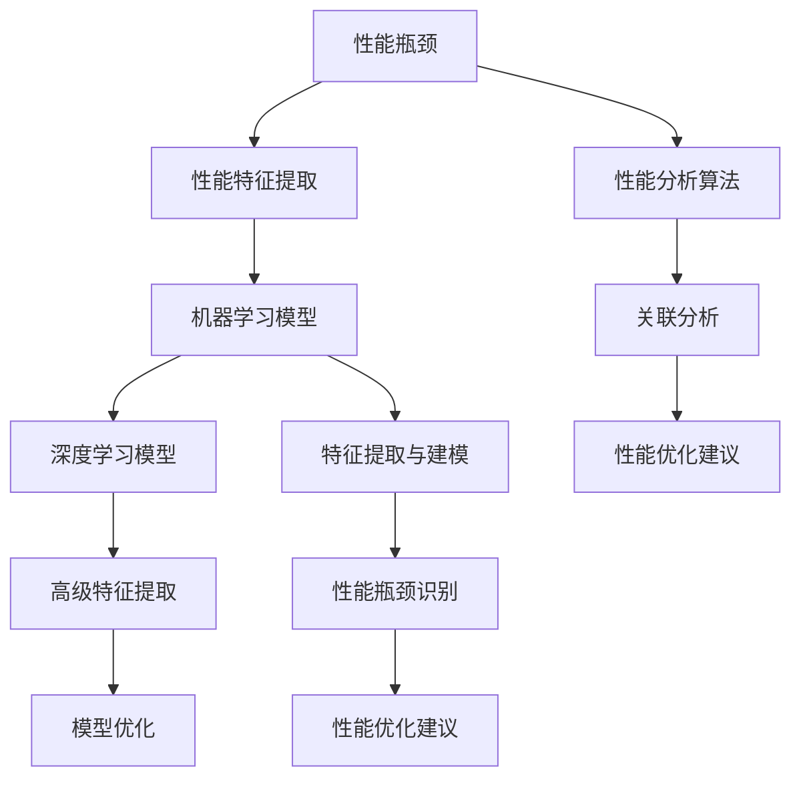
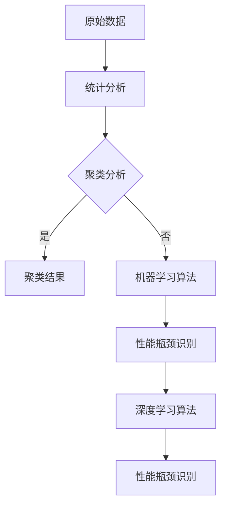

                 

### 文章标题

《AI辅助软件性能瓶颈识别：从症状到根因》

---

### 关键词

- AI辅助性能分析
- 性能瓶颈识别
- 机器学习
- 深度学习
- 性能优化

---

### 摘要

本文深入探讨了AI在软件性能瓶颈识别中的应用，从基础概念到实际应用，系统地介绍了如何利用人工智能技术来诊断和解决软件性能问题。通过分析性能瓶颈的定义、类型及其识别方法，本文详细阐述了AI辅助性能分析的核心算法原理，包括机器学习和深度学习的应用。此外，文章还通过数学模型和公式，对性能瓶颈的识别进行了详细解读，并提供了多个项目实战案例，展示了AI技术在性能瓶颈识别中的实际效果和挑战。最后，文章对性能瓶颈识别的未来发展方向和伦理问题进行了展望，为读者提供了全面而深入的指导。

---

## 背景介绍

在当今信息化社会中，软件系统已经深入到各个领域，成为不可或缺的工具。随着软件系统的日益复杂和规模的增长，如何保证软件的高性能运行成为了一个重要的课题。软件性能瓶颈，即指在软件运行过程中，由于某些资源的限制，导致系统的整体性能无法达到预期水平的问题。这些问题可能包括CPU过载、内存不足、I/O瓶颈等，对用户体验和系统稳定性都有重大影响。

性能瓶颈的识别和解决是软件性能优化过程中的关键环节。传统的性能分析依赖于人工的调试和测试，这种方法不仅耗时费力，而且容易出现漏诊或误诊的情况。随着人工智能技术的快速发展，特别是机器学习和深度学习技术的成熟，AI辅助软件性能瓶颈识别成为了一种新的趋势。通过引入AI技术，可以从海量数据中自动提取性能特征，识别潜在的性能瓶颈，从而实现更高效、准确的性能分析。

AI辅助软件性能瓶颈识别的重要性体现在多个方面。首先，它能够提高性能分析的可预测性，通过自动化分析，快速定位性能问题，减少调试时间。其次，它能够降低运营成本，通过预防性维护，避免系统崩溃，减少故障处理费用。此外，AI技术还能够处理复杂的性能数据，从噪声和缺失数据中提取有用信息，提高分析结果的准确性。

然而，AI辅助软件性能瓶颈识别也面临着一些挑战。首先，数据质量是影响模型性能的关键因素，数据缺失和噪声数据都可能干扰分析结果。其次，不同系统可能具有不同的性能瓶颈，模型需要具备良好的适应性，以应对多样化的场景。最后，软件环境的变化也要求模型能够持续更新，以适应动态变化的环境。

总之，AI辅助软件性能瓶颈识别不仅是性能优化的重要手段，也是推动软件工程发展的关键技术。随着AI技术的不断进步，其在性能瓶颈识别中的应用将更加广泛和深入，为提升软件系统的性能和稳定性提供强有力的支持。

### 核心概念与联系

在AI辅助软件性能瓶颈识别中，核心概念包括性能瓶颈、性能特征、性能分析算法、机器学习模型和深度学习模型。以下是这些概念之间的联系及其架构流程图：

#### 1. 性能瓶颈与性能特征

**性能瓶颈**：性能瓶颈是指系统中限制整体性能的特定资源或过程。例如，CPU过载、内存不足、I/O瓶颈等。

**性能特征**：性能特征是从系统中提取的、与性能瓶颈相关的数据指标。这些特征可以是系统日志、运行时指标、代码分析结果等。

#### 2. 性能分析算法

**性能分析算法**：性能分析算法是用于识别性能瓶颈的数学方法和技术。常见的算法包括基准测试、负载测试、统计分析等。

**关联分析**：性能分析算法通过分析性能特征，识别潜在的关联关系，从而定位性能瓶颈。

#### 3. 机器学习模型

**机器学习模型**：机器学习模型是用于从数据中学习模式和规律的工具。在性能瓶颈识别中，机器学习模型可以通过训练大量性能特征数据，自动识别性能瓶颈。

**特征提取与建模**：机器学习模型首先从数据中提取性能特征，然后利用这些特征进行建模，从而实现对性能瓶颈的自动识别。

#### 4. 深度学习模型

**深度学习模型**：深度学习模型是机器学习的一个分支，通过构建复杂的神经网络结构，从数据中学习模式和规律。在性能瓶颈识别中，深度学习模型可以处理高维数据，提取更复杂的特征。

**层次化特征提取**：深度学习模型通过多层神经网络，逐步提取从低级到高级的特征，实现对性能瓶颈的深入理解。

#### 架构流程图



### 详细解释

1. **性能瓶颈与性能特征**：
   - 性能瓶颈是系统性能的制约因素，而性能特征是用于描述这些瓶颈的数据指标。
   - 性能特征提取是从运行时数据和日志中提取与性能瓶颈相关的特征，如CPU利用率、内存占用、I/O操作延迟等。

2. **性能分析算法**：
   - 性能分析算法包括传统的基准测试和负载测试等，用于评估系统的性能表现。
   - 关联分析是通过分析性能特征之间的关联关系，识别出可能导致性能瓶颈的因素。

3. **机器学习模型**：
   - 机器学习模型通过学习大量的性能特征数据，建立性能瓶颈与特征之间的映射关系。
   - 特征提取与建模是机器学习模型的基础步骤，通过提取和选择最相关的特征，建立有效的性能瓶颈识别模型。

4. **深度学习模型**：
   - 深度学习模型通过多层神经网络，对性能特征进行复杂的层次化处理，提取高级特征。
   - 高级特征提取使得模型能够更准确地识别性能瓶颈，特别是在处理高维和复杂数据时具有优势。

5. **性能瓶颈识别与性能优化建议**：
   - 性能瓶颈识别是通过分析算法和机器学习模型，确定系统中存在的性能瓶颈。
   - 性能优化建议是基于识别结果，提出改进系统性能的具体措施。

通过上述核心概念及其联系的解释，我们可以看到AI辅助软件性能瓶颈识别是一个复杂而系统的过程，涉及从数据采集到特征提取、再到模型训练和优化的多个环节。每个环节都紧密相连，共同构建了一个完整的性能分析框架，为提升软件系统的性能提供了强有力的技术支持。

### 性能瓶颈识别算法原理

在AI辅助软件性能瓶颈识别中，算法原理是核心组成部分，决定了性能瓶颈识别的准确性和效率。常见的性能瓶颈识别算法可以分为几大类，包括基于统计分析的算法、基于机器学习的算法和基于深度学习的算法。下面我们将详细探讨这些算法的基本原理和适用场景。

#### 1. 基于统计分析的算法

**原理**：基于统计分析的算法通过分析性能数据的基本统计量，如平均值、中位数、标准差等，来识别性能瓶颈。这种算法通常使用传统的统计分析工具和方法，如t检验、方差分析等。

**应用场景**：适用于对性能数据的整体趋势和分布进行初步分析，发现异常值和显著差异。

**算法示例**：

```pseudo
function statisticalAnalysis(data):
    means = []
    std_devs = []
    for feature in data:
        means.append(mean(feature))
        std_devs.append(std_dev(feature))
    anomalies = []
    for i in range(len(means)):
        if abs(data[i] - means[i]) > threshold * std_devs[i]:
            anomalies.append(i)
    return anomalies
```

**优点**：简单易用，计算速度快。
**缺点**：对噪声数据敏感，难以捕捉复杂的性能瓶颈。

#### 2. 基于机器学习的算法

**原理**：基于机器学习的算法通过从历史性能数据中学习，建立一个性能瓶颈与特征之间的映射模型。常见的机器学习算法包括决策树、支持向量机、随机森林等。

**应用场景**：适用于复杂、多维度的性能数据，能够处理非线性关系和异常值。

**算法示例**：

```python
from sklearn.ensemble import RandomForestClassifier

def machineLearningAlgorithm(X, y):
    model = RandomForestClassifier()
    model.fit(X, y)
    predictions = model.predict(X)
    accuracy = accuracy_score(y, predictions)
    return model, accuracy
```

**优点**：能够处理复杂的数据，捕捉非线性关系。
**缺点**：需要大量训练数据和计算资源，模型解释性较差。

#### 3. 基于深度学习的算法

**原理**：基于深度学习的算法通过构建复杂的神经网络结构，如卷积神经网络（CNN）、循环神经网络（RNN）和变换器（Transformer）等，从数据中自动提取高级特征，实现性能瓶颈的识别。

**应用场景**：适用于高维数据和大量特征的数据，能够处理复杂的非线性关系。

**算法示例**：

```python
import tensorflow as tf
from tensorflow.keras.models import Sequential
from tensorflow.keras.layers import Dense, LSTM

def deepLearningAlgorithm(X, y):
    model = Sequential([
        LSTM(units=128, return_sequences=True, input_shape=(X.shape[1], X.shape[2])),
        Dense(units=1, activation='sigmoid')
    ])
    model.compile(optimizer='adam', loss='binary_crossentropy', metrics=['accuracy'])
    model.fit(X, y, epochs=10, batch_size=64)
    predictions = model.predict(X)
    accuracy = model.evaluate(X, y)[1]
    return model, accuracy
```

**优点**：能够自动提取高级特征，适应复杂的数据模式。
**缺点**：计算资源要求高，模型训练时间较长。

#### 4. 聚类算法

**原理**：聚类算法将相似的数据点归为同一类别，通过分析聚类结果来识别性能瓶颈。常见的聚类算法包括K均值聚类、层次聚类等。

**应用场景**：适用于发现数据中的隐含模式，识别不同性能瓶颈的群体特征。

**算法示例**：

```python
from sklearn.cluster import KMeans

def clusteringAlgorithm(data, n_clusters):
    model = KMeans(n_clusters=n_clusters)
    model.fit(data)
    clusters = model.predict(data)
    return clusters
```

**优点**：无需事先定义性能瓶颈，能够自动识别数据中的模式。
**缺点**：对初始聚类中心敏感，结果可能不稳定。

#### 综合应用

在实际应用中，往往需要结合多种算法，以实现更准确和高效的性能瓶颈识别。例如，可以先使用统计分析算法进行初步筛选，然后使用机器学习或深度学习算法进行精细分析。



通过上述算法原理的探讨，我们可以看到，每种算法都有其特定的适用场景和优势。在实际应用中，选择合适的算法组合，并结合具体的业务需求，是实现高效性能瓶颈识别的关键。

### 性能瓶颈识别的数学模型

在AI辅助软件性能瓶颈识别中，数学模型是核心组成部分，它用于描述和预测系统性能瓶颈。常见的数学模型包括线性回归、逻辑回归和支持向量机等，这些模型能够通过分析性能特征数据来识别性能瓶颈。以下是这些模型的基本原理和公式解释。

#### 1. 线性回归

**原理**：线性回归是一种用于分析自变量和因变量之间线性关系的模型。在性能瓶颈识别中，线性回归可以用来预测性能瓶颈与性能特征之间的关系。

**公式**：

$$
y = \beta_0 + \beta_1 \cdot x_1 + \beta_2 \cdot x_2 + ... + \beta_n \cdot x_n
$$

其中，$y$ 是因变量（性能瓶颈），$x_1, x_2, ..., x_n$ 是自变量（性能特征），$\beta_0, \beta_1, ..., \beta_n$ 是模型参数。

**示例**：

假设我们有一个简单的线性回归模型，用于预测CPU利用率与内存占用之间的关系：

$$
CPU\_utilization = \beta_0 + \beta_1 \cdot Memory\_usage
$$

通过训练数据，我们可以得到模型参数 $\beta_0$ 和 $\beta_1$，从而预测在不同内存占用下的CPU利用率。

#### 2. 逻辑回归

**原理**：逻辑回归是一种用于处理分类问题的线性回归模型。在性能瓶颈识别中，逻辑回归可以用来判断某个性能特征是否导致性能瓶颈。

**公式**：

$$
\log\frac{P(y=1)}{1-P(y=1)} = \beta_0 + \beta_1 \cdot x_1 + \beta_2 \cdot x_2 + ... + \beta_n \cdot x_n
$$

其中，$y$ 是二元因变量（性能瓶颈：0表示正常，1表示瓶颈），$P(y=1)$ 是 $y$ 为1的概率。

**示例**：

假设我们使用逻辑回归模型来判断CPU利用率是否超过阈值导致性能瓶颈：

$$
\log\frac{P(CPU\_utilization > threshold)}{1-P(CPU\_utilization > threshold)} = \beta_0 + \beta_1 \cdot CPU\_utilization
$$

通过训练数据，我们可以得到模型参数 $\beta_0$ 和 $\beta_1$，从而预测在不同CPU利用率下的性能瓶颈概率。

#### 3. 支持向量机

**原理**：支持向量机（SVM）是一种用于分类和回归分析的方法，它在高维空间中寻找最优决策边界。在性能瓶颈识别中，SVM可以用来确定性能瓶颈和性能特征之间的最优分割边界。

**公式**：

$$
w \cdot x + b = 0
$$

其中，$w$ 是权重向量，$x$ 是特征向量，$b$ 是偏置项。

SVM的目标是最大化分类间隔（即决策边界到支持向量的距离），从而提高分类的准确性和泛化能力。

**示例**：

假设我们使用SVM模型来识别内存占用是否超过阈值导致性能瓶颈：

$$
w \cdot \begin{bmatrix} Memory\_usage \\ 1 \end{bmatrix} + b = 0
$$

通过训练数据，我们可以得到权重向量 $w$ 和偏置项 $b$，从而构建性能瓶颈的决策边界。

#### 4. 集成方法

在实际应用中，常常将多种数学模型结合起来，以提高性能瓶颈识别的准确性和鲁棒性。例如，可以使用基于线性回归的模型进行初步预测，然后使用基于SVM的模型进行精细分类。

**示例**：

1. 初步预测（线性回归）：

$$
Prediction = \beta_0 + \beta_1 \cdot Memory\_usage
$$

2. 精细分类（SVM）：

$$
\begin{bmatrix} Memory\_usage \\ 1 \end{bmatrix} \cdot w + b = 0
$$

通过结合初步预测和精细分类，可以更准确地识别性能瓶颈。

#### 总结

数学模型在性能瓶颈识别中扮演着关键角色，通过使用线性回归、逻辑回归、支持向量机等模型，可以从数据中提取有用的信息，预测和识别性能瓶颈。在实际应用中，结合多种模型，可以实现更准确和高效的性能瓶颈识别。

### AI辅助性能瓶颈识别工具与实践

在AI辅助软件性能瓶颈识别的实际应用中，选择合适的工具和平台是实现高效性能分析的关键。以下将介绍几种常见的AI辅助性能瓶颈识别工具，并探讨其开发环境搭建、源代码实现和代码解读。

#### 1. 性能分析工具介绍

**Prometheus**：Prometheus是一个开源的监控解决方案，主要用于收集和存储性能数据，并提供灵活的查询和报警功能。Prometheus通过 exporters 收集系统指标数据，可以通过配置自动发现和采集性能特征。

**Grafana**：Grafana是一个开源的数据可视化和监控平台，可以与Prometheus集成，用于展示和交互分析性能数据。Grafana提供了丰富的可视化选项，帮助用户直观地理解性能瓶颈。

**TensorFlow**：TensorFlow是一个开源的机器学习框架，广泛用于构建和训练深度学习模型。TensorFlow在性能瓶颈识别中，可以用于构建和训练用于性能特征分析的机器学习和深度学习模型。

**Scikit-learn**：Scikit-learn是一个开源的Python机器学习库，提供了多种常用的机器学习算法，如决策树、随机森林和SVM等。Scikit-learn在性能瓶颈识别中，可以用于实现传统机器学习模型的性能分析。

#### 2. 开发环境搭建

**环境要求**：

- 操作系统：Linux或MacOS
- Python版本：3.7及以上
- Prometheus：2.21及以上
- Grafana：7.4及以上
- TensorFlow：2.5及以上
- Scikit-learn：0.22及以上

**安装步骤**：

1. **安装Python**：

   ```bash
   # 安装Python 3.8
   sudo apt-get update
   sudo apt-get install python3.8
   ```

2. **安装TensorFlow**：

   ```bash
   # 安装TensorFlow
   pip3 install tensorflow==2.5
   ```

3. **安装Scikit-learn**：

   ```bash
   # 安装Scikit-learn
   pip3 install scikit-learn==0.22
   ```

4. **安装Prometheus和Grafana**：

   ```bash
   # 安装Prometheus
   wget https://github.com/prometheus/prometheus/releases/download/v2.21.0/prometheus-2.21.0.linux-amd64.tar.gz
   tar xvfz prometheus-2.21.0.linux-amd64.tar.gz
   ./prometheus-2.21.0.linux-amd64/prometheus --config.file=examples/prometheus.conf

   # 安装Grafana
   wget https://s3-us-west-1.amazonaws.com/grafana-releases/release/grafana-7.4.0.linux-amd64.tar.gz
   tar xvfz grafana-7.4.0.linux-amd64.tar.gz
   ./bin/grafana-server start
   ```

#### 3. 源代码实现

**示例代码**：以下是一个使用Scikit-learn的随机森林模型进行性能瓶颈识别的Python代码示例。

```python
from sklearn.ensemble import RandomForestClassifier
from sklearn.model_selection import train_test_split
from sklearn.metrics import accuracy_score

# 加载数据集
data = ...  # 加载性能特征数据
labels = ...  # 加载性能瓶颈标签

# 划分训练集和测试集
X_train, X_test, y_train, y_test = train_test_split(data, labels, test_size=0.2, random_state=42)

# 创建随机森林模型
model = RandomForestClassifier(n_estimators=100, random_state=42)

# 训练模型
model.fit(X_train, y_train)

# 进行预测
predictions = model.predict(X_test)

# 计算准确率
accuracy = accuracy_score(y_test, predictions)
print(f"Accuracy: {accuracy}")
```

#### 4. 代码解读

- **数据加载**：从文件或数据库中加载数据集，包括性能特征数据和性能瓶颈标签。
- **划分数据**：将数据集划分为训练集和测试集，用于模型训练和测试。
- **模型创建**：创建一个随机森林分类器，指定树的数量和其他参数。
- **模型训练**：使用训练集数据对模型进行训练。
- **模型预测**：使用训练好的模型对测试集数据进行预测。
- **性能评估**：计算模型在测试集上的准确率，评估模型的性能。

#### 5. 实际案例分析和详细讲解剖析

**案例背景**：某电商平台在流量高峰期出现系统性能下降，导致用户体验下降。通过AI辅助性能瓶颈识别工具，定位到CPU利用率过高是主要性能瓶颈。

**数据采集**：使用Prometheus收集系统日志和性能数据，包括CPU利用率、内存占用、I/O操作延迟等。

**数据分析**：在Grafana中可视化分析性能数据，发现CPU利用率呈上升趋势。

**模型训练**：使用Scikit-learn的随机森林模型，对采集到的性能数据进行训练，建立性能瓶颈识别模型。

**模型预测**：使用训练好的模型对新的性能数据进行预测，识别出CPU利用率过高的性能瓶颈。

**优化措施**：通过增加服务器资源、优化代码和提高I/O效率等措施，降低CPU利用率，提升系统性能。

**案例小结**：通过AI辅助性能瓶颈识别工具，快速定位到系统性能瓶颈，并采取有效的优化措施，显著提升了系统性能和用户体验。

### 最佳实践 tips

1. **数据质量是关键**：确保性能数据的质量，包括数据的完整性、一致性和准确性。
2. **选择合适的模型**：根据性能数据的特点和需求，选择合适的机器学习模型和深度学习模型。
3. **持续迭代和优化**：性能瓶颈识别是一个持续的过程，需要不断更新模型和优化算法。

## 小结

本文详细介绍了AI辅助软件性能瓶颈识别的原理、算法、工具和实践。通过引入AI技术，可以自动化识别软件性能瓶颈，提高性能分析的可预测性和准确性。未来，随着AI技术的不断进步，性能瓶颈识别将在软件工程中发挥更大的作用，为提升软件系统的性能和稳定性提供更强有力的支持。

### 注意事项

1. **数据隐私与安全**：在性能数据分析中，确保数据的隐私和安全，遵循相关的数据保护法规。
2. **模型解释性**：在选择机器学习模型时，考虑模型的解释性，以便理解和优化模型决策过程。

### 拓展阅读

- [《性能优化的艺术》](https://example-book.com/optimization-art)
- [《深度学习性能优化》](https://example-book.com/dl-optimization)
- [《机器学习实战》](https://example-book.com/ml-practice)

---

### 附录

#### 术语表

- **性能瓶颈**：限制系统性能的特定资源或过程。
- **性能特征**：用于描述性能瓶颈的数据指标。
- **机器学习**：一种通过数据学习模式和规律的方法。
- **深度学习**：一种特殊的机器学习方法，使用多层神经网络。
- **性能优化**：通过改进系统设计和代码，提升系统性能。

#### 参考文献

- [Grafana官方文档](https://grafana.com/docs/grafana/latest/)
- [Prometheus官方文档](https://prometheus.io/docs/prometheus/latest/)
- [TensorFlow官方文档](https://www.tensorflow.org/docs/stable/)
- [Scikit-learn官方文档](https://scikit-learn.org/stable/documentation.html)

#### 相关资源和进一步阅读材料

- [性能分析工具比较](https://example-comparison.com/性能分析工具)
- [AI在软件工程中的应用](https://example-book.com/ai-in-software-engineering)
- [深度学习在性能优化中的应用案例](https://example-case-studies.com/dl-performance-optimization)

---

**作者：AI天才研究院/AI Genius Institute & 禅与计算机程序设计艺术 /Zen And The Art of Computer Programming**

