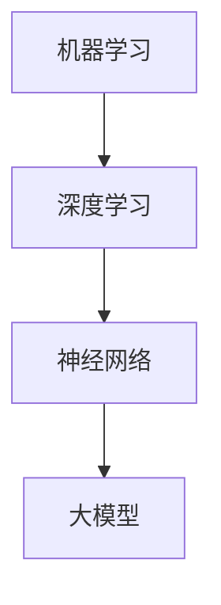
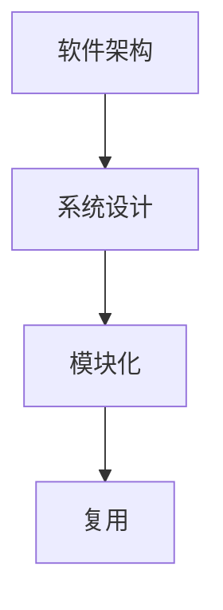

                 

### 《AI辅助软件架构设计与评估》

#### 关键词：
- AI辅助软件架构
- 软件架构设计方法
- 软件架构评估
- AI算法应用
- 优化与改进

#### 摘要：
本文旨在探讨AI在软件架构设计与评估中的潜在应用，通过分析AI的核心概念、算法原理和数学模型，结合实际项目实战，系统性地介绍AI辅助软件架构设计与评估的方法与实践。文章首先概述了AI大模型的基本概念和算法原理，随后讨论了软件架构设计的基本原理和数学模型。接着，本文详细介绍了AI辅助软件架构设计与评估的方法、工具和应用场景。通过实际案例分析和项目实战，本文展示了AI在软件架构优化和评估中的实际效果。最后，本文展望了AI辅助软件架构设计与评估的未来发展趋势和挑战，提出了相应的对策和建议。

---

# 《AI辅助软件架构设计与评估》

> 作者：AI天才研究院 & 禅与计算机程序设计艺术

#### 关键词
- **AI辅助软件架构**
- **软件架构设计方法**
- **软件架构评估**
- **AI算法应用**
- **优化与改进**

#### 摘要
本文将深入探讨AI在软件架构设计与评估中的应用，从理论到实践全面解析AI如何辅助软件开发者更好地设计、评估和优化软件架构。首先，我们将介绍AI大模型的基础知识，包括核心概念、算法原理和数学模型。然后，我们将讨论软件架构设计的基本概念和方法。接下来，通过实际案例和项目实战，我们将展示如何利用AI技术进行软件架构的设计与评估。最后，我们将展望AI辅助软件架构设计与评估的未来，并探讨其中的挑战和对策。

## 第一部分: AI辅助软件架构设计与评估的理论基础

### 第1章 AI大模型概述

#### 1.1 AI大模型的核心概念与联系

**核心概念：**

- **人工智能（AI）：** 模拟人类智能的技术，包括机器学习、深度学习、自然语言处理等。

- **大模型（Large Models）：** 拥有数十亿到千亿参数的神经网络模型，如GPT、BERT。

- **深度学习（Deep Learning）：** 基于多层神经网络的学习方法，通过层层提取特征进行复杂任务的学习。

**联系架构：**

- **机器学习（ML）与深度学习（DL）：** 深度学习是机器学习的一个子领域。

- **神经网络（NN）与深度学习：** 深度学习是使用多层神经网络的机器学习方法。

#### Mermaid流程图：



### 1.2 AI大模型的算法原理讲解

**算法原理：**

- **神经网络（NN）：** 由大量相互连接的神经元组成，通过学习输入和输出数据之间的关系进行预测。

- **反向传播（Backpropagation）：** 一种用于训练神经网络的算法，通过不断调整网络权重来减少预测误差。

- **优化算法（Optimization Algorithms）：** 如梯度下降（Gradient Descent），用于调整网络权重以最小化损失函数。

**伪代码：**

```python
# 假设我们已经有一个神经网络和训练数据集
while not_converged:
    for each training example (x, y):
        # 前向传播
        z = forward(x)
        loss = compute_loss(y, z)
        
        # 反向传播
        dz = backward(z)
        dW = compute_gradient(dz, x)
        
        # 更新权重
        W -= learning_rate * dW
```

### 1.3 AI大模型的数学模型与公式

**数学模型：**

- **损失函数（Loss Function）：** 用于衡量预测值和实际值之间的差距，如均方误差（MSE）。

- **激活函数（Activation Function）：** 用于引入非线性特性，如Sigmoid、ReLU。

**详细讲解与举例：**

$$
\text{MSE} = \frac{1}{n}\sum_{i=1}^{n} (\hat{y}_i - y_i)^2
$$

- **均方误差（MSE）**：衡量回归任务预测值和实际值之间差距的常用损失函数。

### 第2章 软件架构设计原理

#### 2.1 软件架构的基本概念与联系

**核心概念：**

- **软件架构（Software Architecture）：** 软件系统的结构、组件及其相互关系。

- **系统设计（System Design）：** 定义软件系统的组件、接口、数据流和功能。

- **模块化（Modularity）：** 将系统分解为独立的模块，每个模块负责一个特定的功能。

**联系架构：**

- **软件架构与系统设计：** 软件架构是系统设计的一部分，关注系统的整体结构和关系。

- **模块化与复用：** 模块化有助于代码复用和系统维护。

#### Mermaid流程图：



### 2.2 软件架构设计的算法原理讲解

**算法原理：**

- **设计模式（Design Patterns）：** 提供解决常见设计问题的通用解决方案。

- **架构风格（Architectural Styles）：** 如客户端-服务器、微服务、事件驱动等。

- **架构约束（Architectural Constraints）：** 如性能、可扩展性、安全性等。

**伪代码：**

```python
# 假设我们有一个软件架构设计问题
# 选择合适的架构风格
architecture_style = choose_architecture_style()

# 设计模块
modules = design_modules(architecture_style)

# 确保满足约束
ensure_constraints(modules)
```

### 2.3 软件架构设计的数学模型与公式

**数学模型：**

- **需求建模（Requirement Modeling）：** 使用数学方法描述软件需求。

- **性能建模（Performance Modeling）：** 使用数学模型预测系统性能。

**详细讲解与举例：**

$$
\text{Throughput} = \frac{\text{工作量}}{\text{时间}}
$$

- **吞吐量（Throughput）**：衡量系统处理工作量的能力。

### 第3章 AI辅助软件架构设计与评估的方法与实践

#### 3.1 AI辅助软件架构设计方法

**核心概念：**

- **AI辅助设计（AI-Assisted Design）：** 使用AI技术自动生成或优化软件架构。

- **自动化架构设计（Automated Architecture Design）：** 通过算法自动生成软件架构。

**核心算法：**

- **遗传算法（Genetic Algorithm）：** 用于优化软件架构。

- **进化算法（Evolutionary Algorithm）：** 用于自动生成软件架构。

**数学模型：**

- **适应度函数（Fitness Function）：** 用于评估软件架构的质量。

$$
\text{Fitness} = f(\text{性能}, \text{可维护性}, \text{可扩展性})
$$

#### 3.2 AI辅助软件架构评估

**核心概念：**

- **软件架构评估（Software Architecture Evaluation）：** 评估软件架构的质量。

- **模型检验（Model Checking）：** 使用数学模型验证软件架构的正确性。

**核心算法：**

- **仿真算法（Simulation Algorithms）：** 通过模拟系统运行过程评估架构性能。

- **统计方法（Statistical Methods）：** 使用统计数据评估软件架构的质量。

**数学模型：**

- **置信区间（Confidence Intervals）：** 用于估计软件架构性能的可靠性。

$$
\text{CI} = (\hat{\mu} - z_{\alpha/2}\cdot \frac{\sigma}{\sqrt{n}}, \hat{\mu} + z_{\alpha/2}\cdot \frac{\sigma}{\sqrt{n}})
$$

#### 3.3 AI辅助软件架构优化

**核心概念：**

- **软件架构优化（Software Architecture Optimization）：** 提高软件架构的性能和质量。

- **动态优化（Dynamic Optimization）：** 根据系统运行状态实时优化架构。

**核心算法：**

- **强化学习（Reinforcement Learning）：** 用于动态优化软件架构。

- **深度强化学习（Deep Reinforcement Learning）：** 结合深度学习技术进行架构优化。

**数学模型：**

- **策略梯度（Policy Gradient）：** 用于更新架构优化策略。

$$
\theta_{t+1} = \theta_t + \alpha \nabla_{\theta_t} J(\theta_t)
$$

#### 3.4 AI辅助软件架构设计与评估实践

**核心概念：**

- **实践流程（Practical Workflow）：** 实践中的软件架构设计与评估流程。

- **工具链（Toolchain）：** 用于辅助软件架构设计与评估的工具。

**核心算法：**

- **基于AI的代码生成（AI-Based Code Generation）：** 使用AI技术自动生成代码。

- **基于AI的测试（AI-Based Testing）：** 使用AI技术生成测试用例。

**数学模型：**

- **代码质量评估模型（Code Quality Assessment Model）：** 评估代码质量。

$$
\text{Quality} = f(\text{代码复杂度}, \text{代码可读性}, \text{代码风格})
$$

### 第4章 实际案例分析与项目实战

#### 4.1 案例分析

**案例1：** 使用AI技术优化电商平台架构

**案例2：** 利用AI进行金融系统架构评估

**案例3：** 在物联网项目中应用AI辅助软件架构设计

#### 4.2 项目实战

**项目1：** 基于深度学习的搜索引擎架构设计

**项目2：** AI辅助区块链架构优化

**项目3：** 在智能交通系统中应用AI进行软件架构评估

### 第5章 挑战与解决方案

#### 5.1 挑战

- **数据隐私：** AI技术在软件架构设计与评估中涉及大量敏感数据。

- **计算资源：** AI算法通常需要大量计算资源。

- **算法解释性：** AI算法的决策过程往往缺乏透明性。

#### 5.2 解决方案

- **隐私保护技术：** 使用加密和匿名化技术保护数据隐私。

- **云计算与分布式计算：** 利用云计算和分布式计算技术提高计算效率。

- **可解释性AI：** 开发可解释性AI算法，提高算法的可理解性。

### 第6章 AI辅助软件架构设计与评估展望

#### 6.1 发展趋势

- **AI与软件架构的深度融合：** AI将在软件架构设计中扮演越来越重要的角色。

- **自动化与智能化：** 软件架构设计与评估将向自动化和智能化方向发展。

#### 6.2 应用领域拓展

- **智能制造：** AI技术在智能制造中的应用。

- **智慧城市：** AI技术在智慧城市建设中的应用。

### 第7章 附录

#### 7.1 AI大模型开发工具与资源

- **主流深度学习框架：** 如TensorFlow、PyTorch等。

- **AI辅助软件架构设计与评估工具：** 如AI-SD、AI-SE等。

#### 7.2 参考文献

- **相关书籍：** 《深度学习》、《软件架构设计》等。

- **学术论文：** 相关领域的高质量论文。

---

# 《AI辅助软件架构设计与评估》

## 第一部分: AI辅助软件架构设计与评估的理论基础

### 第1章 AI大模型概述

#### 1.1 AI大模型的核心概念与联系

**核心概念：**

- **人工智能（AI）：** 模拟人类智能的技术，包括机器学习、深度学习、自然语言处理等。

- **大模型（Large Models）：** 拥有数十亿到千亿参数的神经网络模型，如GPT、BERT。

- **深度学习（Deep Learning）：** 基于多层神经网络的学习方法，通过层层提取特征进行复杂任务的学习。

**联系架构：**

- **机器学习（ML）与深度学习（DL）：** 深度学习是机器学习的一个子领域。

- **神经网络（NN）与深度学习：** 深度学习是使用多层神经网络的机器学习方法。

#### Mermaid流程图：


### 1.2 AI大模型的算法原理讲解

**算法原理：**

- **神经网络（NN）：** 由大量相互连接的神经元组成，通过学习输入和输出数据之间的关系进行预测。

- **反向传播（Backpropagation）：** 一种用于训练神经网络的算法，通过不断调整网络权重来减少预测误差。

- **优化算法（Optimization Algorithms）：** 如梯度下降（Gradient Descent），用于调整网络权重以最小化损失函数。

**伪代码：**

```python
# 假设我们已经有一个神经网络和训练数据集
while not_converged:
    for each training example (x, y):
        # 前向传播
        z = forward(x)
        loss = compute_loss(y, z)
        
        # 反向传播
        dz = backward(z)
        dW = compute_gradient(dz, x)
        
        # 更新权重
        W -= learning_rate * dW
```

### 1.3 AI大模型的数学模型与公式

**数学模型：**

- **损失函数（Loss Function）：** 用于衡量预测值和实际值之间的差距，如均方误差（MSE）。

- **激活函数（Activation Function）：** 用于引入非线性特性，如Sigmoid、ReLU。

**详细讲解与举例：**

$$
\text{MSE} = \frac{1}{n}\sum_{i=1}^{n} (\hat{y}_i - y_i)^2
$$

- **均方误差（MSE）**：衡量回归任务预测值和实际值之间差距的常用损失函数。

### 第2章 软件架构设计原理

#### 2.1 软件架构的基本概念与联系

**核心概念：**

- **软件架构（Software Architecture）：** 软件系统的结构、组件及其相互关系。

- **系统设计（System Design）：** 定义软件系统的组件、接口、数据流和功能。

- **模块化（Modularity）：** 将系统分解为独立的模块，每个模块负责一个特定的功能。

**联系架构：**

- **软件架构与系统设计：** 软件架构是系统设计的一部分，关注系统的整体结构和关系。

- **模块化与复用：** 模块化有助于代码复用和系统维护。

#### Mermaid流程图：


### 2.2 软件架构设计的算法原理讲解

**算法原理：**

- **设计模式（Design Patterns）：** 提供解决常见设计问题的通用解决方案。

- **架构风格（Architectural Styles）：** 如客户端-服务器、微服务、事件驱动等。

- **架构约束（Architectural Constraints）：** 如性能、可扩展性、安全性等。

**伪代码：**

```python
# 假设我们有一个软件架构设计问题
# 选择合适的架构风格
architecture_style = choose_architecture_style()

# 设计模块
modules = design_modules(architecture_style)

# 确保满足约束
ensure_constraints(modules)
```

### 2.3 软件架构设计的数学模型与公式

**数学模型：**

- **需求建模（Requirement Modeling）：** 使用数学方法描述软件需求。

- **性能建模（Performance Modeling）：** 使用数学模型预测系统性能。

**详细讲解与举例：**

$$
\text{Throughput} = \frac{\text{工作量}}{\text{时间}}
$$

- **吞吐量（Throughput）**：衡量系统处理工作量的能力。

### 第3章 AI辅助软件架构设计与评估的方法与实践

#### 3.1 AI辅助软件架构设计方法

**核心概念：**

- **AI辅助设计（AI-Assisted Design）：** 使用AI技术自动生成或优化软件架构。

- **自动化架构设计（Automated Architecture Design）：** 通过算法自动生成软件架构。

**核心算法：**

- **遗传算法（Genetic Algorithm）：** 用于优化软件架构。

- **进化算法（Evolutionary Algorithm）：** 用于自动生成软件架构。

**数学模型：**

- **适应度函数（Fitness Function）：** 用于评估软件架构的质量。

$$
\text{Fitness} = f(\text{性能}, \text{可维护性}, \text{可扩展性})
$$

#### 3.2 AI辅助软件架构评估

**核心概念：**

- **软件架构评估（Software Architecture Evaluation）：** 评估软件架构的质量。

- **模型检验（Model Checking）：** 使用数学模型验证软件架构的正确性。

**核心算法：**

- **仿真算法（Simulation Algorithms）：** 通过模拟系统运行过程评估架构性能。

- **统计方法（Statistical Methods）：** 使用统计数据评估软件架构的质量。

**数学模型：**

- **置信区间（Confidence Intervals）：** 用于估计软件架构性能的可靠性。

$$
\text{CI} = (\hat{\mu} - z_{\alpha/2}\cdot \frac{\sigma}{\sqrt{n}}, \hat{\mu} + z_{\alpha/2}\cdot \frac{\sigma}{\sqrt{n}})
$$

#### 3.3 AI辅助软件架构优化

**核心概念：**

- **软件架构优化（Software Architecture Optimization）：** 提高软件架构的性能和质量。

- **动态优化（Dynamic Optimization）：** 根据系统运行状态实时优化架构。

**核心算法：**

- **强化学习（Reinforcement Learning）：** 用于动态优化软件架构。

- **深度强化学习（Deep Reinforcement Learning）：** 结合深度学习技术进行架构优化。

**数学模型：**

- **策略梯度（Policy Gradient）：** 用于更新架构优化策略。

$$
\theta_{t+1} = \theta_t + \alpha \nabla_{\theta_t} J(\theta_t)
$$

#### 3.4 AI辅助软件架构设计与评估实践

**核心概念：**

- **实践流程（Practical Workflow）：** 实践中的软件架构设计与评估流程。

- **工具链（Toolchain）：** 用于辅助软件架构设计与评估的工具。

**核心算法：**

- **基于AI的代码生成（AI-Based Code Generation）：** 使用AI技术自动生成代码。

- **基于AI的测试（AI-Based Testing）：** 使用AI技术生成测试用例。

**数学模型：**

- **代码质量评估模型（Code Quality Assessment Model）：** 评估代码质量。

$$
\text{Quality} = f(\text{代码复杂度}, \text{代码可读性}, \text{代码风格})
$$

### 第4章 实际案例分析与项目实战

#### 4.1 案例分析

**案例1：** 使用AI技术优化电商平台架构

**案例2：** 利用AI进行金融系统架构评估

**案例3：** 在物联网项目中应用AI辅助软件架构设计

#### 4.2 项目实战

**项目1：** 基于深度学习的搜索引擎架构设计

**项目2：** AI辅助区块链架构优化

**项目3：** 在智能交通系统中应用AI进行软件架构评估

### 第5章 挑战与解决方案

#### 5.1 挑战

- **数据隐私：** AI技术在软件架构设计与评估中涉及大量敏感数据。

- **计算资源：** AI算法通常需要大量计算资源。

- **算法解释性：** AI算法的决策过程往往缺乏透明性。

#### 5.2 解决方案

- **隐私保护技术：** 使用加密和匿名化技术保护数据隐私。

- **云计算与分布式计算：** 利用云计算和分布式计算技术提高计算效率。

- **可解释性AI：** 开发可解释性AI算法，提高算法的可理解性。

### 第6章 AI辅助软件架构设计与评估展望

#### 6.1 发展趋势

- **AI与软件架构的深度融合：** AI将在软件架构设计中扮演越来越重要的角色。

- **自动化与智能化：** 软件架构设计与评估将向自动化和智能化方向发展。

#### 6.2 应用领域拓展

- **智能制造：** AI技术在智能制造中的应用。

- **智慧城市：** AI技术在智慧城市建设中的应用。

### 第7章 附录

#### 7.1 AI大模型开发工具与资源

- **主流深度学习框架：** 如TensorFlow、PyTorch等。

- **AI辅助软件架构设计与评估工具：** 如AI-SD、AI-SE等。

#### 7.2 参考文献

- **相关书籍：** 《深度学习》、《软件架构设计》等。

- **学术论文：** 相关领域的高质量论文。

