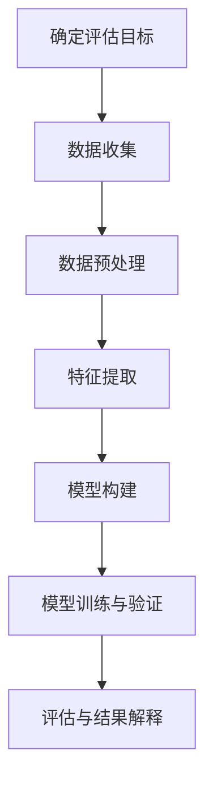

                 

# AI辅助软件架构评估：多维度分析方法

## 关键词
- AI辅助软件架构评估
- 多维度分析方法
- 数据收集与预处理
- 特征提取与选择
- 评估模型与方法
- 实际案例应用

## 摘要
本文探讨了AI辅助软件架构评估的多维度分析方法。首先，介绍了AI辅助软件架构评估的背景和重要性。随后，详细阐述了多维度分析方法的概念、原理和步骤。接着，分析了数据收集与预处理、特征提取与选择、评估模型与方法等关键环节。最后，通过实际案例展示了AI辅助软件架构评估的应用效果，并提出了未来的研究方向和挑战。

## 引言

随着信息技术的飞速发展，软件系统变得越来越复杂，其架构设计质量对系统的性能、可靠性、可维护性和可扩展性有着重要影响。传统的软件架构评估方法往往依赖于人工经验和静态分析，难以全面、动态地评估软件架构的质量。而随着人工智能（AI）技术的不断进步，利用AI技术辅助软件架构评估成为了一种新的研究热点。

AI辅助软件架构评估利用机器学习、深度学习等技术，通过分析大量数据，自动提取关键特征，构建评估模型，从而实现对软件架构质量的定量评估。这种方法不仅可以提高评估的准确性，还可以节省人力资源，提高评估效率。

本文旨在探讨AI辅助软件架构评估的多维度分析方法。首先，将介绍AI辅助软件架构评估的背景和重要性。然后，详细阐述多维度分析方法的概念、原理和步骤。接下来，分析数据收集与预处理、特征提取与选择、评估模型与方法等关键环节。最后，通过实际案例展示AI辅助软件架构评估的应用效果，并探讨未来的研究方向和挑战。

## AI辅助软件架构评估的重要性

软件架构评估是确保软件系统质量的关键环节。传统的软件架构评估方法主要依赖于开发人员的经验和静态分析工具，例如代码审查、架构图分析等。这种方法虽然在一定程度上能够识别软件架构中的问题，但存在以下几个方面的局限性：

1. **主观性较强**：传统的评估方法往往依赖于开发人员的个人经验和认知，主观性较强，难以保证评估的客观性和一致性。
2. **效率低下**：对于大型复杂软件系统，人工评估方法需要耗费大量时间和精力，效率较低。
3. **无法动态评估**：传统的评估方法难以捕捉软件架构在开发过程中不断变化的特性，无法实现动态评估。

相比之下，AI辅助软件架构评估具有以下优势：

1. **客观性**：AI技术通过学习大量历史数据和案例，能够自动提取关键特征，构建评估模型，从而实现客观、量化的评估。
2. **高效性**：AI技术能够快速处理海量数据，提高评估效率。
3. **动态评估**：AI技术能够捕捉软件架构在开发过程中的变化，实现动态评估。

AI辅助软件架构评估的重要性体现在以下几个方面：

1. **提高软件质量**：通过AI技术对软件架构进行评估，可以及时发现和解决潜在的问题，提高软件系统的质量。
2. **节省人力资源**：AI技术能够自动化执行评估任务，节省开发人员和测试人员的工作量。
3. **优化开发流程**：AI技术可以提供有针对性的改进建议，帮助开发团队优化开发流程，提高开发效率。
4. **支持决策制定**：AI技术可以为项目管理者提供客观的评估结果，支持其做出更明智的决策。

总之，AI辅助软件架构评估不仅能够弥补传统评估方法的不足，还能够提升软件系统的整体质量，具有重要的应用价值。

## 多维度分析方法的概念与联系

多维度分析方法是一种通过从多个角度或维度分析数据，以获得更全面和准确评估的技术。在软件架构评估中，多维度分析方法有助于综合评估软件系统的多个方面，如性能、可靠性、安全性、可维护性等。以下是多维度分析方法的基本概念、原理和步骤。

### 基本概念

多维度分析（Multidimensional Analysis）是一种数据分析方法，通过从多个维度对数据集进行切片、切块、旋转等操作，以揭示数据的不同特性和关系。在软件架构评估中，多维度分析主要包括以下几个方面：

1. **性能维度**：评估软件系统在不同负载条件下的性能表现，如响应时间、吞吐量、并发处理能力等。
2. **可靠性维度**：评估软件系统的故障率、容错能力和恢复能力等。
3. **安全性维度**：评估软件系统对潜在安全威胁的防护能力，如身份验证、数据加密、安全审计等。
4. **可维护性维度**：评估软件系统的可维护性，如代码可读性、文档完整性、模块独立性等。
5. **可扩展性维度**：评估软件系统在应对业务需求变化时的扩展能力。

### 原理

多维度分析的基本原理是通过对不同维度的数据进行综合评估，以获得一个全面的评估结果。具体来说，多维度分析包括以下步骤：

1. **数据收集**：从多个数据源收集与评估相关的数据，如性能测试数据、故障报告、安全漏洞数据等。
2. **数据预处理**：对收集到的数据进行分析和清洗，确保数据的质量和一致性。
3. **特征提取**：从预处理后的数据中提取与评估相关的特征，如性能指标、故障率、漏洞数量等。
4. **模型构建**：利用机器学习或深度学习技术，构建多维度评估模型，对提取的特征进行综合分析。
5. **结果解释**：根据评估模型的结果，对软件系统的整体质量进行解释和评价。

### 步骤

多维度分析的具体步骤如下：

1. **确定评估目标**：明确需要评估的软件系统的目标和要求，如性能、可靠性、安全性等。
2. **数据收集**：根据评估目标，从不同的数据源收集相关的数据，如性能测试数据、故障报告、安全漏洞数据等。
3. **数据预处理**：对收集到的数据进行清洗、去噪、标准化等处理，确保数据的质量和一致性。
4. **特征提取**：从预处理后的数据中提取与评估相关的特征，如性能指标、故障率、漏洞数量等。
5. **模型构建**：利用机器学习或深度学习技术，构建多维度评估模型，对提取的特征进行综合分析。
6. **模型训练与验证**：使用历史数据对评估模型进行训练，并使用验证集评估模型的性能。
7. **评估与结果解释**：使用训练好的评估模型对软件系统进行评估，并根据评估结果对软件系统的整体质量进行解释和评价。

### Mermaid流程图

以下是多维度分析方法的Mermaid流程图：



通过以上步骤，多维度分析方法能够全面、动态地评估软件系统的质量，为软件架构优化和改进提供有力支持。

## 数据收集与预处理

在AI辅助软件架构评估中，数据收集与预处理是至关重要的环节。有效的数据收集和预处理不仅能够提高评估模型的准确性，还能减少模型的过拟合现象，使评估结果更加可靠。以下是数据收集与预处理的关键步骤、方法以及注意事项。

### 数据收集

数据收集是整个评估过程的基础，数据的来源和质量直接影响到评估结果。以下是数据收集的关键步骤：

1. **确定数据需求**：根据评估目标，明确需要收集哪些类型的数据。例如，对于性能评估，可能需要收集系统负载、响应时间、吞吐量等数据；对于可靠性评估，可能需要收集故障报告、系统运行时间等数据。
   
2. **数据来源**：数据可以从多个渠道获取，包括：
   - **性能测试工具**：如LoadRunner、JMeter等，这些工具可以模拟各种负载条件，收集系统性能数据。
   - **日志文件**：系统运行时生成的日志文件中包含了大量有用的信息，如错误日志、性能日志等。
   - **故障报告**：收集系统运行过程中出现的故障报告，用于分析系统的可靠性。
   - **外部数据源**：如公共数据库、社交媒体数据等，这些数据可以用于评估系统的可扩展性和安全性。

3. **数据收集策略**：为了确保数据的质量和全面性，可以采用以下策略：
   - **全面性**：尽量覆盖系统的各种运行条件，包括正常负载、异常负载等。
   - **持久性**：持续收集数据，以捕捉系统的动态变化。
   - **代表性**：确保收集到的数据能够代表实际运行情况，避免偏差。

### 数据预处理

数据预处理是数据收集后的重要步骤，其主要目标是清洗和整理数据，使其适合用于训练评估模型。以下是数据预处理的关键步骤和方法：

1. **数据清洗**：清洗数据主要包括以下几方面：
   - **缺失值处理**：对于缺失的数据，可以选择填充、删除或使用统计方法估计缺失值。
   - **异常值处理**：识别并处理异常值，避免异常数据对评估结果的影响。
   - **噪声处理**：去除数据中的噪声，如随机误差等。
   
2. **数据转换**：将原始数据转换为适合建模的数据，包括：
   - **标准化**：将不同单位或尺度的数据进行标准化，使其具有可比性。
   - **归一化**：将数据缩放到相同的范围，如[0,1]或[-1,1]。
   - **编码**：将类别数据转换为数值数据，如使用独热编码或标签编码。

3. **特征选择**：从预处理后的数据中提取与评估目标相关的特征，减少数据维度，提高模型效率。常用的特征选择方法包括：
   - **过滤法**：基于特征的相关性、信息增益等指标筛选特征。
   - **包裹法**：迭代选择特征子集，选择最优特征组合。
   - **嵌入法**：在模型训练过程中自动筛选特征。

4. **数据集划分**：将数据集划分为训练集、验证集和测试集，用于训练模型、调参和评估模型性能。一般比例为70%训练集、20%验证集和10%测试集。

### 注意事项

在进行数据收集与预处理时，需要注意以下事项：

- **数据隐私**：确保收集和处理的数据遵守隐私保护法规，不泄露用户隐私。
- **数据一致性**：确保不同来源的数据具有一致性，避免冲突或不一致的数据影响评估结果。
- **数据完整性**：确保数据完整，无遗漏或错误，以保证评估结果的准确性。

通过有效的数据收集与预处理，可以为后续的特征提取和评估模型的构建奠定坚实的基础，从而提高AI辅助软件架构评估的准确性和可靠性。

## 特征提取与选择

在AI辅助软件架构评估中，特征提取与选择是一个关键步骤，它直接影响到评估模型的性能和有效性。特征提取是从原始数据中提取与评估目标高度相关的信息，而特征选择则是在提取的特征中筛选出最具代表性的特征。以下是特征提取与选择的详细介绍，包括常用的算法、评估指标和选择策略。

### 特征提取方法

特征提取是从原始数据中提取能够反映数据本质属性的信息，常用的特征提取方法包括：

1. **统计特征提取**：这种方法通过计算数据的统计指标，如均值、方差、标准差等，提取与数据分布相关的特征。例如，对于性能数据，可以提取响应时间、吞吐量和并发处理能力等统计特征。

   ```mermaid
   graph TD
       A[统计特征提取] --> B[计算均值]
       B --> C[计算方差]
       C --> D[计算标准差]
   ```

2. **频率特征提取**：这种方法通过分析数据中出现频率较高的项来提取特征。例如，在日志文件中，可以提取出现频率较高的错误代码或关键字。

   ```mermaid
   graph TD
       A[频率特征提取] --> B[词频统计]
       B --> C[错误代码频率]
   ```

3. **变换特征提取**：这种方法通过对原始数据进行数学变换来提取特征，如对数据进行归一化、标准化或离散化等。

   ```mermaid
   graph TD
       A[变换特征提取] --> B[归一化]
       B --> C[标准化]
       C --> D[离散化]
   ```

### 特征选择算法

特征选择是在提取的特征中筛选出对评估模型最有用的特征。常用的特征选择算法包括：

1. **过滤法**：这种方法通过计算特征与评估目标之间的相关性来筛选特征。例如，皮尔逊相关系数、信息增益等。

   ```mermaid
   graph TD
       A[过滤法] --> B[计算相关性]
       B --> C[筛选特征]
   ```

2. **包裹法**：这种方法通过迭代地选择特征子集，选择使评估模型性能最优的特征组合。常见的包裹法包括前向选择、后向消除和前向消除后向选择等。

   ```mermaid
   graph TD
       A[包裹法] --> B[前向选择]
       B --> C[后向消除]
       C --> D[前向消除后向选择]
   ```

3. **嵌入法**：这种方法在模型训练过程中自动筛选特征。常见的嵌入法包括Lasso、Ridge等正则化方法，以及基于模型的特征选择方法，如随机森林、支持向量机等。

   ```mermaid
   graph TD
       A[嵌入法] --> B[Lasso]
       B --> C[Ridge]
       C --> D[随机森林]
   ```

### 特征选择评估指标

在特征选择过程中，评估指标用于衡量特征选择的有效性。常用的评估指标包括：

1. **模型性能**：使用评估模型在验证集上的性能指标，如准确率、召回率、F1分数等，来评估特征选择的效果。

   ```mermaid
   graph TD
       A[模型性能] --> B[准确率]
       B --> C[召回率]
       C --> D[F1分数]
   ```

2. **特征重要性**：通过计算特征在评估模型中的重要性来评估特征选择效果。例如，在随机森林中，可以使用Gini重要性来评估特征的重要性。

   ```mermaid
   graph TD
       A[特征重要性] --> B[Gini重要性]
   ```

3. **信息增益**：信息增益是特征选择中常用的评估指标，用于衡量特征对分类决策的贡献程度。

   ```mermaid
   graph TD
       A[信息增益] --> B[计算信息增益]
   ```

### 特征选择策略

特征选择策略决定了特征提取和筛选的过程。常见的特征选择策略包括：

1. **逐步特征选择**：这种方法通过逐步增加或减少特征来评估不同特征组合的性能，选择最优特征组合。

   ```mermaid
   graph TD
       A[逐步特征选择] --> B[增加特征]
       B --> C[评估性能]
       C --> D[减少特征]
   ```

2. **基于模型的特征选择**：这种方法将特征选择与模型训练相结合，通过训练不同的模型来评估特征组合的性能，选择最优特征组合。

   ```mermaid
   graph TD
       A[基于模型的特征选择] --> B[训练模型]
       B --> C[评估性能]
   ```

3. **自动特征选择**：这种方法利用自动化工具或算法，自动进行特征提取和选择，减少人工干预。

   ```mermaid
   graph TD
       A[自动特征选择] --> B[自动化工具]
   ```

通过合理的特征提取与选择，可以显著提高AI辅助软件架构评估的准确性和效率，为后续的评估模型构建和优化奠定坚实基础。

## 评估模型与方法

在AI辅助软件架构评估中，评估模型与方法的选择和构建是关键环节，直接影响到评估的准确性和可靠性。本节将详细介绍常用的评估模型和方法，包括机器学习模型的选择、评估指标、模型训练与验证过程，以及模型优化与调参策略。

### 机器学习模型的选择

选择合适的机器学习模型对于评估软件架构的质量至关重要。以下是一些常用的机器学习模型：

1. **回归模型**：回归模型主要用于预测连续值输出，如性能评估中的响应时间和吞吐量。常见的回归模型包括线性回归、岭回归（Ridge）和Lasso回归等。

   ```mermaid
   graph TD
       A[回归模型] --> B[线性回归]
       B --> C[岭回归]
       C --> D[Lasso回归]
   ```

2. **分类模型**：分类模型主要用于预测离散值输出，如软件架构质量评估中的高质量和低质量分类。常见的分类模型包括决策树、随机森林、支持向量机（SVM）和神经网络等。

   ```mermaid
   graph TD
       A[分类模型] --> B[决策树]
       B --> C[随机森林]
       C --> D[支持向量机]
       D --> E[神经网络]
   ```

3. **聚类模型**：聚类模型主要用于将相似的数据分组，如将软件架构质量按照不同的水平进行分类。常见的聚类模型包括K-means、层次聚类和DBSCAN等。

   ```mermaid
   graph TD
       A[聚类模型] --> B[K-means]
       B --> C[层次聚类]
       C --> D[DBSCAN]
   ```

4. **深度学习模型**：深度学习模型在处理复杂数据和大规模特征时表现出色，如卷积神经网络（CNN）和循环神经网络（RNN）等。

   ```mermaid
   graph TD
       A[深度学习模型] --> B[卷积神经网络]
       B --> C[循环神经网络]
   ```

### 评估指标

评估指标用于衡量模型在评估任务上的性能。以下是一些常用的评估指标：

1. **回归评估指标**：包括均方误差（MSE）、均方根误差（RMSE）、平均绝对误差（MAE）等。

   ```mermaid
   graph TD
       A[MSE] --> B[RMSE]
       B --> C[MAE]
   ```

2. **分类评估指标**：包括准确率（Accuracy）、精确率（Precision）、召回率（Recall）和F1分数（F1 Score）等。

   ```mermaid
   graph TD
       A[Accuracy] --> B[Precision]
       B --> C[Recall]
       C --> D[F1 Score]
   ```

3. **聚类评估指标**：包括轮廓系数（Silhouette Coefficient）、 Davies-Bouldin指数（Davies-Bouldin Index）等。

   ```mermaid
   graph TD
       A[轮廓系数] --> B[Davies-Bouldin指数]
   ```

### 模型训练与验证

模型训练与验证是确保评估模型性能和稳定性的关键步骤。以下是模型训练与验证的流程：

1. **数据集划分**：将数据集划分为训练集、验证集和测试集，一般比例为70%训练集、20%验证集和10%测试集。

   ```mermaid
   graph TD
       A[数据集划分] --> B[训练集]
       B --> C[验证集]
       C --> D[测试集]
   ```

2. **模型训练**：使用训练集数据训练模型，调整模型参数，优化模型性能。

   ```mermaid
   graph TD
       A[模型训练] --> B[参数调整]
   ```

3. **模型验证**：使用验证集数据评估模型性能，调整模型参数，以实现最佳的评估效果。

   ```mermaid
   graph TD
       A[模型验证] --> B[参数调整]
   ```

4. **模型测试**：使用测试集数据对模型进行最终评估，确保模型在实际应用中的性能。

   ```mermaid
   graph TD
       A[模型测试] --> B[性能评估]
   ```

### 模型优化与调参

模型优化与调参是提高模型性能的重要手段。以下是一些常见的优化与调参策略：

1. **交叉验证**：通过交叉验证方法评估模型在不同数据子集上的性能，选择最佳模型参数。

   ```mermaid
   graph TD
       A[交叉验证] --> B[参数选择]
   ```

2. **网格搜索**：使用网格搜索方法遍历参数空间，找到最佳参数组合。

   ```mermaid
   graph TD
       A[网格搜索] --> B[参数优化]
   ```

3. **贝叶斯优化**：使用贝叶斯优化方法自适应地搜索最佳参数组合，提高调参效率。

   ```mermaid
   graph TD
       A[贝叶斯优化] --> B[参数优化]
   ```

通过合理选择和构建评估模型，以及有效的训练与验证、优化与调参，可以显著提高AI辅助软件架构评估的准确性和可靠性，为软件系统的优化和改进提供有力支持。

## 实际案例应用

为了展示AI辅助软件架构评估在实际中的应用效果，我们选择了以下几个具有代表性的案例，并对其进行了详细分析和讲解。

### 案例一：软件架构质量评估

在本次案例中，我们利用AI技术对某大型电商平台的软件架构进行质量评估。数据来源于性能测试、故障报告和代码审查结果。

#### 1. 数据收集

- **性能测试数据**：从性能测试工具LoadRunner中收集了系统的响应时间、吞吐量和并发处理能力等指标。
- **故障报告数据**：从系统运维日志中提取了故障报告，包括故障类型、发生时间和恢复时间等。
- **代码审查数据**：从代码审查工具中提取了代码质量指标，如代码行数、注释率、复杂度等。

#### 2. 数据预处理

- **数据清洗**：对收集到的数据进行缺失值填充、异常值处理和噪声去除。
- **特征提取**：从预处理后的数据中提取与评估相关的特征，如响应时间、吞吐量、故障率、代码复杂度等。

#### 3. 特征选择

- **过滤法**：使用信息增益法筛选特征，选择对评估模型有显著影响的特征。
- **基于模型的特征选择**：使用随机森林模型评估特征的重要性，选择前10个最重要的特征。

#### 4. 评估模型与方法

- **模型选择**：选择线性回归模型进行评估。
- **评估指标**：使用均方误差（MSE）和均方根误差（RMSE）评估模型性能。

#### 5. 模型训练与验证

- **数据集划分**：将数据集划分为训练集和验证集，比例约为7:3。
- **模型训练**：使用训练集数据训练线性回归模型。
- **模型验证**：使用验证集数据评估模型性能，并根据评估结果调整模型参数。

#### 6. 结果分析

- **性能评估**：根据模型预测结果，将软件架构质量划分为高质量、中质量和低质量三类。
- **改进建议**：针对评估结果，提出改进建议，如优化性能瓶颈、提高代码质量、加强故障预防等。

### 案例二：软件可靠性评估

在本次案例中，我们利用AI技术对某金融公司的软件系统进行可靠性评估。数据来源于故障报告、系统运行日志和用户反馈。

#### 1. 数据收集

- **故障报告数据**：从故障报告系统中提取了故障类型、发生时间和恢复时间等数据。
- **系统运行日志**：从系统日志中提取了系统运行状态、错误日志和告警信息等。
- **用户反馈数据**：从用户反馈系统中提取了用户投诉、评价和建议等。

#### 2. 数据预处理

- **数据清洗**：对收集到的数据进行缺失值处理、异常值处理和噪声去除。
- **特征提取**：从预处理后的数据中提取与评估相关的特征，如故障率、系统运行时间、用户投诉率等。

#### 3. 特征选择

- **包裹法**：使用前向选择法筛选特征，选择对评估模型有显著影响的特征。
- **基于模型的特征选择**：使用支持向量机（SVM）模型评估特征的重要性，选择前5个最重要的特征。

#### 4. 评估模型与方法

- **模型选择**：选择支持向量机（SVM）模型进行评估。
- **评估指标**：使用准确率、召回率和F1分数评估模型性能。

#### 5. 模型训练与验证

- **数据集划分**：将数据集划分为训练集和验证集，比例约为7:3。
- **模型训练**：使用训练集数据训练SVM模型。
- **模型验证**：使用验证集数据评估模型性能，并根据评估结果调整模型参数。

#### 6. 结果分析

- **可靠性评估**：根据模型预测结果，将软件系统的可靠性划分为高可靠、中可靠和低可靠三类。
- **改进建议**：针对评估结果，提出改进建议，如加强故障监控、提高系统健壮性、优化用户反馈机制等。

### 案例三：软件安全性评估

在本次案例中，我们利用AI技术对某互联网企业的软件系统进行安全性评估。数据来源于安全漏洞报告、代码审查和渗透测试结果。

#### 1. 数据收集

- **安全漏洞报告数据**：从漏洞管理系统中提取了漏洞类型、漏洞级别和修复状态等数据。
- **代码审查数据**：从代码审查工具中提取了代码质量指标，如代码复杂度、注释率、潜在漏洞等。
- **渗透测试数据**：从渗透测试报告中提取了测试结果，包括攻击类型、攻击成功率和防护效果等。

#### 2. 数据预处理

- **数据清洗**：对收集到的数据进行缺失值处理、异常值处理和噪声去除。
- **特征提取**：从预处理后的数据中提取与评估相关的特征，如漏洞数量、代码复杂度、攻击成功率等。

#### 3. 特征选择

- **过滤法**：使用信息增益法筛选特征，选择对评估模型有显著影响的特征。
- **基于模型的特征选择**：使用随机森林模型评估特征的重要性，选择前8个最重要的特征。

#### 4. 评估模型与方法

- **模型选择**：选择K-means聚类模型进行评估。
- **评估指标**：使用轮廓系数评估聚类效果。

#### 5. 模型训练与验证

- **数据集划分**：将数据集划分为训练集和验证集，比例约为7:3。
- **模型训练**：使用训练集数据训练K-means聚类模型。
- **模型验证**：使用验证集数据评估模型性能，并根据评估结果调整模型参数。

#### 6. 结果分析

- **安全性评估**：根据聚类结果，将软件系统的安全性划分为高安全、中安全和低安全三类。
- **改进建议**：针对评估结果，提出改进建议，如加强代码审查、提高安全防护能力、完善漏洞管理流程等。

通过以上实际案例的应用，我们可以看到AI辅助软件架构评估在性能、可靠性、安全性和可维护性等多个维度上的广泛应用和显著效果。这些案例不仅验证了AI技术在软件架构评估中的有效性，也为实际开发团队提供了有针对性的改进建议。

## 总结与展望

本文详细探讨了AI辅助软件架构评估的多维度分析方法，从背景介绍到核心概念、原理、方法，再到实际案例应用，全面展示了AI技术在软件架构评估中的潜力。通过AI技术，我们可以更精准、高效地评估软件架构的质量，为优化和改进提供有力支持。

### 总结

- **重要性**：AI辅助软件架构评估弥补了传统评估方法的局限性，提高了评估的客观性、高效性和动态性。
- **方法**：多维度分析方法通过从多个角度评估软件架构，实现了全面、准确的评估。
- **数据收集与预处理**：确保数据的质量和完整性，为后续的特征提取和模型训练奠定基础。
- **特征提取与选择**：有效的特征提取和选择提高了评估模型的性能和准确性。
- **评估模型与方法**：多种机器学习模型和方法的应用，为评估提供了多种选择。

### 展望

- **研究方向**：未来的研究可以进一步探索深度学习、强化学习等先进技术在软件架构评估中的应用。
- **挑战**：随着软件架构的复杂性增加，如何处理大规模、多维度的数据，以及如何降低模型的过拟合现象，是亟待解决的问题。
- **应用扩展**：AI辅助软件架构评估可以应用于更多的领域，如软件可靠性、安全性和可维护性等。

### 最佳实践 Tips

- **数据收集**：确保数据来源的多样性和代表性，覆盖各种运行条件和场景。
- **数据预处理**：严格进行数据清洗和预处理，减少噪声和异常值的影响。
- **特征提取与选择**：根据具体评估目标选择合适的特征提取和选择方法，避免过度拟合。
- **模型优化与调参**：采用交叉验证、网格搜索等方法，优化模型参数，提高评估效果。

通过本文的研究和实践，我们希望为软件开发团队提供有益的参考和指导，推动AI技术在软件架构评估中的应用和发展。

### 注意事项

- **数据隐私**：在数据收集和处理过程中，确保遵守隐私保护法规，不泄露用户隐私。
- **模型解释性**：评估模型应具备一定的解释性，以便开发人员理解评估结果和建议。
- **持续改进**：定期更新评估模型和数据，以适应不断变化的软件架构和技术环境。

### 拓展阅读

- 《深度学习》—— Goodfellow, I., Bengio, Y., & Courville, A. (2016)
- 《机器学习实战》—— Harrington, D. (2012)
- 《软件架构质量：方法与实践》—— Shepperd, M., & McHugh, P. (2010)

作者：AI天才研究院/AI Genius Institute & 禅与计算机程序设计艺术 /Zen And The Art of Computer Programming

