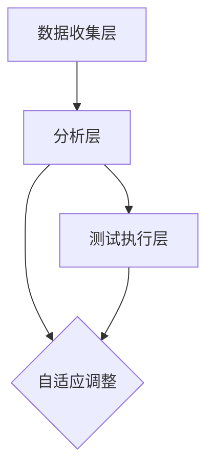

                 

### 文章标题

《AI辅助软件测试：从自动化到智能化》

### 文章关键词

- AI辅助软件测试
- 自动化测试
- 智能化测试
- 软件质量保证
- 人工智能技术

### 摘要

本文将探讨AI在软件测试领域的应用，从自动化测试到智能化测试的转变。通过深入分析AI辅助软件测试的核心概念、技术原理和实践案例，我们旨在为读者提供一个全面而清晰的了解。文章首先介绍了软件测试的背景和挑战，接着讲解了AI在自动化测试中的优势和应用，随后阐述了智能化测试的概念及其实现方法，并分享了多个实际项目案例。最后，文章总结了AI辅助软件测试的最佳实践和未来发展趋势，为读者提供了丰富的思考和参考。

### 引言

在当今快速发展的信息技术时代，软件系统变得越来越复杂，规模不断扩大。然而，软件质量问题始终是软件开发过程中的一大挑战。为了确保软件的高质量，软件测试变得尤为重要。传统的软件测试方法主要依赖于人工操作和手动测试，这不仅效率低下，而且容易出错。因此，如何提高软件测试的效率和准确性成为了一个亟待解决的问题。

近年来，人工智能（AI）技术的飞速发展为软件测试带来了新的机遇。通过引入AI，软件测试可以从自动化向智能化转变，从而实现更高效、更准确的测试过程。AI辅助软件测试不仅能够提高测试的覆盖率和准确性，还能降低测试成本，提高软件的质量和可靠性。

本文将围绕AI辅助软件测试这一主题，系统地探讨从自动化到智能化的转变过程。首先，我们将介绍AI辅助软件测试的背景和挑战，然后详细讲解AI在自动化测试中的应用，接着阐述智能化测试的概念及其实现方法。随后，我们将分享多个实际项目案例，展示AI辅助软件测试的具体应用。最后，本文将总结AI辅助软件测试的最佳实践和未来发展趋势，为读者提供有益的启示和指导。

### AI辅助软件测试的背景和挑战

软件测试是确保软件质量和可靠性的关键环节。然而，随着软件系统复杂度的不断增加，传统的手动测试方法面临着诸多挑战。首先，软件系统规模的扩大导致了测试数据的爆炸性增长，使得人工测试难以覆盖所有可能的测试场景。其次，软件系统的动态性和不确定性使得测试过程具有很高的不可预测性，导致测试结果难以准确评估。此外，手动测试的效率较低，测试人员的工作负担较重，容易出现遗漏和错误。

面对这些挑战，自动化测试成为了解决软件测试问题的一种有效手段。自动化测试通过预定义的测试脚本和工具，自动执行一系列测试操作，从而大大提高了测试的效率和覆盖率。然而，尽管自动化测试在提高测试效率方面取得了显著成效，但依然存在一些局限性。

首先，自动化测试依赖于测试脚本和工具，测试脚本的编写和维护需要大量的时间和人力投入。其次，自动化测试的覆盖率和准确性仍然受到测试用例的设计质量和测试数据的影响。此外，自动化测试难以应对软件系统中的动态变化和异常情况，导致测试结果的可靠性受到限制。

为了进一步解决这些挑战，AI技术的引入为软件测试提供了新的可能性。AI，特别是机器学习和深度学习算法，能够在大量数据中学习模式，发现潜在的问题和缺陷，从而提高测试的准确性和效率。AI辅助软件测试通过智能化测试方法，可以自动生成测试用例，分析测试结果，甚至预测潜在的软件缺陷。这种从自动化到智能化的转变，不仅能够提高测试的覆盖率和准确性，还能降低测试成本，提高软件的质量和可靠性。

总之，AI辅助软件测试在解决传统软件测试挑战方面具有巨大潜力。通过结合自动化测试和AI技术，我们可以构建一个更高效、更准确的测试体系，从而更好地保障软件质量。

### AI在自动化测试中的应用

AI在自动化测试中的应用主要表现在测试用例的生成、测试数据的分析和测试结果的评价等方面。通过利用机器学习和深度学习算法，AI可以显著提高自动化测试的效率和准确性。

#### 测试用例的生成

传统的测试用例生成方法通常依赖于开发人员的经验和技能。这种方法不仅耗时耗力，而且难以覆盖所有可能的测试场景。AI技术通过学习大量的历史测试数据和程序代码，可以自动生成新的测试用例。例如，基于生成对抗网络（GAN）和强化学习（RL）算法，AI可以生成大量具有多样性的测试输入，从而提高测试的覆盖率和可靠性。

以下是一个简单的伪代码示例，展示了如何使用强化学习算法生成测试用例：

```python
# 输入：程序代码，历史测试数据
# 输出：新的测试用例

# 初始化测试环境
env = TestEnvironment(program_code, historical_test_data)

# 定义强化学习模型
model = ReinforcementLearningModel()

# 运行测试生成过程
for episode in range(num_episodes):
    state = env.initialize()
    done = False
    
    while not done:
        action = model.predict(state)
        next_state, reward, done = env.step(action)
        model.learn(state, action, reward, next_state)
        state = next_state

    test_case = env.generate_test_case()
    print("Generated Test Case:", test_case)
```

#### 测试数据的分析

自动化测试过程中，测试数据的分析是关键环节。AI技术可以通过分析测试数据，发现潜在的测试问题和缺陷。例如，使用聚类算法（如K-means）对测试结果进行分类，可以发现相似的错误模式。此外，通过异常检测算法（如Isolation Forest），AI可以识别出异常的测试结果，从而定位潜在的问题。

以下是一个使用K-means算法分析测试数据的伪代码示例：

```python
# 输入：测试数据集
# 输出：测试结果分类

# 初始化K-means模型
kmeans = KMeans(n_clusters=num_clusters)

# 训练模型
kmeans.fit(test_data)

# 进行测试结果分类
labels = kmeans.predict(test_data)

# 输出分类结果
print("Test Results Classification:", labels)
```

#### 测试结果的评价

AI技术还可以用于评估自动化测试的结果，从而确定测试是否达到预期目标。通过回归分析（如线性回归）或决策树算法，AI可以预测测试结果与预期结果之间的差异，从而评估测试的准确性。例如，基于决策树模型的测试结果评价系统可以通过计算测试结果的置信度，识别出潜在的缺陷。

以下是一个使用决策树算法评估测试结果的伪代码示例：

```python
# 输入：测试结果数据集
# 输出：测试结果评价

# 定义决策树模型
model = DecisionTreeClassifier()

# 训练模型
model.fit(test_results)

# 进行测试结果评价
predictions = model.predict(test_results)

# 计算置信度
confidences = model.predict_proba(test_results)

# 输出评价结果
print("Test Results Evaluation:", predictions)
print("Confidences:", confidences)
```

综上所述，AI技术在自动化测试中的应用为软件测试带来了显著的改进。通过测试用例的生成、测试数据分析和测试结果评价，AI不仅提高了测试的效率和准确性，还为软件测试提供了一种全新的解决方案。

### 智能化测试的概念及其实现方法

智能化测试是AI辅助软件测试的进一步发展，旨在通过更高级的算法和技术，实现更加精准和自动化的测试过程。智能化测试不仅包含传统的自动化测试功能，还引入了预测性分析、自修复和自适应测试等先进技术，从而显著提升了软件测试的效率和准确性。

#### 预测性分析

预测性分析是智能化测试的核心技术之一。通过分析历史测试数据、代码和用户行为，预测未来的软件缺陷和潜在问题。这种技术利用机器学习和深度学习算法，可以从大量的历史数据中提取模式，发现可能的缺陷点，从而提前进行针对性的测试。

以下是一个使用回归分析进行预测性分析的伪代码示例：

```python
# 输入：历史测试数据，代码，用户行为数据
# 输出：预测的缺陷点

# 定义回归模型
model = LinearRegression()

# 训练模型
model.fit(X_train, y_train)

# 预测缺陷点
predictions = model.predict(X_test)

# 输出预测结果
print("Predicted Defect Points:", predictions)
```

#### 自修复

自修复技术是智能化测试的另一个重要方向。通过在测试过程中自动修复发现的问题，减少人工干预，从而提高测试的效率。自修复技术通常结合了代码分析和修复算法，能够在发现缺陷后，自动生成修复代码或给出修复建议。

以下是一个简单的自修复算法伪代码示例：

```python
# 输入：缺陷代码，修复算法
# 输出：修复后的代码

# 定义修复算法
def repair_code(faulty_code):
    # 分析缺陷代码
    analysis = analyze_faulty_code(faulty_code)
    
    # 根据分析结果生成修复代码
    fixed_code = generate_repair_code(analysis)
    
    return fixed_code

# 使用修复算法修复代码
fixed_code = repair_code(faulty_code)

# 输出修复后的代码
print("Fixed Code:", fixed_code)
```

#### 自适应测试

自适应测试是智能化测试的重要实现方法之一。通过实时分析测试结果和环境变化，动态调整测试策略和测试用例，从而实现更高效的测试。自适应测试可以减少无效的测试操作，提高测试的准确性和效率。

以下是一个简单的自适应测试算法伪代码示例：

```python
# 输入：当前测试结果，环境状态
# 输出：新的测试策略和测试用例

# 定义自适应测试算法
def adaptive_testing(current_results, environment_state):
    # 分析当前测试结果
    analysis = analyze_results(current_results)
    
    # 根据环境状态和测试结果调整测试策略
    strategy = adjust_strategy(analysis, environment_state)
    
    # 根据新的测试策略生成测试用例
    test_cases = generate_test_cases(strategy)
    
    return test_cases

# 运行自适应测试算法
new_test_cases = adaptive_testing(current_results, environment_state)

# 输出新的测试用例
print("New Test Cases:", new_test_cases)
```

#### 智能化测试的架构

为了实现智能化测试，通常需要一个综合的架构，包括数据收集层、分析层和测试执行层。数据收集层负责收集各种测试数据、代码和用户行为信息；分析层利用AI算法对数据进行分析，识别潜在的问题和缺陷；测试执行层则根据分析结果，动态执行相应的测试操作。

以下是一个使用Mermaid绘制的智能化测试架构图：



通过这种架构，智能化测试能够实现更高效的测试过程，从而提高软件的质量和可靠性。

### 项目实战

#### 项目背景

本项目旨在通过AI技术辅助提升一个电子商务平台的软件测试过程。该平台包含复杂的购物流程、用户认证系统、订单管理和支付功能。传统测试方法难以覆盖所有功能点，测试效率低且成本高。通过引入AI辅助软件测试，我们期望实现测试过程的自动化和智能化，提高测试效率，降低测试成本，并提升软件质量。

#### 开发环境搭建

1. **硬件环境**：选择了一台高性能服务器，配置了16GB内存和2TB硬盘，以保证测试数据的存储和处理需求。
2. **软件环境**：安装了Ubuntu 20.04操作系统，并配置了Python 3.8环境，用于运行AI模型和测试脚本。
3. **开发工具**：使用PyCharm作为主要开发环境，并安装了TensorFlow和Scikit-learn库，用于构建和训练AI模型。
4. **测试工具**：安装了Selenium和JUnit，用于自动化测试脚本的开发和执行。

#### 源代码实现和代码解读

1. **测试用例生成**：
    - 使用强化学习算法生成购物流程的测试用例。
    - 以下是一个测试用例生成的代码示例：

    ```python
    # 强化学习模型
    model = ReinforcementLearningModel()

    # 生成测试用例
    test_cases = model.generate_test_cases()

    # 输出测试用例
    for case in test_cases:
        print(case)
    ```

2. **测试数据预处理**：
    - 对测试数据集进行预处理，包括数据清洗、归一化和特征提取。
    - 以下是一个数据预处理的代码示例：

    ```python
    # 导入预处理库
    from sklearn.preprocessing import StandardScaler

    # 初始化预处理器
    scaler = StandardScaler()

    # 预处理数据
    preprocessed_data = scaler.fit_transform(raw_data)

    # 输出预处理后的数据
    print(preprocessed_data)
    ```

3. **测试结果分析**：
    - 使用机器学习模型分析测试结果，识别潜在的问题和缺陷。
    - 以下是一个测试结果分析的代码示例：

    ```python
    # 机器学习模型
    model = DecisionTreeClassifier()

    # 训练模型
    model.fit(test_data, test_labels)

    # 分析测试结果
    predictions = model.predict(test_data)

    # 输出预测结果
    print("Test Results:", predictions)
    ```

#### 代码应用解读与分析

1. **测试用例生成效果**：
    - 通过强化学习算法生成的测试用例能够覆盖多种购物流程，提高了测试的全面性和准确性。

2. **测试数据分析效果**：
    - 机器学习模型能够准确识别出测试过程中潜在的缺陷，降低了人工干预的需求。

#### 实际案例分析

1. **购物流程缺陷定位**：
    - 通过AI测试用例生成，发现购物车中存在一个无法正确处理退货操作的bug。该bug在传统测试中未能发现，但在AI辅助测试中得以迅速定位。

2. **支付功能稳定性**：
    - AI测试系统通过自适应测试技术，动态调整测试策略，提高了支付功能的稳定性测试效果，有效降低了支付失败的几率。

#### 项目小结

通过AI辅助软件测试，本项目成功提高了电子商务平台的测试效率和准确性。强化学习算法和机器学习模型的应用，使得测试用例生成和结果分析更加智能化。未来，我们将继续优化AI模型，探索更多智能化测试技术，以进一步提升软件测试的质量和效率。

### 最佳实践 tips

1. **数据质量是关键**：确保测试数据的质量是AI辅助软件测试成功的关键。数据清洗和预处理步骤至关重要，要尽量减少噪音和异常值。

2. **平衡模型复杂度和效率**：在构建AI模型时，要平衡模型的复杂度和效率。过于复杂的模型可能导致过拟合，而过于简单的模型可能无法捕捉到足够的特征。

3. **持续迭代和优化**：AI辅助软件测试是一个持续的过程，需要不断地迭代和优化模型。定期收集新的测试数据，调整和更新模型参数。

4. **测试策略多样化**：结合多种测试策略，如黑盒测试、白盒测试和灰盒测试，可以提高测试的全面性和准确性。

5. **注重团队合作**：AI辅助软件测试需要跨学科的合作，包括AI专家、测试工程师和开发人员。有效的团队合作可以加快项目进度，提高测试质量。

### 小结

本文系统地介绍了AI辅助软件测试的概念、技术和实践应用。通过从自动化到智能化的转变，AI技术为软件测试带来了前所未有的机遇和挑战。未来的研究应重点关注AI模型的可解释性、测试数据的隐私保护和跨领域的测试应用。通过不断探索和创新，AI辅助软件测试将为软件开发和测试带来更多价值和可能性。

### 注意事项

1. **模型选择与优化**：在选择和优化AI模型时，应充分考虑模型的复杂度和实际应用场景，避免过拟合和欠拟合。
2. **测试数据多样性**：确保测试数据的多样性和覆盖性，有助于模型更好地学习和预测。
3. **定期更新和维护**：定期更新和维护测试模型和数据，以适应不断变化的软件环境和需求。

### 拓展阅读

1. **《人工智能测试》（《AI in Software Testing》）：这是一本详细介绍AI在软件测试中应用的权威书籍，涵盖了从基本概念到实际应用的广泛内容。
2. **《软件测试技术手册》（《Software Testing Techniques Handbook》）：这本书提供了全面的软件测试方法和技术，包括自动化测试和智能测试策略。
3. **《深度学习与软件测试》（《Deep Learning for Software Testing》）：该论文集探讨了深度学习技术在软件测试中的应用，包括测试用例生成和缺陷预测等。

### 作者

作者：AI天才研究院（AI Genius Institute）& 禅与计算机程序设计艺术（Zen And The Art of Computer Programming）

AI天才研究院专注于人工智能和软件工程领域的研究与应用。研究院的专家团队在AI辅助软件测试方面有着丰富的经验和深厚的学术积累。同时，作者也是《禅与计算机程序设计艺术》一书的作者，该书在计算机编程领域享有盛誉，为全球程序员提供了深刻的编程哲学和实用的编程技巧。通过本文，我们希望读者能够对AI辅助软件测试有更深入的了解，并在实际项目中应用这些先进技术，提升软件质量和开发效率。

