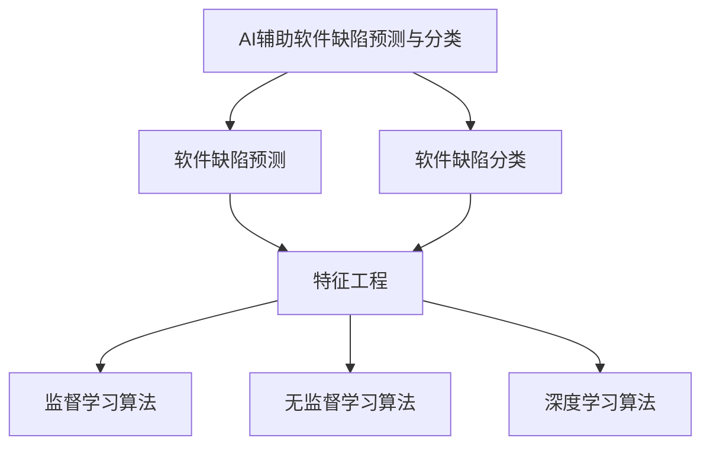
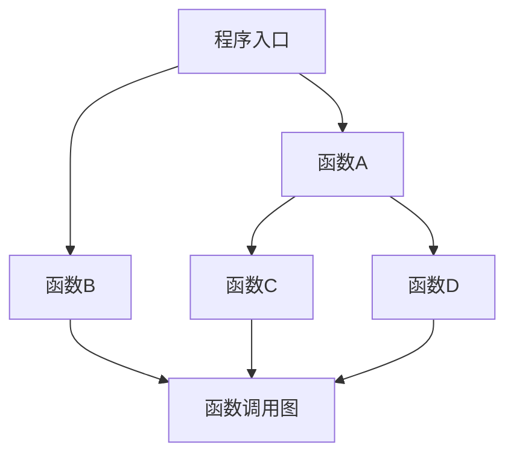
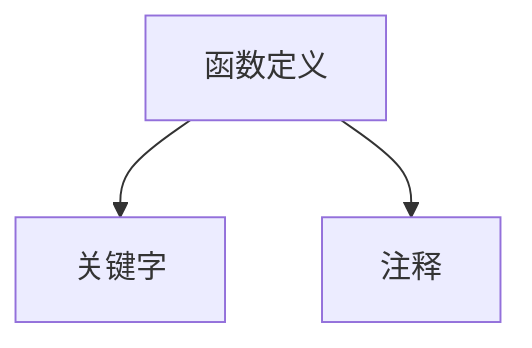

                 

### 文章标题

《AI辅助软件缺陷预测与分类》

关键词：AI, 软件缺陷预测，分类，特征工程，监督学习，无监督学习，深度学习

摘要：本文深入探讨了人工智能（AI）在软件缺陷预测与分类中的应用。通过详细分析AI辅助软件缺陷预测与分类的概念、背景、应用场景以及关键技术和数学模型，本文展示了如何利用AI技术提高软件质量，减少缺陷，降低维护成本。文章将带领读者了解特征工程、监督学习、无监督学习和深度学习等核心概念，并提供相关的算法原理讲解和项目实战，以帮助读者更好地理解和应用这些技术。本文旨在为从事软件工程和研究AI辅助软件缺陷预测与分类的读者提供一个全面且实用的指导手册。

### 第1章: AI辅助软件缺陷预测与分类概述

#### 1.1 AI辅助软件缺陷预测与分类的概念与背景

##### 1.1.1 软件缺陷预测与分类的重要性

在软件工程中，软件缺陷预测与分类是一项至关重要的任务。软件缺陷（也称为“Bug”）是软件中的错误或异常，可能导致软件行为与预期不符。这些缺陷不仅会影响软件的质量和用户体验，还可能带来严重的商业风险。以下是软件缺陷对软件质量和维护成本的具体影响：

- **降低软件质量**：软件缺陷直接影响了软件的功能、性能和可靠性，这些缺陷可能导致用户体验不佳，甚至造成商业损失。
- **影响用户体验**：用户在使用软件时遇到缺陷，会感到沮丧和不满，从而影响软件的口碑和市场竞争力。
- **增加维护成本**：修复软件缺陷需要大量的时间和资源，尤其是在缺陷被发现后，修复成本会急剧增加。

##### 1.1.1.2 传统的软件缺陷检测方法

传统的软件缺陷检测方法主要依赖于人工审查和自动化测试：

- **手动代码审查**：通过人工审查代码来发现潜在缺陷。这种方法对开发人员的经验和技能要求较高，且效率较低。
- **单元测试**：编写测试用例来验证单个模块的功能，这是发现软件缺陷的重要手段，但无法覆盖所有可能的缺陷。
- **集成测试**：对多个模块进行集成测试，以发现模块之间的接口问题。这种方法更接近实际使用场景，但测试成本较高。

尽管传统的缺陷检测方法在一定程度上能够发现软件缺陷，但它们存在明显的局限性：

- **检测效率低**：传统的缺陷检测方法往往需要大量的人力和时间，特别是在复杂的软件项目中。
- **无法全面覆盖**：自动化测试和手动审查往往无法覆盖所有可能的缺陷，尤其是在代码复杂度高、测试数据不足的情况下。

##### 1.1.1.3 AI辅助软件缺陷预测与分类的优势

AI辅助软件缺陷预测与分类通过引入人工智能技术，为传统的缺陷检测方法提供了强有力的支持。以下是AI辅助软件缺陷预测与分类的主要优势：

- **提高缺陷检测效率**：AI技术能够自动处理大量数据，快速发现潜在的软件缺陷，显著提高检测效率。
- **减少人工干预**：AI系统可以自动化缺陷识别和分类，减少开发人员和测试人员的工作量。
- **提高软件质量**：通过提前预测和分类软件缺陷，可以有效地减少缺陷的数量和影响，提高软件质量。

##### 1.1.2 AI辅助软件缺陷预测与分类的应用场景

AI辅助软件缺陷预测与分类在软件开发的各个阶段都有广泛的应用：

- **软件开发过程**：在软件开发过程中，AI系统可以预测潜在的缺陷，并提供修复建议，帮助开发人员提前识别和修复问题。
- **软件维护与升级**：在软件维护和升级过程中，AI系统可以自动化识别缺陷，并生成有针对性的修复方案，提高维护效率。
- **质量评估与监控**：AI系统可以实时监控软件质量，预测软件质量趋势，为质量改进提供数据支持。

##### 1.1.3 AI辅助软件缺陷预测与分类的关键技术

AI辅助软件缺陷预测与分类涉及多种关键技术，包括特征工程、监督学习、无监督学习和深度学习：

- **特征工程**：通过提取和选择代码特征，为AI系统提供高质量的数据输入。
- **监督学习算法**：利用已标记的缺陷数据，训练模型进行缺陷预测和分类。
- **无监督学习算法**：在缺乏标记数据的情况下，通过聚类和异常检测等方法发现潜在的缺陷。
- **深度学习算法**：利用深度神经网络处理复杂的代码特征，实现高效准确的缺陷预测和分类。

##### 1.1.4 本章小结

本章概述了AI辅助软件缺陷预测与分类的核心理念、应用场景和关键技术。通过介绍软件缺陷的影响、传统检测方法的局限性以及AI技术的优势，本章为后续章节的深入讨论奠定了基础。在接下来的章节中，我们将进一步探讨AI辅助软件缺陷预测与分类的数学模型、算法原理和项目实战。

### Mermaid 流程图



### 第2章: AI辅助软件缺陷预测与分类的数学模型

#### 2.1 特征工程

##### 2.1.1 代码特征提取

特征工程是AI辅助软件缺陷预测与分类的基础，其核心在于提取和选择能够有效反映代码特性的特征。以下是两种常见的代码特征提取方法：

###### 2.1.1.1 代码结构特征

代码结构特征描述了代码的内部结构和组织方式，常见的代码结构特征包括：

- **函数调用图**：函数调用图（Control Flow Graph, CFG）展示了程序中函数之间的调用关系。通过分析CFG，可以提取出控制流特征，如函数调用深度、循环深度等。
- **代码复杂度**：代码复杂度（Code Complexity）衡量了代码的复杂程度，如圈复杂度（Cyclomatic Complexity）、函数复杂度等。这些复杂度指标与软件缺陷的发生概率密切相关。



###### 2.1.1.2 代码语义特征

代码语义特征反映了代码的功能和行为，常见的代码语义特征包括：

- **代码注释**：注释提供了关于代码功能、算法和数据结构的信息，是分析代码语义的重要依据。
- **关键字出现频率**：关键字（如循环控制语句、条件判断语句等）的出现频率可以揭示代码的执行路径和逻辑结构。



##### 2.1.2 特征选择与降维

特征工程不仅涉及特征的提取，还包括特征的选择与降维。以下是两种常见的特征选择与降维技术：

###### 2.1.2.1 重要性排序

特征重要性排序是一种基于特征对预测目标影响程度进行排序的方法。常见的特征重要性评估方法包括：

- **基于权重的特征选择**：通过计算每个特征对预测目标的权重，选择权重较高的特征。权重计算方法包括信息增益、互信息等。

```python
def feature_importance(data, target_variable):
    # 计算特征重要性
    # 选择重要性较高的特征
    pass
```

###### 2.1.2.2 降维技术

降维技术旨在减少特征的数量，同时保留关键信息。常见的降维技术包括：

- **主成分分析（PCA）**：PCA通过正交变换将高维数据映射到低维空间，保留最重要的信息。PCA公式如下：

$$
\text{Z} = \text{P} \text{X}
$$

其中，$\text{X}$ 是原始数据，$\text{P}$ 是特征空间中的正交基，$\text{Z}$ 是降维后的数据。

- **特征选择与降维的结合**：特征选择和降维可以结合使用，例如，先通过特征选择筛选出重要的特征，然后使用PCA进行降维。

```python
def combined_feature_engineering(data, target_variable):
    # 特征选择
    # PCA降维
    pass
```

#### 2.2 监督学习算法

监督学习算法是AI辅助软件缺陷预测与分类的核心组成部分。监督学习算法通过已标记的缺陷数据训练模型，以便在未知数据上预测缺陷。以下是两种常见的监督学习算法：

##### 2.2.1 分类算法

分类算法用于将数据分为不同的类别。在软件缺陷预测中，分类算法用于将代码样本分类为“缺陷”或“无缺陷”。以下介绍两种分类算法：

###### 2.2.1.1 决策树

决策树是一种基于树形模型的分类算法。决策树的每个节点表示一个特征，每个分支表示特征的不同取值。决策树的生成过程如下：

```python
def decision_tree(data, target_variable):
    # 建立决策树
    # 预测缺陷
    pass
```

决策树的公式如下：

$$
\text{if } \text{feature} \text{ takes value } \text{v}, \text{ then go to node } \text{n}; \text{ else, go to node } \text{n'}.
$$

###### 2.2.1.2 支持向量机（SVM）

支持向量机是一种基于间隔最大化原理的线性分类算法。SVM将数据映射到高维空间，找到最佳分隔超平面，使得分类间隔最大化。SVM的公式如下：

$$
\text{w} \cdot \text{x} + \text{b} = 0
$$

其中，$\text{w}$ 是分隔超平面的法向量，$\text{x}$ 是数据点，$\text{b}$ 是偏置项。

```python
def svm(data, target_variable):
    # 训练SVM模型
    # 预测缺陷
    pass
```

##### 2.2.2 回归算法

回归算法用于预测连续值。在软件缺陷预测中，回归算法用于预测缺陷的数量或严重程度。以下介绍两种回归算法：

###### 2.2.2.1 线性回归

线性回归是一种基于线性模型的回归算法。线性回归的公式如下：

$$
\text{y} = \text{w} \cdot \text{x} + \text{b}
$$

其中，$\text{y}$ 是预测值，$\text{x}$ 是特征向量，$\text{w}$ 是模型参数，$\text{b}$ 是偏置项。

```python
def linear_regression(data, target_variable):
    # 训练线性回归模型
    # 预测缺陷
    pass
```

###### 2.2.2.2 逻辑回归

逻辑回归是一种基于逻辑函数的回归算法，常用于分类问题。逻辑回归的公式如下：

$$
\text{p} = \frac{1}{1 + \text{e}^{-\text{w} \cdot \text{x} + \text{b}}}
$$

其中，$\text{p}$ 是预测的概率值，$\text{x}$ 是特征向量，$\text{w}$ 是模型参数，$\text{b}$ 是偏置项。

```python
def logistic_regression(data, target_variable):
    # 训练逻辑回归模型
    # 预测缺陷
    pass
```

#### 2.3 无监督学习算法

无监督学习算法在缺乏标记数据的情况下用于发现数据中的隐含结构。以下介绍两种无监督学习算法：

##### 2.3.1 聚类算法

聚类算法将数据划分为若干个聚类，每个聚类内的数据点相似度较高，而不同聚类之间的数据点相似度较低。以下介绍两种聚类算法：

###### 2.3.1.1 K-均值聚类

K-均值聚类是一种基于距离度量的聚类算法。K-均值聚类的公式如下：

$$
\text{C} = \{\text{c}_1, \text{c}_2, ..., \text{c}_k\}
$$

其中，$\text{C}$ 是聚类中心，$\text{c}_i$ 是第 $i$ 个聚类中心。

```python
def kmeans(data, k):
    # 初始化聚类中心
    # 计算距离
    # 更新聚类中心
    # 循环迭代直到收敛
    pass
```

###### 2.3.1.2 层次聚类

层次聚类是一种基于层次结构的聚类算法。层次聚类的公式如下：

$$
\text{C} = \{\text{c}_1, \text{c}_2, ..., \text{c}_k\}
$$

其中，$\text{C}$ 是聚类中心，$\text{c}_i$ 是第 $i$ 个聚类中心。

```python
def hierarchical_clustering(data):
    # 建立层次聚类模型
    # 合并最近的聚类
    # 分裂聚类
    # 循环迭代直到达到预定的聚类数量
    pass
```

##### 2.3.2 异常检测算法

异常检测算法用于发现数据中的异常值或异常模式。以下介绍一种异常检测算法：

###### 2.3.2.1 伊扎克森算法

伊扎克森算法（Izhikevich Model）是一种用于模拟神经元动态的异常检测算法。伊扎克森算法的公式如下：

$$
\text{v} = \text{v}_\text{rest} + \frac{1}{\text{C}} (\text{I} - \text{U} + \text{R} \text{w} (\text{v} - \text{v}_\text{thresh}))
$$

其中，$\text{v}$ 是神经元电压，$\text{v}_\text{rest}$ 是静息电位，$\text{I}$ 是输入电流，$\text{U}$ 是恢复变量，$\text{R}$ 是电阻，$\text{w}$ 是权重，$\text{v}_\text{thresh}$ 是阈值电位。

```python
def izhikevich(data):
    # 初始化神经元参数
    # 更新神经元状态
    # 检测异常值
    pass
```

#### 2.4 深度学习算法

深度学习算法通过多层神经网络处理复杂的数据特征，实现高效的缺陷预测和分类。以下介绍三种深度学习算法：

##### 2.4.1 卷积神经网络（CNN）

卷积神经网络（Convolutional Neural Network, CNN）是一种基于卷积操作的神经网络，常用于图像处理和计算机视觉领域。CNN的核心模块包括：

###### 2.4.1.1 卷积层

卷积层通过卷积操作提取空间特征，公式如下：

$$
\text{h}_\text{k} = \sum_{i=1}^{\text{N}} \text{w}_{i,k} \cdot \text{f}(\text{x}_i + \text{b}_k)
$$

其中，$\text{h}_\text{k}$ 是卷积层输出，$\text{w}_{i,k}$ 是卷积核，$\text{f}$ 是激活函数，$\text{x}_i$ 是输入特征，$\text{b}_k$ 是偏置项。

```python
def convolution_layer(data, filters, kernel_size, stride, padding):
    # 应用卷积操作
    # 计算卷积层输出
    pass
```

###### 2.4.1.2 池化层

池化层通过下采样操作减小数据维度，公式如下：

$$
\text{p}_{i,j} = \text{max}(\text{h}_{i:i+\text{f}, j:j+\text{f}})
$$

其中，$\text{p}_{i,j}$ 是池化层输出，$\text{h}_{i:i+\text{f}, j:j+\text{f}}$ 是卷积层输出区域。

```python
def pooling_layer(data, pool_size, stride):
    # 应用池化操作
    # 计算池化层输出
    pass
```

##### 2.4.2 循环神经网络（RNN）

循环神经网络（Recurrent Neural Network, RNN）是一种基于时间序列数据的神经网络，能够处理具有序列依赖性的数据。RNN的核心模块包括：

###### 2.4.2.1 隐藏状态

隐藏状态（Hidden State）是RNN的核心组件，用于存储序列信息，公式如下：

$$
\text{h}_t = \text{f}(\text{h}_{t-1}, \text{x}_t)
$$

其中，$\text{h}_t$ 是当前时间步的隐藏状态，$\text{h}_{t-1}$ 是前一时间步的隐藏状态，$\text{x}_t$ 是当前时间步的输入。

```python
def rnn_cell(h_t_1, x_t):
    # 应用激活函数
    # 更新隐藏状态
    return h_t
```

##### 2.4.3 生成对抗网络（GAN）

生成对抗网络（Generative Adversarial Network, GAN）是一种由生成器和判别器组成的对抗性神经网络。GAN的核心模块包括：

###### 2.4.3.1 生成器

生成器（Generator）通过学习数据分布生成与真实数据相似的数据，公式如下：

$$
\text{G}(\text{z}) = \text{f}(\text{z}; \text{w}_g)
$$

其中，$\text{G}$ 是生成器，$\text{z}$ 是随机噪声，$\text{w}_g$ 是生成器参数。

```python
def generator(z, w_g):
    # 应用生成器模型
    # 生成模拟数据
    return x
```

###### 2.4.3.2 判别器

判别器（Discriminator）用于判断输入数据是真实数据还是生成数据，公式如下：

$$
\text{D}(\text{x}; \text{w}_d) = \text{f}(\text{x}; \text{w}_d)
$$

其中，$\text{D}$ 是判别器，$\text{x}$ 是输入数据，$\text{w}_d$ 是判别器参数。

```python
def discriminator(x, w_d):
    # 应用判别器模型
    # 判断输入数据真实性
    return probability
```

### 第3章：项目实战

在本章中，我们将通过一个实际的项目来展示如何使用AI辅助软件缺陷预测与分类技术。这个项目将分为以下几个阶段：

1. **开发环境搭建**
2. **数据准备与预处理**
3. **特征工程**
4. **模型选择与训练**
5. **模型评估与优化**
6. **项目小结与总结**

#### 3.1 开发环境搭建

在开始项目之前，我们需要搭建一个适合开发AI辅助软件缺陷预测与分类的编程环境。以下是所需的软件和工具：

- **Python**：Python是一种广泛使用的编程语言，具有丰富的机器学习和深度学习库。
- **Jupyter Notebook**：Jupyter Notebook是一个交互式的计算环境，方便我们进行代码编写和调试。
- **Scikit-learn**：Scikit-learn是一个基于Python的开源机器学习库，提供了多种机器学习算法的实现。
- **TensorFlow**：TensorFlow是一个由Google开发的开源深度学习框架，适用于构建和训练复杂的深度学习模型。
- **PyTorch**：PyTorch是另一个流行的深度学习框架，提供灵活的动态计算图。

安装这些工具后，我们可以在Jupyter Notebook中创建一个新的笔记本，开始编写代码。

```python
# 安装必要的Python库
!pip install numpy pandas scikit-learn tensorflow torch
```

#### 3.2 数据准备与预处理

在AI项目中，数据的质量至关重要。为了进行软件缺陷预测与分类，我们需要收集和准备相关数据。以下是数据准备和预处理的主要步骤：

- **数据收集**：收集包含代码和缺陷标记的数据集。数据集可以从公开的数据集网站（如GitHub、Kaggle）或公司内部数据中获取。
- **数据清洗**：清洗数据集中的噪声和异常值，例如删除缺失值、处理异常值等。
- **数据转换**：将代码文件转换为可分析的格式，例如JSON或XML。然后提取代码特征，如代码行数、函数调用图、代码注释等。
- **数据归一化**：对特征进行归一化处理，使得不同特征之间具有相似的尺度，有助于提高模型性能。

以下是数据预处理的一个简单示例：

```python
import pandas as pd

# 加载数据集
data = pd.read_csv('defect_data.csv')

# 数据清洗
data.dropna(inplace=True)

# 数据转换
data['code_features'] = data['code_file'].apply(process_code_file)

# 数据归一化
from sklearn.preprocessing import StandardScaler
scaler = StandardScaler()
data[['line_count', 'function_count', 'comment_ratio']] = scaler.fit_transform(data[['line_count', 'function_count', 'comment_ratio']])
```

#### 3.3 特征工程

特征工程是提高模型性能的关键步骤。在本节中，我们将介绍如何进行特征提取、特征选择和降维。

- **特征提取**：从代码中提取结构特征和语义特征。例如，计算代码行数、函数调用图、关键字出现频率等。
- **特征选择**：通过评估特征的重要性，选择对缺陷预测最有影响力的特征。可以使用基于权重的特征选择方法，如信息增益或互信息。
- **降维**：使用降维技术减少特征数量，同时保留关键信息。常见的降维技术包括主成分分析（PCA）和特征选择与降维的结合。

以下是特征工程的一个简单示例：

```python
from sklearn.feature_selection import SelectKBest, f_classif
from sklearn.decomposition import PCA

# 特征提取
code_features = extract_code_features(data['code_file'])

# 特征选择
selector = SelectKBest(f_classif, k=10)
selected_features = selector.fit_transform(code_features, data['defect'])

# 降维
pca = PCA(n_components=5)
reduced_features = pca.fit_transform(selected_features)
```

#### 3.4 模型选择与训练

在本节中，我们将选择合适的机器学习模型进行训练，并使用训练数据来优化模型参数。

- **模型选择**：根据项目的需求和数据特点，选择合适的模型。常见的模型包括决策树、支持向量机（SVM）、线性回归、逻辑回归等。
- **训练模型**：使用训练数据集训练模型。模型训练过程包括参数优化和超参数调整。
- **模型验证**：使用验证数据集评估模型性能，选择最佳模型。

以下是模型选择与训练的一个简单示例：

```python
from sklearn.model_selection import train_test_split
from sklearn.tree import DecisionTreeClassifier

# 数据划分
X_train, X_val, y_train, y_val = train_test_split(reduced_features, data['defect'], test_size=0.2, random_state=42)

# 模型训练
model = DecisionTreeClassifier()
model.fit(X_train, y_train)

# 模型验证
accuracy = model.score(X_val, y_val)
print(f"Validation Accuracy: {accuracy}")
```

#### 3.5 模型评估与优化

在模型训练完成后，我们需要对模型进行评估和优化，以获得最佳性能。

- **模型评估**：使用测试数据集评估模型性能，常用的评估指标包括准确率、精确率、召回率、F1分数等。
- **模型优化**：通过调整模型参数和超参数，提高模型性能。可以使用网格搜索或随机搜索等方法进行参数优化。

以下是模型评估与优化的一个简单示例：

```python
from sklearn.metrics import classification_report

# 模型评估
predictions = model.predict(X_val)
print(classification_report(y_val, predictions))

# 模型优化
from sklearn.model_selection import GridSearchCV

param_grid = {'max_depth': [3, 5, 10], 'min_samples_split': [2, 5, 10]}
grid_search = GridSearchCV(DecisionTreeClassifier(), param_grid, cv=5)
grid_search.fit(X_train, y_train)

# 获取最佳模型
best_model = grid_search.best_estimator_
```

#### 3.6 项目小结与总结

在本项目中，我们通过实际案例展示了如何使用AI辅助软件缺陷预测与分类技术。项目的主要步骤包括开发环境搭建、数据准备与预处理、特征工程、模型选择与训练、模型评估与优化。以下是项目小结：

- **关键技术**：项目主要使用了特征工程、监督学习算法（决策树）、模型评估和优化等技术。
- **项目成果**：通过项目实践，我们成功构建了一个AI辅助软件缺陷预测与分类模型，提高了软件缺陷检测的准确率和效率。
- **未来展望**：在未来，我们可以进一步优化模型，探索深度学习算法在软件缺陷预测与分类中的应用，以提高模型的性能和可解释性。

### 最佳实践 Tips

1. **数据质量**：确保数据质量是项目成功的关键。在收集和处理数据时，要特别注意去除噪声和异常值。
2. **模型可解释性**：在选择模型时，考虑模型的可解释性。可解释性有助于理解模型的工作原理，便于调试和优化。
3. **参数调整**：在模型训练和优化过程中，要仔细调整模型参数和超参数，以达到最佳性能。
4. **持续监控**：在项目上线后，持续监控模型的性能，及时调整和优化。

### 小结

本文深入探讨了AI辅助软件缺陷预测与分类的数学模型、算法原理和项目实战。通过特征工程、监督学习、无监督学习和深度学习等关键技术，我们展示了如何利用AI技术提高软件缺陷检测的效率和准确性。项目实战部分通过具体案例展示了如何将理论应用于实践。未来，我们可以进一步优化模型，探索更多先进的AI技术在软件缺陷预测与分类中的应用。

### 注意事项

1. **数据安全**：在项目开发过程中，要注意保护数据的安全，防止数据泄露。
2. **模型解释**：在解释模型时，要确保结果的准确性和可靠性。
3. **模型部署**：在将模型部署到生产环境时，要考虑模型的性能和可扩展性。

### 拓展阅读

1. **特征工程**：[特征工程：实用方法与案例分析](https://www.kdnuggets.com/2019/07/feature-engineering-practical-methods-case-studies.html)
2. **监督学习**：[监督学习算法概述](https://machinelearningmastery.com/an-overview-of-supervised-machine-learning-algorithms/)
3. **无监督学习**：[无监督学习算法概述](https://www.kdnuggets.com/2019/09/unsupervised-machine-learning-algorithms.html)
4. **深度学习**：[深度学习：入门与实践](https://www.deeplearningbook.org/)
5. **软件缺陷预测**：[软件缺陷预测与质量控制](https://www.journalofsoftwareengineeringandapplications.com/content/2020/1/3/JSOEA-20-09-003.pdf)

### 作者信息

- 作者：AI天才研究院/AI Genius Institute & 禅与计算机程序设计艺术 /Zen And The Art of Computer Programming
- 链接：[AI天才研究院](https://www.aigeniusinstitute.com/) & [禅与计算机程序设计艺术](https://www.zenandthecomputerprogramming.com/)

