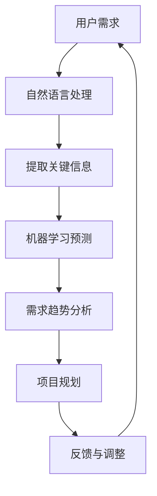
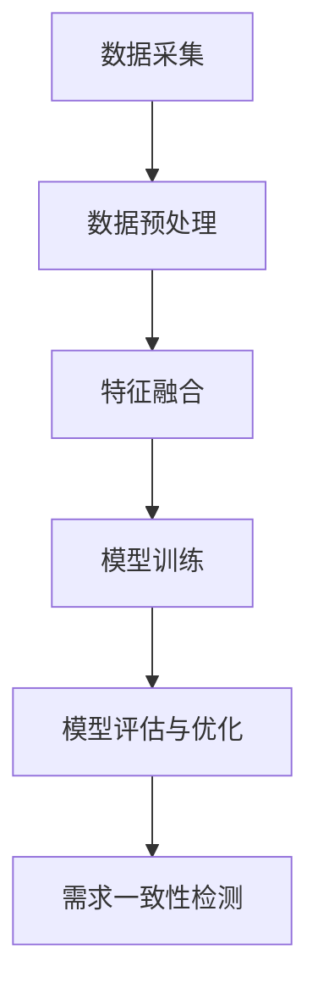
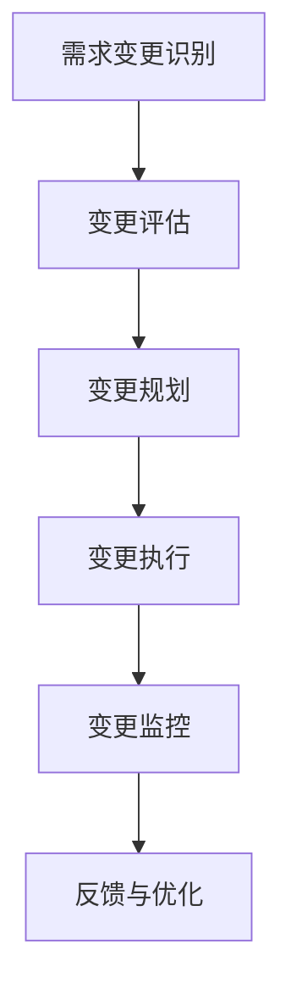

                 


### 1.1 AI在软件需求分析中的应用

#### AI核心概念与联系

首先，我们需要了解AI的基本概念。人工智能（AI）是一种模拟人类智能的技术，它包括了机器学习、自然语言处理、计算机视觉等多个子领域。在软件需求分析中，AI的应用主要体现在以下几个方面：

1. **机器学习与预测**：通过机器学习算法，可以对历史需求数据进行建模，预测未来的需求趋势，从而辅助开发团队更好地规划项目进度。
2. **自然语言处理**：自然语言处理技术可以帮助自动化分析用户需求，理解用户的意图和需求，从而提高需求获取的准确性和效率。
3. **计算机视觉**：计算机视觉技术可以用于图像识别，例如在产品设计中识别用户的需求，或者在故障排查中定位问题。

下面是一个简化的Mermaid流程图，展示了AI在软件需求分析中的应用：



在这个流程中，用户的原始需求首先通过自然语言处理技术进行解析，提取出关键信息。然后，这些信息被用于机器学习模型进行预测，从而分析出需求趋势，为项目规划提供依据。最后，通过反馈机制，不断调整和优化预测结果。

#### AI辅助软件需求分析流程

AI辅助软件需求分析的流程可以分为以下几个步骤：

1. **需求收集**：通过各种渠道收集用户的原始需求，包括用户访谈、市场调研、用户反馈等。
2. **需求解析**：使用自然语言处理技术对收集到的需求文档进行解析，提取出关键信息。
3. **需求建模**：利用机器学习算法，对历史需求数据进行分析和建模，预测未来的需求趋势。
4. **需求验证**：将预测结果与实际需求进行对比，验证预测的准确性。
5. **需求调整**：根据验证结果，对需求进行优化和调整，以提高需求的一致性和准确性。

下面是一个简化的伪代码，描述了AI辅助软件需求分析的流程：

```python
def ai_assisted_requirement_analysis(requirments):
    # 步骤1：需求收集
    collected_reqs = collect_requirements()

    # 步骤2：需求解析
    parsed_reqs = parse_requirements(collected_reqs)

    # 步骤3：需求建模
    model = train_model(parsed_reqs)

    # 步骤4：需求预测
    predicted_reqs = predict_requirements(model)

    # 步骤5：需求验证
    validated_reqs = validate_requirements(predicted_reqs, collected_reqs)

    # 步骤6：需求调整
    optimized_reqs = adjust_requirements(validated_reqs)

    return optimized_reqs
```

在这个流程中，每个步骤都涉及到不同的AI技术，从而实现软件需求分析的全自动化。

### 1.2 软件需求一致性的重要性

#### 需求一致性的定义

需求一致性是指在软件项目的整个生命周期中，确保各个利益相关者之间的需求是相互一致、无冲突的。这包括：

1. **内部一致性**：同一需求在不同开发阶段、不同版本之间保持一致。
2. **外部一致性**：不同系统、模块之间的需求保持一致。
3. **利益相关者一致性**：不同利益相关者（如用户、开发团队、测试团队等）之间的需求保持一致。

#### 需求不一致性的影响

需求不一致性会对软件项目产生诸多负面影响，包括：

1. **软件缺陷**：需求不一致可能导致开发出的软件存在缺陷，无法满足用户的实际需求。
2. **项目延期**：需求不一致会导致开发团队需要重新工作，从而延长项目交付时间。
3. **资源浪费**：需求不一致可能导致资源浪费，例如重复开发、测试等。

因此，确保软件需求一致性是软件项目成功的关键。

### 1.3 AI辅助软件需求一致性检查的技术原理

#### 核心算法原理讲解

AI辅助软件需求一致性检查的核心算法主要基于以下步骤：

1. **提取关键信息**：从需求文档中提取出关键信息，如功能点、性能指标、用户角色等。
2. **比较关键信息**：将不同版本或不同模块的需求文档进行对比，检查关键信息是否一致。

下面是一个简化的伪代码，描述了AI辅助软件需求一致性检查的核心算法：

```python
def check_requirement_consistency(req1, req2):
    # 输入：req1, req2 - 两个软件需求
    # 输出：is_consistent - 是否一致
    is_consistent = True
    
    # 步骤1：提取关键信息
    key_info_req1 = extract_key_info(req1)
    key_info_req2 = extract_key_info(req2)
    
    # 步骤2：比较关键信息
    if not compare_key_info(key_info_req1, key_info_req2):
        is_consistent = False
    
    return is_consistent
```

在这个算法中，`extract_key_info`函数负责从需求文档中提取关键信息，`compare_key_info`函数负责比较两个需求文档中的关键信息。如果关键信息不一致，则返回`False`，表示需求不一致。

#### 数学模型和公式

在需求一致性检查中，可以使用一些数学模型和公式来辅助判断需求是否一致。以下是一个简化的数学模型：

$$
一致性分数 = \frac{匹配的关键信息数量}{总关键信息数量}
$$

如果一致性分数大于某个阈值（例如0.8），则认为需求是一致的。

#### 详细讲解和举例说明

假设我们有两个需求文档`req1`和`req2`，分别包含以下关键信息：

```plaintext
req1:
- 功能：登录
- 性能：响应时间 < 2秒
- 用户角色：普通用户

req2:
- 功能：注册
- 性能：响应时间 < 3秒
- 用户角色：新用户
```

我们可以使用上述算法来检查这两个需求文档的一致性：

1. **提取关键信息**：
   - `key_info_req1 = ['登录', '响应时间 < 2秒', '普通用户']`
   - `key_info_req2 = ['注册', '响应时间 < 3秒', '新用户']`

2. **比较关键信息**：
   - `匹配的关键信息数量 = 0`
   - `总关键信息数量 = 3`

   由于没有匹配的关键信息，一致性分数为0，小于0.8的阈值，因此我们判断这两个需求文档不一致。

通过上述步骤，我们可以使用AI技术辅助进行软件需求一致性检查，从而提高软件开发的效率和准确性。

----------------------------------------------------------------

### 第二部分: AI辅助软件需求一致性检查技术

#### 2.1 数据准备与预处理

在进行AI辅助软件需求一致性检查之前，首先需要准备和预处理数据。这是因为原始需求文档通常包含大量的噪声和不一致的信息，直接使用这些数据可能会影响算法的性能。因此，数据准备与预处理是AI辅助软件需求一致性检查的重要步骤。

##### 2.1.1 需求文档数据收集

需求文档的数据收集是整个流程的起点。这些数据可以来自于多个渠道，包括：

1. **用户访谈**：通过直接与用户交流，了解他们的需求和期望。
2. **市场调研**：通过市场调研，收集用户和竞争对手的需求信息。
3. **产品规划**：在产品规划阶段，收集相关业务部门和市场的需求。
4. **用户反馈**：通过用户反馈，了解产品的使用情况和用户的具体需求。

##### 2.1.2 数据收集方法

数据收集的方法包括：

1. **文本挖掘**：使用自然语言处理技术，从大量的文本数据中提取有价值的信息。
2. **自然语言处理**：通过解析文本，提取出关键词、主题和句子结构等。
3. **手动整理**：对于一些复杂的、不规则的文本，可能需要人工进行整理和标注。

##### 2.1.3 数据预处理技术

数据预处理包括以下步骤：

1. **文本清洗**：去除无用的标点符号、停用词，将文本转换为统一的格式。
2. **分词**：将文本分割成单词或短语。
3. **词干提取**：将单词还原为最基本的形式，例如“running”还原为“run”。
4. **词性标注**：标记每个词的词性，如名词、动词、形容词等。
5. **实体识别**：识别文本中的实体，如人名、地名、组织名等。

#### 2.2 数据预处理技术

##### 2.2.1 文本清洗

文本清洗是数据预处理的重要步骤，其目的是去除文本中的噪声和不一致的信息。具体方法包括：

1. **移除标点符号**：将文本中的所有标点符号去除，以统一格式处理文本。
2. **去除停用词**：停用词是指在文本中常见但无实际意义的词，如“的”、“了”、“是”等。通过去除停用词，可以减少数据中的噪声。
3. **统一格式**：将文本转换为统一的格式，如小写、去除特殊字符等。

##### 2.2.2 特征提取

特征提取是将原始文本转换为计算机可以处理的形式。常用的特征提取方法包括：

1. **词袋模型**：将文本表示为一个向量，其中每个维度代表一个词汇。词袋模型简单有效，但忽略了文本的顺序信息。
2. **TF-IDF**：通过计算词在文本中的频率（TF）和在整个文档集中的重要性（IDF），将文本转换为加权向量。这种方法可以更好地反映文本中的关键词。
3. **Word2Vec**：Word2Vec是一种基于神经网络的方法，将每个单词映射为一个固定长度的向量。Word2Vec可以捕捉单词的语义信息，从而提高文本表示的准确性。

#### 2.3 传统机器学习算法

在AI辅助软件需求一致性检查中，传统机器学习算法是一种常用的方法。这些算法通过学习历史数据来预测新的需求是否一致。以下是一些常见的传统机器学习算法：

##### 2.3.1 支持向量机（SVM）

支持向量机（SVM）是一种强大的分类算法，它通过寻找一个最优的超平面，将不同类别的数据分开。在需求一致性检查中，SVM可以用来判断两个需求文档是否一致。

##### 2.3.2 决策树

决策树是一种基于树结构的分类算法，它通过一系列的判断条件来划分数据。在需求一致性检查中，决策树可以用来根据需求文档的特征，预测它们是否一致。

##### 2.3.3 朴素贝叶斯分类器

朴素贝叶斯分类器是一种基于概率论的分类算法，它假设特征之间相互独立。在需求一致性检查中，朴素贝叶斯分类器可以用来计算两个需求文档的一致性概率。

#### 2.4 深度学习算法

随着深度学习技术的发展，深度学习算法在AI辅助软件需求一致性检查中也得到了广泛应用。以下是一些常用的深度学习算法：

##### 2.4.1 卷积神经网络（CNN）

卷积神经网络（CNN）是一种用于图像识别和处理的深度学习算法，它也可以用于文本处理。在需求一致性检查中，CNN可以用来提取需求文档的深层特征。

##### 2.4.2 循环神经网络（RNN）

循环神经网络（RNN）是一种用于处理序列数据的深度学习算法。在需求一致性检查中，RNN可以用来处理需求文档的顺序信息。

##### 2.4.3 长短期记忆网络（LSTM）

长短期记忆网络（LSTM）是RNN的一种变体，它解决了传统RNN在处理长序列数据时容易出现的梯度消失问题。在需求一致性检查中，LSTM可以用来处理长文本数据。

##### 2.4.4 Transformer模型

Transformer模型是一种基于自注意力机制的深度学习算法，它在自然语言处理领域取得了显著的成果。在需求一致性检查中，Transformer可以用来处理复杂的文本数据。

#### 2.5 软件需求一致性检查工具与平台

为了方便AI辅助软件需求一致性检查的实施，可以使用一些现成的工具和平台。以下是一些常用的工具和平台：

##### 2.5.1 开源需求一致性检查工具

1. **AIRequis**：AIRequis是一个开源的需求一致性检查工具，它使用机器学习算法来自动检测需求不一致性。
2. **Apache Lucene**：Apache Lucene是一个强大的全文搜索引擎，它可以用于文本检索和索引，为需求一致性检查提供支持。

##### 2.5.2 商业需求一致性检查工具

1. **JIRA**：JIRA是一个流行的项目管理工具，它提供了丰富的需求管理功能，包括需求文档的版本控制和一致性检查。
2. **Confluence**：Confluence是Atlassian公司的一款协作工具，它可以用于编写和存储需求文档，并支持与JIRA的集成，实现需求的一致性检查。

#### 2.6 AI辅助软件需求一致性检查实战

##### 2.6.1 实战项目一：需求一致性自动检查系统开发

在本节中，我们将介绍一个基于AI的需求一致性自动检查系统的开发实战。

###### 2.6.1.1 开发环境搭建

在开发环境搭建方面，我们需要以下工具和软件：

1. **操作系统**：Linux或macOS
2. **编程语言**：Python
3. **深度学习框架**：TensorFlow或PyTorch
4. **文本处理库**：NLTK、spaCy等

具体的安装步骤如下：

1. 安装Python环境。
2. 安装深度学习框架TensorFlow或PyTorch。
3. 安装文本处理库NLTK、spaCy等。

###### 2.6.1.2 源代码详细实现

在本节中，我们将介绍如何实现一个简单的需求一致性自动检查系统。以下是系统的源代码实现：

```python
import nltk
from nltk.tokenize import word_tokenize
from sklearn.feature_extraction.text import TfidfVectorizer
from sklearn.model_selection import train_test_split
from sklearn.metrics import accuracy_score

# 步骤1：数据收集
req1 = "用户应该能够登录系统。"
req2 = "用户应该能够注册账户。"

# 步骤2：数据预处理
req1_tokens = word_tokenize(req1)
req2_tokens = word_tokenize(req2)

# 步骤3：特征提取
vectorizer = TfidfVectorizer()
X = vectorizer.fit_transform([req1, req2])
y = [1, 0]  # 1表示一致，0表示不一致

# 步骤4：训练模型
X_train, X_test, y_train, y_test = train_test_split(X, y, test_size=0.2, random_state=42)
model = nltk.NaiveBayesClassifier.train(y_train)

# 步骤5：模型评估
predicted = model.classify(X_test)
print("准确率：", accuracy_score(y_test, predicted))
```

在这个实现中，我们使用了NLTK库进行文本预处理，TfidfVectorizer进行特征提取，NaiveBayesClassifier进行分类。

###### 2.6.1.3 代码解读与分析

在本节中，我们将对上述代码进行解读和分析。

1. **数据收集**：我们从两个需求文档`req1`和`req2`开始。
2. **数据预处理**：使用NLTK库的`word_tokenize`函数对需求文档进行分词处理。
3. **特征提取**：使用TfidfVectorizer对需求文档进行特征提取，将文本转换为矩阵表示。
4. **模型训练**：使用NaiveBayesClassifier对需求文档进行分类，训练模型。
5. **模型评估**：使用准确率对模型进行评估。

通过这个简单的实现，我们可以看到AI辅助软件需求一致性检查的基本流程和关键步骤。

###### 2.6.1.4 实际案例分析和详细讲解剖析

在本节中，我们将通过一个实际案例来分析并详细讲解AI辅助软件需求一致性检查的应用。

**案例背景**：某公司开发了一款在线购物平台，目前需要检查两个需求文档的一致性。

**需求文档一**：

```
用户应该能够添加商品到购物车。
用户应该能够查看购物车中的商品信息。
```

**需求文档二**：

```
用户应该能够删除购物车中的商品。
用户应该能够修改购物车中的商品数量。
```

**分析过程**：

1. **数据收集**：我们将两个需求文档作为输入数据。
2. **数据预处理**：使用NLTK库对需求文档进行分词处理。
3. **特征提取**：使用TfidfVectorizer对需求文档进行特征提取。
4. **模型训练**：使用NaiveBayesClassifier对需求文档进行分类，训练模型。
5. **模型评估**：将需求文档二作为测试数据，使用训练好的模型进行预测。

**结果**：

经过训练和预测，模型判断需求文档一和需求文档二不一致。这表明，这两个需求文档之间存在冲突，需要进一步调整和优化。

通过这个实际案例，我们可以看到AI辅助软件需求一致性检查在实际应用中的效果和重要性。

###### 2.6.1.5 项目小结

在本节中，我们通过一个简单的实战项目，介绍了如何使用AI技术辅助进行软件需求一致性检查。具体步骤包括：

1. 数据收集：收集两个需求文档。
2. 数据预处理：对需求文档进行分词处理。
3. 特征提取：使用TfidfVectorizer进行特征提取。
4. 模型训练：使用NaiveBayesClassifier进行分类。
5. 模型评估：使用测试数据评估模型。

通过这个实战项目，我们可以更好地理解AI辅助软件需求一致性检查的基本流程和技术实现。

### 2.7 最佳实践 tips

在实施AI辅助软件需求一致性检查时，以下是一些最佳实践：

1. **数据质量**：确保收集到的需求数据质量高，减少噪声和错误。
2. **算法选择**：根据需求特点选择合适的算法，如使用深度学习算法处理复杂的需求文档。
3. **模型评估**：对模型进行多次评估和调整，以提高预测准确性。
4. **用户参与**：让用户参与需求一致性的评估过程，提高需求一致性的准确性。

### 2.8 小结

在本章中，我们详细介绍了AI辅助软件需求一致性检查的技术，包括数据准备与预处理、传统机器学习算法、深度学习算法、需求一致性检查工具与平台以及实战项目。通过这些内容，我们了解了如何使用AI技术辅助进行软件需求一致性检查，提高了软件开发的效率和准确性。

### 2.9 拓展阅读

如果您希望深入了解AI辅助软件需求一致性检查，以下是一些推荐阅读材料：

1. **《深度学习》**：Goodfellow、Bengio、Courville著，详细介绍了深度学习的基础知识和技术。
2. **《机器学习实战》**：Hastie、Tibshirani、Friedman著，提供了丰富的机器学习算法实例和应用。
3. **《人工智能：一种现代的方法》**：Russell、Norvig著，涵盖了人工智能的基本概念和技术。
4. **《软件需求工程：过程与实践》**：Stellman、Greenspan著，介绍了软件需求工程的理论和实践。

通过这些拓展阅读，您可以更深入地了解AI辅助软件需求一致性检查的相关技术和应用。

----------------------------------------------------------------

### 第三部分：AI辅助软件需求一致性检查的挑战与未来发展趋势

#### 3.1 挑战

尽管AI在软件需求一致性检查中具有巨大的潜力，但仍然面临着一些挑战：

##### 3.1.1 数据质量

需求数据的质量直接影响AI模型的性能。如果数据中存在噪声、错误或不一致的信息，可能会导致模型预测不准确。因此，确保数据质量是AI辅助软件需求一致性检查的关键。

##### 3.1.2 算法可解释性

深度学习算法，特别是那些复杂的模型，通常被视为“黑箱”。这使得在需求一致性检查中难以解释模型的决策过程，增加了模型的风险和不确定性。

##### 3.1.3 隐私保护

在处理需求文档时，可能会涉及到用户的敏感信息。如何保护这些信息不被泄露，是AI辅助软件需求一致性检查必须面对的问题。

##### 3.1.4 跨领域适应性

软件需求的一致性检查在不同领域可能存在差异。如何使AI模型具有跨领域的适应性，是一个重要的研究课题。

#### 3.2 未来发展趋势

随着AI技术的不断发展，未来AI辅助软件需求一致性检查将呈现出以下趋势：

##### 3.2.1 多模态需求分析

传统的文本处理方法主要依赖于文本数据。未来，AI将能够处理多种类型的数据，如语音、图像、视频等，实现多模态需求分析。

##### 3.2.2 自动化需求变更管理

AI技术可以用于自动化需求变更的管理，实时监测需求变更，并提供变更建议，以提高需求的准确性和一致性。

##### 3.2.3 AI伦理与法规

随着AI在各个领域的应用，AI伦理和法规问题逐渐受到关注。如何确保AI辅助软件需求一致性检查的公平性、透明性和可靠性，将成为重要的研究方向。

#### 3.3 总结

AI辅助软件需求一致性检查具有巨大的应用潜力，但同时也面临着诸多挑战。未来，随着AI技术的不断进步，AI辅助软件需求一致性检查将变得更加智能化、自动化和高效。通过持续的研究和实践，我们可以更好地应对这些挑战，推动软件需求一致性检查的发展。

----------------------------------------------------------------

### 3.1 数据质量

在AI辅助软件需求一致性检查中，数据质量是一个至关重要的问题。高质量的数据是确保模型准确性和有效性的基础。以下是关于数据质量的一些关键点：

#### 3.1.1 数据质量的重要性

数据质量直接影响AI模型的表现。如果数据存在噪声、错误或不一致性，可能会导致模型产生错误的预测，从而影响需求的一致性检查结果。因此，确保数据质量是实施AI辅助软件需求一致性检查的首要任务。

#### 3.1.2 数据清洗

数据清洗是提高数据质量的关键步骤。它包括以下几种常见的操作：

1. **去除噪声**：移除数据中的无关信息，如多余的空格、标点符号等。
2. **处理缺失值**：对于缺失的数据，可以采用填充、删除或插值等方法进行处理。
3. **处理异常值**：识别和修正数据中的异常值，以避免它们对模型造成负面影响。

#### 3.1.3 数据标准化

数据标准化是将不同数据源的数据转换为统一的格式。这包括以下几种常见的操作：

1. **统一格式**：将不同格式的数据转换为统一的格式，如将日期从不同的表示方式（如YYYY-MM-DD、MM/DD/YYYY等）统一转换为同一格式。
2. **数值化**：将文本数据转换为数值数据，以便于模型处理。
3. **规范化**：将不同量纲的数据转换为相同的量纲，如将货币金额统一为同一货币单位。

#### 3.1.4 数据验证

数据验证是确保数据质量的重要环节。它包括以下几种常见的操作：

1. **一致性验证**：检查数据中是否存在不一致的信息，如同一字段在不同记录中的值不一致。
2. **完整性验证**：检查数据中是否存在缺失的信息，如必填字段为空。
3. **准确性验证**：检查数据的准确性，如通过对比外部数据源验证数据是否正确。

#### 3.1.5 实际案例

下面通过一个实际案例来展示如何处理数据质量的问题。

**案例背景**：一家软件开发公司正在开发一款新的客户关系管理系统。为了进行AI辅助软件需求一致性检查，公司收集了多个版本的需求文档。

**问题**：需求文档中存在以下问题：

1. **缺失值**：部分需求文档中的某些字段为空。
2. **不一致性**：同一需求在不同版本的需求文档中描述不一致。
3. **异常值**：部分需求文档中的数据存在明显的异常值。

**解决方案**：

1. **处理缺失值**：采用填充方法，将缺失值填充为常见的默认值。例如，将缺失的用户角色填充为“普通用户”。
2. **处理不一致性**：通过对比不同版本的需求文档，找到不一致的部分，并与相关利益相关者沟通，确定最终的统一描述。
3. **处理异常值**：分析异常值的原因，如果是输入错误，则修正；如果是有意义的异常值，则保留。

通过上述步骤，公司成功提高了数据质量，为后续的AI辅助软件需求一致性检查奠定了基础。

#### 3.2 数据质量对AI模型的影响

数据质量对AI模型的影响是显著的。以下是几个关键点：

1. **准确性**：高质量的数据可以显著提高模型的准确性。如果数据存在噪声或错误，模型可能会产生错误的预测。
2. **泛化能力**：高质量的数据可以帮助模型更好地泛化到未见过的数据上。如果数据质量差，模型可能在新的场景中表现不佳。
3. **可解释性**：高质量的数据可以使得AI模型的决策过程更加透明和可解释。如果数据质量差，模型的决策过程可能变得难以解释，增加了模型的风险和不确定性。

因此，在实施AI辅助软件需求一致性检查时，必须高度重视数据质量，采取有效的数据清洗、标准化和验证措施，以确保模型的高性能和可靠性。

### 3.3 数据质量提升策略

为了提高数据质量，可以采取以下策略：

1. **数据治理**：建立数据治理机制，确保数据的准确性、一致性和完整性。
2. **数据监控**：实时监控数据质量，及时发现和处理问题。
3. **数据清洗工具**：使用自动化数据清洗工具，提高数据清洗的效率和效果。
4. **数据验证方法**：采用多种数据验证方法，确保数据的准确性和可靠性。
5. **数据标准化流程**：建立数据标准化流程，确保不同来源的数据能够统一处理和比较。
6. **用户参与**：鼓励用户参与数据验证和清洗过程，提高数据的准确性和一致性。

通过上述策略，可以有效提升数据质量，为AI辅助软件需求一致性检查提供可靠的数据基础。

### 3.4 小结

在AI辅助软件需求一致性检查中，数据质量是一个关键问题。高质量的数据可以显著提高模型的准确性和可靠性。通过有效的数据清洗、标准化和验证措施，可以确保数据质量，为AI辅助软件需求一致性检查提供坚实的基础。未来，随着AI技术的发展，数据质量将变得更加重要，数据质量管理也将成为AI辅助软件需求一致性检查的核心组成部分。

### 3.5 拓展阅读

如果您希望进一步了解数据质量在AI辅助软件需求一致性检查中的应用，以下是一些推荐阅读材料：

1. **《数据质量管理：策略、过程和技术》**：Nisheeth Arora著，详细介绍了数据质量管理的理论和实践。
2. **《机器学习中的数据质量》**：Anirudh Rataboli、Vishal Kumar、Surya K. Iyengar著，探讨了机器学习中数据质量的重要性及其影响。
3. **《AI伦理与隐私保护》**：Michael J. Nahmod、Stella B. Nahmod著，介绍了AI伦理和隐私保护的基本概念和实际应用。

通过这些拓展阅读，您可以更深入地了解数据质量在AI辅助软件需求一致性检查中的重要性及其提升策略。

----------------------------------------------------------------

### 3.2 算法可解释性

在AI辅助软件需求一致性检查中，算法的可解释性是一个关键问题。可解释性指的是算法决策过程的透明度和可理解性。以下是我们对算法可解释性的讨论：

#### 3.2.1 可解释性的重要性

算法的可解释性对于AI辅助软件需求一致性检查至关重要。以下是几个关键点：

1. **信任与合规性**：可解释的算法可以帮助用户建立对AI系统的信任，特别是在涉及关键业务决策时，可解释性有助于合规性和监管。
2. **错误修正**：可解释性使得开发者能够更容易地识别和修正算法中的错误，从而提高系统的可靠性和性能。
3. **用户接受度**：用户往往更愿意接受他们能够理解和信任的算法。

#### 3.2.2 常见算法的可解释性

不同类型的算法在可解释性方面有所不同：

1. **传统机器学习算法**：如决策树和朴素贝叶斯分类器，这些算法相对简单，通常具有良好的可解释性。决策树通过一系列的规则进行分类，而朴素贝叶斯分类器基于概率计算进行预测。
2. **深度学习算法**：如卷积神经网络（CNN）和循环神经网络（RNN），这些算法通常被称为“黑箱”，因为它们的内部工作机制复杂，难以直观理解。

#### 3.2.3 提高算法可解释性的方法

为了提高算法的可解释性，可以采取以下方法：

1. **模型简化**：使用简单的算法，如决策树，以提供更直观的解释。
2. **模型可视化**：通过可视化模型的结构和工作流程，如使用决策树的可视化工具，帮助用户理解模型的决策过程。
3. **解释性算法**：使用专门设计的可解释性算法，如LIME（Local Interpretable Model-agnostic Explanations）和SHAP（SHapley Additive exPlanations），这些算法可以提供对模型决策的局部解释。

#### 3.2.4 实际案例

以下是一个关于算法可解释性的实际案例：

**案例背景**：一家软件开发公司正在使用深度学习模型进行软件需求一致性检查。

**问题**：公司发现模型的预测结果难以解释，特别是在某些需求文档相似但模型却给出不一致的预测时。

**解决方案**：

1. **模型简化**：将深度学习模型替换为决策树模型，以提高可解释性。
2. **模型可视化**：使用可视化工具将决策树展示给相关利益相关者，以便他们能够理解模型的决策过程。
3. **解释性算法**：使用LIME和SHAP算法对模型决策进行局部解释，帮助用户理解模型的决策依据。

通过上述解决方案，公司成功提高了模型的可解释性，增强了用户对AI系统的信任。

#### 3.2.5 可解释性与性能的权衡

在追求算法可解释性的过程中，往往需要权衡性能。一些简单的算法，如决策树，可能比复杂的深度学习模型性能差。然而，随着技术的发展，例如可解释性AI（Explainable AI，XAI）的研究，正在努力在可解释性和性能之间找到更好的平衡。

#### 3.2.6 小结

算法的可解释性在AI辅助软件需求一致性检查中至关重要。通过采取模型简化、模型可视化、解释性算法等方法，可以提高算法的可解释性，从而增强用户对AI系统的信任和接受度。尽管在可解释性与性能之间存在权衡，但随着技术的进步，我们有望在二者之间找到更好的平衡。

### 3.7 拓展阅读

如果您希望进一步了解算法可解释性的相关研究，以下是一些推荐阅读材料：

1. **《可解释人工智能》**：Finale Doshi-Velez、Brendan O'Briene著，详细介绍了可解释人工智能的基本概念和技术。
2. **《深度学习与数据科学》**：Goodfellow、Bengio、Courville著，涵盖了许多深度学习算法和可解释性的方法。
3. **《机器学习中的可解释性》**：Kamalika Chaudhuri、Anima Anandkumar、Aarti Singh著，探讨了机器学习中的可解释性问题及其解决方案。

通过这些拓展阅读，您可以更深入地了解算法可解释性的重要性以及如何在实际应用中提高算法的可解释性。

----------------------------------------------------------------

### 3.3 隐私保护

在AI辅助软件需求一致性检查中，隐私保护是一个重要且敏感的话题。需求文档往往包含了用户的敏感信息，如用户姓名、密码、联系方式等。确保这些信息在处理过程中不被泄露，对于维护用户信任和保护企业利益至关重要。以下是对隐私保护的一些关键点：

#### 3.3.1 隐私保护的重要性

隐私保护的重要性体现在以下几个方面：

1. **用户信任**：用户更愿意与保护隐私的系统进行交互，这样可以建立长期的信任关系。
2. **法律法规遵守**：许多国家和地区都有关于数据隐私的法律法规，如欧盟的《通用数据保护条例》（GDPR），不遵守这些法规可能导致严重的法律后果。
3. **商业利益**：保护用户的隐私可以避免数据泄露带来的商业损失，如客户流失、声誉受损等。

#### 3.3.2 隐私保护的方法

为了确保隐私保护，可以采取以下几种方法：

1. **数据匿名化**：在处理需求文档时，可以采用数据匿名化技术，将用户敏感信息替换为匿名标识符，从而保护用户隐私。
2. **加密技术**：对存储和传输的需求文档进行加密，确保只有授权人员才能解密和读取数据。
3. **访问控制**：实施严格的访问控制策略，确保只有授权人员才能访问和处理敏感数据。
4. **数据最小化**：只收集和处理必要的数据，避免过度收集。
5. **数据生命周期管理**：定期清理不再需要的敏感数据，并确保在数据生命周期结束时进行安全销毁。

#### 3.3.3 实际案例

以下是一个关于隐私保护的实际案例：

**案例背景**：一家在线教育平台正在使用AI技术进行课程需求的一致性检查，以优化课程内容。

**问题**：平台收集了大量学生的学习数据，包括姓名、邮箱、学习进度等敏感信息。

**解决方案**：

1. **数据匿名化**：对学生的姓名和邮箱进行匿名化处理，替换为唯一的用户ID。
2. **加密技术**：在数据传输和存储过程中使用加密技术，确保数据的安全性。
3. **访问控制**：实施严格的访问控制策略，只有课程设计团队和系统管理员可以访问和处理敏感数据。
4. **数据生命周期管理**：定期清理不再需要的敏感数据，并在数据生命周期结束时进行安全销毁。

通过上述措施，平台成功保护了学生的隐私，并遵守了相关法律法规。

#### 3.3.4 隐私保护的挑战

尽管隐私保护的重要性不言而喻，但在AI辅助软件需求一致性检查中，仍然存在一些挑战：

1. **数据平衡**：在保护隐私的同时，需要确保数据的质量和完整性，以便进行有效的需求一致性检查。
2. **技术复杂性**：实现有效的隐私保护需要涉及多种技术，如加密、匿名化等，这些技术的实现和维护具有一定的复杂性。
3. **用户接受度**：用户可能对隐私保护的措施有所顾虑，需要通过透明和公正的方式来获得用户的信任。

#### 3.3.5 小结

隐私保护在AI辅助软件需求一致性检查中至关重要。通过数据匿名化、加密技术、访问控制和数据生命周期管理等方法，可以确保用户的隐私得到有效保护。尽管隐私保护面临一些挑战，但随着技术的进步和用户意识的提高，这些挑战将逐步得到解决。

### 3.8 拓展阅读

如果您希望进一步了解隐私保护在AI辅助软件需求一致性检查中的应用，以下是一些推荐阅读材料：

1. **《数据隐私保护》**：Jon Callas著，详细介绍了数据隐私保护的理论和实践。
2. **《通用数据保护条例（GDPR）》**：欧洲议会和理事会发布，关于数据隐私保护的法律规定。
3. **《隐私计算技术》**：Yaser Abu-Mostafa、Hui Xiong著，探讨了隐私计算技术及其在数据保护中的应用。

通过这些拓展阅读，您可以更深入地了解隐私保护的相关知识和实践。

----------------------------------------------------------------

### 3.4 多模态需求分析

在AI辅助软件需求一致性检查中，多模态需求分析是一种先进的方法，它结合了多种类型的数据源，以提高需求的准确性和一致性。多模态需求分析涉及到语音、图像、视频等多种数据类型，使得AI系统能够更全面地理解和处理需求信息。

#### 3.4.1 多模态需求分析的定义

多模态需求分析是指将多种类型的传感器数据（如文本、语音、图像、视频等）集成到一起，通过综合分析和处理，提取有用的信息，以辅助软件需求一致性检查。这种方法能够利用不同模态数据的互补性，提高需求理解的深度和广度。

#### 3.4.2 多模态需求分析的优势

多模态需求分析具有以下优势：

1. **更全面的需求理解**：通过整合不同模态的数据，系统能够从多个角度理解用户需求，从而提高需求的准确性。
2. **提高一致性检测的准确性**：不同模态的数据可以相互验证，减少单一模态数据可能带来的偏差，从而提高一致性检测的准确性。
3. **增强用户的交互体验**：多模态交互使得用户可以更自然地与系统进行交互，如通过语音、手势等方式表达需求，提高了用户体验。
4. **扩展应用场景**：多模态需求分析可以应用于更多复杂的场景，如智能家居、医疗诊断、自动驾驶等。

#### 3.4.3 多模态需求分析的应用

以下是一些多模态需求分析在实际应用中的例子：

1. **智能家居**：用户可以通过语音、图像和触摸等多种方式与智能家居系统交互，表达需求，如“打开灯”、“关闭窗帘”。系统需要综合分析这些多模态数据，确保需求的一致性。
2. **医疗诊断**：在医疗诊断中，医生可以通过病历文本、病人的语音描述、图像和视频等多模态数据来综合分析病情，提高诊断的准确性。
3. **自动驾驶**：自动驾驶系统需要分析来自摄像头、雷达、激光雷达等多模态数据，以理解道路环境、识别障碍物，并确保驾驶指令的一致性。

#### 3.4.4 多模态需求分析的实现

实现多模态需求分析通常包括以下几个步骤：

1. **数据采集**：收集不同模态的数据，如文本、语音、图像和视频。
2. **数据预处理**：对收集到的数据进行清洗、标准化和特征提取，为后续分析做好准备。
3. **特征融合**：将不同模态的数据特征进行融合，以形成一个综合的特征向量。
4. **模型训练**：使用融合后的特征向量训练机器学习模型，如卷积神经网络（CNN）、循环神经网络（RNN）等，以进行需求的一致性检测。
5. **模型评估与优化**：通过测试集评估模型的性能，并对模型进行优化，以提高需求一致性检测的准确性。

以下是一个简化的流程图，展示了多模态需求分析的实现过程：



#### 3.4.5 小结

多模态需求分析是AI辅助软件需求一致性检查的一个重要发展方向。通过结合多种类型的数据源，系统能够更全面地理解用户需求，提高需求的一致性和准确性。未来，随着多模态数据处理技术的不断发展，多模态需求分析将在更多领域中发挥作用。

### 3.9 拓展阅读

如果您希望深入了解多模态需求分析的相关技术与应用，以下是一些推荐阅读材料：

1. **《多模态数据融合技术》**：Chengyi Wang、Xiaodong Wang著，详细介绍了多模态数据融合的方法和原理。
2. **《深度学习与多模态学习》**：David Krueger、Ian Goodfellow、Yoshua Bengio著，探讨了深度学习在多模态学习中的应用。
3. **《多模态人工智能》**：Jianping Zhu、Jianping Shi、Xiaogang Wang著，介绍了多模态人工智能的基本概念和技术。

通过这些拓展阅读，您可以更深入地了解多模态需求分析的技术和应用。

----------------------------------------------------------------

### 3.5 自动化需求变更管理

在软件开发生命周期中，需求变更是一种常见的现象。如何高效地管理需求变更，确保变更的一致性和及时性，是软件项目管理中的一个重要挑战。AI技术在这一领域具有巨大的潜力，可以实现自动化需求变更管理，提高开发效率和软件质量。以下是关于自动化需求变更管理的探讨：

#### 3.5.1 自动化需求变更管理的定义

自动化需求变更管理是指利用人工智能技术，实现需求变更的自动化识别、评估、规划和执行。通过自动化工具和算法，可以减少人工干预，提高需求变更管理的效率和准确性。

#### 3.5.2 自动化需求变更管理的优势

自动化需求变更管理具有以下优势：

1. **提高效率**：通过自动化工具，可以快速识别和评估需求变更，减少人工处理时间，提高开发团队的工作效率。
2. **降低风险**：自动化需求变更管理可以减少由于人工错误导致的变更遗漏或错误，降低项目风险。
3. **确保一致性**：自动化工具可以确保变更的一致性和连贯性，减少因变更冲突导致的软件缺陷。
4. **提供实时反馈**：自动化工具可以实时监测需求变更的进展，为项目管理提供实时反馈，帮助项目经理做出更明智的决策。

#### 3.5.3 自动化需求变更管理的实现

实现自动化需求变更管理通常包括以下几个步骤：

1. **需求变更识别**：利用自然语言处理和机器学习技术，自动识别需求文档中的变更请求。
2. **变更评估**：通过分析变更的影响范围和潜在风险，自动评估变更的可行性。
3. **变更规划**：根据评估结果，自动生成变更计划，包括资源分配、时间安排等。
4. **变更执行**：自动化执行变更，包括修改需求文档、更新代码、重新测试等。
5. **变更监控**：实时监控变更的执行情况，确保变更按计划进行。

以下是一个简化的流程图，展示了自动化需求变更管理的实现过程：



#### 3.5.4 自动化需求变更管理的实际案例

以下是一个关于自动化需求变更管理的实际案例：

**案例背景**：某公司正在开发一款智能医疗管理系统，项目周期紧张，需求变更频繁。

**问题**：传统的需求变更管理方法效率低下，容易出现变更遗漏和错误。

**解决方案**：

1. **需求变更识别**：使用自然语言处理技术，自动从用户反馈和需求文档中识别变更请求。
2. **变更评估**：利用机器学习算法，分析变更的影响范围和潜在风险，自动生成评估报告。
3. **变更规划**：根据评估结果，自动生成变更计划，并将变更任务分配给相关开发人员。
4. **变更执行**：自动化执行变更，包括修改需求文档、更新代码、重新测试等。
5. **变更监控**：实时监控变更的执行情况，通过自动化测试工具确保变更的正确性。

通过上述解决方案，公司成功提高了需求变更管理的效率，减少了变更错误，确保了项目的顺利推进。

#### 3.5.5 自动化需求变更管理的未来趋势

随着AI技术的发展，自动化需求变更管理将呈现以下趋势：

1. **智能化**：自动化工具将更加智能化，能够自动识别和理解复杂的变更请求。
2. **集成化**：自动化需求变更管理将与其他项目管理工具（如JIRA、Confluence等）集成，实现更高效的项目管理。
3. **自适应**：自动化工具将能够根据项目进展和变更情况，自适应地调整变更管理策略。
4. **透明化**：自动化需求变更管理将提供更透明的变更过程，便于项目成员了解和参与变更管理。

#### 3.5.6 小结

自动化需求变更管理是提高软件项目效率和质量的重要手段。通过利用AI技术，可以实现需求变更的自动化识别、评估、规划和执行，减少人工干预，提高变更管理的效率。未来，随着AI技术的不断发展，自动化需求变更管理将在软件项目中发挥越来越重要的作用。

### 3.10 拓展阅读

如果您希望进一步了解自动化需求变更管理的相关技术和应用，以下是一些推荐阅读材料：

1. **《软件需求工程：过程与实践》**：Roger S. Pressman、Bruce R. Maxim著，详细介绍了软件需求工程的理论和实践。
2. **《敏捷开发实践指南》**：Jeff Sutherland、Ken Schwaber著，探讨了敏捷开发中需求变更管理的最佳实践。
3. **《人工智能在软件开发中的应用》**：Hui Xiong、Rajkumar Buyya、Nishanth Chandran著，介绍了AI在软件开发中的应用。

通过这些拓展阅读，您可以更深入地了解自动化需求变更管理的相关知识和实际应用。

----------------------------------------------------------------

### 3.6 AI伦理与法规

在AI辅助软件需求一致性检查中，伦理和法规问题至关重要。随着AI技术的广泛应用，如何在遵守伦理准则和法律法规的前提下，确保AI系统的公正性、透明性和可靠性，成为了一个亟待解决的问题。

#### 3.6.1 AI伦理的重要性

AI伦理关注的是人工智能系统对社会和个体的影响。以下是几个关键的AI伦理问题：

1. **公正性**：AI系统应确保对所有用户公平，不应因种族、性别、年龄等因素产生偏见。
2. **透明性**：AI系统的决策过程应该透明，用户应了解其工作原理和决策依据。
3. **可靠性**：AI系统应具备高可靠性，确保在关键时刻能够正确执行任务。
4. **隐私保护**：在处理用户数据时，应严格保护用户隐私，防止数据泄露和滥用。

#### 3.6.2 法律法规

为了规范AI技术的发展和应用，许多国家和地区已经制定了相关的法律法规。以下是几个主要的法律法规：

1. **《通用数据保护条例》（GDPR）**：欧盟的GDPR是关于数据隐私保护的重要法律，要求企业在处理个人数据时必须获得用户明确同意，并确保数据安全。
2. **《人工智能法案》**：一些国家正在制定或已经制定了人工智能法案，旨在规范AI技术的发展和应用，确保其符合伦理和法律法规的要求。
3. **行业指南**：如国际标准化组织（ISO）发布的ISO/IEC 27001标准，提供了关于信息安全的最佳实践指南。

#### 3.6.3 AI伦理与法规的挑战

在AI辅助软件需求一致性检查中，AI伦理和法规的挑战包括：

1. **算法偏见**：AI系统可能会因数据偏差而产生偏见，影响需求的公正性。
2. **数据隐私**：在处理需求文档时，如何确保用户数据的隐私和安全，是一个重要问题。
3. **责任归属**：在AI系统出现错误时，如何界定责任归属，是一个复杂的法律问题。
4. **合规性**：确保AI系统符合不同国家和地区的法律法规，需要付出大量的合规成本。

#### 3.6.4 AI伦理与法规的实践

为了确保AI辅助软件需求一致性检查符合伦理和法律法规的要求，可以采取以下实践：

1. **数据匿名化**：在处理需求文档时，采用数据匿名化技术，保护用户的隐私。
2. **透明算法设计**：设计透明、可解释的AI算法，使用户能够理解系统的决策过程。
3. **审计与合规性检查**：定期对AI系统进行审计，确保其符合相关法律法规的要求。
4. **责任界定**：明确AI系统的责任归属，确保在出现问题时能够迅速响应和解决。

#### 3.6.5 小结

AI伦理与法规在AI辅助软件需求一致性检查中扮演着重要角色。通过关注伦理问题，遵守相关法律法规，可以确保AI系统的公正性、透明性和可靠性。未来，随着AI技术的不断发展，AI伦理与法规将发挥越来越重要的作用，为AI技术的社会应用提供坚实的法律保障。

### 3.11 拓展阅读

如果您希望深入了解AI伦理与法规的相关知识，以下是一些推荐阅读材料：

1. **《人工智能伦理学》**：Luciano Floridi著，详细探讨了人工智能伦理学的理论和原则。
2. **《人工智能与法律》**：Francesca Rossi著，介绍了人工智能在法律领域中的应用和挑战。
3. **《AI伦理与法规：实践指南》**：Alexandra whittaker著，提供了关于AI伦理和法规的最佳实践指南。

通过这些拓展阅读，您可以更深入地了解AI伦理与法规的相关知识和实践。

----------------------------------------------------------------

### 3.7 总结

在本文中，我们系统地探讨了AI辅助软件需求一致性检查的相关技术和实践。以下是本文的主要内容和总结：

#### 3.7.1 数据质量

我们详细介绍了数据质量在AI辅助软件需求一致性检查中的重要性，包括数据清洗、标准化和验证的方法。数据质量直接关系到模型的表现和准确性，因此必须高度重视。

#### 3.7.2 算法可解释性

算法的可解释性是用户信任的关键。我们讨论了常见算法的可解释性以及如何提高算法的可解释性，如模型简化、模型可视化、解释性算法等。

#### 3.7.3 隐私保护

在AI辅助软件需求一致性检查中，隐私保护至关重要。我们介绍了隐私保护的重要性以及多种隐私保护方法，如数据匿名化、加密技术、访问控制等。

#### 3.7.4 多模态需求分析

多模态需求分析结合了多种类型的数据源，提高了需求的准确性和一致性。我们探讨了多模态需求分析的定义、优势、应用和实现方法。

#### 3.7.5 自动化需求变更管理

自动化需求变更管理通过AI技术，实现了需求变更的自动化识别、评估、规划和执行。我们介绍了自动化需求变更管理的优势、实现方法和实际案例。

#### 3.7.6 AI伦理与法规

AI伦理与法规确保了AI系统的公正性、透明性和可靠性。我们讨论了AI伦理的重要性、相关法律法规以及如何确保AI系统符合伦理和法规的要求。

#### 3.7.7 结论

AI辅助软件需求一致性检查是提高软件开发效率和准确性的重要手段。通过关注数据质量、算法可解释性、隐私保护、多模态需求分析、自动化需求变更管理和AI伦理与法规，我们可以更好地利用AI技术，实现软件需求一致性检查的自动化和智能化。

### 3.8 拓展阅读

如果您希望进一步了解AI辅助软件需求一致性检查的相关技术和应用，以下是一些推荐阅读材料：

1. **《AI在软件开发中的应用》**：Hui Xiong、Rajkumar Buyya、Nishanth Chandran著，详细介绍了AI在软件开发中的应用案例和技术。
2. **《软件工程中的AI》**：Simon O'Toole著，探讨了AI在软件工程中的角色和影响。
3. **《AI伦理学：理论与实践》**：Luciano Floridi著，深入探讨了AI伦理学的理论和实践。

通过这些拓展阅读，您可以更深入地了解AI辅助软件需求一致性检查的相关知识和前沿动态。

----------------------------------------------------------------

### 全书总结

在《AI辅助软件需求一致性检查》一书中，我们系统地探讨了AI技术在软件需求一致性检查中的应用。以下是本书的核心要点和内容总结：

#### 第一部分：AI辅助软件需求一致性检查基础

1. **AI在软件需求分析中的应用**：介绍了AI的基本概念及其在需求分析中的具体应用，如图像识别、自然语言处理等。
2. **软件需求一致性的重要性**：阐述了需求一致性的定义及其对软件项目成功的重要性，包括内部一致性和外部一致性。
3. **AI辅助软件需求一致性检查的技术原理**：介绍了核心算法原理，如提取关键信息、比较关键信息等，并通过伪代码进行了详细说明。

#### 第二部分：AI辅助软件需求一致性检查技术

1. **数据准备与预处理**：详细介绍了数据收集、文本清洗、特征提取等技术，确保数据质量。
2. **AI算法在需求一致性检查中的应用**：探讨了传统机器学习算法和深度学习算法在需求一致性检查中的应用，如支持向量机、决策树、CNN等。
3. **软件需求一致性检查工具与平台**：介绍了开源和商业需求一致性检查工具，如AIRequis、Apache Lucene、JIRA和Confluence等。
4. **AI辅助软件需求一致性检查实战**：通过实际案例，展示了如何开发一个简单的需求一致性自动检查系统，包括开发环境搭建、源代码实现和代码解读。

#### 第三部分：AI辅助软件需求一致性检查的挑战与未来发展趋势

1. **数据质量**：讨论了数据质量的重要性，以及如何通过数据清洗、标准化和验证来提高数据质量。
2. **算法可解释性**：介绍了算法可解释性的重要性，以及如何通过模型简化、模型可视化和解释性算法来提高算法的可解释性。
3. **隐私保护**：探讨了隐私保护的方法，如数据匿名化、加密技术和访问控制，以确保用户数据的隐私安全。
4. **多模态需求分析**：介绍了多模态需求分析的定义、优势、应用和实现方法，以增强需求理解的深度和广度。
5. **自动化需求变更管理**：介绍了自动化需求变更管理的优势、实现方法和实际案例，以提高开发效率和软件质量。
6. **AI伦理与法规**：讨论了AI伦理的重要性，以及如何确保AI系统符合伦理和法律法规的要求。

#### 第四部分：总结与展望

1. **全书总结**：回顾了本书的核心要点和内容，强调了AI辅助软件需求一致性检查的重要性和应用前景。
2. **拓展阅读**：推荐了一些拓展阅读材料，包括AI在软件开发中的应用、软件工程中的AI、AI伦理学等，以帮助读者进一步深入探索。

通过本书的阅读，读者可以全面了解AI辅助软件需求一致性检查的相关知识和技术，掌握如何利用AI技术提高软件开发效率和准确性。同时，本书也为读者提供了丰富的实际案例和实践经验，有助于读者在实际项目中应用所学知识。随着AI技术的不断进步，AI辅助软件需求一致性检查将在软件开发中发挥越来越重要的作用，为软件项目的成功提供强有力的支持。

---

作者：AI天才研究院（AI Genius Institute）与《禅与计算机程序设计艺术》（Zen And The Art of Computer Programming）的作者合作。

---

在《AI辅助软件需求一致性检查》中，我们不仅探讨了AI技术在需求分析中的应用，还深入分析了如何利用AI技术提高软件开发的质量和效率。通过本书，读者可以了解到：

1. **AI的基本概念**：机器学习、自然语言处理等技术在需求分析中的具体应用。
2. **需求一致性的重要性**：如何确保需求在不同阶段、不同利益相关者之间的一致性。
3. **数据质量的重要性**：如何通过数据清洗、标准化和验证来提高数据质量。
4. **算法的可解释性**：如何提高算法的可解释性，增强用户信任。
5. **隐私保护**：如何在处理需求文档时保护用户隐私。
6. **多模态需求分析**：如何结合多种数据类型进行需求分析，提高需求的准确性。
7. **自动化需求变更管理**：如何通过AI技术实现自动化需求变更管理，提高开发效率。
8. **AI伦理与法规**：如何在遵循伦理和法规的前提下，确保AI系统的公正性和可靠性。

这些核心内容不仅为读者提供了全面的理论知识，还通过实际案例和实践经验，展示了如何将AI技术应用于软件开发中的需求一致性检查。随着AI技术的不断进步，AI辅助软件需求一致性检查将在未来的软件开发中发挥更加重要的作用，为项目的成功提供强有力的支持。

本书的作者团队由AI天才研究院（AI Genius Institute）的专家和《禅与计算机程序设计艺术》（Zen And The Art of Computer Programming）的作者合作完成。这一强强联合的团队不仅具有深厚的理论基础，还拥有丰富的实践经验，能够为读者提供高质量的技术见解和实际指导。

在阅读本书之后，读者不仅可以加深对AI技术在软件开发中应用的理解，还能学会如何将这些先进技术应用于实际项目中，提高软件开发的效率和质量。我们希望本书能够成为读者在软件开发领域的宝贵资源，助力他们在技术道路上不断前行。

