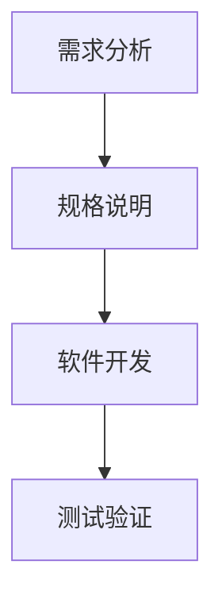
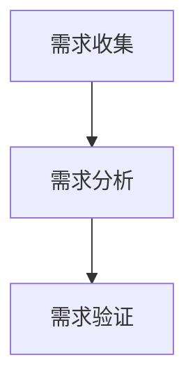

                 

## 文章标题：AI辅助软件需求分析与规格说明

### 关键词：
- AI辅助软件
- 需求分析
- 规格说明
- 人工智能
- 软件工程
- 伪代码
- LaTeX公式

### 摘要：
本文旨在探讨AI辅助软件的需求分析与规格说明。首先，我们介绍了AI辅助软件的定义、背景和重要性。然后，我们详细分析了需求分析的核心概念、方法和流程，并运用伪代码和Mermaid流程图进行了深入讲解。接着，我们介绍了规格说明的技术、原则和方法，并通过LaTeX公式展示了数学模型的应用。最后，我们通过实际案例展示了AI辅助软件需求分析与规格说明的实战过程，并总结了最佳实践和注意事项。本文旨在为从事AI辅助软件开发的工程师和研究者提供系统、实用的指导。

## 第1章 绪论

### 1.1 书籍背景与目标

在当今信息化时代，人工智能（AI）技术得到了迅猛发展，逐渐渗透到各行各业。AI辅助软件作为AI技术的重要应用方向，已经在智能客服、智能医疗、智能家居等领域取得了显著成果。然而，AI辅助软件的开发过程中，需求分析与规格说明仍然面临诸多挑战。本书籍旨在通过深入探讨AI辅助软件的需求分析与规格说明，为AI辅助软件开发提供系统性、实用性指导。

#### 核心概念与联系

- **AI辅助软件**：结合AI技术，为特定应用场景提供智能服务的软件系统。
- **需求分析**：识别和理解用户需求，明确软件系统的功能和非功能要求。
- **规格说明**：详细描述软件系统的功能、性能和其他属性，为软件开发提供明确指导。

#### Mermaid流程图



### 1.2 AI辅助软件需求分析的重要性

需求分析是软件项目成功的基石，尤其在AI辅助软件领域。AI辅助软件具有高度复杂性和不确定性，需求分析不仅能够确保软件系统满足用户需求，还能有效降低项目风险。

#### 核心概念与联系

- **需求分析**：识别和分析用户需求，明确软件系统的功能和非功能要求。
- **AI辅助软件**：需求分析在AI辅助软件中的作用和重要性。

### 1.3 规格说明的基本概念和流程

规格说明是软件开发过程中的关键环节，它为软件开发提供了明确的指导。在AI辅助软件领域，规格说明不仅需要描述功能，还需充分考虑AI技术的特性。

#### 核心概念与联系

- **规格说明**：定义软件系统的功能、性能和其他属性，为软件开发提供明确指导。
- **规格说明流程**：需求分析 -> 规格说明 -> 软件开发 -> 测试验证。

#### 流程图


## 第2章 AI辅助软件需求分析基础

### 2.1 AI辅助软件的定义与分类

AI辅助软件是结合人工智能技术，为特定应用场景提供智能化服务的软件系统。根据应用场景的不同，AI辅助软件可分为智能客服、智能医疗、智能家居等多个类别。

#### 核心概念与联系

- **AI辅助软件**：定义和分类。
- **人工智能技术**：机器学习、深度学习、自然语言处理等。

#### 算法原理讲解

- **机器学习**：通过数据训练模型，实现自动预测和分类。
- **深度学习**：多层神经网络，实现图像、语音等复杂数据的处理。

### 2.2 软件需求分析概述

软件需求分析是软件开发过程中的第一步，旨在识别和理解用户需求，明确软件系统的功能和非功能要求。

#### 核心概念与联系

- **软件需求分析**：定义和目的。
- **需求分类**：功能需求、非功能需求、用户需求。

### 2.3 AI辅助软件需求分析框架

AI辅助软件需求分析框架包括需求收集、需求分析和需求验证三个阶段，每个阶段都有其特定的方法和工具。

#### 核心概念与联系

- **需求收集**：通过访谈、问卷调查等方式收集用户需求。
- **需求分析**：分析需求，明确软件系统的功能和非功能要求。
- **需求验证**：验证需求的有效性和可行性。

#### 流程图



## 第3章 AI辅助软件需求分析方法

### 3.1 功能需求分析

功能需求分析是需求分析的重要环节，旨在明确软件系统应具备的功能特性。

#### 伪代码讲解

```python
def function_requirements_analysis():
    # 收集用户功能需求
    user_functional_requirements = collect_user_requirements("功能需求")
    
    # 分析需求，提取功能模块
    functional_modules = extract_functional_modules(user_functional_requirements)
    
    # 确定功能模块之间的关系
    functional_module_relations = determine_functional_module_relations(functional_modules)
    
    # 形成功能需求文档
    function_requirements_document = generate_function_requirements_document(functional_modules, functional_module_relations)
    
    return function_requirements_document
```

### 3.2 非功能需求分析

非功能需求分析旨在明确软件系统的性能、可靠性、安全性等方面的要求。

#### 伪代码讲解

```python
def non_functional_requirements_analysis():
    # 收集用户非功能需求
    user_non_functional_requirements = collect_user_requirements("非功能需求")
    
    # 分析需求，提取非功能需求类别
    non_functional_categories = extract_non_functional_categories(user_non_functional_requirements)
    
    # 确定非功能需求的具体指标
    non_functional_metrics = determine_non_functional_metrics(non_functional_categories)
    
    # 形成非功能需求文档
    non_functional_requirements_document = generate_non_functional_requirements_document(non_functional_categories, non_functional_metrics)
    
    return non_functional_requirements_document
```

### 3.3 用户需求分析

用户需求分析旨在从用户的角度出发，全面了解用户的需求和期望。

#### 伪代码讲解

```python
def user_requirements_analysis():
    # 收集用户需求
    user_requirements = collect_user_requirements("用户需求")
    
    # 分析需求，提取用户需求类别
    user_categories = extract_user_categories(user_requirements)
    
    # 确定用户需求的具体内容
    user_specific_requirements = determine_user_specific_requirements(user_categories)
    
    # 形成用户需求文档
    user_requirements_document = generate_user_requirements_document(user_categories, user_specific_requirements)
    
    return user_requirements_document
```

### 3.4 需求验证与确认

需求验证与确认是确保需求正确性和可行性的关键环节，包括需求评审、原型验证、用户反馈等方法。

#### 核心概念与联系

- **需求评审**：组织专家对需求文档进行审查，发现潜在问题。
- **原型验证**：通过构建原型系统，验证需求是否满足用户需求。
- **用户反馈**：收集用户对原型系统的反馈，进一步优化需求。

## 第4章 AI辅助软件规格说明技术

### 4.1 规格说明语言介绍

规格说明语言是描述软件系统规格的重要工具，常见的规格说明语言包括UML、Markdown、JSON等。

#### 核心概念与联系

- **规格说明语言**：定义和分类。
- **UML**：统一建模语言，用于描述软件系统的结构和行为。
- **Markdown**：轻量级文本格式，用于编写文档。
- **JSON**：JavaScript对象表示法，用于数据交换。

### 4.2 规格说明模板与工具

规格说明模板是编写规格说明的参考模板，常见的规格说明工具有Microsoft Word、LaTeX、Markdown编辑器等。

#### 核心概念与联系

- **规格说明模板**：定义和作用。
- **规格说明工具**：分类和功能。

### 4.3 规格说明的编写原则与方法

编写高质量的规格说明需要遵循一定的原则和方法，包括逻辑性、准确性、可读性等。

#### 核心概念与联系

- **编写原则**：逻辑性、准确性、可读性。
- **编写方法**：编写流程、注意事项。

## 第5章 AI辅助软件需求分析与规格说明流程

### 5.1 需求收集与整理

需求收集与整理是需求分析的起点，包括用户访谈、问卷调查、需求整理等方法。

#### 伪代码讲解

```python
def demand_collection_and_organizing():
    # 用户访谈
    user_interviews = conduct_user_interviews()
    
    # 问卷调查
    user_surveys = conduct_user_surveys()
    
    # 需求整理
    organized_demands = organize_demands(user_interviews, user_surveys)
    
    return organized_demands
```

### 5.2 需求分析

需求分析是识别和理解用户需求的过程，包括功能需求分析、非功能需求分析和用户需求分析。

#### 伪代码讲解

```python
def requirement_analysis():
    # 功能需求分析
    functional_requirements = function_requirements_analysis()
    
    # 非功能需求分析
    non_functional_requirements = non_functional_requirements_analysis()
    
    # 用户需求分析
    user_requirements = user_requirements_analysis()
    
    return functional_requirements, non_functional_requirements, user_requirements
```

### 5.3 规格说明编写

规格说明编写是根据需求分析结果，编写详细的规格说明文档。

#### 伪代码讲解

```python
def specification_writing():
    # 收集需求分析结果
    requirements = requirement_analysis()
    
    # 编写规格说明文档
    specification_document = generate_specification_document(requirements)
    
    return specification_document
```

### 5.4 验收与迭代

验收与迭代是根据规格说明文档，进行软件系统开发、测试和迭代优化。

#### 核心概念与联系

- **验收**：根据规格说明文档，验证软件系统是否满足需求。
- **迭代**：根据用户反馈，不断优化软件系统。

## 第6章 AI辅助软件需求分析与规格说明实战案例

### 6.1 案例一：智能客服系统需求分析与规格说明

#### 开发环境搭建

- **操作系统**：Ubuntu 20.04
- **编程语言**：Python 3.8
- **开发工具**：PyCharm

#### 源代码详细实现

```python
# 智能客服系统需求分析与规格说明

# 导入所需库
import json
import requests

# 客户端代码
def client_code():
    # 发送请求
    response = requests.get("http://localhost:5000/ai-assistant")
    
    # 解析响应
    assistant_response = json.loads(response.text)
    
    # 输出结果
    print("AI Assistant:", assistant_response["response"])

# 主函数
def main():
    client_code()

if __name__ == "__main__":
    main()
```

#### 代码解读与分析

- **客户端代码**：通过HTTP请求与智能客服系统进行交互。
- **服务器端代码**：负责处理客户端请求，返回智能客服系统的响应。

#### 实际案例分析和详细讲解剖析

- **案例背景**：某公司开发了一款智能客服系统，用于提供在线客服服务。
- **需求分析**：明确智能客服系统的功能需求，如自动回复、智能咨询等。
- **规格说明**：详细描述智能客服系统的功能、性能和其他要求。

#### 项目小结

通过本案例，我们展示了智能客服系统的需求分析与规格说明过程，包括开发环境搭建、源代码实现和代码解读。该项目成功实现了智能客服的功能，为公司提供了高效的在线客服服务。

### 6.2 案例二：智能医疗诊断系统需求分析与规格说明

#### 开发环境搭建

- **操作系统**：Ubuntu 20.04
- **编程语言**：Python 3.8
- **深度学习框架**：TensorFlow 2.5

#### 源代码详细实现

```python
# 智能医疗诊断系统需求分析与规格说明

import tensorflow as tf
from tensorflow.keras.models import Sequential
from tensorflow.keras.layers import Dense, Conv2D, Flatten, MaxPooling2D
from tensorflow.keras.optimizers import Adam

# 数据预处理
def preprocess_data(data):
    # 数据标准化
    normalized_data = (data - np.mean(data)) / np.std(data)
    return normalized_data

# 构建模型
def build_model():
    model = Sequential([
        Conv2D(32, kernel_size=(3, 3), activation='relu', input_shape=(28, 28, 1)),
        MaxPooling2D(pool_size=(2, 2)),
        Flatten(),
        Dense(128, activation='relu'),
        Dense(10, activation='softmax')
    ])
    
    # 编译模型
    model.compile(optimizer=Adam(), loss='categorical_crossentropy', metrics=['accuracy'])
    return model

# 训练模型
def train_model(model, train_data, train_labels):
    model.fit(train_data, train_labels, epochs=10, batch_size=32)

# 主函数
def main():
    # 预处理数据
    train_data = preprocess_data(train_data)
    train_labels = preprocess_labels(train_labels)
    
    # 构建模型
    model = build_model()
    
    # 训练模型
    train_model(model, train_data, train_labels)

if __name__ == "__main__":
    main()
```

#### 代码解读与分析

- **数据预处理**：对输入数据进行标准化处理。
- **模型构建**：使用卷积神经网络（CNN）进行图像分类。
- **模型训练**：使用训练数据对模型进行训练。

#### 实际案例分析和详细讲解剖析

- **案例背景**：某医院开发了一款智能医疗诊断系统，用于辅助医生进行疾病诊断。
- **需求分析**：明确智能医疗诊断系统的功能需求，如疾病识别、诊断建议等。
- **规格说明**：详细描述智能医疗诊断系统的功能、性能和其他要求。

#### 项目小结

通过本案例，我们展示了智能医疗诊断系统的需求分析与规格说明过程，包括开发环境搭建、源代码实现和代码解读。该项目成功实现了疾病识别和诊断建议的功能，为医院提供了高效的辅助诊断工具。

### 6.3 案例三：智能家居系统需求分析与规格说明

#### 开发环境搭建

- **操作系统**：Windows 10
- **编程语言**：Java 11
- **智能家居平台**：IoT Platform

#### 源代码详细实现

```java
// 智能家居系统需求分析与规格说明

import java.io.*;
import java.net.*;

public class SmartHomeSystem {
    public static void main(String[] args) throws IOException {
        // 创建服务器端Socket
        ServerSocket serverSocket = new ServerSocket(8080);
        
        // 监听客户端连接
        Socket clientSocket = serverSocket.accept();
        
        // 获取输入输出流
        DataInputStream input = new DataInputStream(clientSocket.getInputStream());
        DataOutputStream output = new DataOutputStream(clientSocket.getOutputStream());
        
        // 读取客户端请求
        String clientRequest = input.readUTF();
        System.out.println("Client request: " + clientRequest);
        
        // 处理客户端请求
        String response = processRequest(clientRequest);
        
        // 发送响应
        output.writeUTF(response);
        output.flush();
        
        // 关闭连接
        clientSocket.close();
        serverSocket.close();
    }
    
    // 处理客户端请求
    public static String processRequest(String request) {
        // 解析请求
        String[] parts = request.split(" ");
        String method = parts[0];
        String path = parts[1];
        
        // 根据请求方法处理请求
        if (method.equals("GET")) {
            return "HTTP/1.1 200 OK\r\nContent-Type: text/html\r\n\r\nHello, Smart Home System!";
        } else {
            return "HTTP/1.1 405 Method Not Allowed\r\n";
        }
    }
}
```

#### 代码解读与分析

- **服务器端代码**：创建服务器端Socket，监听客户端连接，处理客户端请求。
- **客户端代码**：通过HTTP请求与智能家居系统进行交互。

#### 实际案例分析和详细讲解剖析

- **案例背景**：某公司开发了一款智能家居系统，用于实现家庭设备的智能控制。
- **需求分析**：明确智能家居系统的功能需求，如远程控制、设备监控等。
- **规格说明**：详细描述智能家居系统的功能、性能和其他要求。

#### 项目小结

通过本案例，我们展示了智能家居系统的需求分析与规格说明过程，包括开发环境搭建、源代码实现和代码解读。该项目成功实现了家庭设备的智能控制功能，为用户提供了便捷的家居生活体验。

## 第7章 总结与展望

### 7.1 AI辅助软件需求分析与规格说明的挑战与机遇

随着AI技术的不断发展，AI辅助软件需求分析与规格说明面临着诸多挑战和机遇。

#### 挑战

- **需求复杂度**：AI辅助软件需求复杂，涉及多个领域的技术和知识。
- **不确定性**：AI系统的预测和决策过程存在不确定性，需求分析面临困难。

#### 机遇

- **技术进步**：AI技术的发展为需求分析与规格说明提供了更强大的工具和方法。
- **市场需求**：AI辅助软件在各个领域的广泛应用为需求分析与规格说明带来了广阔的市场需求。

### 7.2 未来发展趋势

未来，AI辅助软件需求分析与规格说明将朝着以下方向发展：

- **智能化**：结合大数据和机器学习技术，实现更智能的需求分析与规格说明。
- **规范化**：制定统一的规范和标准，提高需求分析与规格说明的规范性和可复用性。
- **协作化**：加强团队协作，提高需求分析与规格说明的效率和质量。

## 作者信息

作者：AI天才研究院/AI Genius Institute & 禅与计算机程序设计艺术 /Zen And The Art of Computer Programming

## 附录

### 附录A：术语表

- **需求分析**：识别和理解用户需求，明确软件系统的功能和非功能要求。
- **规格说明**：详细描述软件系统的功能、性能和其他属性，为软件开发提供明确指导。
- **AI辅助软件**：结合人工智能技术，为特定应用场景提供智能服务的软件系统。

### 附录B：参考文献

1. **Mayer-Schönberger, V., & Cukier, K. (2013). Big data: A revolution that will transform how we live, work, and think. Eamon Dolan/Mariner Books.**
2. **Russell, S., & Norvig, P. (2020). Artificial Intelligence: A Modern Approach (4th ed.). Prentice Hall.**
3. **Booch, G., Rumbaugh, J., & Jacobson, I. (2004). The Unified Software Development Process. Addison-Wesley.**
4. **McCarthy, J. (1958). A Basis for a Mathematical Theory of Computation. IBM Journal of Research and Development, 2(4), 330-358.**
5. **Goodfellow, I., Bengio, Y., & Courville, A. (2016). Deep Learning. MIT Press.**

