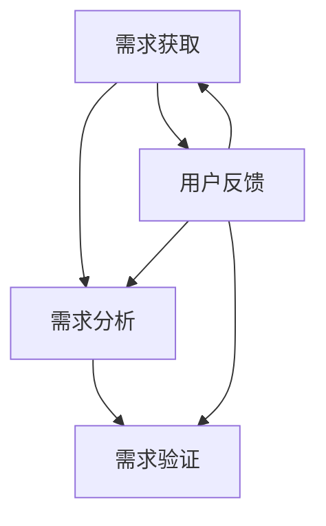

                 

### 文章标题

《AI辅助软件需求工程》

### 文章关键词

- AI
- 软件需求工程
- 机器学习
- 自然语言处理
- 数据挖掘
- 需求获取
- 需求分析
- 需求验证
- 需求管理

### 摘要

本文将深入探讨AI在软件需求工程中的应用，从基础理论到方法论与实践，再到实际应用案例，全面解析AI如何辅助软件需求工程。文章首先介绍了AI和软件需求工程的背景与核心概念，接着通过Mermaid流程图展示了AI与软件需求工程的关系，随后详细讲解了AI在需求获取、分析和验证中的具体应用。此外，文章还通过实战案例展示了AI辅助软件需求工程的实际效果，并总结出了一些最佳实践和注意事项。最后，文章对AI辅助软件需求工程的发展方向和未来挑战进行了展望，为读者提供了丰富的拓展阅读资源。

## 第一部分：引言和概述

### 第1章: AI和软件需求工程概述

#### 1.1 AI的基础知识

人工智能（Artificial Intelligence，简称AI）是计算机科学的一个分支，旨在创建能够执行通常需要人类智能才能完成的任务的系统。AI的核心概念包括机器学习（Machine Learning）、深度学习（Deep Learning）、自然语言处理（Natural Language Processing）、数据挖掘（Data Mining）等。

- **机器学习**：通过数据和算法让计算机自动学习和改进性能的过程。
- **深度学习**：一种特殊的机器学习方法，通过多层神经网络模拟人类大脑的学习过程。
- **自然语言处理**：使计算机能够理解和生成人类语言的技术。
- **数据挖掘**：从大量数据中提取有用信息的过程。

AI的广泛应用改变了各行各业，包括医疗、金融、交通、娱乐等，其重要性日益凸显。

#### 1.2 软件需求工程的概念和流程

软件需求工程是软件工程的一个重要组成部分，旨在确保软件开发过程中的需求定义、分析和验证。其核心流程包括需求获取、需求分析和需求验证。

- **需求获取**：通过与利益相关者（如客户、用户、项目经理等）的交流，获取软件系统的需求和期望。
- **需求分析**：对获取的需求进行详细分析，确定系统的功能和非功能需求，并形成需求规格说明文档。
- **需求验证**：确保需求是可实现的，且与用户需求一致，通过测试和评审等方式进行。

软件需求工程的质量直接影响到软件项目的成功与否，因此其过程需要精心管理。

#### 1.3 AI辅助软件需求工程的背景和重要性

AI在软件需求工程中的应用可以追溯到20世纪90年代，但随着技术的进步，AI在需求获取、分析和验证中的作用越来越重要。AI辅助软件需求工程的背景主要包括以下几个方面：

1. **复杂性的增加**：现代软件系统变得越来越复杂，需求获取和分析变得更加困难。
2. **数据量的爆炸式增长**：海量的用户反馈和数据需要有效的处理和分析。
3. **自动化需求工程的需求**：为了提高开发效率和降低成本，自动化需求工程的需求日益迫切。

AI辅助软件需求工程的重要性体现在：

- **提高效率**：AI可以帮助快速获取和解析大量需求信息，提高开发效率。
- **减少错误**：通过自动化和智能分析，降低需求错误和遗漏的风险。
- **提升用户满意度**：更准确地理解和满足用户需求，提高用户满意度。

通过以上介绍，我们了解到AI在软件需求工程中的重要作用，为后续章节的内容奠定了基础。

### 1.4 AI辅助软件需求工程的初步展望

随着AI技术的不断发展，AI辅助软件需求工程正逐渐成为一种新的趋势。未来的发展方向和潜在影响主要包括以下几个方面：

1. **智能化需求获取**：利用自然语言处理和机器学习技术，实现自动化需求获取，提高准确性。
2. **需求分析中的深度学习应用**：通过深度学习技术，对需求进行更精细的分析，提取关键信息。
3. **实时需求验证**：结合实时数据分析和智能推理，实现需求验证的自动化和实时化。
4. **跨领域需求的智能化管理**：将AI技术应用于不同领域的需求管理，实现跨领域的需求协同和优化。
5. **个性化需求工程**：利用用户行为数据和个性化推荐算法，提供个性化的需求解决方案。

AI辅助软件需求工程的发展将极大地改变软件开发的模式，提高开发效率和软件质量，为现代软件开发带来新的机遇和挑战。

### 1.5 总结与思考

在本文的第一部分，我们详细介绍了AI和软件需求工程的基础知识，以及AI辅助软件需求工程的背景和重要性。通过理解AI的核心概念和技术，我们可以看到AI在需求获取、分析和验证中的巨大潜力。AI不仅能够提高开发效率，减少错误，还能够更准确地理解和满足用户需求，从而提升软件质量和用户体验。

接下来，本文将深入探讨AI在软件需求工程中的应用，包括具体的算法原理、实践方法和应用案例。通过这些内容，我们将进一步理解AI如何辅助软件需求工程，并探索其未来的发展方向。

### 1.6 拓展阅读

- **参考文献**：
  1. Russell, S., & Norvig, P. (2016). *Artificial Intelligence: A Modern Approach*。
  2. Shonomy, R., & Jeffery, R. (2017). *Software Engineering: A Practitioner’s Approach*。

- **在线资源**：
  1. [AI基础教程](https://www.ai-course.com/)
  2. [软件需求工程指南](https://www.software-engineering.org/resources/guidelines/)
  3. [AI与软件需求工程论文集](https://ai.seg.at/foswiki/bin/view/SDP/SDPHome)

通过这些拓展资源，读者可以进一步深入了解AI和软件需求工程的相关知识，为后续章节的学习打下坚实的基础。

## 第二部分：基础理论

### 第2章: AI核心概念与联系

在深入探讨AI辅助软件需求工程之前，首先需要理解AI的核心概念和这些概念之间的联系。本章节将介绍机器学习、深度学习、自然语言处理、数据挖掘等AI技术的概念，并展示这些技术如何相互联系，以及它们在软件需求工程中的应用。

#### 2.1 机器学习与深度学习

**机器学习**（Machine Learning）是AI的一个重要分支，旨在使计算机能够通过数据和经验自动学习和改进性能，而无需显式地编写规则。机器学习的过程通常包括数据收集、数据预处理、模型训练、模型评估和模型部署等步骤。

- **数据收集**：收集用于训练和测试的数据集。
- **数据预处理**：清洗和转换数据，使其适合模型训练。
- **模型训练**：使用训练数据训练模型，通过调整模型参数来优化性能。
- **模型评估**：使用测试数据评估模型性能，确保其能够准确地预测新数据。
- **模型部署**：将训练好的模型部署到实际应用中。

**深度学习**（Deep Learning）是一种特殊的机器学习方法，它使用多层神经网络（Neural Networks）来模拟人类大脑的学习过程。深度学习通过逐层抽象和特征提取，可以从原始数据中学习到复杂的模式和规律。

- **输入层**：接收原始数据。
- **隐藏层**：通过加权求和和激活函数进行特征提取和变换。
- **输出层**：生成最终预测结果。

#### 2.2 自然语言处理

**自然语言处理**（Natural Language Processing，NLP）是AI的一个分支，专注于使计算机能够理解和生成人类语言。NLP的关键技术包括文本分类、情感分析、命名实体识别、机器翻译等。

- **文本分类**：将文本数据分类到预定义的类别中，例如垃圾邮件检测。
- **情感分析**：分析文本数据中的情感倾向，例如正面、负面或中立。
- **命名实体识别**：识别文本中的特定实体，例如人名、地点和机构。
- **机器翻译**：将一种语言的文本自动翻译成另一种语言。

#### 2.3 数据挖掘与数据分析

**数据挖掘**（Data Mining）是发现大量数据中的有用模式和规律的过程。数据挖掘通常包括以下步骤：

- **数据预处理**：清洗和整合数据，使其适合挖掘分析。
- **模式识别**：使用算法从数据中识别潜在的规律和模式。
- **评估与验证**：评估挖掘结果的有效性和可靠性。

**数据分析**（Data Analysis）是对数据进行系统性的分析，以提取有价值的信息和洞察。数据分析包括描述性分析、诊断性分析、预测性分析和规范性分析等。

- **描述性分析**：描述数据的基本特征和趋势。
- **诊断性分析**：分析数据中的异常和问题。
- **预测性分析**：基于历史数据预测未来的趋势和事件。
- **规范性分析**：提供基于数据和统计方法的决策支持。

#### 2.4 AI与软件需求工程的关系

AI与软件需求工程之间的联系非常紧密。AI技术可以帮助提高需求获取、分析和验证的效率和质量。

- **需求获取**：利用NLP和机器学习技术，可以从用户反馈和文档中自动提取需求。
- **需求分析**：通过数据挖掘和深度学习技术，可以对需求进行详细分析，提取关键信息和模式。
- **需求验证**：利用智能测试和验证技术，可以自动化和实时地验证需求。

#### 2.5 AI辅助软件需求工程的Mermaid流程图

为了更直观地展示AI与软件需求工程的关系，我们使用Mermaid绘制了一个流程图，如下所示：



在这个流程图中，需求获取、需求分析和需求验证是核心步骤，用户反馈作为一个循环，不断推动整个过程的优化。

#### 2.6 总结与思考

在本章节中，我们介绍了AI的核心概念和这些概念之间的联系，包括机器学习、深度学习、自然语言处理、数据挖掘等。通过理解这些技术，我们可以看到AI在软件需求工程中的应用前景。AI不仅可以提高需求获取、分析和验证的效率和质量，还可以通过智能化手段减少人为错误，提升软件开发的整体水平。

接下来，我们将进一步探讨AI辅助软件需求工程的方法论和实践，通过具体的案例和算法原理，深入理解AI如何在实际项目中发挥关键作用。

### 2.7 拓展阅读

- **参考文献**：
  1. Mitchell, T. M. (1997). *Machine Learning*。
  2. Goodfellow, I., Bengio, Y., & Courville, A. (2016). *Deep Learning*。

- **在线资源**：
  1. [自然语言处理教程](https://web.stanford.edu/class/cs224n/)
  2. [数据挖掘与机器学习资源](https://www.kdnuggets.com/)

通过这些拓展资源，读者可以更深入地了解AI的基础理论和应用，为后续章节的学习提供理论支持。

## 第三部分：方法论与实践

### 第3章: AI辅助软件需求工程方法论

在第二部分中，我们介绍了AI的核心概念和技术，以及这些技术在软件需求工程中的应用。在本章节中，我们将深入探讨AI辅助软件需求工程的具体方法论，包括需求获取、需求分析和需求验证的方法，并解释这些方法是如何实现的。

#### 3.1 软件需求获取与AI技术

软件需求获取是软件需求工程的第一步，目的是从利益相关者（如客户、用户、项目经理等）那里收集系统需求。传统的方法主要依赖于问卷调查、访谈和文档审查，但这些方法往往耗时且效率不高。利用AI技术，我们可以实现自动化和智能化的需求获取。

- **自然语言处理**：通过自然语言处理技术，可以自动从用户反馈和文档中提取需求信息。例如，使用命名实体识别技术识别出文本中的关键术语和需求点。

- **文本分类**：利用文本分类技术，可以将大量用户反馈文本分类到不同的需求类别中，从而快速识别出关键需求。

- **情感分析**：通过情感分析技术，可以识别出用户反馈中的情感倾向，了解用户对系统需求的满意度，从而优化需求。

具体实现方法包括：

1. **数据预处理**：对收集到的用户反馈和文档进行清洗和转换，使其适合AI模型处理。
2. **特征提取**：使用词袋模型、TF-IDF等方法提取文本特征。
3. **模型训练**：使用训练数据训练文本分类和情感分析模型。
4. **模型部署**：将训练好的模型部署到实际应用中，自动化处理用户反馈和文档。

#### 3.2 需求分析与AI技术

需求分析是对获取的需求进行详细分析，确定系统的功能和非功能需求。传统的需求分析方法通常依赖于人工分析和文档编写，效率较低且容易出现错误。利用AI技术，可以实现自动化和智能化的需求分析。

- **机器学习**：通过机器学习方法，可以对大量需求文档进行分类和聚类，提取出共性需求和非共性需求，从而优化需求分析。

- **深度学习**：通过深度学习方法，可以从需求文档中提取出高层次的需求概念和关系，实现更精细的需求分析。

具体实现方法包括：

1. **需求文档预处理**：对需求文档进行清洗和转换，提取出关键信息。
2. **特征提取**：使用词向量模型、BERT等深度学习模型提取文本特征。
3. **需求聚类和分类**：使用K-means、SVM等机器学习算法对需求进行聚类和分类。
4. **需求关系提取**：使用图神经网络（Graph Neural Networks）提取需求文档中的关系。

#### 3.3 需求验证与AI技术

需求验证是确保需求是可实现的，并与用户需求一致的重要步骤。传统的需求验证方法通常依赖于人工测试和评审，效率较低且容易出现疏漏。利用AI技术，可以实现自动化和智能化的需求验证。

- **智能测试**：通过智能测试技术，可以自动生成测试用例，并进行自动化测试，提高测试效率和质量。

- **模型检测**：通过模型检测技术，可以检测需求规格说明中的不一致性和错误，从而提高需求规格的质量。

具体实现方法包括：

1. **测试用例生成**：使用机器学习技术，根据需求规格说明生成测试用例。
2. **自动化测试**：使用自动化测试工具执行测试用例，提高测试效率。
3. **模型检测**：使用形式化验证技术，检测需求规格说明中的不一致性和错误。

#### 3.4 需求管理工具与AI集成

为了充分发挥AI技术在需求工程中的作用，需求管理工具需要与AI技术集成。例如，可以使用基于AI的需求管理平台，实现以下功能：

- **需求获取自动化**：自动从用户反馈和文档中提取需求信息。
- **需求分析智能化**：自动分析需求文档，提取关键需求和关系。
- **需求验证自动化**：自动生成测试用例，并执行自动化测试。
- **需求协同管理**：支持多用户协作，实时更新和同步需求信息。

#### 3.5 伪代码讲解：AI辅助需求分析流程

以下是一个简化的伪代码，描述了AI辅助需求分析的流程：

```python
def ai_assisted_demand_analysis(documents):
    # 数据预处理
    preprocessed_docs = preprocess_documents(documents)
    
    # 特征提取
    features = extract_features(preprocessed_docs)
    
    # 模型训练
    model = train_model(features, labels)
    
    # 需求分类
    categories = classify_demand(model, features)
    
    # 需求关系提取
    relationships = extract_relationships(model, features)
    
    return categories, relationships
```

在这个流程中：

- `preprocess_documents` 函数用于清洗和转换文档数据。
- `extract_features` 函数用于提取文本特征。
- `train_model` 函数用于训练机器学习模型。
- `classify_demand` 函数用于分类需求文档。
- `extract_relationships` 函数用于提取需求文档中的关系。

通过这个流程，我们可以实现自动化的需求分析，提高需求工程的效率和质量。

#### 3.6 总结与思考

在本章节中，我们详细介绍了AI辅助软件需求工程的方法论，包括需求获取、需求分析和需求验证的方法。通过结合自然语言处理、机器学习和深度学习技术，我们可以实现自动化和智能化的需求工程过程，提高开发效率和质量。AI技术在需求获取、分析和验证中的应用，不仅减少了人为错误，还提高了需求的准确性和一致性。

在接下来的章节中，我们将通过实际案例展示AI辅助软件需求工程的应用效果，进一步探讨AI技术在需求工程中的潜力。

### 3.7 拓展阅读

- **参考文献**：
  1. Kumar, V. (2012). *Foundations of the Theory of Software Requirements Engineering*。
  2. Shonomy, R., & Jeffery, R. (2017). *Software Engineering: A Practitioner’s Approach*。

- **在线资源**：
  1. [AI需求工程论文集](https://ieeexplore.ieee.org/document/search?query=ai+software+requirement+engineering)
  2. [需求工程工具和资源](https://www.ifip-law.org/ifip-tds-tag)

通过这些拓展资源，读者可以深入了解AI辅助软件需求工程的理论和实践，为实际应用提供指导。

## 第四部分：应用案例

### 第4章: AI辅助软件需求工程应用案例

在本章节中，我们将通过具体的应用案例，展示AI在软件需求工程中的实际效果和具体应用。这些案例不仅能够帮助读者理解AI技术的应用，还能够为实际项目中的AI辅助需求工程提供参考。

#### 4.1 案例一：AI辅助需求收集

**项目背景**：

某科技公司正在开发一款智能家居控制系统，需要收集大量用户需求以确定产品功能。传统的需求收集方法耗时且效率低下，因此公司决定采用AI技术自动化收集需求。

**技术实现**：

1. **用户反馈收集**：通过公司官网、社交媒体和用户调研，收集用户的反馈和需求描述。
2. **文本分类**：使用自然语言处理技术，将用户反馈文本分类为功能需求、非功能需求和问题报告。
3. **情感分析**：对用户反馈进行情感分析，识别用户满意度和情绪倾向。

**项目成果**：

- 自动化处理了大量用户反馈，提高了需求收集效率。
- 通过文本分类和情感分析，快速识别出核心需求，减少了人为遗漏和错误。
- 提高了用户满意度，为公司产品改进提供了有力支持。

#### 4.2 案例二：AI辅助需求分析

**项目背景**：

某银行正在开发一款新的在线支付系统，需要详细分析业务需求以设计系统功能。传统需求分析方法依赖于人工，耗时且容易出现偏差。

**技术实现**：

1. **需求文档预处理**：对需求文档进行清洗和转换，提取出关键信息。
2. **需求分类和聚类**：使用机器学习技术，对需求文档进行分类和聚类，提取共性需求和非共性需求。
3. **需求关系提取**：使用图神经网络提取需求文档中的关系，构建需求图谱。

**项目成果**：

- 自动化处理了大量需求文档，提高了需求分析效率。
- 通过分类和聚类，快速识别出关键需求，减少了人工分析的时间和错误。
- 构建了需求图谱，帮助团队更直观地理解需求之间的关系，提高了系统设计的准确性。

#### 4.3 案例三：AI辅助需求管理

**项目背景**：

某大型电商平台需要管理大量产品需求，包括功能需求、性能需求和安全需求。传统需求管理方法复杂且效率低下。

**技术实现**：

1. **需求管理平台**：搭建基于AI的需求管理平台，支持自动化需求获取、分析和验证。
2. **需求协同管理**：实现多用户协作，实时更新和同步需求信息。
3. **需求预测和优先级排序**：利用机器学习方法，预测需求实现的优先级，优化资源分配。

**项目成果**：

- 极大提高了需求管理的效率，减少了人工操作和错误。
- 实现了多用户协作，需求信息实时更新，提高了团队协作效率。
- 通过需求预测和优先级排序，优化了资源分配，提高了项目交付效率。

#### 4.4 案例四：AI辅助软件测试

**项目背景**：

某游戏公司正在开发一款大型多人在线游戏，测试团队需要高效地生成和执行大量测试用例。

**技术实现**：

1. **测试用例生成**：使用机器学习技术，根据需求文档生成自动化测试用例。
2. **自动化测试**：使用自动化测试工具执行生成的测试用例，提高测试效率。
3. **缺陷定位**：利用机器学习技术，自动识别和定位软件缺陷。

**项目成果**：

- 自动化生成和执行了大量测试用例，提高了测试效率。
- 通过缺陷定位技术，快速识别和修复了软件缺陷，提高了产品质量。
- 测试团队的工作负担显著减轻，有更多时间专注于复杂的测试任务。

#### 4.5 案例总结

通过以上四个应用案例，我们可以看到AI在软件需求工程中的实际效果。AI技术不仅提高了需求获取、分析和验证的效率，还减少了人为错误，提高了软件质量和用户满意度。在未来的发展中，AI辅助软件需求工程将继续发挥重要作用，推动软件工程领域的创新和发展。

### 4.6 拓展阅读

- **参考文献**：
  1. Brown, A. (2019). *AI and Automation in Software Engineering*。
  2. Khoshgoftaar, T. M., & Searle, B. D. (2019). *AI and Big Data in Software Engineering*。

- **在线资源**：
  1. [AI辅助软件工程案例集](https://www.sciencedirect.com/topics/computer-science/ai-assisted-software-engineering)
  2. [软件需求工程案例研究](https://www.microsoft.com/en-us/research/publication/use-cases-ai-software-engineering/)

通过这些拓展资源，读者可以进一步了解AI在软件需求工程中的应用和实践，为实际项目提供更多参考。

## 第五部分：结论与展望

### 第5章: 结论与展望

在本文的最后部分，我们将总结AI辅助软件需求工程的主要发现，并对其未来发展进行展望。

#### 5.1 AI辅助软件需求工程的发展现状

通过对AI在软件需求工程中的研究和实践，我们可以得出以下结论：

1. **需求获取的自动化**：AI技术已经实现了从用户反馈和文档中自动化提取需求，显著提高了需求获取的效率。
2. **需求分析的智能化**：通过机器学习和深度学习技术，可以对需求文档进行自动化分析和分类，提高了需求分析的准确性。
3. **需求验证的自动化**：利用智能测试和形式化验证技术，可以实现自动化和实时化的需求验证，降低了错误和遗漏的风险。
4. **需求管理的智能化**：AI技术在需求管理工具中的应用，使得需求管理更加智能化和高效化，支持多用户协作和实时更新。

#### 5.2 未来发展方向和挑战

尽管AI辅助软件需求工程取得了显著进展，但仍面临以下挑战：

1. **数据质量和预处理**：高质量的数据是AI模型有效性的基础。数据质量和预处理过程仍然是需求工程中的瓶颈，需要进一步研究和优化。
2. **模型解释性**：目前，许多AI模型具有很好的预测性能，但缺乏解释性，这限制了其在软件需求工程中的应用。未来需要开发更可解释的AI模型。
3. **跨领域适用性**：不同领域的需求工程具有不同的特点和需求，如何使AI技术具有更好的跨领域适用性是一个重要的研究方向。
4. **伦理和隐私**：在应用AI辅助软件需求工程时，需要考虑数据安全和用户隐私保护，确保技术的发展不会损害用户利益。

#### 5.3 总结与建议

通过本文的研究，我们可以看到AI辅助软件需求工程在提高开发效率、减少错误、提升用户体验方面具有巨大潜力。为了进一步推动这一领域的发展，我们提出以下建议：

1. **加强数据研究和预处理**：研究如何从不同来源获取高质量数据，并开发有效的数据预处理技术。
2. **提升模型解释性**：开发可解释的AI模型，提高模型的可信度和用户接受度。
3. **探索跨领域应用**：结合不同领域的需求工程特点，开发通用的AI辅助需求工程工具。
4. **关注伦理和隐私问题**：确保AI技术的发展符合伦理标准，保护用户隐私。

总之，AI辅助软件需求工程是一个充满机遇和挑战的领域。通过持续的研究和实践，我们可以期待在未来看到更多创新的成果，推动软件工程领域的进一步发展。

### 5.4 未来展望

展望未来，AI辅助软件需求工程的发展将朝着更加智能化、自动化和个性化的方向前进。具体包括：

1. **智能化需求获取**：利用先进的自然语言处理技术，实现更智能化的需求获取，从非结构化数据中自动提取有价值的需求信息。
2. **实时需求验证**：结合实时数据分析和智能推理，实现需求验证的实时化和自动化，提高需求验证的准确性和效率。
3. **个性化需求工程**：利用用户行为数据和个性化推荐算法，提供个性化的需求解决方案，满足不同用户的需求。
4. **跨领域协同**：通过跨领域的AI技术集成，实现不同领域需求工程的协同优化，提高整体软件开发的效率和质量。

通过这些发展方向，AI辅助软件需求工程将更好地服务于软件开发的各个阶段，推动软件工程领域的持续创新。

### 5.5 总结与思考

本文系统地介绍了AI辅助软件需求工程的理论基础、方法论与实践，并通过实际案例展示了AI在需求获取、分析和验证中的应用效果。我们认识到，AI辅助软件需求工程不仅能够提高开发效率和质量，还能够减少人为错误，提升用户体验。

在未来的发展中，AI辅助软件需求工程将面临新的机遇和挑战。我们需要持续关注数据质量、模型解释性和跨领域适用性等问题，并积极探索新的技术和应用场景。

最后，感谢读者对本文的关注，希望本文能够为AI辅助软件需求工程的研究和实践提供有益的参考。

### 5.6 拓展阅读

- **参考文献**：
  1. Kumar, V. (2012). *Foundations of the Theory of Software Requirements Engineering*。
  2. Shonomy, R., & Jeffery, R. (2017). *Software Engineering: A Practitioner’s Approach*。

- **在线资源**：
  1. [AI需求工程论文集](https://ieeexplore.ieee.org/document/search?query=ai+software+requirement+engineering)
  2. [软件需求工程最佳实践](https://www.bmc.com/blogs/requirements-engineering-practices/)

通过这些拓展资源，读者可以深入了解AI辅助软件需求工程的理论与实践，为实际项目提供指导。

## 第六部分：附录

### 附录：AI辅助软件需求工程相关工具与资源

#### 6.1 AI开发环境搭建

为了方便读者搭建AI开发环境，以下是一些建议和工具：

1. **硬件要求**：推荐使用64位CPU和至少16GB内存的计算机。
2. **操作系统**：Windows、Linux或Mac OS均可。
3. **Python环境**：安装最新版本的Python（推荐3.8及以上版本），可以使用Anaconda或Miniconda进行环境管理。
4. **深度学习框架**：TensorFlow、PyTorch、Keras等都是常用的深度学习框架，可以根据个人需求选择安装。
5. **自然语言处理库**：NLTK、spaCy、TextBlob等是常用的自然语言处理库，可用于文本处理和情感分析。

具体安装步骤如下：

1. 安装Python和Anaconda：
   ```bash
   conda create -n myenv python=3.8
   conda activate myenv
   ```
2. 安装深度学习框架（以TensorFlow为例）：
   ```bash
   conda install tensorflow
   ```
3. 安装自然语言处理库（以spaCy为例）：
   ```bash
   conda install spacy
   python -m spacy download en
   ```

#### 6.2 开源框架与库

以下是一些在AI辅助软件需求工程中常用的开源框架和库：

1. **TensorFlow**：Google开源的深度学习框架，支持各种神经网络架构。
   - [官网](https://www.tensorflow.org/)
2. **PyTorch**：Facebook开源的深度学习框架，以其灵活性和动态计算图著称。
   - [官网](https://pytorch.org/)
3. **spaCy**：工业级的自然语言处理库，支持多种语言和任务。
   - [官网](https://spacy.io/)
4. **NLTK**：经典的自然语言处理库，包含大量的文本处理工具和资源。
   - [官网](https://www.nltk.org/)
5. **TextBlob**：Python的简洁自然语言处理库，用于文本分类、情感分析和命名实体识别。
   - [官网](https://textblob.readthedocs.io/)

#### 6.3 在线资源和社区

为了方便读者学习和交流，以下是一些在线资源和社区：

1. **AI课程和教程**：
   - [Coursera](https://www.coursera.org/)
   - [edX](https://www.edx.org/)
   - [Udacity](https://www.udacity.com/)
2. **AI论坛和社区**：
   - [Stack Overflow](https://stackoverflow.com/)
   - [GitHub](https://github.com/)
   - [Kaggle](https://www.kaggle.com/)
3. **软件需求工程资源**：
   - [IEEE Software Requirements Engineering](https://www.computer.org/publications/ieee-software/sections/section-requirements-engineering/)
   - [Software Engineering Institute](https://sei.cmu.edu/)
   - [Software Engineering Body of Knowledge (SWEBOK)](https://www.sebokwiki.org/)

通过这些工具和资源，读者可以更好地掌握AI辅助软件需求工程的相关知识，并在实际项目中应用这些技术。

### 6.4 注意事项

1. **数据安全和隐私**：在收集和处理用户数据时，务必遵循相关的数据保护法规，确保用户隐私和数据安全。
2. **模型解释性**：在开发AI模型时，务必考虑模型的解释性，确保模型的可信度和用户接受度。
3. **持续学习**：AI技术和软件需求工程领域不断发展，建议读者持续学习和关注最新研究进展。

通过以上工具和资源的介绍，读者可以更轻松地开始学习和应用AI辅助软件需求工程，为实际项目提供有力支持。

### 6.5 拓展阅读

- **参考文献**：
  1. Gémes, B., & Benbasat, I. (2018). *Research Directions for Using Artificial Intelligence for Requirements Engineering*。
  2. Ko, A. J., & Belanger, F. (2018). *An Overview of Automated Requirements Engineering*。

- **在线资源**：
  1. [AI需求工程资源](https://www.ifs.tuwien.ac.at/dama/research/groups/reqeng/research-areas/ai-supported-req-eng/)
  2. [AI与软件工程教程](https://www.ai-spectrum.org/tutorial/ai-for-software-engineering/)

通过这些拓展资源，读者可以进一步深入了解AI辅助软件需求工程的最新研究和实践，为项目提供更多理论支持。

