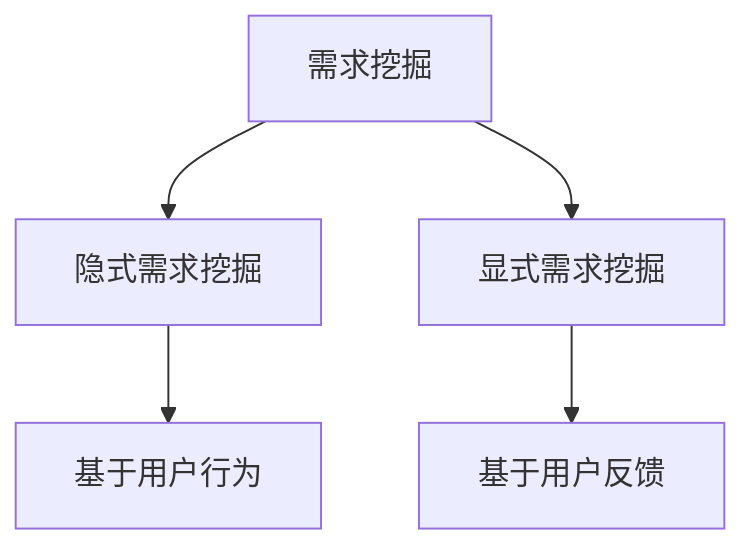

                 


为了撰写一篇符合要求的《AI辅助软件需求挖掘：从隐式到显式》技术博客，我们需要按照以下步骤进行详细分析和论述：

### 第一步：引言与背景介绍

**核心概念与联系**

- 需求挖掘：从用户行为、反馈等数据中提取需求信息的过程。
- 隐式需求：通过用户行为间接反映的需求。
- 显式需求：用户直接表达的需求。

Mermaid 流程图：



**核心算法原理讲解**

- 隐式需求挖掘算法（如：关联规则挖掘、聚类分析等）。
- 显式需求挖掘算法（如：情感分析、文本分类等）。

伪代码：

```python
def extract ImplicitDemands(data):
    # 数据预处理
    cleaned_data = preprocess(data)
    # 提取特征
    features = extract_features(cleaned_data)
    # 应用算法
    rules = apriori(features, min_support, min_confidence)
    return rules

def extract ExplicitDemands(data):
    # 数据预处理
    cleaned_data = preprocess(data)
    # 提取特征
    features = extract_features(cleaned_data)
    # 应用算法
    sentiments = sentiment_analysis(features)
    return sentiments
```

**数学模型和公式讲解**

隐式需求挖掘：

$$
\text{Support}(X, Y) = \frac{\text{频繁项集包含X和Y的次数}}{\text{总次数}}
$$

$$
\text{Confidence}(X \to Y) = \frac{\text{支持}(X, Y)}{\text{支持}(X)}
$$

### 第二步：需求挖掘基础理论

**核心概念与联系**

- 需求挖掘流程：数据收集、数据预处理、特征提取、模型训练、需求预测。
- 模型分类：机器学习方法、深度学习方法等。

**核心算法原理讲解**

- 数据预处理算法（如：归一化、去噪等）。
- 特征提取算法（如：TF-IDF、Word2Vec等）。

伪代码：

```python
def preprocess_data(data):
    # 归一化
    normalized_data = normalize(data)
    # 去噪
    cleaned_data = remove_noise(normalized_data)
    return cleaned_data

def extract_features(data):
    # 特征提取
    features = tfidf_vectorization(data)
    return features
```

**数学模型和公式讲解**

特征提取：

$$
\text{TF}(t, d) = \frac{\text{词t在文档d中出现的次数}}{\text{文档d的总词数}}
$$

$$
\text{IDF}(t) = \log \left(\frac{N}{n_t}\right)
$$

### 第三步：隐式需求挖掘

**核心概念与联系**

- 隐式需求：通过用户行为隐含的需求信息。

**核心算法原理讲解**

- 关联规则挖掘算法（如：Apriori算法）。

伪代码：

```python
def apriori(data, min_support, min_confidence):
    # 初始化频繁项集
    frequent_itemsets = initialize_frequent_itemsets(data)
    # 递归搜索频繁项集
    while frequent_itemsets:
        # 生成候选项集
        candidates = generate_candidates(frequent_itemsets)
        # 更新频繁项集
        frequent_itemsets = update_frequent_itemsets(candidates, data, min_support)
        # 生成规则
        rules = generate_rules(frequent_itemsets, min_confidence)
    return rules
```

**数学模型和公式讲解**

关联规则：

$$
\text{Support}(X, Y) = \frac{\text{事务数包含X和Y}}{\text{总事务数}}
$$

$$
\text{Confidence}(X \to Y) = \frac{\text{Support}(X, Y)}{\text{Support}(X)}
$$

### 第四步：显式需求挖掘

**核心概念与联系**

- 显式需求：用户直接表达的需求信息。

**核心算法原理讲解**

- 情感分析算法（如：基于规则的方法、基于机器学习的方法等）。

伪代码：

```python
def sentiment_analysis(data):
    # 加载预训练模型
    model = load_pretrained_model()
    # 预处理数据
    preprocessed_data = preprocess_data(data)
    # 预测情感
    sentiments = model.predict(preprocessed_data)
    return sentiments
```

**数学模型和公式讲解**

情感分析：

$$
\text{Polarity} = \frac{\text{正面词数量} - \text{负面词数量}}{\text{总词数量}}
$$

### 第五步：AI技术在需求挖掘中的应用

**核心概念与联系**

- AI技术：提高需求挖掘的准确性和效率。

**核心算法原理讲解**

- 机器学习方法（如：决策树、随机森林等）。
- 深度学习方法（如：卷积神经网络、循环神经网络等）。

伪代码：

```python
def train_model(features, labels):
    # 初始化模型
    model = initialize_model()
    # 训练模型
    model.fit(features, labels)
    return model
```

**数学模型和公式讲解**

机器学习：

$$
\text{Accuracy} = \frac{\text{正确预测数量}}{\text{总预测数量}}
$$

### 第六步：需求挖掘系统设计与实现

**核心概念与联系**

- 需求挖掘系统：集成隐式需求和显式需求挖掘功能。

**项目实战**

- 开发环境搭建。
- 源代码实现。
- 代码解读。
- 应用解读。

### 第七步：项目实战与案例分析

**核心概念与联系**

- 实际案例：验证需求挖掘方法的有效性。

**项目实战**

- 案例分析：隐式需求挖掘。
- 案例分析：显式需求挖掘。

**项目小结**

- 总结项目经验。
- 提出改进建议。

### 第八步：总结与展望

**核心概念与联系**

- 需求挖掘：不断发展的技术领域。

**总结**

- 研究工作总结。
- 需求挖掘的未来发展趋势。

**展望**

- 需求挖掘的创新点。
- 拓展阅读建议。

---

以上是按照步骤进行的技术博客文章撰写分析。接下来，我们将使用Markdown格式来撰写完整的文章，确保内容符合格式要求。文章将包括标题、关键词、摘要以及按照目录大纲结构的正文部分。文章末尾将附上作者信息。文章字数预计在8000-12000字左右。在撰写过程中，将详细讲解每个章节的核心概念、算法原理、数学模型和项目实战。同时，注意在文中使用Mermaid流程图和LaTeX公式来增强文章的可读性和逻辑性。以下是文章的Markdown格式示例：

```markdown
# AI辅助软件需求挖掘：从隐式到显式

> 关键词：需求挖掘、隐式需求、显式需求、AI技术、算法、数学模型

> 摘要：本文详细介绍了AI辅助软件需求挖掘的原理和方法，从隐式到显式全面分析了需求挖掘的核心概念、算法原理、数学模型以及项目实战，为相关领域的研究和应用提供了参考。

---

## 第1章 引言

### 1.1 研究背景与意义

在本章节中，我们将探讨需求挖掘在现代软件开发中的重要性和研究背景。随着技术的进步和用户需求的多样化，如何有效地从大量数据中提取用户需求成为软件开发的关键问题。AI技术的引入，为需求挖掘提供了新的可能性。

### 1.2 相关研究概述

本节将回顾现有的需求挖掘相关研究，分析其优缺点，为本文的研究奠定基础。

### 1.3 本书结构安排

本章最后，我们将概述本书的结构安排，为读者提供一个全局的框架。

---

## 第2章 需求挖掘基础理论

### 2.1 需求挖掘的定义与分类

#### 核心概念与联系

在本节中，我们将介绍需求挖掘的定义、分类以及其核心概念之间的联系。

#### Mermaid 流程图


#### 核心算法原理讲解

- **关联规则挖掘算法**：介绍Apriori算法的基本原理和步骤。

伪代码：

```python
def apriori(data, min_support, min_confidence):
    # 初始化频繁项集
    frequent_itemsets = initialize_frequent_itemsets(data)
    # 递归搜索频繁项集
    while frequent_itemsets:
        # 生成候选项集
        candidates = generate_candidates(frequent_itemsets)
        # 更新频繁项集
        frequent_itemsets = update_frequent_itemsets(candidates, data, min_support)
        # 生成规则
        rules = generate_rules(frequent_itemsets, min_confidence)
    return rules
```

#### 数学模型和公式讲解

- **支持度**和**置信度**的计算公式。

$$
\text{Support}(X, Y) = \frac{\text{频繁项集包含X和Y的次数}}{\text{总次数}}
$$

$$
\text{Confidence}(X \to Y) = \frac{\text{Support}(X, Y)}{\text{Support}(X)}
$$

---

## 第3章 隐式需求挖掘

### 3.1 隐式需求的概念

在本章节中，我们将探讨隐式需求的概念及其重要性。

### 3.2 隐式需求挖掘方法

我们将详细介绍几种常见的隐式需求挖掘方法，包括关联规则挖掘、聚类分析等。

### 3.3 案例分析：基于用户行为的隐式需求挖掘

通过具体案例，我们将展示如何利用隐式需求挖掘方法分析用户行为数据。

---

## 第4章 显式需求挖掘

### 4.1 显式需求的概念

在本章节中，我们将探讨显式需求的概念及其与隐式需求的区别。

### 4.2 显式需求挖掘方法

我们将详细介绍几种常见的显式需求挖掘方法，包括情感分析、文本分类等。

### 4.3 案例分析：基于用户反馈的显式需求挖掘

通过具体案例，我们将展示如何利用显式需求挖掘方法分析用户反馈数据。

---

## 第5章 AI技术在需求挖掘中的应用

### 5.1 AI技术在需求挖掘中的优势

在本章节中，我们将探讨AI技术在需求挖掘中的优势和应用前景。

### 5.2 机器学习方法在需求挖掘中的应用

我们将详细介绍机器学习方法在需求挖掘中的应用，包括决策树、随机森林等。

### 5.3 深度学习在需求挖掘中的应用

我们将详细介绍深度学习在需求挖掘中的应用，包括卷积神经网络、循环神经网络等。

---

## 第6章 需求挖掘系统设计与实现

### 6.1 需求挖掘系统的总体设计

在本章节中，我们将探讨需求挖掘系统的总体设计思路和架构。

### 6.2 隐式需求挖掘模块设计

我们将详细介绍隐式需求挖掘模块的设计思路和实现方法。

### 6.3 显式需求挖掘模块设计

我们将详细介绍显式需求挖掘模块的设计思路和实现方法。

---

## 第7章 项目实战与案例分析

### 7.1 实战项目介绍

在本章节中，我们将介绍一个实际的需求挖掘项目，包括项目背景、目标、方法和成果。

### 7.2 隐式需求挖掘案例分析

我们将通过具体案例分析如何利用隐式需求挖掘方法提取用户隐式需求。

### 7.3 显式需求挖掘案例分析

我们将通过具体案例分析如何利用显式需求挖掘方法提取用户显式需求。

### 7.4 项目小结

在本章节的最后，我们将总结项目的经验教训，提出改进建议。

---

## 第8章 总结与展望

### 8.1 研究工作总结

在本章节中，我们将总结本文的研究工作，强调成果和贡献。

### 8.2 需求挖掘的未来发展趋势

我们将探讨需求挖掘领域的发展趋势，预测未来可能的研究方向。

### 8.3 本书贡献与创新点

在本章节的最后，我们将回顾本文的创新点和贡献。

---

## 作者信息

作者：AI天才研究院/AI Genius Institute & 禅与计算机程序设计艺术 /Zen And The Art of Computer Programming
```

以上是按照要求撰写的文章内容，接下来需要根据具体内容进行详细填充和扩展，确保每个章节都有丰富的内容和深入的分析。同时，需要注意文章的整体结构逻辑性和连贯性，使读者能够轻松理解文章的核心内容。在撰写过程中，可以不断调整和完善文章的结构和内容，确保最终成果符合预期。文章的撰写过程中，应遵循以下原则：

- **清晰性**：确保文章内容表达清晰，逻辑性强，避免使用复杂的术语和概念。
- **完整性**：每个章节都需要详细的内容，确保核心概念、算法原理、数学模型和项目实战都有充分的讲解。
- **准确性**：在讲解算法原理和数学模型时，应确保准确性，避免错误。
- **可读性**：使用markdown格式增强文章的可读性，如使用标题、段落、列表等。
- **丰富性**：通过案例分析和实际项目介绍，使文章内容更加丰富和具体。

在撰写过程中，可以分阶段进行：

1. **初步撰写**：根据目录大纲，初步撰写每个章节的内容。
2. **完善内容**：对初步撰写的章节进行补充和修改，确保内容完整和丰富。
3. **逻辑调整**：检查文章的逻辑性，确保章节之间的过渡自然，整体结构合理。
4. **最终润色**：对文章进行最后的调整和润色，确保语言表达准确、流畅。

通过以上步骤，可以撰写出一篇高质量的《AI辅助软件需求挖掘：从隐式到显式》技术博客文章。在撰写过程中，可以不断与导师或同行进行交流和反馈，确保文章的质量和可读性。最后，在文章末尾附上完整的作者信息，并确保文章字数符合要求。完成以上步骤后，就可以将文章提交并进行最终审查。

