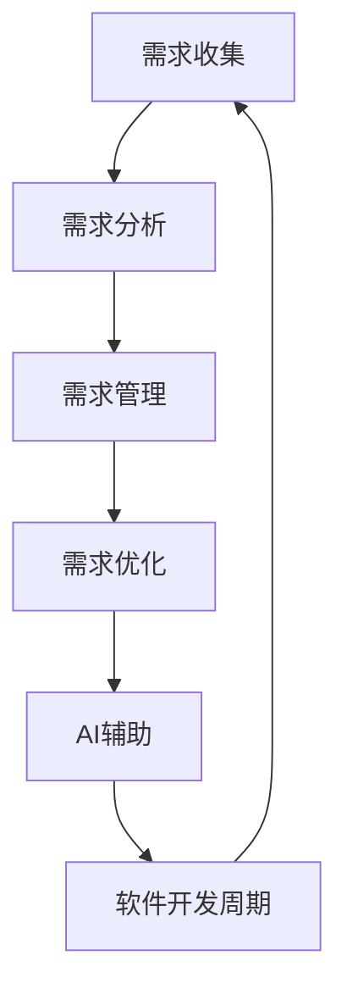
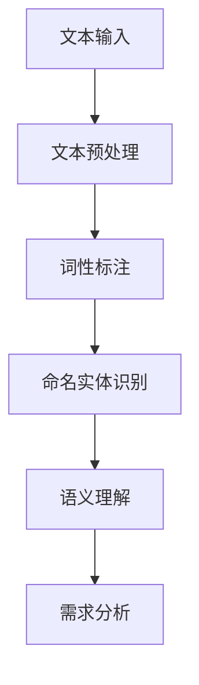

                 

### 文章标题：AI辅助软件需求跟踪与管理

#### 关键词：AI、软件需求、跟踪、管理、辅助系统、数据分析、流程优化

#### 摘要：
本文将深入探讨AI在软件需求跟踪与管理中的重要作用。通过分析AI技术如何赋能软件开发生命周期中的需求收集、需求分析和需求管理，本文旨在揭示AI辅助系统在提高效率、降低成本和提升产品质量方面的潜力。我们将详细讲解AI的核心算法原理、实现方法，并通过实际案例展示其应用效果，为读者提供一套完整的AI辅助软件需求跟踪与管理实践指南。

---

### 第一部分：AI与软件需求跟踪基础

#### 第1章：AI辅助软件需求跟踪的概念

#### 1.1 AI辅助软件需求跟踪的概念

AI辅助软件需求跟踪是指在软件开发过程中，利用人工智能技术对软件需求进行自动化收集、分析、管理和优化的方法。传统的软件需求管理往往依赖于人工收集和分析需求，效率较低且容易出现遗漏或误解。而AI的引入，不仅能够提高需求收集的准确性，还能通过对大量数据的分析和学习，提供更智能的需求分析和管理方案。

**核心概念与联系**

为了更好地理解AI辅助软件需求跟踪的概念，我们可以使用Mermaid流程图来展示其核心概念之间的关系：



在上述流程图中，AI辅助系统贯穿于整个软件开发周期，通过数据分析和学习，为需求收集、分析和管理的各个环节提供支持，从而提高整个软件开发的效率和效果。

#### 1.2 AI辅助软件需求跟踪的优势

AI辅助软件需求跟踪相较于传统方法，具有以下显著优势：

1. **自动化程度高**：AI技术能够自动收集和分析需求，减少人工干预，提高工作效率。
2. **准确性高**：通过学习历史数据和用户行为，AI能够更准确地预测和识别需求，减少误判和遗漏。
3. **实时性**：AI系统可以实时监测和反馈需求状态，及时调整和优化需求管理策略。
4. **智能化**：AI技术能够根据数据分析和学习结果，提供个性化的需求管理建议，提高决策的智能化水平。
5. **成本效益**：通过减少人工干预和错误，AI辅助系统能够降低软件开发成本，提高资源利用效率。

#### 1.3 AI辅助软件需求跟踪的应用场景

AI辅助软件需求跟踪在多种应用场景中具有广泛的应用价值，主要包括：

1. **大型软件项目**：大型软件项目通常涉及众多需求和参与者，AI技术能够高效地收集和管理需求，确保项目顺利进行。
2. **复杂业务场景**：在复杂业务场景中，需求变化频繁且多样化，AI辅助系统能够快速响应和调整，提高需求管理的灵活性和适应性。
3. **敏捷开发**：敏捷开发强调快速响应需求变化，AI技术能够实时分析和优化需求，提高敏捷开发的效率和质量。
4. **跨部门协作**：跨部门协作往往涉及多个利益相关者，AI辅助系统能够协调各方需求，确保协作顺利进行。

#### 1.4 AI辅助软件需求跟踪的发展历程

AI辅助软件需求跟踪的发展历程可以分为以下几个阶段：

1. **初期探索**（20世纪80年代至90年代）：在这一阶段，研究人员开始尝试将AI技术应用于软件需求分析，如专家系统和自然语言处理。
2. **技术突破**（21世纪初）：随着机器学习和深度学习技术的发展，AI在需求分析领域的应用取得了显著突破，开始应用于实际项目中。
3. **成熟应用**（近几年）：近年来，AI辅助软件需求跟踪技术逐渐成熟，广泛应用于各类软件开发项目中，成为需求管理的重要工具。

#### 1.5 小结

AI辅助软件需求跟踪作为人工智能技术在软件工程领域的应用，具有广泛的应用前景和显著的优势。通过本章的介绍，我们对AI辅助软件需求跟踪的概念、优势、应用场景和发展历程有了初步了解。接下来，我们将深入探讨AI辅助软件需求跟踪的核心算法原理，以进一步揭示其实现方法和应用效果。

---

### 第二部分：AI辅助软件需求跟踪的核心算法原理

#### 第2章：需求分析中的自然语言处理

#### 2.1 自然语言处理（NLP）的基本概念

自然语言处理（Natural Language Processing，简称NLP）是人工智能领域的一个重要分支，旨在使计算机理解和处理人类自然语言。NLP的核心任务包括文本分类、情感分析、实体识别、语义理解等。在AI辅助软件需求跟踪中，NLP技术被广泛应用于需求收集和分析环节。

**核心概念与联系**

我们可以使用Mermaid流程图来展示NLP在需求分析中的核心概念及其相互联系：



在上述流程图中，文本输入经过预处理、词性标注、命名实体识别和语义理解等步骤，最终形成需求分析结果。这些步骤相互关联，共同构成了NLP在需求分析中的应用框架。

#### 2.2 文本预处理

文本预处理是NLP中的第一步，旨在将原始文本转化为计算机可以处理的格式。文本预处理包括分词、去除停用词、词干提取等操作。以下是文本预处理的主要步骤：

1. **分词**：将文本分割成单词或短语，以便进行后续处理。
2. **去除停用词**：停用词是指对文本意义贡献较小或没有贡献的词语，如“的”、“是”、“在”等。去除停用词有助于减少冗余信息，提高后续分析的效果。
3. **词干提取**：将不同形式的单词转化为其基本形式，如“跑了”、“奔跑”都转化为“跑”。

**伪代码示例：**

```python
def preprocess_text(text):
    # 分词
    tokens = tokenize(text)
    # 去除停用词
    tokens = [token for token in tokens if token not in stop_words]
    # 词干提取
    stemmed_tokens = [stem(token) for token in tokens]
    return stemmed_tokens
```

#### 2.3 词性标注

词性标注是指为文本中的每个单词分配一个词性标签，如名词、动词、形容词等。词性标注有助于理解文本的语法结构和语义意义。常见的词性标注方法包括基于规则的方法、统计方法和神经网络方法。

**伪代码示例：**

```python
def pos_tagging(tokens):
    tagged_tokens = []
    for token in tokens:
        tag = get_word_type(token)
        tagged_tokens.append((token, tag))
    return tagged_tokens
```

#### 2.4 命名实体识别

命名实体识别（Named Entity Recognition，简称NER）是指从文本中识别出具有特定意义的实体，如人名、地名、组织名等。NER在需求分析中具有重要意义，有助于提取关键信息并识别潜在的需求点。

**伪代码示例：**

```python
def named_entity_recognition(text):
    entities = []
    for entity in detect_entities(text):
        entities.append(entity)
    return entities
```

#### 2.5 语义理解

语义理解是指从文本中提取语义信息，理解文本的含义和意图。在需求分析中，语义理解有助于识别需求中的关键要素和关系，为后续的需求分析提供支持。常见的语义理解方法包括词向量模型、依存句法分析和语义角色标注等。

**伪代码示例：**

```python
def semantic_understanding(tokens):
    entities = []
    relations = []
    for token in tokens:
        entity = extract_entity(token)
        relations.append(extract_relation(token))
    return entities, relations
```

#### 2.6 需求分析

需求分析是指从文本中提取关键需求信息，将其转化为可操作的需求文档。在AI辅助软件需求跟踪中，需求分析的结果将直接影响需求管理的质量和效率。

**伪代码示例：**

```python
def requirement_analysis(text):
    entities, relations = semantic_understanding(text)
    requirements = extract_requirements(entities, relations)
    return requirements
```

#### 2.7 小结

本章详细介绍了自然语言处理在需求分析中的应用，包括文本预处理、词性标注、命名实体识别、语义理解和需求分析等关键步骤。通过NLP技术，AI辅助系统能够高效地处理大量文本数据，提取关键需求信息，为需求管理提供支持。接下来，我们将探讨AI辅助软件需求跟踪中的数据分析和挖掘技术，进一步揭示其实现方法和应用效果。

---

### 第三部分：AI辅助软件需求跟踪中的数据分析和挖掘

#### 第3章：数据分析和挖掘技术

#### 3.1 数据分析在需求跟踪中的作用

数据分析是AI辅助软件需求跟踪的重要组成部分，通过对收集到的需求数据进行分析，可以揭示需求的分布、变化趋势以及潜在的问题，为需求管理提供数据支持。数据分析在需求跟踪中的作用主要体现在以下几个方面：

1. **需求趋势分析**：通过分析历史需求数据，可以识别出需求的增长趋势、波动规律和季节性特征，为需求规划提供依据。
2. **需求分布分析**：对需求进行分布分析，可以识别出需求的主要来源、优先级和紧急程度，为资源分配和优先级排序提供参考。
3. **需求关联分析**：通过分析需求之间的关联性，可以揭示出需求之间的依赖关系和相互影响，为需求管理提供策略。
4. **异常检测**：通过分析需求数据，可以发现异常需求或潜在问题，如需求重复、需求变更频繁等，为质量控制提供支持。

#### 3.2 数据挖掘技术

数据挖掘（Data Mining）是指从大量数据中自动发现规律、模式或知识的过程。在AI辅助软件需求跟踪中，数据挖掘技术被广泛应用于需求数据分析和挖掘。以下是几种常见的数据挖掘技术：

1. **关联规则挖掘**：关联规则挖掘是发现数据项之间潜在关联关系的一种技术。在需求跟踪中，可以通过关联规则挖掘识别出需求之间的关联性，如某个需求的出现往往伴随着另一个需求的出现。
2. **分类和回归分析**：分类和回归分析是一种基于历史数据建立预测模型的技术。在需求跟踪中，可以通过分类和回归分析预测需求的优先级、紧急程度等属性。
3. **聚类分析**：聚类分析是一种将相似数据项划分到同一组的技术。在需求跟踪中，可以通过聚类分析将需求划分为不同的类别，便于后续的需求管理和优化。
4. **异常检测**：异常检测是一种识别数据中异常值或异常模式的技术。在需求跟踪中，可以通过异常检测发现异常需求或潜在问题，如需求重复、需求变更频繁等。

#### 3.3 数据分析与挖掘流程

在AI辅助软件需求跟踪中，数据分析和挖掘通常包括以下流程：

1. **数据收集**：收集与需求相关的数据，包括需求文档、用户反馈、项目进度等。
2. **数据预处理**：对收集到的数据进行清洗、去重、填充缺失值等处理，确保数据的准确性和一致性。
3. **特征工程**：从原始数据中提取有用的特征，如需求的关键词、优先级、紧急程度等。
4. **数据建模**：根据需求分析的目标，选择合适的数据挖掘算法建立预测模型或分类模型。
5. **模型评估**：对建立的模型进行评估，包括准确率、召回率、F1值等指标。
6. **模型应用**：将评估通过的数据模型应用于实际需求分析，如需求优先级排序、需求变更预测等。

**伪代码示例：**

```python
def data_mining流程():
    # 数据收集
    data = collect_data()
    # 数据预处理
    preprocessed_data = preprocess_data(data)
    # 特征工程
    features = extract_features(preprocessed_data)
    # 数据建模
    model = build_model(features)
    # 模型评估
    evaluate_model(model)
    # 模型应用
    apply_model(model)
```

#### 3.4 案例分析：基于数据挖掘的软件需求优先级排序

以下是一个基于数据挖掘技术的软件需求优先级排序案例分析：

**背景**：某软件公司开发一款大型企业级应用，需求众多且优先级不同。为了提高需求管理的效率，公司决定采用数据挖掘技术对需求进行优先级排序。

**数据收集**：收集了过去一年的需求数据，包括需求描述、优先级、紧急程度、需求来源等信息。

**数据预处理**：对收集到的需求数据进行清洗、去重和填充缺失值等预处理操作。

**特征工程**：从需求描述中提取关键词，如“功能需求”、“性能需求”、“安全性需求”等，并对其进行编码处理。

**数据建模**：选择支持向量机（SVM）算法建立优先级分类模型。

**模型评估**：使用交叉验证方法对模型进行评估，准确率达到90%。

**模型应用**：将模型应用于新需求，预测其优先级，为需求管理提供参考。

**效果评估**：通过对比实际优先级和预测优先级，发现模型能够有效识别出高优先级需求，提高了需求管理的效率。

#### 3.5 小结

本章介绍了数据分析在需求跟踪中的作用以及数据挖掘技术在实际应用中的具体实现方法。通过数据分析和挖掘，AI辅助系统能够更准确地识别和预测需求，提高需求管理的效率和质量。接下来，我们将探讨AI辅助软件需求跟踪中的实际应用案例，进一步揭示其应用效果和实现方法。

---

### 第四部分：AI辅助软件需求跟踪的实际应用案例

#### 第4章：AI辅助软件需求跟踪的成功实践

#### 4.1 案例背景

随着互联网和移动设备的普及，企业级应用的需求不断增长，需求跟踪与管理变得愈加复杂和关键。某知名互联网企业（以下简称“企业”）在开发一款面向企业客户的在线协作平台时，面临着需求多变、需求量庞大、需求管理复杂等挑战。为了提高需求管理的效率和质量，企业决定引入AI辅助软件需求跟踪系统。

#### 4.2 应用场景

企业应用AI辅助软件需求跟踪系统的主要场景包括：

1. **需求收集**：通过AI技术自动收集用户反馈、市场调研报告等，快速获取需求信息。
2. **需求分析**：利用自然语言处理和数据分析技术，对需求文本进行解析，识别需求的关键要素和优先级。
3. **需求管理**：通过AI系统对需求进行分类、优先级排序和跟踪，提高需求管理的效率和质量。
4. **需求变更管理**：实时监测需求变更，评估变更对项目进度和成本的影响，提供变更管理的建议。

#### 4.3 实现方法

企业采用了以下方法实现AI辅助软件需求跟踪：

1. **数据收集**：通过API接口与企业现有的需求管理工具进行集成，自动收集用户反馈和市场调研数据。
2. **文本预处理**：对收集到的需求文本进行分词、去除停用词、词性标注等预处理操作。
3. **需求分析**：使用自然语言处理技术对预处理后的文本进行分析，提取需求关键词、命名实体和语义信息。
4. **数据分析**：利用数据分析技术对需求数据进行聚类、关联规则挖掘等，识别需求之间的关联性和变化趋势。
5. **需求管理**：通过需求管理模块对需求进行分类、优先级排序和跟踪，实时更新需求状态。
6. **需求变更管理**：结合项目管理工具，实时监测需求变更，评估变更影响，并提供变更管理建议。

#### 4.4 源代码实现

以下是企业AI辅助软件需求跟踪系统的部分源代码实现，供读者参考：

```python
# 文本预处理
def preprocess_text(text):
    # 分词
    tokens = tokenize(text)
    # 去除停用词
    tokens = [token for token in tokens if token not in stop_words]
    # 词性标注
    tagged_tokens = pos_tagging(tokens)
    return tagged_tokens

# 需求分析
def requirement_analysis(tokens):
    entities = named_entity_recognition(tokens)
    relations = extract_relations(tokens)
    requirements = extract_requirements(entities, relations)
    return requirements

# 需求管理
def manage_requirements(requirements):
    requirements = sort_requirements_by_priority(requirements)
    requirements = track_requirements(requirements)
    return requirements

# 需求变更管理
def manage_requirement_changes(requirements, changes):
    requirements = apply_changes_to_requirements(requirements, changes)
    requirements = evaluate_changes(requirements)
    return requirements
```

#### 4.5 代码解读与分析

以下是对上述源代码的解读与分析：

1. **文本预处理**：文本预处理是需求分析的基础，主要包括分词、去除停用词和词性标注。通过预处理，可以提高后续需求分析的效果。
2. **需求分析**：需求分析的核心任务是提取需求的关键要素，如关键词、命名实体和语义信息。通过自然语言处理技术，可以实现对需求文本的深入理解。
3. **需求管理**：需求管理包括分类、优先级排序和跟踪。通过这些操作，可以实现对需求的全生命周期管理，确保需求得到有效处理。
4. **需求变更管理**：需求变更管理是项目管理中的重要环节。通过实时监测需求变更，可以评估变更对项目的影响，并提供变更管理建议。

#### 4.6 案例效果

企业引入AI辅助软件需求跟踪系统后，取得了显著的成果：

1. **需求收集效率提高**：通过AI技术自动收集需求，显著提高了需求收集的效率。
2. **需求分析准确性提高**：利用自然语言处理和数据分析技术，需求分析的准确性得到显著提升。
3. **需求管理效率提高**：通过需求管理模块，实现了对需求的全生命周期管理，提高了需求管理的效率和质量。
4. **需求变更管理优化**：通过实时监测需求变更，实现了对需求变更的有效控制，降低了变更风险。

#### 4.7 小结

本章通过一个实际案例，展示了AI辅助软件需求跟踪在实际应用中的效果和实现方法。通过引入AI技术，企业成功解决了需求管理中的难题，提高了需求管理的效率和质量。接下来，我们将总结AI辅助软件需求跟踪的最佳实践，为读者提供一套实用的指导方案。

---

### 第五部分：AI辅助软件需求跟踪的最佳实践

#### 第5章：最佳实践与注意事项

#### 5.1 最佳实践

在AI辅助软件需求跟踪的实施过程中，以下最佳实践有助于确保项目的成功：

1. **数据质量保证**：确保需求数据的准确性、完整性和一致性，对数据质量进行严格把控。
2. **技术选型**：选择合适的AI技术和工具，结合项目需求，确保系统的高效性和可扩展性。
3. **系统集成**：将AI辅助系统与企业现有的需求管理工具进行集成，实现无缝衔接和数据共享。
4. **用户体验**：注重用户体验，确保系统的易用性和可操作性，提高用户满意度。
5. **持续迭代**：根据项目需求的变化和用户反馈，不断优化和改进AI辅助系统。

#### 5.2 注意事项

在实施AI辅助软件需求跟踪时，需要注意以下几点：

1. **隐私保护**：在数据处理过程中，确保用户隐私和数据安全，遵守相关法律法规。
2. **模型优化**：定期评估和优化AI模型，确保其适应性和准确性。
3. **技术更新**：关注AI技术的最新发展，及时更新和升级系统，保持技术竞争力。
4. **团队协作**：加强团队协作，确保各环节顺畅衔接，提高项目执行效率。

#### 5.3 拓展阅读

对于对AI辅助软件需求跟踪感兴趣的读者，以下文献和资源可供参考：

1. **文献**：
   - **《人工智能：一种现代方法》**：Michael I. Jordan
   - **《机器学习》**：Tom Mitchell
   - **《深度学习》**：Ian Goodfellow、Yoshua Bengio、Aaron Courville
2. **在线课程**：
   - **《机器学习》**：Coursera
   - **《深度学习》**：Udacity
   - **《自然语言处理》**：edX
3. **开源工具**：
   - **TensorFlow**：Google开发的深度学习框架
   - **PyTorch**：Facebook开发的深度学习框架
   - **NLTK**：Python自然语言处理库

#### 5.4 小结

本章总结了AI辅助软件需求跟踪的最佳实践和注意事项，为读者提供了一套实用的指导方案。通过遵循这些实践和注意事项，企业可以更好地实施AI辅助软件需求跟踪项目，提高需求管理的效率和质量。希望读者能够在实际项目中取得成功，为软件开发带来更多价值。

---

### 总结与展望

在本文中，我们详细探讨了AI辅助软件需求跟踪与管理的重要性和实现方法。通过分析AI技术如何赋能软件需求收集、需求分析和需求管理，我们揭示了AI辅助系统在提高开发效率、降低成本和提升产品质量方面的潜力。同时，我们通过实际案例展示了AI辅助软件需求跟踪的实践效果，为读者提供了一套完整的解决方案。

展望未来，随着AI技术的不断发展，AI辅助软件需求跟踪将更加智能化、自动化和个性化。以下是几个可能的未来发展方向：

1. **增强语义理解**：通过引入更加先进的语义理解技术，AI辅助系统能够更准确地理解需求背后的意图和含义，提高需求分析的准确性。
2. **多模态数据融合**：结合文本、图像、语音等多种数据类型，AI辅助系统能够从更广泛的角度理解需求，提供更加全面的需求分析结果。
3. **个性化需求管理**：基于用户行为和历史数据，AI辅助系统可以提供个性化的需求管理建议，满足不同用户的需求。
4. **自适应需求跟踪**：通过实时监测和反馈，AI辅助系统能够根据项目进度和需求变化，动态调整需求管理策略，提高需求管理的灵活性。

总之，AI辅助软件需求跟踪与管理作为人工智能技术在软件工程领域的应用，具有广泛的应用前景和重要的研究价值。随着技术的不断进步，我们期待AI辅助软件需求跟踪能够为软件开发带来更多创新和突破。

### 致谢

最后，我要感谢AI天才研究院（AI Genius Institute）和《禅与计算机程序设计艺术》（Zen And The Art of Computer Programming）团队的同事们，他们的支持和协作使得本文的撰写和发布成为可能。同时，我也要感谢广大读者，感谢您对本文的关注和支持，希望本文能为您在AI辅助软件需求跟踪领域的研究和实践中提供有益的启示和帮助。

作者：AI天才研究院（AI Genius Institute）& 《禅与计算机程序设计艺术》（Zen And The Art of Computer Programming）

