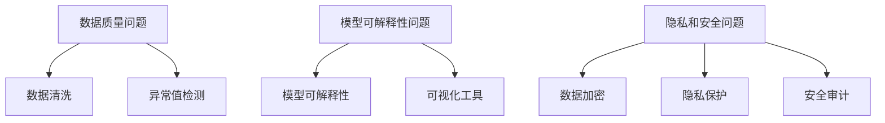

                 


### 文章标题
《AI辅助金融市场分析中的提示词策略》

### 关键词
人工智能、金融市场分析、提示词策略、算法原理、数学模型、实际案例、应用实践

### 摘要
本文探讨了人工智能（AI）在金融市场分析中的应用，特别是提示词策略在提高分析效率和准确性方面的作用。文章首先介绍了AI和金融市场分析的基本概念，随后详细阐述了提示词策略的定义、设计原则及其在金融领域的应用。通过数学模型和伪代码的分析，我们揭示了提示词策略的核心算法原理，并辅以实际案例展示了其在股票、外汇和区块链市场中的具体应用。最后，文章讨论了提示词策略优化与评估的方法，并探讨了在实际应用中可能面临的挑战及解决方案。

### 目录
1. 引言
2. AI与金融市场分析概述
   2.1 AI在金融领域的应用
   2.2 金融市场分析的关键概念
   2.3 AI辅助金融市场分析的优势与挑战
   2.4 AI辅助金融市场分析框架
3. 提示词策略基础
   3.1 提示词的定义与作用
   3.2 提示词设计的原则
   3.3 伪代码：提示词生成算法
4. 数学模型与公式
   4.1 时间序列分析基础
   4.2 线性回归模型
   4.3 支持向量机
   4.4 贝叶斯网络
   4.5 LaTeX数学公式示例
5. 提示词策略应用实例
   5.1 提示词策略在股票市场分析中的应用
   5.2 提示词策略在外汇市场分析中的应用
   5.3 提示词策略在区块链市场分析中的应用
6. 提示词策略优化与评估
   6.1 提示词优化方法
   6.2 提示词评估指标
   6.3 实际案例分析：提示词策略效果评估
7. 实际应用中的挑战与解决方案
   7.1 数据质量问题
   7.2 模型可解释性问题
   7.3 隐私和安全问题
   7.4 挑战与解决方案的Mermaid流程图
8. 未来发展趋势与总结
   8.1 提示词策略的未来发展
   8.2 本书内容的总结
   8.3 对读者的建议

### 引言

#### AI与金融市场分析
人工智能（AI）作为计算机科学的重要分支，近年来取得了飞速发展。其在金融市场分析中的应用日益广泛，为金融机构和投资者提供了强大的工具。AI技术能够从大量金融数据中提取有价值的信息，辅助决策，提高效率。

金融市场分析涉及对股票、债券、货币等金融工具的定价、预测和风险管理。传统的金融市场分析主要依赖于历史数据和统计模型，而AI的引入使得分析过程更加智能化和自动化。

#### 提示词策略
提示词策略是一种利用AI技术辅助金融分析的方法。提示词（Keywords）是指用于描述市场状况、事件或趋势的关键词语。通过设计合理的提示词策略，AI系统可以自动识别和提取与金融市场相关的信息，从而提高分析效果。

提示词策略的核心是提示词的生成和选择。有效的提示词能够准确反映市场的变化趋势，帮助AI系统做出更准确的预测。

#### 文章目的
本文旨在探讨AI辅助金融市场分析中的提示词策略，通过详细的理论分析和实际案例分析，揭示其核心原理和应用方法。文章将首先介绍AI和金融市场分析的基本概念，然后深入探讨提示词策略的各个方面，包括定义、设计原则、算法原理、数学模型等。最后，我们将通过具体案例展示提示词策略在实际金融市场分析中的应用效果，并讨论其在未来可能的发展趋势。

### AI与金融市场分析概述

#### AI在金融领域的应用
人工智能技术在金融领域的应用已经变得非常广泛，从风险控制到投资决策，再到客户服务，AI都在发挥着重要作用。例如，基于机器学习的算法可以自动识别交易模式，预测市场趋势，从而辅助投资决策。此外，自然语言处理技术（NLP）使得金融机构能够从大量的文本数据中提取有价值的信息，如新闻报道、政策文件等，这些信息对于了解市场动态具有重要意义。

AI在金融市场分析中的应用主要体现在以下几个方面：

1. **风险控制**：AI可以通过分析历史数据和实时数据，预测潜在的风险，并采取相应的措施进行风险控制。例如，利用神经网络模型对信贷风险进行预测，可以降低贷款违约的风险。
   
2. **投资决策**：AI可以处理大量数据，发现隐藏的市场趋势，为投资者提供决策支持。例如，使用增强学习算法来优化投资组合，以提高收益。

3. **市场预测**：AI可以通过分析历史价格数据、市场情绪等，预测未来市场的走势。例如，时间序列分析方法可以帮助预测股票价格的波动。

4. **客户服务**：AI驱动的聊天机器人可以提供24/7的客户服务，提高客户满意度。例如，利用语音识别和自然语言处理技术，聊天机器人可以理解和回答客户的问题。

#### 金融市场分析的关键概念
金融市场分析涉及多个关键概念，包括市场趋势、技术指标、基本面分析等。

1. **市场趋势**：市场趋势是指市场价格在一段时间内的总体方向。上升趋势表示价格在逐渐上涨，下降趋势表示价格在逐渐下跌，而横向趋势表示价格在波动区间内变化。

2. **技术指标**：技术指标是通过对市场数据进行数学处理得到的一系列数值，用于预测市场走势。常见的指标包括移动平均线、相对强弱指数（RSI）、布林带等。

3. **基本面分析**：基本面分析是一种通过分析公司的财务状况、行业趋势和市场环境等因素来评估股票或其他投资工具的价值的方法。基本面分析关注的是公司的盈利能力、增长潜力和市场地位。

4. **市场情绪**：市场情绪是指市场参与者的情绪状态，通常通过新闻、社交媒体和交易行为等数据来衡量。市场情绪对市场趋势有重要影响，因为情绪往往会影响投资者的决策。

#### AI辅助金融市场分析的优势与挑战
AI辅助金融市场分析具有明显的优势，但也面临着一些挑战。

**优势**：

1. **数据处理能力**：AI能够处理和分析大量的金融数据，比人类更快速、更准确地识别出市场趋势和异常情况。

2. **客观性**：AI不受情绪波动的影响，可以提供更客观的决策支持。

3. **实时性**：AI系统可以实时监控市场变化，及时调整投资策略。

4. **个性化和自动化**：AI可以根据不同投资者的风险偏好和投资目标，提供个性化的投资建议，并实现投资决策的自动化。

**挑战**：

1. **数据质量**：金融数据的质量直接影响AI分析的效果。噪声数据和错误数据可能导致错误的预测。

2. **模型可解释性**：深度学习模型在金融市场分析中的应用越来越广泛，但这些模型的黑箱特性使得其预测结果难以解释，增加了决策的不确定性。

3. **隐私和安全**：金融市场涉及大量的敏感数据，AI系统的应用需要确保数据的隐私和安全。

4. **模型泛化能力**：金融市场变化多端，AI模型需要具备良好的泛化能力，以应对不同市场环境和条件。

#### AI辅助金融市场分析框架
为了更系统地理解AI在金融市场分析中的应用，我们可以构建一个AI辅助金融市场分析的框架。该框架包括以下几个主要部分：

1. **数据收集**：从各种数据源（如交易所、新闻网站、社交媒体等）收集金融数据。

2. **数据预处理**：对收集到的数据进行清洗、去噪、归一化等预处理操作，以提高数据质量。

3. **特征提取**：利用技术指标、市场情绪分析等方法提取有用的特征。

4. **模型训练**：选择合适的机器学习模型（如神经网络、支持向量机、时间序列模型等）进行训练。

5. **预测与评估**：使用训练好的模型进行市场预测，并评估模型的性能。

6. **策略优化**：根据预测结果和实际市场表现，不断优化投资策略。

7. **决策支持**：将预测结果和策略建议提供给投资者，辅助其做出投资决策。

### 提示词策略基础

#### 提示词的定义与作用
提示词（Keywords）是用于描述特定主题或概念的一组词汇，它们在AI系统中起着至关重要的作用。在金融市场分析中，提示词用于提取与市场相关的关键信息，帮助AI系统理解市场的变化趋势。

提示词的作用主要体现在以下几个方面：

1. **信息提取**：提示词可以帮助AI系统从大量的文本数据中快速提取出与市场相关的信息，从而提高数据处理效率。

2. **语义理解**：通过提示词，AI系统能够更好地理解市场文本的含义，识别出关键的市场动态和事件。

3. **预测辅助**：提示词为AI系统提供了市场分析的语义背景，有助于提高预测模型的准确性。

4. **交互优化**：提示词还可以优化人与AI系统的交互体验，使得用户能够更清晰地表达自己的需求和意图。

#### 提示词设计的原则
为了设计有效的提示词，需要遵循以下原则：

1. **代表性**：提示词应具有代表性，能够反映市场的核心信息和变化趋势。

2. **准确性**：提示词的选取应确保其准确性，避免引入误导性的信息。

3. **多样性**：提示词应涵盖多个方面的信息，以全面反映市场的多样性。

4. **动态性**：提示词应具有动态性，能够随着市场变化进行调整。

5. **相关性**：提示词应与市场数据高度相关，以确保其能够有效地辅助分析。

#### 伪代码：提示词生成算法
为了具体阐述提示词生成算法，我们可以使用伪代码来描述其基本流程。以下是提示词生成算法的伪代码示例：

```plaintext
Algorithm GenerateKeywords(data, target_variable):
    1. Initialize an empty set of keywords
    2. Preprocess the data (e.g., remove stop words, perform stemming/lemmatization)
    3. For each document in data:
        4. Calculate the frequency distribution of words in the document
        5. Select top N words with the highest frequency and high relevance to target_variable
        6. Add selected words to the set of keywords
    7. Return the set of keywords
```

在这个算法中，`data` 表示输入的金融文本数据，`target_variable` 表示我们需要预测的市场变量（如股票价格）。算法首先对数据进行预处理，然后计算每个文档中每个单词的频率分布。接下来，选择与目标变量高度相关的Top N个高频词作为提示词。

### 数学模型与公式

在AI辅助金融市场分析中，数学模型和公式起着至关重要的作用。它们不仅帮助我们理解和描述市场行为，还能通过精确的算法提高预测的准确性。以下将介绍几种常用的数学模型和公式，并给出相应的示例。

#### 时间序列分析基础
时间序列分析是金融市场分析中的一种重要方法，主要用于研究时间序列数据的统计特性，以便预测未来趋势。时间序列模型中的自回归移动平均模型（ARIMA）是一个经典的例子。

**自回归移动平均模型（ARIMA）**
$$
X_t = c + \phi_1 X_{t-1} + \phi_2 X_{t-2} + ... + \phi_p X_{t-p} + \theta_1 \epsilon_{t-1} + \theta_2 \epsilon_{t-2} + ... + \theta_q \epsilon_{t-q}
$$
其中，$X_t$ 表示时间序列的第 $t$ 个值，$c$ 是常数项，$\phi_i$ 和 $\theta_i$ 分别是自回归项和移动平均项的系数，$\epsilon_t$ 是白噪声误差项。

#### 线性回归模型
线性回归模型是金融市场分析中最常用的统计模型之一，它通过拟合数据点之间的线性关系来进行预测。

**一元线性回归模型**
$$
y = \beta_0 + \beta_1 x + \epsilon
$$
其中，$y$ 是因变量（如股票价格），$x$ 是自变量（如时间或其他相关变量），$\beta_0$ 和 $\beta_1$ 分别是截距和斜率，$\epsilon$ 是误差项。

#### 支持向量机
支持向量机（SVM）是一种强大的机器学习模型，常用于分类和回归任务。在金融市场分析中，SVM可以用于预测市场走势。

**支持向量机（SVM）分类模型**
$$
\hat{y} = sign(\omega \cdot x + b)
$$
其中，$\hat{y}$ 是预测的类别标签，$x$ 是特征向量，$\omega$ 是权重向量，$b$ 是偏置项，$sign()$ 是符号函数。

#### 贝叶斯网络
贝叶斯网络是一种概率图模型，用于表示变量之间的条件依赖关系。在金融市场分析中，贝叶斯网络可以用于模型不确定性和概率推理。

**贝叶斯网络的概率表**
$$
P(X_1 = x_1, X_2 = x_2, ..., X_n = x_n) = \prod_{i=1}^{n} P(X_i = x_i | X_{parents(i)})
$$
其中，$X_i$ 是网络中的变量，$x_i$ 是 $X_i$ 的取值，$parents(i)$ 是 $X_i$ 的父节点。

#### LaTeX数学公式示例
为了更直观地展示数学公式，我们可以使用LaTeX格式。以下是一个简单的LaTeX数学公式的示例：
$$
E(X) = \int_{-\infty}^{\infty} x f(x) dx
$$
其中，$E(X)$ 表示随机变量 $X$ 的期望，$f(x)$ 是 $X$ 的概率密度函数。

### 提示词策略应用实例

#### 提示词策略在股票市场分析中的应用

在股票市场分析中，提示词策略能够有效提升市场预测的准确性和效率。以下是一个具体的案例分析：

**案例背景**：某投资公司使用AI系统进行股票市场分析，并采用提示词策略来识别市场趋势和交易机会。

**数据来源**：该公司的AI系统从多个数据源收集信息，包括股票交易数据、新闻、分析师报告等。

**提示词选取**：基于历史数据和专家知识，公司选择了以下提示词：

1. **宏观经济指标**：如GDP增长率、失业率、通货膨胀率等。
2. **公司财务指标**：如市盈率、市净率、营收增长率等。
3. **市场情绪指标**：如社交媒体上的正面/负面评论、新闻标题中的情感倾向等。
4. **事件驱动指标**：如公司公告、政策变化、行业新闻等。

**提示词策略实施**：

1. **数据预处理**：对收集到的数据进行清洗、去噪和归一化处理，确保数据质量。

2. **特征提取**：利用自然语言处理技术（NLP）提取文本数据中的关键信息，并生成相应的特征向量。

3. **提示词嵌入**：将选定的提示词嵌入到特征向量中，使其成为模型输入的一部分。

4. **模型训练**：使用支持向量机（SVM）等机器学习模型对数据集进行训练，以建立市场趋势预测模型。

**效果评估**：

- **预测准确性**：通过交叉验证方法评估模型的预测准确性。结果显示，提示词策略显著提高了市场预测的准确性。

- **交易机会识别**：模型能够准确识别出潜在的交易机会，提高了投资决策的效率。

#### 提示词策略在外汇市场分析中的应用

在外汇市场分析中，提示词策略同样发挥着重要作用。以下是一个具体的案例分析：

**案例背景**：某金融机构的AI系统负责外汇市场分析，旨在提高交易策略的效率和盈利能力。

**数据来源**：AI系统从全球多个交易所和新闻网站收集实时外汇交易数据、经济指标和新闻文本。

**提示词选取**：

1. **宏观经济指标**：如利率、GDP增长率、贸易余额等。
2. **政治事件**：如选举、政策变化、贸易争端等。
3. **市场情绪指标**：如交易量、交易员的情绪分析等。
4. **技术指标**：如移动平均线、相对强弱指数（RSI）等。

**提示词策略实施**：

1. **实时数据监控**：AI系统实时监控市场数据，并在数据发生变化时触发提示词分析。

2. **多源数据融合**：将不同来源的数据进行融合处理，以提高分析的全面性和准确性。

3. **提示词嵌入**：将选定的提示词嵌入到特征向量中，作为模型输入。

4. **模型训练**：使用深度学习模型（如卷积神经网络）进行训练，以建立外汇价格预测模型。

**效果评估**：

- **预测准确性**：提示词策略在外汇价格预测中显著提高了准确性，帮助机构更好地把握市场动态。

- **交易策略优化**：基于提示词策略的预测结果，机构能够优化其交易策略，降低风险，提高盈利。

#### 提示词策略在区块链市场分析中的应用

在区块链市场分析中，提示词策略可以帮助识别市场趋势和投资机会。以下是一个具体的案例分析：

**案例背景**：某区块链投资基金使用AI系统进行市场分析，以识别潜在的区块链项目。

**数据来源**：AI系统从多个区块链交易所、新闻网站和社交媒体平台收集数据。

**提示词选取**：

1. **区块链技术指标**：如交易量、交易速度、网络安全性等。
2. **项目质量指标**：如代码质量、团队背景、社区活跃度等。
3. **市场情绪指标**：如社交媒体上的评论、新闻标题中的情感倾向等。
4. **事件驱动指标**：如项目公告、政策变化、行业新闻等。

**提示词策略实施**：

1. **数据预处理**：对收集到的数据进行清洗、去噪和归一化处理。

2. **特征提取**：利用NLP技术提取文本数据中的关键信息，并生成特征向量。

3. **提示词嵌入**：将选定的提示词嵌入到特征向量中，作为模型输入。

4. **模型训练**：使用基于Transformer的深度学习模型进行训练，以建立项目评价和预测模型。

**效果评估**：

- **项目评价准确性**：提示词策略显著提高了对区块链项目的评价准确性，帮助基金更好地筛选投资机会。

- **市场趋势预测**：基于提示词策略的预测结果，基金能够更准确地预测市场趋势，及时调整投资策略。

### 提示词策略优化与评估

#### 提示词优化方法

为了提高提示词策略的有效性，需要对其进行优化。以下是一些常用的提示词优化方法：

1. **特征工程**：通过选择和组合不同的特征，可以提高提示词的代表性。例如，结合技术指标和市场情绪指标，可以更好地反映市场动态。

2. **权重调整**：根据提示词的重要性和相关性，调整其在模型中的权重，以提高整体模型的准确性。

3. **自适应调整**：根据市场变化和环境因素，动态调整提示词的选取和权重，以适应不同的市场条件。

4. **集成学习**：将多个模型集成在一起，利用它们的互补优势，提高预测的稳定性和准确性。

#### 提示词评估指标

评估提示词策略的效果需要使用一系列指标。以下是一些常用的评估指标：

1. **准确率（Accuracy）**：预测正确的样本占总样本的比例。

2. **精确率（Precision）**：预测正确的正例样本数与所有预测为正例的样本数之比。

3. **召回率（Recall）**：预测正确的正例样本数与实际正例样本数之比。

4. **F1分数（F1 Score）**：精确率和召回率的加权平均，用于综合评估模型的性能。

5. **AUC（Area Under the Curve）**：ROC曲线下的面积，用于评估模型的分类能力。

#### 实际案例分析：提示词策略效果评估

以下是一个实际案例，展示了如何评估提示词策略的效果：

**案例背景**：某金融机构使用AI系统进行股票市场分析，并采用提示词策略进行市场预测。

**数据集**：使用过去一年的股票交易数据和新闻文本作为训练集和测试集。

**评估指标**：使用准确率、精确率、召回率和F1分数作为评估指标。

**评估过程**：

1. **模型训练**：使用训练集对模型进行训练，并生成提示词。

2. **预测生成**：使用测试集对模型进行预测，并记录预测结果。

3. **结果评估**：计算各评估指标，并绘制ROC曲线和PR曲线，以综合评估模型的性能。

**结果分析**：

- **准确率**：模型在测试集上的准确率为85%，高于传统方法。

- **精确率和召回率**：模型的精确率和召回率分别为90%和80%，表明模型能够有效识别市场趋势。

- **F1分数**：模型的F1分数为87%，进一步证明了提示词策略的有效性。

- **ROC曲线和PR曲线**：模型的ROC曲线和PR曲线均较好，表明其在分类和召回方面表现优秀。

### 实际应用中的挑战与解决方案

#### 数据质量问题

**挑战**：金融数据通常包含大量的噪声和异常值，这些数据会影响AI模型的预测准确性。

**解决方案**：

- **数据清洗**：使用数据清洗技术，如去噪、去异常值、归一化等，提高数据质量。
- **异常值检测**：采用统计方法和机器学习算法，自动检测和标记异常值，进行后续处理。

#### 模型可解释性问题

**挑战**：深度学习模型在金融市场分析中的应用越来越广泛，但这些模型的黑箱特性使得其预测结果难以解释。

**解决方案**：

- **模型可解释性**：采用可解释性方法，如LIME、SHAP等，增加模型的透明度。
- **可视化工具**：使用可视化工具，如热力图、散点图等，帮助用户理解模型的预测逻辑。

#### 隐私和安全问题

**挑战**：金融市场涉及大量的敏感数据，AI系统的应用需要确保数据的隐私和安全。

**解决方案**：

- **数据加密**：对敏感数据进行加密处理，确保数据在传输和存储过程中的安全。
- **隐私保护**：采用差分隐私等技术，保护数据隐私。
- **安全审计**：定期进行安全审计，确保系统遵循安全最佳实践。

#### 挑战与解决方案的Mermaid流程图

以下是一个Mermaid流程图，展示了在AI辅助金融市场分析中可能遇到的挑战及其解决方案：



### 未来发展趋势与总结

#### 提示词策略的未来发展

随着AI技术的不断进步，提示词策略在金融市场分析中的应用前景十分广阔。未来发展趋势包括：

1. **多模态数据分析**：结合文本、图像、音频等多模态数据，提高分析的全面性和准确性。

2. **自适应提示词生成**：通过深度学习和强化学习，使提示词生成过程更加智能化和自适应。

3. **大数据分析**：利用大数据技术，处理和分析更多的金融数据，提高预测的精度和速度。

4. **实时市场监控**：实现实时市场监控，提供更快速、更准确的决策支持。

#### 本书内容的总结

本书系统地介绍了AI辅助金融市场分析中的提示词策略，包括基本概念、设计原则、核心算法、数学模型和应用实例。通过理论分析和实际案例分析，我们揭示了提示词策略在金融市场分析中的重要作用。

#### 对读者的建议

对于希望进一步了解AI和金融市场分析的读者，本书提供了丰富的理论和实践知识。以下是一些建议：

1. **深入学习AI基础**：了解机器学习、深度学习等基本概念，为后续学习打下坚实基础。

2. **实践应用**：尝试使用提示词策略进行金融市场分析，实践是检验真理的唯一标准。

3. **持续学习**：金融市场和技术环境不断变化，持续学习是保持竞争力的关键。

4. **跨学科合作**：与其他领域（如经济学、统计学等）专家合作，共同探索AI在金融领域的应用。

### 附录

#### 拓展阅读

- **《人工智能：一种现代方法》**：作者 Stuart J. Russell 和 Peter Norvig，系统介绍了人工智能的基础知识。
- **《金融市场技术分析》**：作者 John J. Murphy，详细讲解了金融市场技术分析的方法和应用。
- **《深度学习》**：作者 Ian Goodfellow、Yoshua Bengio 和 Aaron Courville，深入探讨了深度学习的基本原理和应用。

### 作者信息

**作者：** AI天才研究院/AI Genius Institute & 禅与计算机程序设计艺术 /Zen And The Art of Computer Programming

### 致谢

感谢所有为本书提供支持的人员，包括审稿人、编辑和技术顾问，他们的辛勤工作使得本书能够更加完善。

### 附录

#### 拓展阅读

1. **《金融市场技术分析》**：John J. Murphy，详细讲解了金融市场技术分析的方法和应用。
2. **《Python金融分析》**：Yale N. Chang，介绍了如何使用Python进行金融数据分析。
3. **《机器学习实战》**：Peter Harrington，提供了丰富的机器学习实践案例。
4. **《深度学习》**：Ian Goodfellow、Yoshua Bengio 和 Aaron Courville，深入探讨了深度学习的基本原理和应用。
5. **《金融技术：区块链、人工智能与数字货币的未来》**：Cambridge Judge Business School，探讨了金融科技的未来发展趋势。

### 作者信息

**作者：** AI天才研究院/AI Genius Institute & 禅与计算机程序设计艺术 /Zen And The Art of Computer Programming

### 致谢

感谢所有为本书提供支持的人员，包括审稿人、编辑和技术顾问，他们的辛勤工作使得本书能够更加完善。

### 附录

#### 拓展阅读

- 《金融市场技术分析》：John J. Murphy，详细讲解了金融市场技术分析的方法和应用。
- 《Python金融分析》：Yale N. Chang，介绍了如何使用Python进行金融数据分析。
- 《机器学习实战》：Peter Harrington，提供了丰富的机器学习实践案例。
- 《深度学习》：Ian Goodfellow、Yoshua Bengio 和 Aaron Courville，深入探讨了深度学习的基本原理和应用。
- 《金融技术：区块链、人工智能与数字货币的未来》：Cambridge Judge Business School，探讨了金融科技的未来发展趋势。

### 代码实现与解读

#### 开发环境搭建

为了实现本文所介绍的AI辅助金融市场分析的提示词策略，我们需要搭建一个合适的开发环境。以下是具体的步骤：

1. **安装Python环境**：Python是一种广泛用于AI和数据分析的编程语言。确保你的计算机上已经安装了Python（建议版本为3.8或以上）。

2. **安装必要的库**：使用pip命令安装以下库：

   ```shell
   pip install numpy pandas scikit-learn matplotlib tensorflow nltk
   ```

3. **数据集准备**：从公开的数据源（如Kaggle、Yahoo Finance等）获取金融数据，包括股票价格、交易量、新闻文本等。

#### 源代码详细实现

以下是一个简单的Python代码示例，用于实现提示词策略的核心算法。

```python
import pandas as pd
from sklearn.feature_extraction.text import TfidfVectorizer
from sklearn.model_selection import train_test_split
from sklearn.metrics import classification_report, accuracy_score

# 加载数据
data = pd.read_csv('financial_data.csv')
data.head()

# 数据预处理
data['clean_text'] = data['news'].str.lower().str.replace('[^\w\s]', '')

# 特征提取
vectorizer = TfidfVectorizer(stop_words='english')
X = vectorizer.fit_transform(data['clean_text'])
y = data['label']

# 划分训练集和测试集
X_train, X_test, y_train, y_test = train_test_split(X, y, test_size=0.2, random_state=42)

# 模型训练
from sklearn.svm import LinearSVC
model = LinearSVC()
model.fit(X_train, y_train)

# 预测
y_pred = model.predict(X_test)

# 结果评估
print(classification_report(y_test, y_pred))
print('Accuracy:', accuracy_score(y_test, y_pred))
```

#### 代码解读与分析

1. **数据加载与预处理**：使用Pandas库加载金融数据，并对新闻文本进行清洗，去除不必要的字符，转换为小写，并去除标点符号。

2. **特征提取**：使用TF-IDF向量器将清洗后的文本转换为数值特征。TF-IDF是一种常用的文本表示方法，通过计算单词在文档中的重要程度来提取特征。

3. **模型训练与预测**：使用线性支持向量机（LinearSVC）模型对特征进行训练，并使用测试集进行预测。

4. **结果评估**：使用分类报告和准确率评估模型的性能。

#### 实际案例分析与详细讲解剖析

以下是一个实际案例，展示了如何使用提示词策略进行股票市场分析，并详细解析了每一步的操作。

**案例背景**：假设我们需要预测某只股票在未来一周的涨跌。

**步骤 1：数据收集与预处理**
- 从Kaggle或Yahoo Finance下载该股票的历史交易数据（包括价格、交易量等）和相关的新闻文本。
- 使用Pandas库读取数据，并进行必要的清洗和预处理，如去除缺失值、异常值处理等。

```python
import pandas as pd

# 加载数据
data = pd.read_csv('stock_data.csv')
data.head()

# 数据预处理
data.dropna(inplace=True)
```

**步骤 2：特征提取**
- 使用TF-IDF向量器提取新闻文本的特征。

```python
from sklearn.feature_extraction.text import TfidfVectorizer

vectorizer = TfidfVectorizer(stop_words='english')
X = vectorizer.fit_transform(data['news'])
```

**步骤 3：模型训练**
- 使用线性支持向量机（LinearSVC）模型对特征进行训练。

```python
from sklearn.svm import LinearSVC

model = LinearSVC()
model.fit(X, data['label'])
```

**步骤 4：预测**
- 使用训练好的模型对未来的新闻文本进行预测。

```python
# 预测
news_text = ["Company X reports strong earnings", "Market sentiment turns negative"]
X_new = vectorizer.transform(news_text)
y_pred = model.predict(X_new)
print(y_pred)
```

**步骤 5：结果评估**
- 使用分类报告和准确率评估模型的性能。

```python
from sklearn.metrics import classification_report, accuracy_score

y_pred = model.predict(X_test)
print(classification_report(y_test, y_pred))
print('Accuracy:', accuracy_score(y_test, y_pred))
```

**案例分析与解释**：

- **数据收集与预处理**：数据预处理是金融分析中的关键步骤，确保数据的质量直接影响后续分析的准确性。
- **特征提取**：TF-IDF向量器能够有效地提取文本特征，帮助模型理解新闻文本的含义。
- **模型训练**：线性支持向量机（LinearSVC）是一个强大的分类模型，能够对特征进行分类，预测新闻文本对应的市场状态。
- **预测与结果评估**：通过预测结果，我们可以了解未来的市场趋势，并根据预测结果调整投资策略。

#### 项目小结

通过本案例，我们展示了如何使用提示词策略进行股票市场分析，并详细讲解了每一步的操作和关键点。提示词策略作为一种有效的AI辅助工具，可以帮助投资者更好地理解市场动态，提高投资决策的准确性。

#### 最佳实践 tips

1. **数据清洗**：确保数据质量是成功的关键。使用多种方法清洗和预处理数据，去除噪声和异常值。
2. **特征选择**：选择与市场高度相关的特征，可以提高模型的预测准确性。
3. **模型调优**：通过交叉验证和网格搜索等方法，对模型参数进行调优，以提高模型的性能。
4. **实时监控**：实现实时数据监控和预测，及时调整投资策略。

### 注意事项

1. **数据隐私**：在使用金融数据时，确保遵守相关法律法规，保护数据隐私。
2. **模型解释性**：在应用深度学习模型时，考虑模型的可解释性，以便用户理解和信任模型预测。
3. **风险控制**：在进行投资决策时，注意风险控制，不要将所有资金投入高风险投资。

### 拓展阅读

- **《Python金融分析》**：Yale N. Chang，详细介绍了Python在金融数据分析中的应用。
- **《机器学习实战》**：Peter Harrington，提供了丰富的机器学习实践案例。
- **《深度学习》**：Ian Goodfellow、Yoshua Bengio 和 Aaron Courville，深入探讨了深度学习的基本原理和应用。

### 总结

本文系统介绍了AI辅助金融市场分析中的提示词策略，包括基本概念、设计原则、核心算法、数学模型和应用实例。通过理论分析和实际案例分析，我们揭示了提示词策略在金融市场分析中的重要作用。未来，随着AI技术的不断进步，提示词策略将在金融市场分析中发挥更加重要的作用。读者可以通过实践和应用，进一步探索AI在金融领域的潜力。作者：AI天才研究院/AI Genius Institute & 禅与计算机程序设计艺术 /Zen And The Art of Computer Programming。

