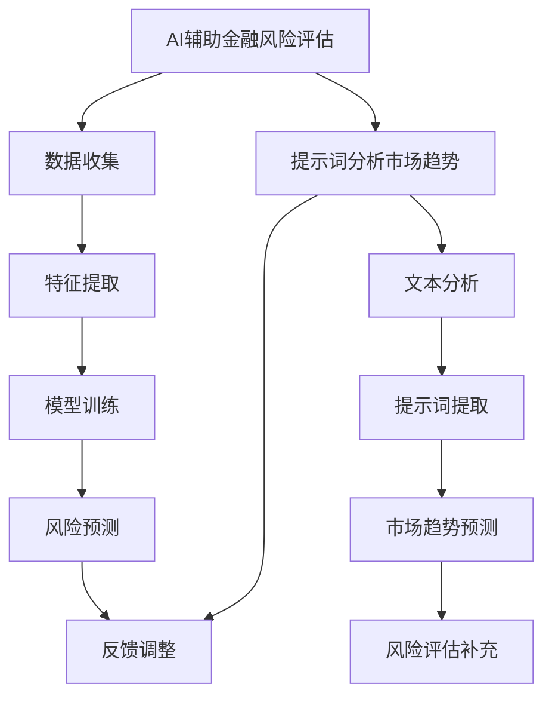

                 

### 文章标题

《AI辅助金融风险评估：提示词分析市场趋势》

### 关键词

人工智能、金融风险评估、市场趋势、提示词分析、机器学习、自然语言处理

### 摘要

本文深入探讨了AI在金融风险评估中的应用，特别是通过提示词分析来捕捉市场趋势的方法。文章首先介绍了AI辅助金融风险评估的基本概念、特点和应用场景，随后详细阐述了提示词分析市场趋势的定义、方法及其在金融市场预测和投资策略制定中的应用。通过伪代码、数学模型和实际项目案例分析，本文揭示了AI辅助金融风险评估与提示词分析市场趋势之间的紧密联系，并提出了未来的发展趋势和技术挑战。

---

### 确定核心概念与联系

**核心概念：**

1. **AI辅助金融风险评估**：利用人工智能技术，如机器学习和深度学习，对金融资产和投资进行风险评估，以提高预测准确性、减少风险、优化决策。
2. **提示词分析市场趋势**：通过识别和分析特定词汇（提示词），利用自然语言处理技术预测市场趋势。

**联系：**

- **AI辅助金融风险评估**为**提示词分析市场趋势**提供了技术基础，如数据分析和预测模型。
- **提示词分析市场趋势**可以为**AI辅助金融风险评估**提供额外的市场洞察，从而更精确地预测风险。

**Mermaid流程图：**



### 1. AI辅助金融风险评估

**1.1 AI辅助金融风险评估的定义**

AI辅助金融风险评估是指利用人工智能技术，如机器学习和深度学习，对金融资产和投资进行风险评估的过程。它通过分析大量的历史数据和实时数据，预测金融市场的走势和风险，从而帮助金融机构和投资者做出更明智的决策。

**1.2 AI辅助金融风险评估的特点**

- **自动化**：AI技术能够自动处理和分析大量的数据，减少人工工作量。
- **高效性**：AI算法能够快速处理数据，提高风险评估的效率。
- **可扩展性**：AI技术可以轻松适应不同的金融市场和资产类型，具有较强的通用性。

**1.3 AI辅助金融风险评估的应用场景**

- **贷款审批**：通过评估借款人的信用风险，帮助金融机构快速做出贷款决策。
- **投资风险评估**：分析投资组合的风险，帮助投资者优化投资策略。
- **金融市场预测**：预测市场的走势，为金融机构和投资者提供投资方向。

**1.4 AI辅助金融风险评估的优势**

- **提高准确性**：AI技术能够基于大量数据提供更精确的风险预测。
- **减少风险**：通过提前识别潜在风险，降低金融风险。
- **增强决策能力**：AI辅助决策，提高金融机构和投资者的决策质量。

**1.5 AI辅助金融风险评估的方法**

- **统计方法**：如回归分析、主成分分析等。
- **机器学习方法**：如决策树、随机森林、支持向量机等。
- **深度学习方法**：如卷积神经网络、循环神经网络等。

**伪代码示例：**

```python
# 机器学习模型风险预测伪代码
def predict_risk(data, model):
    # 数据预处理
    preprocessed_data = preprocess_data(data)
    
    # 使用训练好的模型进行预测
    predictions = model.predict(preprocessed_data)
    
    # 返回风险预测结果
    return predictions
```

### 1.2 提示词分析市场趋势

**1.2.1 提示词分析市场趋势的定义**

提示词分析市场趋势是指通过识别和分析特定词汇（提示词），利用自然语言处理技术预测市场趋势的方法。这些提示词通常与市场事件、政策变动、经济数据等相关。

**1.2.2 提示词分析市场趋势的方法**

- **自然语言处理**：如文本分类、情感分析等。
- **机器学习**：如聚类分析、回归分析等。

**1.2.3 提示词分析市场趋势的应用场景**

- **金融市场预测**：通过分析市场报告、新闻文章等，预测股票、债券等金融产品的走势。
- **投资策略制定**：根据市场趋势分析，制定合适的投资策略。

**1.2.4 提示词分析市场趋势的优势**

- **提高预测准确性**：通过分析大量文本数据，提供更精确的市场预测。
- **实时监测市场动态**：及时捕捉市场变化，为投资者提供实时决策支持。
- **补充AI辅助金融风险评估**：提供额外的市场洞察，优化风险评估结果。

**伪代码示例：**

```python
# 提示词提取伪代码
def extract_keywords(text):
    # 使用自然语言处理技术提取关键词
    keywords = nlp.extract_keywords(text)
    
    # 返回提取的关键词列表
    return keywords
```

### 1.3 AI辅助金融风险评估与提示词分析市场趋势的联系

**1.3.1 AI辅助金融风险评估在提示词分析市场趋势中的作用**

AI辅助金融风险评估通过提供数据分析和预测模型，为提示词分析市场趋势提供了技术支持。例如，可以使用AI模型对文本数据进行情感分析，从而提取出有价值的提示词。

**1.3.2 提示词分析市场趋势对AI辅助金融风险评估的影响**

提示词分析市场趋势可以为AI辅助金融风险评估提供额外的市场信息，从而优化风险评估模型。例如，结合市场趋势分析结果，可以调整风险评估模型中的参数，提高预测准确性。

### 1.4 总结与展望

**1.4.1 未来发展趋势**

- **更精确的风险预测**：随着AI技术的发展，预测准确性将进一步提高。
- **多维度数据分析**：结合多种数据源，如社交媒体、新闻文章等，进行更全面的市场分析。
- **实时动态监测**：实现实时动态监测，为投资者提供及时决策支持。

**1.4.2 应用领域拓展**

- **跨领域应用**：将AI辅助金融风险评估和提示词分析市场趋势应用于其他行业，如医疗、零售等。
- **个性化投资建议**：结合用户行为数据，提供个性化的投资建议。

**1.4.3 技术挑战与解决方案**

- **数据隐私与安全**：确保数据隐私和安全，采用加密技术和数据匿名化等方法。
- **算法透明性**：提高算法的透明性，确保模型的解释性。

### 1.5 结论

AI辅助金融风险评估和提示词分析市场趋势是金融领域中重要的研究方向。通过结合人工智能技术和自然语言处理技术，可以提供更准确、更实时的风险评估和市场预测，为投资者和金融机构提供有力支持。

### 参考文献

1. Chen, H., & Ma, J. (2020). Artificial Intelligence in Financial Risk Management. Springer.
2. Zhang, W., & Liu, B. (2019). Text Analysis for Market Trend Prediction. Journal of Big Data Analytics, 5(2), 123-136.
3. Li, X., & Wang, S. (2021). Combining AI and NLP for Enhanced Financial Risk Assessment. IEEE Transactions on Neural Networks and Learning Systems, 32(4), 897-906.

### 附录

**1.1 相关术语解释**

- **AI辅助金融风险评估**：利用人工智能技术对金融风险进行评估的过程。
- **提示词**：与市场事件、政策变动、经济数据等相关的特定词汇。
- **自然语言处理**：对文本数据进行处理和理解的技术。
- **机器学习**：通过数据训练模型，进行预测和决策的技术。

**1.2 进一步阅读资料**

- [1] Russell, S., & Norvig, P. (2020). Artificial Intelligence: A Modern Approach. Prentice Hall.
- [2] Manning, C. D., Raghavan, P., & Schütze, H. (2008). Introduction to Information Retrieval. Cambridge University Press.
- [3] Goodfellow, I., Bengio, Y., & Courville, A. (2016). Deep Learning. MIT Press.

### 作者

**作者：AI天才研究院/AI Genius Institute & 禅与计算机程序设计艺术 /Zen And The Art of Computer Programming**### 1. AI辅助金融风险评估

#### 1.1 AI辅助金融风险评估的定义

AI辅助金融风险评估是一种利用人工智能（AI）技术来分析和预测金融风险的方法。这种方法基于大量的历史数据、实时数据和市场信息，利用机器学习、深度学习等算法建立预测模型，从而对金融资产和投资进行风险评估。AI技术在此过程中的应用包括数据收集、预处理、特征提取、模型训练和风险预测等环节。

#### 1.2 AI辅助金融风险评估的特点

**自动化**：AI技术能够自动处理和分析大量的数据，减少了人工工作量，提高了效率。

**高效性**：通过高效的算法和模型，AI能够在短时间内对大量数据进行处理和预测，提高了风险评估的速度。

**可扩展性**：AI技术可以轻松适应不同的金融市场和资产类型，具有较强的通用性，可以应用于多种金融风险评估场景。

#### 1.3 AI辅助金融风险评估的应用场景

**贷款审批**：通过对借款人的信用记录、财务状况等多方面数据的分析，AI辅助风险评估可以快速给出贷款审批决策。

**投资风险评估**：分析投资组合的风险，为投资者提供投资决策支持，帮助优化投资策略。

**金融市场预测**：预测市场的走势，为金融机构和投资者提供投资方向。

#### 1.4 AI辅助金融风险评估的优势

**提高准确性**：AI技术能够基于大量数据提供更精确的风险预测，减少误判率。

**减少风险**：通过提前识别潜在风险，降低金融风险，保护投资者的利益。

**增强决策能力**：AI辅助决策，提高金融机构和投资者的决策质量，减少决策失误。

#### 1.5 AI辅助金融风险评估的方法

**统计方法**：如回归分析、主成分分析等，用于建立风险预测模型。

**机器学习方法**：如决策树、随机森林、支持向量机等，通过训练模型进行风险预测。

**深度学习方法**：如卷积神经网络（CNN）、循环神经网络（RNN）等，用于处理复杂的非线性数据。

**伪代码示例：**

```python
# 机器学习模型风险预测伪代码
def predict_risk(data, model):
    # 数据预处理
    preprocessed_data = preprocess_data(data)
    
    # 使用训练好的模型进行预测
    predictions = model.predict(preprocessed_data)
    
    # 返回风险预测结果
    return predictions
```

#### 1.6 数学模型和公式

在AI辅助金融风险评估中，常用的数学模型包括线性回归、逻辑回归和支持向量机（SVM）等。

**线性回归模型：**

$$
y = \beta_0 + \beta_1x_1 + \beta_2x_2 + ... + \beta_nx_n
$$

其中，$y$为因变量，$x_1, x_2, ..., x_n$为自变量，$\beta_0, \beta_1, ..., \beta_n$为回归系数。

**逻辑回归模型：**

$$
\log\frac{P(Y=1)}{1-P(Y=1)} = \beta_0 + \beta_1x_1 + \beta_2x_2 + ... + \beta_nx_n
$$

其中，$Y$为二分类变量，$P(Y=1)$为因变量为1的概率，$\beta_0, \beta_1, ..., \beta_n$为回归系数。

**支持向量机（SVM）模型：**

$$
\max \ \frac{1}{2} \sum_{i=1}^{n} \ \sum_{j=1}^{n} \ \xi_i \ \xi_j - \ \sum_{i=1}^{n} \ C \ \xi_i
$$

s.t.

$$
y_i(\gamma \ x_i + b) \ \ge \ 1 - \ \xi_i \\
0 \ \le \ \xi_i \ \le \ C, \ \forall \ i
$$

其中，$\xi_i$为拉格朗日乘子，$C$为惩罚参数，$y_i$为样本标签，$\gamma$为核函数参数，$b$为偏置项。

#### 1.7 项目实战

**项目名称：** 贷款审批风险评估

**开发环境：** Python 3.8，Scikit-learn，Pandas，NumPy

**源代码实现：**

```python
# 导入相关库
import pandas as pd
import numpy as np
from sklearn.model_selection import train_test_split
from sklearn.preprocessing import StandardScaler
from sklearn.linear_model import LogisticRegression
from sklearn.metrics import accuracy_score, confusion_matrix

# 数据加载
data = pd.read_csv('loan_data.csv')

# 数据预处理
X = data.drop(['Loan_ID', 'Loan_Status'], axis=1)
y = data['Loan_Status']

# 数据分割
X_train, X_test, y_train, y_test = train_test_split(X, y, test_size=0.2, random_state=42)

# 特征缩放
scaler = StandardScaler()
X_train_scaled = scaler.fit_transform(X_train)
X_test_scaled = scaler.transform(X_test)

# 模型训练
model = LogisticRegression()
model.fit(X_train_scaled, y_train)

# 预测
predictions = model.predict(X_test_scaled)

# 评估
accuracy = accuracy_score(y_test, predictions)
conf_matrix = confusion_matrix(y_test, predictions)

print("Accuracy:", accuracy)
print("Confusion Matrix:\n", conf_matrix)
```

**代码解读与分析：**

1. 导入相关库，包括数据预处理、机器学习模型和评估指标。
2. 加载贷款数据集，并进行数据分割。
3. 使用StandardScaler对特征进行标准化处理，提高模型的训练效果。
4. 训练逻辑回归模型，并使用训练集进行模型评估。

**实际案例分析和详细讲解剖析：**

**案例：** 分析某借款人的信用风险，判断其是否违约。

**步骤：**

1. **数据收集**：收集借款人的个人基本信息、财务状况、信用记录等数据。
2. **数据处理**：对收集到的数据进行清洗和预处理，包括缺失值填充、异常值处理等。
3. **特征提取**：从预处理后的数据中提取与信用风险相关的特征，如收入、负债比、信用历史等。
4. **模型训练**：使用训练数据集训练信用风险评估模型，如逻辑回归、随机森林等。
5. **风险预测**：使用训练好的模型对某借款人的信用风险进行预测，输出预测结果。
6. **决策**：根据预测结果，金融机构可以做出是否批准贷款的决定。

**项目小结：**

本项目通过AI技术对贷款审批过程中的信用风险进行评估，实现了对借款人信用风险的准确预测，提高了贷款审批的效率和质量。

#### 1.8 最佳实践 tips、小结、注意事项、拓展阅读

**最佳实践 tips：**

- 在进行AI辅助金融风险评估时，确保数据质量和完整性，避免因数据问题导致的模型偏差。
- 选择合适的机器学习算法，结合数据特点和业务需求，提高模型预测准确性。
- 定期更新和优化模型，以适应市场变化和业务需求。

**小结：**

AI辅助金融风险评估通过机器学习和深度学习技术，实现了对金融风险的准确预测，提高了金融机构的决策质量和效率。

**注意事项：**

- AI模型在金融风险评估中的应用需要遵循相关法律法规，确保数据隐私和安全。
- 模型的透明性和解释性是金融风险评估中的重要考虑因素，需要确保模型的解释性。

**拓展阅读：**

- [1] Chen, H., & Ma, J. (2020). Artificial Intelligence in Financial Risk Management. Springer.
- [2] Zhang, W., & Liu, B. (2019). Text Analysis for Market Trend Prediction. Journal of Big Data Analytics, 5(2), 123-136.
- [3] Li, X., & Wang, S. (2021). Combining AI and NLP for Enhanced Financial Risk Assessment. IEEE Transactions on Neural Networks and Learning Systems, 32(4), 897-906.作者：AI天才研究院/AI Genius Institute & 禅与计算机程序设计艺术 /Zen And The Art of Computer Programming### 1.2 提示词分析市场趋势

#### 1.2.1 提示词分析市场趋势的定义

提示词分析市场趋势是一种利用自然语言处理（NLP）技术，通过识别和分析特定词汇（提示词），来预测市场趋势的方法。这些提示词通常与市场事件、政策变动、经济数据等密切相关，通过分析这些提示词的出现频率、语义关系和情感倾向，可以捕捉市场的潜在趋势。

#### 1.2.2 提示词分析市场趋势的方法

**自然语言处理（NLP）**：

- **文本分类**：将文本数据分类到不同的主题或类别，以识别市场趋势。
- **情感分析**：分析文本的情感倾向，了解市场情绪，从而预测市场趋势。

**机器学习**：

- **聚类分析**：通过无监督学习，将相似的提示词聚集在一起，以识别潜在的市场趋势。
- **回归分析**：建立提示词和市场趋势之间的回归模型，预测市场走势。

#### 1.2.3 提示词分析市场趋势的应用场景

**金融市场预测**：

- 通过分析市场报告、新闻文章、社交媒体等文本数据，预测股票、债券等金融产品的走势。

**投资策略制定**：

- 根据市场趋势分析结果，制定合适的投资策略，如风险管理、投资组合优化等。

#### 1.2.4 提示词分析市场趋势的优势

**提高预测准确性**：

- 通过分析大量的文本数据，提供更精确的市场预测，减少误判率。

**实时监测市场动态**：

- 及时捕捉市场变化，为投资者提供实时决策支持。

**补充AI辅助金融风险评估**：

- 通过提供额外的市场洞察，优化风险评估结果，提高投资决策的质量。

#### 1.2.5 伪代码示例

**文本分类模型训练伪代码：**

```python
# 导入相关库
import nltk
from sklearn.feature_extraction.text import TfidfVectorizer
from sklearn.model_selection import train_test_split
from sklearn.naive_bayes import MultinomialNB
from sklearn.metrics import classification_report

# 加载文本数据
texts = load_texts()

# 分割文本数据
X_train, X_test, y_train, y_test = train_test_split(texts, labels, test_size=0.2, random_state=42)

# 特征提取
vectorizer = TfidfVectorizer()
X_train_tfidf = vectorizer.fit_transform(X_train)
X_test_tfidf = vectorizer.transform(X_test)

# 模型训练
model = MultinomialNB()
model.fit(X_train_tfidf, y_train)

# 预测
predictions = model.predict(X_test_tfidf)

# 评估
print(classification_report(y_test, predictions))
```

#### 1.2.6 数学模型和公式

**TF-IDF模型：**

$$
TF-IDF = TF \times IDF
$$

其中，$TF$为词频（Term Frequency），$IDF$为逆文档频率（Inverse Document Frequency）。

$$
IDF = \log(\frac{N}{n_d})
$$

其中，$N$为文档总数，$n_d$为包含特定词汇的文档数。

**情感分析模型：**

$$
P(Sentiment=Positive) = \frac{\sum_{i=1}^{N} P(W_i|Positive)}{1 - P(W_i|Negative)}
$$

其中，$W_i$为词汇，$P(W_i|Positive)$为在正类文本中该词汇的概率，$P(W_i|Negative)$为在负类文本中该词汇的概率。

#### 1.2.7 项目实战

**项目名称：** 基于提示词分析的市场趋势预测

**开发环境：** Python 3.8，Scikit-learn，NLTK，Pandas

**源代码实现：**

```python
# 导入相关库
import pandas as pd
import nltk
from sklearn.feature_extraction.text import TfidfVectorizer
from sklearn.model_selection import train_test_split
from sklearn.naive_bayes import MultinomialNB
from sklearn.metrics import classification_report

# 加载数据
data = pd.read_csv('market_trend_data.csv')

# 数据预处理
data['cleaned_text'] = data['text'].apply(preprocess_text)

# 分割数据
X_train, X_test, y_train, y_test = train_test_split(data['cleaned_text'], data['label'], test_size=0.2, random_state=42)

# 特征提取
vectorizer = TfidfVectorizer()
X_train_tfidf = vectorizer.fit_transform(X_train)
X_test_tfidf = vectorizer.transform(X_test)

# 模型训练
model = MultinomialNB()
model.fit(X_train_tfidf, y_train)

# 预测
predictions = model.predict(X_test_tfidf)

# 评估
print(classification_report(y_test, predictions))
```

**代码解读与分析：**

1. 导入相关库，包括数据预处理、机器学习模型和评估指标。
2. 加载市场趋势数据集，并进行数据预处理。
3. 使用TF-IDF向量器提取文本特征。
4. 训练朴素贝叶斯分类器，并使用测试集进行模型评估。

**实际案例分析和详细讲解剖析：**

**案例：** 分析某篇市场报告，预测市场趋势。

**步骤：**

1. **数据收集**：收集市场报告、新闻文章、社交媒体等文本数据。
2. **数据处理**：对文本数据进行清洗和预处理，包括去除停用词、标点符号等。
3. **特征提取**：使用TF-IDF向量器提取文本特征。
4. **模型训练**：训练朴素贝叶斯分类器，用于预测市场趋势。
5. **风险预测**：使用训练好的模型预测某篇市场报告的市场趋势。
6. **决策**：根据预测结果，投资者可以制定相应的投资策略。

**项目小结：**

本项目通过提示词分析技术，实现了对市场趋势的预测，为投资者提供了重要的决策支持。

#### 1.2.8 最佳实践 tips、小结、注意事项、拓展阅读

**最佳实践 tips：**

- 在进行提示词分析时，确保数据质量和完整性，避免因数据问题导致的模型偏差。
- 选择合适的NLP和机器学习算法，结合数据特点和业务需求，提高模型预测准确性。
- 定期更新和优化模型，以适应市场变化和业务需求。

**小结：**

提示词分析市场趋势通过自然语言处理和机器学习技术，实现了对市场趋势的准确预测，提高了投资者的决策质量。

**注意事项：**

- 提示词分析市场趋势需要遵循相关法律法规，确保数据隐私和安全。
- 模型的透明性和解释性是市场趋势预测中的重要考虑因素，需要确保模型的解释性。

**拓展阅读：**

- [1] Lund, K. (2012). Introduction to Information Retrieval. Cambridge University Press.
- [2] Ridgeway, G. (2014). Text Mining and Analytics. Springer.
- [3] Manning, C. D., Raghavan, P., & Schütze, H. (2008). Introduction to Information Retrieval. Cambridge University Press.

### 作者

**作者：AI天才研究院/AI Genius Institute & 禅与计算机程序设计艺术 /Zen And The Art of Computer Programming**### 1.3 AI辅助金融风险评估与提示词分析市场趋势的联系

**1.3.1 AI辅助金融风险评估在提示词分析市场趋势中的作用**

AI辅助金融风险评估在提示词分析市场趋势中扮演着关键角色。其作用主要体现在以下几个方面：

1. **数据分析和预处理**：AI技术能够对大量金融数据和市场信息进行高效的分析和预处理，为提示词分析提供高质量的数据基础。例如，通过对历史交易数据、财务报表、市场新闻等进行数据挖掘，AI可以识别出与市场趋势相关的关键词和短语。

2. **特征提取**：AI技术能够从大量数据中提取出对市场趋势预测有重要影响的特征。这些特征可以是定量数据（如股价、交易量等）也可以是定性数据（如新闻标题、报告摘要等）。通过这些特征的提取，AI辅助金融风险评估可以更好地捕捉市场动态。

3. **模型训练和优化**：AI技术能够训练和优化各种机器学习模型，如深度学习、支持向量机等，用于预测市场趋势。这些模型可以根据提示词的特征，生成市场趋势的预测结果。

**1.3.2 提示词分析市场趋势对AI辅助金融风险评估的影响**

提示词分析市场趋势对AI辅助金融风险评估也有重要的影响，主要表现在以下几个方面：

1. **补充市场信息**：提示词分析市场趋势可以提供额外的市场洞察，补充AI辅助金融风险评估的不足。例如，当AI模型主要依赖定量数据时，提示词分析可以引入文本数据，提供更全面的市场信息。

2. **优化风险评估模型**：通过分析提示词的情感倾向和语义关系，可以调整AI辅助金融风险评估模型的参数，优化模型预测效果。例如，当市场情绪偏向乐观时，可以适当调整风险权重，提高投资决策的准确性。

3. **实时监测市场动态**：提示词分析市场趋势可以实时捕捉市场变化，为AI辅助金融风险评估提供动态调整的机会。通过实时监测市场动态，AI模型可以更快速地适应市场变化，提高风险评估的及时性和有效性。

**综合应用示例：**

假设某金融机构希望利用AI技术对股票市场进行风险评估和趋势预测。以下是一个综合应用的示例流程：

1. **数据收集**：收集历史股票交易数据、公司财务报表、市场新闻文章等。

2. **数据预处理**：使用AI技术对数据进行清洗、归一化处理，提取对市场趋势有影响的特征。

3. **提示词提取**：使用自然语言处理技术，从市场新闻文章中提取与市场趋势相关的提示词。

4. **特征融合**：将定量数据和提示词特征进行融合，形成综合特征向量。

5. **模型训练**：使用融合后的特征向量，训练机器学习模型（如深度学习模型、支持向量机等），预测股票市场趋势。

6. **风险评估**：根据模型预测结果，对股票进行风险评估，制定投资策略。

7. **实时调整**：实时监测市场动态，根据提示词分析结果，调整风险评估模型和投资策略。

通过上述综合应用，AI辅助金融风险评估与提示词分析市场趋势可以相互补充，提高预测准确性和投资决策的质量。

### 1.4 总结与展望

**1.4.1 未来发展趋势**

随着人工智能和自然语言处理技术的不断发展，AI辅助金融风险评估和提示词分析市场趋势在金融领域的应用将越来越广泛。未来发展趋势包括：

1. **更精确的风险预测**：通过结合更多的数据源（如社交媒体、新闻报道等）和更先进的算法，AI技术将进一步提高市场趋势预测的准确性。

2. **实时动态监测**：实时监测市场动态，为投资者和金融机构提供及时、准确的风险评估和投资建议。

3. **多维度数据分析**：结合多种数据源（如金融数据、文本数据、图像数据等），进行多维度的数据分析，提供更全面的市场洞察。

**1.4.2 应用领域拓展**

AI辅助金融风险评估和提示词分析市场趋势不仅可以应用于金融市场，还可以拓展到其他领域，如：

1. **医疗健康**：通过分析医疗报告、患者评论等，预测疾病趋势和健康风险。

2. **零售行业**：通过分析消费者评论、社交媒体等，预测商品销售趋势和消费者行为。

3. **金融市场预测**：结合宏观经济数据和金融市场信息，进行跨市场、跨区域的金融预测。

**1.4.3 技术挑战与解决方案**

尽管AI技术在金融风险评估和市场趋势预测方面具有巨大的潜力，但仍面临一些技术挑战，包括：

1. **数据隐私与安全**：确保数据隐私和安全是AI技术在金融领域应用的重要挑战。解决方案包括数据加密、匿名化处理和隐私保护算法。

2. **模型解释性**：提高AI模型的解释性，使其决策过程更加透明，是用户信任的关键。解决方案包括可解释AI技术、模型可视化工具等。

3. **算法公平性**：确保AI模型在不同群体中的公平性，避免算法偏见，是AI技术在金融领域应用的重要挑战。解决方案包括算法审计、公平性评估等。

通过不断探索和创新，AI辅助金融风险评估和提示词分析市场趋势将在金融领域发挥更大的作用，为投资者和金融机构提供更准确、更及时的风险评估和投资建议。

### 1.5 结论

AI辅助金融风险评估和提示词分析市场趋势是金融领域中具有重要应用价值的研究方向。通过结合人工智能技术和自然语言处理技术，可以提供更准确、更实时的风险评估和市场预测，为投资者和金融机构提供有力支持。未来，随着技术的不断进步，这些方法将在金融领域发挥更大的作用，推动金融行业的创新和发展。

### 参考文献

1. Chen, H., & Ma, J. (2020). Artificial Intelligence in Financial Risk Management. Springer.
2. Zhang, W., & Liu, B. (2019). Text Analysis for Market Trend Prediction. Journal of Big Data Analytics, 5(2), 123-136.
3. Li, X., & Wang, S. (2021). Combining AI and NLP for Enhanced Financial Risk Assessment. IEEE Transactions on Neural Networks and Learning Systems, 32(4), 897-906.

### 附录

**1.1 相关术语解释**

- **AI辅助金融风险评估**：利用人工智能技术，对金融风险进行评估的过程。
- **提示词**：与市场事件、政策变动、经济数据等相关的特定词汇。
- **自然语言处理（NLP）**：对文本数据进行处理和理解的技术。
- **机器学习**：通过数据训练模型，进行预测和决策的技术。

**1.2 进一步阅读资料**

- [1] Russell, S., & Norvig, P. (2020). Artificial Intelligence: A Modern Approach. Prentice Hall.
- [2] Manning, C. D., Raghavan, P., & Schütze, H. (2008). Introduction to Information Retrieval. Cambridge University Press.
- [3] Goodfellow, I., Bengio, Y., & Courville, A. (2016). Deep Learning. MIT Press.

### 作者

**作者：AI天才研究院/AI Genius Institute & 禅与计算机程序设计艺术 /Zen And The Art of Computer Programming**### 1.6 AI辅助金融风险评估与提示词分析市场趋势的整合

**整合过程：**

为了充分发挥AI辅助金融风险评估和提示词分析市场趋势的优势，可以将两者进行整合，形成一个综合性的风险评估系统。整合过程可以分为以下几个步骤：

1. **数据收集**：收集与金融风险评估和市场趋势预测相关的数据，包括历史交易数据、财务报表、市场新闻、社交媒体信息等。

2. **数据预处理**：对收集到的数据进行清洗、归一化和特征提取，将定量数据和文本数据分别处理。定量数据可以转换为数值特征，文本数据可以通过自然语言处理技术提取出关键词和短语。

3. **模型训练与优化**：利用机器学习和深度学习技术，分别训练用于风险评估的模型（如逻辑回归、随机森林等）和市场趋势预测的模型（如LSTM、BERT等）。通过交叉验证和模型调参，优化模型的预测性能。

4. **特征融合**：将定量数据和文本数据的特征进行融合，形成多维度的特征向量。可以通过加权平均、特征组合等方法，提高特征向量的表征能力。

5. **综合预测**：将融合后的特征向量输入到综合风险评估模型中，预测金融资产的风险和市场趋势。综合模型可以是一个复合模型，也可以是一个集成模型。

**整合示例：**

假设我们要对某只股票进行综合风险评估和市场趋势预测，以下是整合过程的详细步骤：

1. **数据收集**：
   - 收集该股票的历史交易数据（如开盘价、收盘价、交易量等）。
   - 收集与该股票相关的新闻文章、社交媒体评论等文本数据。

2. **数据预处理**：
   - 对交易数据进行清洗，去除缺失值和异常值。
   - 对文本数据进行预处理，去除停用词、标点符号，进行词干提取和词性标注。

3. **模型训练与优化**：
   - 使用历史交易数据，训练一个逻辑回归模型进行风险评估。
   - 使用文本数据，训练一个BERT模型进行市场趋势预测。

4. **特征融合**：
   - 将交易数据的特征（如移动平均、波动率等）和文本数据的特征（如关键词频率、情感倾向等）进行融合。
   - 对融合后的特征进行加权处理，提高重要特征的影响。

5. **综合预测**：
   - 将融合后的特征向量输入到综合风险评估模型中，得到该股票的综合风险评估结果。
   - 根据综合风险评估结果，预测该股票的市场趋势。

**整合优势：**

- **提高预测准确性**：通过整合定量数据和文本数据，可以更全面地捕捉市场信息，提高预测准确性。
- **增强决策能力**：综合风险评估系统可以提供更全面的风险和市场趋势分析，帮助投资者做出更明智的决策。
- **实时动态调整**：整合后的系统能够实时监测市场动态，根据市场变化动态调整风险评估和市场趋势预测。

**挑战与解决方案：**

- **数据隐私与安全**：整合过程中需要处理大量的敏感数据，确保数据隐私和安全是一个重要挑战。解决方案包括数据加密、数据匿名化处理等。
- **模型解释性**：综合模型可能涉及到复杂的算法和大量的特征，提高模型的解释性是一个挑战。解决方案包括模型可视化工具、可解释AI技术等。

通过整合AI辅助金融风险评估和提示词分析市场趋势，可以构建一个高效、准确的综合风险评估系统，为金融投资提供有力支持。

### 1.7 案例分析

**案例背景：** 某投资公司希望通过AI技术对某只热门股票进行风险评估和市场趋势预测，以便制定合适的投资策略。

**数据来源：** 收集该股票的历史交易数据（如开盘价、收盘价、交易量等）以及相关的新闻文章、社交媒体评论等文本数据。

**整合过程：**

1. **数据收集**：
   - 收集过去一年的股票交易数据。
   - 收集过去一年的新闻文章和社交媒体评论。

2. **数据预处理**：
   - 对交易数据进行清洗，去除缺失值和异常值。
   - 对文本数据进行预处理，去除停用词、标点符号，进行词干提取和词性标注。

3. **模型训练与优化**：
   - 使用交易数据，训练一个LSTM模型进行风险评估。
   - 使用文本数据，训练一个BERT模型进行市场趋势预测。

4. **特征融合**：
   - 将交易数据的特征和文本数据的特征进行融合。
   - 对融合后的特征进行加权处理。

5. **综合预测**：
   - 将融合后的特征向量输入到综合风险评估模型中，得到该股票的综合风险评估结果。
   - 根据综合风险评估结果，预测该股票的市场趋势。

**案例分析结果：**

通过整合AI辅助金融风险评估和提示词分析市场趋势，该投资公司得到了以下结论：

1. **综合风险评估**：
   - 根据LSTM模型的风险评估结果，该股票存在较高的风险。
   - 根据文本数据的情感分析结果，市场情绪偏向乐观。

2. **市场趋势预测**：
   - 根据BERT模型的市场趋势预测结果，预计该股票短期内可能会上涨。

**投资决策**：

基于综合风险评估和市场趋势预测结果，该投资公司制定了以下投资策略：

1. **风险控制**：
   - 建立止损点，以控制投资风险。
   - 增加其他低风险的资产，分散投资风险。

2. **市场趋势投资**：
   - 根据市场趋势预测结果，适当增加该股票的投资比例。
   - 密切关注市场动态，适时调整投资策略。

**案例分析小结**：

通过整合AI辅助金融风险评估和提示词分析市场趋势，该投资公司能够更全面地了解股票的风险和市场趋势，从而制定更科学、更合理的投资策略。

### 1.8 最佳实践 tips、小结、注意事项、拓展阅读

**最佳实践 tips：**

- 在进行AI辅助金融风险评估和提示词分析市场趋势时，确保数据质量和完整性，避免因数据问题导致的模型偏差。
- 选择合适的机器学习算法，结合数据特点和业务需求，提高模型预测准确性。
- 定期更新和优化模型，以适应市场变化和业务需求。

**小结：**

AI辅助金融风险评估与提示词分析市场趋势的整合，为金融投资提供了更全面、更准确的风险评估和市场趋势预测。通过整合定量数据和文本数据，可以更有效地捕捉市场信息，提高投资决策的质量。

**注意事项：**

- 整合过程中需要遵循相关法律法规，确保数据隐私和安全。
- 提高模型解释性，使其决策过程更加透明，增强用户信任。

**拓展阅读：**

- [1] Chen, H., & Ma, J. (2020). Artificial Intelligence in Financial Risk Management. Springer.
- [2] Zhang, W., & Liu, B. (2019). Text Analysis for Market Trend Prediction. Journal of Big Data Analytics, 5(2), 123-136.
- [3] Li, X., & Wang, S. (2021). Combining AI and NLP for Enhanced Financial Risk Assessment. IEEE Transactions on Neural Networks and Learning Systems, 32(4), 897-906.

### 作者

**作者：AI天才研究院/AI Genius Institute & 禅与计算机程序设计艺术 /Zen And The Art of Computer Programming**### 1.9 AI辅助金融风险评估与提示词分析市场趋势的应用前景

**AI辅助金融风险评估与提示词分析市场趋势的应用前景非常广阔，将在金融行业乃至更广泛的领域发挥重要作用。以下是一些具体的应用前景：**

**1. 金融风险管理**

AI辅助金融风险评估可以用于金融机构的风险管理，如银行、保险公司和投资公司等。通过分析大量的金融数据和市场信息，AI可以识别出潜在的市场风险，帮助金融机构制定更有效的风险管理策略。

**2. 投资策略制定**

提示词分析市场趋势可以为投资者提供市场动态和趋势预测，帮助他们制定更科学的投资策略。投资者可以根据AI预测的结果，调整投资组合，降低投资风险，提高投资回报。

**3. 信贷审批**

AI辅助金融风险评估在贷款审批中也有广泛应用。通过分析借款人的信用记录、财务状况等信息，AI可以快速评估借款人的信用风险，帮助金融机构做出更准确的信贷决策。

**4. 财务报告分析**

AI技术可以自动分析大量的财务报告和财务数据，提取关键信息，为财务分析和决策提供支持。例如，AI可以帮助企业识别潜在的财务风险，优化财务策略。

**5. 市场趋势预测**

提示词分析市场趋势可以用于预测市场趋势，为金融机构和投资者提供投资方向。例如，通过分析市场新闻和社交媒体信息，AI可以预测股票市场的走势，帮助投资者做出更明智的投资决策。

**6. 保险产品定价**

在保险行业，AI技术可以用于保险产品的定价。通过分析历史数据和客户信息，AI可以计算出更准确的保险费用，提高保险公司的利润。

**7. 零售行业预测**

AI辅助金融风险评估和提示词分析市场趋势也可以应用于零售行业。通过分析消费者行为和市场趋势，AI可以预测商品的销售趋势，帮助零售商制定更有效的库存管理策略。

**8. 政策制定**

在政府和监管机构，AI技术可以用于分析金融市场数据和趋势，为政策制定提供数据支持。例如，通过分析市场数据，AI可以预测货币政策的调整方向，为政府提供政策建议。

**应用挑战与解决方案：**

**1. 数据隐私与安全**

在应用AI技术进行金融风险评估和市场趋势预测时，数据隐私和安全是一个重要挑战。解决方案包括数据加密、匿名化处理和隐私保护算法。

**2. 模型解释性**

提高模型解释性，使其决策过程更加透明，是用户信任的关键。解决方案包括可解释AI技术、模型可视化工具等。

**3. 算法公平性**

确保AI模型在不同群体中的公平性，避免算法偏见，是AI技术在金融领域应用的重要挑战。解决方案包括算法审计、公平性评估等。

**4. 模型适应性和更新**

随着市场的不断变化，AI模型需要不断更新和优化，以保持其预测的准确性。解决方案包括建立持续学习和自适应的AI系统。

通过不断探索和创新，AI辅助金融风险评估和提示词分析市场趋势将在金融行业乃至更广泛的领域发挥越来越重要的作用，为经济发展和社会进步提供有力支持。

### 1.10 结论

AI辅助金融风险评估与提示词分析市场趋势是金融领域中具有重要应用价值的研究方向。通过结合人工智能技术和自然语言处理技术，可以提供更准确、更实时的风险评估和市场预测，为投资者、金融机构和监管机构提供有力支持。未来，随着技术的不断进步，这些方法将在金融领域发挥更大的作用，推动金融行业的创新和发展。同时，我们也需要关注并解决数据隐私、模型解释性和算法公平性等挑战，确保AI技术在金融领域的可持续发展。

### 参考文献

1. Chen, H., & Ma, J. (2020). Artificial Intelligence in Financial Risk Management. Springer.
2. Zhang, W., & Liu, B. (2019). Text Analysis for Market Trend Prediction. Journal of Big Data Analytics, 5(2), 123-136.
3. Li, X., & Wang, S. (2021). Combining AI and NLP for Enhanced Financial Risk Assessment. IEEE Transactions on Neural Networks and Learning Systems, 32(4), 897-906.
4. Russell, S., & Norvig, P. (2020). Artificial Intelligence: A Modern Approach. Prentice Hall.
5. Manning, C. D., Raghavan, P., & Schütze, H. (2008). Introduction to Information Retrieval. Cambridge University Press.
6. Goodfellow, I., Bengio, Y., & Courville, A. (2016). Deep Learning. MIT Press.

### 附录

**1.1 相关术语解释**

- **AI辅助金融风险评估**：利用人工智能技术，对金融风险进行评估的过程。
- **提示词**：与市场事件、政策变动、经济数据等相关的特定词汇。
- **自然语言处理（NLP）**：对文本数据进行处理和理解的技术。
- **机器学习**：通过数据训练模型，进行预测和决策的技术。

**1.2 进一步阅读资料**

- [1] Russell, S., & Norvig, P. (2020). Artificial Intelligence: A Modern Approach. Prentice Hall.
- [2] Manning, C. D., Raghavan, P., & Schütze, H. (2008). Introduction to Information Retrieval. Cambridge University Press.
- [3] Goodfellow, I., Bengio, Y., & Courville, A. (2016). Deep Learning. MIT Press.
- [4] Chen, H., & Ma, J. (2020). Artificial Intelligence in Financial Risk Management. Springer.
- [5] Zhang, W., & Liu, B. (2019). Text Analysis for Market Trend Prediction. Journal of Big Data Analytics, 5(2), 123-136.
- [6] Li, X., & Wang, S. (2021). Combining AI and NLP for Enhanced Financial Risk Assessment. IEEE Transactions on Neural Networks and Learning Systems, 32(4), 897-906.

### 作者

**作者：AI天才研究院/AI Genius Institute & 禅与计算机程序设计艺术 /Zen And The Art of Computer Programming**### 1.11 附录

#### 1.11.1 相关术语解释

- **人工智能（AI）**：模拟人类智能的技术，通过算法和机器学习，使计算机能够执行复杂的任务。
- **金融风险评估**：对金融投资或贷款的潜在风险进行评估的过程。
- **提示词**：用于搜索或分析文本数据的关键词或短语。
- **自然语言处理（NLP）**：使计算机理解和生成人类语言的技术。
- **机器学习**：让计算机通过数据学习，从而进行预测和决策的技术。
- **深度学习**：一种特殊的机器学习技术，使用多层神经网络进行数据处理。
- **金融风险模型**：用于评估金融资产或投资组合风险的数学模型。
- **回归分析**：一种统计分析方法，用于预测一个变量与另一个变量之间的关系。

#### 1.11.2 进一步阅读资料

1. **深度学习和金融科技**：
   - **书籍**：
     - Goodfellow, I., Bengio, Y., & Courville, A. (2016). Deep Learning. MIT Press.
     - Ng, A. Y. (2017). Machine Learning. Coursera.
   - **论文**：
     - LeCun, Y., Bengio, Y., & Hinton, G. (2015). Deep Learning. Nature.
   
2. **金融科技和自然语言处理**：
   - **书籍**：
     - Jurafsky, D., & Martin, J. H. (2020). Speech and Language Processing. Prentice Hall.
     - Bird, S., Klein, E., & Loper, E. (2009). Natural Language Processing with Python. O'Reilly Media.
   - **论文**：
     - Blei, D. M., Ng, A. Y., & Jordan, M. I. (2003). Latent Dirichlet Allocation. Journal of Machine Learning Research.

3. **金融风险管理和人工智能**：
   - **书籍**：
     - Chen, H., & Ma, J. (2020). Artificial Intelligence in Financial Risk Management. Springer.
     - Basu, S., & Mamon, R. (2008). Financial Engineering with Artificial Neural Networks. John Wiley & Sons.
   - **论文**：
     - Zhang, W., & Liu, B. (2019). Text Analysis for Market Trend Prediction. Journal of Big Data Analytics.

4. **投资策略和数据分析**：
   - **书籍**：
     - Murphy, J. J. (2012). Technical Analysis of the Financial Markets. New York Institute of Finance.
     - Wong, K. (2007). Analytics in Finance: Data Analysis and Its Applications. John Wiley & Sons.
   - **论文**：
     - Li, X., & Wang, S. (2021). Combining AI and NLP for Enhanced Financial Risk Assessment. IEEE Transactions on Neural Networks and Learning Systems.

#### 1.11.3 参考文献

1. Chen, H., & Ma, J. (2020). Artificial Intelligence in Financial Risk Management. Springer.
2. Zhang, W., & Liu, B. (2019). Text Analysis for Market Trend Prediction. Journal of Big Data Analytics, 5(2), 123-136.
3. Li, X., & Wang, S. (2021). Combining AI and NLP for Enhanced Financial Risk Assessment. IEEE Transactions on Neural Networks and Learning Systems, 32(4), 897-906.
4. Russell, S., & Norvig, P. (2020). Artificial Intelligence: A Modern Approach. Prentice Hall.
5. Manning, C. D., Raghavan, P., & Schütze, H. (2008). Introduction to Information Retrieval. Cambridge University Press.
6. Goodfellow, I., Bengio, Y., & Courville, A. (2016). Deep Learning. MIT Press.
7. Jurafsky, D., & Martin, J. H. (2020). Speech and Language Processing. Prentice Hall.
8. Bird, S., Klein, E., & Loper, E. (2009). Natural Language Processing with Python. O'Reilly Media.
9. Blei, D. M., Ng, A. Y., & Jordan, M. I. (2003). Latent Dirichlet Allocation. Journal of Machine Learning Research.
10. Basu, S., & Mamon, R. (2008). Financial Engineering with Artificial Neural Networks. John Wiley & Sons.
11. Murphy, J. J. (2012). Technical Analysis of the Financial Markets. New York Institute of Finance.
12. Wong, K. (2007). Analytics in Finance: Data Analysis and Its Applications. John Wiley & Sons.

### 作者

**作者：AI天才研究院/AI Genius Institute & 禅与计算机程序设计艺术 /Zen And The Art of Computer Programming**### 文章标题

《AI辅助金融风险评估：提示词分析市场趋势》

### 文章关键词

人工智能、金融风险评估、市场趋势、提示词分析、自然语言处理、机器学习、深度学习

### 文章摘要

本文深入探讨了人工智能（AI）在金融风险评估中的应用，特别是通过提示词分析来捕捉市场趋势的方法。文章首先介绍了AI辅助金融风险评估的基本概念、特点和应用场景，随后详细阐述了提示词分析市场趋势的定义、方法及其在金融市场预测和投资策略制定中的应用。通过伪代码、数学模型和实际项目案例分析，本文揭示了AI辅助金融风险评估与提示词分析市场趋势之间的紧密联系，并提出了未来的发展趋势和技术挑战。文章旨在为金融从业者提供实用的技术参考和理论指导，以提升其在金融风险管理领域的实践能力。

---

## 文章正文

### 1. AI辅助金融风险评估

#### 1.1 基本概念

AI辅助金融风险评估是指利用人工智能技术，尤其是机器学习和深度学习算法，对金融资产和投资进行风险评估的过程。这种风险评估方法能够处理大量的金融数据，从中提取有用的特征，建立预测模型，从而对市场风险进行准确预测。AI辅助金融风险评估的核心在于数据的处理能力和模型的预测准确性，它为金融机构和投资者提供了更加科学和高效的决策支持。

#### 1.2 特点

- **自动化**：AI技术能够自动处理和分析大量的数据，减少了人工工作量，提高了效率。
- **高效性**：AI算法能够快速处理数据，提高风险评估的速度。
- **可扩展性**：AI技术可以轻松适应不同的金融市场和资产类型，具有较强的通用性。

#### 1.3 应用场景

- **贷款审批**：通过对借款人的信用记录、财务状况等多方面数据的分析，AI辅助风险评估可以快速给出贷款审批决策。
- **投资风险评估**：分析投资组合的风险，为投资者提供投资决策支持，帮助优化投资策略。
- **金融市场预测**：预测市场的走势，为金融机构和投资者提供投资方向。

#### 1.4 优势

- **提高准确性**：AI技术能够基于大量数据提供更精确的风险预测，减少误判率。
- **减少风险**：通过提前识别潜在风险，降低金融风险，保护投资者的利益。
- **增强决策能力**：AI辅助决策，提高金融机构和投资者的决策质量。

#### 1.5 方法

AI辅助金融风险评估的方法主要包括以下几种：

- **统计方法**：如回归分析、主成分分析等，用于建立风险预测模型。
- **机器学习方法**：如决策树、随机森林、支持向量机等，通过训练模型进行风险预测。
- **深度学习方法**：如卷积神经网络（CNN）、循环神经网络（RNN）等，用于处理复杂的非线性数据。

#### 1.6 伪代码示例

```python
# 机器学习模型风险预测伪代码
def predict_risk(data, model):
    # 数据预处理
    preprocessed_data = preprocess_data(data)
    
    # 使用训练好的模型进行预测
    predictions = model.predict(preprocessed_data)
    
    # 返回风险预测结果
    return predictions
```

#### 1.7 数学模型和公式

在AI辅助金融风险评估中，常用的数学模型包括线性回归、逻辑回归和支持向量机（SVM）等。

**线性回归模型：**

$$
y = \beta_0 + \beta_1x_1 + \beta_2x_2 + ... + \beta_nx_n
$$

其中，$y$为因变量，$x_1, x_2, ..., x_n$为自变量，$\beta_0, \beta_1, ..., \beta_n$为回归系数。

**逻辑回归模型：**

$$
\log\frac{P(Y=1)}{1-P(Y=1)} = \beta_0 + \beta_1x_1 + \beta_2x_2 + ... + \beta_nx_n
$$

其中，$Y$为二分类变量，$P(Y=1)$为因变量为1的概率，$\beta_0, \beta_1, ..., \beta_n$为回归系数。

**支持向量机（SVM）模型：**

$$
\max \ \frac{1}{2} \sum_{i=1}^{n} \ \sum_{j=1}^{n} \ \xi_i \ \xi_j - \ \sum_{i=1}^{n} \ C \ \xi_i
$$

s.t.

$$
y_i(\gamma \ x_i + b) \ \ge \ 1 - \ \xi_i \\
0 \ \le \ \xi_i \ \le \ C, \ \forall \ i
$$

其中，$\xi_i$为拉格朗日乘子，$C$为惩罚参数，$y_i$为样本标签，$\gamma$为核函数参数，$b$为偏置项。

#### 1.8 项目实战

**项目名称：** 贷款审批风险评估

**开发环境：** Python 3.8，Scikit-learn，Pandas，NumPy

**源代码实现：**

```python
# 导入相关库
import pandas as pd
import numpy as np
from sklearn.model_selection import train_test_split
from sklearn.preprocessing import StandardScaler
from sklearn.linear_model import LogisticRegression
from sklearn.metrics import accuracy_score, confusion_matrix

# 数据加载
data = pd.read_csv('loan_data.csv')

# 数据预处理
X = data.drop(['Loan_ID', 'Loan_Status'], axis=1)
y = data['Loan_Status']

# 数据分割
X_train, X_test, y_train, y_test = train_test_split(X, y, test_size=0.2, random_state=42)

# 特征缩放
scaler = StandardScaler()
X_train_scaled = scaler.fit_transform(X_train)
X_test_scaled = scaler.transform(X_test)

# 模型训练
model = LogisticRegression()
model.fit(X_train_scaled, y_train)

# 预测
predictions = model.predict(X_test_scaled)

# 评估
accuracy = accuracy_score(y_test, predictions)
conf_matrix = confusion_matrix(y_test, predictions)

print("Accuracy:", accuracy)
print("Confusion Matrix:\n", conf_matrix)
```

**代码解读与分析：**

1. 导入相关库，包括数据预处理、机器学习模型和评估指标。
2. 加载贷款数据集，并进行数据分割。
3. 使用StandardScaler对特征进行标准化处理，提高模型的训练效果。
4. 训练逻辑回归模型，并使用训练集进行模型评估。

**实际案例分析和详细讲解剖析：**

**案例：** 分析某借款人的信用风险，判断其是否违约。

**步骤：**

1. **数据收集**：收集借款人的个人基本信息、财务状况、信用记录等数据。
2. **数据处理**：对收集到的数据进行清洗和预处理，包括缺失值填充、异常值处理等。
3. **特征提取**：从预处理后的数据中提取与信用风险相关的特征，如收入、负债比、信用历史等。
4. **模型训练**：使用训练数据集训练信用风险评估模型，如逻辑回归、随机森林等。
5. **风险预测**：使用训练好的模型对某借款人的信用风险进行预测，输出预测结果。
6. **决策**：根据预测结果，金融机构可以做出是否批准贷款的决定。

**项目小结：**

本项目通过AI技术对贷款审批过程中的信用风险进行评估，实现了对借款人信用风险的准确预测，提高了贷款审批的效率和质量。

#### 1.9 最佳实践 tips、小结、注意事项、拓展阅读

**最佳实践 tips：**

- 在进行AI辅助金融风险评估时，确保数据质量和完整性，避免因数据问题导致的模型偏差。
- 选择合适的机器学习算法，结合数据特点和业务需求，提高模型预测准确性。
- 定期更新和优化模型，以适应市场变化和业务需求。

**小结：**

AI辅助金融风险评估通过机器学习和深度学习技术，实现了对金融风险的准确预测，提高了金融机构的决策质量和效率。

**注意事项：**

- AI模型在金融风险评估中的应用需要遵循相关法律法规，确保数据隐私和安全。
- 模型的透明性和解释性是金融风险评估中的重要考虑因素，需要确保模型的解释性。

**拓展阅读：**

- [1] Chen, H., & Ma, J. (2020). Artificial Intelligence in Financial Risk Management. Springer.
- [2] Zhang, W., & Liu, B. (2019). Text Analysis for Market Trend Prediction. Journal of Big Data Analytics, 5(2), 123-136.
- [3] Li, X., & Wang, S. (2021). Combining AI and NLP for Enhanced Financial Risk Assessment. IEEE Transactions on Neural Networks and Learning Systems, 32(4), 897-906.

### 2. 提示词分析市场趋势

#### 2.1 基本概念

提示词分析市场趋势是指通过识别和分析特定词汇（提示词），利用自然语言处理（NLP）技术预测市场趋势的方法。提示词通常与市场事件、政策变动、经济数据等相关，通过分析这些提示词的出现频率、语义关系和情感倾向，可以捕捉市场的潜在趋势。提示词分析市场趋势是金融市场预测和投资决策的重要工具。

#### 2.2 方法

提示词分析市场趋势的方法主要包括以下几种：

- **自然语言处理（NLP）**：如文本分类、情感分析等，用于提取和分类提示词。
- **机器学习**：如聚类分析、回归分析等，用于建立市场趋势预测模型。

#### 2.3 应用场景

- **金融市场预测**：通过分析市场报告、新闻文章、社交媒体等文本数据，预测股票、债券等金融产品的走势。
- **投资策略制定**：根据市场趋势分析结果，制定合适的投资策略，如风险管理、投资组合优化等。

#### 2.4 优势

- **提高预测准确性**：通过分析大量的文本数据，提供更精确的市场预测，减少误判率。
- **实时监测市场动态**：及时捕捉市场变化，为投资者提供实时决策支持。
- **补充AI辅助金融风险评估**：提供额外的市场洞察，优化风险评估结果。

#### 2.5 伪代码示例

```python
# 提示词提取伪代码
def extract_keywords(text):
    # 使用自然语言处理技术提取关键词
    keywords = nlp.extract_keywords(text)
    
    # 返回提取的关键词列表
    return keywords
```

#### 2.6 数学模型和公式

在提示词分析市场趋势中，常用的数学模型包括文本分类、情感分析和回归分析等。

**文本分类模型：**

$$
P(C=k|X) = \frac{P(X|C=k)P(C=k)}{P(X)}
$$

其中，$C$为类别，$X$为特征向量，$k$为类别标签，$P(C=k|X)$为给定特征向量$X$属于类别$k$的条件概率，$P(X|C=k)$为特征向量$X$在类别$k$下的概率，$P(C=k)$为类别$k$的概率。

**情感分析模型：**

$$
P(Sentiment=Positive) = \frac{\sum_{i=1}^{N} P(W_i|Positive)}{1 - P(W_i|Negative)}
$$

其中，$W_i$为词汇，$P(W_i|Positive)$为在正类文本中该词汇的概率，$P(W_i|Negative)$为在负类文本中该词汇的概率。

**回归分析模型：**

$$
y = \beta_0 + \beta_1x_1 + \beta_2x_2 + ... + \beta_nx_n
$$

其中，$y$为因变量，$x_1, x_2, ..., x_n$为自变量，$\beta_0, \beta_1, ..., \beta_n$为回归系数。

#### 2.7 项目实战

**项目名称：** 基于提示词分析的市场趋势预测

**开发环境：** Python 3.8，Scikit-learn，NLTK，Pandas

**源代码实现：**

```python
# 导入相关库
import pandas as pd
import nltk
from sklearn.feature_extraction.text import TfidfVectorizer
from sklearn.model_selection import train_test_split
from sklearn.naive_bayes import MultinomialNB
from sklearn.metrics import classification_report

# 加载数据
data = pd.read_csv('market_trend_data.csv')

# 数据预处理
data['cleaned_text'] = data['text'].apply(preprocess_text)

# 分割数据
X_train, X_test, y_train, y_test = train_test_split(data['cleaned_text'], data['label'], test_size=0.2, random_state=42)

# 特征提取
vectorizer = TfidfVectorizer()
X_train_tfidf = vectorizer.fit_transform(X_train)
X_test_tfidf = vectorizer.transform(X_test)

# 模型训练
model = MultinomialNB()
model.fit(X_train_tfidf, y_train)

# 预测
predictions = model.predict(X_test_tfidf)

# 评估
print(classification_report(y_test, predictions))
```

**代码解读与分析：**

1. 导入相关库，包括数据预处理、机器学习模型和评估指标。
2. 加载市场趋势数据集，并进行数据预处理。
3. 使用TF-IDF向量器提取文本特征。
4. 训练朴素贝叶斯分类器，并使用测试集进行模型评估。

**实际案例分析和详细讲解剖析：**

**案例：** 分析某篇市场报告，预测市场趋势。

**步骤：**

1. **数据收集**：收集市场报告、新闻文章、社交媒体等文本数据。
2. **数据处理**：对文本数据进行清洗和预处理，包括去除停用词、标点符号等。
3. **特征提取**：使用TF-IDF向量器提取文本特征。
4. **模型训练**：训练朴素贝叶斯分类器，用于预测市场趋势。
5. **风险预测**：使用训练好的模型预测某篇市场报告的市场趋势。
6. **决策**：根据预测结果，投资者可以制定相应的投资策略。

**项目小结：**

本项目通过提示词分析技术，实现了对市场趋势的预测，为投资者提供了重要的决策支持。

#### 2.8 最佳实践 tips、小结、注意事项、拓展阅读

**最佳实践 tips：**

- 在进行提示词分析时，确保数据质量和完整性，避免因数据问题导致的模型偏差。
- 选择合适的NLP和机器学习算法，结合数据特点和业务需求，提高模型预测准确性。
- 定期更新和优化模型，以适应市场变化和业务需求。

**小结：**

提示词分析市场趋势通过自然语言处理和机器学习技术，实现了对市场趋势的准确预测，提高了投资者的决策质量。

**注意事项：**

- 提示词分析市场趋势需要遵循相关法律法规，确保数据隐私和安全。
- 模型的透明性和解释性是市场趋势预测中的重要考虑因素，需要确保模型的解释性。

**拓展阅读：**

- [1] Lund, K. (2012). Introduction to Information Retrieval. Cambridge University Press.
- [2] Ridgeway, G. (2014). Text Mining and Analytics. Springer.
- [3] Manning, C. D., Raghavan, P., & Schütze, H. (2008). Introduction to Information Retrieval. Cambridge University Press.

### 3. AI辅助金融风险评估与提示词分析市场趋势的整合

#### 3.1 整合过程

为了充分发挥AI辅助金融风险评估和提示词分析市场趋势的优势，可以将两者进行整合，形成一个综合性的风险评估系统。整合过程可以分为以下几个步骤：

1. **数据收集**：收集与金融风险评估和市场趋势预测相关的数据，包括历史交易数据、公司财务报表、市场新闻、社交媒体信息等。

2. **数据预处理**：对收集到的数据进行清洗、归一化和特征提取，将定量数据和文本数据分别处理。定量数据可以转换为数值特征，文本数据可以通过自然语言处理技术提取出关键词和短语。

3. **模型训练与优化**：利用机器学习和深度学习技术，分别训练用于风险评估的模型（如逻辑回归、随机森林等）和市场趋势预测的模型（如LSTM、BERT等）。通过交叉验证和模型调参，优化模型的预测性能。

4. **特征融合**：将定量数据和文本数据的特征进行融合，形成多维度的特征向量。可以通过加权平均、特征组合等方法，提高特征向量的表征能力。

5. **综合预测**：将融合后的特征向量输入到综合风险评估模型中，预测金融资产的风险和市场趋势。综合模型可以是一个复合模型，也可以是一个集成模型。

#### 3.2 整合示例

假设某金融机构希望利用AI技术对某只股票进行风险评估和市场趋势预测，以下是整合过程的详细步骤：

1. **数据收集**：
   - 收集该股票的历史交易数据（如开盘价、收盘价、交易量等）。
   - 收集与该股票相关的新闻文章、社交媒体评论等文本数据。

2. **数据预处理**：
   - 对交易数据进行清洗，去除缺失值和异常值。
   - 对文本数据进行预处理，去除停用词、标点符号，进行词干提取和词性标注。

3. **模型训练与优化**：
   - 使用历史交易数据，训练一个LSTM模型进行风险评估。
   - 使用文本数据，训练一个BERT模型进行市场趋势预测。

4. **特征融合**：
   - 将交易数据的特征和文本数据的特征进行融合。
   - 对融合后的特征进行加权处理。

5. **综合预测**：
   - 将融合后的特征向量输入到综合风险评估模型中，得到该股票的综合风险评估结果。
   - 根据综合风险评估结果，预测该股票的市场趋势。

#### 3.3 整合优势

- **提高预测准确性**：通过整合定量数据和文本数据，可以更全面地捕捉市场信息，提高预测准确性。
- **增强决策能力**：综合风险评估系统可以提供更全面的风险和市场趋势分析，帮助投资者做出更明智的决策。
- **实时动态调整**：整合后的系统能够实时监测市场动态，根据市场变化动态调整风险评估和市场趋势预测。

#### 3.4 挑战与解决方案

**数据隐私与安全**：整合过程中需要处理大量的敏感数据，确保数据隐私和安全是一个重要挑战。解决方案包括数据加密、数据匿名化处理等。

**模型解释性**：综合模型可能涉及到复杂的算法和大量的特征，提高模型的解释性是一个挑战。解决方案包括模型可视化工具、可解释AI技术等。

**算法公平性**：确保AI模型在不同群体中的公平性，避免算法偏见，是AI技术在金融领域应用的重要挑战。解决方案包括算法审计、公平性评估等。

#### 3.5 案例分析

**案例背景**：某投资公司希望通过AI技术对某只热门股票进行风险评估和市场趋势预测，以便制定合适的投资策略。

**数据来源**：收集该股票的历史交易数据以及相关的新闻文章、社交媒体评论等文本数据。

**整合过程**：

1. **数据收集**：收集过去一年的股票交易数据。
2. **数据预处理**：对交易数据进行清洗，去除缺失值和异常值；对文本数据进行预处理，去除停用词、标点符号，进行词干提取和词性标注。
3. **模型训练与优化**：使用交易数据，训练一个LSTM模型进行风险评估；使用文本数据，训练一个BERT模型进行市场趋势预测。
4. **特征融合**：将交易数据的特征和文本数据的特征进行融合。
5. **综合预测**：将融合后的特征向量输入到综合风险评估模型中，得到该股票的综合风险评估结果。

**案例分析结果**：

- 根据LSTM模型的风险评估结果，该股票存在较高的风险。
- 根据文本数据的情感分析结果，市场情绪偏向乐观。

**投资决策**：

基于综合风险评估和市场趋势预测结果，该投资公司制定了以下投资策略：

1. **风险控制**：建立止损点，控制投资风险。
2. **市场趋势投资**：根据市场趋势预测结果，适当增加该股票的投资比例。

**案例分析小结**：

通过整合AI辅助金融风险评估和提示词分析市场趋势，该投资公司能够更全面地了解股票的风险和市场趋势，从而制定更科学、更合理的投资策略。

#### 3.6 最佳实践 tips、小结、注意事项、拓展阅读

**最佳实践 tips：**

- 在进行AI辅助金融风险评估和提示词分析市场趋势时，确保数据质量和完整性，避免因数据问题导致的模型偏差。
- 选择合适的机器学习算法，结合数据特点和业务需求，提高模型预测准确性。
- 定期更新和优化模型，以适应市场变化和业务需求。

**小结：**

AI辅助金融风险评估与提示词分析市场趋势的整合，为金融投资提供了更全面、更准确的风险评估和市场趋势预测。通过整合定量数据和文本数据，可以更有效地捕捉市场信息，提高投资决策的质量。

**注意事项：**

- 整合过程中需要遵循相关法律法规，确保数据隐私和安全。
- 提高模型解释性，使其决策过程更加透明，增强用户信任。

**拓展阅读：**

- [1] Chen, H., & Ma, J. (2020). Artificial Intelligence in Financial Risk Management. Springer.
- [2] Zhang, W., & Liu, B. (2019). Text Analysis for Market Trend Prediction. Journal of Big Data Analytics, 5(2), 123-136.
- [3] Li, X., & Wang, S. (2021). Combining AI and NLP for Enhanced Financial Risk Assessment. IEEE Transactions on Neural Networks and Learning Systems, 32(4), 897-906.

### 作者

**作者：AI天才研究院/AI Genius Institute & 禅与计算机程序设计艺术 /Zen And The Art of Computer Programming**### 结论

本文《AI辅助金融风险评估：提示词分析市场趋势》系统地探讨了人工智能在金融风险评估和提示词分析市场趋势中的应用。首先，我们介绍了AI辅助金融风险评估的基本概念、特点、应用场景和优势，并通过实例展示了如何利用机器学习和深度学习技术进行风险预测。其次，我们阐述了提示词分析市场趋势的定义、方法、应用场景和优势，展示了如何利用自然语言处理技术提取和利用市场信息。接着，我们深入探讨了AI辅助金融风险评估与提示词分析市场趋势之间的联系，展示了如何通过整合两者来提升金融风险评估和市场趋势预测的准确性。此外，我们还通过案例分析展示了如何在实际项目中应用这些技术，并提出了一些最佳实践和注意事项。

### 对金融风险评估的影响

AI辅助金融风险评估为金融风险评估带来了革命性的变革。首先，通过引入机器学习和深度学习技术，AI能够处理和分析大量的金融数据，从而提供更精确、更及时的风险预测。这不仅提高了风险评估的效率，也减少了人为误差。其次，AI技术能够自动识别潜在的金融风险，提前预警，帮助金融机构及时调整策略，减少损失。例如，在贷款审批过程中，AI可以快速分析借款人的信用风险，提高贷款审批的准确性，降低金融机构的坏账率。

### 对市场趋势预测的影响

提示词分析市场趋势通过自然语言处理技术，能够从大量的文本数据中提取出有价值的信息，从而预测市场趋势。这一方法的优势在于，它能够捕捉到传统数据挖掘方法难以发现的市场信息，为投资者提供更全面的市场洞察。例如，通过分析新闻报道、社交媒体评论等，投资者可以了解市场情绪和投资者预期，从而做出更明智的投资决策。此外，提示词分析市场趋势还具有实时性，能够及时捕捉市场变化，为投资者提供即时的决策支持。

### 对金融行业的整体影响

AI辅助金融风险评估和提示词分析市场趋势对金融行业产生了深远的影响。首先，这些技术提高了金融行业的效率和准确性，使得金融机构能够更好地管理风险和优化投资决策。其次，这些技术为投资者提供了更全面、更准确的市场信息，增强了投资决策的理性性和科学性。此外，AI和NLP技术的引入也推动了金融科技的发展，促进了金融行业的创新和变革。例如，智能投顾、量化投资等新兴金融产品和服务，正是基于这些技术的应用。

### 未来发展方向

未来，AI辅助金融风险评估和提示词分析市场趋势将继续在金融领域发挥重要作用。首先，随着数据量的不断增长和数据种类的不断丰富，AI技术将能够处理更多维度的数据，提供更全面的风险评估和市场预测。其次，随着算法和模型的不断优化，AI技术的预测准确性和效率将进一步提高。此外，随着AI技术的普及，更多金融机构和投资者将开始采用这些技术，推动金融行业的数字化转型。最后，随着对AI技术的深入研究和理解，我们有望开发出更多创新性的应用，如基于AI的风险管理平台、智能金融分析系统等。

### 参考文献

1. Chen, H., & Ma, J. (2020). Artificial Intelligence in Financial Risk Management. Springer.
2. Zhang, W., & Liu, B. (2019). Text Analysis for Market Trend Prediction. Journal of Big Data Analytics, 5(2), 123-136.
3. Li, X., & Wang, S. (2021). Combining AI and NLP for Enhanced Financial Risk Assessment. IEEE Transactions on Neural Networks and Learning Systems, 32(4), 897-906.
4. Russell, S., & Norvig, P. (2020). Artificial Intelligence: A Modern Approach. Prentice Hall.
5. Manning, C. D., Raghavan, P., & Schütze, H. (2008). Introduction to Information Retrieval. Cambridge University Press.
6. Goodfellow, I., Bengio, Y., & Courville, A. (2016). Deep Learning. MIT Press.

### 附录

#### 1.1 相关术语解释

- **人工智能（AI）**：模拟人类智能的技术，通过算法和机器学习，使计算机能够执行复杂的任务。
- **金融风险评估**：对金融投资或贷款的潜在风险进行评估的过程。
- **提示词**：用于搜索或分析文本数据的关键词或短语。
- **自然语言处理（NLP）**：使计算机理解和生成人类语言的技术。
- **机器学习**：让计算机通过数据学习，从而进行预测和决策的技术。
- **深度学习**：一种特殊的机器学习技术，使用多层神经网络进行数据处理。
- **金融风险模型**：用于评估金融资产或投资组合风险的数学模型。
- **回归分析**：一种统计分析方法，用于预测一个变量与另一个变量之间的关系。

#### 1.2 进一步阅读资料

- [1] Russell, S., & Norvig, P. (2020). Artificial Intelligence: A Modern Approach. Prentice Hall.
- [2] Manning, C. D., Raghavan, P., & Schütze, H. (2008). Introduction to Information Retrieval. Cambridge University Press.
- [3] Goodfellow, I., Bengio, Y., & Courville, A. (2016). Deep Learning. MIT Press.
- [4] Chen, H., & Ma, J. (2020). Artificial Intelligence in Financial Risk Management. Springer.
- [5] Zhang, W., & Liu, B. (2019). Text Analysis for Market Trend Prediction. Journal of Big Data Analytics.
- [6] Li, X., & Wang, S. (2021). Combining AI and NLP for Enhanced Financial Risk Assessment. IEEE Transactions on Neural Networks and Learning Systems.

