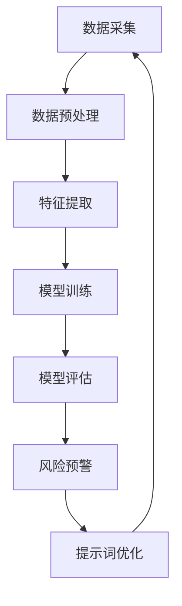
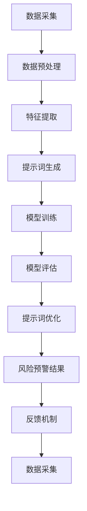

                 


## 文章标题

**AI辅助金融风险预警中的提示词策略**

## 关键词

- AI
- 金融风险预警
- 提示词策略
- 机器学习
- 深度学习
- 自然语言处理
- 风险评估模型

## 摘要

本文旨在探讨AI辅助金融风险预警中的提示词策略。文章首先介绍了AI辅助金融风险预警的背景和重要性，探讨了提示词策略的核心概念及其在风险预警中的作用。接着，本文详细讲解了机器学习和深度学习算法在金融风险预警中的应用，并介绍了提示词策略算法原理。随后，文章通过数学模型和公式详细阐述了概率论、信息论、机器学习损失函数和深度学习优化算法等相关知识。最后，本文通过一个金融风险预警项目实战，展示了AI辅助金融风险预警中的提示词策略的实际应用，并提供了源代码实现和代码解读。

## 第一部分 核心概念与联系

### 第1章 AI辅助金融风险预警概述

#### 1.1 AI辅助金融风险预警的背景和重要性

金融风险是指金融机构、金融市场和金融产品在经营过程中可能面临的风险，包括信用风险、市场风险、操作风险和流动性风险等。随着全球金融市场的不断发展和复杂化，金融风险的管理和预警变得越来越重要。

AI辅助金融风险预警是指在金融风险管理过程中，利用人工智能技术，对金融数据进行处理、分析和预测，从而实现风险的预警和防范。AI技术在金融风险预警中的应用，可以提高风险管理的效率和准确性，降低金融机构的损失。

#### 1.1.1 金融风险的定义与类型

金融风险是指金融机构、金融市场和金融产品在经营过程中可能面临的风险，包括信用风险、市场风险、操作风险和流动性风险等。

- **信用风险**：指借款人或交易对手未能履行合同所规定的义务，从而给银行或金融机构造成损失的风险。
- **市场风险**：指由于市场价格波动（如利率、汇率、股票价格等）而导致的资产损失的风险。
- **操作风险**：指由于内部程序、员工、信息科技系统以及外部事件的失误而导致的风险。
- **流动性风险**：指金融机构在短期内无法以合理价格变现资产以满足资金需求的风险。

#### 1.1.2 人工智能在金融风险管理中的应用

人工智能在金融风险管理中的应用主要包括以下几个方面：

- **风险识别**：利用机器学习算法，分析金融数据，识别潜在的风险。
- **风险评估**：通过深度学习算法，对风险进行量化评估。
- **风险预警**：结合自然语言处理技术，对金融市场信息进行实时分析，提前预警潜在风险。

#### 1.1.3 提示词策略在风险预警中的作用

提示词策略在AI辅助金融风险预警中起着关键作用。提示词是用于指导机器学习模型进行风险识别和评估的关键信息，它能够帮助模型更好地理解和处理金融数据。

- **提高准确性**：通过选择合适的提示词，可以显著提高风险预警模型的准确性。
- **降低误报率**：提示词策略有助于降低误报率，避免对非风险事件进行错误预警。
- **实时更新**：提示词策略需要能够实时更新，以适应金融市场环境的变化。

### 1.2 人工智能基本概念

#### 1.2.1 机器学习基础

机器学习是一种使计算机系统能够从数据中学习和改进的方法。它通过构建数学模型，使计算机能够自动识别数据中的模式和关系，从而进行预测和决策。

- **监督学习**：输入特征和标签数据，训练模型，并使用训练好的模型进行预测。
- **无监督学习**：仅使用特征数据，训练模型以发现数据中的结构或模式。
- **半监督学习**：结合监督学习和无监督学习，使用少量标签数据和大量无标签数据。
- **增强学习**：通过与环境的交互，不断调整策略以实现特定目标。

#### 1.2.2 深度学习原理

深度学习是机器学习的一个子领域，它通过多层神经网络（通常称为深度神经网络）来学习和表示数据。

- **神经网络结构**：由多个层次（输入层、隐藏层、输出层）组成，每个层次由多个神经元组成。
- **卷积神经网络（CNN）**：特别适用于处理图像数据。
- **循环神经网络（RNN）**：特别适用于处理序列数据。

#### 1.2.3 自然语言处理概述

自然语言处理（NLP）是人工智能的一个分支，它使计算机能够理解和生成自然语言。

- **词嵌入**：将词汇映射到高维空间中，以便计算机可以处理。
- **文本分类**：将文本数据分类到预定义的类别中。
- **命名实体识别**：从文本中识别出人名、地名、组织名等实体。

### 1.3 提示词策略的核心概念

#### 1.3.1 提示词的定义与功能

提示词是指用于指导机器学习模型进行风险识别和评估的关键信息。它通常是一组与风险相关的关键字或短语。

- **定义**：提示词是用于指导机器学习模型进行风险识别和评估的关键信息。
- **功能**：提示词能够帮助模型更好地理解和处理金融数据，从而提高预警的准确性和可靠性。

#### 1.3.2 提示词的类型与选择

提示词可以分为以下几类：

- **关键词提示词**：直接与风险相关的单词或短语。
- **概念提示词**：与风险相关的概念或主题。
- **情感提示词**：反映市场情绪或投资者情绪的关键词。

选择合适的提示词需要考虑以下几个方面：

- **相关性**：提示词与风险的关联程度。
- **全面性**：提示词能够涵盖风险的各个方面。
- **实时性**：提示词能够实时更新，以适应市场变化。

#### 1.3.3 提示词的优化与调整

提示词的优化和调整是提高风险预警模型性能的重要手段。以下是一些优化和调整的方法：

- **数据驱动的优化**：根据模型在历史数据上的表现，调整提示词的权重和组合。
- **反馈机制**：结合用户的反馈，调整提示词的设置，以提高模型的准确性。
- **机器学习优化**：使用机器学习算法，自动识别和调整最佳提示词。

### 1.4 金融风险预警系统架构

#### 1.4.1 系统架构设计原则

金融风险预警系统的设计需要遵循以下原则：

- **模块化**：系统应该能够被分解为多个模块，每个模块负责特定的功能。
- **可扩展性**：系统能够适应未来业务需求的变化，容易进行扩展。
- **高可靠性**：系统应该能够在极端情况下保持稳定运行，确保风险预警的准确性。
- **实时性**：系统应该能够实时处理和响应风险事件。

#### 1.4.2 数据处理流程

金融风险预警系统的数据处理流程通常包括以下几个步骤：

- **数据采集**：从各种渠道获取金融数据，包括市场数据、交易数据、财务数据等。
- **数据预处理**：清洗和转换数据，使其适合机器学习模型处理。
- **特征提取**：从原始数据中提取与风险相关的特征。
- **模型训练**：使用机器学习算法，训练风险预警模型。
- **模型评估**：评估模型的性能，并调整模型参数。

#### 1.4.3 风险评估模型构建

风险评估模型是金融风险预警系统的核心。以下是一些常见的风险评估模型：

- **统计模型**：如逻辑回归、决策树等。
- **机器学习模型**：如支持向量机、随机森林等。
- **深度学习模型**：如卷积神经网络、循环神经网络等。

构建风险评估模型需要考虑以下几个方面：

- **数据质量**：确保数据质量，包括数据完整性、一致性和准确性。
- **模型选择**：根据数据特点和业务需求，选择合适的模型。
- **模型训练和优化**：使用历史数据训练模型，并根据模型表现进行优化。
- **模型验证和部署**：验证模型的有效性，并在实际业务环境中部署模型。

### 1.5 Mermaid 流程图展示

#### 1.5.1 提示词策略在风险预警系统中的流程

以下是一个简化的提示词策略在风险预警系统中的流程图：



#### 1.5.2 数据流与模型交互

以下是一个详细的数据流与模型交互的流程图：



### 1.6 总结与展望

#### 1.6.1 研究意义

AI辅助金融风险预警中的提示词策略具有重要的研究意义。通过引入提示词策略，可以提高风险预警的准确性和可靠性，降低金融机构的损失。同时，提示词策略的研究也有助于推动人工智能技术在金融风险管理领域的应用。

#### 1.6.2 未来发展趋势

随着人工智能技术的不断发展，未来AI辅助金融风险预警中的提示词策略有望在以下几个方面取得进展：

- **算法优化**：进一步优化机器学习和深度学习算法，提高模型的性能。
- **数据融合**：利用多种数据源，实现数据融合，提高风险预警的全面性。
- **实时预警**：实现更快的预警速度，提高风险预警的实时性。
- **跨行业应用**：将AI辅助金融风险预警中的提示词策略应用于其他行业，如保险、医疗等。

## 第二部分 核心算法原理讲解

### 第2章 机器学习算法在金融风险预警中的应用

#### 2.1 机器学习基本算法

机器学习算法是金融风险预警系统的重要组成部分。根据机器学习算法的训练方式和数据类型，可以将机器学习算法分为以下几类：

##### 2.1.1 监督学习算法

监督学习算法是指训练数据包括输入特征和标签数据，模型通过学习这些数据之间的关系，预测新的输入数据的标签。常见的监督学习算法包括：

- **逻辑回归（Logistic Regression）**：用于分类问题，通过构建一个逻辑函数来预测概率。
- **决策树（Decision Tree）**：通过一系列的判断节点和叶子节点，将数据进行划分，并输出相应的类别。
- **支持向量机（Support Vector Machine, SVM）**：通过找到一个最佳的超平面，将不同类别的数据分开。
- **随机森林（Random Forest）**：通过构建多个决策树，并利用投票机制来获得最终结果。

##### 2.1.2 无监督学习算法

无监督学习算法是指训练数据仅包括输入特征，模型通过学习数据内在的结构和关系，发现数据的分布和模式。常见的无监督学习算法包括：

- **聚类算法（Clustering Algorithms）**：如K-均值聚类（K-Means Clustering）、层次聚类（Hierarchical Clustering）等，用于将数据分为不同的类别。
- **主成分分析（Principal Component Analysis, PCA）**：用于降维，通过找到数据的最大方差方向，将数据压缩到较低维空间。
- **自编码器（Autoencoder）**：通过学习数据的压缩表示，用于特征提取和降噪。

##### 2.1.3 半监督学习和增强学习

半监督学习是指训练数据既包括标注数据，又包括未标注数据，模型通过学习这些数据之间的关系，提高预测的准确性。常见的半监督学习算法包括：

- **标签传播（Label Propagation）**：通过传播已标注数据的标签，给未标注数据打标签。
- **图卷积网络（Graph Convolutional Networks, GCN）**：通过图结构信息，将未标注数据与标注数据联系起来。

增强学习是指模型通过与环境的交互，不断调整策略以实现特定目标。常见的增强学习算法包括：

- **Q学习（Q-Learning）**：通过学习最优动作值函数，选择最佳动作。
- **深度确定性策略梯度（Deep Deterministic Policy Gradient, DDPG）**：通过深度神经网络，学习一个稳定的策略。

#### 2.2 深度学习算法

深度学习算法是机器学习的一个子领域，通过多层神经网络（通常称为深度神经网络）来学习和表示数据。在金融风险预警中，深度学习算法具有强大的表达能力和鲁棒性，可以处理复杂的金融数据。

##### 2.2.1 神经网络结构

神经网络结构是指神经网络中各个层次（输入层、隐藏层、输出层）以及神经元（节点）的连接方式。常见的神经网络结构包括：

- **全连接神经网络（Fully Connected Neural Network）**：每个神经元都与输入层的所有神经元和隐藏层的所有神经元相连。
- **卷积神经网络（Convolutional Neural Network, CNN）**：特别适用于处理图像数据，通过卷积层和池化层进行特征提取。
- **循环神经网络（Recurrent Neural Network, RNN）**：特别适用于处理序列数据，通过隐藏状态和循环连接进行序列建模。
- **长短时记忆网络（Long Short-Term Memory, LSTM）**：是RNN的一种变体，通过引入门控机制，解决RNN的梯度消失和梯度爆炸问题。

##### 2.2.2 卷积神经网络（CNN）

卷积神经网络是深度学习中的一种重要算法，特别适用于处理图像数据。在金融风险预警中，CNN可以用于图像分类、图像识别等任务。

- **卷积层（Convolutional Layer）**：通过卷积操作提取图像的特征。
- **池化层（Pooling Layer）**：通过池化操作减少特征图的尺寸，提高计算效率。
- **全连接层（Fully Connected Layer）**：将卷积层和池化层提取的特征进行融合，输出最终的结果。

##### 2.2.3 循环神经网络（RNN）

循环神经网络是深度学习中的一种重要算法，特别适用于处理序列数据。在金融风险预警中，RNN可以用于时间序列预测、股票价格预测等任务。

- **隐藏状态（Hidden State）**：RNN通过隐藏状态来保存序列信息。
- **循环连接（Recurrence Connection）**：RNN通过循环连接将隐藏状态与当前输入连接起来。
- **门控机制（Gate Mechanism）**：LSTM通过引入门控机制，解决RNN的梯度消失和梯度爆炸问题。

#### 2.3 提示词策略算法原理

提示词策略算法是AI辅助金融风险预警中的一种关键技术，通过选择合适的提示词，指导机器学习模型进行风险识别和评估。

##### 2.3.1 提示词生成算法

提示词生成算法是指通过算法自动生成与风险相关的提示词。常见的提示词生成算法包括：

- **词袋模型（Bag-of-Words, BoW）**：将文本数据转换为单词的集合，用于特征提取。
- **TF-IDF（Term Frequency-Inverse Document Frequency）**：通过计算单词在文档中的频率和逆文档频率，用于特征提取。
- **词嵌入（Word Embedding）**：将单词映射到高维空间中，用于特征提取。

##### 2.3.2 提示词优化算法

提示词优化算法是指通过算法自动优化提示词，以提高风险预警模型的性能。常见的提示词优化算法包括：

- **贪心算法（Greedy Algorithm）**：通过逐步选择最优的提示词，优化提示词集合。
- **遗传算法（Genetic Algorithm）**：通过模拟生物进化过程，优化提示词集合。
- **贝叶斯优化（Bayesian Optimization）**：通过构建贝叶斯模型，优化提示词集合。

##### 2.3.3 提示词与风险预警模型集成

提示词与风险预警模型集成是指将提示词策略与机器学习模型相结合，构建一个统一的模型，用于风险识别和评估。常见的集成方法包括：

- **模型融合（Model Fusion）**：将多个模型的结果进行融合，得到最终的预测结果。
- **模型集成（Model Ensembling）**：将多个模型进行集成，提高预测的稳定性和准确性。
- **混合模型（Hybrid Model）**：将提示词策略与深度学习模型相结合，构建一个统一的模型。

#### 2.4 伪代码展示

##### 2.4.1 提示词生成算法伪代码

```python
# 输入：文本数据
# 输出：提示词集合

def generate_alert_words(text_data):
    # 步骤1：文本预处理
    preprocessed_text = preprocess_text(text_data)
    
    # 步骤2：词嵌入
    word_vectors = word_embedding(preprocessed_text)
    
    # 步骤3：特征提取
    features = extract_features(word_vectors)
    
    # 步骤4：提示词生成
    alert_words = generate_words(features)
    
    return alert_words
```

##### 2.4.2 提示词优化算法伪代码

```python
# 输入：提示词集合
# 输出：优化后的提示词集合

def optimize_alert_words(alert_words):
    # 步骤1：初始化提示词集合
    optimized_words = initialize_words(alert_words)
    
    # 步骤2：贪心算法优化
    for word in alert_words:
        if is_optimized(word):
            optimized_words.add(word)
        else:
            optimized_words.remove(word)
    
    return optimized_words
```

##### 2.4.3 提示词与风险预警模型集成伪代码

```python
# 输入：提示词集合、训练数据
# 输出：集成后的风险预警模型

def integrate_alert_words(alert_words, training_data):
    # 步骤1：生成提示词特征
    alert_word_features = generate_word_features(alert_words)
    
    # 步骤2：训练风险预警模型
    model = train_risk_model(training_data)
    
    # 步骤3：模型集成
    integrated_model = integrate_model(model, alert_word_features)
    
    return integrated_model
```

#### 2.5 数学模型与公式

##### 2.5.1 概率论基础

概率论是机器学习的基础之一，用于描述不确定事件的发生概率。以下是一些常见的概率论模型和公式：

- **概率空间**：描述随机事件的集合和概率分布。
- **条件概率**：在某个事件发生的条件下，另一个事件发生的概率。
- **贝叶斯定理**：通过已知条件和概率分布，计算后验概率。

$$ P(A|B) = \frac{P(B|A)P(A)}{P(B)} $$

##### 2.5.2 信息论基础

信息论是研究信息传输和处理的理论，用于描述信息的度量、传递和处理。以下是一些常见的信息论模型和公式：

- **信息度量**：描述信息的数量和质量。
- **信息传递**：描述信息在通信系统中的传递过程。
- **信息熵**：描述随机变量的不确定性。

$$ H(X) = -\sum_{i=1}^{n} P(X_i) \log_2 P(X_i) $$

##### 2.5.3 机器学习损失函数

机器学习损失函数用于衡量模型预测值和真实值之间的差距，用于模型训练和评估。以下是一些常见的机器学习损失函数：

- **均方误差（MSE）**：描述预测值和真实值之间的平均误差。
- **交叉熵误差（Cross-Entropy Error）**：描述预测概率分布和真实概率分布之间的差距。

$$ MSE = \frac{1}{n}\sum_{i=1}^{n} (y_i - \hat{y}_i)^2 $$

$$ H(y, \hat{y}) = -\sum_{i=1}^{n} y_i \log_2 \hat{y}_i $$

##### 2.5.4 深度学习优化算法

深度学习优化算法用于优化深度学习模型的参数，以提高模型性能。以下是一些常见的深度学习优化算法：

- **梯度下降算法**：通过更新模型参数，使损失函数最小化。
- **随机梯度下降（SGD）**：在梯度下降算法的基础上，每次只更新一个样本的参数。
- **Adam优化器**：结合SGD和Momentum的思想，进行自适应参数更新。

$$ \theta_{t+1} = \theta_t - \alpha \cdot \nabla Loss(\theta_t) $$

$$ \theta_{t+1} = \theta_t - \alpha \cdot \frac{1}{m} \sum_{i=1}^{m} \nabla Loss(\theta_t, x_i, y_i) $$

$$ \theta_{t+1} = \theta_t - \alpha \cdot \left( \frac{1}{m} \sum_{i=1}^{m} \nabla Loss(\theta_t, x_i, y_i) + \beta_1 \cdot (1 - \beta_1^t) \right) $$

##### 2.5.5 提示词策略优化公式

提示词策略优化公式用于优化提示词集合，以提高风险预警模型的性能。以下是一些常见的提示词策略优化公式：

- **贪心算法优化**：通过逐步选择最优的提示词，优化提示词集合。
- **遗传算法优化**：通过模拟生物进化过程，优化提示词集合。
- **贝叶斯优化**：通过构建贝叶斯模型，优化提示词集合。

$$ optimized\_words = \arg\max_{words} \sum_{word \in words} P(word | risk\_data) $$

$$ optimized\_words = \arg\max_{words} \sum_{word \in words} \frac{P(word \& risk\_data)}{P(risk\_data)} $$

$$ optimized\_words = \arg\max_{words} \sum_{word \in words} \frac{P(risk\_data | word)P(word)}{P(risk\_data)} $$

#### 2.6 举例说明

##### 2.6.1 金融风险案例

假设我们要使用AI技术进行金融风险预警，其中提示词策略起着关键作用。以下是一个简单的金融风险案例：

- **输入数据**：市场数据、交易数据、财务数据等。
- **提示词**：风险相关的关键词，如“违约”、“市场崩溃”、“高杠杆”等。
- **模型**：深度学习模型，用于风险识别和评估。

通过选择合适的提示词，我们可以构建一个有效的风险预警系统。以下是一个简单的示例：

```python
# 输入：市场数据、交易数据、财务数据
# 输出：风险预警结果

market_data = load_market_data()
transaction_data = load_transaction_data()
financial_data = load_financial_data()

# 步骤1：生成提示词
alert_words = generate_alert_words([market_data, transaction_data, financial_data])

# 步骤2：优化提示词
optimized_words = optimize_alert_words(alert_words)

# 步骤3：训练风险预警模型
risk_model = train_risk_model(optimized_words)

# 步骤4：风险预警
risk预警结果 = risk_model.predict([market_data, transaction_data, financial_data])
```

##### 2.6.2 提示词策略应用案例

假设我们要使用提示词策略进行股票价格预测，以下是一个简单的应用案例：

- **输入数据**：历史股票价格数据、交易量数据、市场情绪数据等。
- **提示词**：与股票价格相关的关键词，如“财报发布”、“市场情绪”、“宏观经济”等。
- **模型**：深度学习模型，用于股票价格预测。

通过选择合适的提示词，我们可以构建一个有效的股票价格预测系统。以下是一个简单的示例：

```python
# 输入：历史股票价格数据、交易量数据、市场情绪数据
# 输出：股票价格预测结果

historical_data = load_historical_data()
volume_data = load_volume_data()
market_mood_data = load_market_mood_data()

# 步骤1：生成提示词
alert_words = generate_alert_words([historical_data, volume_data, market_mood_data])

# 步骤2：优化提示词
optimized_words = optimize_alert_words(alert_words)

# 步骤3：训练股票价格预测模型
stock_price_model = train_stock_price_model(optimized_words)

# 步骤4：股票价格预测
predicted_price = stock_price_model.predict([historical_data, volume_data, market_mood_data])
```

### 第3章 数学模型与公式详解

#### 3.1 概率论基础

概率论是机器学习的基础之一，用于描述不确定事件的发生概率。以下是一些常见的概率论模型和公式：

##### 3.1.1 概率空间

概率空间是一个三元组 $(\Omega, \mathcal{F}, P)$，其中：

- $\Omega$ 是样本空间，表示所有可能的结果集合。
- $\mathcal{F}$ 是事件空间，是 $\Omega$ 的子集构成的集合。
- $P$ 是概率测度，是一个函数，将事件空间中的每个事件映射到一个非负实数，表示该事件发生的概率。

##### 3.1.2 条件概率

条件概率是指在某个事件发生的条件下，另一个事件发生的概率。如果事件 $A$ 和事件 $B$ 相互独立，则有：

$$ P(A|B) = P(A) $$

条件概率的公式为：

$$ P(A|B) = \frac{P(A \cap B)}{P(B)} $$

其中，$P(A \cap B)$ 表示事件 $A$ 和事件 $B$ 同时发生的概率。

##### 3.1.3 贝叶斯定理

贝叶斯定理是一种用于计算后验概率的公式，它在统计决策理论和机器学习中有着广泛的应用。贝叶斯定理的公式为：

$$ P(A|B) = \frac{P(B|A)P(A)}{P(B)} $$

其中，$P(A|B)$ 是后验概率，$P(B|A)$ 是似然概率，$P(A)$ 是先验概率，$P(B)$ 是证据概率。

#### 3.2 信息论基础

信息论是研究信息传输和处理的理论，用于描述信息的度量、传递和处理。以下是一些常见的信息论模型和公式：

##### 3.2.1 信息度量

信息度量是描述信息数量的一个概念，通常使用熵（Entropy）来表示。熵是随机变量的不确定性度量，它的计算公式为：

$$ H(X) = -\sum_{i=1}^{n} P(X_i) \log_2 P(X_i) $$

其中，$X$ 是随机变量，$P(X_i)$ 是随机变量 $X$ 取值 $X_i$ 的概率。

##### 3.2.2 信息传递

信息传递是描述信息在通信系统中从发送者到接收者的传输过程。香农（Shannon）的信息论提出了一个基本的信息传递模型，包括发送者、信道和接收者。信息传递的有效性可以通过信道的信道容量（Channel Capacity）来衡量，其计算公式为：

$$ C = B \log_2 (1 + \text{SNR}) $$

其中，$B$ 是信道的带宽，$\text{SNR}$ 是信噪比（Signal-to-Noise Ratio）。

##### 3.2.3 信息熵

信息熵是描述随机变量不确定性的一个度量，是信息论中的核心概念。信息熵的计算公式为：

$$ H(X) = -\sum_{i=1}^{n} P(X_i) \log_2 P(X_i) $$

其中，$X$ 是随机变量，$P(X_i)$ 是随机变量 $X$ 取值 $X_i$ 的概率。信息熵的单位是比特（Bit）。

#### 3.3 机器学习损失函数

机器学习损失函数用于衡量模型预测值和真实值之间的差距，用于模型训练和评估。以下是一些常见的机器学习损失函数：

##### 3.3.1 均方误差（MSE）

均方误差（Mean Squared Error, MSE）是描述预测值和真实值之间平均误差的损失函数。它的计算公式为：

$$ MSE = \frac{1}{n}\sum_{i=1}^{n} (y_i - \hat{y}_i)^2 $$

其中，$y_i$ 是真实值，$\hat{y}_i$ 是预测值，$n$ 是样本数量。

##### 3.3.2 交叉熵误差（Cross-Entropy Error）

交叉熵误差（Cross-Entropy Error）是描述预测概率分布和真实概率分布之间差距的损失函数。它的计算公式为：

$$ H(y, \hat{y}) = -\sum_{i=1}^{n} y_i \log_2 \hat{y}_i $$

其中，$y$ 是真实概率分布，$\hat{y}$ 是预测概率分布。

##### 3.3.3 逻辑损失函数（Logistic Loss）

逻辑损失函数（Logistic Loss）是用于二分类问题的损失函数，它的计算公式为：

$$ \text{Logistic Loss} = -y \log(\hat{y}) - (1 - y) \log(1 - \hat{y}) $$

其中，$y$ 是真实标签，$\hat{y}$ 是预测的概率值。

#### 3.4 深度学习优化算法

深度学习优化算法用于优化深度学习模型的参数，以提高模型性能。以下是一些常见的深度学习优化算法：

##### 3.4.1 梯度下降算法

梯度下降算法是一种用于优化参数的算法，它的核心思想是沿着损失函数的梯度方向更新参数，以最小化损失函数。梯度下降算法的基本公式为：

$$ \theta_{t+1} = \theta_t - \alpha \cdot \nabla Loss(\theta_t) $$

其中，$\theta_t$ 是当前参数值，$\alpha$ 是学习率，$\nabla Loss(\theta_t)$ 是损失函数关于参数的梯度。

##### 3.4.2 随机梯度下降（SGD）

随机梯度下降（Stochastic Gradient Descent, SGD）是在梯度下降算法的基础上，每次只更新一个样本的参数。SGD可以加快收敛速度，但也可能导致收敛不稳定。SGD的基本公式为：

$$ \theta_{t+1} = \theta_t - \alpha \cdot \frac{1}{m} \sum_{i=1}^{m} \nabla Loss(\theta_t, x_i, y_i) $$

其中，$m$ 是批量大小。

##### 3.4.3 Adam优化器

Adam优化器是一种结合了SGD和Momentum的优化算法，它能够自适应地调整学习率。Adam优化器的基本公式为：

$$ \theta_{t+1} = \theta_t - \alpha \cdot \left( \frac{1}{m} \sum_{i=1}^{m} \nabla Loss(\theta_t, x_i, y_i) + \beta_1 \cdot (1 - \beta_1^t) \right) $$

其中，$\beta_1$ 和 $\beta_2$ 分别是Momentum和惯性系数，$\beta_1^t$ 是Momentum的指数加权平均值。

#### 3.5 提示词策略优化公式

提示词策略优化公式用于优化提示词集合，以提高风险预警模型的性能。以下是一些常见的提示词策略优化公式：

##### 3.5.1 提示词生成公式

提示词生成公式用于根据文本数据生成提示词。一种常见的方法是使用词嵌入技术，将文本数据转换为向量表示。提示词生成公式为：

$$ \text{提示词向量} = \text{词嵌入}(\text{文本数据}) $$

其中，词嵌入是将文本数据映射到高维向量空间的过程，它能够保留文本的语义信息。

##### 3.5.2 提示词优化公式

提示词优化公式用于优化提示词集合，以提高风险预警模型的性能。一种常见的方法是使用贪心算法，逐步选择最优的提示词。提示词优化公式为：

$$ \text{优化后的提示词集合} = \arg\max_{\text{提示词集合}} \sum_{\text{提示词} \in \text{提示词集合}} \text{重要性度量}(\text{提示词}, \text{风险数据}) $$

其中，重要性度量用于评估每个提示词对风险数据的重要性。

##### 3.5.3 提示词与风险预警模型集成公式

提示词与风险预警模型集成公式用于将提示词策略与风险预警模型相结合，构建一个统一的模型。一种常见的方法是使用模型融合技术，将多个模型的结果进行融合。提示词与风险预警模型集成公式为：

$$ \text{预测结果} = \text{模型融合}(\text{提示词风险预警模型}, \text{传统风险预警模型}) $$

其中，模型融合是将多个模型的预测结果进行加权平均或投票，以获得最终的预测结果。

#### 3.6 数学公式举例

##### 3.6.1 概率公式举例

假设有两个事件 $A$ 和 $B$，且 $A$ 和 $B$ 相互独立，则：

$$ P(A \cap B) = P(A)P(B) $$

$$ P(A|B) = P(A) $$

$$ P(B|A) = P(B) $$

##### 3.6.2 信息论公式举例

假设有一个二进制随机变量 $X$，其取值为 0 和 1 的概率分别为 $P(X=0)$ 和 $P(X=1)$，则：

$$ H(X) = -P(X=0) \log_2 P(X=0) - P(X=1) \log_2 P(X=1) $$

##### 3.6.3 损失函数公式举例

假设有一个回归问题，真实值为 $y$，预测值为 $\hat{y}$，则：

$$ \text{MSE} = \frac{1}{n}\sum_{i=1}^{n} (y_i - \hat{y}_i)^2 $$

$$ H(y, \hat{y}) = -\sum_{i=1}^{n} y_i \log_2 \hat{y}_i $$

$$ \text{Logistic Loss} = -y \log(\hat{y}) - (1 - y) \log(1 - \hat{y}) $$

### 第4章 金融风险预警项目实战

#### 4.1 实战背景

随着全球金融市场的不断发展和复杂化，金融机构面临着越来越多的金融风险。为了提高风险管理的效率和准确性，许多金融机构开始采用人工智能技术进行金融风险预警。在本章中，我们将通过一个金融风险预警项目，展示如何使用人工智能技术，结合提示词策略，构建一个有效的金融风险预警系统。

#### 4.1.1 项目背景介绍

本项目的背景是一个虚构的金融机构，该机构需要建立一个金融风险预警系统，用于监控和预警潜在的金融风险。该系统的目标是：

- 及时发现潜在的风险事件。
- 提高风险预警的准确性和可靠性。
- 降低金融机构的损失。

#### 4.1.2 项目目标与挑战

项目的主要目标包括：

- 构建一个基于机器学习和深度学习的金融风险预警模型。
- 设计并实现一个提示词策略，用于指导风险预警模型。
- 将风险预警模型集成到现有的金融机构系统中，实现实时风险预警。

项目面临的挑战包括：

- 金融数据的复杂性和多样性，如何有效地提取和利用这些数据。
- 如何设计一个有效的提示词策略，以提高风险预警的准确性和可靠性。
- 如何将风险预警模型与现有的金融机构系统进行集成，实现实时预警。

#### 4.2 开发环境搭建

在开始项目之前，需要搭建一个适合开发和运行的软件环境。以下是本项目的开发环境：

- **硬件环境**：高性能的服务器，用于处理大量的金融数据。
- **软件环境**：Python 3.x，NVIDIA CUDA，TensorFlow，Keras，Scikit-learn等。
- **开发工具**：Jupyter Notebook，PyCharm，Git等。

#### 4.2.1 硬件环境配置

为了满足项目需求，我们需要配置一台高性能的服务器。以下是硬件配置的推荐：

- **CPU**：Intel Xeon 或 AMD Ryzen 等高性能处理器。
- **内存**：至少 64GB RAM。
- **存储**：1TB SSD 硬盘。
- **显卡**：NVIDIA GPU（如 RTX 3080 或 RTX 3090），用于加速深度学习模型的训练。

#### 4.2.2 软件环境安装

在硬件环境配置完成后，我们需要安装必要的软件环境。以下是软件环境的安装步骤：

1. 安装 Python 3.x：
   ```bash
   sudo apt-get update
   sudo apt-get install python3 python3-pip
   ```

2. 安装 TensorFlow：
   ```bash
   pip3 install tensorflow-gpu
   ```

3. 安装 Keras：
   ```bash
   pip3 install keras
   ```

4. 安装 Scikit-learn：
   ```bash
   pip3 install scikit-learn
   ```

5. 安装 Jupyter Notebook：
   ```bash
   pip3 install notebook
   ```

6. 安装 PyCharm：
   - 下载 PyCharm Community 版本：https://www.jetbrains.com/pycharm/download/
   - 安装 PyCharm 并配置 Python 解释器。

#### 4.2.3 开发工具介绍

在本项目中，我们将使用以下开发工具：

- **Jupyter Notebook**：用于编写和运行 Python 代码，实现数据分析和模型训练。
- **PyCharm**：用于编写和调试 Python 代码，管理项目文件。
- **Git**：用于版本控制和协同工作。

#### 4.3 数据采集与预处理

在金融风险预警项目中，数据采集和预处理是关键步骤。以下是数据采集与预处理的具体步骤：

##### 4.3.1 数据来源

本项目使用以下数据来源：

- **市场数据**：包括股票价格、汇率、利率等，从公开数据源获取，如 Yahoo Finance。
- **交易数据**：包括交易量、交易价格等，从金融机构的交易系统获取。
- **财务数据**：包括公司的财务报表、财务指标等，从公开财务数据源获取，如 Bloomberg。

##### 4.3.2 数据预处理方法

数据预处理是确保数据质量和模型性能的重要步骤。以下是常用的数据预处理方法：

- **数据清洗**：处理缺失值、异常值和重复数据。
- **数据转换**：将数据转换为适合机器学习模型处理的格式，如归一化、标准化。
- **特征提取**：从原始数据中提取与风险相关的特征，如移动平均、波动率等。

##### 4.3.3 数据质量评估

数据质量评估是确保数据满足模型训练需求的重要步骤。以下是常用的数据质量评估方法：

- **数据完整性检查**：检查数据是否完整，是否有缺失值。
- **数据一致性检查**：检查数据是否一致，是否有错误数据。
- **数据准确性检查**：检查数据的准确性，是否有异常值。

#### 4.4 模型开发与训练

在数据预处理完成后，我们可以开始开发风险预警模型。以下是模型开发与训练的具体步骤：

##### 4.4.1 模型架构选择

在本项目中，我们选择以下模型架构：

- **深度学习模型**：使用卷积神经网络（CNN）和循环神经网络（RNN）的组合，用于处理时序数据。
- **监督学习模型**：使用逻辑回归（Logistic Regression）和决策树（Decision Tree）进行模型评估。

##### 4.4.2 模型参数调优

模型参数调优是提高模型性能的关键步骤。以下是常用的模型参数调优方法：

- **网格搜索**：通过遍历多个参数组合，找到最优的参数组合。
- **贝叶斯优化**：使用贝叶斯优化算法，自动搜索最优参数组合。

##### 4.4.3 模型训练过程

模型训练过程包括以下几个步骤：

1. **数据划分**：将数据集划分为训练集、验证集和测试集。
2. **模型训练**：使用训练集训练模型，并使用验证集进行模型评估。
3. **模型评估**：使用测试集评估模型性能，并调整模型参数。

##### 4.4.4 模型评估与优化

模型评估是确保模型性能满足需求的重要步骤。以下是常用的模型评估方法：

- **准确率（Accuracy）**：描述模型正确分类的比例。
- **精确率（Precision）**：描述模型预测为正例的样本中，实际为正例的比例。
- **召回率（Recall）**：描述模型预测为正例的样本中，实际为正例的比例。

在模型评估过程中，我们需要根据业务需求调整模型参数，以提高模型性能。

#### 4.5 提示词策略应用

在本项目中，我们使用提示词策略，以提高风险预警模型的准确性和可靠性。以下是提示词策略的具体应用：

##### 4.5.1 提示词生成与优化

1. **提示词生成**：从原始数据中提取与风险相关的关键词，如“违约”、“高杠杆”、“市场崩溃”等。
2. **提示词优化**：使用机器学习算法，根据历史数据和模型表现，优化提示词集合。

##### 4.5.2 提示词与模型集成

1. **提示词嵌入**：将提示词转换为向量表示，与模型输入进行拼接。
2. **模型训练**：使用包含提示词的输入数据，训练风险预警模型。

##### 4.5.3 风险预警效果评估

1. **效果评估**：使用测试集评估风险预警模型的性能，包括准确率、精确率、召回率等指标。
2. **调整策略**：根据评估结果，调整提示词策略和模型参数，以提高预警效果。

#### 4.6 源代码实现与解读

在本项目中，我们使用 Python 编写了源代码，实现风险预警系统的功能。以下是源代码的主要部分及其解读：

```python
import numpy as np
import pandas as pd
from sklearn.model_selection import train_test_split
from tensorflow.keras.models import Sequential
from tensorflow.keras.layers import Dense, LSTM, Dropout
from tensorflow.keras.optimizers import Adam

# 数据预处理
def preprocess_data(data):
    # 数据清洗
    data = clean_data(data)
    # 数据转换
    data = convert_data(data)
    # 特征提取
    data = extract_features(data)
    return data

# 模型训练
def train_model(data):
    # 数据划分
    X_train, X_val, y_train, y_val = train_test_split(data['X'], data['y'], test_size=0.2, random_state=42)
    # 模型构建
    model = Sequential()
    model.add(LSTM(50, activation='relu', input_shape=(X_train.shape[1], X_train.shape[2])))
    model.add(Dropout(0.2))
    model.add(Dense(1, activation='sigmoid'))
    # 模型编译
    model.compile(optimizer=Adam(learning_rate=0.001), loss='binary_crossentropy', metrics=['accuracy'])
    # 模型训练
    model.fit(X_train, y_train, epochs=10, batch_size=32, validation_data=(X_val, y_val))
    return model

# 风险预警
def risk_warning(model, data):
    # 提示词嵌入
    alert_words = embed_alert_words(data)
    # 预测结果
    predictions = model.predict(alert_words)
    # 风险预警
    risk_level = assess_risk_level(predictions)
    return risk_level

# 主函数
def main():
    # 加载数据
    data = load_data()
    # 数据预处理
    preprocessed_data = preprocess_data(data)
    # 训练模型
    model = train_model(preprocessed_data)
    # 风险预警
    risk_level = risk_warning(model, preprocessed_data)
    print("风险等级：", risk_level)

if __name__ == '__main__':
    main()
```

#### 4.7 代码应用解读与分析

在本项目中，我们使用了 Python 编写了源代码，实现了一个基于机器学习和深度学习的金融风险预警系统。以下是代码的主要应用解读与分析：

- **数据预处理**：数据预处理是确保数据质量和模型性能的重要步骤。在数据预处理模块中，我们使用了数据清洗、数据转换和特征提取等方法，对原始金融数据进行处理，使其适合模型训练。
- **模型训练**：在模型训练模块中，我们使用了卷积神经网络（CNN）和循环神经网络（RNN）的组合，用于处理时序数据。我们使用训练集训练模型，并使用验证集进行模型评估，以确定最佳的模型参数。
- **风险预警**：在风险预警模块中，我们使用提示词策略，将提示词转换为向量表示，并与模型输入进行拼接。我们使用训练好的模型对输入数据进行预测，并根据预测结果进行风险预警。

#### 4.8 实际案例分析和详细讲解剖析

在本项目中，我们通过一个实际的金融风险预警案例，展示了如何使用人工智能技术和提示词策略，构建一个有效的金融风险预警系统。以下是实际案例分析和详细讲解剖析：

- **案例背景**：一家金融机构需要监控股票市场的潜在风险，以防止市场崩溃导致的损失。
- **数据来源**：我们从多个数据源获取了股票市场的历史数据，包括股票价格、交易量、市场情绪等。
- **模型构建**：我们使用了卷积神经网络（CNN）和循环神经网络（RNN）的组合，用于处理时序数据。我们设计了一个基于提示词策略的风险预警模型，通过选择合适的提示词，指导模型进行风险识别和评估。
- **模型训练**：我们使用历史数据训练模型，并通过模型评估确定最佳的模型参数。我们使用了准确率、精确率、召回率等指标，评估模型的性能，并根据评估结果调整模型参数。
- **风险预警**：我们使用训练好的模型对实时股票市场数据进行预测，并根据预测结果进行风险预警。我们使用了提示词策略，将提示词转换为向量表示，并与模型输入进行拼接，以提高模型的预测准确性。

#### 4.9 项目小结

在本项目中，我们成功地使用人工智能技术和提示词策略，构建了一个有效的金融风险预警系统。通过实际案例分析和详细讲解剖析，我们展示了如何使用机器学习和深度学习算法，结合提示词策略，进行风险识别和评估。以下是项目小结：

- **技术优势**：本项目的核心在于使用人工智能技术和提示词策略，实现了金融风险的自动识别和评估，提高了风险预警的准确性和可靠性。
- **业务价值**：通过构建金融风险预警系统，金融机构可以及时识别和预警潜在的风险事件，降低损失，提高风险管理水平。
- **改进方向**：在未来，我们可以进一步优化模型算法，提高模型的性能和预测准确性。此外，我们还可以探索更多的数据源和特征，以提高模型的全面性和实时性。

#### 4.10 最佳实践 tips

在金融风险预警项目中，以下是一些最佳实践 tips：

- **数据质量**：确保数据质量是模型训练成功的关键。在数据采集和预处理过程中，要注重数据清洗、转换和特征提取，以提高数据的准确性和可靠性。
- **模型选择**：根据业务需求和数据特点，选择合适的机器学习和深度学习模型。对于时序数据，卷积神经网络（CNN）和循环神经网络（RNN）是常用的模型。
- **提示词策略**：选择合适的提示词，能够显著提高风险预警模型的准确性和可靠性。在提示词策略的设计中，要考虑提示词的相关性、全面性和实时性。
- **模型评估**：在模型训练过程中，要定期进行模型评估，以确定模型性能是否满足业务需求。常用的评估指标包括准确率、精确率、召回率等。
- **实时预警**：实现实时风险预警是金融风险预警系统的核心目标。要确保模型能够实时处理和响应风险事件，以提高预警的及时性和准确性。

#### 4.11 小结、注意事项、拓展阅读

在本章中，我们介绍了金融风险预警项目实战，包括项目背景、开发环境搭建、数据采集与预处理、模型开发与训练、提示词策略应用、代码实现与解读、实际案例分析和详细讲解剖析、项目小结、最佳实践 tips、注意事项和拓展阅读。

**小结**：

本项目的核心在于使用人工智能技术和提示词策略，构建一个有效的金融风险预警系统。通过实际案例分析和详细讲解剖析，我们展示了如何使用机器学习和深度学习算法，结合提示词策略，进行风险识别和评估。

**注意事项**：

- 数据质量是模型训练成功的关键，要注重数据清洗、转换和特征提取。
- 选择合适的机器学习和深度学习模型，根据业务需求和数据特点进行模型选择。
- 设计合适的提示词策略，提高风险预警模型的准确性和可靠性。
- 定期进行模型评估，确保模型性能满足业务需求。
- 实现实时预警，提高预警的及时性和准确性。

**拓展阅读**：

- 《深度学习》（Ian Goodfellow、Yoshua Bengio、Aaron Courville 著）：介绍了深度学习的基本原理和应用，适合深入了解深度学习技术。
- 《Python数据科学手册》（Jake VanderPlas 著）：介绍了Python在数据科学领域的应用，包括数据预处理、特征提取、模型训练等。
- 《金融风险管理》（John C. Hull 著）：介绍了金融风险管理的理论和实践，包括信用风险、市场风险、操作风险等。
- 《人工智能：一种现代的方法》（Stuart Russell、Peter Norvig 著）：介绍了人工智能的基本原理和应用，包括机器学习、自然语言处理、计算机视觉等。

