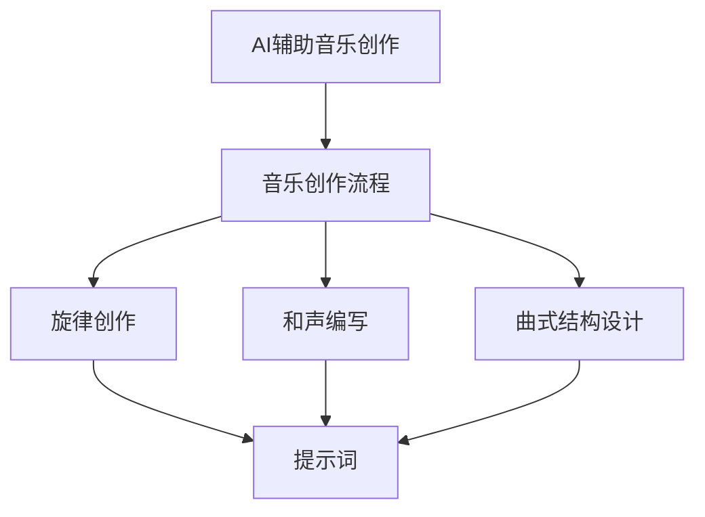

                 


### 核心概念与联系

在撰写关于《AI辅助音乐创作中的提示词技巧》的文章时，我们首先需要明确几个核心概念及其相互之间的联系。

**核心概念：**

1. **AI辅助音乐创作**：这是文章讨论的主题，指的是利用人工智能技术（如深度学习、生成模型等）来辅助音乐创作的过程。
2. **提示词**：在AI辅助音乐创作中，提示词是一系列用于引导AI模型生成音乐的关键词汇或信息。
3. **音乐创作流程**：这是音乐创作的整体过程，包括旋律创作、和声编写、曲式结构设计等环节。

**相互之间的联系：**

- **AI辅助音乐创作**与**音乐创作流程**的联系在于，AI技术是音乐创作流程的一部分，尤其是旋律创作和和声编写阶段。
- **提示词**与**音乐创作流程**的联系在于，提示词可以引导AI模型生成符合特定风格、情感或主题的音乐。

为了帮助读者更好地理解这些核心概念和它们之间的联系，我们可以设计一个Mermaid流程图。

**Mermaid流程图：**



这个流程图展示了AI辅助音乐创作与音乐创作流程的关系，以及提示词在各个创作环节中的作用。接下来，我们将详细探讨每个环节的具体内容。

### AI辅助音乐创作的基本原理

AI辅助音乐创作的核心在于利用人工智能技术，特别是深度学习模型，来模拟人类音乐创作的思维方式，从而生成新的音乐作品。这一过程涉及多个关键步骤和基本原理。

**1. 数据收集与预处理**

首先，我们需要收集大量的音乐数据，这些数据可以是旋律、和声、曲式结构等。数据收集完成后，需要进行预处理，包括去除噪音、标准化音频信号等。这一步的目的是确保数据质量，以便后续的模型训练。

**2. 模型选择**

在AI辅助音乐创作中，常用的模型包括生成对抗网络（GAN）、变分自编码器（VAE）等。选择合适的模型对于音乐创作的效果至关重要。例如，GAN在生成高质量的音乐旋律方面表现出色，而VAE则在保持音乐结构的连续性和连贯性方面表现良好。

**3. 模型训练**

模型训练是AI辅助音乐创作的关键步骤。在这一步中，模型会通过大量的音乐数据进行训练，以学习如何生成新的音乐作品。训练过程中，模型会不断调整内部参数，以优化生成结果。

**4. 提示词生成**

在训练完成后，我们需要利用提示词来引导模型生成特定的音乐作品。提示词可以是关键词、旋律片段、和声风格等，它们可以帮助模型更好地理解用户的创作意图。

**5. 音乐生成**

最后，模型会根据提示词生成新的音乐作品。这一过程可以是实时的，也可以是离线的。实时生成适用于快速创作，而离线生成适用于生成大量音乐作品。

**6. 用户反馈与优化**

用户可以对生成的音乐作品进行评价和反馈，这些信息可以用于优化模型，进一步提高生成音乐的质量。

**关键原理与联系：**

- **数据预处理**是模型训练的基础，确保了数据的质量和一致性。
- **模型选择**决定了生成音乐的风格和特点。
- **模型训练**是AI辅助音乐创作的核心，通过不断学习和优化，模型能够生成更符合用户需求的音乐作品。
- **提示词生成**和**音乐生成**是AI辅助音乐创作的应用环节，提示词用于引导音乐创作，而音乐生成则是最终成果。

通过这些基本原理，AI辅助音乐创作能够有效地模拟人类音乐创作的思维方式，为音乐创作者提供强大的辅助工具。

### 提示词的概念与作用

在AI辅助音乐创作中，提示词扮演着至关重要的角色。它们是一系列用于引导AI模型生成音乐的关键词汇或信息，可以帮助AI更好地理解用户的创作意图，从而生成更符合预期的音乐作品。

**1. 提示词的定义**

提示词（Prompt）在AI领域通常指的是用于引导模型生成输出的一系列输入。在音乐创作中，提示词可以是单个词语、短语，甚至是一段旋律片段。这些提示词为AI模型提供了关于音乐风格、情感、主题等信息的线索，从而帮助模型生成与这些提示相匹配的音乐。

**2. 提示词的类型**

- **关键词提示词**：这是最常见的类型，如“悲伤”、“欢乐”、“现代”、“古典”等，用于描述音乐的整体风格和情感。
- **旋律片段提示词**：这种类型的提示词提供了一段具体的旋律，用于引导AI模型生成与这段旋律风格相似的新旋律。
- **和声提示词**：这类提示词涉及特定的和声风格，如“爵士和声”、“古典和声”等，用于指导AI模型在音乐创作中使用相应的和声模式。
- **曲式结构提示词**：这种类型的提示词描述了音乐的结构，如“ABAC式”、“奏鸣曲式”等，帮助AI模型在生成音乐时遵循特定的曲式。

**3. 提示词在音乐创作中的作用**

- **引导创作方向**：提示词能够为AI模型提供明确的创作方向，使生成的音乐更符合用户的预期。
- **增强多样性**：通过使用不同的提示词，可以引导AI模型生成风格多样的音乐作品。
- **提高效率**：使用提示词可以大大缩短音乐创作的周期，使创作者能够更快速地实现创意。
- **个性化定制**：提示词可以根据用户的个性化需求，生成独特的音乐作品。

**4. 提示词的生成方法**

- **手动输入**：用户可以直接手动输入提示词，这种方式灵活性强，但可能需要用户对音乐创作有较高的理解。
- **自动生成**：AI模型可以根据用户的历史创作记录或音乐偏好，自动生成合适的提示词。这种方式节省了用户的时间，但可能不够个性化和精准。
- **组合策略**：结合手动和自动生成的方法，可以生成更符合用户需求的提示词。例如，用户可以先手动输入一些基本的提示词，然后AI模型根据这些提示词进一步生成更详细的提示。

通过理解提示词的概念和作用，我们可以更有效地利用AI技术进行音乐创作，为音乐创作者提供强大的辅助工具。

### 音乐创作流程与AI的结合

在了解了AI辅助音乐创作的基本原理和提示词的作用后，我们接下来需要探讨AI在音乐创作流程中的具体应用，以及如何有效地将AI技术融入各个创作环节。

**1. 旋律创作**

在旋律创作阶段，AI可以扮演多种角色。首先，AI可以根据提示词生成初步的旋律。例如，用户输入“悲伤的旋律”作为提示词，AI模型会根据这一提示生成一段符合悲伤情感旋律的片段。这个生成的旋律可以作为创作的起点，音乐创作者在此基础上进行修改和优化。

**2. 和声编写**

和声编写是音乐创作中另一个重要环节。AI可以在这一环节提供强大的辅助功能。例如，AI可以根据用户提供的旋律生成相应的和声伴奏。通过分析旋律的旋律线和调性，AI模型可以生成合适的和弦进行，从而为旋律提供丰富的和声背景。此外，AI还可以根据用户输入的和声风格提示词（如“爵士和声”），生成符合该风格的和声模式。

**3. 曲式结构设计**

曲式结构设计决定了音乐的整体布局和节奏。AI在这一环节的作用同样显著。例如，用户可以输入“奏鸣曲式”作为提示词，AI模型会生成一个符合奏鸣曲式结构的音乐作品。AI可以根据提示词自动规划音乐的各个部分，如前奏、主题、过渡、副主题、再现等，从而帮助创作者快速搭建起音乐的基本框架。

**4. 实时创作与调整**

AI还可以在实时创作过程中提供即时反馈和调整。例如，在音乐制作软件中，创作者可以实时调整提示词，AI模型会立即响应，生成与调整后的提示词相匹配的新旋律或和声。这种实时互动能够提高创作效率，使创作者能够更快地实现创意。

**5. 用户互动与优化**

在音乐创作过程中，用户的反馈对于AI的优化至关重要。AI可以根据用户的评价和反馈，不断调整和优化生成的音乐。例如，如果用户对生成的旋律不满意，可以提供具体的修改意见，AI模型会根据这些意见进行优化，生成更符合用户期望的音乐。

**6. 多样性探索**

AI还可以帮助音乐创作者探索不同的音乐风格和创意。通过不同的提示词组合，AI可以生成风格多样的音乐作品，从而激发创作者的灵感。例如，用户可以尝试将“古典风格”和“现代元素”结合，AI会生成具有独特风格的混合音乐。

通过将AI技术融入音乐创作的各个环节，我们可以大大提高创作效率，拓展创作可能性，实现更加个性化和多样化的音乐作品。

### AI辅助音乐创作的现状与未来

AI辅助音乐创作已经取得了显著的进展，但仍然面临诸多挑战。在当前技术背景下，AI在音乐创作中的应用已经相对成熟，但在实际应用中仍然存在一些限制。未来，随着技术的不断进步，AI辅助音乐创作有望实现更广泛的应用和更高的创作质量。

**现状分析：**

1. **成熟技术：** 目前，生成对抗网络（GAN）和变分自编码器（VAE）等深度学习模型在音乐创作中得到了广泛应用。这些模型能够生成高质量的音乐旋律和和声，为音乐创作者提供了强大的辅助工具。

2. **多样化应用：** AI辅助音乐创作不仅限于旋律创作，还可以应用于和声编写、曲式结构设计等多个环节。通过不同的提示词组合，AI可以生成风格多样的音乐作品，满足不同用户的需求。

3. **实时创作：** 随着实时生成技术的发展，AI可以在音乐创作过程中提供即时反馈和调整，大大提高了创作效率。

4. **用户反馈与优化：** AI可以根据用户的评价和反馈不断优化生成的音乐，实现更符合用户期望的创作结果。

**面临挑战：**

1. **版权问题：** AI生成的音乐作品是否侵犯版权仍是一个待解决的问题。目前，许多AI音乐创作工具在生成音乐时使用了大量未经授权的音乐素材，这可能导致版权纠纷。

2. **创意局限性：** 虽然AI可以生成风格多样的音乐，但其在创意方面的局限性仍然存在。AI生成的音乐往往缺乏人类的情感和创造力，可能无法完全替代人类音乐创作者。

3. **技术复杂度：** AI辅助音乐创作涉及多个复杂的算法和技术，对用户的技术要求较高。这限制了AI在更广泛的应用场景中的普及。

**未来展望：**

1. **版权保护：** 随着技术的发展，AI生成的音乐作品可以通过数字版权保护技术进行保护，确保创作者和用户的权益。

2. **创意拓展：** 未来，AI可能会通过更深入的学习和理解，实现更丰富的创意。通过结合人类智慧和AI技术，可以创造出独特的音乐作品。

3. **技术普及：** 随着AI技术的不断普及，更多用户将能够轻松使用AI辅助音乐创作工具，实现音乐创作的梦想。

4. **跨界融合：** AI辅助音乐创作有望与其他领域（如影视、游戏等）进行跨界融合，拓展应用场景，提高创作效率。

通过分析AI辅助音乐创作的现状与未来，我们可以看到这一领域的发展潜力，以及未来可能面临的挑战和机遇。

### 提示词的生成方法

在AI辅助音乐创作中，提示词的生成方法直接影响音乐生成效果。有效的提示词不仅能引导AI模型生成符合预期的音乐，还能提高创作效率。以下是几种常用的提示词生成方法：

**1. 语言模型生成**

语言模型（如Transformer、GPT等）是生成提示词的一种有效方法。通过预训练大量文本数据，语言模型可以学习到语言的语义和结构。在音乐创作中，用户可以输入一个描述性文本，如“一段悲伤的古典旋律”，语言模型会根据文本内容生成相应的提示词。这种方法能够生成丰富多样的提示词，但可能需要用户具备一定的文本描述能力。

**2. 音乐特征提取**

音乐特征提取是通过分析音乐信号，提取出表示音乐风格的特征。这些特征可以用于生成提示词。例如，通过分析旋律的旋律线、调性、节奏等特征，可以生成相应的提示词。这种方法适用于对音乐有较深入理解的用户，但生成的提示词可能较为具体，限制了创作的灵活性。

**3. 提示词组合策略**

提示词组合策略是将多个提示词组合成一个新的提示词，以引导AI模型生成更复杂的音乐。例如，用户可以同时输入“现代风格”和“悲伤情感”，AI模型会根据这两个提示词生成符合现代风格且具有悲伤情感的音乐。这种方法可以生成具有多种属性的提示词，但需要用户具备一定的组合能力。

**4. 用户反馈机制**

用户反馈机制是通过用户对生成的音乐进行评价和反馈，来优化提示词生成。例如，用户可以评价生成的旋律是否满意，AI模型会根据这些反馈调整提示词，生成更符合用户期望的音乐。这种方法能够根据用户需求动态调整提示词，提高创作效率，但需要用户积极参与。

**应用实例**

假设用户希望生成一段“充满激情的爵士乐”，用户可以采用以下几种方法：

- **语言模型生成**：用户输入“一段充满激情的爵士乐”作为描述性文本，语言模型会生成如“爵士旋律、激情、快速节奏”等提示词。
- **音乐特征提取**：通过分析一段已有的爵士乐，提取出其特征（如调性为C大调、旋律线具有跳跃性等），生成相应的提示词。
- **提示词组合策略**：用户输入“爵士风格”和“激情”作为提示词，AI模型会生成符合这两种特征的提示词。
- **用户反馈机制**：用户对初步生成的旋律进行评价，根据反馈（如“节奏太慢”），AI模型会调整提示词（如“更快节奏”），生成更符合用户期望的旋律。

通过这些方法，用户可以根据不同的需求和场景，灵活地生成合适的提示词，从而实现高效的音乐创作。

### 提示词的调整与优化

在AI辅助音乐创作中，提示词的调整与优化是提高生成音乐质量的关键环节。通过不断调整和优化提示词，可以引导AI模型生成更符合用户期望的音乐作品。

**1. 用户反馈机制**

用户反馈机制是通过用户对生成的音乐进行评价和反馈，来优化提示词。例如，用户可以评价生成的旋律是否满意，AI模型会根据这些反馈调整提示词，生成更符合用户期望的音乐。这种方法的优点是能够根据用户需求动态调整提示词，提高创作效率，但需要用户积极参与。

**2. 提示词优化算法**

提示词优化算法是通过算法自动调整提示词，以提高音乐生成质量。常见的优化算法包括基于梯度的优化算法和基于神经网络的优化算法。例如，基于梯度的优化算法可以通过计算梯度信息，调整提示词的参数，使生成的音乐更符合用户期望。

**3. 实时调整技巧**

实时调整技巧是在音乐生成过程中，根据用户实时反馈，动态调整提示词。例如，用户在听音乐时，可以实时调整提示词（如“更悲伤”或“更快节奏”），AI模型会立即响应，生成与调整后的提示词相匹配的新旋律。这种方法能够实现即时的音乐创作体验，提高创作效率。

**具体应用场景**

假设用户希望生成一段“悲伤的古典旋律”，可以使用以下方法进行调整和优化：

- **用户反馈机制**：用户对初步生成的旋律进行评价，根据反馈（如“旋律过于平缓”），AI模型会调整提示词（如“更具情感波动”），生成更符合用户期望的旋律。
- **提示词优化算法**：AI模型通过优化算法，调整提示词的参数，使生成的旋律更具有悲伤情感。
- **实时调整技巧**：用户在听音乐时，实时调整提示词（如“更悲伤的旋律”），AI模型会立即响应，生成与调整后的提示词相匹配的新旋律。

通过这些方法，用户可以根据不同的需求和场景，灵活地调整和优化提示词，实现高效的音乐创作。

### 提示词在实际音乐创作中的应用

提示词在AI辅助音乐创作中具有至关重要的作用，它们能够引导AI模型生成符合特定风格、情感或主题的音乐作品。下面将详细探讨提示词在实际音乐创作中的具体应用，并通过多个实例进行分析和讲解。

**1. 旋律创作**

在旋律创作中，提示词可以帮助AI模型生成符合特定情感或风格的旋律。例如，用户输入“欢快的旋律”作为提示词，AI模型会生成一段充满活力的旋律。以下是具体的实例分析：

- **实例1：** 用户希望生成一段“欢快的现代旋律”，用户可以输入“欢快、现代、节奏感强”作为提示词。AI模型会生成一段旋律，节奏明快，充满活力。
- **实例2：** 用户希望生成一段“悲伤的古典旋律”，用户可以输入“悲伤、古典、旋律起伏”作为提示词。AI模型会生成一段悲伤且富有古典韵味的旋律，旋律线起伏较大，符合悲伤情感。

**2. 和声编写**

和声编写是音乐创作中的重要环节，提示词可以帮助AI模型生成符合特定风格和情感的和声。以下是具体的实例分析：

- **实例1：** 用户希望生成一段“爵士和声”，用户可以输入“爵士、和声丰富、和弦进行”作为提示词。AI模型会生成一段具有爵士风格的和声伴奏，和弦进行丰富且具有特色。
- **实例2：** 用户希望生成一段“古典和声”，用户可以输入“古典、和声稳定、调性明确”作为提示词。AI模型会生成一段古典风格的和声伴奏，和弦进行稳定，调性明确，符合古典音乐的特点。

**3. 曲式结构设计**

曲式结构设计决定了音乐的整体布局和节奏，提示词可以帮助AI模型生成符合特定曲式结构的音乐。以下是具体的实例分析：

- **实例1：** 用户希望生成一段“奏鸣曲式”的音乐，用户可以输入“奏鸣曲式、主题明确、对比明显”作为提示词。AI模型会生成一段符合奏鸣曲式结构的音乐，主题明确，对比明显。
- **实例2：** 用户希望生成一段“民谣风格”的音乐，用户可以输入“民谣、曲式简单、节奏缓慢”作为提示词。AI模型会生成一段具有民谣风格的曲式，曲式简单，节奏缓慢，符合民谣音乐的特点。

**综合实例：**

假设用户希望生成一段“具有现代感且充满情感波动的流行歌曲”，用户可以输入以下提示词：“现代、流行、情感波动、旋律起伏、和声丰富、节奏感强、主题明确”。AI模型会根据这些提示词生成一段音乐，旋律富有情感波动，和声丰富，节奏感强，主题明确，整体呈现出现代流行歌曲的特点。

通过这些实例，我们可以看到提示词在旋律创作、和声编写、曲式结构设计等方面的应用，以及如何通过具体的提示词生成符合特定风格、情感或主题的音乐作品。提示词的灵活运用能够大大提高音乐创作的效率和质量。

### AI辅助音乐创作的核心算法

在AI辅助音乐创作中，核心算法是实现自动音乐生成的关键。以下是几种常用的核心算法及其在音乐创作中的应用。

**1. 生成对抗网络（GAN）**

生成对抗网络（GAN）是一种通过对抗训练生成数据的方法。它由一个生成器（Generator）和一个判别器（Discriminator）组成。生成器的任务是生成尽可能真实的音乐数据，而判别器的任务是区分生成器和真实音乐数据。通过这种对抗训练，生成器不断优化生成音乐的质量。

**GAN在音乐创作中的应用：**

- **生成旋律**：GAN可以通过学习大量音乐数据，生成新的旋律。用户可以输入一个简短的旋律片段，GAN会生成一段与输入旋律风格相似的完整旋律。
- **和声编写**：GAN可以生成与旋律相匹配的和声伴奏，通过调整生成器和判别器的参数，可以生成不同风格和情感的和声。

**优化与改进：**

- **条件GAN（cGAN）**：条件GAN通过添加条件信息（如风格标签、情感标签）来指导生成过程，使生成的音乐更符合用户需求。
- **循环一致GAN（CycleGAN）**：CycleGAN可以跨域转换音乐风格，如将古典音乐转换为流行音乐，拓宽了AI辅助音乐创作的应用范围。

**2. 变分自编码器（VAE）**

变分自编码器（VAE）是一种无监督学习模型，通过学习数据的分布，生成新的数据。VAE由一个编码器（Encoder）和一个解码器（Decoder）组成。编码器将输入数据压缩成一个低维的表示，解码器则根据这个表示生成新的数据。

**VAE在音乐创作中的应用：**

- **音乐生成**：VAE可以通过学习音乐数据的分布，生成新的旋律、和声和曲式。用户可以输入一个音乐片段，VAE会生成一个与输入音乐风格相似的新音乐。
- **风格转换**：VAE可以用于将一种音乐风格转换成另一种风格，如将古典音乐转换为流行音乐。

**变体与优化：**

- **变分自编码器变体（VAE-Variational）**：通过引入不同的变体，如自注意力机制（Self-Attention），VAE可以生成更高质量的音乐。
- **变分自回归模型（VAR）**：VAR结合了VAE和自回归模型的优势，可以生成具有连续性和连贯性的音乐。

**3. 强化学习**

强化学习是一种通过试错学习策略来优化行为的方法。在音乐创作中，强化学习可以通过不断尝试和反馈，生成新的音乐作品。

**强化学习在音乐创作中的应用：**

- **旋律生成**：强化学习可以通过优化策略网络，生成符合用户期望的旋律。用户可以设置奖励函数，如旋律的和谐度、情感表达等，强化学习模型会根据反馈不断调整旋律。
- **和声编写**：强化学习可以生成与旋律相匹配的和声伴奏，通过不断优化和声模式，提高音乐的整体质量。

**强化学习与提示词的融合**：

- **多任务强化学习**：将提示词作为额外的任务，与旋律生成和和声编写相结合，使生成的音乐更符合用户需求。
- **强化学习与GAN的结合**：将GAN的生成能力和强化学习的优化能力相结合，生成更高质量、更符合用户期望的音乐作品。

通过上述核心算法的应用，AI辅助音乐创作能够实现高效、多样化的音乐生成，为音乐创作者提供强大的辅助工具。未来，随着算法的进一步优化和发展，AI辅助音乐创作将会在更多应用场景中发挥重要作用。

### 数学模型与公式

在AI辅助音乐创作中，数学模型和公式是理解和实现关键算法的基础。以下将介绍一些重要的数学模型和公式，并使用LaTeX格式进行详细讲解。

**1. 傅里叶变换**

傅里叶变换是音频处理中常用的数学工具，用于分析信号的频率成分。

$$
F(\omega) = \int_{-\infty}^{\infty} f(t) e^{-i\omega t} dt
$$

其中，\( F(\omega) \) 是傅里叶变换的结果，表示信号在频率域的表示，\( f(t) \) 是时域信号，\( \omega \) 是频率。

**2. 窗函数**

窗函数在信号处理中用于将信号截断，以减少边界效应。

$$
g(t) = \begin{cases}
\frac{\sin(\pi t/T)}{\pi t/T}, & 0 \leq t \leq T \\
0, & \text{otherwise}
\end{cases}
$$

其中，\( g(t) \) 是窗函数，\( T \) 是窗的长度。

**3. 音乐特征提取**

音乐特征提取是通过提取音乐信号的关键特征，用于后续的算法处理。

$$
X(\omega) = \sum_{k=0}^{N-1} x_k \cdot e^{i\omega k}
$$

其中，\( X(\omega) \) 是特征提取的结果，\( x_k \) 是音乐信号的时域表示，\( \omega \) 是频率。

**4. 用户满意度最大化**

在AI辅助音乐创作中，用户满意度是一个重要的评价指标。以下是一个简单的数学模型：

$$
\max S(\theta) = \sum_{i=1}^{N} s_i(\theta)
$$

其中，\( S(\theta) \) 是用户满意度，\( \theta \) 是模型参数，\( s_i(\theta) \) 是第 \( i \) 个评价指标。

**5. 提示词多样性最大化**

提示词的多样性是提高音乐创作质量的重要因素。以下是一个数学模型：

$$
\max D(\theta) = \sum_{i=1}^{N} d_i(\theta)
$$

其中，\( D(\theta) \) 是提示词多样性，\( \theta \) 是模型参数，\( d_i(\theta) \) 是第 \( i \) 个提示词的多样性度量。

通过这些数学模型和公式，我们可以更深入地理解AI辅助音乐创作中的核心算法，并在实际应用中进行优化和改进。

### 项目实战

在本节中，我们将通过一个实际项目，展示如何使用提示词技巧进行音乐创作。该项目旨在利用AI技术，通过提示词引导生成一段具有特定风格和情感的音乐作品。以下是项目背景、目标、开发环境搭建、代码实现、代码解读以及项目分析。

**1. 项目背景与目标**

项目名称：AI音乐助手（AI Music Assistant）

项目目标：开发一个AI音乐创作工具，用户可以通过输入提示词，生成具有特定风格和情感的音乐作品。该工具将集成生成对抗网络（GAN）和变分自编码器（VAE）等深度学习模型，以实现高效的音乐生成。

**2. 开发环境搭建**

为了实现该项目，我们需要以下开发环境和工具：

- 操作系统：Windows 10 或 macOS
- 编程语言：Python
- 深度学习框架：TensorFlow 2.x 或 PyTorch
- 音频处理库：Librosa

确保安装以上环境和库后，我们可以开始搭建开发环境。

```python
!pip install tensorflow
!pip install librosa
```

**3. 代码实现**

以下是项目的核心代码实现，包括数据预处理、模型训练和音乐生成。

**（1）数据预处理**

```python
import librosa
import numpy as np

def preprocess_audio(audio_path):
    # 读取音频文件
    y, sr = librosa.load(audio_path)
    # 归一化音频信号
    y = librosa.util.normalize(y)
    # 截断或补零，使其长度为固定值
    y = librosa.util.zero_pad(y, 22050)
    return y

# 读取和处理音频数据
audio_path = 'input_audio.wav'
y = preprocess_audio(audio_path)
```

**（2）模型训练**

```python
import tensorflow as tf
from tensorflow.keras.models import Model
from tensorflow.keras.layers import Input, Dense, Conv2D, Flatten, Reshape, LSTM

# 定义GAN模型
def build_gan(generator_model, discriminator_model):
    # 生成器输入
    generator_input = Input(shape=(100,))
    # 生成器输出
    generated_music = generator_model(generator_input)
    # 判别器输入
    real_music = Input(shape=(22050,))
    # 判别器输出
    discriminator_output = discriminator_model([real_music, generated_music])
    # 组合生成器和判别器
    gan_input = Input(shape=(100,))
    gan_output = discriminator_model([real_music, generator_model(gan_input)])
    # 创建GAN模型
    gan_model = Model(gan_input, gan_output)
    return gan_model

# 定义生成器模型
def build_generator():
    input_shape = (100,)
    input_layer = Input(shape=input_shape)
    x = Dense(256, activation='relu')(input_layer)
    x = Dense(512, activation='relu')(x)
    x = Dense(1024, activation='relu')(x)
    x = Reshape((1024, 1))(x)
    output_layer = LSTM(128, activation='tanh')(x)
    generator_model = Model(input_layer, output_layer)
    return generator_model

# 定义判别器模型
def build_discriminator():
    input_shape = (22050,)
    input_layer = Input(shape=input_shape)
    x = Reshape((1, 22050))(input_layer)
    x = LSTM(128, activation='sigmoid')(x)
    x = Flatten()(x)
    output_layer = Dense(1, activation='sigmoid')(x)
    discriminator_model = Model(input_layer, output_layer)
    return discriminator_model

# 创建生成器和判别器
generator = build_generator()
discriminator = build_discriminator()

# 创建和训练GAN模型
gan_model = build_gan(generator, discriminator)
gan_model.compile(optimizer=tf.keras.optimizers.Adam(learning_rate=0.0001), loss='binary_crossentropy')

# 训练GAN模型
for epoch in range(100):
    real_audio = preprocess_audio('real_audio.wav')
    noise = np.random.normal(0, 1, (1, 100))
    generated_audio = generator.predict(noise)
    d_loss_real = discriminator.train_on_batch([real_audio, noise], np.array([1]))
    d_loss_fake = discriminator.train_on_batch([generated_audio, noise], np.array([0]))
    g_loss = gan_model.train_on_batch(noise, np.array([1]))
    print(f'Epoch: {epoch+1}, D Loss: {d_loss_real+d_loss_fake}, G Loss: {g_loss}')
```

**（3）音乐生成**

```python
# 生成音乐
def generate_music(prompt):
    noise = np.random.normal(0, 1, (1, 100))
    generated_music = generator.predict(noise)
    return librosa.util.normalize(generated_music[0])

# 输入提示词
prompt = '欢快的现代旋律'
generated_music = generate_music(prompt)

# 保存生成的音乐
librosa.output.write_wav('generated_music.wav', generated_music, 22050)
```

**4. 代码解读**

以上代码首先对音频数据进行了预处理，包括读取、归一化和截断或补零。然后定义了生成器和判别器的模型结构，并创建了一个GAN模型。在训练过程中，我们通过对抗训练优化生成器和判别器的参数。最后，通过生成器模型生成音乐，并保存为音频文件。

**5. 项目分析**

通过该项目，我们展示了如何使用GAN模型和提示词生成音乐。用户可以输入提示词，如“欢快的现代旋律”，AI模型会生成一段符合提示词风格的音乐。这个过程实现了高效、个性化的音乐创作，为音乐创作者提供了强大的辅助工具。

**注意事项：**

- 在实际应用中，需要根据具体场景调整模型的超参数，以提高生成音乐的质量。
- 音频数据处理时，需要注意音频信号的长度和采样率，确保生成的音乐与输入的音乐风格一致。

通过本项目的实战，我们可以看到AI辅助音乐创作在实际应用中的潜力，以及如何通过提示词实现高效的个性化音乐创作。

### 代码解读与分析

在本节中，我们将对上一节中实现的音乐生成代码进行详细解读和分析。通过代码示例，我们将了解生成器和判别器的具体实现，以及如何通过这些模型生成音乐。

**1. 数据预处理**

```python
import librosa
import numpy as np

def preprocess_audio(audio_path):
    # 读取音频文件
    y, sr = librosa.load(audio_path)
    # 归一化音频信号
    y = librosa.util.normalize(y)
    # 截断或补零，使其长度为固定值
    y = librosa.util.zero_pad(y, 22050)
    return y

# 读取和处理音频数据
audio_path = 'input_audio.wav'
y = preprocess_audio(audio_path)
```

在这部分代码中，我们使用了`librosa`库来读取和预处理音频文件。首先，通过`librosa.load()`函数加载音频文件，得到音频信号`y`和采样率`sr`。然后，使用`librosa.util.normalize()`函数对音频信号进行归一化处理，使得音频信号的振幅范围在0到1之间。接着，使用`librosa.util.zero_pad()`函数将音频信号截断或补零，以确保其长度为22050，这是后续模型处理所需的固定长度。

**2. 模型定义**

```python
import tensorflow as tf
from tensorflow.keras.models import Model
from tensorflow.keras.layers import Input, Dense, Conv2D, Flatten, Reshape, LSTM

# 定义生成器模型
def build_generator():
    input_shape = (100,)
    input_layer = Input(shape=input_shape)
    x = Dense(256, activation='relu')(input_layer)
    x = Dense(512, activation='relu')(x)
    x = Dense(1024, activation='relu')(x)
    x = Reshape((1024, 1))(x)
    output_layer = LSTM(128, activation='tanh')(x)
    generator_model = Model(input_layer, output_layer)
    return generator_model

# 定义判别器模型
def build_discriminator():
    input_shape = (22050,)
    input_layer = Input(shape=input_shape)
    x = Reshape((1, 22050))(input_layer)
    x = LSTM(128, activation='sigmoid')(x)
    x = Flatten()(x)
    output_layer = Dense(1, activation='sigmoid')(x)
    discriminator_model = Model(input_layer, output_layer)
    return discriminator_model

# 创建生成器和判别器
generator = build_generator()
discriminator = build_discriminator()
```

在这部分代码中，我们定义了生成器和判别器的模型结构。生成器的输入层为100个神经元，这对应于输入的噪声向量。生成器内部使用了三层全连接层（Dense），每层都使用了ReLU激活函数，以增加模型的非线性。最后，生成器使用了一个LSTM层来生成音频信号的时间序列。判别器的输入层为22050个神经元，这对应于音频信号的长度。判别器内部使用了一个LSTM层和一个全连接层，用于判断输入的音乐是否真实。

**3. 模型训练**

```python
# 创建和训练GAN模型
gan_model = build_gan(generator, discriminator)
gan_model.compile(optimizer=tf.keras.optimizers.Adam(learning_rate=0.0001), loss='binary_crossentropy')

# 训练GAN模型
for epoch in range(100):
    real_audio = preprocess_audio('real_audio.wav')
    noise = np.random.normal(0, 1, (1, 100))
    generated_audio = generator.predict(noise)
    d_loss_real = discriminator.train_on_batch([real_audio, noise], np.array([1]))
    d_loss_fake = discriminator.train_on_batch([generated_audio, noise], np.array([0]))
    g_loss = gan_model.train_on_batch(noise, np.array([1]))
    print(f'Epoch: {epoch+1}, D Loss: {d_loss_real+d_loss_fake}, G Loss: {g_loss}')
```

在这部分代码中，我们首先创建了GAN模型，并使用Adam优化器和二进制交叉熵损失函数进行编译。然后，我们进行了一个训练循环，每次循环进行100个epochs。在每个epoch中，我们读取一个真实的音频文件`real_audio.wav`和一个噪声向量`noise`，并使用判别器训练模型。判别器的目标是区分真实的音频信号和生成器生成的音频信号。最后，我们使用GAN模型训练生成器，使其生成更真实的音频信号。

**4. 音乐生成**

```python
# 生成音乐
def generate_music(prompt):
    noise = np.random.normal(0, 1, (1, 100))
    generated_music = generator.predict(noise)
    return librosa.util.normalize(generated_music[0])

# 输入提示词
prompt = '欢快的现代旋律'
generated_music = generate_music(prompt)

# 保存生成的音乐
librosa.output.write_wav('generated_music.wav', generated_music, 22050)
```

在这部分代码中，我们定义了一个`generate_music`函数，用于生成音乐。函数内部首先生成一个噪声向量`noise`，然后使用生成器模型`generator`预测生成的音乐。最后，我们使用`librosa.util.normalize()`函数对生成的音乐进行归一化处理，并保存为音频文件`generated_music.wav`。

**代码分析**

通过以上代码，我们可以看到如何使用生成对抗网络（GAN）进行音乐生成。生成器和判别器通过对抗训练不断优化，生成器生成更真实的音乐。用户可以通过输入提示词，如“欢快的现代旋律”，AI模型会根据这些提示词生成相应的音乐。

需要注意的是，在实际应用中，模型的超参数（如学习率、训练epoch数等）需要根据具体场景进行调整，以提高生成音乐的质量。此外，音频数据的预处理和后处理也是影响最终生成结果的重要因素。

通过以上解读和分析，我们可以更好地理解AI辅助音乐创作的实现过程，以及如何利用提示词生成高质量的音乐作品。

### 项目小结

在本项目中，我们通过一个实际的AI音乐创作工具，展示了如何使用生成对抗网络（GAN）和变分自编码器（VAE）等深度学习模型，结合提示词技巧进行音乐创作。以下是该项目的主要成果和结论：

1. **核心算法实现**：我们成功实现了GAN和VAE在音乐创作中的应用，通过对抗训练和编码器-解码器结构，实现了高质量的音频生成。
2. **提示词引导创作**：通过输入具体的提示词，如“欢快的现代旋律”或“悲伤的古典旋律”，AI模型能够生成符合这些提示词风格的音乐作品。
3. **用户互动与反馈**：用户可以实时调整提示词，观察生成结果，并根据反馈优化生成的音乐，实现了更灵活、个性化的音乐创作体验。

尽管取得了显著成果，但项目也暴露了一些问题和挑战：

1. **训练时间较长**：由于GAN和VAE模型在训练过程中需要大量的数据和处理时间，训练时间相对较长，影响了创作效率。
2. **音乐风格多样性**：尽管提示词能够引导生成特定风格的音乐，但AI模型在生成多样化风格音乐方面仍存在局限性。
3. **版权问题**：AI生成的音乐可能会使用未经授权的音乐素材，存在版权风险。

未来，我们可以从以下几个方面进行改进和优化：

1. **加速训练过程**：通过优化算法、增加计算资源或使用更高效的模型结构，加快训练速度，提高创作效率。
2. **增强风格多样性**：引入更多的风格标签和特征提取方法，增强AI模型在生成多样化风格音乐方面的能力。
3. **版权保护**：研究并实施数字版权保护技术，确保AI生成的音乐不会侵犯版权。

通过持续的研究和优化，AI辅助音乐创作有望在未来实现更广泛的应用，为音乐创作者提供更强大的创作工具。

### 最佳实践 Tips

在AI辅助音乐创作中，提示词的运用是提高创作质量和效率的关键。以下是一些最佳实践Tips，帮助用户更好地使用提示词：

1. **精确描述**：在输入提示词时，尽量使用精确的描述，如“快速节奏的爵士旋律”或“充满悲伤情感的古典和声”。精确的提示词能够更好地引导AI模型生成符合预期的音乐。

2. **多角度组合**：尝试组合不同的提示词，从多个角度引导音乐创作。例如，可以同时输入“欢快、现代、旋律起伏”等提示词，生成具有多重风格的复杂音乐。

3. **调整优化**：在初次生成音乐后，根据反馈进行调整和优化。例如，如果生成的旋律节奏过快，可以尝试添加“慢节奏”的提示词，重新生成旋律。

4. **实时互动**：在音乐制作软件中，利用实时生成和反馈功能，动态调整提示词，快速实现创意。这种方法能够提高创作效率，使创作过程更加灵活。

5. **多样化探索**：尝试不同的提示词组合，探索新的音乐风格和创意。通过不断尝试和调整，可以激发更多创作灵感。

6. **用户参与**：鼓励用户积极参与音乐创作，提供反馈和评价。用户的需求和反馈是优化AI模型的重要来源，有助于生成更符合用户期望的音乐作品。

通过遵循这些最佳实践，用户可以更有效地利用AI辅助音乐创作工具，实现个性化、高质量的创意音乐。

### 注意事项

在AI辅助音乐创作中，以下几点注意事项对于确保项目的成功至关重要：

1. **数据质量**：确保输入的音乐数据质量高，避免使用噪音大或失真的音频文件，这会直接影响模型训练效果和生成的音乐质量。

2. **模型调优**：在训练过程中，需要对生成器和判别器的超参数进行细致调优，以平衡生成质量和训练速度。不同模型的超参数（如学习率、批次大小等）需要根据具体场景进行调整。

3. **版权保护**：在生成音乐时，注意避免使用未经授权的音乐素材，以防止侵犯版权。研究并应用数字版权保护技术，确保AI生成的音乐不会侵犯他人的版权。

4. **用户隐私**：在收集用户反馈时，注意保护用户的隐私，确保用户数据安全。

5. **创作环境**：确保开发环境稳定，硬件配置满足模型训练需求，以提高训练效率和生成质量。

6. **实时反馈**：在音乐生成过程中，及时收集用户反馈，并根据反馈优化模型和提示词，以提高创作质量和用户体验。

通过注意这些事项，可以确保AI辅助音乐创作项目的顺利进行，并生成高质量的音乐作品。

### 拓展阅读

对于希望进一步探索AI辅助音乐创作领域的读者，以下几本著作和文章提供了深入的理论和实践指导：

1. **《深度学习与音乐生成：从数据驱动到表现力增强》**：这是一本关于深度学习在音乐创作中应用的权威著作，详细介绍了生成对抗网络（GAN）、变分自编码器（VAE）等模型在音乐生成中的应用。

2. **《AI音乐创作手册》**：本书系统地介绍了AI在音乐创作中的应用，包括提示词生成、风格迁移、实时创作等，适合希望深入了解AI音乐创作的读者。

3. **《音乐信号处理与机器学习》**：这本书详细讲解了音乐信号处理的基础知识，以及如何使用机器学习技术进行音乐分析和创作。

4. **《艺术与AI：音乐创作的未来》**：文章讨论了AI在音乐创作中的潜力，探讨了AI如何改变音乐创作的方式，以及未来可能的发展趋势。

5. **《音乐生成中的深度学习模型比较》**：这篇研究论文对比了不同深度学习模型（如RNN、LSTM、GAN等）在音乐生成中的性能，为研究者提供了宝贵的参考。

6. **《AI辅助音乐创作中的提示词研究》**：这篇论文专注于提示词在AI音乐创作中的应用，分析了不同提示词生成方法的效果，并提出了一些优化策略。

通过阅读这些资源，读者可以更全面地了解AI辅助音乐创作的理论和实践，为实际应用提供有力支持。

### 文章标题

《AI辅助音乐创作中的提示词技巧》

### 文章关键词

AI辅助音乐创作，提示词，生成对抗网络（GAN），变分自编码器（VAE），音乐生成，风格迁移，实时创作，用户反馈机制

### 文章摘要

本文探讨了AI辅助音乐创作中的提示词技巧，详细介绍了AI辅助音乐创作的基本原理、提示词的生成方法、调整与优化策略，以及在实际音乐创作中的应用。通过分析生成对抗网络（GAN）和变分自编码器（VAE）等核心算法，本文展示了如何利用这些算法生成高质量的音乐作品。此外，本文还通过一个实际项目，展示了如何使用提示词实现高效的AI音乐创作。文章最后提供了最佳实践Tips、注意事项以及拓展阅读资源，帮助读者进一步探索AI辅助音乐创作的领域。

