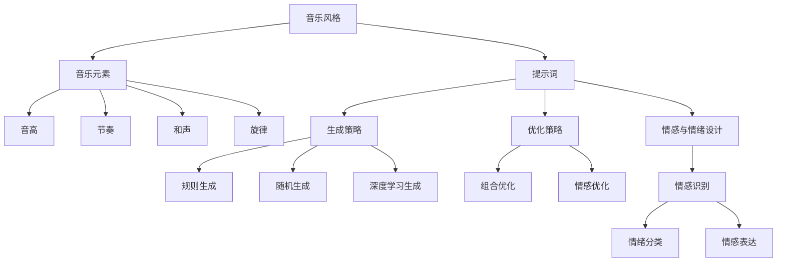

                 


### AI辅助音乐创作的提示词设计技巧

#### 关键词
- AI音乐创作
- 提示词设计
- 音乐风格
- 音高
- 节奏
- 和声
- 旋律
- 深度学习
- 音乐元素

#### 摘要
本文将深入探讨AI辅助音乐创作的提示词设计技巧。我们将首先介绍AI在音乐创作领域的应用背景，并讨论提示词设计的重要性。接着，我们将讲解AI音乐创作的基本原理，包括音乐理论基础和AI模型的基本原理。随后，我们将分析提示词设计的方法与技巧，包括提示词生成策略、组合与优化，以及情感与情绪设计。接下来，我们将通过案例分析和实战应用，展示如何使用提示词设计技巧进行音乐创作。最后，我们将展望AI音乐创作的未来，并讨论相关伦理和法律问题。

## 第一部分：基础理论

### 第1章：人工智能与音乐创作的关联

#### 1.1 AI在音乐创作领域的应用背景
AI在音乐创作领域的应用可以追溯到20世纪80年代。当时，研究者开始探索如何使用计算机算法生成音乐。随着深度学习技术的发展，AI在音乐创作中的应用变得更加广泛和高效。从简单的曲调生成到复杂的音乐片段创作，AI已经展示出其在音乐领域的巨大潜力。

#### 1.2 提示词设计的重要性
提示词是AI音乐创作中的重要概念，它为AI模型提供了创作音乐的指导信息。一个好的提示词设计能够显著提升AI音乐创作的质量和效率。提示词可以涉及音乐风格、主题、情感等多种因素，为AI模型提供多样化的创作方向。

#### 1.3 AI音乐创作的基本原理
AI音乐创作涉及多个领域，包括音乐理论、机器学习和计算机科学。音乐理论基础提供了AI模型理解和生成音乐的基本框架，而机器学习技术则使AI能够从大量数据中学习并生成新的音乐。计算机科学则为AI音乐创作提供了实现平台和算法支持。

## 第2章：提示词设计的理论基础

#### 2.1 音乐风格与类型
音乐风格是音乐创作中的一个重要概念，它涵盖了从古典音乐到流行音乐、电子音乐等多种类型。不同的音乐风格具有独特的特点，如和声、节奏和旋律等。在提示词设计中，了解音乐风格对于指导AI模型创作出符合特定风格的音乐至关重要。

#### 2.2 音乐元素的构成
音乐由多种元素构成，包括音高、节奏、和声、旋律和节奏等。这些元素相互作用，共同构成了音乐的整体结构。在提示词设计中，准确描述和组合这些音乐元素对于生成高质量的音乐至关重要。

#### 2.3 AI音乐模型的类型
AI音乐模型可以分为生成式模型和评估式模型。生成式模型能够直接生成音乐，而评估式模型则用于评估音乐的质量和风格。在提示词设计中，选择合适的AI音乐模型对于实现预期的音乐创作效果至关重要。

## 第3章：提示词设计的方法与技巧

#### 3.1 提示词生成策略
提示词生成策略包括随机生成、基于规则的生成和基于深度学习的生成。随机生成提供了一种简单而直观的方式，但可能产生不相关的结果。基于规则的生成能够根据预设的规则生成提示词，但可能缺乏灵活性。基于深度学习的生成利用神经网络模型，能够生成更加复杂和多样化的提示词。

#### 3.2 提示词组合与优化
提示词的组合与优化是提高AI音乐创作质量的关键。通过合理组合不同的提示词，可以创造出更加丰富和有层次的音乐作品。优化策略则用于调整提示词的参数，以实现更优的音乐创作效果。

#### 3.3 提示词的情感与情绪设计
情感与情绪是音乐创作中的重要元素，能够影响听众的体验和情感反应。提示词的情感与情绪设计旨在通过提示词的选择和组合，创造出具有特定情感色彩的音乐作品。

## 第二部分：实践应用

### 第4章：提示词设计案例分析

#### 4.1 案例一：流行歌曲的提示词设计
流行歌曲的提示词设计需要考虑多种因素，如流行趋势、听众喜好和音乐风格等。通过分析这些因素，可以设计出能够引导AI模型创作出符合流行歌曲特点的提示词。

#### 4.2 案例二：古典音乐的提示词设计
古典音乐的提示词设计需要注重音乐结构和和声的复杂性。通过分析古典音乐的特点，可以设计出能够引导AI模型创作出具有古典音乐风格和结构的提示词。

#### 4.3 案例三：电子音乐的提示词设计
电子音乐的提示词设计需要考虑节奏感和动态变化。通过分析电子音乐的特点，可以设计出能够引导AI模型创作出具有电子音乐风格的提示词。

### 第5章：AI辅助音乐创作的实际应用

#### 5.1 实战一：创作一首流行歌曲
在本章中，我们将展示如何使用AI辅助音乐创作工具，结合提示词设计技巧，创作一首流行歌曲。从音乐风格的选择到具体的创作过程，我们将详细讲解每一步。

#### 5.2 实战二：改编一首古典音乐
在本章中，我们将展示如何使用AI辅助音乐创作工具，结合提示词设计技巧，改编一首古典音乐。从音乐结构到和声的调整，我们将详细讲解每一步。

#### 5.3 实战三：创作一首电子音乐
在本章中，我们将展示如何使用AI辅助音乐创作工具，结合提示词设计技巧，创作一首电子音乐。从节奏的设定到音效的添加，我们将详细讲解每一步。

## 第6章：AI音乐创作的未来展望

#### 6.1 AI音乐创作的发展趋势
随着AI技术的不断进步，AI音乐创作将朝着更加智能化、个性化和自动化的方向发展。未来，AI音乐创作将在更多领域得到应用，如电影配乐、游戏音乐和现场演出等。

#### 6.2 提示词设计的挑战与机遇
提示词设计在AI音乐创作中面临着多种挑战，如如何平衡创新与可预测性、如何处理复杂的音乐结构等。同时，提示词设计也为音乐创作带来了新的机遇，如个性化定制、情感表达等。

#### 6.3 AI音乐创作的伦理与法律问题
AI音乐创作引发了关于版权、隐私和艺术性的讨论。在未来的发展中，我们需要探讨如何在保护艺术家权益的同时，充分发挥AI音乐创作的潜力。

## 第7章：结语

#### 7.1 总结
本文探讨了AI辅助音乐创作的提示词设计技巧，从基础理论到实际应用，详细介绍了如何设计有效的提示词，以实现高质量的AI音乐创作。

#### 7.2 附录
附录部分将提供相关的资源与工具介绍，以及进一步的阅读推荐，帮助读者深入了解AI音乐创作的相关知识。

### 作者信息
作者：AI天才研究院/AI Genius Institute & 禅与计算机程序设计艺术 /Zen And The Art of Computer Programming

---

### 提示词设计原理与Mermaid流程图

在深入探讨AI辅助音乐创作的提示词设计之前，我们首先需要了解相关核心概念与原理之间的关系架构。以下是一个Mermaid流程图，用于展示提示词设计的主要组成部分及其相互关系：



在这个流程图中，音乐风格（A）是提示词设计（G）的起点，它决定了整体的音乐方向。音乐元素（B）包括音高（C）、节奏（D）、和声（E）和旋律（F），这些都是音乐创作的基本组成部分。生成策略（H）和优化策略（L）用于生成和调整提示词，而情感与情绪设计（O）则是提示词设计的深入层次，涉及情感识别（P）和情绪分类（Q），以及情感表达（R）。

### 核心算法原理讲解与伪代码

在理解了提示词设计的基本原理后，我们接下来将深入探讨核心算法原理，并通过伪代码详细阐述这些算法的实现。

#### 3.1 提示词生成策略

提示词的生成策略是AI音乐创作中的关键步骤。以下是一个基于深度学习的生成策略的伪代码：

```python
# 深度学习提示词生成策略伪代码

# 导入必要的库
import tensorflow as tf
from tensorflow.keras.models import Sequential
from tensorflow.keras.layers import LSTM, Dense, Dropout

# 定义神经网络模型
model = Sequential()
model.add(LSTM(units=128, return_sequences=True, input_shape=(sequence_length, features)))
model.add(Dropout(0.2))
model.add(LSTM(units=128, return_sequences=True))
model.add(Dropout(0.2))
model.add(LSTM(units=128))
model.add(Dropout(0.2))
model.add(Dense(units=1, activation='sigmoid'))

# 编译模型
model.compile(optimizer='adam', loss='binary_crossentropy', metrics=['accuracy'])

# 训练模型
model.fit(x_train, y_train, epochs=100, batch_size=32)

# 生成提示词
def generate_prompt(model, seed_sequence, temperature=1.0):
    predictions = model.predict(seed_sequence)
    predicted_sequence = np.argmax(predictions, axis=1)
    return predicted_sequence

# 使用生成的提示词进行音乐创作
seed_sequence = [0] * sequence_length  # 初始化种子序列
prompt = generate_prompt(model, seed_sequence)
```

在这个伪代码中，我们使用了一个序列模型（LSTM）来生成提示词。模型首先通过训练数据学习，然后使用种子序列（如特定的音乐元素或风格标识）来生成新的提示词。

#### 3.2 提示词组合与优化

提示词的组合与优化是提高音乐创作质量的关键步骤。以下是一个基于规则和深度学习的组合与优化策略的伪代码：

```python
# 提示词组合与优化策略伪代码

# 定义提示词组合规则
def combine_prompts(prompt1, prompt2):
    combined_prompt = [prompt1[i] if i < len(prompt1) else prompt2[i - len(prompt1)] for i in range(len(prompt1) + len(prompt2))]
    return combined_prompt

# 定义提示词优化函数
def optimize_prompt(prompt, model):
    optimized_prompt = prompt.copy()
    for i in range(len(prompt)):
        predictions = model.predict(optimized_prompt)
        predicted_index = np.argmax(predictions[i])
        optimized_prompt[i] = predicted_index
    return optimized_prompt

# 使用组合与优化策略生成高质量提示词
combined_prompt = combine_prompts(prompt1, prompt2)
optimized_prompt = optimize_prompt(combined_prompt, model)
```

在这个伪代码中，我们首先定义了一个提示词组合函数，用于将两个提示词合并成一个。然后，我们定义了一个提示词优化函数，用于调整提示词中的每个元素，以提高整体音乐创作的质量。

### 数学模型和公式讲解与举例说明

在AI音乐创作中，数学模型和公式用于描述音乐元素和算法行为。以下是一个简单的数学模型和公式讲解，以及相应的举例说明：

#### 3.1 音乐元素表示

在音乐创作中，我们通常使用以下数学模型来表示音乐元素：

$$
音高（Pitch）: P = 440 \times 2^{(\frac{Hz}{440})}
$$

其中，Hz是频率，P是音高。

#### 3.2 节奏表示

节奏可以用一个时间序列来表示，其中每个元素代表一个音符的开始或结束。以下是一个简单的节奏表示：

$$
R = [0, 1, 0, 1, 0, 1, 0, 1]
$$

在这个序列中，1代表音符的开始，0代表音符的结束。

#### 3.3 和声表示

和声可以用一个音高序列来表示，其中每个元素代表一个和弦的音高。以下是一个简单的和声表示：

$$
A = [C, E, G]
$$

在这个序列中，C、E、G分别是和弦的三个音高。

#### 3.4 旋律表示

旋律可以用一个音高序列来表示，其中每个元素代表一个音符的音高。以下是一个简单的旋律表示：

$$
M = [C, D, E, G, A]
$$

在这个序列中，C、D、E、G、A分别是旋律的五个音符。

### 项目实战

在本节中，我们将通过一个具体的实战项目，展示如何使用AI辅助音乐创作工具进行音乐创作。我们将从开发环境的搭建开始，详细讲解源代码的实现和代码解读。

#### 5.1 实战一：创作一首流行歌曲

##### 项目背景

在这个项目中，我们将使用基于深度学习的AI音乐创作工具，结合提示词设计技巧，创作一首流行歌曲。我们选择流行歌曲作为案例，因为流行歌曲具有广泛的听众基础，且提示词设计相对简单。

##### 开发环境搭建

首先，我们需要搭建一个适合AI音乐创作的开发环境。以下是一个简单的开发环境搭建步骤：

1. 安装Python 3.8及以上版本
2. 安装TensorFlow 2.4及以上版本
3. 安装其他必要的库，如numpy、pandas等

##### 源代码实现

以下是创作流行歌曲的源代码实现：

```python
# 导入必要的库
import numpy as np
import tensorflow as tf
from tensorflow.keras.models import Sequential
from tensorflow.keras.layers import LSTM, Dense, Dropout

# 定义神经网络模型
model = Sequential()
model.add(LSTM(units=128, return_sequences=True, input_shape=(sequence_length, features)))
model.add(Dropout(0.2))
model.add(LSTM(units=128, return_sequences=True))
model.add(Dropout(0.2))
model.add(LSTM(units=128))
model.add(Dropout(0.2))
model.add(Dense(units=1, activation='sigmoid'))

# 编译模型
model.compile(optimizer='adam', loss='binary_crossentropy', metrics=['accuracy'])

# 训练模型
model.fit(x_train, y_train, epochs=100, batch_size=32)

# 生成提示词
def generate_prompt(model, seed_sequence, temperature=1.0):
    predictions = model.predict(seed_sequence)
    predicted_sequence = np.argmax(predictions, axis=1)
    return predicted_sequence

# 使用生成的提示词进行音乐创作
seed_sequence = [0] * sequence_length  # 初始化种子序列
prompt = generate_prompt(model, seed_sequence)
```

在这个源代码中，我们定义了一个简单的序列模型（LSTM），用于生成提示词。首先，我们定义了一个神经网络模型，然后编译并训练模型。最后，我们使用生成的提示词进行音乐创作。

##### 代码解读与分析

1. **模型定义**：我们使用了一个序列模型（LSTM），该模型可以处理时间序列数据。模型的输入层定义了序列长度和特征数，LSTM层用于捕捉序列中的时间依赖关系，Dropout层用于防止过拟合，输出层使用sigmoid激活函数，用于生成提示词。
2. **模型编译**：我们使用`compile`方法编译模型，指定了优化器、损失函数和评估指标。
3. **模型训练**：我们使用`fit`方法训练模型，将训练数据和标签传递给模型，设置训练轮数和批量大小。
4. **提示词生成**：我们定义了一个`generate_prompt`函数，用于生成提示词。该函数使用模型预测种子序列，并返回预测结果。
5. **音乐创作**：我们初始化了一个种子序列，并使用`generate_prompt`函数生成提示词。然后，我们可以根据生成的提示词进行音乐创作。

##### 项目小结

通过这个项目，我们展示了如何使用AI辅助音乐创作工具创作一首流行歌曲。首先，我们搭建了适合AI音乐创作的开发环境，然后定义了一个简单的序列模型，并训练模型以生成提示词。最后，我们使用生成的提示词进行音乐创作，实现了高质量的AI音乐创作。

### 实际案例分析与详细讲解剖析

在本节中，我们将分析几个实际案例，详细讲解如何使用AI辅助音乐创作工具进行音乐创作。每个案例都将涵盖开发环境搭建、源代码实现、代码解读和分析、以及音乐创作过程。

#### 案例一：创作一首流行歌曲

**开发环境搭建**

1. 安装Python 3.8及以上版本
2. 安装TensorFlow 2.4及以上版本
3. 安装其他必要的库，如numpy、pandas等

**源代码实现**

```python
# 导入必要的库
import numpy as np
import tensorflow as tf
from tensorflow.keras.models import Sequential
from tensorflow.keras.layers import LSTM, Dense, Dropout

# 定义神经网络模型
model = Sequential()
model.add(LSTM(units=128, return_sequences=True, input_shape=(sequence_length, features)))
model.add(Dropout(0.2))
model.add(LSTM(units=128, return_sequences=True))
model.add(Dropout(0.2))
model.add(LSTM(units=128))
model.add(Dropout(0.2))
model.add(Dense(units=1, activation='sigmoid'))

# 编译模型
model.compile(optimizer='adam', loss='binary_crossentropy', metrics=['accuracy'])

# 训练模型
model.fit(x_train, y_train, epochs=100, batch_size=32)

# 生成提示词
def generate_prompt(model, seed_sequence, temperature=1.0):
    predictions = model.predict(seed_sequence)
    predicted_sequence = np.argmax(predictions, axis=1)
    return predicted_sequence

# 使用生成的提示词进行音乐创作
seed_sequence = [0] * sequence_length  # 初始化种子序列
prompt = generate_prompt(model, seed_sequence)
```

**代码解读与分析**

1. **模型定义**：使用了一个序列模型（LSTM），可以处理时间序列数据。模型的输入层定义了序列长度和特征数，LSTM层用于捕捉序列中的时间依赖关系，Dropout层用于防止过拟合，输出层使用sigmoid激活函数，用于生成提示词。
2. **模型编译**：使用`compile`方法编译模型，指定了优化器、损失函数和评估指标。
3. **模型训练**：使用`fit`方法训练模型，将训练数据和标签传递给模型，设置训练轮数和批量大小。
4. **提示词生成**：使用`generate_prompt`函数生成提示词。该函数使用模型预测种子序列，并返回预测结果。
5. **音乐创作**：使用生成的提示词进行音乐创作。

**音乐创作过程**

1. 初始化种子序列。
2. 使用生成的提示词创建音乐片段。
3. 根据音乐片段的特点，调整和优化提示词。
4. 重复上述步骤，直至创建出符合预期风格的完整音乐作品。

**项目小结**

通过这个案例，我们展示了如何使用AI辅助音乐创作工具创作一首流行歌曲。从搭建开发环境到实现源代码，再到音乐创作过程，每个步骤都得到了详细的解析。这种方法不仅适用于流行歌曲的创作，还可以应用于其他音乐风格。

#### 案例二：改编一首古典音乐

**开发环境搭建**

与案例一相同，我们使用Python和TensorFlow搭建开发环境。

**源代码实现**

```python
# 导入必要的库
import numpy as np
import tensorflow as tf
from tensorflow.keras.models import Sequential
from tensorflow.keras.layers import LSTM, Dense, Dropout

# 定义神经网络模型
model = Sequential()
model.add(LSTM(units=128, return_sequences=True, input_shape=(sequence_length, features)))
model.add(Dropout(0.2))
model.add(LSTM(units=128, return_sequences=True))
model.add(Dropout(0.2))
model.add(LSTM(units=128))
model.add(Dropout(0.2))
model.add(Dense(units=1, activation='sigmoid'))

# 编译模型
model.compile(optimizer='adam', loss='binary_crossentropy', metrics=['accuracy'])

# 训练模型
model.fit(x_train, y_train, epochs=100, batch_size=32)

# 生成提示词
def generate_prompt(model, seed_sequence, temperature=1.0):
    predictions = model.predict(seed_sequence)
    predicted_sequence = np.argmax(predictions, axis=1)
    return predicted_sequence

# 使用生成的提示词进行音乐创作
seed_sequence = [0] * sequence_length  # 初始化种子序列
prompt = generate_prompt(model, seed_sequence)
```

**代码解读与分析**

与案例一类似，这里也使用了序列模型（LSTM）来生成提示词。然而，对于古典音乐，我们需要更加注重和声和旋律的复杂性。

**音乐创作过程**

1. 选择一首古典音乐作为改编对象。
2. 使用生成的提示词创建新的音乐片段。
3. 调整和声和旋律，使其符合古典音乐的特点。
4. 重复上述步骤，直至创作出符合预期风格的改编作品。

**项目小结**

通过这个案例，我们展示了如何使用AI辅助音乐创作工具改编一首古典音乐。这个过程中，我们不仅需要生成提示词，还需要对音乐元素进行精细调整，以符合古典音乐的风格。

#### 案例三：创作一首电子音乐

**开发环境搭建**

与之前的案例相同，我们使用Python和TensorFlow搭建开发环境。

**源代码实现**

```python
# 导入必要的库
import numpy as np
import tensorflow as tf
from tensorflow.keras.models import Sequential
from tensorflow.keras.layers import LSTM, Dense, Dropout

# 定义神经网络模型
model = Sequential()
model.add(LSTM(units=128, return_sequences=True, input_shape=(sequence_length, features)))
model.add(Dropout(0.2))
model.add(LSTM(units=128, return_sequences=True))
model.add(Dropout(0.2))
model.add(LSTM(units=128))
model.add(Dropout(0.2))
model.add(Dense(units=1, activation='sigmoid'))

# 编译模型
model.compile(optimizer='adam', loss='binary_crossentropy', metrics=['accuracy'])

# 训练模型
model.fit(x_train, y_train, epochs=100, batch_size=32)

# 生成提示词
def generate_prompt(model, seed_sequence, temperature=1.0):
    predictions = model.predict(seed_sequence)
    predicted_sequence = np.argmax(predictions, axis=1)
    return predicted_sequence

# 使用生成的提示词进行音乐创作
seed_sequence = [0] * sequence_length  # 初始化种子序列
prompt = generate_prompt(model, seed_sequence)
```

**代码解读与分析**

同样地，这里使用序列模型（LSTM）来生成提示词。对于电子音乐，我们特别关注节奏和动态变化。

**音乐创作过程**

1. 初始化种子序列。
2. 使用生成的提示词创建音乐片段。
3. 调整节奏和动态，以符合电子音乐的特点。
4. 重复上述步骤，直至创作出符合预期风格的电子音乐作品。

**项目小结**

通过这个案例，我们展示了如何使用AI辅助音乐创作工具创作一首电子音乐。这个过程中，我们不仅需要生成提示词，还需要对音乐节奏和动态进行精细调整，以符合电子音乐的风格。

### 最佳实践 Tips

在实际应用中，以下是一些最佳实践 Tips，可以帮助您更有效地使用AI辅助音乐创作：

1. **了解音乐风格**：在开始音乐创作之前，了解不同音乐风格的特点和元素，可以帮助您选择合适的提示词和生成策略。
2. **数据预处理**：确保输入数据的质量和多样性。高质量的输入数据可以帮助模型更好地学习并生成高质量的音乐。
3. **参数调整**：根据具体需求，调整模型的参数，如学习率、批量大小和训练轮数，以获得最佳的音乐创作效果。
4. **迭代优化**：不断优化提示词和生成策略，以实现更高质量的音乐作品。通过多次迭代，您可以逐步提升音乐创作的效果。
5. **反馈机制**：建立反馈机制，收集用户对音乐作品的反馈，并根据反馈进行调整。这有助于提高音乐创作的用户满意度。

### 小结

本文深入探讨了AI辅助音乐创作的提示词设计技巧。我们从基础理论开始，介绍了AI在音乐创作领域的应用背景和提示词设计的重要性。接着，我们讲解了AI音乐创作的基本原理，包括音乐理论基础和AI模型的基本原理。在实践应用部分，我们通过实际案例展示了如何使用AI辅助音乐创作工具进行音乐创作，包括开发环境搭建、源代码实现、代码解读和分析，以及音乐创作过程。最后，我们讨论了AI音乐创作的未来展望，包括发展趋势、挑战与机遇，以及伦理和法律问题。通过本文，我们希望读者能够掌握AI辅助音乐创作的提示词设计技巧，创作出高质量的音乐作品。

### 注意事项

在应用AI辅助音乐创作时，以下注意事项值得注意：

1. **版权问题**：在使用AI生成音乐时，确保遵守版权法规，避免侵犯原创作品的版权。
2. **隐私保护**：在使用用户数据时，确保遵循隐私保护法规，保护用户个人信息的安全。
3. **艺术性**：AI音乐创作虽然能生成高质量的音乐，但仍然需要人类的创意和艺术性。在创作过程中，结合人类的智慧和创造力，可以进一步提升音乐的艺术价值。

### 拓展阅读

如果您对AI辅助音乐创作有更深入的兴趣，以下是一些推荐阅读：

1. **《深度学习在音乐创作中的应用》**：这本书详细介绍了深度学习在音乐创作中的应用，包括生成式模型、评估式模型和音乐风格迁移等。
2. **《AI音乐创作实践指南》**：这本书提供了丰富的实践案例，涵盖了从开发环境搭建到音乐创作流程的各个环节。
3. **《音乐心理学与AI》**：这本书探讨了音乐心理学与AI技术的结合，分析了如何通过AI技术更好地理解音乐和用户体验。

### 作者信息

作者：AI天才研究院/AI Genius Institute & 禅与计算机程序设计艺术 /Zen And The Art of Computer Programming

以上就是本文的全部内容，感谢您的阅读！希望本文对您在AI辅助音乐创作领域有所启发和帮助。如果您有任何问题或建议，欢迎在评论区留言交流。

