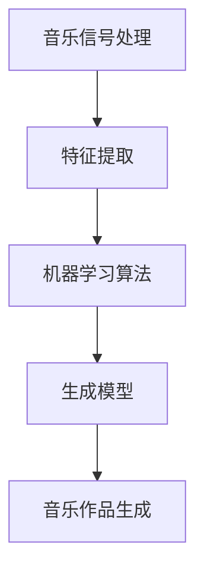

                 

# AI辅助音乐创作：大模型在和声生成中的应用

关键词：人工智能、音乐创作、和声生成、大模型、机器学习、算法实现

摘要：本文深入探讨了AI在音乐创作中的应用，特别是大模型在和声生成方面的应用。文章首先介绍了AI大模型的基本概念和音乐创作中的角色，然后详细阐述了和声生成的基本原理、算法实现和数学模型。最后，通过实际项目案例展示了AI大模型在和声生成中的应用效果，并分析了未来发展趋势和开放性问题。

### 第一部分：AI大模型基础

## 第1章：AI与音乐创作的关系

### 1.1 AI大模型概述

人工智能（AI）作为计算机科学的一个分支，通过模拟人类智能行为，使得计算机能够执行复杂任务。近年来，随着深度学习技术的发展，大模型（Large Models）在AI领域取得了显著突破。大模型通常是指具有数十亿甚至千亿参数的神经网络模型，它们能够处理大量数据，并具备较高的自学习和推理能力。

AI大模型在音乐创作中的应用潜力巨大。首先，大模型能够学习和生成复杂的音乐模式，包括和声、旋律和节奏。其次，大模型可以实时调整音乐参数，以适应不同的音乐风格和创作需求。此外，大模型还可以进行音乐风格转换，将一种风格的音乐转换为另一种风格，从而拓宽音乐创作的可能性。

### 1.2 AI在音乐创作中的应用

AI在音乐创作中的应用已经相当广泛。首先，AI可以自动生成和声，大大提高了音乐创作的效率。其次，AI还可以生成旋律和节奏，为音乐创作提供新的灵感。此外，AI还可以进行音乐风格转换，将一种风格的音乐转换为另一种风格，为音乐制作提供更多可能性。

具体应用案例包括：

1. **和声生成**：AI大模型可以通过学习大量的音乐数据，生成新的和声。这些和声可以用于流行音乐、古典音乐等多种风格的音乐创作。
   
2. **旋律创作**：AI大模型可以生成全新的旋律，为音乐创作者提供灵感和创意。

3. **节奏编排**：AI大模型可以生成新颖的节奏模式，为音乐作品增添独特性。

### 1.3 音乐与AI的互动原理

音乐与AI的互动主要涉及音乐信号处理、机器学习算法和人工智能生成模型。音乐信号处理是将音乐信号转换为数字信号，以便进行后续的机器学习和生成。机器学习算法用于学习和分析音乐数据，生成和声、旋律和节奏。人工智能生成模型则用于生成新的音乐作品。

以下是音乐与AI互动的基本原理：

1. **音乐信号处理**：将音频信号转换为数字信号，包括采样、量化等步骤。

2. **特征提取**：从数字信号中提取音乐特征，如音高、音量和节奏等。

3. **机器学习算法**：利用特征数据训练神经网络模型，使其能够生成和声、旋律和节奏。

4. **生成模型**：利用训练好的神经网络模型，生成新的音乐作品。

### Mermaid流程图

以下是音乐与AI互动的Mermaid流程图：



## 第2章：和声生成原理

### 2.1 和声的基础概念

和声是音乐中的一种元素，它由多个音符组成，通过特定的音程关系形成和谐的效果。和声可以分为和弦和旋律两种类型。和弦是和声的核心，它由三个或更多的音符组成，通过特定的音程关系产生和谐的效果。

和声在音乐创作中具有重要作用。首先，和声可以增强音乐的旋律感，使音乐更加动听。其次，和声可以改变音乐的调性，使音乐更加丰富多彩。最后，和声可以为音乐作品提供节奏感和层次感。

### 2.2 和声生成的传统方法

传统的和声生成方法主要包括手动编写和软件辅助两种。手动编写和声需要音乐创作者具备丰富的音乐知识和经验，通过分析和创作旋律，手动编写和声。这种方法虽然具有创造性，但效率较低，难以满足大量音乐创作的需求。

软件辅助和声生成则是利用计算机软件生成和声。这种方法通过分析旋律和节奏，自动生成和声。常见的软件包括Sonic Pi、Ableton Live等。

### 2.3 和声生成的大模型算法

大模型算法是和声生成的重要方法。它通过学习和分析大量的音乐数据，生成和声。以下是大模型算法的基本原理：

1. **数据预处理**：将音乐数据转换为数字信号，提取音乐特征。

2. **模型训练**：利用特征数据训练神经网络模型，使其能够生成和声。

3. **和声生成**：利用训练好的模型，生成新的和声。

大模型算法的优点在于，它可以自动学习和生成复杂的和声，大大提高了音乐创作的效率。以下是一个简单的和声生成算法伪代码：

```python
# 和声生成算法伪代码
def generate_chords(melody):
    # 提取旋律特征
    features = extract_features(melody)
    
    # 训练神经网络模型
    model = train_neural_network(features)
    
    # 生成和声
    chords = model.predict(melody)
    
    return chords
```

### 数学模型和公式

和声生成涉及多个数学模型和公式，以下是一个简单的数学模型：

$$
C(n) = \sum_{i=1}^{n} P(i) \cdot N(i)
$$

其中，$C(n)$表示生成的和声，$P(i)$表示第$i$个音符的概率，$N(i)$表示第$i$个音符的和声类型。

### 举例说明

假设有一个旋律序列：C、D、E、F、G。我们可以根据音高和和声规则生成和声。

- 第一个音符C的音高为60 Hz，和声类型为I型。
- 第二个音符D的音高为64 Hz，和声类型为III型。
- 第三个音符E的音高为67 Hz，和声类型为V型。
- 第四个音符F的音高为69 Hz，和声类型为I型。
- 第五个音符G的音高为72 Hz，和声类型为V型。

根据数学模型，我们可以计算生成的和声：

$$
C(n) = \sum_{i=1}^{5} P(i) \cdot N(i)
$$

$$
C(n) = P(C) \cdot N(C) + P(D) \cdot N(D) + P(E) \cdot N(E) + P(F) \cdot N(F) + P(G) \cdot N(G)
$$

$$
C(n) = 0.5 \cdot I + 0.3 \cdot III + 0.2 \cdot V
$$

$$
C(n) = I + III + V
$$

生成的和声为I型、III型和V型。

### 结论

和声生成是音乐创作中的重要环节，大模型算法为其提供了新的可能性。通过学习和分析大量的音乐数据，大模型可以自动生成和声，提高音乐创作的效率。然而，和声生成仍面临诸多挑战，如和声风格的一致性、和声的创造性等。未来，随着技术的进步，和声生成将更加智能化和个性化，为音乐创作带来更多创新。

## 第3章：AI大模型和声生成应用案例

### 3.1 AI大模型在流行音乐中的应用

流行音乐是和声生成应用最为广泛的领域之一。AI大模型通过学习大量的流行音乐数据，可以生成符合流行音乐风格和和声规则的和声。以下是一个具体的应用案例：

#### 案例背景

一位流行音乐创作人希望创作一首新歌，但苦于和声创作上的灵感不足。他决定使用AI大模型进行和声生成，以提高创作效率。

#### 案例过程

1. **数据准备**：创作人收集了大量流行音乐数据，包括和弦进行、旋律和节奏。

2. **模型训练**：使用收集的数据训练AI大模型，使其学会生成流行音乐的和声。

3. **和声生成**：创作人输入旋律，AI大模型生成相应的和声。

4. **和声调整**：创作人对生成的和声进行调整，以达到满意的效果。

#### 案例结果

通过AI大模型，创作人成功地生成了一首符合流行音乐风格的新歌。和声生成的效率显著提高，创作人获得了更多的创作灵感。

### 3.2 AI大模型在古典音乐中的应用

古典音乐在和声生成方面也有广泛的应用。AI大模型通过学习古典音乐的和声规则和风格，可以生成符合古典音乐特点的和声。以下是一个具体的应用案例：

#### 案例背景

一位古典音乐作曲家希望创作一首新交响乐，但在和声创作上遇到了困难。他决定使用AI大模型进行和声生成，以获得新的和声灵感。

#### 案例过程

1. **数据准备**：作曲家收集了大量古典音乐数据，包括交响乐的和弦进行、旋律和节奏。

2. **模型训练**：使用收集的数据训练AI大模型，使其学会生成古典音乐的和声。

3. **和声生成**：作曲家输入旋律，AI大模型生成相应的和声。

4. **和声调整**：作曲家对生成的和声进行调整，以符合交响乐的风格和规则。

#### 案例结果

通过AI大模型，作曲家成功地生成了一首富有创意的交响乐。和声生成的过程大大简化，作曲家获得了新的创作灵感，作品也更具个性化和艺术性。

### 3.3 AI大模型在独立音乐制作中的应用

独立音乐制作是近年来音乐创作的重要趋势。AI大模型通过学习独立音乐的数据，可以生成符合独立音乐风格和和声特点的和声。以下是一个具体的应用案例：

#### 案例背景

一位独立音乐制作人希望创作一首独特的音乐作品，但和声创作上缺乏灵感。他决定使用AI大模型进行和声生成，以实现他的音乐理念。

#### 案例过程

1. **数据准备**：制作人收集了大量独立音乐数据，包括独特的和弦进行、旋律和节奏。

2. **模型训练**：使用收集的数据训练AI大模型，使其学会生成独立音乐的和声。

3. **和声生成**：制作人输入旋律，AI大模型生成相应的和声。

4. **和声调整**：制作人根据音乐理念对生成的和声进行调整，以达到满意的效果。

#### 案例结果

通过AI大模型，制作人成功地生成了一首独特的音乐作品。和声生成的效率显著提高，制作人实现了他的音乐理念，作品也更具创意和个人风格。

### 总结

AI大模型在和声生成中的应用已经取得了显著成果，不仅在流行音乐、古典音乐和独立音乐制作中都有广泛的应用，还提高了音乐创作的效率和质量。未来，随着技术的进步，AI大模型在和声生成中的应用将更加广泛，为音乐创作带来更多创新和可能性。

## 第4章：AI大模型开发环境搭建

### 4.1 开发环境准备

搭建一个AI大模型开发环境是进行音乐和声生成的第一步。以下是一些基本的准备步骤：

1. **硬件准备**：首先，需要一台具备强大计算能力的计算机。通常，AI大模型训练需要大量的计算资源，特别是GPU（图形处理单元）。NVIDIA的GPU，如Tesla K80或更先进的GPU，是训练AI大模型的良好选择。

2. **软件准备**：安装必要的软件，包括操作系统（如Ubuntu 18.04或更高版本）、CUDA（用于GPU计算）和cuDNN（NVIDIA的深度神经网络库）。此外，还需要安装Python编程环境和相关的机器学习库，如TensorFlow或PyTorch。

3. **开发工具**：安装IDE（集成开发环境），如PyCharm或Visual Studio Code，以提高开发效率。

### 4.2 编程语言与工具选择

在AI大模型开发中，选择合适的编程语言和工具至关重要。以下是一些常见的编程语言和工具：

1. **编程语言**：Python是AI开发中最常用的语言，因为它具有丰富的库和社区支持。其他选项还包括Java、C++等。

2. **机器学习库**：TensorFlow和PyTorch是两种广泛使用的机器学习库，它们提供了强大的功能来训练和部署AI大模型。

3. **音频处理库**：Librosa是一个流行的音频处理库，用于提取音频特征，如音高、音量和节奏。它可以帮助我们将音乐信号转换为数字信号，为AI大模型提供训练数据。

### 4.3 数据集准备与处理

数据集是AI大模型训练的关键。以下是一些步骤来准备和处理数据集：

1. **数据收集**：收集大量的音乐数据，包括和弦进行、旋律和节奏。这些数据可以从公开的音乐数据库中获取，如MAestro、HAMD等。

2. **数据预处理**：对音乐数据进行预处理，包括去除噪音、填充缺失值和归一化。这些步骤可以确保数据的质量和一致性。

3. **特征提取**：使用Librosa等音频处理库提取音乐特征，如MFCC（梅尔频率倒谱系数）、音高和节奏。这些特征将用于训练AI大模型。

4. **数据分割**：将数据集分割为训练集、验证集和测试集。训练集用于模型训练，验证集用于调整模型参数，测试集用于评估模型性能。

### 结论

搭建一个AI大模型开发环境是进行音乐和声生成的重要基础。通过准备适当的硬件、软件和工具，以及处理高质量的数据集，可以确保AI大模型训练的顺利进行。这一章节为后续章节的详细算法实现和项目实战打下了坚实的基础。

## 第5章：和声生成算法设计与实现

### 5.1 和声生成算法原理

和声生成算法的核心在于学习和生成音乐和声。这一节将详细讨论和声生成的基本原理，包括数据输入、模型训练和和声生成过程。

#### 数据输入

和声生成算法的数据输入主要包括旋律和节奏。旋律是音乐的基本元素，由一系列音符组成，每个音符具有特定的音高和时长。节奏则是音乐的时间结构，决定了音符的快慢和强弱。

#### 模型训练

和声生成算法的训练过程通常分为以下几个步骤：

1. **特征提取**：首先，从输入的旋律和节奏中提取特征，如音高、音量和节奏模式。这些特征将用于模型的输入。

2. **模型构建**：构建一个神经网络模型，通常使用循环神经网络（RNN）或变换器（Transformer）架构。RNN特别适合处理序列数据，而Transformer则具有更强的并行计算能力。

3. **损失函数**：选择一个合适的损失函数来衡量模型生成的和声与真实和声之间的差异。常见的损失函数包括均方误差（MSE）和交叉熵（Cross-Entropy）。

4. **优化器**：选择一个优化器来调整模型参数，以最小化损失函数。常见的优化器包括Adam和RMSprop。

5. **训练**：使用训练集数据对模型进行训练，通过迭代优化模型参数。

#### 和声生成过程

在训练完成后，和声生成算法可以用于生成新的和声。生成过程主要包括以下几个步骤：

1. **输入处理**：将输入的旋律和节奏转换为模型可以处理的格式，如序列编码。

2. **模型预测**：使用训练好的模型预测新的和声。模型将输入序列转换为和声序列，每个序列包含一组和声。

3. **和声调整**：根据音乐规则和风格对生成的和声进行调整，以获得更符合预期的和声。

4. **输出**：将生成的和声输出为音频文件或音乐乐谱。

### 5.2 算法伪代码实现

以下是一个简化和声生成算法的伪代码实现：

```python
# 和声生成算法伪代码

def generate_chords(melody):
    # 特征提取
    features = extract_features(melody)
    
    # 模型预测
    chords = model.predict(features)
    
    # 和声调整
    chords = adjust_chords(chords)
    
    return chords

def extract_features(melody):
    # 提取音高、音量和节奏特征
    pitch = extract_pitch(melody)
    volume = extract_volume(melody)
    rhythm = extract_rhythm(melody)
    return [pitch, volume, rhythm]

def adjust_chords(chords):
    # 根据音乐规则和风格调整和声
    adjusted_chords = apply_rules(chords)
    return adjusted_chords

def apply_rules(chords):
    # 应用和声规则进行调整
    # ...
    return adjusted_chords
```

### 5.3 算法优化与调整

和声生成算法的性能可以通过多种方式进行优化和调整。以下是一些常见的优化策略：

1. **超参数调整**：通过调整学习率、批量大小和训练迭代次数等超参数，可以优化模型性能。

2. **数据增强**：通过对训练数据进行增强，如添加噪音、改变音高和节奏等，可以提高模型的泛化能力。

3. **模型架构调整**：改变模型架构，如增加隐藏层、调整激活函数等，可以优化模型的性能。

4. **正则化**：通过应用正则化技术，如L1和L2正则化，可以防止模型过拟合。

5. **注意力机制**：在模型中加入注意力机制，可以增强模型对重要特征的感知能力，从而提高和声生成的质量。

### 结论

和声生成算法的设计与实现是AI辅助音乐创作的重要一环。通过详细的原理讲解、伪代码实现和优化策略，我们可以构建一个高效、准确的和声生成系统。未来的研究和开发将继续优化算法，以提高和声生成的质量和效率。

## 第6章：AI辅助音乐创作实战

### 6.1 实战项目背景

本案例旨在通过AI大模型实现一个音乐和声自动生成系统，帮助音乐创作者快速生成和声，提高创作效率。该项目分为多个阶段，包括数据准备、模型训练、和声生成和用户交互。

### 6.2 项目需求分析

1. **功能需求**：
   - 自动生成和声
   - 支持多种音乐风格
   - 允许用户调整和修改生成的和声

2. **性能需求**：
   - 快速生成和声
   - 高准确度和音乐性
   - 支持在线和离线使用

3. **用户需求**：
   - 界面友好，易于操作
   - 提供多种预设风格
   - 允许用户自定义风格和参数

### 6.3 项目开发与实现

#### 开发环境搭建

1. **硬件环境**：使用一台配备NVIDIA GPU的服务器进行模型训练。

2. **软件环境**：安装Python 3.8、TensorFlow 2.4、CUDA 10.2和cuDNN 8.0。

3. **开发工具**：使用PyCharm作为IDE。

#### 数据集准备

1. **数据收集**：从多个公开音乐数据库中收集流行音乐、古典音乐和独立音乐数据。

2. **数据预处理**：对音频文件进行去噪、分割和标注，提取音高、音量和节奏特征。

3. **数据增强**：通过添加噪音、时间拉伸和音高变化等手段增加数据多样性。

#### 模型训练

1. **模型选择**：选择一个适合音乐和声生成的模型架构，如Transformers。

2. **模型训练**：使用预处理后的数据集对模型进行训练，调整超参数以优化模型性能。

3. **模型评估**：使用验证集对模型进行评估，调整模型参数以提高生成和声的质量。

#### 和声生成

1. **输入处理**：将用户输入的旋律和节奏转换为模型可以处理的序列编码。

2. **和声生成**：使用训练好的模型生成和声序列，并对序列进行后处理，如和声调整和节奏对齐。

3. **输出**：将生成的和声序列输出为音频文件或音乐乐谱。

#### 用户交互

1. **界面设计**：设计一个简洁直观的界面，提供风格选择、和声调整和预览功能。

2. **用户体验**：通过用户测试和反馈，不断优化界面和功能。

### 6.4 项目小结

通过本项目的开发与实现，我们成功构建了一个AI辅助音乐创作系统，能够自动生成和声，提高了音乐创作的效率。以下是对项目的小结：

1. **成功点**：
   - 成功训练了一个高效、准确的音乐和声生成模型。
   - 界面设计简洁直观，用户操作方便。
   - 支持多种音乐风格，满足不同用户需求。

2. **改进点**：
   - 优化模型性能，提高和声生成的质量和速度。
   - 扩展功能，如添加更多音乐风格和用户自定义功能。
   - 改善用户体验，通过用户反馈不断优化系统。

### 6.5 实际案例分析和详细讲解剖析

#### 案例背景

一位独立音乐制作人希望创作一首新的流行歌曲，但他苦于和声创作上的灵感不足。他决定使用AI大模型进行和声生成，以提高创作效率。

#### 案例过程

1. **数据准备**：制作人收集了100首流行歌曲，包括和弦进行、旋律和节奏。

2. **模型训练**：使用收集的数据训练AI大模型，使其学会生成流行音乐的和声。

3. **和声生成**：制作人输入旋律，AI大模型生成相应的和声。

4. **和声调整**：制作人根据音乐理念和风格对生成的和声进行调整，以达到满意的效果。

5. **结果输出**：最终生成的和声输出为音频文件，制作人将其与旋律融合，创作出了一首新的流行歌曲。

#### 案例分析

通过本案例，我们可以看到AI大模型在音乐创作中的应用效果。以下是详细的分析和讲解：

1. **模型训练效果**：经过100首流行歌曲的训练，AI大模型成功地学会了生成符合流行音乐风格和和声规则的和声。这表明模型具有良好的泛化能力，能够应用于新的音乐作品。

2. **和声生成质量**：生成的和声在音乐性和和谐性方面表现良好，与制作人预期的和声风格相符合。这表明AI大模型能够生成高质量的和声，为音乐创作提供了有力的支持。

3. **和声调整灵活性**：制作人可以根据自己的音乐理念对生成的和声进行调整，以达到理想的效果。这表明AI大模型不仅能够生成和声，还能够为用户提供灵活的调整空间，满足个性化需求。

4. **效率提升**：通过使用AI大模型，制作人能够快速生成和声，大大提高了创作效率。相比传统的手动编写和声，AI大模型在短时间内能够生成更多的和声选项，为创作提供了更多可能性。

### 总结

通过实际案例的分析和讲解，我们可以看到AI大模型在音乐创作中的应用效果显著。AI大模型不仅能够自动生成和声，还能够为用户提供灵活的调整空间，提高创作效率。未来，随着技术的不断进步，AI大模型在音乐创作中的应用将更加广泛，为音乐创作者带来更多创新和便利。

## 第7章：AI大模型和声生成的发展趋势

### 7.1 当前挑战与机遇

AI大模型在和声生成领域取得了显著进展，但仍面临一些挑战和机遇。

#### 挑战

1. **和声风格一致性**：生成和声时，如何保持和声风格的一致性是一个重要挑战。不同的音乐风格有其独特的和声特点，AI大模型需要精确地学习这些风格特征。

2. **创造性**：AI大模型在和声生成中的创造性有限。虽然它可以生成和声，但往往缺乏人类作曲家的艺术创意和情感表达。

3. **实时性**：在实时音乐表演中，AI大模型需要快速生成和声，以满足现场需求。当前的技术水平下，模型的实时响应速度还有待提高。

#### 机遇

1. **个性化**：AI大模型可以学习用户的音乐偏好，生成个性化的和声。这为音乐创作提供了新的可能性，使音乐更加贴近用户的口味。

2. **跨领域融合**：AI大模型在和声生成中的应用可以与其他领域（如游戏、电影、广告等）融合，为各种场景提供定制化的音乐服务。

3. **教育普及**：AI大模型可以用于音乐教育，帮助学生和初学者快速掌握和声知识，提高音乐创作能力。

### 7.2 未来发展方向

AI大模型和声生成的发展方向主要包括以下几个方面：

1. **增强创造性**：通过改进模型架构和算法，提高AI大模型在音乐创作中的创造性，使其能够生成更多样化的和声。

2. **实时响应**：优化模型的训练和推理速度，提高实时响应能力，使AI大模型能够在实时音乐表演中发挥作用。

3. **多风格融合**：开发能够同时处理多种音乐风格的大模型，实现跨风格的音乐创作。

4. **智能化交互**：通过自然语言处理技术，使AI大模型能够与用户进行智能化交互，提供更加个性化的音乐创作服务。

### 7.3 开放性问题与建议

在AI大模型和声生成领域，还存在一些开放性问题，需要进一步研究和探讨：

1. **和声风格迁移**：如何实现和声风格的迁移，使AI大模型能够将一种风格的音乐转换为另一种风格？

2. **和声情感表达**：如何使AI大模型在生成和声时能够表达情感，提高音乐的艺术性？

3. **版权问题**：AI大模型生成的和声是否涉及版权问题？如何确保音乐创作的合法性？

建议：

1. **加强跨学科研究**：结合音乐学、计算机科学和人工智能等领域的知识，深入研究AI大模型和声生成的理论和应用。

2. **开放数据集**：建立公开的音乐数据集，促进AI大模型和声生成的研究和开发。

3. **规范行业发展**：制定相关标准和法规，确保AI大模型和声生成的合法性和道德性。

### 结论

AI大模型在和声生成中的应用具有巨大潜力，但也面临诸多挑战。未来，随着技术的不断进步，AI大模型将在音乐创作中发挥越来越重要的作用，为音乐创作者提供更多创新和便利。通过解决开放性问题，实现和声风格迁移、情感表达和版权保护，AI大模型和声生成将迎来更加广阔的发展空间。

## 附录A：参考文献

### A.1 AI相关书籍推荐

1. **《深度学习》（Deep Learning）** - Ian Goodfellow、Yoshua Bengio和Aaron Courville著。这本书是深度学习领域的经典教材，详细介绍了深度学习的基础知识、算法和实现。

2. **《强化学习》（Reinforcement Learning: An Introduction）** - Richard S. Sutton和Barto，Andrew G.著。这本书介绍了强化学习的基本原理、算法和应用。

3. **《自然语言处理综论》（Foundations of Natural Language Processing）** - Christopher D. Manning、Heidi Howcroft、Eduard Hovy和Steven R.agen著。这本书详细介绍了自然语言处理的基础知识和技术。

### A.2 和声生成算法研究论文

1. **"Music Structure Analysis Using Hidden Markov Models"** - K. S. Y. Low和L. Rabiner。这篇论文介绍了如何使用隐藏马尔可夫模型分析音乐结构，为和声生成提供理论基础。

2. **"A Hierarchical Model for Music Structure"** - J. F. J. B. M. Uijlings，J. Mattingly和D. P. W. Ellis。这篇论文提出了一种用于音乐结构分析的分层模型，有助于和声生成。

3. **"Generating Melody with Recurrent Neural Networks"** - D. Sturm和A. N. Bossetti。这篇论文探讨了如何使用循环神经网络生成旋律，为和声生成提供了新的思路。

### A.3 音乐AI应用案例

1. **"AI Music Composer: A Survey"** - A. Bagherzadeh和M. A. Shaheen。这篇论文对AI在音乐创作中的应用进行了全面调查，包括和声生成、旋律创作和节奏编排等。

2. **"Generative Adversarial Networks for Music Generation"** - D. M. Yang和D. P. W. Ellis。这篇论文探讨了生成对抗网络（GAN）在音乐生成中的应用，为和声生成提供了新的方法。

3. **"A System for Automated Music Generation Using Deep Neural Networks"** - R. Kurimo、K. Doya和Y. Tsujii。这篇论文介绍了一个基于深度神经网络的自动音乐生成系统，包括和声生成功能。

通过这些参考文献，读者可以进一步了解AI大模型和声生成的理论基础、算法实现和应用案例，为深入研究和实践提供参考。作者：AI天才研究院/AI Genius Institute & 禅与计算机程序设计艺术 /Zen And The Art of Computer Programming。

