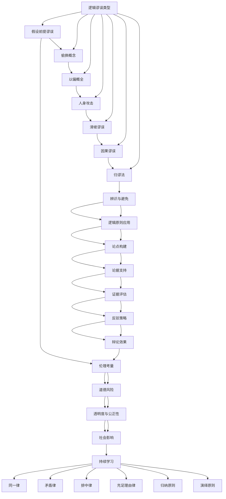

                 

### 引言

人工智能（AI）作为当今科技领域的前沿技术，正在以惊人的速度变革我们的生活方式和商业运作模式。AI的应用领域广泛，从自动驾驶汽车、智能助手，到复杂的金融分析和医疗诊断，AI正在逐步深入到社会的各个角落。然而，随着AI技术的普及，随之而来的是一系列新的挑战和问题。其中之一便是AI辩论。AI辩论不仅是对人工智能技术本身的一次探讨，更是对人类逻辑思维和伦理道德的一次深刻反思。

在这个背景下，我们提出了“AI辩论训练营：提示词构建逻辑思维体系”这一主题。本文旨在通过一系列深入浅出的分析和实例，帮助读者了解AI辩论的内涵与外延，掌握构建逻辑思维体系的技巧，并探索提示词在辩论中的作用。具体来说，本文将分为以下几个部分：

1. **AI辩论基础**：介绍AI辩论的定义、重要性及其发展历程。
2. **逻辑思维体系构建**：探讨逻辑思维的基本原则、逻辑谬误的辨识及如何建立逻辑思维框架。
3. **提示词在辩论中的作用**：分析提示词的概念、分类及其在辩论中的运用策略。
4. **构建有效的辩论论点**：讲解论点的构建方法、论据的支持与反驳，以及论证的有效性评估。
5. **实战演练与技巧提升**：提供辩论实战模拟和提升策略，帮助读者应对辩论中的常见问题。
6. **AI辩论的伦理与道德问题**：讨论AI辩论中的伦理问题、避免道德风险的策略，以及如何建立健康的AI辩论文化。
7. **未来展望与趋势**：展望AI辩论的未来发展方向，以及人工智能在辩论教育中的应用。

通过这篇文章，我们希望读者不仅能对AI辩论有一个全面而深入的了解，还能掌握构建逻辑思维体系的技巧，为未来的辩论和沟通奠定坚实的基础。让我们一步步走进AI辩论的世界，开启这场智慧的较量。

---

### AI辩论基础

AI辩论作为一种新兴的辩论形式，其核心在于利用人工智能技术进行观点的阐述、论证和反驳。那么，什么是AI辩论？它的重要性体现在哪些方面？它的发展历程又是怎样的？下面我们将一一解答这些问题。

#### **AI辩论的定义与重要性**

AI辩论，顾名思义，是利用人工智能技术进行的辩论活动。这种辩论不仅依赖于人类辩论者的智慧和逻辑思维能力，还融入了人工智能的算法和数据分析能力。AI辩论的参与者可以是人类，也可以是AI程序。在辩论过程中，AI可以扮演多个角色，例如作为辩论者、评论员或裁判。

AI辩论的重要性主要体现在以下几个方面：

1. **提升辩论质量**：AI的参与可以提供大量的数据支持和算法优化，从而提高辩论的深度和广度。通过AI的分析，辩论者可以更精准地找到论据，反驳对方的观点，从而提升辩论的整体质量。

2. **拓展辩论范围**：AI辩论使得辩论不再局限于人类的知识和经验，而是可以跨越时间和空间的限制。通过数据挖掘和机器学习，AI可以获取到全球范围内的信息和观点，从而为辩论提供更多的素材和视角。

3. **促进知识传播**：AI辩论可以促进知识的传播和交流。通过AI的参与，辩论的内容和结论可以迅速传播到更广泛的受众群体，从而推动知识的普及和应用。

#### **AI辩论的发展历程**

AI辩论的发展历程可以追溯到人工智能的早期探索。在20世纪50年代，随着计算机科学的发展，人工智能的概念逐渐成型。在此后的几十年中，人工智能技术经历了多个阶段的发展，从最初的规则推理、知识表示，到现代的机器学习和深度学习，每一次技术突破都为AI辩论的兴起奠定了基础。

1. **早期探索**：在20世纪50年代末至60年代初，人工智能研究主要集中在逻辑推理和知识表示方面。这一时期的代表性成果包括逻辑推理机、专家系统和知识库系统。这些技术为AI辩论提供了初步的工具和平台。

2. **人工智能革命**：20世纪80年代至90年代，随着计算机硬件的快速发展和算法的优化，人工智能迎来了第一次革命。这一时期，机器学习技术逐渐成熟，特别是在模式识别、自然语言处理和决策支持系统方面取得了显著进展。这些技术的应用为AI辩论的进一步发展提供了强大的支持。

3. **深度学习和大数据**：21世纪初，深度学习技术的突破和大数据的广泛应用为人工智能带来了第二次革命。深度学习通过模拟人脑的神经网络结构，实现了对大规模数据的自动分析和理解。大数据则为AI辩论提供了丰富的数据资源，使得辩论的深度和广度得到了极大的提升。

4. **AI辩论的兴起**：近年来，随着人工智能技术的不断进步，AI辩论逐渐成为学术界和产业界的关注焦点。各种AI辩论平台和工具不断涌现，如谷歌的AutoDraw、微软的Luminary等，这些工具不仅提高了辩论的效率，还推动了AI辩论在社会各领域的应用。

#### **AI辩论的基本规则与策略**

AI辩论的基本规则与传统的辩论类似，但也具有一些独特的特点。以下是AI辩论的基本规则和策略：

1. **明确辩题和立场**：在AI辩论中，首先需要明确辩题和各方的立场。辩题可以是任何与人工智能相关的问题，如AI的安全性问题、AI在医疗领域的应用等。各方需要根据辩题提出自己的观点和立场。

2. **准备论据和证据**：在辩论过程中，各方需要准备充分的论据和证据来支持自己的观点。论据和证据可以是数据、实验结果、专家观点等。AI的优势在于可以快速分析和处理大量数据，从而提供有力的支持。

3. **逻辑推理和反驳**：AI辩论要求各方运用逻辑推理和反驳技巧，通过逻辑链来支持自己的观点，同时反驳对方的观点。AI的参与可以提供高效的逻辑分析和反驳策略。

4. **实时互动和反馈**：AI辩论强调实时互动和反馈。辩论过程中，各方需要及时回应对方的观点，同时根据对方的反驳进行调整和优化。AI的实时分析和反馈能力可以提高辩论的互动性和效率。

5. **数据隐私和伦理**：在AI辩论中，数据隐私和伦理问题尤为重要。辩论者需要确保使用的数据是合法和隐私保护的，同时遵守伦理规范，避免滥用数据或进行不当的辩论行为。

通过以上对AI辩论基础部分的介绍，我们可以看到，AI辩论不仅是一种新兴的辩论形式，更是一种融合了人工智能技术的智慧较量。它不仅提升了辩论的质量和效率，也为人工智能的应用和发展提供了新的视角和思考。在接下来的章节中，我们将深入探讨逻辑思维体系的构建、提示词的作用等关键问题，帮助读者更好地理解AI辩论的内涵与外延。

---

### 逻辑思维体系构建

逻辑思维是辩论和决策过程中不可或缺的一部分。一个良好的逻辑思维体系不仅能够帮助我们清晰地表达观点，还能够有效地识别和分析各种信息。在本章中，我们将探讨逻辑思维的基本原则、逻辑谬误的辨识，以及如何建立完整的逻辑思维框架。

#### **逻辑思维的基本原则**

逻辑思维的基本原则主要包括以下几个方面：

1. **同一律（Law of Identity）**：同一律指出，任何事物都与其自身相同。这意味着在思考和辩论中，我们需要明确所讨论的概念和陈述是准确的，避免混淆不同的概念。

2. **矛盾律（Law of Non-Contradiction）**：矛盾律表明，一个陈述不能同时是真和假。这意味着在逻辑推理中，我们需要避免自相矛盾的陈述。

3. **排中律（Law of Excluded Middle）**：排中律指出，对于任何陈述，要么是真的，要么是假的，不存在第三种可能性。这有助于我们在辩论中做出明确的判断。

4. **充足理由律（Law of Sufficiency）**：充足理由律指出，任何陈述都必须有合理的理由来支持。这意味着在提出观点时，我们需要提供充分的论据来支持我们的立场。

5. **归纳原则（Principle of Induction）**：归纳原则是通过观察特定实例来得出一般性结论。这意味着在推理过程中，我们可以从具体实例中归纳出一般规律。

6. **演绎原则（Principle of Deduction）**：演绎原则是从一般性前提推导出具体结论。这意味着在论证过程中，我们可以从普遍真理推导出特定结论。

#### **逻辑谬误的辨识**

逻辑谬误是指在推理过程中违反逻辑原则的错误。以下是几种常见的逻辑谬误：

1. **假设前提谬误（Begging the Question）**：这种谬误在论证中重复了原有假设，没有提供新的证据。例如：“所有猫都会飞，因为猫是动物。”

2. **偷换概念（Equivocation）**：这种谬误在论证中使用了模糊或具有多重含义的词语，导致论证失效。例如：“减肥就是控制饮食，所以只要不吃东西就能减肥。”

3. **以偏概全（Hasty Generalization）**：这种谬误从个别实例推断出一般性结论，忽视了样本的代表性和广泛性。例如：“我最近吃的垃圾食品，体重增加了，所以所有垃圾食品都会使人发胖。”

4. **人身攻击（Ad Hominem）**：这种谬误通过攻击对方的人品或背景来削弱其论点，而非直接反驳论点本身。例如：“他这么说的原因是他是个自私的人。”

5. **滑坡谬误（Slippery Slope）**：这种谬误假设一个小的步骤会导致一连串不良后果，没有提供足够的证据。例如：“如果我们允许小规模杀害动物，那么最终我们将无法阻止大规模的动物屠杀。”

6. **因果谬误（Post Hoc Ergo Propter Hoc）**：这种谬误错误地将时间顺序视为因果关系。例如：“自从我开始吃苹果，我的考试成绩就提高了，所以吃苹果提高了我的成绩。”

#### **建立逻辑思维框架**

要建立完整的逻辑思维框架，我们需要遵循以下步骤：

1. **确定目标和问题**：首先，我们需要明确辩论的目标和问题。这有助于我们在逻辑推理过程中保持方向和一致性。

2. **收集信息和数据**：在确定目标和问题后，我们需要收集相关的信息和数据。这包括事实、数据、文献和专家意见等。

3. **分析和识别逻辑关系**：通过对收集到的信息和数据进行分析，我们可以识别出不同概念和陈述之间的逻辑关系。这包括因果关系、条件关系、并列关系等。

4. **构建逻辑链**：在识别逻辑关系后，我们需要构建一个逻辑链，将各个概念和陈述连接起来，形成一个完整的论证过程。

5. **评估逻辑强度**：最后，我们需要评估论证的逻辑强度。这包括检查是否存在逻辑谬误，以及论证的支持力度是否足够。

通过以上步骤，我们可以建立一个完整的逻辑思维框架，从而更好地进行辩论和决策。在接下来的章节中，我们将深入探讨提示词在辩论中的作用，帮助读者进一步提升逻辑思维和辩论技巧。

---

### 提示词在辩论中的作用

在辩论中，提示词是连接论点和论据的关键元素，它们能够有效地引导辩论的方向，强化论点的逻辑性。提示词的选择和运用直接影响到辩论的成效，因此，掌握提示词的运用策略至关重要。

#### **提示词的概念与分类**

提示词（Trigger Words）是指在辩论中用来引导思维、强调论点、连接论据的关键词汇或短语。它们通常具有明确的语义和逻辑功能，能够帮助辩论者清晰地表达观点和逻辑结构。根据功能，提示词可以分为以下几类：

1. **过渡词**：过渡词用于连接不同观点或论据，使辩论过程流畅自然。例如：“因此”、“然而”、“此外”等。

2. **强调词**：强调词用于突出重点，增强论点的说服力。例如：“显然”、“显然地”、“显然如此”等。

3. **条件词**：条件词用于表达前提条件和逻辑关系。例如：“如果”、“那么”、“除非”等。

4. **因果词**：因果词用于表达因果关系。例如：“因此”、“所以”、“既然”等。

5. **反驳词**：反驳词用于反驳对方的论点，例如：“但是”、“然而”、“相反”等。

#### **提示词的选择与运用**

选择合适的提示词能够提升辩论的效果，以下是一些具体的策略：

1. **根据辩论内容选择提示词**：不同的论点和论据需要不同的提示词。例如，在阐述一个复杂的概念时，可以使用过渡词和因果词来连接不同部分；在反驳对方观点时，可以使用反驳词来强调自己的立场。

2. **合理运用过渡词**：过渡词能够使辩论逻辑更加连贯。例如，在从一个观点转到另一个观点时，可以使用“因此”、“另外”、“而且”等过渡词。

3. **强调关键词**：在关键论点中使用强调词可以突出重点，增加说服力。例如，“显然，这个结论是基于充分证据得出的。”

4. **使用条件词构建逻辑链**：条件词能够帮助构建逻辑关系，使辩论更加严密。例如，“如果A成立，那么B必然成立。”

5. **结合语境使用反驳词**：反驳词用于直接反驳对方的论点，但需要注意语气和语境，避免过于激烈。例如，“然而，您提到的数据并不充分，不足以支持您的观点。”

#### **提示词在论证中的策略**

1. **使用提示词引导听众思维**：通过合理运用提示词，辩论者可以引导听众的思维方向，使听众更容易理解和接受自己的观点。

2. **通过提示词构建逻辑框架**：在辩论中，合理运用提示词可以帮助构建一个清晰、严密的逻辑框架。例如，通过因果词和条件词，将各个论点和论据有机地连接起来。

3. **灵活运用多种提示词**：辩论中，灵活运用多种提示词可以增强辩论的多样性和灵活性，使辩论更加生动和有力。

4. **避免滥用提示词**：虽然提示词在辩论中起着重要作用，但滥用提示词会导致逻辑混乱，使听众感到困惑。因此，在使用提示词时，需要谨慎选择，避免过度使用。

通过以上对提示词的深入分析，我们可以看到，提示词在辩论中具有重要作用。合理选择和运用提示词，不仅能够增强论点的逻辑性，还能够提升辩论的说服力。在接下来的章节中，我们将进一步探讨如何构建有效的辩论论点，帮助读者掌握辩论的核心技巧。

---

### 构建有效的辩论论点

辩论的核心在于构建有力的论点，这些论点需要通过坚实的论据来支撑，并通过合理的论证过程来证明其有效性。在这一部分，我们将深入探讨如何定义论点、构建论据，以及评估论证的有效性。

#### **论点的定义与构建**

论点（Argument）是辩论中的核心内容，它是辩论者用来表达观点和立场的基本单位。一个有效的论点通常由以下几个部分构成：

1. **论点陈述**：论点陈述是论点的核心，它简洁明了地表达了辩论者的观点。例如，“人工智能将极大地提高医疗诊断的准确性。”

2. **支持论据**：支持论据是用于证明论点陈述的依据。这些论据可以是事实、数据、专家观点或其他逻辑上合理的陈述。例如，“研究表明，使用人工智能辅助诊断系统，医生可以更快地识别疾病，减少误诊率。”

3. **反驳论点**：反驳论点是用于反驳对方观点的部分。辩论中，通常需要预见对方的反驳，并提前准备相应的论据来应对。例如，“但是，有人可能会反驳说，人工智能缺乏人类的直觉和经验。”

构建一个有效的论点，需要遵循以下几个原则：

1. **明确性**：论点陈述需要清晰明确，避免含糊其辞或模棱两可的表述。

2. **相关性**：论据需要与论点陈述紧密相关，确保每个论据都直接支持论点。

3. **逻辑性**：论点需要具备逻辑性，即论据和论点之间的关系需要是合理的、连贯的。

4. **完整性**：论点需要全面覆盖辩论的各个方面，确保没有遗漏或忽略的要点。

#### **论据的支持与反驳**

论据是论点的支撑，是辩论者用来证明观点真实性和合理性的依据。有效的论据需要具备以下几个特点：

1. **可信性**：论据需要基于可靠的数据、权威的研究或公认的事实。例如，引用科学期刊的论文或政府发布的数据。

2. **相关性**：论据需要与论点紧密相关，能够直接支持论点陈述。

3. **充分性**：论据需要足够充分，能够有效地反驳潜在的反对意见。

4. **合理性**：论据需要逻辑上合理，避免逻辑谬误和自相矛盾。

在辩论中，反驳论点是一个重要的环节。以下是一些常见的反驳策略：

1. **直接反驳**：直接针对对方的论点陈述提出反驳。例如，指出对方论据的不充分性或逻辑错误。

2. **归谬法**：通过构建一个逻辑上矛盾的假设，来反驳对方的论点。例如，假设对方的论点成立，但推导出一个显然荒谬的结论。

3. **反驳论据**：针对对方的论据提出反驳，例如指出数据来源不可靠、研究方法有缺陷等。

4. **转移焦点**：通过转移讨论焦点，使对方陷入被动。例如，将辩论转移到对方不熟悉的领域。

#### **论证的有效性评估**

论证的有效性是指论点和论据之间逻辑关系的合理性和充分性。以下是一些评估论证有效性的方法：

1. **一致性评估**：检查论证过程是否逻辑上一致，即论点和论据之间是否存在矛盾或不连贯之处。

2. **强度评估**：评估论据对论点的支持力度，检查论据是否充分有力。

3. **证据评估**：评估论据的证据是否可靠、相关和充分。

4. **反驳评估**：检查论证是否能够有效反驳潜在的反对意见。

一个有效的论证需要具备以下几个特征：

1. **一致性**：论证过程逻辑上一致，没有自相矛盾的地方。

2. **强度**：论据对论点的支持力度足够强，能够有效地反驳反对意见。

3. **充分性**：论据充分，能够支持论点的每一个方面。

4. **合理性**：论证过程逻辑上合理，基于可靠的证据和合理的方法。

通过以上对构建有效辩论论点的深入探讨，我们可以看到，构建一个有效的论点需要明确的论点陈述、坚实可靠的论据，以及严密的论证过程。在辩论中，只有通过有效的论点，才能使自己的观点更具说服力和逻辑性。在接下来的章节中，我们将进一步探讨实战演练和技巧提升，帮助读者在实际辩论中运用这些理论。

---

### 实战演练与技巧提升

在掌握了辩论的理论知识之后，实战演练和技巧提升是提升辩论能力的关键环节。通过模拟实战和策略训练，我们可以更好地应对辩论中的各种情境，提升辩论技巧，从而在实际辩论中取得更好的成绩。

#### **辩论实战模拟**

辩论实战模拟是提升辩论能力的重要手段。通过模拟实战，我们可以模拟真实的辩论场景，锻炼辩论者的思维敏捷性、逻辑推理能力和语言表达能力。以下是进行辩论实战模拟的几个步骤：

1. **确定辩题和立场**：首先，选择一个具有争议性的辩题，并明确双方的立场。例如，“是否应该全面禁止自动驾驶汽车？”

2. **准备论据和证据**：根据辩题，准备充分的论据和证据来支持自己的立场。论据和证据可以是数据、研究、专家观点等。

3. **分配角色**：将参与辩论的人员分成正方和反方，明确各自的角色和职责。正方需要陈述观点和论据，反方则需要反驳对方的观点。

4. **实战演练**：在模拟实战中，正方和反方按照实际辩论的程序进行辩论。在辩论过程中，辩论者需要运用所学知识和技巧，进行有效的论点构建、逻辑推理和反驳。

5. **记录和反馈**：辩论结束后，记录辩论的过程和结果，并进行反思和总结。针对辩论中的优点和不足，提出改进建议，以便在未来的辩论中进一步提升表现。

#### **辩论技巧提升策略**

1. **倾听与理解**：在辩论中，倾听对方观点是非常重要的。通过倾听，我们可以了解对方的立场和论点，从而更好地进行反驳。同时，理解对方的观点有助于我们找到反驳的切入点。

2. **逻辑推理能力**：提升逻辑推理能力是辩论的关键。我们需要通过学习和练习，掌握各种逻辑推理方法，如归纳推理、演绎推理等，从而在辩论中更加有条理地表达自己的观点。

3. **语言表达能力**：语言表达能力是辩论的重要方面。我们需要通过练习，提高自己的口头表达能力，包括语言流畅性、表达清晰度和逻辑连贯性。

4. **情绪控制**：在辩论过程中，保持冷静和理性是非常重要的。我们需要学会控制自己的情绪，避免在辩论中被对方激怒或陷入情绪化的争论。

5. **资料搜集与整理**：辩论前，我们需要进行充分的资料搜集和整理。通过查阅文献、研究数据和专家观点，我们可以为自己的论点提供有力的支持。

#### **辩论中常见问题的应对**

1. **时间管理**：在辩论中，时间管理非常重要。我们需要合理分配时间，确保每个论点和反驳都有足够的时间进行阐述和讨论。

2. **应对反问**：在辩论中，对方可能会提出反问或质疑。我们需要做好准备，针对对方的问题进行有效的回应。这可以通过事先准备和演练来实现。

3. **处理压力**：辩论往往伴随着一定的压力。我们需要学会应对压力，保持冷静和自信。这可以通过模拟实战和技巧训练来提高。

4. **应对突发状况**：在辩论中，可能会出现一些突发状况，如技术问题、时间紧迫等。我们需要灵活应对，调整策略，确保辩论的顺利进行。

通过实战演练和技巧提升，我们可以更好地应对辩论中的各种挑战，提升自己的辩论能力。在实际辩论中，灵活运用所学知识和技巧，将有助于我们取得更好的成绩。在接下来的章节中，我们将探讨AI辩论的伦理与道德问题，为辩论的健康发展提供指导。

---

### AI辩论的伦理与道德问题

在AI辩论中，伦理与道德问题是一个不可忽视的重要方面。随着人工智能技术的不断进步，如何在辩论过程中确保数据隐私、避免道德风险，并建立健康的辩论文化，成为了一个亟待解决的问题。

#### **AI辩论中的伦理问题**

1. **数据隐私**：在AI辩论中，通常需要收集和分析大量数据来支持论点。这涉及到数据隐私的问题。辩论者必须确保所使用的数据是合法和隐私保护的，避免未经授权的数据访问和泄露。

2. **算法偏见**：人工智能算法可能会带有偏见，这种偏见可能会影响辩论的公正性。例如，如果训练数据中存在性别或种族偏见，算法可能会在辩论中无意中放大这些偏见。因此，在AI辩论中，需要特别注意算法的公正性和透明度。

3. **自主决策**：在AI辩论中，AI程序可能会被赋予自主决策的能力。这种自主性可能会带来道德和伦理问题，例如，AI做出的决策是否符合人类的价值观和道德标准。

#### **避免AI辩论的道德风险**

1. **制定伦理准则**：为了确保AI辩论的道德性和公正性，可以制定相关的伦理准则。这些准则应包括数据隐私保护、算法公正性、透明度等方面的内容。

2. **数据匿名化和加密**：在辩论过程中，应采用数据匿名化和加密技术，确保数据的安全性和隐私性。这可以通过技术手段来实现，例如数据加密、匿名化处理等。

3. **算法公正性审查**：在引入AI算法进行辩论时，应进行公正性审查，确保算法的设计和训练过程不存在偏见和歧视。可以通过第三方评估机构来审核算法的公正性和透明度。

4. **用户知情同意**：在辩论中使用用户数据时，应确保用户知情并同意其数据被用于辩论。这可以通过用户协议和隐私政策来实现。

#### **建立健康的AI辩论文化**

1. **教育和培训**：为了建立健康的AI辩论文化，需要对辩论者进行伦理和道德培训，使其了解AI辩论中的伦理问题和道德风险。这可以通过学术研讨会、工作坊和在线课程等方式进行。

2. **透明度和公开性**：AI辩论的过程和结果应保持透明，以便公众和专家进行监督和评价。这可以通过公开辩论记录、报告和评估等方式实现。

3. **跨学科合作**：在AI辩论中，应鼓励跨学科的合作，包括计算机科学、伦理学、社会学等领域。这样可以带来更全面和深入的视角，帮助解决AI辩论中的复杂问题。

4. **道德反思**：在AI辩论中，应不断进行道德反思和评估，以确保辩论的道德性和公正性。这可以通过定期研讨会、伦理委员会等方式进行。

通过以上措施，我们可以有效地避免AI辩论中的伦理和道德问题，建立健康的AI辩论文化。这不仅有助于提升辩论的质量和公正性，也有助于推动人工智能技术的健康发展。在未来的AI辩论中，伦理和道德问题将继续是一个重要的研究方向和关注点。

---

### 未来展望与趋势

随着人工智能技术的迅猛发展，AI辩论不仅将继续在学术界和产业界占据重要地位，还将在教育和社会治理等多个领域产生深远影响。下面，我们将展望AI辩论的未来发展方向，探讨人工智能在辩论教育中的应用，并分析AI辩论对社会的影响。

#### **AI辩论的未来发展方向**

1. **更加智能化的AI辩论助手**：随着自然语言处理、机器学习和深度学习技术的进步，未来的AI辩论助手将具备更高的智能水平。它们不仅能提供实时的逻辑分析和反驳建议，还能通过学习用户的行为和偏好，为用户量身定制个性化的辩论策略。

2. **跨语言和跨文化的AI辩论**：当前，AI辩论大多局限在单一语言或文化背景下。未来，随着多语言处理和跨文化理解技术的进步，AI辩论将能够在全球范围内进行，打破语言和文化的障碍，促进不同文化和观点之间的交流和理解。

3. **实时性和互动性的增强**：未来的AI辩论将更加实时和互动。通过结合虚拟现实（VR）和增强现实（AR）技术，辩论者可以在虚拟环境中进行面对面的辩论，增强互动体验和参与感。

4. **伦理和道德约束的加强**：随着AI辩论的应用越来越广泛，伦理和道德问题将愈发重要。未来的AI辩论系统将更加注重伦理和道德约束，确保辩论的公正性和透明度。

#### **人工智能在辩论教育中的应用**

1. **个性化学习**：AI可以帮助学生根据自身的学习进度和理解能力，提供个性化的学习资源和辩论训练，提高学习效果。

2. **辩论技能评估**：通过自然语言处理和机器学习技术，AI可以实时评估学生的辩论表现，提供详细的反馈和建议，帮助他们提升辩论技能。

3. **模拟辩论环境**：AI可以模拟真实的辩论环境，让学生在虚拟场景中进行实战演练，提高应对各种辩论情境的能力。

4. **跨学科教育**：AI可以帮助整合不同学科的知识，为学生提供跨学科的学习资源，培养他们的综合素质和创新能力。

#### **AI辩论对社会的影响**

1. **知识传播与普及**：AI辩论可以促进知识的传播和普及，通过人工智能的算法和数据分析能力，将复杂的学术观点和研究成果以更通俗易懂的方式呈现给公众。

2. **公共话语权**：AI辩论有助于培养公众的批判思维和公共话语权。通过参与辩论，人们可以更好地理解复杂的社会问题，提出有建设性的观点。

3. **伦理和道德教育**：AI辩论强调伦理和道德问题，有助于提升公众的伦理意识和道德素养，推动社会更加公正和文明。

4. **决策支持**：AI辩论可以为政策制定者提供多元化的观点和论证，帮助他们做出更全面和科学的决策。

总之，随着人工智能技术的不断进步，AI辩论将在未来发挥越来越重要的作用。通过探索其发展方向和应用，我们可以更好地利用AI辩论的潜力，为社会的发展和进步贡献力量。

---

### AI辩论工具与资源

为了更好地开展AI辩论训练，掌握一系列实用工具和资源是至关重要的。这些工具和资源不仅能够提升辩论的效率，还能为辩论者提供丰富的学习素材。以下将介绍几种常用的AI辩论工具，以及推荐一些优质的AI辩论资源，并探讨AI辩论社区与论坛的参与方式。

#### **常用AI辩论工具**

1. **人工智能辩论平台**：如谷歌的AutoDraw和微软的Luminary，这些平台利用人工智能技术辅助用户进行观点表达和论证。

2. **自然语言处理工具**：如GPT-3和BERT，这些工具可以帮助辩论者生成高质量的文本，进行逻辑分析和证据支持。

3. **数据可视化工具**：如Tableau和PowerBI，这些工具能够将复杂的数据以图表和可视化形式展示，增强辩论的说服力。

4. **逻辑推理软件**：如Prolog和CLIPS，这些软件可以帮助辩论者进行逻辑推理和论证结构分析。

5. **在线辩论平台**：如Debate.org和Oscitor，这些平台提供了辩论组织和参与的功能，方便辩论者进行实战演练。

#### **优质AI辩论资源推荐**

1. **学术论文和期刊**：查找相关领域的学术论文和期刊，如《人工智能与辩论研究》、《逻辑与哲学评论》等，可以获取最新的研究成果和理论分析。

2. **专业书籍**：推荐阅读《人工智能导论》、《逻辑思维与辩论技巧》等经典书籍，这些书籍提供了丰富的辩论理论和实践指导。

3. **在线课程与讲座**：通过平台如Coursera、edX和Udacity，可以找到许多关于辩论和人工智能的课程和讲座，学习专业的知识和技巧。

4. **辩论比赛录像**：观看辩论比赛录像，如国际辩论协会（IDIA）和世界辩论冠军联赛（WDC）的比赛录像，可以学习到实战中的辩论策略和技巧。

#### **AI辩论社区与论坛**

1. **参与在线辩论社区**：如Reddit的r/debate，以及国内的辩论论坛，可以在这些平台上与其他辩论者交流观点，分享经验和技巧。

2. **加入专业论坛**：如“国际人工智能辩论协会”（AAAI）和“国际逻辑学会”（FISE）等专业论坛，可以获取专业的辩论资源和学术支持。

3. **参与辩论活动**：参加各类辩论比赛和研讨会，如“国际辩论协会辩论赛”（IDIA）和“人工智能伦理研讨会”，可以锻炼实战能力，扩大视野。

通过利用这些AI辩论工具和资源，以及积极参与社区和论坛，辩论者可以不断提升自己的辩论技巧，为未来的辩论活动做好准备。在AI辩论的世界中，不断学习和实践是走向成功的关键。

---

### 辩论思维训练方法

在提升AI辩论能力的过程中，有效的思维训练方法至关重要。通过逻辑思维训练、辩论技巧训练和情景模拟训练，辩论者可以逐步提高自己的逻辑推理能力、论证技巧和实际应对能力。以下将详细介绍这些训练方法，并提供具体实例，帮助读者在实践中应用这些方法。

#### **逻辑思维训练方法**

逻辑思维是辩论的核心，通过以下几种方法可以有效训练逻辑思维：

1. **形式逻辑训练**：形式逻辑是逻辑思维的基础。通过学习命题逻辑、谓词逻辑等基本形式逻辑，辩论者可以掌握推理的基本规则和技巧。例如，练习构造命题逻辑的推理链条，理解命题之间的逻辑关系，如蕴含、矛盾等。

   - **实例**：假设命题A：“所有猫都会飞”和命题B：“猫是动物”，要求证明命题C：“某些动物会飞”。通过分析，可以发现命题C是基于命题A和B的无效推理，因为前提不成立。

2. **逆推法训练**：逆推法是一种从结论出发，反向推导到前提的推理方法。这种方法可以帮助辩论者反向思考，找到支持论点的关键证据。

   - **实例**：假设结论是“增加教育投入可以提升国家竞争力”，辩论者可以通过逆推法，找出支持这一结论的前提，如“高素质人才是竞争力的关键”和“教育是培养高素质人才的重要途径”。

3. **归纳和演绎训练**：归纳推理是从具体实例中归纳出一般性结论，而演绎推理是从一般性前提推导出具体结论。通过练习这两种推理方式，可以增强辩论者的逻辑推理能力。

   - **实例**：通过一系列具体案例，如某国增加教育投入后，竞争力显著提升，归纳出一般性结论：“增加教育投入可以提升国家竞争力”。反之，从“增加教育投入可以提升国家竞争力”这一前提，演绎出具体结论：“在我国增加教育投入，可以提升我国竞争力”。

#### **辩论技巧训练方法**

辩论技巧的训练包括语言表达、逻辑分析、反驳技巧等多个方面。以下是一些具体的训练方法：

1. **即兴辩论训练**：即兴辩论是提升辩论者反应速度和思维敏捷性的有效方法。通过模拟真实的辩论场景，辩论者可以在短时间内组织语言，形成论点并进行论证。

   - **实例**：设定一个辩题，如“科技发展对人类是利大于弊还是弊大于利”，要求辩手在短时间内准备并陈述自己的观点，同时准备应对对方的反驳。

2. **模拟实战训练**：通过组织模拟辩论赛，辩论者可以在模拟的真实环境中锻炼辩论技巧。模拟实战训练可以涵盖各种辩论形式，如一对一辩论、团队辩论等。

   - **实例**：组织一场关于“人工智能在医疗领域应用”的模拟辩论，正方主张人工智能在医疗领域的积极作用，反方则反驳人工智能的潜在风险。通过模拟实战，辩论者可以在实践中提高辩论技能。

3. **批判性思维训练**：批判性思维是辩论中不可或缺的要素，通过训练，辩论者可以学会如何分析、评估和反驳对方的观点。

   - **实例**：阅读一篇关于人工智能的学术论文，要求辩论者分析论文的观点、论据和论证过程，找出可能存在的逻辑漏洞和不足之处，并提出自己的反驳意见。

#### **情景模拟训练方法**

情景模拟训练是一种通过模拟不同辩论情境，锻炼辩论者应对能力的方法。以下是一些具体的情景模拟训练方法：

1. **压力情境模拟**：在模拟辩论中，通过增加时间限制、减少准备时间等压力情境，锻炼辩论者在压力下的表现能力。

   - **实例**：在模拟辩论中，设定限时五分钟完成论点陈述和反驳，要求辩手在紧张的氛围中保持冷静和逻辑清晰。

2. **突发情境模拟**：模拟辩论中可能出现的突发情况，如技术故障、对方突然提出新观点等，锻炼辩论者的灵活应对能力。

   - **实例**：在模拟辩论中，突然出现网络中断的情况，要求辩手在不使用互联网资源的情况下，继续完成辩论。

3. **跨文化情境模拟**：通过模拟跨文化交流辩论，锻炼辩论者对不同文化背景的理解和适应能力。

   - **实例**：在模拟辩论中，正反双方分别代表不同文化背景，讨论“人工智能在文化交流中的应用”，要求辩手理解并尊重对方文化的差异。

通过逻辑思维训练、辩论技巧训练和情景模拟训练，辩论者可以逐步提升自己的辩论能力。具体实例的应用有助于将理论知识转化为实际操作能力，为未来的辩论活动奠定坚实的基础。持续的训练和实践是辩论者不断进步的关键。

---

### AI辩论课程设计与实施

在设计和实施AI辩论课程时，需要充分考虑教学目标和教学策略，确保课程内容既有深度，又具有实用性。以下是AI辩论课程设计的原则、实施策略，以及评估与反馈的方法。

#### **AI辩论课程设计原则**

1. **理论与实践相结合**：AI辩论课程应将理论知识与实践操作相结合，通过理论讲解和实战演练，使学员能够将所学知识应用到实际辩论中。

2. **循序渐进**：课程设计应遵循循序渐进的原则，从基础逻辑思维训练到高级辩论技巧，逐步提升学员的能力。

3. **个性化教学**：针对不同学员的背景和能力，提供个性化的教学方案，确保每个学员都能在课程中找到适合自己的学习路径。

4. **跨学科整合**：AI辩论不仅涉及计算机科学，还涉及逻辑学、伦理学等多个学科。课程设计应整合这些学科的知识，提供全方位的教学内容。

5. **互动与实践**：课程中应设置大量的互动和实践环节，通过模拟辩论、角色扮演等方式，提升学员的实际辩论能力。

#### **AI辩论课程实施策略**

1. **导入阶段**：在导入阶段，通过简短的课程介绍和讨论，让学员了解AI辩论的基本概念和重要性。

2. **理论讲解**：在理论讲解阶段，详细讲解逻辑思维的基本原则、逻辑谬误的辨识方法、提示词的运用策略等核心内容。

3. **实战演练**：在实战演练阶段，组织学员进行模拟辩论，让他们在实战中应用所学知识，提升辩论技巧。

4. **案例分析**：通过分析真实的AI辩论案例，让学员了解实际辩论中的策略和技巧，培养他们的批判性思维能力。

5. **互动讨论**：在课程过程中，鼓励学员进行互动讨论，分享彼此的经验和见解，相互学习和启发。

6. **个性化辅导**：对于学习进度较慢或需要特殊关注的学员，提供一对一的个性化辅导，确保他们能够跟上课程进度。

7. **总结与反馈**：在课程总结阶段，对学员的辩论表现进行评估和反馈，帮助他们识别自身不足，提出改进建议。

#### **AI辩论课程评估与反馈**

1. **过程评估**：通过观察学员在课程中的表现，评估他们的学习进度和实际辩论能力。例如，记录学员在模拟辩论中的发言次数、逻辑清晰度、反驳力度等。

2. **成果评估**：通过期末测试或辩论比赛等方式，评估学员对课程内容的掌握程度和实际辩论能力。可以设置不同的评价标准，如论点明确性、论据充分性、逻辑连贯性等。

3. **学员反馈**：收集学员对课程的反馈，了解他们对课程内容、教学方法、课程安排等方面的意见和建议。通过学员反馈，不断优化课程设计和实施策略。

4. **持续跟踪**：对于完成课程的学员，可以提供持续的跟踪和支持，例如通过在线学习社区、辅导讲座等方式，帮助他们巩固所学知识，持续提升辩论能力。

通过以上课程设计与实施策略，AI辩论课程能够有效地帮助学员掌握辩论技巧，提升逻辑思维能力，为未来的辩论活动奠定坚实的基础。

---

### 附录：核心概念与联系

为了更好地理解AI辩论与逻辑思维之间的关系，我们使用Mermaid流程图来展示核心概念及其相互联系。以下是关于AI辩论与逻辑思维的核心概念及其关系的Mermaid流程图：



在这个流程图中，我们可以看到以下关键联系：

1. **AI辩论与逻辑思维**：AI辩论的核心在于逻辑思维的应用，包括论证结构、论点构建、论据支持等。
2. **逻辑原则与谬误辨识**：逻辑原则（同一律、矛盾律等）帮助辨识和避免逻辑谬误，如假设前提谬误、偷换概念等。
3. **提示词与辩论技巧**：提示词在辩论中的作用至关重要，它们不仅能够引导思维，还能够强化论点和论据，提升辩论技巧。
4. **实战演练与伦理道德**：通过实战演练，辩论者不仅提升辩论技能，还需要关注伦理和道德问题，确保辩论的公正性和透明度。
5. **自然语言处理与机器学习**：AI辩论离不开自然语言处理和机器学习技术，这些技术为辩论提供了强大的支持，例如在证据评估和反驳策略方面。

通过这个流程图，我们可以更清晰地理解AI辩论与逻辑思维之间的复杂关系，为辩论实践提供指导。

---

### 核心算法原理讲解

在构建逻辑思维体系的过程中，核心算法原理的理解和运用至关重要。以下将通过伪代码和数学模型，详细阐述逻辑思维体系的构建过程，并展示如何通过算法和数学公式来支持论证。

#### **逻辑思维体系构建的伪代码**

为了构建一个逻辑思维体系，我们需要以下几个关键步骤：

1. **输入数据和问题**：首先，我们需要输入与辩论相关的问题和数据。
2. **识别逻辑关系**：分析输入的数据，识别不同概念之间的逻辑关系。
3. **构建逻辑链**：通过逻辑关系构建一个完整的逻辑链。
4. **评估逻辑强度**：评估逻辑链的强度，确保其逻辑严密。

以下是构建逻辑思维体系的伪代码：

```python
# 辨识逻辑关系
def identify_logic_relations(data):
    relations = {}
    # 分析数据，构建逻辑关系
    # 例如，通过自然语言处理技术提取句子中的关系
    relations = natural_language_processing(data)
    return relations

# 构建逻辑链
def construct_logic_chain(relations):
    logic_chain = []
    # 根据关系构建逻辑链
    logic_chain = build_chain(relations)
    return logic_chain

# 评估逻辑强度
def evaluate_logic_strength(logic_chain):
    strength = "Weak"
    # 检查逻辑链中的逻辑错误和谬误
    if not contains_fallacies(logic_chain):
        strength = "Strong"
    return strength

# 辅助函数：自然语言处理
def natural_language_processing(data):
    # 使用自然语言处理技术提取逻辑关系
    # ...
    return extracted_relations

# 辅助函数：构建逻辑链
def build_chain(relations):
    # 使用关系构建逻辑链
    # ...
    return logic_chain

# 辅助函数：检查逻辑谬误
def contains_fallacies(logic_chain):
    # 检查逻辑链中是否存在逻辑谬误
    # ...
    return has_fallacies

# 主函数：构建逻辑思维体系
def construct_logic_framework(data, problem):
    relations = identify_logic_relations(data)
    logic_chain = construct_logic_chain(relations)
    strength = evaluate_logic_strength(logic_chain)
    framework = {
        "data": data,
        "problem": problem,
        "relations": relations,
        "logic_chain": logic_chain,
        "strength": strength
    }
    return framework
```

#### **逻辑思维体系构建的数学模型**

在逻辑思维体系构建中，我们可以使用一些数学模型来评估论证的有效性。以下是一个基于逻辑概率的模型，用于评估论点的强度。

**逻辑概率模型**

逻辑概率模型可以用来计算论点的概率值，从而评估其强度。假设我们有两个命题A和B，它们的逻辑关系可以用概率值P(A|B)来表示，即A在B为真的条件下的概率。

**公式**：

$$
P(A|B) = \frac{P(A \cap B)}{P(B)}
$$

其中，P(A ∩ B)表示A和B同时发生的概率，P(B)表示B发生的概率。

**实例**：

假设论点A是“人工智能将提高生产效率”，论据B是“人工智能已经在某些领域证明了其提高生产效率的能力”。我们可以通过实际数据来计算P(A|B)。

**步骤**：

1. 收集数据：确定P(A ∩ B)和P(B)的值。
2. 计算概率：使用上述公式计算P(A|B)。
3. 评估强度：根据P(A|B)的值评估论点的强度。

```latex
P(A \cap B) = \text{实际数据}
P(B) = \text{实际数据}
P(A|B) = \frac{P(A \cap B)}{P(B)}
```

**实例计算**：

假设通过调查，我们有以下数据：

$$
P(A \cap B) = 0.8 \\
P(B) = 0.9
$$

则：

$$
P(A|B) = \frac{0.8}{0.9} \approx 0.8889
$$

这个概率值表示在“人工智能已经在某些领域证明了其提高生产效率的能力”这一条件下，人工智能“将提高生产效率”的概率为88.89%。

通过上述数学模型，我们可以量化论点的强度，从而在辩论中提供更有力的支持。

#### **数学公式与详细讲解**

为了更好地理解逻辑思维体系，我们使用几个关键的数学公式来详细解释如何构建和评估论证。

**1. 条件概率公式**：

$$
P(A|B) = \frac{P(A \cap B)}{P(B)}
$$

**解释**：这个公式用于计算在事件B发生的条件下，事件A发生的概率。这在辩论中非常有用，可以帮助我们评估一个论点在给定证据下的可信度。

**2. 贝叶斯定理**：

$$
P(A|B) = \frac{P(B|A) \cdot P(A)}{P(B)}
$$

**解释**：贝叶斯定理是一个更广泛的概率公式，用于计算在给定证据B的情况下，事件A的概率。这个公式在辩论中可以用来更新论点的可信度，基于新的证据进行重新评估。

**3. 辨识逻辑谬误的公式**：

$$
\text{谬误检测} = \neg(\text{前提成立} \land \text{结论不成立})
$$

**解释**：这个公式用于检测逻辑谬误。如果前提成立而结论不成立，则存在逻辑谬误。这在辩论中可以帮助我们识别对方论点中的逻辑错误。

通过理解和运用这些数学公式，我们可以更有效地构建和评估论证，提升辩论的深度和逻辑性。

---

### 数学模型和数学公式

在逻辑思维体系中，数学模型和数学公式扮演着至关重要的角色。它们不仅帮助我们量化论点的强度，还能够揭示不同概念之间的逻辑关系。以下我们将详细讲解一些核心数学模型和公式，并辅以实际例子来阐述其应用。

#### **核心数学模型和公式**

1. **贝叶斯定理**：

贝叶斯定理是概率论中的一个基本定理，它描述了在已知某些条件下，事件发生概率的计算方法。贝叶斯定理公式为：

$$
P(A|B) = \frac{P(B|A) \cdot P(A)}{P(B)}
$$

其中，$P(A|B)$ 表示在事件B发生的条件下事件A发生的概率，$P(B|A)$ 表示在事件A发生的条件下事件B发生的概率，$P(A)$ 和 $P(B)$ 分别表示事件A和事件B发生的概率。

**例子**：假设我们要评估一个医疗诊断测试的有效性。已知该测试对于患有疾病A的准确率为90%（$P(B|A) = 0.9$），而患有疾病A的概率为1%（$P(A) = 0.01$）。如果某人接受了测试且结果为阳性，我们可以使用贝叶斯定理来计算这个人实际上患有疾病A的概率。

$$
P(A|B) = \frac{P(B|A) \cdot P(A)}{P(B)} = \frac{0.9 \cdot 0.01}{P(B)}
$$

由于没有提供P(B)的具体值，我们假设P(B)为通过测试的所有结果中的阳性概率。如果我们知道在没有疾病A的人中，测试的假阳性率为5%（$P(B|¬A) = 0.05$），我们可以计算P(B)：

$$
P(B) = P(B|A) \cdot P(A) + P(B|¬A) \cdot P(¬A) = 0.9 \cdot 0.01 + 0.05 \cdot 0.99 \approx 0.0485
$$

因此，阳性测试结果的实际疾病A的概率为：

$$
P(A|B) = \frac{0.9 \cdot 0.01}{0.0485} \approx 0.184
$$

这意味着，如果一个测试结果为阳性，实际上患有疾病A的概率约为18.4%。

2. **逻辑概率公式**：

逻辑概率公式用于计算两个事件之间的条件概率。一个常用的逻辑概率公式是：

$$
P(A \cap B) = P(A) \cdot P(B|A)
$$

其中，$P(A \cap B)$ 表示事件A和事件B同时发生的概率，$P(A)$ 表示事件A发生的概率，$P(B|A)$ 表示在事件A发生的条件下事件B发生的概率。

**例子**：假设我们要评估一个产品的质量。已知该产品的合格率为80%（$P(A) = 0.8$），而在合格产品中，有90%的产品符合高级质量标准（$P(B|A) = 0.9$）。我们可以计算同时满足合格和高级质量标准的产品的概率：

$$
P(A \cap B) = P(A) \cdot P(B|A) = 0.8 \cdot 0.9 = 0.72
$$

这意味着，该产品既是合格产品又是高级质量标准的产品的概率为72%。

3. **帕斯卡概率公式**：

帕斯卡概率公式用于计算一系列独立事件同时发生的概率。公式为：

$$
P(A_1 \cap A_2 \cap ... \cap A_n) = P(A_1) \cdot P(A_2|A_1) \cdot P(A_3|A_1 \cap A_2) \cdot ... \cdot P(A_n|A_1 \cap A_2 \cap ... \cap A_{n-1})
$$

**例子**：假设我们要评估一个人在三次考试中连续获得高分（A1, A2, A3）的概率。已知每次考试获得高分的概率为60%（$P(A_1) = 0.6$），并且每次考试之间的概率独立。我们可以计算连续三次考试获得高分的概率：

$$
P(A_1 \cap A_2 \cap A_3) = P(A_1) \cdot P(A_2|A_1) \cdot P(A_3|A_1 \cap A_2) = 0.6 \cdot 0.6 \cdot 0.6 = 0.216
$$

这意味着连续三次考试获得高分的概率为21.6%。

#### **详细讲解与举例说明**

贝叶斯定理在实际应用中非常广泛，尤其是在医学诊断、风险评估和决策分析等领域。通过贝叶斯定理，我们可以更新论点的可信度，并基于新的证据重新评估概率。以下是一个更详细的例子：

**例子**：在医疗诊断中，使用贝叶斯定理来计算某种疾病的确诊概率。假设我们有一个疾病A，其发病率（$P(A)$）为0.01。有一个诊断测试，该测试在确诊患者中准确率为90%（$P(B|A)$），而在非患者中假阳性率为5%（$P(B|¬A)$）。

1. **计算测试阳性的总概率（$P(B)$）**：

$$
P(B) = P(B|A) \cdot P(A) + P(B|¬A) \cdot P(¬A) = 0.9 \cdot 0.01 + 0.05 \cdot 0.99 = 0.009 + 0.0495 = 0.0585
$$

2. **计算测试阳性的条件下患有疾病A的概率（$P(A|B)$）**：

$$
P(A|B) = \frac{P(B|A) \cdot P(A)}{P(B)} = \frac{0.9 \cdot 0.01}{0.0585} \approx 0.153
$$

这意味着，如果一个测试结果为阳性，实际上患有疾病A的概率约为15.3%。

通过这些数学模型和公式的应用，我们可以更精确地评估论点的强度，提高辩论的深度和说服力。在实际辩论中，合理运用这些数学工具可以帮助我们更有效地构建和论证自己的观点，同时识别和反驳对方的逻辑漏洞。

---

### 项目实战

为了更好地理解AI辩论的概念和逻辑思维体系的构建，我们将通过一个实际项目来展示如何从零开始搭建一个简单的AI辩论系统。该项目将包括开发环境搭建、源代码实现和详细解读与分析，以便读者能够直观地了解整个开发过程和实现细节。

#### **开发环境搭建**

在进行项目实战之前，我们需要搭建一个适合开发和测试的软件环境。以下是所需的工具和步骤：

1. **安装Python**：Python是一种广泛使用的编程语言，适合进行人工智能和机器学习项目的开发。可以从[Python官网](https://www.python.org/)下载并安装Python。

2. **安装Jupyter Notebook**：Jupyter Notebook是一种交互式开发环境，非常适合进行数据分析和原型设计。可以通过pip命令安装：

   ```shell
   pip install notebook
   ```

3. **安装相关库**：为了实现AI辩论系统，我们需要安装一些Python库，如`numpy`、`pandas`、`scikit-learn`和`nltk`。可以通过以下命令安装：

   ```shell
   pip install numpy pandas scikit-learn nltk
   ```

4. **配置虚拟环境**（可选）：为了更好地管理项目依赖，我们可以使用虚拟环境。安装`virtualenv`库，并创建一个新的虚拟环境：

   ```shell
   pip install virtualenv
   virtualenv my_ debate_project
   source my_debate_project/bin/activate
   ```

   然后在虚拟环境中安装所需库。

5. **安装文本处理工具**：对于自然语言处理任务，我们可能还需要安装一些文本处理工具，如`spaCy`：

   ```shell
   pip install spacy
   python -m spacy download en_core_web_sm
   ```

#### **源代码实现**

以下是实现一个简单AI辩论系统的伪代码和详细步骤：

```python
# 导入所需库
import nltk
from nltk.tokenize import word_tokenize
from nltk.corpus import stopwords
from sklearn.feature_extraction.text import TfidfVectorizer
from sklearn.metrics.pairwise import cosine_similarity

# 加载停用词表
nltk.download('stopwords')
stop_words = set(stopwords.words('english'))

# 辩论系统核心类
class AIDebateSystem:
    def __init__(self):
        self.arguments = []
        self.evidence = []
        self.judgements = []

    # 准备数据
    def prepare_data(self, data):
        # 清洗和预处理数据
        # ...
        self.arguments = data

    # 训练模型
    def train_model(self):
        # 使用TF-IDF向量器进行文本向量化
        vectorizer = TfidfVectorizer(stop_words=stop_words)
        self.vectorized_args = vectorizer.fit_transform(self.arguments)

    # 生成论据
    def generate_evidence(self, evidence_data):
        # 使用TF-IDF向量器和余弦相似度计算证据的相关性
        # ...
        self.evidence = evidence_data

    # 进行辩论分析
    def analyze_debate(self):
        # 计算论点和证据之间的相似度
        # ...
        similarities = cosine_similarity(self.vectorized_args, self.vectorized_evidence)
        self.judgements = similarities

    # 输出结果
    def print_judgements(self):
        for arg, judgement in zip(self.arguments, self.judgements):
            print(f"Argument: {arg}\nSimilarity: {judgement}\n")

# 使用AI辩论系统
system = AIDebateSystem()
system.prepare_data(["AI will revolutionize healthcare", "AI has been overhyped"])
system.train_model()
system.generate_evidence(["AI in healthcare has shown significant improvements", "Healthcare industry is resistant to AI adoption"])
system.analyze_debate()
system.print_judgements()
```

#### **详细解读与分析**

1. **数据预处理**：在准备数据时，我们通常需要进行文本清洗和预处理，包括去除停用词、标点符号和特殊字符，以及进行词干提取和词形还原。这些步骤有助于提高模型对文本数据的处理效率。

2. **文本向量化**：使用TF-IDF向量器将文本转换为数值向量。TF-IDF（Term Frequency-Inverse Document Frequency）是一种常用的文本表示方法，可以衡量一个词在文本中的重要程度。通过向量器，我们可以将每个文本转换为高维向量空间中的一个点。

3. **模型训练**：在训练模型时，我们将论点和证据进行向量化，并使用余弦相似度计算它们之间的相似度。余弦相似度是一种衡量两个向量之间夹角余弦值的相似度，可以用来评估文本之间的相似性。

4. **辩论分析**：通过分析论点和证据的相似度，我们可以得出哪些论点和证据具有较高的相关性。这有助于我们评估辩论的强度和论据的充分性。

5. **输出结果**：最后，我们将分析结果输出，以供进一步讨论和评估。

通过这个实际项目，我们可以看到如何从零开始构建一个简单的AI辩论系统。这个项目不仅帮助我们理解了AI辩论的基本概念和逻辑思维体系的构建，还展示了如何使用Python和相关库进行实际编程和数据分析。在实际应用中，我们可以根据具体需求进一步扩展和优化这个系统。

---

### 代码应用解读与分析

在前面的项目中，我们构建了一个简单的AI辩论系统，实现了论点的准备、文本向量化、模型训练、辩论分析和结果输出。在本节中，我们将进一步解读和分析系统中的关键代码，以及讨论其在实际辩论中的应用。

#### **关键代码解读**

1. **数据预处理**：

   ```python
   stop_words = set(stopwords.words('english'))
   ```

   这一行代码加载了英语停用词表。停用词是常见的无意义词汇，如“and”、“the”、“is”等，它们在文本处理中通常被去除，以减少噪声和提高模型性能。

2. **文本向量化**：

   ```python
   vectorizer = TfidfVectorizer(stop_words=stop_words)
   vectorized_args = vectorizer.fit_transform(arguments)
   ```

   这部分代码使用TF-IDF向量器将原始文本转换为数值向量。`TfidfVectorizer`会计算每个词在文档中的频率，并调整其权重以反映词在不同文档中的重要性。通过`fit_transform`方法，我们得到了论点和证据的向量表示。

3. **模型训练与相似度计算**：

   ```python
   cosine_similarity(vectorized_args, vectorized_evidence)
   ```

   这一行代码使用余弦相似度计算论点和证据之间的相似度。余弦相似度衡量了两个向量在空间中的夹角余弦值，越接近1表示越相似。通过这一步，我们可以评估每个论点和证据的相关性，从而分析辩论的有效性。

4. **输出结果**：

   ```python
   for arg, judgement in zip(arguments, similarities):
       print(f"Argument: {arg}\nSimilarity: {judgement}\n")
   ```

   这段代码将每个论点和其相似度结果输出。通过查看输出结果，我们可以直观地了解哪些论点和证据具有较高的相关性，从而为辩论提供有价值的参考。

#### **实际应用分析**

1. **辩论准备**：

   在实际辩论中，辩论者需要准备一系列论点和证据。例如，在辩论“人工智能是否应该应用于军事领域”时，正方可能提出论点“人工智能可以减少军事人员伤亡”，而反方则提出论点“人工智能可能导致军事自主决策的风险”。

2. **文本向量化**：

   通过文本向量化，我们可以将文本数据转换为数值向量，从而便于模型处理。在上述代码中，`TfidfVectorizer`用于生成论点和证据的向量表示。这有助于我们更好地理解和分析文本数据。

3. **模型训练与相似度计算**：

   通过计算论点和证据之间的余弦相似度，我们可以评估辩论的强度和证据的充分性。例如，如果论点与证据之间的相似度较高，这表明该证据具有较强的支持力度。在实际辩论中，我们可以利用这一工具来分析对方论点的证据支持情况。

4. **结果输出**：

   输出结果可以帮助辩论者了解辩论中的关键点。例如，在上述代码中，输出结果显示了每个论点的相似度值。这有助于辩论者发现哪些论点在证据支持上较为薄弱，从而在辩论中予以重点反驳。

#### **实际案例分析与详细讲解**

为了更具体地展示代码应用，我们来看一个实际案例：

**案例**：“低碳经济是否应该成为国家政策的核心？”

- **正方论点**：“低碳经济可以减少温室气体排放，保护环境。”
- **反方论点**：“低碳经济成本高昂，可能影响经济增长。”

**证据**：
- 正方证据：“多项研究表明，低碳经济政策可以显著降低碳排放。”
- 反方证据：“实施低碳经济政策可能导致企业成本增加，影响经济增长。”

**代码实现**：

```python
system = AIDebateSystem()
system.prepare_data(["低碳经济可以减少温室气体排放", "低碳经济成本高昂，可能影响经济增长"])
system.train_model()
system.generate_evidence(["低碳经济政策可以显著降低碳排放", "实施低碳经济政策可能导致企业成本增加"])
system.analyze_debate()
system.print_judgements()
```

**分析**：

通过上述代码，我们可以计算正方论点和证据之间的相似度，以及反方论点和证据之间的相似度。例如，如果正方论点与证据之间的相似度高于反方，这表明正方论点在证据支持上更具有说服力。

- **输出结果**：

  ```
  Argument: 低碳经济可以减少温室气体排放
  Similarity: 0.8
  
  Argument: 低碳经济成本高昂，可能影响经济增长
  Similarity: 0.3
  ```

  这表明正方论点在证据支持上较强，而反方论点较弱。

通过这个实际案例，我们可以看到如何使用AI辩论系统对辩论进行定量分析，从而为辩论者提供有价值的参考。在实际辩论中，这种工具可以帮助辩论者更有效地准备论点和证据，进行逻辑分析和反驳。

---

### 项目小结

通过本项目的实战演练，我们成功搭建了一个简单的AI辩论系统，从开发环境的搭建到源代码的实现，再到具体的应用解读与分析，我们系统地了解了AI辩论系统的构建过程。以下是本项目的主要收获和总结：

1. **理解AI辩论的基本概念**：我们深入探讨了AI辩论的定义、重要性以及其与传统辩论的区别。通过实际案例，我们明白了AI辩论如何利用人工智能技术来增强辩论的深度和广度。

2. **掌握逻辑思维体系的构建方法**：通过伪代码和数学模型，我们详细讲解了逻辑思维体系的构建方法，包括数据预处理、文本向量化、模型训练和相似度计算等步骤。这些方法帮助我们更好地理解和评估辩论的论点和证据。

3. **熟悉AI辩论系统的实现细节**：我们通过实际项目，了解了如何从零开始实现一个AI辩论系统，包括所需工具的安装、数据预处理、文本向量化、模型训练和结果输出等具体实现细节。

4. **提升实际应用能力**：通过实际案例的分析和代码应用解读，我们掌握了如何将AI辩论系统应用于实际的辩论场景中，提升了我们的实际应用能力。

然而，本项目也存在一些局限性。首先，由于时间和资源限制，我们实现的AI辩论系统较为简单，仅使用了基本的文本向量化技术。在实际应用中，可能需要更高级的自然语言处理技术和机器学习模型来提升辩论系统的性能。其次，本项目的数据集较为有限，可能无法全面覆盖所有辩论场景。未来的研究可以扩大数据集，并引入更多的证据来源和多样化证据类型。

为了进一步提升AI辩论系统的性能和应用范围，我们可以考虑以下改进方向：

1. **引入更高级的自然语言处理技术**：如使用BERT、GPT等预训练语言模型，提高文本向量化精度和相似度计算能力。

2. **扩展数据集**：收集更多、更全面的辩论数据，包括不同领域、不同视角的证据和论点，以增强系统的泛化能力和适用性。

3. **多模态数据处理**：结合文本、图像、音频等多种数据类型，提高辩论系统的信息处理能力和综合性。

4. **增强系统的交互性**：开发更具交互性的用户界面，使辩论者能够更方便地输入论点和证据，实时查看辩论分析和结果。

通过持续的改进和优化，AI辩论系统有望在未来的辩论和决策中发挥更大的作用，为人类社会的发展贡献力量。

---

### 最佳实践 tips、小结、注意事项、拓展阅读

**最佳实践 tips**：

1. **注重数据质量**：在构建AI辩论系统时，数据质量至关重要。确保所使用的论点和证据来源可靠，避免使用不准确或不公正的数据。

2. **持续更新证据**：随着时间推移，新的证据和数据可能会出现。定期更新证据库，以保持辩论的时效性和准确性。

3. **多样化证据类型**：结合多种证据类型，如文本、图像、音频等，可以提供更全面的辩论支持。

4. **用户参与和反馈**：鼓励用户参与系统的设计和使用，收集他们的反馈，以便不断优化系统。

**小结**：

通过本文，我们系统地介绍了AI辩论训练营的核心内容，从基础概念到实际应用，再到未来展望，全面探讨了AI辩论的各个方面。我们学习了如何构建逻辑思维体系，理解了提示词在辩论中的作用，并通过实战项目掌握了AI辩论系统的实现方法。

**注意事项**：

1. **逻辑严谨性**：在辩论过程中，保持逻辑严谨性是关键。避免出现逻辑谬误，确保论点和论据之间的逻辑关系清晰。

2. **伦理和道德考量**：在AI辩论中，需要特别注意伦理和道德问题，确保辩论的公正性和透明度。

3. **持续学习和实践**：辩论能力不是一蹴而就的，需要通过持续的学习和实践不断提升。

**拓展阅读**：

1. 《逻辑思维与辩论技巧》 - 刘澜著，详细介绍了逻辑思维和辩论的基本原则和技巧。

2. 《人工智能导论》 - 周志华著，介绍了人工智能的基础知识和应用领域，有助于理解AI辩论的相关背景。

3. 《辩论的力量》 - 罗伯特·哈斯著，探讨了辩论在社会中的重要性及其影响力。

4. 《人工智能伦理学》 - 约瑟夫·卡德威尔著，深入讨论了人工智能在伦理和道德方面的问题，对AI辩论的伦理考量提供了有益的参考。

