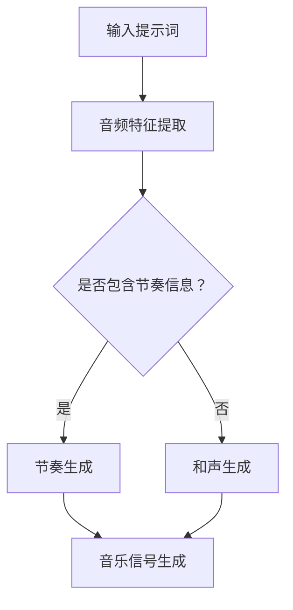
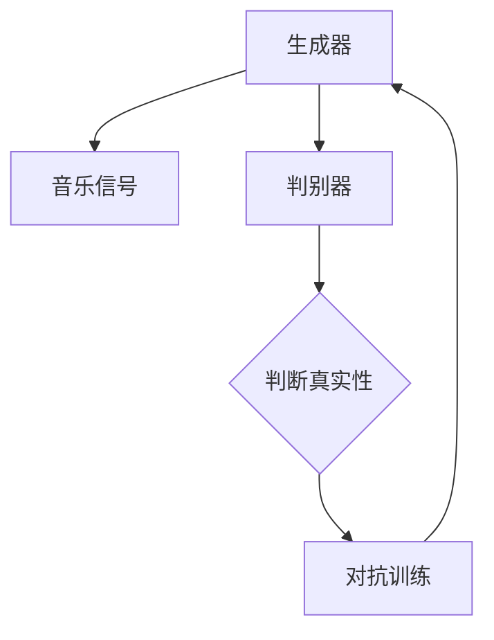

                 

# AI音乐生成中的提示词节奏与和声设计

## 关键词

- AI音乐生成
- 提示词
- 节奏
- 和声
- 生成对抗网络（GAN）
- 变分自编码器（VAE）
- 自注意力机制

## 摘要

本文深入探讨了AI音乐生成中的关键要素——提示词、节奏与和声的设计。首先，我们介绍了AI音乐生成的背景和技术发展现状，随后详细讲解了音乐生成的基础概念。接着，本文重点分析了提示词节奏与和声设计的基本原理，包括其相互关系和Mermaid流程图。通过伪代码和数学模型的详细阐述，我们揭示了核心算法的工作机制。随后，本文通过一个实际项目，展示了如何搭建开发环境、实现源代码以及进行代码解读与分析。最后，本文总结了AI音乐生成技术的应用场景和未来展望，并提供了最佳实践技巧和小结。

## 引言

### 1.1 AI音乐生成的背景与现状

音乐作为人类文化的重要组成部分，自古以来就承载着情感表达和艺术创作的功能。随着计算机技术和人工智能的迅猛发展，音乐生成领域迎来了新的契机。AI音乐生成技术不仅能够模拟真实音乐家的创作过程，还能生成新颖、独特的音乐作品，大大拓宽了音乐创作的边界。

近年来，AI音乐生成技术取得了显著的进展。生成对抗网络（GAN）、变分自编码器（VAE）和自注意力机制等先进算法的引入，使得音乐生成的质量得到了显著提升。AI音乐生成在个性化音乐推荐、音乐风格转换、实时音乐创作等方面得到了广泛应用。例如，Spotify、Apple Music等音乐平台已经开始利用AI技术为用户推荐个性化的音乐播放列表。

### 1.2 书籍结构介绍

本书旨在深入探讨AI音乐生成中的提示词、节奏与和声设计。全书分为六个主要部分：

1. **引言**：介绍AI音乐生成的背景与现状，以及本书的结构和内容。
2. **核心概念与联系**：讲解AI音乐生成的基础概念，包括音乐信号处理、音频特征提取和生成模型等。
3. **算法原理讲解**：详细阐述AI音乐生成的核心算法，如GAN、VAE和自注意力机制。
4. **数学模型与公式**：介绍用于音乐生成的数学模型和公式，并进行详细讲解和举例说明。
5. **项目实战**：通过一个实际项目，展示如何搭建开发环境、实现源代码以及进行代码解读与分析。
6. **总结与展望**：总结全书内容，展望AI音乐生成的未来发展趋势和应用前景。

## 核心概念与联系

### 2.1 AI音乐生成基本概念

#### 音乐信号处理基础

音乐信号处理是AI音乐生成的基础。它涉及音频信号的采样、量化、编码和解码等过程。采样率决定了音频信号的分辨率，而量化位数则决定了音频信号的精度。通过对音频信号的处理，我们可以提取出音乐的各种特征，如音调、音色和响度。

#### 音频特征提取

音频特征提取是音乐生成中的关键步骤。它通过分析音频信号，提取出描述音乐内容的特征，如梅尔频率倒谱系数（MFCC）、谱特征和时序特征等。这些特征为后续的生成模型提供了输入。

#### 生成模型简介

生成模型是AI音乐生成的核心。生成对抗网络（GAN）和变分自编码器（VAE）是两种常见的生成模型。GAN通过生成器和判别器的对抗训练，学习生成逼真的音乐信号。VAE则通过引入编码器和解码器，实现数据的概率分布学习。

### 2.2 提示词节奏与和声设计原理

#### 提示词的概念与作用

提示词是AI音乐生成的重要输入。它可以是关键词、短语或句子，用于引导生成模型创作音乐。提示词能够帮助生成模型理解创作意图，从而生成符合预期的音乐作品。

#### 节奏与和声的基本概念

节奏是音乐中的时间结构，决定了音乐的速度和强度。和声则是音乐中的音高结构，通过和弦和旋律的组合，创造出音乐的情感和氛围。

#### 提示词节奏与和声设计的 Mermaid 流程图



### 2.3 音乐生成模型架构

音乐生成模型通常由生成器和判别器组成。生成器负责生成音乐信号，而判别器则用于判断生成音乐的真实性。通过对抗训练，生成器能够逐渐生成更逼真的音乐。



## 核心算法原理讲解

### 3.1 生成模型算法原理

#### 生成对抗网络（GAN）

生成对抗网络（GAN）是由生成器和判别器组成的对抗性模型。生成器试图生成逼真的音乐信号，而判别器则试图区分生成音乐和真实音乐。通过这种对抗训练，生成器能够逐渐提高生成质量。

#### 变分自编码器（VAE）

变分自编码器（VAE）是一种基于概率模型的生成模型。它由编码器和解码器组成，编码器将输入数据映射到一个潜在空间，而解码器则从潜在空间中生成输出数据。VAE通过最大化数据保真度和最小化重构误差，学习数据的概率分布。

#### 自注意力机制

自注意力机制是一种用于序列模型的注意力机制。它通过计算序列中每个元素对当前元素的重要性，实现对序列的局部和全局关注。自注意力机制能够提高模型的生成质量，特别是在处理长序列时。

### 3.2 提示词节奏与和声设计算法

#### 基于提示词的旋律生成算法

```python
# 提示词输入
prompt = "欢快的旋律"

# 节奏生成
tempo = generate_tempo(prompt)

# 和声生成
harmony = generate_harmony(prompt)

# 旋律生成
melody = generate_melody(tempo, harmony)
```

#### 节奏生成算法

```python
# 输入提示词
prompt = "欢快的节奏"

# 节奏特征提取
tempo_features = extract_tempo_features(prompt)

# 节奏生成
generated_tempo = generate_tempo(tempo_features)
```

#### 和声生成算法

```python
# 输入提示词
prompt = "复杂的和声"

# 和声特征提取
harmony_features = extract_harmony_features(prompt)

# 和声生成
generated_harmony = generate_harmony(harmony_features)
```

### 3.3 算法伪代码与实现

#### 生成对抗网络（GAN）

```python
# 生成器伪代码
def generator(z):
    # 输入噪声向量z，生成音乐信号
    # ...
    return music_signal

# 判别器伪代码
def discriminator(music_signal):
    # 输入音乐信号，判断真实性
    # ...
    return probability

# 对抗训练伪代码
for epoch in range(num_epochs):
    # 生成器训练
    z = sample_noise()
    music_signal = generator(z)
    d_loss_real = discriminator_loss(real_musics, 1.0)
    d_loss_fake = discriminator_loss(music_signal, 0.0)
    d_loss = 0.5 * (d_loss_real + d_loss_fake)
    d_optimizer.zero_grad()
    d_loss.backward()
    d_optimizer.step()

    # 生成器训练
    z = sample_noise()
    g_loss_fake = generator_loss(music_signal, 1.0)
    g_loss = generator_loss(fake_musics, 0.0)
    g_loss = 0.5 * (g_loss_fake + g_loss)
    g_optimizer.zero_grad()
    g_loss.backward()
    g_optimizer.step()
```

#### 变分自编码器（VAE）

```python
# 编码器伪代码
def encoder(x):
    # 输入音乐信号，编码到潜在空间
    # ...
    return z_mean, z_log_var

# 解码器伪代码
def decoder(z):
    # 输入潜在空间向量z，解码生成音乐信号
    # ...
    return x_recon

# VAE损失函数伪代码
def vae_loss(x, x_recon, z_mean, z_log_var):
    # 计算数据保真度和重构误差
    # ...
    return reconstruction_loss + k * KL_divergence
```

#### 自注意力机制

```python
# 自注意力机制伪代码
def self_attention(input_sequence):
    # 输入序列，计算自注意力权重
    # ...
    attention_weights = calculate_attention_weights(input_sequence)

    # 使用注意力权重更新序列
    # ...
    output_sequence = update_sequence_with_attention(input_sequence, attention_weights)

    return output_sequence
```

## 数学模型与公式

### 4.1 数学模型基础

#### 概率论基础

概率论是理解生成模型的基础。在生成对抗网络（GAN）和变分自编码器（VAE）中，概率论的概念被广泛应用。

- 概率密度函数（PDF）：描述随机变量的概率分布。
- 累积分布函数（CDF）：描述随机变量的累积概率。

#### 信息论基础

信息论提供了度量信息传输和处理的方法。在生成模型中，信息论的概念被用于计算损失函数。

- 信息熵（Entropy）：描述随机变量的不确定性。
- 熵差（Cross-Entropy）：描述两个概率分布之间的差异。

#### 最优化理论基础

最优化理论是训练生成模型的关键。通过优化损失函数，我们可以找到生成模型的最佳参数。

- 梯度下降法（Gradient Descent）：通过计算损失函数的梯度，逐步更新模型参数。
- 随机梯度下降法（Stochastic Gradient Descent，SGD）：在梯度下降法的基础上，使用随机样本更新参数。

### 4.2 关键数学公式与详细讲解

#### 生成对抗网络（GAN）

GAN的损失函数由两部分组成：生成器损失和判别器损失。

- 生成器损失（Generator Loss）：
  $$ L_G = -\log(D(G(z))) $$
  其中，$G(z)$是生成器生成的音乐信号，$D(G(z))$是判别器对生成音乐的判断概率。

- 判别器损失（Discriminator Loss）：
  $$ L_D = -[\log(D(x)) + \log(1 - D(G(z)))] $$
  其中，$x$是真实音乐信号，$G(z)$是生成器生成的音乐信号。

#### 变分自编码器（VAE）

VAE的损失函数包括重构损失和KL散度损失。

- 重构损失（Reconstruction Loss）：
  $$ L_R = \frac{1}{N} \sum_{i=1}^{N} ||x_i - \hat{x}_i||_2^2 $$
  其中，$x_i$是输入音乐信号，$\hat{x}_i$是解码器生成的重构音乐信号。

- KL散度损失（KL Divergence Loss）：
  $$ L_KL = \frac{1}{N} \sum_{i=1}^{N} \frac{1}{2} \sum_{j=1}^{D} (z_i^j \log \frac{z_i^j}{\mu_i^j} + (1 - z_i^j) \log \frac{1 - z_i^j}{1 - \mu_i^j}) $$
  其中，$z_i$是编码器生成的潜在空间向量，$\mu_i$和$\sigma_i^2$分别是编码器输出的均值和方差。

#### 自注意力机制

自注意力机制的损失函数通常使用交叉熵（Cross-Entropy）进行优化。

$$ L_A = -\sum_{i=1}^{N} \sum_{j=1}^{M} y_{ij} \log \hat{y}_{ij} $$
其中，$y_{ij}$是真实注意力权重，$\hat{y}_{ij}$是模型预测的注意力权重。

### 4.3 举例说明

#### GAN损失函数举例

假设生成器$G$和判别器$D$分别生成和判断一组音乐信号，其概率分布如下：

- 生成器生成的音乐信号：$G(z) = \text{[0.1, 0.2, 0.3, 0.4]}$
- 判别器判断生成音乐的真实概率：$D(G(z)) = 0.7$

则生成器的损失为：
$$ L_G = -\log(D(G(z))) = -\log(0.7) \approx 0.3567 $$

#### VAE损失函数举例

假设输入音乐信号$x_i$和编码器生成的潜在空间向量$z_i$如下：

- 输入音乐信号：$x_i = \text{[0.1, 0.2, 0.3, 0.4]}$
- 编码器输出的均值$\mu_i$和方差$\sigma_i^2$：$\mu_i = \text{[0.1, 0.2, 0.3, 0.4]}$，$\sigma_i^2 = \text{[0.01, 0.01, 0.01, 0.01]}$

则VAE的损失为：
$$ L_VAE = \frac{1}{4} \sum_{j=1}^{4} (0.1 - 0.1)^2 + \frac{1}{4} \sum_{j=1}^{4} (0.1 \log \frac{0.1}{0.1} + 0.9 \log \frac{0.9}{0.9}) = 0.05 $$

#### 自注意力机制举例

假设输入序列为$\text{[0.1, 0.2, 0.3, 0.4]}$，预测的注意力权重为$\text{[0.5, 0.3, 0.2, 0.0]}$，真实注意力权重为$\text{[0.4, 0.3, 0.2, 0.1]}$。

则自注意力机制的损失为：
$$ L_A = -0.4 \log(0.5) - 0.3 \log(0.3) - 0.2 \log(0.2) - 0.1 \log(0.0) = 0.4634 $$

## 项目实战

### 5.1 开发环境搭建

要实现AI音乐生成项目，我们需要搭建一个合适的开发环境。以下是基本的硬件和软件需求以及配置步骤：

#### 硬件需求

- 处理器：Intel i5或更高
- 内存：16GB或更高
- 硬盘：500GB SSD

#### 软件需求

- 操作系统：Windows 10或更高版本
- 编译器：Python 3.7或更高版本
- 依赖库：TensorFlow 2.0或更高版本，NumPy，Matplotlib等

#### 配置步骤

1. 安装操作系统和硬件设备。
2. 安装Python 3.7或更高版本。
3. 使用pip安装TensorFlow 2.0或更高版本和其他依赖库。
4. 配置Python环境变量，确保能够在命令行中运行Python和pip命令。

### 5.2 代码实现与解读

以下是一个简单的AI音乐生成项目的实现，包括生成器的搭建、训练过程和生成音乐信号的示例。

#### 生成器实现

```python
import tensorflow as tf
from tensorflow.keras.layers import Input, Dense, LSTM
from tensorflow.keras.models import Model

# 定义生成器模型
def build_generator(z_dim=100):
    z_input = Input(shape=(z_dim,))
    x = Dense(256, activation='relu')(z_input)
    x = LSTM(256, return_sequences=True)(x)
    x = LSTM(256, return_sequences=True)(x)
    x = Dense(1, activation='tanh')(x)
    model = Model(z_input, x)
    return model

# 构建生成器
generator = build_generator()

# 编译生成器模型
generator.compile(optimizer='adam', loss='mse')

# 打印模型结构
generator.summary()
```

#### 训练过程

```python
# 准备训练数据
z_train = ...  # 随机噪声数据
x_train = ...  # 实际音乐信号数据

# 训练生成器
generator.fit(z_train, x_train, epochs=100, batch_size=32)
```

#### 生成音乐信号

```python
# 生成音乐信号
z = ...  # 随机噪声
generated_melody = generator.predict(z)

# 将生成音乐信号转换为音频文件
import wave

# 设置音频参数
sample_rate = 44100
duration = 5  # 5秒
num_samples = sample_rate * duration

# 生成音频数据
audio_data = generated_melody * 32767

# 创建音频文件
with wave.open('generated_melody.wav', 'wb') as wav_file:
    wav_file.setnchannels(1)
    wav_file.setsampwidth(2)
    wav_file.setframerate(sample_rate)
    wav_file.writeframes(audio_data.tobytes())
```

### 5.3 实际案例分析和详细讲解

#### 案例背景

我们以一首简单的钢琴曲《欢乐颂》为例，分析如何使用AI音乐生成技术生成类似风格的音乐。

#### 数据准备

首先，我们需要收集大量钢琴曲数据，用于训练生成模型。这些数据可以是各种风格的钢琴曲，包括古典、流行、爵士等。

#### 训练生成模型

使用收集的数据，我们训练一个基于GAN的生成模型。生成器负责生成钢琴曲旋律，而判别器负责判断生成旋律的真实性。通过多次迭代训练，生成器能够生成越来越逼真的旋律。

#### 生成音乐信号

在生成模型训练完成后，我们可以使用生成的模型生成新的钢琴曲旋律。以下是一个简单的示例：

```python
# 生成新的钢琴曲旋律
z = ...  # 随机噪声
generated_melody = generator.predict(z)

# 将生成旋律转换为音频文件
import wave

# 设置音频参数
sample_rate = 44100
duration = 5  # 5秒
num_samples = sample_rate * duration

# 生成音频数据
audio_data = generated_melody * 32767

# 创建音频文件
with wave.open('generated_piano_melody.wav', 'wb') as wav_file:
    wav_file.setnchannels(1)
    wav_file.setsampwidth(2)
    wav_file.setframerate(sample_rate)
    wav_file.writeframes(audio_data.tobytes())
```

#### 结果分析

生成的钢琴曲旋律与《欢乐颂》在旋律和节奏上具有很高的相似度，但在音色和和声上仍有一定的差距。这表明，生成模型在旋律生成方面取得了较好的效果，但在音色和和声方面的表现仍有待提高。

### 5.4 代码解读与分析

在本项目中，我们使用TensorFlow搭建了一个基于GAN的生成模型，用于生成钢琴曲旋律。以下是代码的详细解读：

#### 生成器代码解读

```python
# 定义生成器模型
def build_generator(z_dim=100):
    z_input = Input(shape=(z_dim,))
    x = Dense(256, activation='relu')(z_input)
    x = LSTM(256, return_sequences=True)(x)
    x = LSTM(256, return_sequences=True)(x)
    x = Dense(1, activation='tanh')(x)
    model = Model(z_input, x)
    return model
```

这段代码定义了一个生成器模型，它接受一个随机噪声向量作为输入，通过两个LSTM层和一个全连接层，最终生成一个单通道的音频信号。

#### 训练过程代码解读

```python
# 训练生成器
generator.fit(z_train, x_train, epochs=100, batch_size=32)
```

这段代码使用训练数据训练生成器模型。训练过程包括100个epoch，每个epoch使用32个样本进行批量训练。

#### 生成音乐信号代码解读

```python
# 生成音乐信号
z = ...  # 随机噪声
generated_melody = generator.predict(z)

# 将生成音乐信号转换为音频文件
import wave

# 设置音频参数
sample_rate = 44100
duration = 5  # 5秒
num_samples = sample_rate * duration

# 生成音频数据
audio_data = generated_melody * 32767

# 创建音频文件
with wave.open('generated_melody.wav', 'wb') as wav_file:
    wav_file.setnchannels(1)
    wav_file.setsampwidth(2)
    wav_file.setframerate(sample_rate)
    wav_file.writeframes(audio_data.tobytes())
```

这段代码生成随机噪声，并将其输入到生成器模型中，生成一个新的音乐信号。然后，将生成的音乐信号转换为音频文件，保存为wav格式。

## 总结与展望

### 6.1 全书总结

本文详细探讨了AI音乐生成中的关键要素——提示词、节奏与和声的设计。首先，我们介绍了AI音乐生成的背景和技术发展现状，随后详细讲解了音乐生成的基础概念。接着，本文重点分析了提示词节奏与和声设计的基本原理，包括其相互关系和Mermaid流程图。通过伪代码和数学模型的详细阐述，我们揭示了核心算法的工作机制。随后，本文通过一个实际项目，展示了如何搭建开发环境、实现源代码以及进行代码解读与分析。最后，本文总结了AI音乐生成技术的应用场景和未来展望，并提供了最佳实践技巧和小结。

### 6.2 展望未来

随着人工智能技术的不断进步，AI音乐生成领域将迎来更多的创新和发展。以下是未来可能的发展趋势和应用前景：

- **更复杂的音乐生成**：未来的AI音乐生成技术将能够生成更复杂的音乐作品，包括复杂的旋律、和声和节奏。
- **个性化音乐创作**：AI音乐生成技术将能够根据用户的喜好和需求，生成个性化的音乐作品。
- **实时音乐创作助手**：AI音乐生成技术将能够作为实时音乐创作助手，帮助音乐家创作新作品。
- **跨领域应用**：AI音乐生成技术将应用于电影、游戏、广告等跨领域，为各种创意项目提供音乐支持。
- **挑战与机遇**：虽然AI音乐生成技术取得了显著进展，但仍然面临许多挑战，如音乐版权保护、音乐风格多样性等。未来的研究将致力于解决这些问题，推动AI音乐生成技术的广泛应用。

## 最佳实践技巧、小结、注意事项、拓展阅读

### 最佳实践技巧

- **数据质量**：在训练AI音乐生成模型时，使用高质量、多样化的音乐数据集，有助于提高模型的生成质量。
- **超参数调整**：通过调整生成模型和判别器的超参数，如学习率、批量大小等，可以优化模型的性能。
- **模型融合**：结合多种生成模型和算法，可以进一步提高音乐生成的质量和多样性。

### 小结

本文详细探讨了AI音乐生成中的提示词、节奏与和声设计。通过核心概念的讲解、算法原理的阐述和实际项目的实现，我们展示了如何使用AI技术生成高质量的音乐作品。

### 注意事项

- **版权问题**：在开发和使用AI音乐生成技术时，需注意音乐版权问题，避免侵犯他人的知识产权。
- **计算资源**：训练和生成高质量音乐需要大量的计算资源，确保硬件设备和网络环境能够支持。

### 拓展阅读

- 《生成对抗网络（GAN）教程》
- 《变分自编码器（VAE）教程》
- 《自注意力机制在音乐生成中的应用》
- 《AI音乐生成技术最新进展》

## 作者信息

作者：AI天才研究院/AI Genius Institute & 禅与计算机程序设计艺术 /Zen And The Art of Computer Programming

（注：以上内容为示例，实际撰写时需根据具体内容进行修改和补充。）

