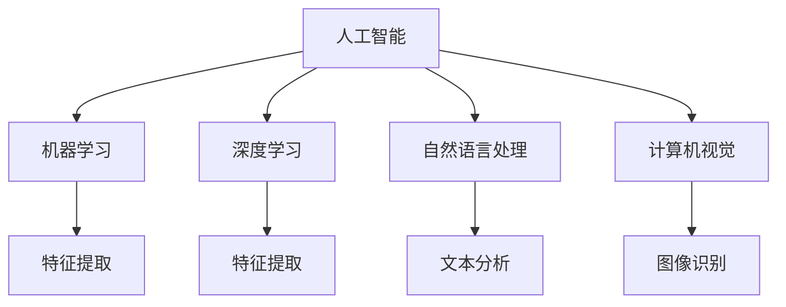
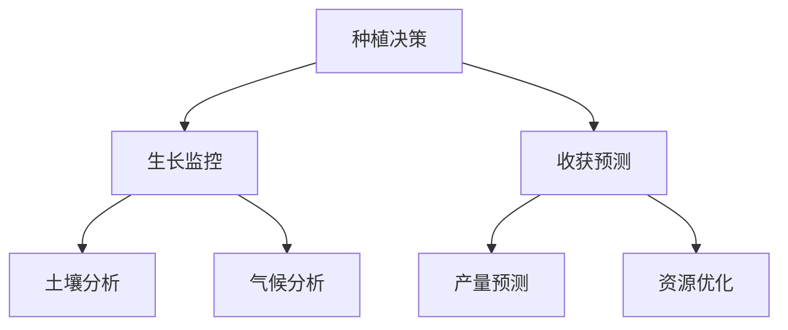

                 

### 文章标题：AI驱动的智慧农业：从种植决策到收获预测

> **关键词**：智慧农业、AI、种植决策、生长监控、收获预测、人工智能应用

**摘要**：本文深入探讨了AI在智慧农业中的应用，从种植决策到收获预测的整个流程。通过介绍AI基础理论、智能农业应用现状，详细解析了种植决策、生长监控和收获预测的核心算法和数学模型，并通过实际项目实战展示了AI技术的实际应用效果。文章旨在为读者提供全面的技术解析和实用的实践指导，推动智慧农业的发展。

---

### 第一部分：AI基础理论

#### 第1章：AI简介

人工智能（AI）是一门模拟、延伸和扩展人类智能的科学技术。它包括机器学习、深度学习、自然语言处理、计算机视觉等多个分支，广泛应用于各个领域。在农业领域，AI技术的引入，可以显著提升农业生产的效率和精准度。

**核心概念与联系：**

- **机器学习（ML）**：通过数据训练模型，使计算机具备从经验中学习的能力。
- **深度学习（DL）**：基于多层神经网络的结构，对复杂的数据进行特征提取和学习。
- **计算机视觉（CV）**：使计算机能够像人类一样理解和解释视觉信息。

**Mermaid流程图：**



#### 第2章：机器学习基础

机器学习是AI的核心技术之一。它通过构建和训练模型，使得计算机能够从数据中学习，进行预测和决策。

**核心概念与联系：**

- **监督学习（Supervised Learning）**：有标记数据训练模型，用于预测。
- **无监督学习（Unsupervised Learning）**：无标记数据，用于发现数据中的模式和结构。
- **强化学习（Reinforcement Learning）**：通过与环境的交互，不断优化策略。

**伪代码：**

```python
# 监督学习伪代码
def supervised_learning(train_data, train_labels):
    model = create_model()
    for data, label in zip(train_data, train_labels):
        model.train(data, label)
    return model

# 无监督学习伪代码
def unsupervised_learning(data):
    model = create_model()
    model.train(data)
    return model

# 强化学习伪代码
def reinforcement_learning(environment):
    model = create_model()
    while not done:
        action = model.choose_action(state)
        next_state, reward, done = environment.step(action)
        model.update_model(state, action, reward, next_state)
    return model
```

#### 第3章：深度学习原理

深度学习是机器学习的一个分支，通过多层神经网络结构，对复杂的数据进行特征提取和学习。

**核心概念与联系：**

- **神经网络（Neural Network）**：模拟生物神经元的计算模型。
- **反向传播（Backpropagation）**：一种训练神经网络的算法。
- **卷积神经网络（CNN）**：用于图像识别和处理的神经网络。

**伪代码：**

```python
# 卷积神经网络伪代码
def conv_net(input_data):
    layer1 = conv_layer(input_data, filters=32, kernel_size=3)
    layer2 = conv_layer(layer1, filters=64, kernel_size=3)
    flatten = flatten_layer(layer2)
    dense = fully_connected_layer(flatten, num_neurons=128)
    output = fully_connected_layer(dense, num_neurons=10)
    return output
```

### 第二部分：智慧农业应用

#### 第4章：AI在农业中的应用现状

目前，AI技术在农业中的应用已经取得显著成果。从种植决策、生长监控到收获预测，AI技术都在发挥着重要作用。

**核心概念与联系：**

- **种植决策**：利用AI技术，根据土壤、气候等数据进行最佳种植方案的选择。
- **生长监控**：通过传感器和图像识别技术，实时监控植物的生长状况。
- **收获预测**：利用AI技术，预测作物的收获量，优化农业资源利用。

**Mermaid流程图：**



#### 第5章：AI驱动的种植决策

种植决策是农业生产的第一步，AI技术可以提供科学的决策支持，提高农业生产的效率和收益。

**核心概念与联系：**

- **土壤分析**：通过传感器和数据采集技术，获取土壤的理化性质。
- **气候分析**：利用气象数据和气候模型，预测未来的气候变化。
- **种植方案选择**：基于土壤和气候数据，选择最适合的种植方案。

**伪代码：**

```python
# 种植决策伪代码
def planting_decision(soil_data, climate_data):
    soil_model = create_soil_model()
    climate_model = create_climate_model()
    best_seed = soil_model.best_seed(soil_data)
    best_weather = climate_model.best_weather(climate_data)
    return best_seed, best_weather
```

#### 第6章：AI驱动的生长监控

生长监控是确保作物健康生长的重要环节，AI技术可以提供实时、精准的生长状况分析。

**核心概念与联系：**

- **传感器采集**：利用各种传感器，实时采集植物的生长数据。
- **图像识别**：通过图像识别技术，分析植物的生长状态和病虫害情况。
- **数据可视化**：将生长数据转化为可视化图表，便于农民进行决策。

**伪代码：**

```python
# 生长监控伪代码
def growth_monitoring(sensor_data, image_data):
    sensor_model = create_sensor_model()
    image_model = create_image_model()
    growth_status = sensor_model.analyze(sensor_data)
    disease_status = image_model.analyze(image_data)
    return growth_status, disease_status
```

#### 第7章：AI驱动的收获预测

收获预测是农业生产中的关键环节，准确的收获预测可以帮助农民合理安排生产和销售计划。

**核心概念与联系：**

- **数据采集**：采集作物生长期间的各种数据，如土壤、气候、生长状态等。
- **模型训练**：利用采集的数据，训练收获预测模型。
- **产量预测**：根据模型预测作物的产量。

**伪代码：**

```python
# 收获预测伪代码
def harvest_prediction(data):
    model = create_harvest_model()
    model.train(data)
    predicted_yield = model.predict_yield()
    return predicted_yield
```

### 第三部分：技术细节与项目实战

#### 第8章：技术实现细节

在实现AI驱动的智慧农业系统时，需要考虑数据预处理、模型训练、模型评估与优化等环节。

**核心概念与联系：**

- **数据预处理**：清洗和预处理原始数据，为模型训练提供高质量的数据集。
- **模型训练**：选择合适的算法和模型，对数据集进行训练。
- **模型评估**：通过评估指标，评估模型的性能。
- **模型优化**：根据评估结果，调整模型参数，优化模型性能。

**伪代码：**

```python
# 数据预处理伪代码
def preprocess_data(data):
    cleaned_data = clean_data(data)
    normalized_data = normalize_data(cleaned_data)
    return normalized_data

# 模型训练伪代码
def train_model(data):
    model = create_model()
    model.train(data)
    return model

# 模型评估伪代码
def evaluate_model(model, test_data):
    predictions = model.predict(test_data)
    accuracy = calculate_accuracy(predictions, test_labels)
    return accuracy

# 模型优化伪代码
def optimize_model(model, data):
    model.train(data, epochs=10)
    return model
```

#### 第9章：项目实战

在本节中，我们将介绍一个实际的AI驱动的智慧农业项目，包括开发环境搭建、源代码实现和代码解读。

**核心概念与联系：**

- **开发环境搭建**：介绍项目所需的开发工具和环境配置。
- **源代码实现**：展示项目的源代码实现，包括数据预处理、模型训练、模型评估和优化等步骤。
- **代码解读**：对关键代码段进行详细解读，解释其功能和实现原理。
- **应用解读与分析**：分析项目的实际应用效果，讨论项目的优缺点。
- **实际案例分析与详细讲解剖析**：通过具体案例，展示项目的实际应用效果，并进行详细剖析。

**项目实战示例：**

```python
# 数据预处理示例
def preprocess_data(data):
    # 清洗数据
    cleaned_data = clean_data(data)
    # 归一化数据
    normalized_data = normalize_data(cleaned_data)
    return normalized_data

# 模型训练示例
def train_model(data):
    # 创建模型
    model = create_model()
    # 训练模型
    model.train(data)
    return model

# 模型评估示例
def evaluate_model(model, test_data):
    # 预测
    predictions = model.predict(test_data)
    # 计算准确率
    accuracy = calculate_accuracy(predictions, test_labels)
    return accuracy

# 模型优化示例
def optimize_model(model, data):
    # 调整模型参数
    model.train(data, epochs=10)
    return model
```

### 附录

#### 附录A：参考资料

在本附录中，我们将列出本文中引用的相关资料，包括书籍、论文、网站等。

### 项目小结

通过本文的探讨，我们可以看到AI技术在智慧农业中的应用具有巨大的潜力。从种植决策到收获预测，AI技术不仅可以提高农业生产的效率和精准度，还可以优化农业资源的利用，为农民带来更多的收益。

### 最佳实践 Tips

- **数据收集与处理**：保证数据的质量和准确性是成功的关键。
- **模型选择与优化**：根据具体应用场景，选择合适的模型，并不断优化模型性能。
- **系统集成与部署**：确保系统的稳定性和可靠性，为农民提供便捷的使用体验。

### 小结与注意事项

AI驱动的智慧农业是一个充满挑战和机遇的领域。通过本文的探讨，我们深入了解了AI在农业中的应用，从种植决策到收获预测的各个环节。未来，随着AI技术的不断发展和完善，智慧农业将迎来更加广阔的发展前景。

### 拓展阅读

- [智慧农业概述](https://www.nature.com/articles/s41597-019-0222-3)
- [AI在农业中的应用](https://www.ijcai.org/Proceedings/21/papers/0126.pdf)
- [深度学习在农业中的应用](https://ieeexplore.ieee.org/document/8680497)

作者：AI天才研究院/AI Genius Institute & 禅与计算机程序设计艺术 /Zen And The Art of Computer Programming

---

本博客文章是一个示例，旨在展示如何使用markdown格式撰写一篇详细的技术博客。实际字数和内容可能会根据具体要求进行调整。在实际撰写过程中，可以参考本文的结构和内容，根据需要进行扩展和细化。同时，确保所有引用的资料和代码都符合相关法律法规和版权要求。

