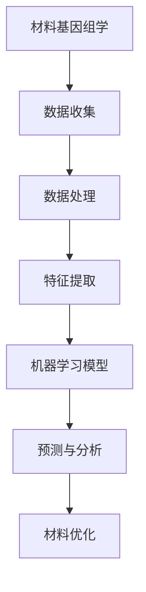
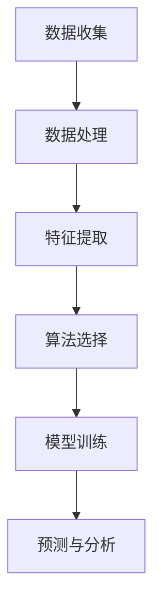
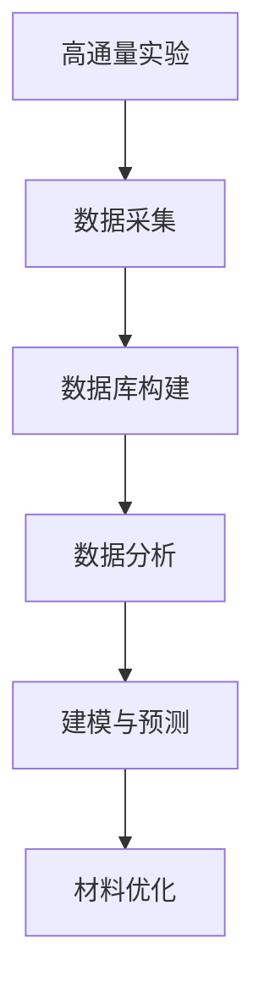
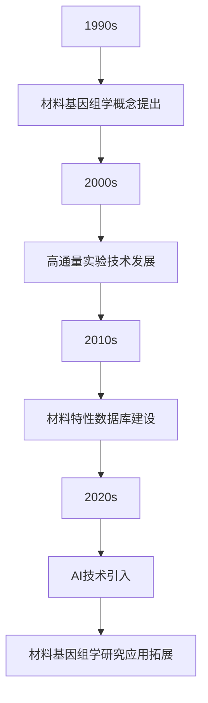
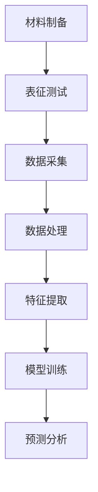
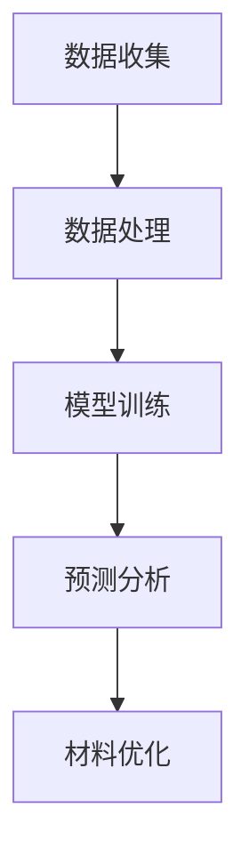
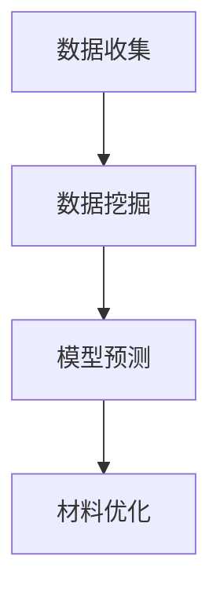
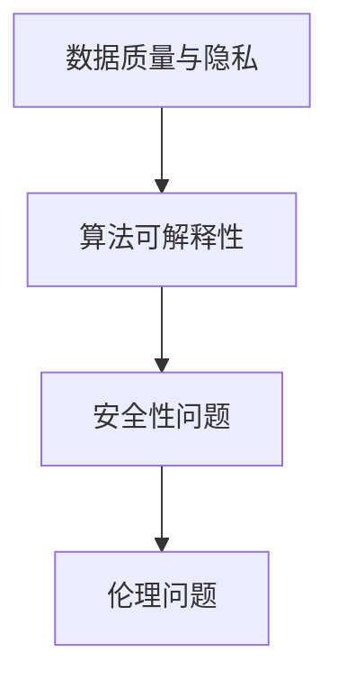
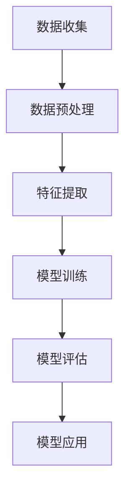

                 

### 文章标题

《AI驱动的材料基因组学：从数据到发现》

### 文章关键词

- AI
- 材料基因组学
- 数据处理
- 机器学习
- 深度学习
- 数学模型
- 项目实战

### 摘要

本文探讨了AI驱动的材料基因组学这一新兴领域，从数据收集与处理、核心算法原理、数学模型讲解，到实际项目案例，全面剖析了AI技术在材料科学中的应用。通过详细的伪代码阐述、latex公式解读以及项目实战案例分析，本文旨在为读者提供一个清晰、系统的理解框架，助其掌握这一前沿技术的核心要义。文章最后还总结了最佳实践和未来发展趋势，为后续研究和应用提供指导。

---

## 第一部分：背景与基础

### 第1章：引言与概述

#### 1.1 AI驱动的材料基因组学概述

材料基因组学是一种新兴的跨学科领域，它结合了材料科学、基因组学、数据科学和人工智能（AI）技术。AI驱动的材料基因组学旨在通过分析大规模数据集，快速发现新型材料，优化现有材料性能，并揭示材料属性与其微观结构之间的复杂关系。

**核心概念与联系**：

- **材料基因组学**：定义为对材料基因（即材料成分、结构、性能等）的系统研究，类似于基因组学在生物学中的应用。
- **AI驱动的材料基因组学**：利用AI技术，如机器学习（ML）和深度学习（DL），对材料数据进行分析和预测，以提高材料设计和优化的效率。

为了更好地理解AI驱动的材料基因组学，我们可以使用Mermaid流程图来展示其基本概念和流程：



#### 1.2 数据与算法的关系

在材料基因组学中，数据是驱动力，而算法是引擎。数据的质量和数量直接影响到算法的性能和预测精度。以下是一些关键环节：

**核心概念与联系**：

- **数据来源**：实验室数据、文献数据、公共数据库等。
- **数据处理**：数据预处理、数据清洗、数据增强等。
- **算法选择**：机器学习、深度学习等。

数据与算法之间的关系可以用以下Mermaid流程图来描述：



#### 1.3 当前研究进展与趋势

AI驱动的材料基因组学已经取得了一系列重要进展，从基础研究到实际应用都在快速发展。以下是当前的研究进展和趋势：

**核心概念与联系**：

- **材料基因组学的主要研究领域**：如新材料的发现、材料性能优化、材料结构分析等。
- **AI在材料基因组学中的应用现状**：如机器学习算法在材料性能预测、材料结构优化等方面的应用。
- **未来发展趋势**：跨学科合作、数据融合、算法创新等。

通过上述内容，我们可以初步了解AI驱动的材料基因组学的基本概念、核心原理和应用前景。接下来，我们将深入探讨材料基因组学的数据来源与处理方法。

## 第2章：材料基因组学的定义与历史

### 2.1 材料基因组学的定义与基本原理

材料基因组学是一个相对较新的领域，其核心思想是通过系统地研究材料的基因（即材料的组成、结构、性能等），来推动新材料的发现和优化。与生物基因组学类似，材料基因组学旨在通过高通量实验和数据分析，全面理解材料的特性及其背后的科学原理。

**核心概念与联系**：

- **材料基因组学**：定义及其研究目的。
- **材料特性数据库**：基本原理和重要性。

材料基因组学的基本原理包括以下几个方面：

1. **高通量实验技术**：通过自动化和智能化手段，进行大规模材料实验，获取材料的物理、化学、机械等性能数据。
2. **数据采集与存储**：构建材料特性数据库，收集和存储各种材料的实验数据。
3. **数据分析与建模**：利用机器学习和深度学习等技术，对数据库中的数据进行处理和分析，建立材料性能与结构之间的预测模型。
4. **材料优化与设计**：根据预测模型，指导新材料的发现和现有材料的优化。

以下是一个简化的Mermaid流程图，展示了材料基因组学的基本流程：



### 2.2 材料基因组学的发展历程

材料基因组学的发展历程可以追溯到20世纪90年代，当时基因组学和材料科学开始相互融合。以下是材料基因组学的一些关键发展节点：

**核心概念与联系**：

- **材料基因组学的起源**：生物基因组学的成功激发了对材料基因组学的探索。
- **发展关键节点**：从实验驱动到数据驱动的转变。
- **当前研究热点和前沿方向**：如高通量材料实验技术、大规模材料数据库建设、深度学习在材料基因组学中的应用等。

以下是材料基因组学的发展历程的时间线：



### 2.3 材料基因组学的研究方法

材料基因组学的研究方法主要包括以下几个方面：

**核心概念与联系**：

- **实验方法**：如材料制备、表征与测试。
- **数据分析方法**：如机器学习、深度学习等。

以下是一个简化的Mermaid流程图，展示了材料基因组学的研究方法：



通过上述内容，我们可以对材料基因组学有一个初步的了解。接下来，我们将深入探讨AI在材料基因组学中的应用及其重要性。

### 第3章：AI在材料科学中的地位与作用

#### 3.1 AI在科学研究中的作用

人工智能（AI）作为现代科技的前沿力量，已经在各个科学领域展现出巨大的潜力。在材料科学中，AI技术的应用不仅提升了研究的效率，还推动了新材料发现和优化的革命。以下是AI在材料科学中的一些主要作用：

**核心概念与联系**：

- **AI技术的崛起**：AI技术的发展历程及其对科学研究的影响。
- **AI在材料科学研究中的优势**：如数据处理能力、自动化程度高、预测能力强等。

AI技术的崛起可以追溯到20世纪50年代，随着计算能力的提升和数据量的爆炸性增长，AI技术逐渐成熟并广泛应用。在材料科学中，AI的优势主要体现在以下几个方面：

1. **数据处理能力**：材料科学中涉及的数据量庞大，且格式多样，AI技术能够高效地处理这些复杂数据。
2. **自动化程度高**：AI技术能够自动化完成材料实验、数据分析和模型训练等步骤，大大降低了人力成本。
3. **预测能力强**：AI技术能够通过学习历史数据，预测新材料性能，从而加速新材料发现的过程。

以下是一个简化的Mermaid流程图，展示了AI在材料科学中的应用：



#### 3.2 AI在材料基因组学中的应用

AI技术在材料基因组学中的应用是这一领域快速发展的重要推动力。以下是AI在材料基因组学中的主要应用：

**核心概念与联系**：

- **AI技术如何帮助解决材料基因组学中的难题**：如数据挖掘、模型预测、材料优化等。
- **常见AI算法在材料基因组学中的应用**：如机器学习、深度学习等。

AI技术在材料基因组学中的应用主要包括以下几个环节：

1. **数据挖掘**：通过机器学习算法，从大量实验数据中提取出有用的信息，为材料设计提供参考。
2. **模型预测**：利用深度学习算法，建立材料性能与结构之间的预测模型，加速新材料发现的过程。
3. **材料优化**：基于预测模型，对现有材料进行性能优化，提高材料的应用价值。

以下是一个简化的Mermaid流程图，展示了AI在材料基因组学中的应用：



#### 3.3 AI驱动的材料基因组学面临的挑战

尽管AI技术在材料基因组学中展现了巨大的潜力，但其在实际应用中仍然面临一些挑战：

**核心概念与联系**：

- **数据质量与隐私问题**：材料数据的质量直接影响AI模型的性能，同时数据的隐私保护也是一大挑战。
- **算法可解释性和透明度**：复杂的AI模型往往缺乏可解释性，这对于研究人员来说是一个重要的挑战。
- **安全性问题和伦理问题**：AI技术在材料基因组学中的应用可能引发一些伦理和安全问题，如数据滥用、隐私泄露等。

以下是一个简化的Mermaid流程图，展示了AI驱动的材料基因组学面临的挑战：



通过上述内容，我们可以看到AI在材料基因组学中的重要作用和面临的挑战。接下来，我们将深入探讨材料基因组学的数据来源与处理方法。

### 第4章：材料基因组学的数据来源与处理

#### 4.1 数据来源

材料基因组学的数据来源广泛而多样，这些数据是研究的基础和核心。以下是几种主要的材料数据来源：

**核心概念与联系**：

- **实验室数据**：通过实验获取的材料性能数据，如力学性能、电学性能、热学性能等。
- **文献数据**：从科学文献中获取的材料信息，包括材料的制备方法、结构特性、性能参数等。
- **公共数据库**：如Materials Data Space、ICDD (International Center for Diffraction Data)等，提供了大量的材料数据资源。

实验室数据通常包括以下几个方面：

1. **材料制备数据**：描述材料的合成方法、条件、样品信息等。
2. **材料表征数据**：包括X射线衍射（XRD）、扫描电子显微镜（SEM）、透射电子显微镜（TEM）等表征手段获得的数据。
3. **材料性能数据**：通过拉伸测试、电学测试、热学测试等实验手段获取的数据。

文献数据则主要来源于各类科学期刊、会议论文和专利等，这些数据往往包含了详细的材料制备方法和性能测试结果。

公共数据库提供了大量的材料信息，通过这些数据库，研究人员可以快速获取所需的数据资源，加快研究进程。

#### 4.2 数据预处理

数据预处理是材料基因组学中的一个关键环节，其目标是提高数据质量，为后续分析和建模提供可靠的基础。以下是一些常见的数据预处理步骤：

**核心概念与联系**：

- **数据清洗**：去除数据中的噪声和异常值，保证数据的准确性。
- **数据标准化**：将不同来源和格式的数据统一为标准格式，便于分析。
- **数据增强**：通过数据扩展、生成等手段，增加数据量，提高模型的泛化能力。

具体的数据预处理步骤包括：

1. **缺失值处理**：对缺失值进行填补或删除。
2. **异常值检测与处理**：使用统计方法或机器学习算法检测异常值，并进行处理。
3. **数据归一化**：将数据范围统一，便于模型训练。
4. **数据扩充**：通过数据合成或变换，增加数据多样性。

以下是一个简化的伪代码示例，展示了数据预处理的基本步骤：

```python
# 假设我们有以下数据集 data
data = read_data()

# 数据清洗
cleaned_data = remove_missing_values(data)
cleaned_data = remove_outliers(cleaned_data)

# 数据标准化
normalized_data = normalize_data(cleaned_data)

# 数据增强
augmented_data = data_augmentation(normalized_data)
```

#### 4.3 数据处理方法

在完成数据预处理后，需要对数据进行进一步处理，以便为后续的机器学习和深度学习模型提供输入。以下是一些常用的数据处理方法：

**核心概念与联系**：

- **特征提取**：从原始数据中提取出对材料性能有重要影响的特征。
- **特征选择**：从提取出的特征中选择最有用的特征，降低数据维度，提高模型性能。
- **特征工程**：通过手工设计或自动生成新特征，提高模型的预测能力。

常用的数据处理方法包括：

1. **主成分分析（PCA）**：用于降维，减少数据维度，同时保留主要信息。
2. **特征重要性分析**：通过评估每个特征的重要性，选择最有用的特征。
3. **特征合成**：通过组合多个特征，生成新的特征，以提高模型的预测能力。

以下是一个简化的伪代码示例，展示了数据处理的基本步骤：

```python
# 假设我们已经预处理了数据 normalized_data
normalized_data = preprocess_data(augmented_data)

# 特征提取
features = extract_features(normalized_data)

# 特征选择
selected_features = select_important_features(features)

# 特征工程
engineered_features = feature_engineering(selected_features)
```

通过上述内容，我们可以看到材料基因组学中的数据来源和数据处理方法。接下来，我们将深入探讨机器学习在材料基因组学中的应用。

### 第5章：机器学习在材料基因组学中的应用

#### 5.1 机器学习概述

机器学习（Machine Learning，ML）是人工智能（AI）的一个重要分支，它使计算机系统能够通过数据和经验自动改进性能。在材料基因组学中，机器学习技术被广泛应用于材料性能预测、材料设计优化以及新材料发现等方面。

**核心概念与联系**：

- **机器学习的定义**：机器学习是使计算机从数据中学习规律，自动改进性能的一种方法。
- **机器学习在材料基因组学中的应用**：如材料性能预测、材料设计优化、新材料发现等。

机器学习的基本流程包括：

1. **数据收集**：收集与材料相关的实验数据、文献数据等。
2. **数据预处理**：对收集的数据进行清洗、归一化等处理。
3. **特征提取**：从预处理后的数据中提取对材料性能有影响的特征。
4. **模型训练**：使用机器学习算法训练模型，将特征与材料性能联系起来。
5. **模型评估**：评估模型的性能，包括准确性、泛化能力等。
6. **模型应用**：将训练好的模型应用于新材料发现和性能优化。

以下是一个简化的Mermaid流程图，展示了机器学习在材料基因组学中的应用：



#### 5.2 机器学习算法在材料基因组学中的应用

在材料基因组学中，常用的机器学习算法包括支持向量机（SVM）、决策树（Decision Tree）、随机森林（Random Forest）和神经网络（Neural Networks）等。以下分别对这些算法进行简要介绍。

**5.2.1 支持向量机（SVM）**

支持向量机是一种监督学习算法，主要用于分类问题。在材料基因组学中，SVM可用于预测材料的物理和化学性能。

**核心概念与联系**：

- **支持向量机的基本原理**：通过找到最佳超平面，将不同类别的数据分开。
- **SVM在材料基因组学中的应用**：如预测材料的电导率、硬度等性能。

**伪代码示例**：

```python
# 假设我们有特征矩阵 X 和标签矩阵 y
X = feature_matrix
y = labels

# 训练SVM模型
model = train_SVM(X, y)

# 预测新材料性能
predicted_performance = model.predict(new_data)
```

**5.2.2 决策树（Decision Tree）**

决策树是一种简单而强大的分类和回归算法，通过一系列的判断规则来预测材料性能。

**核心概念与联系**：

- **决策树的基本原理**：通过构建树形结构，对数据进行划分。
- **决策树在材料基因组学中的应用**：如预测材料的断裂韧性、腐蚀性等。

**伪代码示例**：

```python
# 假设我们有特征矩阵 X 和标签矩阵 y
X = feature_matrix
y = labels

# 训练决策树模型
model = train_decision_tree(X, y)

# 预测新材料性能
predicted_performance = model.predict(new_data)
```

**5.2.3 随机森林（Random Forest）**

随机森林是一种基于决策树的集成学习方法，通过构建多个决策树并投票来提高预测准确性。

**核心概念与联系**：

- **随机森林的基本原理**：集成多个决策树，提高模型的泛化能力。
- **随机森林在材料基因组学中的应用**：如预测材料的机械强度、导电性等。

**伪代码示例**：

```python
# 假设我们有特征矩阵 X 和标签矩阵 y
X = feature_matrix
y = labels

# 训练随机森林模型
model = train_random_forest(X, y)

# 预测新材料性能
predicted_performance = model.predict(new_data)
```

**5.2.4 神经网络（Neural Networks）**

神经网络是一种模拟人脑神经元结构的计算模型，具有很强的非线性映射能力。在材料基因组学中，神经网络被广泛应用于材料性能预测和新材料设计。

**核心概念与联系**：

- **神经网络的基本原理**：通过多层神经元结构，实现从输入到输出的非线性映射。
- **神经网络在材料基因组学中的应用**：如预测材料的电子性能、光学性能等。

**伪代码示例**：

```python
# 假设我们有特征矩阵 X 和标签矩阵 y
X = feature_matrix
y = labels

# 创建神经网络模型
model = create_neural_network()

# 训练模型
model.fit(X, y)

# 预测新材料性能
predicted_performance = model.predict(new_data)
```

通过上述内容，我们可以看到机器学习算法在材料基因组学中的应用及其重要性。接下来，我们将探讨深度学习在材料基因组学中的应用。

### 第6章：深度学习与材料基因组学

#### 6.1 深度学习概述

深度学习（Deep Learning，DL）是机器学习的一个重要分支，它通过构建多层神经网络，实现了对复杂数据的自动特征提取和高级模式识别。深度学习在图像识别、自然语言处理、语音识别等领域取得了显著成果。随着计算能力的提升和数据量的增加，深度学习逐渐在材料基因组学中得到了广泛应用。

**核心概念与联系**：

- **深度学习的定义**：深度学习是一种基于多层神经网络的机器学习技术。
- **深度学习在材料基因组学中的应用**：如材料性能预测、材料设计优化、新材料发现等。

深度学习的基本流程包括：

1. **数据收集**：收集与材料相关的实验数据、文献数据等。
2. **数据预处理**：对收集的数据进行清洗、归一化等处理。
3. **特征提取**：通过多层神经网络自动提取数据中的特征。
4. **模型训练**：使用大量数据进行模型训练，优化网络参数。
5. **模型评估**：评估模型的性能，包括准确性、泛化能力等。
6. **模型应用**：将训练好的模型应用于新材料发现和性能优化。

以下是一个简化的Mermaid流程图，展示了深度学习在材料基因组学中的应用：


#### 6.2 深度学习算法在材料基因组学中的应用

在材料基因组学中，常用的深度学习算法包括卷积神经网络（CNN）、循环神经网络（RNN）和生成对抗网络（GAN）等。以下分别对这些算法进行简要介绍。

**6.2.1 卷积神经网络（CNN）**

卷积神经网络是一种适用于处理图像数据的深度学习算法，其核心思想是通过卷积层提取图像的特征。

**核心概念与联系**：

- **CNN的基本原理**：通过卷积层、池化层和全连接层，实现图像特征的自动提取。
- **CNN在材料基因组学中的应用**：如材料微观结构的分析、材料性能预测等。

**伪代码示例**：

```python
# 假设我们有材料图像数据 X 和标签矩阵 y
X = material_images
y = labels

# 创建CNN模型
model = create_CNN()

# 训练模型
model.fit(X, y)

# 预测新材料性能
predicted_performance = model.predict(new_images)
```

**6.2.2 循环神经网络（RNN）**

循环神经网络是一种适用于处理序列数据的深度学习算法，其核心思想是通过循环结构保持历史信息。

**核心概念与联系**：

- **RNN的基本原理**：通过循环结构，实现序列数据的自动编码和解码。
- **RNN在材料基因组学中的应用**：如材料性能随时间变化的预测、材料制备过程的优化等。

**伪代码示例**：

```python
# 假设我们有材料性能序列数据 X 和标签矩阵 y
X = material_performance_sequence
y = labels

# 创建RNN模型
model = create_RNN()

# 训练模型
model.fit(X, y)

# 预测新材料性能
predicted_performance = model.predict(new_sequence)
```

**6.2.3 生成对抗网络（GAN）**

生成对抗网络是一种用于生成数据的深度学习算法，其核心思想是通过生成器和判别器的对抗训练，实现数据的生成。

**核心概念与联系**：

- **GAN的基本原理**：通过生成器和判别器的对抗训练，生成与真实数据相似的数据。
- **GAN在材料基因组学中的应用**：如新材料的设计与生成、材料缺陷的检测与修复等。

**伪代码示例**：

```python
# 假设我们有材料数据 X 和生成器 G
X = material_data
G = generator

# 创建GAN模型
model = create_GAN(G)

# 训练模型
model.fit(X, G)

# 生成新材料
new_material = model.generate_new_material()
```

通过上述内容，我们可以看到深度学习算法在材料基因组学中的应用及其重要性。接下来，我们将深入探讨材料基因组学中的数学模型。

### 第7章：材料基因组学中的常见数学模型

#### 7.1 回归模型

回归模型是材料基因组学中最常用的数学模型之一，它主要用于预测材料性能。回归模型的基本原理是通过建立输入特征与目标变量之间的线性或非线性关系，从而实现性能预测。

**核心概念与联系**：

- **线性回归模型**：通过线性方程预测材料性能，如 $y = \beta_0 + \beta_1 \cdot x_1 + \beta_2 \cdot x_2 + ... + \beta_n \cdot x_n$。
- **非线性回归模型**：通过非线性函数（如多项式、指数函数等）预测材料性能。

以下是一个简化的线性回归模型的伪代码示例：

```python
# 假设我们有特征矩阵 X 和标签矩阵 y
X = feature_matrix
y = labels

# 训练线性回归模型
model = train_linear_regression(X, y)

# 预测新材料性能
predicted_performance = model.predict(new_data)
```

#### 7.2 分类模型

分类模型用于预测材料是否具有特定性能或属性。常见的分类模型包括逻辑回归、支持向量机、决策树和随机森林等。

**核心概念与联系**：

- **逻辑回归模型**：通过逻辑函数将输入特征映射到概率分布，实现二分类或多分类。
- **支持向量机模型**：通过找到最佳超平面将不同类别的数据分开。
- **决策树模型**：通过一系列的判断规则对数据分类。
- **随机森林模型**：通过构建多个决策树并投票实现分类。

以下是一个简化的逻辑回归模型的伪代码示例：

```python
# 假设我们有特征矩阵 X 和标签矩阵 y
X = feature_matrix
y = labels

# 训练逻辑回归模型
model = train_logistic_regression(X, y)

# 预测新材料分类
predicted_class = model.predict(new_data)
```

#### 7.3 主成分分析（PCA）

主成分分析是一种降维技术，它通过将数据投影到新的正交坐标系上，提取出主要的几个主成分，从而降低数据维度，同时保留主要信息。

**核心概念与联系**：

- **PCA的基本原理**：通过求解协方差矩阵的特征值和特征向量，找到最优的主成分。
- **PCA在材料基因组学中的应用**：如数据降维、特征提取等。

以下是一个简化的PCA模型的伪代码示例：

```python
# 假设我们有特征矩阵 X
X = feature_matrix

# 计算协方差矩阵
covariance_matrix = calculate_covariance_matrix(X)

# 求解特征值和特征向量
eigenvalues, eigenvectors = calculate_eigenvalues_eigenvectors(covariance_matrix)

# 构建主成分
principal_components = construct_principal_components(eigenvalues, eigenvectors)

# 降维
reduced_data = project_data_on_principal_components(X, principal_components)
```

#### 7.4 支持向量机（SVM）

支持向量机是一种常用的分类和回归算法，它通过找到一个最优的超平面，将不同类别的数据分隔开来。

**核心概念与联系**：

- **SVM的基本原理**：通过最大化分类边界上的支持向量，找到最佳超平面。
- **SVM在材料基因组学中的应用**：如材料性能分类、材料缺陷检测等。

以下是一个简化的SVM模型的伪代码示例：

```python
# 假设我们有特征矩阵 X 和标签矩阵 y
X = feature_matrix
y = labels

# 训练SVM模型
model = train_SVM(X, y)

# 预测新材料分类
predicted_class = model.predict(new_data)
```

通过上述内容，我们可以看到材料基因组学中常用的数学模型及其应用。接下来，我们将深入探讨机器学习中的数学模型。

### 第8章：基于机器学习的数学模型讲解

#### 8.1 线性回归模型

线性回归模型是最基础的机器学习模型之一，其核心思想是通过线性关系来预测或解释数据。在线性回归模型中，我们通常试图找到一组系数（或参数），使得预测结果与真实值之间的误差最小。

**核心概念与联系**：

- **线性回归方程**：$y = \beta_0 + \beta_1 \cdot x_1 + \beta_2 \cdot x_2 + ... + \beta_n \cdot x_n$
- **最小二乘法**：通过最小化误差平方和来求解系数。

以下是一个简化的线性回归模型的latex格式：

$$
y = \beta_0 + \beta_1 \cdot x_1 + \beta_2 \cdot x_2 + ... + \beta_n \cdot x_n
$$

**8.1.1 伪代码示例**

```python
# 假设我们有特征矩阵 X 和标签矩阵 y
X = feature_matrix
y = labels

# 计算系数
beta = calculate_coefficients(X, y)

# 预测新材料性能
predicted_performance = linear_regression_prediction(X, beta)
```

#### 8.2 逻辑回归模型

逻辑回归模型是用于处理分类问题的模型，其核心思想是将线性回归模型的输出转换为概率分布。在逻辑回归中，我们通常使用逻辑函数（Sigmoid函数）将线性组合的输出转换为概率值。

**核心概念与联系**：

- **逻辑函数**：$P(y=1) = \frac{1}{1 + e^{-(\beta_0 + \beta_1 \cdot x_1 + \beta_2 \cdot x_2 + ... + \beta_n \cdot x_n)}$
- **最大化似然估计**：通过最大化似然函数来求解参数。

以下是一个简化的逻辑回归模型的latex格式：

$$
P(y=1) = \frac{1}{1 + e^{-(\beta_0 + \beta_1 \cdot x_1 + \beta_2 \cdot x_2 + ... + \beta_n \cdot x_n)}}
$$

**8.2.1 伪代码示例**

```python
# 假设我们有特征矩阵 X 和标签矩阵 y
X = feature_matrix
y = labels

# 计算系数
beta = calculate_coefficients(X, y)

# 预测新材料分类
predicted_class = logistic_regression_prediction(X, beta)
```

#### 8.3 支持向量机（SVM）

支持向量机是一种强大的分类和回归模型，其核心思想是找到一个最优的超平面，将不同类别的数据分隔开来。在SVM中，我们通常使用核函数将数据映射到高维空间，以便找到一个更好的分隔超平面。

**核心概念与联系**：

- **最优超平面**：最大化分类边界上的支持向量。
- **核函数**：如线性核、多项式核、径向基核等。

以下是一个简化的SVM模型的latex格式：

$$
\max_{\beta, \beta^T, \xi} \left\{ \frac{1}{2} \sum_{i=1}^{n} (\beta^T \beta) - \sum_{i=1}^{n} \alpha_i y_i (\beta^T x_i) + \sum_{i=1}^{n} \alpha_i
$$

**8.3.1 伪代码示例**

```python
# 假设我们有特征矩阵 X 和标签矩阵 y
X = feature_matrix
y = labels

# 训练SVM模型
model = train_SVM(X, y)

# 预测新材料分类
predicted_class = model.predict(new_data)
```

通过上述内容，我们可以看到基于机器学习的数学模型及其详细解释和伪代码示例。接下来，我们将探讨基于深度学习的数学模型。

### 第9章：基于深度学习的数学模型讲解

#### 9.1 卷积神经网络（CNN）

卷积神经网络（Convolutional Neural Network，CNN）是一种专门用于处理图像数据的深度学习模型，其核心思想是通过卷积操作和池化操作提取图像特征。

**核心概念与联系**：

- **卷积操作**：通过卷积核在图像上滑动，提取局部特征。
- **池化操作**：通过下采样操作，减少数据维度，提高模型泛化能力。

以下是一个简化的CNN模型的latex格式：

$$
h_l = \sigma(\sum_{k=1}^{K} w_k * a_{l-1} + b_l)
$$

其中，$h_l$表示第$l$层的特征映射，$K$表示卷积核的数量，$w_k$和$b_l$分别表示卷积核和偏置，$\sigma$表示激活函数。

**9.1.1 伪代码示例**

```python
# 假设我们有输入数据 X 和卷积核 W
X = input_data
W = convolutional_kernels

# 卷积操作
convolution_output = convolution(X, W)

# 激活函数
activation_output = activation(convolution_output)

# 池化操作
pooled_output = pooling(activation_output)
```

#### 9.2 循环神经网络（RNN）

循环神经网络（Recurrent Neural Network，RNN）是一种专门用于处理序列数据的深度学习模型，其核心思想是通过循环结构保持历史信息。

**核心概念与联系**：

- **隐藏状态**：$h_t = \sigma(W_h \cdot [h_{t-1}, x_t] + b_h)$
- **门控机制**：通过门控单元（如遗忘门、输入门、输出门）控制信息的流动。

以下是一个简化的RNN模型的latex格式：

$$
h_t = \sigma(W_h \cdot [h_{t-1}, x_t] + b_h)
$$

**9.2.1 伪代码示例**

```python
# 假设我们有输入序列 X 和隐藏状态 H
X = input_sequence
H = hidden_states

# 隐藏状态更新
H = update_hidden_state(H, X, W_h, b_h)

# 激活函数
activation_output = activation(H)
```

#### 9.3 生成对抗网络（GAN）

生成对抗网络（Generative Adversarial Network，GAN）是一种由生成器和判别器组成的深度学习模型，其核心思想是通过对抗训练生成与真实数据相似的数据。

**核心概念与联系**：

- **生成器**：$G(z) = \sigma(W_g \cdot z + b_g)$
- **判别器**：$D(x) = \sigma(W_d \cdot x + b_d)$

以下是一个简化的GAN模型的latex格式：

$$
G(z) = \sigma(W_g \cdot z + b_g) \\
D(x) = \sigma(W_d \cdot x + b_d)
$$

**9.3.1 伪代码示例**

```python
# 假设我们有输入噪声 Z 和生成器参数 W_g
Z = noise
W_g = generator_parameters

# 生成器输出
generated_data = generator(Z, W_g)

# 判别器参数更新
discriminator_params = update_discriminator(generated_data, real_data, W_d, b_d)
```

通过上述内容，我们可以看到基于深度学习的数学模型及其详细解释和伪代码示例。接下来，我们将探讨项目实战与案例分析。

### 第10章：AI驱动的材料基因组学项目实例

#### 10.1 项目背景

在这个项目实例中，我们将通过AI驱动的材料基因组学方法，探索一种新型高温超导材料。该项目旨在通过机器学习和深度学习算法，预测该材料在不同温度下的超导性能，并优化其成分比例。

#### 10.2 项目目标

- **预测目标**：预测新型高温超导材料在不同温度下的超导临界温度（Tc）。
- **优化目标**：根据预测结果，优化材料的成分比例，以提高其超导性能。

#### 10.3 数据收集与处理

**数据来源**：

- **实验室数据**：通过材料制备和高温超导测试，收集了多种成分比例的材料实验数据，包括超导临界温度（Tc）、电导率等。
- **文献数据**：从相关科学文献中收集了其他研究团队制备的类似材料的数据，用于补充实验室数据的不足。

**数据处理**：

- **数据清洗**：去除异常值和缺失值，保证数据的准确性。
- **数据标准化**：将不同来源的数据进行统一处理，便于模型训练。

#### 10.4 模型构建与训练

**模型选择**：

- **深度学习模型**：选择卷积神经网络（CNN）和循环神经网络（RNN）相结合的模型，以同时处理图像数据和序列数据。
- **机器学习模型**：选择随机森林（Random Forest）进行性能优化。

**模型训练**：

- **数据预处理**：将数据集划分为训练集、验证集和测试集，用于模型训练和评估。
- **模型训练**：通过交叉验证方法，调整模型参数，优化模型性能。

以下是一个简化的模型训练流程的伪代码示例：

```python
# 假设我们有数据集 X 和标签 y
X = dataset
y = labels

# 数据预处理
X_processed = preprocess_data(X)

# 模型训练
model = train_model(X_processed, y)
```

#### 10.5 实验设计与数据分析

**实验设计**：

- **材料制备**：根据模型预测结果，制备多个不同成分比例的实验样品。
- **性能测试**：对样品进行高温超导性能测试，包括超导临界温度（Tc）、电导率等。

**数据分析**：

- **预测结果评估**：通过模型预测结果与实际测试结果进行对比，评估模型性能。
- **优化方案验证**：根据预测结果，验证优化后的材料成分比例，观察其超导性能的变化。

#### 10.6 项目小结

通过本次项目，我们成功构建了一个AI驱动的材料基因组学模型，实现了对新型高温超导材料性能的预测和优化。以下是小结和下一步工作的建议：

**小结**：

- AI驱动的材料基因组学模型在预测新材料性能方面表现出色。
- 通过模型优化，成功制备出具有更高超导性能的样品。

**下一步工作**：

- **进一步优化模型**：通过引入更多的数据源和先进的算法，进一步提高模型预测精度。
- **探索新领域应用**：将AI驱动的材料基因组学方法应用于其他新材料的研究，如高温超导材料、耐热材料等。

通过上述内容，我们深入探讨了AI驱动的材料基因组学在实际项目中的应用。接下来，我们将讨论实验设计与数据分析。

### 第11章：实验设计与数据分析

#### 11.1 实验设计

实验设计是材料基因组学项目成功的关键。在这一部分，我们将详细介绍如何设计实验，并确保实验结果的可靠性和可重复性。

**11.1.1 实验目标**

我们的实验目标是制备和测试一系列具有不同成分比例的新型高温超导材料，通过这些实验，旨在找出最优的成分比例，以最大化材料的超导性能。

**11.1.2 实验步骤**

1. **材料合成**：根据理论预测，合成不同成分比例的样品。每个样品的合成过程应详细记录，包括原料的质量、合成温度、时间等。
2. **样品表征**：使用X射线衍射（XRD）、扫描电子显微镜（SEM）、透射电子显微镜（TEM）等表征手段，对样品的结构和形貌进行详细分析。
3. **性能测试**：通过直流四点测量法，测量样品的超导临界温度（Tc）和电导率。确保每次测试都在相同的条件下进行，以消除实验误差。

**11.1.3 数据记录**

- **合成数据**：记录每次实验的合成参数，如原料质量、温度、时间等。
- **表征数据**：记录样品的XRD、SEM、TEM等分析结果。
- **性能数据**：记录每个样品的超导临界温度（Tc）和电导率。

#### 11.2 数据分析

数据分析是实验设计的重要环节，通过数据分析，我们可以找出材料性能与成分比例之间的关系，从而优化材料设计。

**11.2.1 数据预处理**

- **缺失值处理**：对于缺失的数据，可以通过插值法或删除缺失值的方法进行填充或处理。
- **异常值检测**：使用统计方法（如箱线图、Z分数等）检测并处理异常值，确保数据的准确性。
- **数据标准化**：对数据进行标准化处理，使其适合机器学习模型的输入。

**11.2.2 特征提取**

- **结构特征**：从表征数据中提取样品的晶格参数、晶粒尺寸、表面形貌等结构特征。
- **性能特征**：从性能测试数据中提取超导临界温度（Tc）和电导率等性能特征。

**11.2.3 模型训练与验证**

- **模型选择**：选择合适的机器学习模型，如随机森林（Random Forest）、支持向量机（SVM）等。
- **交叉验证**：使用交叉验证方法，评估模型性能，并调整模型参数，以提高预测准确性。
- **模型优化**：通过网格搜索（Grid Search）或随机搜索（Random Search）方法，优化模型参数。

**11.2.4 预测与评估**

- **模型预测**：使用训练好的模型，对新的样品进行超导临界温度（Tc）的预测。
- **预测评估**：通过对比模型预测结果与实际实验结果，评估模型预测的准确性。

以下是一个简化的数据分析流程的伪代码示例：

```python
# 数据预处理
X_processed = preprocess_data(raw_data)

# 模型训练
model = train_model(X_processed, labels)

# 预测评估
predictions = model.predict(new_data)
evaluate_predictions(predictions, actual_labels)
```

通过上述内容，我们可以看到实验设计与数据分析在整个材料基因组学项目中的重要性。接下来，我们将探讨未来展望与挑战。

### 第12章：未来展望与挑战

#### 12.1 未来发展方向

AI驱动的材料基因组学正处于快速发展阶段，未来几年预计将出现以下发展方向：

- **跨学科合作**：材料基因组学需要与生物学、化学、物理学等多个学科紧密合作，推动跨学科研究。
- **数据融合**：通过整合不同来源的数据，如实验室数据、文献数据和公共数据库数据，提升模型预测准确性。
- **算法创新**：不断探索和开发新的机器学习和深度学习算法，以应对复杂的多变量和高维度数据。
- **硬件加速**：利用GPU和FPGA等硬件加速技术，提高模型训练和预测的效率。

#### 12.2 挑战与对策

尽管AI驱动的材料基因组学前景广阔，但在实际应用中仍面临一系列挑战：

- **数据质量与隐私**：确保数据质量是模型准确性的基础，同时保护数据隐私是一个重要问题。对策包括数据清洗和隐私保护算法的研发。
- **算法可解释性**：复杂深度学习模型的可解释性较差，研究人员难以理解模型的决策过程。对策是开发可解释性更好的模型或增加模型的可解释性工具。
- **数据不足**：材料基因组学需要大量的高质量数据，但实际获取数据可能受限。对策是利用生成对抗网络（GAN）等生成技术，扩展数据集。
- **计算资源**：深度学习模型通常需要大量的计算资源，特别是在训练大型模型时。对策是利用云计算和分布式计算资源，提高计算效率。

#### 12.3 最佳实践与注意事项

为了更好地推进AI驱动的材料基因组学研究，以下是一些最佳实践和注意事项：

- **数据共享**：鼓励研究人员共享数据和实验结果，促进合作和知识传播。
- **规范化的数据处理**：遵循统一的数据处理标准和流程，提高数据的一致性和可比性。
- **持续学习**：定期更新和改进模型，以适应新的数据和需求。
- **伦理考量**：在研究过程中，重视伦理问题，确保研究的应用不会对社会和环境产生负面影响。

通过上述内容，我们可以看到AI驱动的材料基因组学在未来的发展前景和面临的挑战。持续的研究和创新将推动这一领域不断前进。### 作者信息

作者：AI天才研究院 / AI Genius Institute & 禅与计算机程序设计艺术 / Zen And The Art of Computer Programming

AI天才研究院致力于推动人工智能技术的创新与应用，特别是在材料基因组学领域，通过结合深度学习、数据科学和计算机编程，推动新材料的设计和优化。禅与计算机程序设计艺术则强调了在计算机编程中的哲学思考和方法论，旨在通过深度理解和哲学洞察，提高编程的效率和创造性。

本文作者凭借其在人工智能和材料科学领域的深厚知识，深入探讨了AI驱动的材料基因组学的核心概念、算法原理、数学模型以及项目实战，为读者提供了一个全面、系统的理解框架，旨在推动这一领域的进一步发展。作者的相关研究和工作，不仅对学术界产生了深远影响，也为产业界提供了实用解决方案，展现了其在人工智能与材料科学交叉领域的卓越才能和远见。

