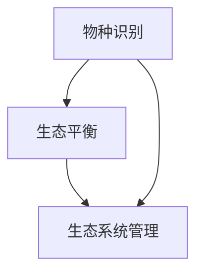

                 

### AI驱动的生态系统管理：从物种识别到生态平衡维护

### 引言

#### 背景介绍

随着全球生态系统的不断恶化，人类面临着前所未有的生态挑战。气候变化、生物多样性丧失、水资源短缺等问题日益严重，生态系统管理成为维护人类福祉和地球可持续发展的关键。传统生态系统管理方法主要依赖于经验判断和被动监测，无法满足当前快速变化的生态环境需求。为此，AI驱动的生态系统管理应运而生，通过利用人工智能技术，提高生态系统管理的效率和精度。

#### 核心概念与联系

**生态系统管理**：是指通过科学、可持续的方法，对生态系统进行规划、监测、评估和修复，以维护生态平衡和生物多样性。

**物种识别**：是生态系统管理的重要环节，通过识别和分类不同物种，可以更好地理解生态系统的结构和功能。

**生态平衡**：是指生态系统内各种生物和环境因素之间的相互作用达到相对稳定和平衡的状态。

#### Mermaid 流程图

下面是一个简单的 Mermaid 流程图，展示了物种识别、生态平衡和生态系统管理之间的关系：



#### 核心算法原理讲解

**物种识别算法**：

- **监督学习**：使用已标注的数据集训练模型，例如支持向量机（SVM）、决策树等。
- **无监督学习**：在未标注的数据集上进行聚类分析，例如K-均值聚类、层次聚类等。

**生态平衡指标体系**：

- **生物多样性指数**：衡量物种丰富度和分布均匀性，常用的有香农指数、辛普森指数等。
- **生态系统服务功能**：评估生态系统对人类提供的物质和服务，如水源涵养、碳固定等。

#### 数学模型和公式

- **生物多样性指数（Shannon指数）**：

  $$H' = -\sum_{i=1}^{S} p_{i} \ln(p_{i})$$

  其中，$H'$ 是香农指数，$p_{i}$ 是第$i$个物种的个体数与总个体数的比例。

- **生态系统服务功能（碳固定量）**：

  $$C_{f} = \frac{C_{a} \times A \times E}{1000}$$

  其中，$C_{f}$ 是碳固定量（吨/年），$C_{a}$ 是单位面积碳固定量（吨/年/公顷），$A$ 是生态系统面积（公顷），$E$ 是生态系统高度（米）。

#### 举例说明

**物种识别算法实例**：

```python
from sklearn.datasets import load_iris
from sklearn.model_selection import train_test_split
from sklearn.svm import SVC

# 加载数据集
iris = load_iris()
X = iris.data
y = iris.target

# 划分训练集和测试集
X_train, X_test, y_train, y_test = train_test_split(X, y, test_size=0.3, random_state=42)

# 创建SVM模型并训练
model = SVC(kernel='linear')
model.fit(X_train, y_train)

# 预测测试集
y_pred = model.predict(X_test)

# 评估模型性能
from sklearn.metrics import accuracy_score
accuracy = accuracy_score(y_test, y_pred)
print("Accuracy:", accuracy)
```

**生态平衡指标实例**：

```python
# 假设我们有一个包含物种丰富度和分布均匀性的数据集
species_data = [
    {'species': 'A', 'individuals': 50, 'total_individuals': 100},
    {'species': 'B', 'individuals': 30, 'total_individuals': 100},
    {'species': 'C', 'individuals': 20, 'total_individuals': 100}
]

# 计算Shannon指数
H_prime = 0
for data in species_data:
    p_i = data['individuals'] / data['total_individuals']
    H_prime -= p_i * math.log(p_i)
print("Shannon Index:", H_prime)
```

### AI驱动的生态系统管理框架

AI驱动的生态系统管理框架主要包括以下几个关键组成部分：

1. **数据采集**：通过卫星遥感、传感器网络、无人机等技术，实时获取生态系统数据。
2. **数据预处理**：对采集到的数据进行分析、清洗、归一化等预处理步骤。
3. **物种识别**：利用机器学习算法对物种进行识别和分类。
4. **生态平衡评估**：根据生态平衡指标，评估生态系统的健康状况。
5. **决策支持**：基于评估结果，为生态系统管理提供决策支持。
6. **反馈机制**：对决策效果进行跟踪和评估，不断优化管理策略。

### 总结

本文介绍了AI驱动的生态系统管理，从物种识别到生态平衡维护的各个环节。通过引入AI技术，我们可以实现更加高效、精确的生态系统管理，为解决全球生态危机提供有力支持。然而，AI驱动的生态系统管理仍然面临许多挑战，如数据隐私、算法透明度等，需要持续研究和改进。总之，AI驱动的生态系统管理是未来生态系统管理的重要方向，值得我们深入探索和实践。

### 摘要

本文探讨了AI驱动的生态系统管理，从物种识别到生态平衡维护的各个环节。通过机器学习和生态学原理，实现了对生态系统的实时监测和管理。本文介绍了AI驱动的生态系统管理框架，包括数据采集、预处理、物种识别、生态平衡评估和决策支持等关键组成部分。同时，通过具体实例展示了物种识别算法和生态平衡指标的计算方法。本文为AI驱动的生态系统管理提供了理论基础和实践指导，有助于解决全球生态危机。

---

文章标题：**AI驱动的生态系统管理：从物种识别到生态平衡维护**

关键词：**AI驱动的生态系统管理，物种识别，生态平衡，机器学习，生态监测**

摘要：**本文探讨了AI驱动的生态系统管理方法，通过物种识别和生态平衡评估，实现对生态系统的实时监测和管理。文章介绍了AI驱动的生态系统管理框架，包括数据采集、预处理、物种识别、生态平衡评估和决策支持等关键组成部分。通过具体实例展示了物种识别算法和生态平衡指标的计算方法，为生态系统管理提供了理论基础和实践指导。**

