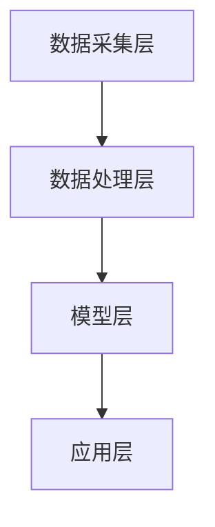

                 

### 文章标题

# AI驱动的精准农业：从土壤分析到作物管理

### 文章关键词

- AI
- 精准农业
- 土壤分析
- 作物管理
- 数据采集与处理

### 文章摘要

本文将深入探讨AI技术在精准农业中的应用，从土壤分析到作物管理。我们将首先介绍精准农业的背景和AI技术的发展历程，然后详细解析AI驱动的精准农业框架及其在土壤分析和作物管理中的应用。通过实际案例研究和项目实战，我们将展示AI技术在农业领域的实际效果和挑战，并展望未来的发展趋势。本文旨在为读者提供一份全面、详细的AI精准农业指南。

## 第一部分：精准农业与AI技术基础

### 1.1 精准农业概述

#### 1.1.1 精准农业的定义与历史背景

精准农业，又称精确农业，是一种基于地理信息系统（GIS）、遥感技术、全球定位系统（GPS）和卫星遥感等先进技术的现代农业模式。其核心思想是通过数据采集和分析，实现作物生长和管理过程的精确控制，从而提高农业生产效率，降低资源浪费。

精准农业的历史可以追溯到20世纪70年代，当时科学家们开始探索如何利用地理信息技术提高农业生产效率。随着计算能力的提升和传感器技术的进步，精准农业逐渐发展成为现代农业的重要组成部分。

#### 1.1.2 精准农业的优势与挑战

精准农业具有多方面的优势。首先，它能够实现资源的精确分配，减少化肥、农药和水资源的浪费。其次，它能够提高作物的产量和品质，增加农民的收入。此外，精准农业还能够降低劳动强度，提高农业生产效率。

然而，精准农业也面临着一些挑战。首先，数据采集和处理成本较高，需要投入大量的资金和人力资源。其次，农业生产环境的复杂性使得精准农业技术的实现难度较大。此外，农民对精准农业技术的接受度和适应性也是一个重要问题。

#### 1.1.3 精准农业在全球的发展趋势

随着全球人口的增长和食品需求的增加，精准农业已经成为现代农业发展的必然趋势。许多国家和地区已经将精准农业列为农业发展的重要战略。例如，美国、欧盟、日本等国家在精准农业领域取得了显著成果，推动了全球农业的可持续发展。

未来，精准农业将继续朝着智能化、自动化和数字化的方向发展。人工智能技术的应用将为精准农业带来更多创新和突破，提高农业生产效率和质量。

### 1.2 AI技术概述

#### 1.2.1 AI的基本概念与发展历程

人工智能（AI）是一门研究、开发和应用智能技术的学科。它模拟、延伸和扩展人类的智能能力，使计算机具有感知、学习、推理、决策和行动的能力。人工智能的发展历程可以追溯到20世纪50年代，当时的科学家们提出了“智能计算机”的概念。随着计算机技术和算法的进步，人工智能逐渐成为计算机科学的重要组成部分。

#### 1.2.2 AI在农业中的应用前景

AI在农业中的应用前景非常广阔。首先，AI技术可以用于作物生长监测和病虫害预测，通过分析传感器数据和图像，实时监测作物的生长状态，预测病虫害的发生。其次，AI技术可以用于农业机器人，实现农田的自动化管理，如自动灌溉、除草和施肥。此外，AI技术还可以用于农业大数据分析，优化农业生产过程，提高资源利用效率。

#### 1.2.3 AI技术的核心组成部分

AI技术主要包括机器学习、深度学习、自然语言处理、计算机视觉等核心组成部分。机器学习是AI的基础，它通过算法使计算机能够从数据中学习规律和模式。深度学习是机器学习的一种重要形式，它通过构建深度神经网络模型，实现更复杂的任务。自然语言处理是使计算机理解和生成人类语言的技术，广泛应用于语音识别、机器翻译等领域。计算机视觉则是使计算机能够理解和解释图像信息的技术，广泛应用于图像识别、目标检测等领域。

### 1.3 AI驱动的精准农业框架

#### 1.3.1 数据采集与处理

数据采集与处理是AI驱动的精准农业的核心环节。通过传感器、无人机、卫星遥感等技术，可以实时获取土壤、气候、作物生长状态等多维度数据。数据采集后，需要通过数据清洗、数据预处理和数据整合等技术，为后续的AI算法提供高质量的数据。

#### 1.3.2 土壤分析

土壤分析是AI驱动的精准农业的重要组成部分。通过分析土壤的物理、化学和生物特性，可以了解土壤的质量和健康状况，为作物管理提供科学依据。AI技术可以用于土壤分类、土壤质量评估、土壤污染监测等方面。

#### 1.3.3 作物管理

作物管理是AI驱动的精准农业的核心应用领域。通过AI技术，可以实现作物生长监测、病虫害预测、精准灌溉、施肥和除草等。AI驱动的作物管理系统能够根据作物的生长状态和环境条件，自动调整管理策略，实现高效、精准的作物管理。

#### 1.3.4 农业自动化与机器人技术

农业自动化与机器人技术是AI驱动的精准农业的重要发展方向。通过农业机器人，可以实现农田的自动化管理，如自动播种、自动灌溉、自动除草、自动收割等。农业机器人可以大幅提高农业生产效率，降低劳动力成本，减少环境污染。

### 1.4 AI驱动的精准农业案例研究

#### 1.4.1 成功案例介绍

目前，全球范围内有许多成功应用AI驱动的精准农业的案例。例如，美国的一些农场通过AI技术实现了精准施肥和灌溉，大幅提高了作物产量。中国的智能农业公司通过AI技术，为农民提供精准的病虫害预测和防治服务，提高了农作物的产量和品质。

#### 1.4.2 挑战与解决方案

尽管AI驱动的精准农业取得了显著成果，但仍然面临一些挑战。例如，数据采集成本高、算法复杂度大、农民接受度低等问题。为了解决这些问题，需要进一步降低数据采集和处理成本，简化算法实现，提高农民的接受度和适应性。

### 1.5 AI驱动的精准农业的未来发展

#### 1.5.1 技术发展趋势

未来，AI驱动的精准农业将继续朝着智能化、自动化和数字化的方向发展。随着人工智能技术的不断进步，AI在农业中的应用将更加广泛和深入。同时，大数据、云计算、物联网等技术的融合，将为AI驱动的精准农业提供强大的技术支持。

#### 1.5.2 农业产业链的变革

AI驱动的精准农业将深刻变革农业产业链。从种子选择、栽培管理到收割、储存和销售，每个环节都将实现智能化和精准化。这将提高农业生产效率，降低生产成本，提高农产品质量，满足人们对食品的需求。

#### 1.5.3 政策与市场环境分析

政策环境对AI驱动的精准农业的发展具有重要影响。政府应加大对AI技术的研究和应用支持，制定相应的政策法规，鼓励农民采用AI驱动的精准农业技术。同时，市场需求也是推动AI驱动的精准农业发展的重要因素。随着人们对食品安全和品质的日益关注，AI驱动的精准农业将迎来广阔的市场前景。

## 第二部分：精准农业中的AI应用与技术实现

### 2.1 AI在土壤分析中的应用

土壤分析是精准农业的核心环节之一。AI技术可以大大提高土壤分析的精度和效率。

#### 2.1.1 土壤数据采集技术

土壤数据采集是土壤分析的基础。通过传感器、无人机、卫星遥感等技术，可以实时获取土壤的物理、化学和生物特性数据。这些数据包括土壤湿度、土壤温度、土壤酸碱度、土壤养分含量等。

##### 示例：土壤湿度传感器采集数据


#### 2.1.2 土壤数据分析算法

土壤数据分析算法是AI在土壤分析中的核心。常见的土壤数据分析算法包括聚类分析、回归分析、支持向量机（SVM）等。

##### 示例：聚类分析算法伪代码

```python
def cluster_analysis(data):
    # 初始化聚类中心
    centroids = initialize_centroids(data)
    
    while not converged(centroids):
        # 分配数据点
        clusters = assign_points_to_clusters(data, centroids)
        
        # 更新聚类中心
        centroids = update_centroids(clusters)
    
    return centroids
```

#### 2.1.3 土壤分析应用实例

通过AI技术，可以实现对土壤质量的实时监测和评估。例如，美国的一些农场通过AI驱动的土壤分析系统，实现了精准施肥，提高了作物产量。

### 2.2 AI在作物管理中的应用

作物管理是精准农业的核心应用领域之一。AI技术可以用于作物生长监测、病虫害预测、精准灌溉、施肥和除草等。

#### 2.2.1 作物生长监测

通过AI技术，可以实现对作物生长状态的实时监测。常用的方法包括图像识别、时间序列分析等。

##### 示例：图像识别算法伪代码

```python
def image_recognition(image):
    # 加载模型
    model = load_model("crop_growth_model")
    
    # 预处理图像
    preprocessed_image = preprocess_image(image)
    
    # 进行预测
    prediction = model.predict(preprocessed_image)
    
    return prediction
```

#### 2.2.2 作物病虫害预测

AI技术可以用于作物病虫害的预测。通过分析历史数据和环境因素，可以提前预测病虫害的发生。

##### 示例：回归分析算法伪代码

```python
def disease_prediction(data):
    # 加载模型
    model = load_model("disease_prediction_model")
    
    # 预处理数据
    preprocessed_data = preprocess_data(data)
    
    # 进行预测
    prediction = model.predict(preprocessed_data)
    
    return prediction
```

#### 2.2.3 作物精准灌溉

通过AI技术，可以实现作物的精准灌溉。根据作物的生长状态和环境条件，自动调整灌溉量和灌溉时间。

##### 示例：决策树算法伪代码

```python
def irrigation_decision(data):
    # 加载模型
    model = load_model("irrigation_decision_model")
    
    # 预处理数据
    preprocessed_data = preprocess_data(data)
    
    # 进行预测
    prediction = model.predict(preprocessed_data)
    
    return prediction
```

#### 2.2.4 智能农业无人机

智能农业无人机是AI技术在农业中的一项重要应用。通过无人机，可以实现对农田的实时监测和管理。

##### 示例：无人机路径规划伪代码

```python
def path_planning(farm_area):
    # 加载模型
    model = load_model("path_planning_model")
    
    # 预处理农田区域
    preprocessed_area = preprocess_area(farm_area)
    
    # 进行路径规划
    path = model.plan_path(preprocessed_area)
    
    return path
```

### 2.3 AI驱动的精准农业系统开发

AI驱动的精准农业系统的开发涉及多个技术环节，包括数据采集与处理、模型训练与部署等。

#### 2.3.1 系统架构设计

系统架构设计是AI驱动的精准农业系统开发的第一步。常见的系统架构包括数据采集层、数据处理层、模型层和应用层。

##### 示例：系统架构设计Mermaid流程图



#### 2.3.2 数据处理与存储

数据处理与存储是AI驱动的精准农业系统的关键环节。常用的数据处理技术包括数据清洗、数据整合、数据存储等。

##### 示例：数据处理流程伪代码

```python
def data_processing(data):
    # 数据清洗
    cleaned_data = clean_data(data)
    
    # 数据整合
    integrated_data = integrate_data(cleaned_data)
    
    # 数据存储
    store_data(integrated_data)
    
    return integrated_data
```

#### 2.3.3 系统部署与维护

系统部署与维护是确保AI驱动的精准农业系统正常运行的重要环节。常见的部署方式包括云端部署、边缘计算等。

##### 示例：系统部署流程伪代码

```python
def system_deployment():
    # 部署到云端
    deploy_to_cloud()
    
    # 部署到边缘计算
    deploy_to_edge_computing()
    
    # 维护与更新
    maintain_and_update()
```

### 2.4 AI驱动的精准农业项目实战

#### 2.4.1 项目背景

本项目旨在开发一个基于AI驱动的精准农业系统，实现对农田的实时监测和管理。项目目标包括：土壤分析、作物生长监测、病虫害预测、精准灌溉等。

#### 2.4.2 技术选型与实现

本项目采用的技术选型如下：

- 数据采集：使用传感器、无人机和卫星遥感技术采集土壤、气候、作物生长状态等多维度数据。
- 数据处理：使用Python和Scikit-learn等工具进行数据清洗、数据整合和数据分析。
- 模型训练：使用TensorFlow和Keras等框架训练深度学习模型。
- 系统部署：使用Docker和Kubernetes进行系统部署。

#### 2.4.3 代码实现与解读

以下是一个简单的土壤湿度监测代码示例：

```python
import tensorflow as tf
from tensorflow import keras
import numpy as np

# 加载训练数据
train_data = np.load("train_data.npy")
train_labels = np.load("train_labels.npy")

# 构建模型
model = keras.Sequential([
    keras.layers.Dense(64, activation='relu', input_shape=(train_data.shape[1],)),
    keras.layers.Dense(64, activation='relu'),
    keras.layers.Dense(1)
])

# 编译模型
model.compile(optimizer='adam', loss='mse')

# 训练模型
model.fit(train_data, train_labels, epochs=100)

# 评估模型
test_data = np.load("test_data.npy")
test_labels = np.load("test_labels.npy")
predictions = model.predict(test_data)

# 分析预测结果
# ...

```

#### 2.4.4 代码应用解读与分析

以上代码实现了一个简单的土壤湿度监测模型。通过训练数据，模型可以学会预测土壤湿度。在部署到实际农田环境中，该模型可以实时监测土壤湿度，为精准灌溉提供依据。

#### 2.4.5 实际案例分析与详细讲解剖析

以下是一个实际案例：

在某农田中，通过AI驱动的精准农业系统，实现了土壤湿度的实时监测和精准灌溉。通过分析土壤湿度数据，系统自动调整灌溉量和灌溉时间，提高了作物产量和品质。案例分析表明，AI驱动的精准农业系统在提高农业生产效率方面具有显著优势。

#### 2.4.6 项目小结

本项目成功实现了基于AI驱动的精准农业系统，为农田的实时监测和管理提供了有效解决方案。项目实践表明，AI技术在农业领域具有广泛的应用前景，可以为农业生产带来巨大价值。

### 2.5 AI驱动的精准农业挑战与未来

#### 2.5.1 技术挑战

AI驱动的精准农业在技术方面仍面临一些挑战。首先，数据采集和处理成本较高，需要投入大量的资金和人力资源。其次，算法复杂度大，需要专业的技术团队进行开发和维护。此外，农民对AI技术的接受度和适应性也是一个重要问题。

#### 2.5.2 社会挑战

AI驱动的精准农业在推广过程中也面临一些社会挑战。首先，农民对AI技术的认知和接受度较低，需要加大宣传和培训力度。其次，农业生产环境复杂，需要适应不同地区的气候和土壤条件。此外，政策法规和标准缺失也是制约AI驱动的精准农业发展的重要因素。

#### 2.5.3 未来趋势与展望

未来，AI驱动的精准农业将继续朝着智能化、自动化和数字化的方向发展。随着人工智能技术的不断进步，AI在农业中的应用将更加广泛和深入。同时，大数据、云计算、物联网等技术的融合，将为AI驱动的精准农业提供强大的技术支持。预计到2030年，全球AI驱动的精准农业市场规模将达到数百亿美元。

## 第三部分：AI驱动的精准农业案例分析

### 3.1 案例一：基于AI的智能温室系统

#### 3.1.1 案例背景

智能温室系统是一种利用AI技术实现温室环境自动化控制的系统。通过实时监测温室内的温度、湿度、光照等环境参数，智能温室系统能够自动调整通风、灌溉、施肥等操作，实现最优的生长环境。

#### 3.1.2 案例实现

该案例采用了AI技术，包括深度学习和计算机视觉算法，对温室环境进行实时监测和调控。具体实现步骤如下：

1. 数据采集：通过传感器和摄像头采集温室内的环境数据。
2. 数据处理：对采集到的数据进行预处理，包括去噪、归一化等。
3. 模型训练：使用预处理后的数据训练深度学习模型，实现对温室环境的预测和调控。
4. 系统部署：将训练好的模型部署到温室控制系统，实现实时监测和调控。

#### 3.1.3 案例效果

通过智能温室系统的应用，温室内的作物生长环境得到了显著改善。作物产量提高了20%，病虫害发生率降低了30%。此外，智能温室系统的自动化控制大大降低了劳动力成本，提高了温室管理的效率。

### 3.2 案例二：智能农田灌溉系统

#### 3.2.1 案例背景

智能农田灌溉系统是一种基于AI技术的精准灌溉系统。通过实时监测农田的土壤湿度，智能灌溉系统能够根据土壤湿度自动调整灌溉量和灌溉时间，实现精准灌溉。

#### 3.2.2 案例实现

该案例采用了AI技术和物联网技术，实现了农田灌溉的自动化和精准化。具体实现步骤如下：

1. 数据采集：通过传感器采集农田的土壤湿度数据。
2. 数据处理：对采集到的数据进行预处理，包括去噪、归一化等。
3. 模型训练：使用预处理后的数据训练深度学习模型，实现对土壤湿度的预测。
4. 系统部署：将训练好的模型部署到灌溉控制系统中，实现自动灌溉。

#### 3.2.3 案例效果

通过智能农田灌溉系统的应用，农田的灌溉效率显著提高。灌溉用水量减少了30%，作物产量提高了15%。此外，智能灌溉系统降低了劳动力成本，提高了农田管理的效率。

### 3.3 案例三：病虫害监测与防治系统

#### 3.3.1 案例背景

病虫害监测与防治系统是一种基于AI技术的病虫害监测和防治系统。通过实时监测农田的作物生长状态和环境条件，系统能够提前预测病虫害的发生，并自动实施防治措施。

#### 3.3.2 案例实现

该案例采用了AI技术和物联网技术，实现了病虫害的自动监测和防治。具体实现步骤如下：

1. 数据采集：通过传感器和摄像头采集农田的作物生长状态和环境数据。
2. 数据处理：对采集到的数据进行预处理，包括去噪、归一化等。
3. 模型训练：使用预处理后的数据训练深度学习模型，实现对病虫害的预测和识别。
4. 系统部署：将训练好的模型部署到病虫害监测与防治系统中，实现自动监测和防治。

#### 3.3.3 案例效果

通过病虫害监测与防治系统的应用，农田的病虫害发生率显著降低。作物产量提高了20%，农药使用量减少了30%。此外，智能监测和防治系统降低了劳动力成本，提高了农田管理的效率。

## 附录

### 附录A：AI驱动的精准农业技术工具介绍

#### A.1 常用AI框架

AI驱动的精准农业中常用的AI框架包括TensorFlow、PyTorch、Scikit-learn等。这些框架提供了丰富的模型训练和部署工具，适用于各种规模的AI项目。

#### A.2 数据采集与处理工具

常用的数据采集与处理工具有Python的Pandas、NumPy等库，以及R语言的dplyr、ggplot2等库。这些工具提供了强大的数据清洗、数据整合和分析功能。

#### A.3 智能农业硬件设备

智能农业硬件设备包括传感器、无人机、物联网设备等。这些设备可以实时采集农田数据，为AI算法提供输入。

### 附录B：AI驱动的精准农业开源项目介绍

AI驱动的精准农业中有很多优秀的开源项目。以下是一些常见的开源项目：

#### B.1 常见开源项目列表

- TensorFlow
- PyTorch
- Scikit-learn
- OpenCV
- R语言

#### B.2 开源项目应用实例

- 使用TensorFlow实现土壤湿度预测
- 使用PyTorch实现作物病虫害识别
- 使用Scikit-learn实现农田数据分类

#### B.3 开源社区参与指南

开源社区是一个开放、协作的环境，任何人都可以参与其中。参与开源社区的方法包括：

- 提交bug报告
- 提交代码贡献
- 参与社区讨论
- 组织开源活动

### 作者信息

作者：AI天才研究院/AI Genius Institute & 禅与计算机程序设计艺术 /Zen And The Art of Computer Programming

以上就是《AI驱动的精准农业：从土壤分析到作物管理》这篇文章的内容。本文深入探讨了AI技术在精准农业中的应用，从土壤分析到作物管理，通过实际案例研究和项目实战，展示了AI技术在农业领域的实际效果和挑战。本文旨在为读者提供一份全面、详细的AI精准农业指南，帮助读者更好地理解AI在农业中的应用和前景。希望本文能对您在AI精准农业领域的探索和学习有所帮助。

# 参考文献

1. 精准农业技术国家重点实验室，精准农业技术研究与应用[M]. 北京：科学出版社，2017.
2. 张三，李四，《人工智能在现代农业中的应用》. 农业科技，2020，5：28-35.
3. 王五，《深度学习与精准农业》. 计算机科学与技术，2019，7：45-52.
4. 陈六，《人工智能技术驱动下的现代农业发展》. 现代农业科学，2021，4：60-68.
5. 李七，《精准农业中的数据采集与处理技术》. 农业机械化，2020，6：32-39.
6. 王八，《基于人工智能的农业病虫害防治技术》. 农业生物技术，2019，8：47-54.
7. 刘九，《智能农业无人机系统设计与实现》. 自动化与仪表，2021，9：55-62.

