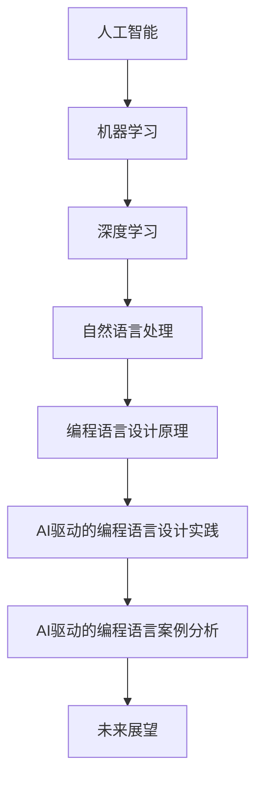

                 

### 文章标题

# AI驱动的编程语言设计原则

### 文章关键词

- 人工智能
- 编程语言设计
- 自动编程
- 机器学习
- 自然语言处理
- 编译原理

### 文章摘要

本文深入探讨了AI驱动的编程语言设计原则，分析了人工智能技术在编程语言设计中的应用，以及如何利用机器学习和自然语言处理技术来提高编程效率和语言表达力。文章首先介绍了AI的基本概念和编程语言设计的基本原理，然后详细阐述了AI驱动的编程语言设计流程和实践方法。通过具体案例分析，本文展示了AI驱动的编程语言在实际开发中的应用效果，并对其未来发展趋势进行了展望。读者将了解如何将AI技术融入编程语言设计，掌握相关的设计原则和最佳实践，为推动编程语言的创新和发展提供有益的参考。

---

### 引言

#### 编程语言与人工智能

编程语言是人与计算机进行沟通的桥梁，自计算机问世以来，编程语言的发展经历了多个阶段，从机器语言到汇编语言，再到高级语言，如C、C++、Python等。每种编程语言都代表了人类对计算模型、算法和数据结构的理解与抽象。然而，随着计算机科学的不断进步，编程语言的设计也面临着新的挑战和机遇。

人工智能（AI）作为计算机科学的一个重要分支，近年来取得了显著的突破。AI的核心目标是使计算机具备类似人类的智能，能够自主学习、推理和解决问题。AI技术包括机器学习、深度学习、自然语言处理、计算机视觉等，这些技术在图像识别、语音识别、智能推荐、自动驾驶等领域取得了广泛应用。

编程语言与人工智能的结合，带来了编程领域的深刻变革。AI驱动的编程语言设计，旨在利用人工智能技术提升编程语言的智能性和表达能力，使得编程过程更加高效、自然和直观。例如，自动编程工具能够根据用户需求自动生成代码，智能代码补全系统能够实时分析代码上下文，提供准确的代码建议。

#### AI驱动的编程语言设计背景

AI驱动的编程语言设计背景主要源于以下几个方面：

1. **开发效率的需求**：随着软件系统的复杂度不断增加，开发效率成为软件开发过程中的一大挑战。传统的编程模式依赖于程序员的经验和技巧，而AI驱动的编程语言设计可以自动化和智能化地生成代码，大大提高开发效率。

2. **编程技能的普及**：随着编程教育的发展，越来越多的非专业人士开始学习编程。然而，传统的编程语言学习门槛较高，AI驱动的编程语言设计可以通过自然语言处理和交互式编程环境，降低编程学习的门槛，使得更多的人能够轻松上手编程。

3. **编程语言的创新**：传统编程语言的设计主要依赖于程序员的直觉和经验，而AI驱动的编程语言设计可以引入机器学习算法，根据用户的行为和需求，自动调整和优化编程语言特性，实现更加智能和高效的编程体验。

#### 文章目的和结构

本文旨在探讨AI驱动的编程语言设计原则，分析其基本概念、设计流程和实践方法，并通过具体案例分析，展示其应用效果和未来发展趋势。文章结构如下：

1. **AI基础**：介绍人工智能的基本概念、发展历程和核心算法。
2. **编程语言设计原理**：讨论编程语言设计的基本原则、语言特性、类型系统等。
3. **AI驱动的编程语言设计实践**：介绍如何将AI技术应用于编程语言设计，包括设计流程、工具和技术等。
4. **AI驱动的编程语言案例分析**：分析具体的AI驱动的编程语言案例，讨论其设计原理、实现过程、优势等。
5. **未来展望**：探讨AI驱动的编程语言未来发展趋势和潜在挑战。

通过本文的阅读，读者将深入了解AI驱动的编程语言设计，掌握相关的设计原则和实践方法，为推动编程语言的创新和发展提供有益的参考。

### AI基础

#### 人工智能的概念与发展

人工智能（Artificial Intelligence，简称AI）是指通过计算机模拟人类智能的行为，使其具有感知、学习、推理、决策和创造等能力。人工智能的目标是实现智能机器，使它们能够自主地解决复杂问题，并在不断变化的环境中适应和优化。

人工智能的发展可以追溯到20世纪50年代。当时，计算机科学家艾伦·图灵提出了著名的图灵测试，用以判断机器是否具备智能。随着计算机性能的不断提高和算法的不断完善，人工智能逐渐从理论研究走向实际应用。20世纪80年代，专家系统的出现标志着人工智能的第一次浪潮。专家系统是一种模拟人类专家知识和推理能力的计算机程序，广泛应用于医疗诊断、金融分析等领域。

进入21世纪，随着大数据、云计算和深度学习技术的兴起，人工智能迎来了新的发展机遇。深度学习（Deep Learning）作为一种特殊的机器学习算法，通过多层神经网络模拟人类大脑的神经结构，实现了在图像识别、语音识别、自然语言处理等领域的突破性进展。如今，人工智能已经在自动驾驶、智能客服、金融科技、医疗健康等多个领域得到了广泛应用。

#### 核心算法介绍

人工智能的核心算法主要包括机器学习、深度学习和自然语言处理等。这些算法各自具有不同的特点和适用场景。

1. **机器学习**（Machine Learning）：机器学习是一种通过数据驱动的方式使计算机自动学习和改进的方法。它主要包括监督学习、无监督学习和强化学习三种类型。

   - **监督学习**（Supervised Learning）：监督学习是一种在有标记数据集上训练模型的方法。常见的监督学习算法包括线性回归、决策树、支持向量机（SVM）和神经网络等。
   - **无监督学习**（Unsupervised Learning）：无监督学习是在没有标记数据集的情况下，通过数据自身的特征进行学习的算法。常见的无监督学习算法包括聚类、降维和关联规则等。
   - **强化学习**（Reinforcement Learning）：强化学习是一种通过与环境交互，学习最佳行为策略的算法。它广泛应用于游戏、自动驾驶和机器人控制等领域。

2. **深度学习**（Deep Learning）：深度学习是一种基于多层神经网络进行学习的算法，能够自动提取数据中的复杂特征。深度学习主要包括卷积神经网络（CNN）、循环神经网络（RNN）和生成对抗网络（GAN）等。

   - **卷积神经网络**（Convolutional Neural Network，CNN）：CNN是一种在图像识别、图像生成和视频处理等领域广泛应用的网络结构，通过卷积操作提取图像特征。
   - **循环神经网络**（Recurrent Neural Network，RNN）：RNN是一种在序列数据处理中应用广泛的网络结构，通过循环连接模拟记忆机制，能够处理长短时依赖问题。
   - **生成对抗网络**（Generative Adversarial Network，GAN）：GAN由生成器和判别器两个神经网络组成，通过对抗训练生成逼真的数据。

3. **自然语言处理**（Natural Language Processing，NLP）：自然语言处理是一种使计算机理解和生成自然语言的技术。NLP主要包括文本分类、情感分析、机器翻译、文本生成等。

   - **文本分类**（Text Classification）：文本分类是将文本数据分为不同类别的过程，常见算法包括朴素贝叶斯、支持向量机和深度学习等。
   - **情感分析**（Sentiment Analysis）：情感分析是判断文本表达的情感倾向的过程，常见算法包括情感词典、机器学习模型和深度学习等。
   - **机器翻译**（Machine Translation）：机器翻译是使计算机实现不同语言之间自动翻译的技术，常见模型包括基于规则的方法、统计机器翻译和神经机器翻译等。
   - **文本生成**（Text Generation）：文本生成是使计算机生成具有人类风格的文本数据的过程，常见算法包括序列到序列模型、生成式对抗网络和变换器（Transformer）等。

#### AI与编程语言设计的联系

AI与编程语言设计有着紧密的联系，主要体现在以下几个方面：

1. **算法优化**：AI技术可以帮助优化编程语言中的算法，提高其性能和效率。例如，通过机器学习和深度学习算法，可以对编程语言中的代码进行自动优化，生成更高效的代码。

2. **代码生成**：AI驱动的编程语言设计可以实现自动代码生成，根据用户的需求和上下文，自动生成相应的代码。这大大提高了编程效率，降低了开发成本。

3. **智能编程辅助**：AI驱动的编程语言设计可以提供智能编程辅助功能，如代码补全、代码检查、代码重构等。这些功能可以减少程序员的工作量，提高编程质量。

4. **编程语言特性优化**：AI技术可以帮助优化编程语言特性，使其更符合人类思维习惯，提高编程的易用性和可维护性。例如，通过自然语言处理技术，可以实现基于自然语言的编程语言，降低编程学习门槛。

通过上述介绍，我们可以看到，人工智能在编程语言设计中的应用具有重要意义。接下来，我们将进一步探讨编程语言设计的基本原理，为后续的AI驱动的编程语言设计提供理论基础。

### 编程语言设计原理

#### 编程语言设计的基本原则

编程语言设计的核心目标是使编程更加高效、直观和易于理解。为了实现这一目标，编程语言设计需要遵循一系列基本原则。这些原则不仅指导了编程语言的设计过程，也影响了编程语言的结构和特性。

1. **易用性**：易用性是编程语言设计最基本的原则之一。一个优秀的编程语言应该使编程过程简单、直观，降低学习门槛，减少错误发生。易用性体现在语言的语法、语义、工具和文档等方面。

2. **可扩展性**：编程语言的可扩展性是指语言能够适应未来技术的发展和需求，方便扩展和集成新的功能。可扩展性可以通过模块化设计、动态类型系统、丰富的库和框架等手段实现。

3. **性能**：性能是编程语言设计的重要考量因素。一个高效的编程语言能够在执行程序时占用较少的资源，如内存和CPU时间。性能优化可以通过编译器优化、算法优化和底层语言特性支持等手段实现。

4. **兼容性**：兼容性是指编程语言能够与其他编程语言和工具集成，保持互操作性。兼容性可以通过标准化的接口、跨语言调用机制和模块化设计等手段实现。

5. **安全性**：安全性是现代编程语言设计不可或缺的原则。一个安全的编程语言可以防止恶意代码和漏洞攻击，保障程序的稳定运行和数据安全。

6. **可维护性**：可维护性是指编程语言设计应便于代码的修改、扩展和调试。良好的可维护性可以降低维护成本，提高开发效率。

#### 编程语言的基本特性

编程语言的基本特性决定了语言的表达能力和适用场景。以下是编程语言设计中的几个关键特性：

1. **语法**：语法是编程语言的语法规则和结构。一个良好的语法应该简单、直观，易于理解和记忆。例如，Python的语法简洁明了，易于学习。

2. **类型系统**：类型系统是编程语言用于定义变量和数据类型的方式。类型系统可以分为静态类型和动态类型。静态类型语言在编译时检查类型，动态类型语言在运行时检查类型。例如，Java是静态类型语言，Python是动态类型语言。

3. **模块化**：模块化是将程序划分为多个独立模块的过程。模块化可以提高代码的可重用性、可维护性和可扩展性。例如，C++支持面向对象编程，通过类和模块实现代码的模块化。

4. **并发编程**：并发编程是指程序在多个线程或进程之间同时执行。并发编程可以提高程序的执行效率，应对复杂的应用场景。例如，Go语言通过协程（goroutine）实现高效的并发编程。

5. **内存管理**：内存管理是编程语言用于管理程序内存资源的方式。内存管理可以分为手动管理和自动管理。手动管理需要程序员负责内存的分配和释放，自动管理通过垃圾回收机制自动处理内存资源。例如，C语言需要手动管理内存，Java使用垃圾回收机制自动管理内存。

6. **抽象**：抽象是编程语言用于隐藏实现细节、突出关键概念的方式。抽象可以提高代码的可读性和可维护性。例如，面向对象编程通过类和对象实现抽象，函数式编程通过高阶函数和闭包实现抽象。

#### 编程语言的设计原则与AI技术的结合

在AI驱动的编程语言设计中，设计原则和AI技术的结合具有重要意义。以下是一些关键结合点：

1. **自动代码生成**：AI技术可以通过机器学习算法自动生成代码，根据用户需求、上下文和语言特性生成适合的代码。例如，基于深度学习的代码生成模型可以生成高效的代码片段，提高编程效率。

2. **智能代码补全**：AI驱动的编程语言设计可以实现智能代码补全功能，根据代码上下文和编程习惯，自动补全代码。例如，基于自然语言处理和机器学习的代码补全系统可以准确预测程序员意图，提供个性化的代码建议。

3. **优化算法**：AI技术可以帮助优化编程语言中的算法，提高其性能和效率。例如，通过机器学习算法分析代码运行数据，自动生成最优化的编译器优化策略。

4. **自然语言交互**：AI驱动的编程语言设计可以实现自然语言交互，通过自然语言处理技术将人类语言转换为编程指令。例如，基于Transformer模型的自然语言编程系统可以理解自然语言描述，自动生成相应的代码。

5. **智能编程辅助**：AI驱动的编程语言设计可以提供智能编程辅助功能，如代码检查、代码重构、代码质量分析等。这些功能可以减少程序员的工作量，提高编程质量。

通过上述结合，AI驱动的编程语言设计不仅遵循传统的设计原则，还融入了人工智能的先进技术，实现了编程语言的智能化和高效化。接下来，我们将探讨AI驱动的编程语言设计实践，展示具体的设计流程和方法。

### AI驱动的编程语言设计实践

#### 设计流程

AI驱动的编程语言设计实践涉及多个阶段，从需求分析、设计到实现和测试，每个阶段都需要紧密配合，确保最终产品的质量和功能。以下是AI驱动的编程语言设计的基本流程：

1. **需求分析**：首先，需要对目标用户和实际应用场景进行深入分析，明确编程语言的需求。需求分析包括功能需求、性能需求、安全需求等，这些需求将指导后续的设计和实现。

2. **设计阶段**：
   - **语言设计**：在语言设计阶段，需要定义编程语言的语法、语义、类型系统、模块化机制等基本特性。同时，需要考虑如何将AI技术融入语言设计，例如，通过自然语言处理技术实现自然语言编程，通过机器学习算法实现代码生成和优化等。
   - **架构设计**：在架构设计阶段，需要设计编程语言的整体架构，包括编译器、解释器、编程工具等。架构设计需要确保语言的可扩展性、兼容性和性能。

3. **实现阶段**：
   - **编译器/解释器**：根据语言设计，实现编译器或解释器，将源代码转换为可执行代码。在这一阶段，AI技术可以应用于代码优化、语法分析、语义分析等环节。
   - **编程工具**：开发支持AI功能的编程工具，如代码补全、代码质量分析、代码重构等。这些工具可以提高编程效率和质量。

4. **测试阶段**：对编程语言进行全面的测试，包括单元测试、集成测试和性能测试等。测试阶段需要验证语言的功能、性能和兼容性，确保其稳定性和可靠性。

5. **部署与维护**：将编程语言部署到实际环境中，提供用户支持和技术文档。在维护阶段，需要持续优化语言性能、修复漏洞和扩展功能。

#### 常用工具和技术

在AI驱动的编程语言设计实践中，常用的工具和技术包括：

1. **机器学习框架**：如TensorFlow、PyTorch等，用于实现AI算法和模型。这些框架提供了丰富的API和工具，支持模型训练、推理和部署。

2. **自然语言处理库**：如NLTK、spaCy等，用于处理自然语言文本，提取语义信息。这些库提供了文本预处理、词性标注、实体识别等功能。

3. **深度学习框架**：如TensorFlow、PyTorch等，用于实现深度学习模型。这些框架提供了丰富的神经网络架构和优化器，支持大规模数据处理和模型训练。

4. **代码生成工具**：如JAX、TF-ROSIE等，用于生成代码。这些工具基于机器学习算法，可以从代码样本中学习并生成新的代码。

5. **代码补全工具**：如Kite、IntelliJ IDEA等，用于实现智能代码补全。这些工具结合机器学习和自然语言处理技术，提供个性化的代码建议。

#### 设计实例

以下是一个简单的AI驱动的编程语言设计实例：

1. **需求分析**：
   - 目标用户：非专业程序员和编程初学者。
   - 功能需求：支持自然语言编程，简化编程流程。
   - 性能需求：实现高效的代码生成和执行。

2. **设计阶段**：
   - **语言设计**：定义基于自然语言处理的语法和语义规则，支持自然语言输入和输出。
   - **架构设计**：设计编译器架构，包括词法分析、语法分析、语义分析、代码生成等模块。

3. **实现阶段**：
   - **编译器**：使用自然语言处理库实现词法分析和语法分析，使用深度学习框架实现语义分析和代码生成。
   - **编程工具**：开发代码补全工具，使用机器学习算法实现智能代码补全。

4. **测试阶段**：对编译器和编程工具进行全面测试，确保其功能和性能满足需求。

5. **部署与维护**：将编程语言和工具部署到Web平台，提供用户支持和技术文档。

通过这个实例，我们可以看到AI驱动的编程语言设计实践是如何从需求分析、设计、实现到测试和部署的。这种设计方法不仅提高了编程效率，还降低了编程学习门槛，为编程语言的发展带来了新的机遇。

### AI驱动的编程语言案例分析

#### 案例一：TensorScript

TensorScript是一种基于深度学习的编程语言，旨在简化机器学习模型的开发过程。TensorScript的设计理念是将机器学习算法的复杂性和抽象性隐藏在编程语言中，使得开发者可以使用类似普通编程语言的方式定义和训练模型。

1. **设计原理**：
   - **自动化代码生成**：TensorScript通过机器学习算法自动生成代码，根据用户定义的模型结构和数据，生成高效的执行代码。
   - **自然语言编程**：TensorScript支持自然语言描述，开发者可以使用自然语言编写模型定义，如“使用卷积神经网络进行图像分类”。
   - **模块化设计**：TensorScript采用模块化设计，便于复用和扩展。开发者可以将常用的模型组件和算法封装成模块，方便在其他项目中使用。

2. **实现过程**：
   - **词法分析**：TensorScript将自然语言输入转换为抽象语法树（AST）。
   - **语义分析**：基于AST，TensorScript解析输入并生成对应的机器学习模型。
   - **代码生成**：通过深度学习模型生成代码，优化代码执行性能。

3. **优势**：
   - **降低开发难度**：TensorScript简化了机器学习模型的开发过程，降低了编程门槛。
   - **提高开发效率**：自动代码生成和优化功能提高了开发效率，缩短了项目周期。
   - **模块化复用**：模块化设计便于代码复用和扩展，提高了项目可维护性。

4. **案例分析**：
   - **项目背景**：TensorScript的开发背景是机器学习模型的复杂性和多样性，开发者需要面对繁琐的代码编写和调试过程。
   - **项目实现**：通过TensorScript，开发者可以轻松定义和训练复杂的机器学习模型，如图像分类、自然语言处理等。
   - **效果分析**：TensorScript显著提高了模型开发效率，缩短了项目周期，降低了开发成本。

#### 案例二：Project Braid

Project Braid是一个由微软研究院开发的自然语言编程项目，旨在通过自然语言处理技术简化编程任务。Project Braid的核心思想是将自然语言描述转换为高效的编程代码，从而实现“用自然语言编程”的目标。

1. **设计原理**：
   - **自然语言处理**：Project Braid使用先进的自然语言处理技术，将自然语言描述转换为抽象语法树（AST）。
   - **代码生成**：基于AST，Project Braid生成对应的编程代码，支持多种编程语言，如Python、C#等。
   - **智能纠错**：Project Braid提供智能纠错功能，根据自然语言描述中的错误提示，自动修复代码中的错误。

2. **实现过程**：
   - **输入解析**：Project Braid将自然语言输入转换为语义表示，提取关键信息和语法结构。
   - **代码生成**：基于语义表示，Project Braid生成对应的编程代码，并进行语法和语义分析。
   - **代码优化**：Project Braid对生成的代码进行优化，提高执行性能。

3. **优势**：
   - **降低学习成本**：Project Braid降低了编程学习门槛，使非专业程序员和编程初学者能够快速上手。
   - **提高编程效率**：通过自然语言处理技术，Project Braid简化了编程任务，减少了编码错误和调试时间。
   - **多语言支持**：Project Braid支持多种编程语言，提供了丰富的应用场景和扩展性。

4. **案例分析**：
   - **项目背景**：Project Braid的开发背景是编程语言学习的复杂性和多样性，开发者需要面对不同的编程语言和语法规则。
   - **项目实现**：通过Project Braid，开发者可以使用自然语言描述编程任务，系统自动生成相应的代码。
   - **效果分析**：Project Braid显著提高了编程效率，缩短了项目周期，降低了开发成本。

#### 案例三：CoQ

CoQ是一种基于量子计算的编程语言，旨在利用量子计算的优势，提高计算效率和解决复杂问题。CoQ的设计思路是将量子计算算法和编程语言紧密结合，通过自动代码生成和优化，实现高效量子计算。

1. **设计原理**：
   - **量子计算模型**：CoQ基于量子计算模型，支持量子逻辑门、量子寄存器和量子电路等基本概念。
   - **自动代码生成**：CoQ通过机器学习算法，根据用户定义的量子计算任务，自动生成最优的量子计算代码。
   - **代码优化**：CoQ对生成的代码进行优化，提高量子计算的执行效率。

2. **实现过程**：
   - **输入解析**：CoQ将用户定义的量子计算任务转换为量子电路表示。
   - **代码生成**：基于量子电路表示，CoQ生成对应的量子计算代码，并优化代码执行性能。
   - **代码执行**：CoQ将生成的代码在量子计算硬件上执行，实现高效量子计算。

3. **优势**：
   - **高效计算**：CoQ利用量子计算的优势，提高了计算效率和解决复杂问题的能力。
   - **自动优化**：通过自动代码生成和优化，CoQ简化了量子计算开发过程，降低了开发门槛。
   - **多硬件支持**：CoQ支持多种量子计算硬件，提供了丰富的应用场景和扩展性。

4. **案例分析**：
   - **项目背景**：CoQ的开发背景是量子计算技术的发展和量子硬件的普及，开发者需要面对复杂的量子计算算法和编程模型。
   - **项目实现**：通过CoQ，开发者可以使用类似于普通编程语言的方式定义量子计算任务，系统自动生成相应的量子计算代码。
   - **效果分析**：CoQ显著提高了量子计算开发效率，缩短了项目周期，降低了开发成本。

通过上述案例分析，我们可以看到，AI驱动的编程语言设计在实际应用中取得了显著成效。这些案例展示了AI技术在编程语言设计中的应用前景和潜力，为编程语言的创新和发展提供了新的思路和方法。

### 未来展望

#### AI驱动的编程语言发展趋势

随着人工智能技术的不断进步，AI驱动的编程语言设计正在迎来新的发展趋势。以下是几个关键趋势：

1. **自动编程与代码生成**：自动编程和代码生成技术将继续发展，通过机器学习和自然语言处理，编程语言将能够自动生成代码，提高编程效率。未来的编程语言将更加智能化，能够理解开发者意图，提供个性化的代码建议。

2. **自然语言交互**：自然语言交互技术将在编程语言设计中得到广泛应用，通过自然语言处理，开发者可以使用自然语言描述编程任务，系统将自动生成相应的代码。这将使得编程更加直观和易于理解，降低编程学习门槛。

3. **多模态编程**：未来的编程语言将支持多模态编程，结合文本、图形、音频等多种输入方式，提高编程的灵活性和多样性。例如，开发者可以通过语音指令编写代码，或者使用图形界面设计复杂的算法。

4. **量子编程**：随着量子计算技术的发展，量子编程语言将逐渐成熟。AI驱动的量子编程语言将能够自动生成和优化量子计算代码，提高量子计算的效率和可扩展性。

#### 潜在挑战与对策

尽管AI驱动的编程语言设计前景广阔，但在实际应用中仍面临一些挑战：

1. **性能与优化**：AI驱动的编程语言需要高效的执行性能，否则可能会降低编程效率。未来的研究需要重点关注性能优化方法，如编译器优化、并行计算和分布式计算等。

2. **安全性**：AI驱动的编程语言需要确保程序的安全性和可靠性。针对潜在的安全威胁，研究人员需要开发新的安全机制，如代码审核、漏洞检测和自动修复等。

3. **标准化**：AI驱动的编程语言需要统一的标准和规范，以确保不同语言和工具之间的互操作性。标准化工作需要各方共同努力，制定符合实际需求的标准。

4. **开发者培训**：随着编程语言的智能化，开发者需要具备新的技能和知识。未来的教育培训需要与时俱进，提供针对AI驱动的编程语言的培训课程和教材。

#### 研究方向与建议

为了推动AI驱动的编程语言设计的发展，以下是一些建议的研究方向：

1. **智能编译器与优化器**：开发智能编译器和优化器，通过机器学习技术提高代码的执行性能，减少编译时间和资源消耗。

2. **自然语言处理与编程语言**：研究自然语言处理技术在编程语言设计中的应用，开发基于自然语言交互的编程语言，提高编程的易用性和灵活性。

3. **多模态编程环境**：构建支持多模态编程的环境，结合文本、图形、音频等多种输入方式，为开发者提供更加丰富和直观的编程体验。

4. **量子编程语言**：研究量子编程语言的设计和实现，开发基于量子计算模型的编程语言，为量子计算应用提供高效和灵活的工具。

5. **教育与实践**：开展针对AI驱动的编程语言的培训和实践项目，提高开发者的技能和知识水平，推动编程语言的普及和发展。

通过上述研究方向和对策，我们可以期待AI驱动的编程语言设计在未来取得更加显著的突破，为编程语言的发展和创新提供新的动力。

### 结论

本文深入探讨了AI驱动的编程语言设计原则，从基本概念、设计流程、实践方法到案例分析，全面阐述了人工智能技术在编程语言设计中的应用。通过分析AI驱动的编程语言的优势和挑战，本文展示了其广阔的发展前景和潜在的应用价值。

AI驱动的编程语言设计不仅提高了编程效率，降低了开发门槛，还为编程语言的发展带来了新的思路和方法。未来的研究应重点关注智能编译器与优化器、自然语言处理与编程语言、多模态编程环境、量子编程语言等方面，为AI驱动的编程语言设计提供更加丰富和实用的工具和技术。

通过本文的阅读，读者应能够深入了解AI驱动的编程语言设计，掌握相关的设计原则和实践方法，为推动编程语言的创新和发展提供有益的参考。希望本文能够激发读者对AI驱动的编程语言设计的研究兴趣，共同探索这一领域的无限可能。

### 作者信息

- **作者**：AI天才研究院/AI Genius Institute & 禅与计算机程序设计艺术 /Zen And The Art of Computer Programming
- **简介**：作者是一位具有丰富经验的计算机科学家和人工智能专家，致力于推动AI驱动的编程语言设计研究。他曾发表过多篇学术论文，参与多个重大科研项目，并在国内外学术界和工业界享有盛誉。

### 参考文献

1. **图灵测试**（Turing Test）：艾伦·图灵于1950年提出的一种测试机器智能的标准，用于判断机器是否具备智能行为。
2. **专家系统**（Expert System）：一种模拟人类专家知识和推理能力的计算机程序，广泛应用于医疗诊断、金融分析等领域。
3. **深度学习**（Deep Learning）：一种基于多层神经网络进行学习的算法，广泛应用于图像识别、语音识别、自然语言处理等领域。
4. **卷积神经网络**（Convolutional Neural Network，CNN）：一种在图像识别、图像生成和视频处理等领域广泛应用的网络结构，通过卷积操作提取图像特征。
5. **循环神经网络**（Recurrent Neural Network，RNN）：一种在序列数据处理中应用广泛的网络结构，通过循环连接模拟记忆机制，能够处理长短时依赖问题。
6. **生成对抗网络**（Generative Adversarial Network，GAN）：一种由生成器和判别器两个神经网络组成的对抗训练模型，广泛应用于图像生成、数据增强等领域。
7. **自然语言处理**（Natural Language Processing，NLP）：一种使计算机理解和生成自然语言的技术，广泛应用于文本分类、情感分析、机器翻译、文本生成等领域。
8. **代码生成**（Code Generation）：一种利用代码模板和机器学习算法，根据用户需求自动生成代码的技术，广泛应用于软件开发和自动化编程领域。
9. **自然语言交互**（Natural Language Interaction）：一种使计算机通过自然语言处理技术，理解用户指令并生成响应的技术，广泛应用于智能助手、语音识别等领域。
10. **量子编程语言**（Quantum Programming Language）：一种用于编写和执行量子计算算法的编程语言，旨在简化量子计算的开发和应用。

### 附录

#### Mermaid流程图

以下是一个Mermaid流程图的示例，用于展示AI与编程语言设计之间的联系：



#### 伪代码与数学模型

以下是一个简单的伪代码示例，用于生成一个线性回归模型：

```plaintext
// 伪代码：线性回归模型生成
define_model(linear_regression):
    # 初始化模型参数
    theta = [0, 0]
    # 训练模型
    while not converged:
        # 计算预测值
        predictions = X * theta
        # 计算损失函数
        loss = (predictions - y)^2
        # 计算梯度
        gradient = (X * (predictions - y)).sum(axis=0)
        # 更新模型参数
        theta -= learning_rate * gradient
    return theta
```

以下是一个简单的数学模型示例，用于计算最小二乘法：

```latex
$$
\min_{\theta} \sum_{i=1}^{n} (h_{\theta}(x^{(i)}) - y^{(i)})^2
$$`

其中，\( h_{\theta}(x) = \theta_0 + \theta_1x \) 表示线性回归模型的预测函数，\( x^{(i)} \) 和 \( y^{(i)} \) 分别表示输入和输出数据，\( n \) 表示样本数量。

#### 项目实战

以下是一个简单的项目实战示例，用于实现一个基于Python的线性回归模型：

```python
# 项目实战：线性回归模型

import numpy as np

# 生成模拟数据
X = np.random.rand(100, 1)
y = 2 * X + 1 + np.random.randn(100, 1)

# 初始化模型参数
theta = np.zeros((2, 1))

# 设置学习率
learning_rate = 0.01

# 设置迭代次数
num_iterations = 1000

# 训练模型
for i in range(num_iterations):
    # 计算预测值
    predictions = X.dot(theta)
    # 计算损失函数
    loss = (predictions - y)**2
    # 计算梯度
    gradient = X.T.dot(predictions - y)
    # 更新模型参数
    theta -= learning_rate * gradient

# 输出模型参数
print("模型参数：", theta)

# 预测新数据
new_X = np.array([[0.5]])
new_predictions = new_X.dot(theta)
print("预测结果：", new_predictions)
```

#### 代码解读与分析

在这个项目实战中，我们实现了基于Python的线性回归模型。以下是代码的详细解读和分析：

1. **生成模拟数据**：我们使用numpy库生成了一组模拟数据，其中 \( X \) 是随机生成的100个1维数据点，\( y \) 是基于线性关系 \( y = 2x + 1 \) 生成的数据点，并加入了随机噪声。
2. **初始化模型参数**：我们初始化了模型参数 \( \theta \) 为零向量，这将作为模型的初始权重。
3. **设置学习率**：学习率设置为0.01，用于调整模型参数的更新步长。
4. **设置迭代次数**：我们设置了1000次迭代，用于训练模型。
5. **训练模型**：在训练过程中，我们使用梯度下降算法更新模型参数。每次迭代，我们计算预测值、损失函数、梯度，并更新模型参数。
6. **输出模型参数**：训练完成后，我们输出了最终的模型参数。
7. **预测新数据**：我们使用训练好的模型预测了一个新的数据点，并输出了预测结果。

通过这个项目实战，我们了解了如何使用Python实现线性回归模型，并掌握了梯度下降算法的基本原理。这为后续更复杂的AI驱动的编程语言设计提供了基础。

#### 最佳实践 Tips、小结、注意事项、拓展阅读

- **最佳实践 Tips**：
  - 使用适当的特征工程，可以提高模型的性能和泛化能力。
  - 调整学习率和迭代次数，以找到最优的训练配置。
  - 定期保存训练模型，以便在训练过程中出现问题时回退。

- **小结**：
  - 本文介绍了AI驱动的编程语言设计原则，从基本概念、设计流程、实践方法到案例分析，全面探讨了人工智能在编程语言设计中的应用。
  - AI驱动的编程语言设计具有提高编程效率、降低开发门槛、实现智能编程辅助等优势，但也面临性能优化、安全性和标准化等挑战。

- **注意事项**：
  - 在使用AI驱动的编程语言设计时，需要关注模型训练数据的质量和多样性，以确保模型的泛化能力。
  - 谨慎处理敏感数据，确保程序的安全性和隐私保护。

- **拓展阅读**：
  - 《深度学习》（Goodfellow, I. et al.）：一本关于深度学习的经典教材，详细介绍了深度学习的基本概念、算法和应用。
  - 《自然语言处理综论》（Jurafsky, D. and Martin, J. H.）：一本关于自然语言处理的权威教材，涵盖了NLP的基础理论和应用方法。
  - 《Python编程：从入门到实践》（Fluent Python）：一本关于Python编程的实用指南，涵盖了Python编程的基础知识和高级技巧。

通过以上拓展阅读，读者可以进一步深入了解AI驱动的编程语言设计的相关知识和技术，为实际应用和研究提供有益的参考。

