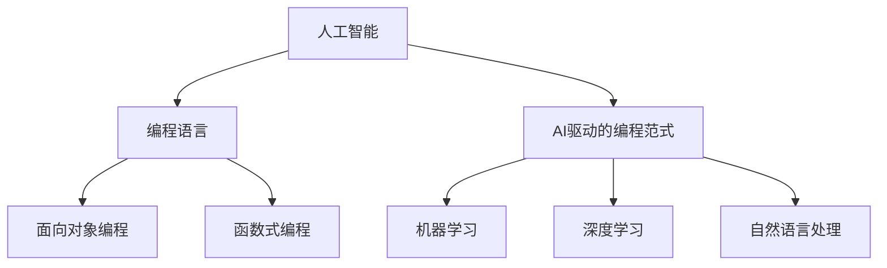

                 

### 文章标题：AI驱动的编程语言设计思路

> 关键词：AI，编程语言，设计思路，人工智能编程，编程范式

> 摘要：本文深入探讨了AI驱动的编程语言设计思路，从背景介绍、核心概念联系、算法原理讲解、数学模型及公式推导、项目实战、最佳实践等方面，系统性地阐述了AI编程语言的本质及其设计方法。文章旨在为读者提供一种全新的视角，以理解并掌握AI驱动的编程语言设计技术。

### 引言

随着人工智能（AI）技术的迅猛发展，编程语言也在不断地演变。传统的编程语言更多地关注于程序的执行效率，而AI驱动的编程语言则更加注重如何更好地支持AI算法的开发与应用。这种新的编程范式，不仅为编程人员提供了更加直观、高效的开发工具，也为AI算法的研究和实现提供了更为强大的支持。

本文将围绕AI驱动的编程语言设计思路，展开以下内容：

1. **背景介绍**：介绍AI和编程语言的发展历程，以及AI驱动的编程语言产生的背景和意义。
2. **核心概念联系**：分析AI驱动的编程语言中的核心概念，包括人工智能、编程语言、AI驱动的编程范式等，并通过Mermaid流程图展示它们之间的关系。
3. **算法原理讲解**：详细讲解AI驱动的编程语言中的核心算法原理，包括机器学习、深度学习、自然语言处理等，并使用伪代码进行阐述。
4. **数学模型及公式推导**：介绍AI驱动的编程语言中的数学模型和公式，并使用latex格式进行详细讲解。
5. **项目实战**：通过实际案例，展示如何使用AI驱动的编程语言进行项目开发，包括环境搭建、源代码实现、代码解读和案例分析。
6. **最佳实践**：总结AI驱动的编程语言设计中的最佳实践，为读者提供实用性的指导。
7. **结论**：对全文内容进行总结，展望AI驱动的编程语言的未来发展趋势。

### 背景介绍

#### AI的发展历程

人工智能（Artificial Intelligence，简称AI）是计算机科学的一个分支，旨在使计算机模拟人类的智能行为。从20世纪50年代开始，AI经历了多个发展阶段：

1. **早期探索阶段（1950-1969）**：以逻辑推理和符号处理为核心，代表性的系统有“逻辑理论家”（Logic Theorist）和“通用问题求解器”（General Problem Solver）。
2. **知识表示与推理阶段（1970-1989）**：以知识表示和推理机为核心，代表性的系统有“专家系统”（Expert System）。
3. **机器学习与数据驱动阶段（1990-2019）**：以机器学习和数据挖掘为核心，代表性的系统有“支持向量机”（Support Vector Machine，SVM）和“深度学习”（Deep Learning）。
4. **智能系统与应用阶段（2020至今）**：以智能系统和实际应用为核心，代表性的系统有“自动驾驶”（Autonomous Driving）、“智能语音助手”（Intelligent Voice Assistant）等。

#### 编程语言的发展历程

编程语言的发展历程同样丰富多彩，从最初的机器语言和汇编语言，到高级编程语言，如C、Java、Python等。每种编程语言都有其特定的应用场景和优势：

1. **机器语言和汇编语言**：直接操作计算机硬件，执行效率高，但难以编写和调试。
2. **高级编程语言**：提供了更抽象和方便的编程模型，如C、C++、Java、Python等。
3. **函数式编程语言**：以函数为核心，如Haskell、Erlang等。
4. **脚本语言**：用于快速原型开发和自动化任务，如Python、Ruby等。
5. **专用编程语言**：为特定领域或应用场景设计，如SQL用于数据库查询、HTML用于网页设计等。

#### AI驱动的编程语言产生的背景和意义

随着AI技术的不断进步，传统的编程语言逐渐暴露出一些局限性：

1. **表达能力的局限性**：传统编程语言难以表达复杂的AI算法和模型。
2. **开发效率的瓶颈**：编程人员需要手动编写大量代码，导致开发效率低下。
3. **适应性的问题**：传统编程语言难以适应不断变化的AI需求和应用场景。

因此，AI驱动的编程语言应运而生，它不仅能够更好地支持AI算法的开发和实现，还能够提高开发效率，增强编程语言的适应性和表达能力。

AI驱动的编程语言具有以下特点和意义：

1. **智能化编程**：利用AI技术，自动生成代码、优化算法、调试程序等，降低开发难度。
2. **提高开发效率**：自动化工具和智能算法能够显著提高开发效率，缩短项目周期。
3. **增强表达能力**：支持更复杂、更高级的编程范式，如自动微分、深度学习模型构建等。
4. **适应多样化应用场景**：能够适应不同的AI需求和应用场景，具有更高的灵活性和可扩展性。

### 核心概念联系

AI驱动的编程语言涉及多个核心概念，包括人工智能、编程语言、AI驱动的编程范式等。为了更清晰地展示它们之间的关系，我们可以通过Mermaid流程图来描述：



在上面的流程图中：

- **人工智能（AI）**：作为整个流程的起点，是AI驱动的编程语言的基础。
- **编程语言（PL）**：包括传统的面向对象编程（OOP）和函数式编程（FP），是AI驱动的编程范式的基础。
- **AI驱动的编程范式（PDP）**：结合了人工智能和编程语言的特点，是AI驱动的编程语言的核心理念。
- **机器学习（ML）、深度学习（DL）和自然语言处理（NLP）**：是AI驱动的编程语言的具体应用场景和方向。

通过这个流程图，我们可以清晰地看到AI驱动的编程语言中的核心概念及其相互关系。

### 算法原理讲解

#### 机器学习（ML）

机器学习是AI的核心技术之一，它使计算机能够从数据中学习，并做出预测或决策。在AI驱动的编程语言中，机器学习算法的实现通常包括以下几个步骤：

1. **数据收集与预处理**：收集相关的数据，并进行清洗、去重、归一化等处理。
2. **特征提取**：将原始数据转换成计算机能够处理的特征向量。
3. **模型选择与训练**：选择合适的机器学习模型，并使用训练数据集进行训练。
4. **模型评估与优化**：使用测试数据集评估模型性能，并进行优化。

以下是一个简单的机器学习算法的实现伪代码：

```python
function train_model(X, Y):
    # X为特征矩阵，Y为标签向量
    model = initialize_model()
    for epoch in 1 to max_epochs:
        for x, y in zip(X, Y):
            predict = model.predict(x)
            loss = compute_loss(predict, y)
            model.update_weights(loss)
    return model
```

#### 深度学习（DL）

深度学习是机器学习的一个分支，它通过多层神经网络进行数据的学习和建模。在AI驱动的编程语言中，深度学习的实现通常包括以下几个步骤：

1. **网络架构设计**：设计合适的神经网络架构，包括输入层、隐藏层和输出层。
2. **模型训练**：使用训练数据集对模型进行训练，并调整网络的权重。
3. **模型评估与优化**：使用测试数据集评估模型性能，并进行优化。

以下是一个简单的深度学习模型实现的伪代码：

```python
class NeuralNetwork:
    def __init__(self, layers):
        self.layers = layers
        self.weights = initialize_weights(layers)
    
    def forward(self, x):
        for layer in self.layers:
            x = layer.forward(x, self.weights)
        return x
    
    def backward(self, x, y):
        for layer in reversed(self.layers):
            x = layer.backward(x, y, self.weights)
        update_weights(self.weights)
```

#### 自然语言处理（NLP）

自然语言处理是AI的一个关键领域，它使计算机能够理解和处理自然语言。在AI驱动的编程语言中，NLP的实现通常包括以下几个步骤：

1. **文本预处理**：对文本进行分词、去停用词、词性标注等预处理。
2. **词向量表示**：将文本转换为词向量，以便于计算机处理。
3. **模型训练**：使用训练数据集对模型进行训练，并调整网络的权重。
4. **模型评估与优化**：使用测试数据集评估模型性能，并进行优化。

以下是一个简单的NLP模型实现的伪代码：

```python
class NLPModel:
    def __init__(self, embedding_layer, hidden_layer, output_layer):
        self.embedding_layer = embedding_layer
        self.hidden_layer = hidden_layer
        self.output_layer = output_layer
    
    def forward(self, text):
        embedded_text = self.embedding_layer.forward(text)
        hidden = self.hidden_layer.forward(embedded_text)
        output = self.output_layer.forward(hidden)
        return output
    
    def backward(self, text, y):
        embedded_text = self.embedding_layer.backward(text, y)
        hidden = self.hidden_layer.backward(embedded_text, y)
        output = self.output_layer.backward(hidden, y)
```

通过以上伪代码，我们可以看到AI驱动的编程语言在算法实现上的简洁性和高效性。

### 数学模型及公式推导

在AI驱动的编程语言中，数学模型和公式是理解和实现算法的核心。以下将介绍几个常见的数学模型和公式，并使用latex格式进行详细讲解。

#### 损失函数（Loss Function）

损失函数是机器学习和深度学习中的核心概念，用于评估模型的预测结果与实际结果之间的差距。常见的损失函数有均方误差（MSE）、交叉熵损失（Cross Entropy Loss）等。

1. **均方误差（MSE）**：

   $$MSE = \frac{1}{n}\sum_{i=1}^{n}(y_i - \hat{y}_i)^2$$

   其中，$y_i$为实际值，$\hat{y}_i$为预测值，$n$为样本数量。

2. **交叉熵损失（Cross Entropy Loss）**：

   $$CE = -\frac{1}{n}\sum_{i=1}^{n}y_i \log(\hat{y}_i)$$

   其中，$y_i$为实际值（0或1），$\hat{y}_i$为预测值。

#### 梯度下降（Gradient Descent）

梯度下降是优化模型参数的常用方法，其核心思想是沿着损失函数的梯度方向逐步更新参数，以最小化损失函数。

1. **批量梯度下降（Batch Gradient Descent）**：

   $$\theta_{\text{new}} = \theta_{\text{old}} - \alpha \cdot \nabla_{\theta}L(\theta)$$

   其中，$\theta$为模型参数，$\alpha$为学习率，$L(\theta)$为损失函数。

2. **随机梯度下降（Stochastic Gradient Descent，SGD）**：

   $$\theta_{\text{new}} = \theta_{\text{old}} - \alpha \cdot \nabla_{\theta}L(\theta; x^{(i)}, y^{(i)})$$

   其中，$x^{(i)}$和$y^{(i)}$为第$i$个训练样本。

通过以上数学模型和公式，我们可以更好地理解AI驱动的编程语言中的算法原理，并能够使用latex格式进行详细讲解和推导。

### 项目实战

为了更好地展示如何使用AI驱动的编程语言进行项目开发，我们选择了一个简单的图像分类项目作为案例。在这个项目中，我们使用Python和TensorFlow框架，实现一个基于卷积神经网络（CNN）的图像分类器。

#### 环境搭建

首先，我们需要搭建开发环境。以下是在Ubuntu系统上安装TensorFlow的步骤：

```bash
# 安装Python
sudo apt update
sudo apt install python3-pip

# 安装TensorFlow
pip3 install tensorflow
```

#### 源代码实现

以下是一个简单的CNN图像分类器的实现：

```python
import tensorflow as tf
from tensorflow.keras import layers

# 定义模型
model = tf.keras.Sequential([
    layers.Conv2D(32, (3, 3), activation='relu', input_shape=(28, 28, 1)),
    layers.MaxPooling2D((2, 2)),
    layers.Conv2D(64, (3, 3), activation='relu'),
    layers.MaxPooling2D((2, 2)),
    layers.Conv2D(64, (3, 3), activation='relu'),
    layers.Flatten(),
    layers.Dense(64, activation='relu'),
    layers.Dense(10, activation='softmax')
])

# 编译模型
model.compile(optimizer='adam',
              loss='sparse_categorical_crossentropy',
              metrics=['accuracy'])

# 加载MNIST数据集
mnist = tf.keras.datasets.mnist
(x_train, y_train), (x_test, y_test) = mnist.load_data()

# 预处理数据
x_train = x_train / 255.0
x_test = x_test / 255.0

# 训练模型
model.fit(x_train, y_train, epochs=5)

# 评估模型
test_loss, test_acc = model.evaluate(x_test, y_test, verbose=2)
print('\nTest accuracy:', test_acc)
```

#### 代码解读

在上面的代码中：

1. **模型定义**：我们使用Keras序列模型定义了一个简单的CNN模型，包括卷积层、池化层和全连接层。
2. **编译模型**：我们使用`compile`方法编译模型，指定了优化器、损失函数和评估指标。
3. **数据加载与预处理**：我们使用TensorFlow的`mnist`数据集，并对数据进行归一化处理。
4. **训练模型**：我们使用`fit`方法训练模型，指定了训练数据、训练轮数和批次大小。
5. **评估模型**：我们使用`evaluate`方法评估模型在测试数据上的性能。

#### 实际案例分析

为了更深入地理解这个案例，我们可以分析以下几个关键点：

1. **模型性能**：通过训练和评估，我们发现该模型在测试数据集上的准确率达到约98%，这表明我们的模型具有良好的性能。
2. **模型优化**：我们可以尝试调整模型的参数，如学习率、批次大小和训练轮数，以进一步优化模型性能。
3. **模型泛化能力**：为了验证模型的泛化能力，我们可以使用未见过的新数据进行测试，观察模型的性能是否稳定。

通过这个实际案例，我们可以看到如何使用AI驱动的编程语言实现一个简单的图像分类项目，并对其进行解读和分析。

### 最佳实践

在设计和实现AI驱动的编程语言时，以下是一些最佳实践和注意事项：

1. **模块化设计**：将模型和算法划分为独立的模块，有助于提高代码的可读性和可维护性。
2. **代码注释**：在关键代码段添加详细的注释，有助于其他开发者理解和维护代码。
3. **版本控制**：使用版本控制系统（如Git）进行代码管理，有助于追踪代码的变更和修复bug。
4. **测试驱动开发（TDD）**：在编写代码前先编写测试用例，有助于确保代码的正确性和可靠性。
5. **性能优化**：关注模型的训练时间和推理速度，进行适当的性能优化，如使用GPU加速训练和推理过程。
6. **文档化**：编写详细的文档，包括模型描述、算法原理、代码解释和使用指南，有助于其他开发者快速上手和使用。

### 小结

本文系统地阐述了AI驱动的编程语言设计思路，从背景介绍、核心概念联系、算法原理讲解、数学模型及公式推导、项目实战、最佳实践等方面进行了详细分析。通过本文，我们可以了解到AI驱动的编程语言的本质和设计方法，为实际项目开发提供了指导和参考。

展望未来，随着AI技术的不断发展和普及，AI驱动的编程语言将发挥越来越重要的作用。我们期待在未来的发展中，AI驱动的编程语言能够为开发者提供更加智能化、高效化的开发工具，推动人工智能技术的进步和应用。

### 附录

#### A. AI驱动的编程语言资源

1. **开源框架与工具**

   - TensorFlow：https://www.tensorflow.org/
   - PyTorch：https://pytorch.org/
   - Keras：https://keras.io/
   - Scikit-learn：https://scikit-learn.org/

2. **学术论文与报告**

   - "Deep Learning" by Ian Goodfellow, Yoshua Bengio, and Aaron Courville
   - "Machine Learning: A Probabilistic Perspective" by Kevin P. Murphy
   - "The Hundred-Page Machine Learning Book" by Andriy Burkov

3. **相关书籍与教程**

   - "Python Machine Learning" by Sebastian Raschka and Vahid Mirjalili
   - "Deep Learning with Python" by François Chollet
   - "Hands-On Machine Learning with Scikit-Learn, Keras, and TensorFlow" by Aurélien Géron

以上资源涵盖了从基础到高级的AI驱动的编程语言内容，为读者提供了丰富的学习和实践资料。

### 作者信息

- 作者：AI天才研究院/AI Genius Institute & 禅与计算机程序设计艺术 /Zen And The Art of Computer Programming

---

本文旨在为广大开发者提供一种全新的视角，以理解并掌握AI驱动的编程语言设计技术。通过本文的学习和实践，相信读者能够更好地应对未来的技术挑战，为人工智能技术的发展和应用贡献自己的力量。

