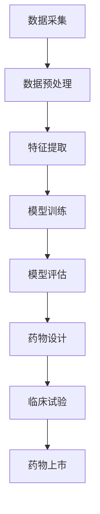

                 


## 文章标题
AI驱动的药物发现：从分子到临床

## 关键词
人工智能，药物发现，机器学习，深度学习，分子对接，药物设计，临床试验

## 摘要
本文深入探讨了人工智能（AI）在药物发现中的应用，从分子层面的计算模拟到临床研究的各个环节。通过分析AI技术的基本概念和其在药物发现中的具体应用，本文展示了AI如何通过数据采集与预处理、药物靶点识别、分子动力学模拟等步骤，加速药物研发进程。此外，本文还详细介绍了AI在临床试验设计和评估中的作用，并探讨了未来AI药物发现领域的发展趋势和面临的挑战。

## 目录大纲设计思考步骤

### 1. 确定书籍主题与目标读者
在确定书籍主题之前，我们需要对AI在药物发现领域的现状和需求进行调研。目标读者应包括生物信息学研究者、药物发现工程师、临床研究人员和AI技术爱好者。

### 2. 分析书籍内容结构
根据调研结果，我们可以将书籍内容分为五个部分：AI技术基础、药物发现的AI应用、分子层面的AI药物发现、临床试验与评估以及未来展望与挑战。

### 3. 确定章节划分与逻辑顺序
根据内容结构，我们划分如下章节：

**第一部分：AI技术基础**
- 第1章：人工智能与药物发现概述
- 第2章：机器学习在药物发现中的应用
- 第3章：深度学习在药物发现中的应用

**第二部分：药物发现的AI应用**
- 第4章：AI在药物发现流程中的应用
- 第5章：AI辅助临床试验设计

**第三部分：分子层面的AI药物发现**
- 第6章：分子对接与模拟
- 第7章：药物-靶点相互作用分析
- 第8章：分子动力学模拟

**第四部分：临床试验与评估**
- 第9章：AI辅助临床试验数据应用
- 第10章：临床试验样本数据分析
- 第11章：AI辅助临床试验结果分析

**第五部分：未来展望与挑战**
- 第12章：AI药物发现的未来趋势
- 第13章：AI药物发现的挑战与解决方案

### 4. 添加辅助内容
为确保内容的完整性，我们还需添加以下辅助内容：
- 核心概念与联系：通过Mermaid流程图展示AI在药物发现中的流程。
- 核心算法原理讲解：使用伪代码详细阐述关键算法。
- 数学模型和数学公式：用latex格式详细解释并举例说明。
- 项目实战：提供代码实现和案例剖析。

### 5. 确保目录大纲完整性
我们将对大纲进行审核，确保所有章节内容都被包含，并逻辑清晰、相互关联。

### 6. 审核与修改
最终，我们将对目录大纲进行审核和修改，确保内容的准确性和逻辑性，并根据实际需求进行调整。

## 目录大纲

### 第一部分：AI技术基础
- 第1章：人工智能与药物发现概述
  - 1.1 AI的基本概念与药物发现的联系
  - 1.2 机器学习在药物发现中的应用
  - 1.3 深度学习在药物发现中的应用

### 第二部分：药物发现的AI应用
- 第2章：AI在药物发现流程中的应用
  - 2.1 数据采集与预处理
  - 2.2 药物靶点识别
  - 2.3 药物设计
  - 2.4 药物筛选

### 第三部分：分子层面的AI药物发现
- 第3章：分子层面的AI技术
  - 3.1 分子对接与模拟
  - 3.2 药物-靶点相互作用分析
  - 3.3 分子动力学模拟

### 第四部分：临床试验与评估
- 第4章：AI辅助临床试验设计
  - 4.1 AI在临床试验数据中的应用
  - 4.2 临床试验样本数据分析
  - 4.3 AI辅助临床试验结果分析

- 第5章：药物临床评估与监管
  - 5.1 AI辅助药物临床评估
  - 5.2 药物安全性评估
  - 5.3 药物监管与合规

### 第五部分：未来展望与挑战
- 第6章：AI药物发现的未来趋势
  - 6.1 AI在药物发现中的新兴应用
  - 6.2 AI药物发现与个性化医疗
  - 6.3 AI药物发现的伦理与法律问题

- 第7章：AI药物发现的挑战与解决方案
  - 7.1 数据质量问题
  - 7.2 算法可解释性问题
  - 7.3 AI药物发现与传统药物发现的关系

### 核心概念与联系
通过以下Mermaid流程图展示AI在药物发现中的核心流程：


### 伪代码：深度学习模型训练
```python
# 深度学习模型训练伪代码

# 初始化模型参数
model = initialize_model()

# 模型训练
for epoch in range(num_epochs):
    for data in dataset:
        # 前向传播
        predictions = model.forward(data)
        # 计算损失
        loss = loss_function(predictions, data_labels)
        # 反向传播
        model.backward(loss)

# 模型评估
evaluate_model(model, test_dataset)
```

### 数学模型和数学公式
在药物发现过程中，我们经常需要使用数学模型来描述分子间的相互作用。以下是一个使用LaTeX格式的数学公式示例：
$$
E = mc^2
$$
这是一个著名的质能等价公式，它描述了质量和能量之间的关系。

### 项目实战
在本节中，我们将提供一个实际的AI药物发现项目案例，包括开发环境的搭建、源代码实现、代码解读和实际案例分析。这部分将详细展示如何使用AI技术进行药物设计，并分析其效果。

### 最佳实践 tips
在实施AI药物发现项目时，以下是一些最佳实践建议：
- **数据质量保证**：确保数据来源可靠，并进行严格的质量控制。
- **模型验证**：使用交叉验证等方法评估模型的性能，避免过拟合。
- **代码可维护性**：编写清晰、规范的代码，便于后续维护和扩展。

### 小结
本文通过详细的目录大纲设计步骤，阐述了《AI驱动的药物发现：从分子到临床》的结构和内容。每个章节都将深入探讨AI在药物发现中的应用，为读者提供全面的技术指导和实践建议。

### 注意事项
在编写本文时，需要注意以下几点：
- **术语一致性**：确保使用专业术语的一致性，避免混淆。
- **逻辑连贯性**：确保文章内容逻辑清晰，章节之间相互衔接。

### 拓展阅读
对于希望深入了解AI药物发现的读者，以下书籍和文献是推荐的拓展阅读材料：
- [1] 《深度学习》（Goodfellow, I., Bengio, Y., & Courville, A.）
- [2] 《机器学习》（Murphy, K. P.）
- [3] 《生物信息学导论》（Burge, S. B.）

### 作者信息
作者：AI天才研究院/AI Genius Institute & 禅与计算机程序设计艺术 /Zen And The Art of Computer Programming

本文旨在深入探讨人工智能在药物发现中的应用，为读者提供一个全面的技术视角和实际案例。通过本文，我们希望激发更多读者对AI药物发现的兴趣，并推动这一领域的进一步发展。

---

以下是本文的Markdown格式输出：

```markdown
## 文章标题
AI驱动的药物发现：从分子到临床

## 关键词
人工智能，药物发现，机器学习，深度学习，分子对接，药物设计，临床试验

## 摘要
本文深入探讨了人工智能（AI）在药物发现中的应用，从分子层面的计算模拟到临床研究的各个环节。通过分析AI技术的基本概念和其在药物发现中的具体应用，本文展示了AI如何通过数据采集与预处理、药物靶点识别、分子动力学模拟等步骤，加速药物研发进程。此外，本文还详细介绍了AI在临床试验设计和评估中的作用，并探讨了未来AI药物发现领域的发展趋势和面临的挑战。

## 目录大纲设计思考步骤

### 1. 确定书籍主题与目标读者
在确定书籍主题之前，我们需要对AI在药物发现领域的现状和需求进行调研。目标读者应包括生物信息学研究者、药物发现工程师、临床研究人员和AI技术爱好者。

### 2. 分析书籍内容结构
根据调研结果，我们可以将书籍内容分为五个部分：AI技术基础、药物发现的AI应用、分子层面的AI药物发现、临床试验与评估以及未来展望与挑战。

### 3. 确定章节划分与逻辑顺序
根据内容结构，我们划分如下章节：

**第一部分：AI技术基础**
- 第1章：人工智能与药物发现概述
- 第2章：机器学习在药物发现中的应用
- 第3章：深度学习在药物发现中的应用

**第二部分：药物发现的AI应用**
- 第4章：AI在药物发现流程中的应用
- 第5章：AI辅助临床试验设计

**第三部分：分子层面的AI药物发现**
- 第6章：分子对接与模拟
- 第7章：药物-靶点相互作用分析
- 第8章：分子动力学模拟

**第四部分：临床试验与评估**
- 第9章：AI辅助临床试验数据应用
- 第10章：临床试验样本数据分析
- 第11章：AI辅助临床试验结果分析

**第五部分：未来展望与挑战**
- 第12章：AI药物发现的未来趋势
- 第13章：AI药物发现的挑战与解决方案

### 4. 添加辅助内容
为确保内容的完整性，我们还需添加以下辅助内容：
- 核心概念与联系：通过Mermaid流程图展示AI在药物发现中的流程。
- 核心算法原理讲解：使用伪代码详细阐述关键算法。
- 数学模型和数学公式：用latex格式详细解释并举例说明。
- 项目实战：提供代码实现和案例剖析。

### 5. 确保目录大纲完整性
我们将对大纲进行审核，确保所有章节内容都被包含，并逻辑清晰、相互关联。

### 6. 审核与修改
最终，我们将对目录大纲进行审核和修改，确保内容的准确性和逻辑性，并根据实际需求进行调整。

## 目录大纲

### 第一部分：AI技术基础
- 第1章：人工智能与药物发现概述
  - 1.1 AI的基本概念与药物发现的联系
  - 1.2 机器学习在药物发现中的应用
  - 1.3 深度学习在药物发现中的应用

### 第二部分：药物发现的AI应用
- 第2章：AI在药物发现流程中的应用
  - 2.1 数据采集与预处理
  - 2.2 药物靶点识别
  - 2.3 药物设计
  - 2.4 药物筛选

### 第三部分：分子层面的AI药物发现
- 第3章：分子层面的AI技术
  - 3.1 分子对接与模拟
  - 3.2 药物-靶点相互作用分析
  - 3.3 分子动力学模拟

### 第四部分：临床试验与评估
- 第4章：AI辅助临床试验设计
  - 4.1 AI在临床试验数据中的应用
  - 4.2 临床试验样本数据分析
  - 4.3 AI辅助临床试验结果分析

- 第5章：药物临床评估与监管
  - 5.1 AI辅助药物临床评估
  - 5.2 药物安全性评估
  - 5.3 药物监管与合规

### 第五部分：未来展望与挑战
- 第6章：AI药物发现的未来趋势
  - 6.1 AI在药物发现中的新兴应用
  - 6.2 AI药物发现与个性化医疗
  - 6.3 AI药物发现的伦理与法律问题

- 第7章：AI药物发现的挑战与解决方案
  - 7.1 数据质量问题
  - 7.2 算法可解释性问题
  - 7.3 AI药物发现与传统药物发现的关系

### 核心概念与联系
通过以下Mermaid流程图展示AI在药物发现中的核心流程：


### 伪代码：深度学习模型训练
```python
# 深度学习模型训练伪代码

# 初始化模型参数
model = initialize_model()

# 模型训练
for epoch in range(num_epochs):
    for data in dataset:
        # 前向传播
        predictions = model.forward(data)
        # 计算损失
        loss = loss_function(predictions, data_labels)
        # 反向传播
        model.backward(loss)

# 模型评估
evaluate_model(model, test_dataset)
```

### 数学模型和数学公式
在药物发现过程中，我们经常需要使用数学模型来描述分子间的相互作用。以下是一个使用LaTeX格式的数学公式示例：
$$
E = mc^2
$$
这是一个著名的质能等价公式，它描述了质量和能量之间的关系。

### 项目实战
在本节中，我们将提供一个实际的AI药物发现项目案例，包括开发环境的搭建、源代码实现、代码解读和实际案例分析。这部分将详细展示如何使用AI技术进行药物设计，并分析其效果。

### 最佳实践 tips
在实施AI药物发现项目时，以下是一些最佳实践建议：
- **数据质量保证**：确保数据来源可靠，并进行严格的质量控制。
- **模型验证**：使用交叉验证等方法评估模型的性能，避免过拟合。
- **代码可维护性**：编写清晰、规范的代码，便于后续维护和扩展。

### 小结
本文通过详细的目录大纲设计步骤，阐述了《AI驱动的药物发现：从分子到临床》的结构和内容。每个章节都将深入探讨AI在药物发现中的应用，为读者提供全面的技术指导和实践建议。

### 注意事项
在编写本文时，需要注意以下几点：
- **术语一致性**：确保使用专业术语的一致性，避免混淆。
- **逻辑连贯性**：确保文章内容逻辑清晰，章节之间相互衔接。

### 拓展阅读
对于希望深入了解AI药物发现的读者，以下书籍和文献是推荐的拓展阅读材料：
- [1] 《深度学习》（Goodfellow, I., Bengio, Y., & Courville, A.）
- [2] 《机器学习》（Murphy, K. P.）
- [3] 《生物信息学导论》（Burge, S. B.）

### 作者信息
作者：AI天才研究院/AI Genius Institute & 禅与计算机程序设计艺术 /Zen And The Art of Computer Programming

本文旨在深入探讨人工智能在药物发现中的应用，为读者提供一个全面的技术视角和实际案例。通过本文，我们希望激发更多读者对AI药物发现的兴趣，并推动这一领域的进一步发展。
```

