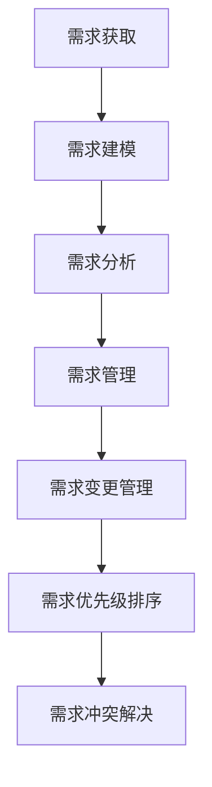

                 

### 引言

近年来，人工智能（AI）技术迅猛发展，已经深刻地改变了我们的生活方式和商业运作模式。AI不仅在图像识别、自然语言处理、自动驾驶等领域取得了突破性进展，还在软件工程中逐渐崭露头角。软件需求工程作为软件开发生命周期的重要组成部分，其核心目标是准确理解和获取用户需求，从而开发出符合用户期望的高质量软件产品。AI的引入，为软件需求工程带来了新的机遇和挑战。

首先，AI在软件需求工程中的应用主要体现在以下几个方面。首先，AI可以帮助自动化和优化需求获取过程，通过自然语言处理（NLP）技术，自动从用户描述中提取出需求信息。其次，AI驱动的需求分析工具能够通过机器学习算法，对需求进行分类、聚类和关联分析，从而帮助开发者更好地理解需求。此外，AI还可以在需求管理中发挥作用，如自动进行需求变更管理、优先级排序和冲突解决等。

尽管AI为软件需求工程带来了诸多机遇，但同时也面临着一系列挑战。首先，需求获取过程中的自动化和准确性仍然是一个亟待解决的问题。其次，如何在保证需求准确性的同时，兼顾需求的变化性和适应性，也是AI在软件需求工程中需要克服的难题。此外，AI技术的引入还涉及到隐私保护、伦理问题和技术可行性等方面。

本文旨在探讨AI驱动的软件需求工程领域中的机遇与挑战。首先，我们将对AI与软件需求工程的基础知识进行概述，包括AI的基本概念、软件需求工程的核心内容以及AI在软件需求工程中的应用现状。接着，我们将详细讨论AI驱动的需求分析、需求管理和需求工程工具。随后，通过具体案例，我们将展示AI驱动的软件需求工程在现实中的应用。最后，我们将分析AI驱动的软件需求工程所面临的挑战，并提出未来发展的展望。

通过本文的探讨，我们希望读者能够全面了解AI在软件需求工程中的潜在价值和面临的挑战，为未来的研究和实践提供一些有益的思路和方向。

### 关键词

- **人工智能（AI）**
- **软件需求工程**
- **需求获取**
- **需求分析**
- **需求管理**
- **机器学习**
- **自然语言处理（NLP）**
- **需求变更管理**
- **需求优先级排序**
- **需求验证**

### 摘要

本文探讨了人工智能（AI）在软件需求工程中的应用及其带来的机遇与挑战。首先，我们概述了AI和软件需求工程的基础知识，并介绍了AI在需求获取、分析和管理中的具体应用。接着，通过详细讨论AI驱动的需求分析、需求管理和需求工程工具，我们展示了AI如何提升软件需求工程的效果和效率。随后，通过两个现实案例，我们展示了AI驱动的软件需求工程在实际项目中的应用效果。最后，我们分析了AI在软件需求工程中面临的挑战，并探讨了未来的发展趋势和展望。通过本文的研究，我们希望为AI驱动的软件需求工程提供理论支持和实践指导。

## 第1章 引言

### 1.1 研究背景

软件需求工程是软件工程的重要分支，其核心目标是在软件开发过程中准确理解和获取用户需求，从而开发出符合用户期望的高质量软件产品。传统软件需求工程主要依赖于人类专家和手动过程，尽管这种方法在一定程度上能够满足需求获取和管理的需求，但其在自动化、效率和准确性方面仍然存在诸多局限。

随着人工智能（AI）技术的迅猛发展，特别是机器学习（ML）和自然语言处理（NLP）技术的成熟，AI在各个领域的应用已经取得了显著的成果。将AI技术引入软件需求工程，不仅可以提高需求获取、分析和管理的自动化程度，还能大幅提升其效率和准确性。例如，AI可以通过自动化自然语言处理技术，从用户描述中提取需求信息，减少人工干预和错误。此外，AI还可以利用机器学习算法对需求进行智能分析和预测，从而帮助开发者更快速地理解和满足用户需求。

AI在软件需求工程中的应用具有重要的现实意义。首先，随着软件项目的复杂性和规模日益增加，传统的需求工程方法已经难以满足快速开发和迭代的需求。AI技术可以自动化和优化需求获取过程，提高开发效率。其次，AI驱动的需求分析和管理工具可以帮助开发者更准确地理解用户需求，减少需求变更和冲突，提高软件质量。此外，AI的应用还可以帮助软件开发团队更好地应对市场需求的变化，实现快速响应和迭代。

然而，AI在软件需求工程中的应用也面临着一些挑战。首先，需求获取过程中的自动化和准确性仍然是一个亟待解决的问题。用户需求往往是非结构化和模糊的，如何通过AI技术准确提取和建模这些需求是一个重要的挑战。其次，AI技术的引入需要考虑到隐私保护、伦理问题和技术可行性等方面。例如，AI算法在处理用户数据时可能涉及隐私泄露的问题，如何确保数据的安全性和合法性是一个重要课题。此外，AI技术的应用还需要考虑技术实现的可行性，包括算法的选择、数据的质量和计算资源的需求等。

综上所述，将AI技术引入软件需求工程具有巨大的潜力和现实意义，但也面临着一系列挑战。本文旨在系统地探讨AI驱动的软件需求工程的机遇与挑战，通过理论分析和实际案例，为AI在软件需求工程中的应用提供有益的指导。

### 1.2 研究目标与意义

本文的研究目标主要包括以下几个方面：

1. **探讨AI在软件需求工程中的应用现状和未来趋势**：通过对现有文献和实际案例的深入分析，本文将总结AI在需求获取、分析和管理中的具体应用，并探讨其未来发展的可能方向。

2. **分析AI驱动的软件需求工程的关键技术**：本文将详细讨论AI驱动的需求获取、分析和管理技术，包括机器学习、自然语言处理、数据挖掘等核心算法和技术，分析其原理和应用场景。

3. **提出解决AI驱动的软件需求工程挑战的对策**：本文将针对AI在软件需求工程中面临的主要挑战，如自动化和准确性、数据隐私保护、伦理问题等，提出相应的解决对策和建议。

研究AI驱动的软件需求工程具有重要的意义：

1. **提高软件需求工程的效率和准确性**：AI技术可以自动化和优化需求获取、分析和管理过程，减少人为干预和错误，提高软件开发的效率和准确性。

2. **增强软件需求的适应性和灵活性**：AI驱动的需求工程工具可以帮助开发者更好地理解和应对市场需求的变化，实现快速响应和迭代，增强软件需求的适应性和灵活性。

3. **提升软件质量**：通过AI技术对需求进行智能分析和预测，可以减少需求变更和冲突，提高软件需求的完整性和一致性，从而提升软件的整体质量。

4. **推动软件需求工程的理论和实践发展**：本文的研究不仅为AI驱动的软件需求工程提供理论支持和实践指导，还可以促进相关领域的研究和交流，推动软件需求工程的理论和实践发展。

### 1.3 本书结构

本书共分为8个章节，结构安排如下：

1. **第1章 引言**：介绍研究背景、目标和意义，以及本书的结构安排。
2. **第2章 AI与软件需求工程基础**：概述AI和软件需求工程的基础知识，包括AI的基本概念、软件需求工程的核心内容以及AI在软件需求工程中的应用现状。
3. **第3章 AI驱动的需求分析**：详细讨论AI驱动的需求分析技术，包括需求获取、需求建模和需求验证的方法和算法。
4. **第4章 AI驱动的需求管理**：探讨AI驱动的需求管理技术，包括需求变更管理、需求优先级排序和需求冲突解决的方法和工具。
5. **第5章 AI驱动的需求工程工具**：介绍现有的AI驱动的需求工程工具，分析其应用场景和效果，并探讨未来的发展趋势。
6. **第6章 AI驱动的软件需求工程实践**：通过具体案例，展示AI驱动的软件需求工程在现实中的应用，并分析其实际效果和挑战。
7. **第7章 AI驱动的软件需求工程挑战与未来展望**：分析AI驱动的软件需求工程面临的挑战，并探讨未来的发展趋势和展望。
8. **第8章 结论**：总结本文的研究内容和结论，提出下一步的研究方向和建议。

通过以上章节的安排，本书旨在系统地探讨AI驱动的软件需求工程的各个方面，为相关领域的研究和实践提供参考和指导。

## 第2章 AI与软件需求工程基础

### 2.1 AI概述

人工智能（Artificial Intelligence，简称AI）是指通过计算机系统模拟人类智能的理论、方法和技术。AI的核心目标是使计算机具备类似人类的感知、推理、学习、决策和解决问题的能力。AI技术包括多种子领域，如机器学习（Machine Learning，ML）、深度学习（Deep Learning，DL）、自然语言处理（Natural Language Processing，NLP）和计算机视觉（Computer Vision）等。

**机器学习** 是AI的一个重要分支，它通过从数据中学习规律和模式，从而实现自动化决策和预测。机器学习的主要方法包括监督学习（Supervised Learning）、无监督学习（Unsupervised Learning）和强化学习（Reinforcement Learning）。监督学习通过已有标注数据进行训练，从而预测新的数据；无监督学习则无需标注数据，主要通过发现数据中的隐含结构；强化学习通过奖励机制，使系统在学习过程中逐步优化行为。

**深度学习** 是机器学习的一个子领域，主要基于人工神经网络（Artificial Neural Networks，ANNs）进行深度学习。深度学习通过多层神经网络（Deep Neural Networks，DNNs）学习数据的高层次特征，从而实现复杂的模式识别和分类任务。典型的深度学习模型包括卷积神经网络（Convolutional Neural Networks，CNNs）和循环神经网络（Recurrent Neural Networks，RNNs）。

**自然语言处理** 是AI的另一个重要分支，主要研究如何让计算机理解和生成自然语言。NLP涉及的语言处理任务包括文本分类、情感分析、机器翻译、语音识别等。NLP的关键技术包括词嵌入（Word Embedding）、序列模型（Sequence Models）和注意力机制（Attention Mechanism）。

### 2.2 软件需求工程概述

软件需求工程是软件开发过程中的核心环节，其目的是确保软件系统能够满足用户的实际需求。需求工程的主要活动包括需求获取、需求建模、需求分析和需求管理。

**需求获取** 是需求工程的第一个阶段，其主要任务是从用户和其他利益相关者那里获取需求信息。需求获取的过程通常涉及访谈、调查、观察和文档分析等方法。在这一阶段，需要确保获取的信息是完整、准确和一致的。

**需求建模** 是将获取的需求信息转化为结构化的需求文档和模型。常用的需求建模方法包括统一建模语言（Unified Modeling Language，UML）和实体关系模型（Entity-Relationship Model，ER Model）。需求建模的主要目标是清晰、明确地表达需求，以便后续的分析和管理。

**需求分析** 是对需求模型进行详细分析，以确定需求的可行性和一致性。需求分析的主要任务包括需求验证、需求确认和需求追踪。需求验证确保需求是否完整、一致和可执行；需求确认则验证需求是否真正反映了用户需求；需求追踪确保需求在软件开发过程中得到有效执行。

**需求管理** 是需求工程的最后一个阶段，其主要任务包括需求变更管理、需求优先级排序和需求冲突解决。需求变更管理确保在需求变更时，系统能够快速适应变化；需求优先级排序则帮助团队确定哪些需求应该优先处理；需求冲突解决则解决在需求定义和实现过程中出现的冲突和争议。

### 2.3 AI在软件需求工程中的应用

AI在软件需求工程中的应用主要体现在需求获取、需求分析和需求管理等方面，通过引入AI技术，可以显著提高需求工程的效果和效率。

**需求获取**：

在需求获取阶段，AI技术可以通过自然语言处理和机器学习算法，自动从非结构化的用户描述中提取出需求信息。具体应用包括：

- **文本分类**：利用文本分类技术，将用户描述的需求分类到不同的主题类别，从而快速提取出关键需求。
- **实体识别**：利用实体识别技术，从文本中提取出人、地点、组织、时间等关键实体信息，从而构建更加结构化的需求文档。
- **情感分析**：通过情感分析技术，分析用户描述中的情感倾向，帮助团队了解用户的满意度和需求偏好。

**需求分析**：

在需求分析阶段，AI技术可以通过机器学习算法和数据分析技术，对需求进行智能分析和预测，从而提高需求的一致性和可行性。具体应用包括：

- **需求聚类**：利用聚类算法，将相似的需求进行归类，从而发现需求中的潜在模式。
- **需求关联分析**：通过关联分析技术，探索不同需求之间的相互关系，帮助团队理解需求的全貌。
- **需求预测**：利用时间序列分析、回归分析等预测技术，预测需求的变化趋势，为需求管理提供参考。

**需求管理**：

在需求管理阶段，AI技术可以通过自动化工具和智能算法，优化需求变更管理、需求优先级排序和需求冲突解决。具体应用包括：

- **需求变更管理**：通过版本控制和变更追踪工具，自动记录和管理需求变更，确保需求变更的可追溯性和一致性。
- **需求优先级排序**：利用机器学习算法，分析需求的重要性和紧急性，自动为需求排序，帮助团队确定优先处理的需求。
- **需求冲突解决**：通过冲突检测和冲突解决算法，自动识别和解决需求定义和实现过程中的冲突。

综上所述，AI技术在软件需求工程中的应用，不仅提高了需求获取、分析和管理的效率和准确性，还增强了软件需求的适应性和灵活性，为软件开发提供了有力的支持。

### 2.4 AI驱动的需求工程与传统需求工程的比较

AI驱动的需求工程与传统需求工程在多个方面存在显著差异。首先，从需求获取过程来看，传统需求工程主要依赖于人类专家通过访谈、问卷调查、文档分析等方式获取需求信息，这个过程往往费时费力且容易引入主观偏差。而AI驱动的需求工程则可以利用自然语言处理（NLP）和机器学习（ML）技术，自动从非结构化的用户描述中提取需求信息。这种自动化处理不仅提高了效率，还能减少人为错误，从而提高需求获取的准确性和一致性。

在需求分析方面，传统需求工程通常依赖于人类专家的经验和判断，通过分析需求文档和模型来识别需求中的潜在问题。而AI驱动的需求工程可以通过机器学习算法和数据分析技术，对需求进行智能分析和预测。例如，聚类算法可以帮助识别相似的需求，关联分析可以探索需求之间的相互关系，从而提高需求分析的一致性和全面性。此外，AI驱动的需求工程还可以利用时间序列分析和回归分析等技术，预测需求的变化趋势，为需求管理提供科学依据。

需求管理的自动化程度也是两者之间的一个重要区别。传统需求工程往往需要大量的人力和时间来管理需求变更、优先级排序和冲突解决。而AI驱动的需求工程可以通过自动化工具和智能算法，显著提高需求管理的效率。例如，版本控制和变更追踪工具可以自动记录和管理需求变更，确保需求变更的可追溯性和一致性；需求优先级排序算法可以根据需求的重要性和紧急性自动为需求排序，从而帮助团队更有效地分配资源；冲突检测和解决算法可以自动识别和解决需求定义和实现过程中的冲突，减少人为干预。

此外，AI驱动的需求工程在适应性和灵活性方面也具有明显优势。由于AI技术能够自动学习和适应数据模式，因此它可以在需求变化频繁的环境中表现得更加强大。例如，当市场需求发生变化时，AI驱动的需求工程工具可以迅速调整需求模型和优先级排序，以适应新的需求。这种灵活性使得软件开发团队能够更快速地响应市场变化，提高软件产品的市场竞争力。

然而，AI驱动的需求工程并非没有缺点。首先，它的自动化和智能化程度越高，对数据质量和算法设计的依赖性也越强。如果数据质量不佳或算法设计不当，可能会导致需求分析结果不准确，甚至产生误导。其次，AI驱动的需求工程在引入新技术的同时，也带来了隐私保护和伦理问题。特别是在处理用户敏感信息时，如何确保数据的安全性和用户隐私是一个重要的挑战。

综上所述，AI驱动的需求工程与传统需求工程相比，在需求获取、分析和管理的效率、准确性和灵活性方面具有显著优势，但同时也面临着一些挑战和风险。理解和应对这些挑战，将有助于充分发挥AI驱动的需求工程的优势，为软件开发带来更广阔的应用前景。

### 2.5 AI驱动的需求工程与敏捷开发

AI驱动的需求工程与敏捷开发（Agile Development）之间存在一定的互补关系，共同为软件开发带来了新的机遇和挑战。

**敏捷开发** 是一种以人为核心、迭代和增量的软件开发方法。其核心原则包括客户满意、响应变化、团队合作和持续交付等。敏捷开发强调快速响应变化，通过短周期的迭代和频繁的反馈，确保软件系统能够持续适应市场需求。AI驱动的需求工程则通过自动化和智能化的技术，提高需求获取、分析和管理的效率，从而更好地支持敏捷开发的实施。

**互补关系**：

1. **快速需求获取**：AI驱动的需求工程可以通过自然语言处理（NLP）和机器学习（ML）技术，快速从用户描述中提取需求信息，为敏捷开发提供实时、准确的需求输入。这种快速响应能力有助于敏捷开发团队更好地理解和满足用户需求。

2. **需求智能分析**：AI驱动的需求工程可以利用机器学习算法，对需求进行智能分析和预测，帮助敏捷开发团队识别潜在的需求变化和风险。通过提前识别和应对这些变化，团队可以更有效地管理项目进度和质量。

3. **自动化需求管理**：AI驱动的需求工程工具可以自动化需求变更管理、优先级排序和冲突解决，提高敏捷开发团队的效率。这些自动化工具不仅减轻了团队的工作负担，还减少了人为错误，从而提高了需求管理的准确性和一致性。

**挑战与应对**：

1. **需求变化的适应性**：敏捷开发强调快速适应需求变化，而AI驱动的需求工程在处理频繁变化的需求时，可能面临适应性不足的问题。为了应对这一挑战，团队需要确保AI算法能够灵活地处理需求变化，并及时更新需求模型。

2. **数据质量和算法选择**：AI驱动的需求工程对数据质量和算法选择有较高的要求。数据质量不佳或算法选择不当，可能会导致需求分析结果不准确，从而影响敏捷开发的实施效果。因此，团队需要投入足够的时间和资源，确保数据的质量和算法的适用性。

3. **人类与AI的协作**：尽管AI驱动的需求工程可以提高效率和准确性，但它仍然无法完全替代人类专家。在敏捷开发中，人类专家的判断和经验仍然是不可或缺的。因此，团队需要找到人类与AI的平衡点，确保在需求分析和决策过程中充分发挥两者的优势。

综上所述，AI驱动的需求工程与敏捷开发之间存在互补关系，共同为软件开发带来了新的机遇和挑战。通过合理应对这些挑战，团队能够更好地利用AI技术，实现高效的敏捷开发。

### 2.6 AI驱动的需求工程案例研究

为了更好地理解AI驱动的需求工程在实际项目中的应用，我们可以通过一些具体的案例来探讨其效果和影响。

**案例一：某金融科技公司的需求工程实践**

某金融科技公司希望通过引入AI驱动的需求工程，提高需求获取和管理的效率，从而更快地响应市场需求。具体应用包括：

1. **需求获取**：通过自然语言处理（NLP）技术，自动从用户邮件、社交媒体和在线评论中提取需求信息。NLP算法能够识别关键词、短语和情感倾向，从而快速分类和提取关键需求。

2. **需求分析**：利用机器学习算法，对提取的需求信息进行聚类和关联分析。通过分析需求之间的相互关系，帮助团队理解用户需求的整体结构，发现潜在的需求冲突和遗漏。

3. **需求管理**：引入自动化工具，包括版本控制和变更追踪，确保需求变更的可追溯性和一致性。利用优先级排序算法，根据需求的重要性和紧急性，自动为需求排序，帮助团队确定优先处理的需求。

通过AI驱动的需求工程，该金融科技公司实现了以下几个效果：

- **需求获取效率显著提高**：自动化工具大大减少了手动处理需求的时间，团队可以更快地响应用户反馈。
- **需求分析准确性提升**：机器学习算法能够更准确地识别和分类需求，减少了需求遗漏和误解的可能性。
- **需求管理更加高效**：自动化工具和算法提高了需求管理的效率，减少了人为错误和重复工作。

**案例二：某电商平台的个性化需求管理**

某电商平台希望通过AI驱动的需求工程，实现更精准的个性化需求管理，从而提高用户满意度和市场竞争力。具体应用包括：

1. **需求获取**：通过用户行为数据和社交媒体互动，利用NLP技术自动分析用户的购物偏好和需求。通过情感分析，了解用户对产品和服务的满意度和需求倾向。

2. **需求分析**：利用机器学习算法，对用户行为数据进行分析，识别出用户的潜在需求。通过聚类和关联分析，发现用户需求的变化趋势和群体特征。

3. **需求管理**：引入自动化工具，包括需求优先级排序和冲突解决算法，根据用户需求的重要性和紧急性，自动调整需求处理的优先级。同时，利用智能推荐系统，根据用户需求和行为，为用户提供个性化的产品和服务。

通过AI驱动的需求工程，该电商平台实现了以下几个效果：

- **个性化需求管理更加精准**：自动化工具和算法能够更准确地识别和满足用户需求，提高了用户满意度和忠诚度。
- **市场竞争力提升**：通过精准的需求分析和个性化推荐，电商平台能够更好地吸引和留住用户，提高市场竞争力。
- **运营效率提高**：自动化工具和算法提高了需求管理的效率，减少了重复劳动，提高了团队的工作效率。

**案例三：某医疗健康应用的需求工程实践**

某医疗健康应用公司希望通过AI驱动的需求工程，提高医疗服务的质量和效率。具体应用包括：

1. **需求获取**：通过自然语言处理（NLP）技术，自动分析患者反馈和医生建议，提取出关键需求。同时，利用机器学习算法，对历史病例和医疗文献进行分析，补充和优化需求信息。

2. **需求分析**：利用机器学习算法，对提取的需求信息进行分类和关联分析，识别出不同用户群体和医疗场景的需求特点。通过需求聚类，发现用户需求的共同点和差异点。

3. **需求管理**：引入自动化工具，包括需求变更管理和优先级排序，确保需求变更的可追溯性和一致性。利用智能推荐系统，为医生和患者提供个性化的医疗建议和服务。

通过AI驱动的需求工程，该医疗健康应用公司实现了以下几个效果：

- **需求获取更加全面和准确**：自动化工具和算法能够更全面地获取和分析需求，减少了人为错误和遗漏。
- **医疗服务质量和效率提升**：通过智能分析和推荐，医疗团队能够更准确和高效地满足患者需求，提高医疗服务质量。
- **用户体验改善**：自动化工具和算法提高了服务效率，改善了用户的使用体验，增强了用户对平台的信任和满意度。

综上所述，AI驱动的需求工程在多个行业中都展现了其强大的应用潜力。通过自动化和智能化的技术，需求工程团队可以更高效地获取、分析和管理需求，从而提高软件服务的质量和市场竞争力。

### 第3章 AI驱动的需求分析

需求分析是软件需求工程中的核心环节，其目标是理解、捕捉和表达用户需求，以确保最终交付的软件系统能够满足用户期望。传统的需求分析方法主要依赖于人类专家的经验和手工操作，虽然这种方法在特定情况下仍具有一定的适用性，但在面对日益复杂的软件项目时，其效率、准确性和适应性都存在一定的局限。AI驱动的需求分析通过引入自然语言处理（NLP）、机器学习（ML）和数据分析等先进技术，为需求工程带来了革命性的变化。

#### 3.1 需求获取与建模

需求获取是需求分析的第一步，其目标是从用户和利益相关者那里获取准确的需求信息。AI驱动的需求获取过程主要通过以下几种技术实现：

1. **自然语言处理（NLP）**：NLP技术能够自动从文本中提取关键信息，例如关键词、短语和句子。通过文本分类、实体识别和情感分析等NLP技术，可以将用户描述的需求信息转化为结构化的数据，从而方便后续的处理和分析。

    **算法**： 
    - **文本分类**：使用朴素贝叶斯、支持向量机（SVM）或神经网络等分类算法，将用户描述的需求文本分类到不同的主题类别。
    - **实体识别**：使用序列标注模型（如BiLSTM-CRF）或基于规则的实体识别技术，从文本中提取人、地点、组织、时间等关键实体信息。
    - **情感分析**：使用情感分析算法（如基于情感词典和机器学习模型），分析用户描述中的情感倾向，从而理解用户对需求的态度和需求偏好。

2. **对话系统**：通过构建聊天机器人或虚拟助手，与用户进行自然语言交互，获取用户需求。对话系统能够理解用户语言，并生成相应的回复，从而提高需求获取的互动性和用户体验。

    **算法**：
    - **问答系统**：使用问答对训练语言模型，例如基于检索的问答系统和生成式问答系统。
    - **对话生成**：使用序列到序列（Seq2Seq）模型、Transformer模型等，生成自然的对话回复。

3. **数据挖掘与归纳**：通过分析大量用户反馈和文档，使用数据挖掘技术，自动归纳和提取出用户需求。这种方法特别适用于从大量非结构化数据中提取有价值的信息。

    **算法**：
    - **关联规则挖掘**：使用Apriori算法或FP-Growth算法，发现用户行为和需求之间的关联关系。
    - **聚类分析**：使用K-means、DBSCAN等聚类算法，将相似的需求归类，从而提取出共性需求。

需求建模是将获取的需求信息转化为结构化的需求文档和模型。在AI驱动的需求建模过程中，主要采用以下技术：

1. **统一建模语言（UML）**：使用UML建立需求模型，包括用例图、类图、序列图等。UML模型能够直观地表达用户需求，并且支持多种建模工具和开发语言。

2. **实体关系模型（ER Model）**：使用ER模型来描述需求的实体和关系，包括实体属性和实体之间的关联关系。ER模型特别适用于关系型数据库的设计。

3. **基于AI的需求建模**：利用AI算法，如生成对抗网络（GAN）或变分自编码器（VAE），生成需求模型。这些模型能够自动从数据中学习需求特征，并生成符合用户需求的新模型。

#### 3.2 需求分析算法

需求分析是对获取的需求信息进行深入理解和结构化，以便更好地满足用户需求。在AI驱动的需求分析中，主要采用以下几种算法：

1. **机器学习算法**：机器学习算法能够自动识别需求中的模式和关系，从而帮助开发者更好地理解需求。常用的算法包括：

    - **分类算法**：如朴素贝叶斯、支持向量机（SVM）、随机森林等，用于分类和预测用户需求。
    - **聚类算法**：如K-means、DBSCAN等，用于将相似的需求归类，从而提取出共性需求。
    - **关联规则挖掘**：如Apriori算法或FP-Growth算法，用于发现需求之间的关联关系。

2. **深度学习算法**：深度学习算法通过多层神经网络学习数据的高层次特征，能够处理复杂的需求分析和预测任务。常用的算法包括：

    - **卷积神经网络（CNN）**：用于图像和文本数据的特征提取，特别适用于需求文档的文本分析。
    - **循环神经网络（RNN）**：用于处理序列数据，特别适用于时间序列需求分析。
    - **变分自编码器（VAE）**：用于生成新的需求模型，特别适用于需求模型优化和改进。

3. **本体论与语义网络**：通过构建本体论和语义网络，将需求表示为具有明确语义的实体和关系。这种方法能够提高需求分析的语义一致性，特别适用于跨领域和复杂系统的需求分析。

#### 3.3 需求验证与确认

需求验证和确认是确保需求准确性和完整性的关键步骤。AI驱动的需求验证和确认主要采用以下技术：

1. **自动化测试**：使用自动化测试工具，对需求模型和需求文档进行验证。自动化测试能够快速发现需求中的不一致和错误，从而提高需求的准确性。

2. **模型检查与验证**：利用形式化方法和模型检查工具，对需求模型进行形式化验证，确保需求的一致性和可执行性。例如，使用模型检查器（Model Checker）检测需求模型中的逻辑错误和冲突。

3. **用户反馈与确认**：通过与用户进行互动和反馈，验证需求是否真正反映了用户需求。用户反馈可以用于修正和优化需求模型，从而提高需求的准确性和适应性。

#### 3.4 人工智能与软件需求工程的未来发展趋势

随着AI技术的不断发展和成熟，AI在软件需求工程中的应用前景十分广阔。未来，以下趋势值得关注：

1. **自动化与智能化水平的提升**：随着AI算法和技术的不断进步，需求获取、分析和管理的自动化和智能化水平将进一步提高，从而大幅提高需求工程的整体效率。

2. **多模态需求分析**：未来，AI驱动的需求分析将不仅限于文本数据，还将扩展到图像、声音和视频等多模态数据。通过融合多模态数据，可以更全面和准确地理解用户需求。

3. **动态需求建模与演化**：随着软件系统的不断迭代和演化，需求也将不断变化。未来，AI驱动的需求工程将能够动态地建模和演化需求，从而更好地适应需求的变化。

4. **跨领域和复杂系统的需求工程**：随着软件系统复杂性的增加，跨领域和复杂系统的需求工程将成为一个重要的研究方向。AI驱动的需求工程将能够更好地处理复杂的需求场景，提高需求工程的适应性和灵活性。

5. **隐私保护与伦理问题**：在应用AI驱动的需求工程时，隐私保护和伦理问题将变得越来越重要。未来，需要制定更加完善的隐私保护机制和伦理准则，确保用户数据的安全和合法使用。

通过以上发展趋势，AI驱动的需求工程将为软件需求工程带来更多的机遇和挑战，进一步推动软件需求的智能化和自动化发展。

### 第4章 AI驱动的需求管理

需求管理是软件需求工程中的关键环节，它涉及需求变更管理、需求优先级排序和需求冲突解决等方面。传统的需求管理方法往往依赖于人工处理，存在效率低下、错误率高和难以适应快速变化等问题。AI驱动的需求管理通过引入自然语言处理（NLP）、机器学习（ML）和自动化工具，能够显著提升需求管理的效率、准确性和灵活性。

#### 4.1 需求变更管理

需求变更是软件开发过程中常见且不可避免的现象。有效的需求变更管理能够确保需求变更的及时响应，同时保持项目进度的稳定和需求的完整性。AI驱动的需求变更管理主要通过以下几种技术实现：

1. **自动化版本控制**：使用自动化版本控制系统（如Git）记录和管理需求变更。自动化版本控制系统能够自动追踪需求的变化历史，并提供便捷的回滚和分支功能，确保需求变更的可追溯性和一致性。

2. **变更检测与预测**：利用机器学习算法，自动检测和分析需求变更的趋势和模式。通过分析历史变更数据，可以预测未来的需求变更，提前进行准备和调整。

3. **变更影响分析**：利用AI算法，自动分析需求变更对项目进度、成本和质量的影响。例如，通过回归分析和影响图等技术，可以快速评估变更对现有需求和开发计划的潜在影响。

4. **变更决策支持**：基于历史变更数据和机器学习模型，为项目团队提供变更决策支持。通过分析变更的可能性和影响，帮助团队做出更加明智的变更决策。

#### 4.2 需求优先级排序

需求优先级排序是需求管理的重要任务之一，它决定了哪些需求应该优先处理，哪些需求可以延迟或取消。AI驱动的需求优先级排序通过以下技术实现：

1. **机器学习算法**：使用机器学习算法，如决策树、支持向量机和神经网络等，对需求进行分类和排序。这些算法可以根据需求的重要性和紧急性，自动为需求设定优先级。

2. **多属性决策分析**：通过多属性决策分析（Multi-Attribute Decision Analysis，MADA）方法，综合考虑多个属性（如成本、风险、技术难度等），为需求设定优先级。这种方法能够更全面地评估需求的重要性。

3. **基于规则的优先级排序**：利用基于规则的系统（Rule-Based Systems），根据预先设定的规则和条件，为需求设定优先级。这种方法的优点是实现简单，易于理解和调整。

4. **自动化优先级调整**：通过自动化工具，根据项目的实际进度和资源情况，动态调整需求的优先级。这种方法能够确保优先级排序的实时性和灵活性。

#### 4.3 需求冲突解决

需求冲突是需求管理中常见的问题，尤其是在多个利益相关者参与的项目中。有效的需求冲突解决能够确保需求的统一和项目的顺利进行。AI驱动的需求冲突解决通过以下技术实现：

1. **冲突检测与报告**：利用自然语言处理（NLP）技术和机器学习算法，自动检测和识别需求冲突。例如，通过文本分类和实体识别技术，可以自动检测出需求文档中的不一致和矛盾。

2. **冲突分类与优先级排序**：将检测到的冲突分类，并根据冲突的性质和影响，为每个冲突设定优先级。这种方法可以帮助团队集中精力解决最关键的需求冲突。

3. **自动化冲突解决方案生成**：利用机器学习和自然语言生成（NLG）技术，自动生成冲突解决方案。例如，通过生成对抗网络（GAN）和序列到序列（Seq2Seq）模型，可以自动生成多个冲突解决方案，供团队参考和选择。

4. **协商与决策支持**：通过协商和决策支持系统，协助项目团队和利益相关者解决需求冲突。这些系统能够提供冲突解决方案的详细信息、影响评估和决策依据，帮助团队做出更加明智的决策。

#### 4.4 AI驱动的需求管理的优势

AI驱动的需求管理具有以下几个显著优势：

1. **高效性**：AI技术能够自动处理大量的需求数据和变更信息，大大减少了手动处理的需求量，提高了需求管理的效率。

2. **准确性**：通过机器学习和数据分析，AI驱动的需求管理能够更准确地识别和预测需求变更，减少人为错误和遗漏。

3. **灵活性**：AI驱动的需求管理能够动态地适应需求的变化和项目的实际情况，提供灵活的变更管理和优先级排序。

4. **协作性**：AI驱动的需求管理工具能够自动记录和管理需求变更，提供实时的信息共享和协同工作，促进团队和利益相关者的协作。

5. **可追溯性**：通过自动化版本控制和变更记录，AI驱动的需求管理能够确保需求变更的可追溯性和一致性，提高项目的可维护性。

综上所述，AI驱动的需求管理通过引入自动化和智能化的技术，不仅提高了需求管理的效率和质量，还增强了需求变更管理的适应性和灵活性，为软件开发提供了强有力的支持。

### 第5章 AI驱动的需求工程工具

AI驱动的需求工程工具是支持软件需求获取、分析和管理的自动化解决方案。随着人工智能技术的发展，这些工具在提高需求工程效率、准确性和灵活性方面发挥了重要作用。本节将介绍几种常见的AI驱动的需求工程工具，分析其应用场景、功能特点及实际效果。

#### 5.1 自动化需求获取工具

**1. Chatbots**

Chatbots是一种基于自然语言处理（NLP）和机器学习技术的虚拟助手，能够与用户进行自然语言交互，获取用户需求。Chatbots广泛应用于客户服务、客户反馈收集和需求分析等领域。

**应用场景**：  
- **客户支持**：Chatbots能够自动回答用户的问题，收集用户反馈，从而快速获取需求信息。
- **市场调研**：通过用户与Chatbots的对话，企业可以收集潜在用户的需求和偏好，为产品开发提供参考。

**功能特点**：  
- **文本分类**：Chatbots通过文本分类技术，将用户反馈分类到不同的主题类别，从而提取关键需求。
- **情感分析**：Chatbots能够分析用户反馈中的情感倾向，帮助团队了解用户的态度和需求偏好。
- **对话生成**：Chatbots使用对话生成技术，生成自然的对话回复，提高用户交互体验。

**实际效果**：  
- **提高需求获取效率**：通过Chatbots，企业可以快速收集大量用户反馈，节省人工处理时间。
- **提升用户体验**：Chatbots提供24/7的客户支持，提高用户满意度和忠诚度。

**2. 自动化文档分析工具**

自动化文档分析工具能够自动分析大量的文本数据，提取关键信息，例如关键词、短语和句子。这些工具广泛应用于需求文档分析、用户反馈处理和竞品分析等领域。

**应用场景**：  
- **需求文档分析**：自动化文档分析工具能够快速提取需求文档中的关键信息，帮助团队更好地理解和梳理需求。
- **用户反馈处理**：通过自动化文档分析，企业可以快速整理用户反馈，识别用户需求的变化和趋势。
- **竞品分析**：自动化文档分析工具能够自动分析竞品文档，提取竞品的优点和不足，为产品开发提供参考。

**功能特点**：  
- **文本分类**：工具能够将文本分类到不同的主题类别，从而快速提取关键需求。
- **实体识别**：工具能够自动识别文本中的关键实体信息，例如人、地点、组织、时间等。
- **情感分析**：工具能够分析文本中的情感倾向，了解用户对需求和产品的态度。

**实际效果**：  
- **提高分析效率**：自动化文档分析工具能够快速处理大量文本数据，提高需求分析和处理的效率。
- **提升分析准确性**：通过自动化分析，减少人工错误和遗漏，提高分析结果的准确性。

#### 5.2 需求分析工具

需求分析工具通过机器学习和数据分析技术，对需求进行深入分析，帮助团队理解需求的结构、关系和变化趋势。

**1. 需求聚类工具**

需求聚类工具能够将相似的需求归类到同一组，从而提取出共性需求。这种工具广泛应用于需求分类、需求优先级排序和需求变更管理。

**应用场景**：  
- **需求分类**：通过需求聚类工具，可以将大量的需求文档分类到不同的主题类别，便于团队管理和分析。
- **需求优先级排序**：通过聚类分析，识别出关键需求和次要需求，为团队提供优先处理的需求列表。

**功能特点**：  
- **聚类算法**：如K-means、DBSCAN等，用于将相似的需求分组。
- **特征提取**：工具能够提取需求文档中的关键特征，例如关键词、短语和句子，用于聚类分析。

**实际效果**：  
- **提高需求理解的深度**：需求聚类工具能够帮助团队更深入地理解需求的内部结构和相互关系。
- **优化需求管理**：通过聚类分析，团队可以更有效地管理和分配资源，提高需求管理的效率。

**2. 需求关联分析工具**

需求关联分析工具能够探索不同需求之间的相互关系，从而帮助团队理解需求的全貌。这种工具广泛应用于需求依赖关系分析、需求变更影响分析和需求优先级排序。

**应用场景**：  
- **需求依赖关系分析**：通过需求关联分析，可以识别出不同需求之间的依赖关系，确保需求变更不会导致项目进度的重大波动。
- **需求变更影响分析**：通过需求关联分析，可以快速评估需求变更对其他需求的影响，提前进行风险防范和调整。

**功能特点**：  
- **关联规则挖掘**：如Apriori算法、FP-Growth算法等，用于发现需求之间的关联关系。
- **网络分析**：通过构建需求网络，可视化不同需求之间的关联关系，便于团队理解和分析。

**实际效果**：  
- **提高需求变更管理的准确性**：需求关联分析工具能够帮助团队更准确地评估需求变更的影响，减少变更带来的风险。
- **优化需求优先级排序**：通过需求关联分析，团队可以更科学地设定需求的优先级，提高资源利用效率。

#### 5.3 自动化需求管理工具

自动化需求管理工具通过引入自动化和智能化的技术，提高需求变更管理、优先级排序和冲突解决的效果。

**1. 版本控制工具**

版本控制工具（如Git）能够自动记录和管理需求变更，确保需求变更的可追溯性和一致性。

**应用场景**：  
- **需求变更记录**：通过版本控制工具，可以自动记录每个需求变更的历史记录，便于团队追溯和分析。
- **需求变更追踪**：通过版本控制工具，可以实时追踪需求变更的状态和进度，确保变更得到及时处理。

**功能特点**：  
- **版本记录**：自动记录每次需求变更的详细信息，包括变更内容、变更时间和责任人。
- **变更追踪**：提供实时的需求变更状态追踪功能，便于团队监控和协调。

**实际效果**：  
- **提高变更管理的效率**：通过版本控制工具，团队可以更高效地管理需求变更，减少重复工作和沟通成本。
- **确保变更一致性**：通过自动化的版本记录和追踪，确保每个需求变更都得到妥善处理，避免变更遗漏和错误。

**2. 优先级排序工具**

优先级排序工具通过机器学习和数据分析技术，自动为需求设定优先级。

**应用场景**：  
- **需求优先级排序**：通过优先级排序工具，可以根据需求的重要性和紧急性，自动为需求设定优先级。
- **资源分配**：通过优先级排序工具，可以帮助团队更科学地分配资源，优先处理关键需求。

**功能特点**：  
- **机器学习算法**：如决策树、支持向量机等，用于分类和排序需求。
- **多属性决策分析**：综合考虑多个属性（如成本、风险、技术难度等），为需求设定优先级。

**实际效果**：  
- **优化资源利用**：通过优先级排序工具，团队可以更有效地利用资源，提高工作效率。
- **减少重复工作**：通过自动化的优先级排序，减少人为干预和重复工作，提高工作准确性。

**3. 冲突解决工具**

冲突解决工具通过自动化和智能化的技术，帮助团队识别和解决需求冲突。

**应用场景**：  
- **冲突检测**：通过冲突解决工具，可以自动检测需求文档中的不一致和矛盾。
- **冲突解决**：通过冲突解决工具，可以自动生成冲突解决方案，供团队参考和选择。

**功能特点**：  
- **文本分类与实体识别**：用于检测需求文档中的不一致和矛盾。
- **自动化解决方案生成**：通过生成对抗网络（GAN）和序列到序列（Seq2Seq）模型，自动生成冲突解决方案。

**实际效果**：  
- **提高冲突解决的效率**：通过自动化和智能化的技术，冲突解决工具能够快速识别和解决需求冲突，减少人工干预。
- **减少冲突带来的风险**：通过自动化的冲突检测和解决方案生成，减少需求冲突对项目进度和质量的影响。

综上所述，AI驱动的需求工程工具通过自动化和智能化的技术，显著提高了需求获取、分析和管理的效率、准确性和灵活性，为软件开发提供了强有力的支持。

### 第6章 AI驱动的软件需求工程实践

为了更好地展示AI驱动的软件需求工程在实际项目中的应用效果，我们通过两个具体案例进行分析和讨论。这两个案例分别来自金融科技和医疗健康领域，通过AI技术的应用，大幅提升了需求获取、分析和管理的效率和质量。

#### 案例一：某金融科技公司的AI驱动的需求工程实践

某金融科技公司希望通过引入AI驱动的需求工程，优化其金融产品的开发和交付流程，以更好地满足市场需求。项目的主要目标是自动化需求获取、提高需求分析精度和效率，以及优化需求管理流程。

**1. 需求获取与自动化文本分析**

在需求获取阶段，该公司利用自然语言处理（NLP）和机器学习（ML）技术，开发了一个自动化文本分析工具。该工具能够从用户反馈、市场调研报告和行业新闻等多渠道的文本数据中提取关键需求信息。

**实现方法**：
- **文本分类**：使用朴素贝叶斯和支持向量机（SVM）算法，将用户反馈文本分类到不同的主题类别，如“账户管理”、“交易功能”和“安全性能”等。
- **实体识别**：使用BiLSTM-CRF模型，自动识别文本中的关键实体信息，如用户名、银行账户号码、交易日期等。
- **情感分析**：利用基于情感词典和机器学习模型的方法，分析用户反馈中的情感倾向，判断用户对金融产品的满意度和需求倾向。

**效果分析**：
- **提高需求获取效率**：通过自动化文本分析工具，公司能够快速从大量文本数据中提取关键需求信息，节省了人工处理时间。
- **提升分析准确性**：AI驱动的文本分析工具能够更准确地识别和分类需求，减少了人工错误和遗漏。

**2. 需求分析与预测**

在需求分析阶段，该公司利用聚类分析和时间序列分析等技术，对提取的需求信息进行深入分析，以识别用户需求的变化趋势和潜在需求。

**实现方法**：
- **需求聚类**：使用K-means算法，将相似的需求归类到同一组，从而提取出共性需求，便于团队进行统一管理和优化。
- **需求预测**：使用时间序列分析和回归分析技术，预测未来一段时间内用户需求的变化趋势，为产品规划和开发提供参考。

**效果分析**：
- **优化需求管理**：通过聚类分析，团队能够更好地理解和分类需求，从而更有效地管理和优先处理关键需求。
- **提高产品适应性**：通过需求预测，公司能够提前了解市场需求变化，优化产品设计和开发计划，提高产品的市场竞争力。

**3. 需求管理与自动化工具**

在需求管理阶段，该公司引入了自动化需求管理工具，包括版本控制、需求变更追踪和优先级排序等功能，以提升需求管理的效率和准确性。

**实现方法**：
- **版本控制**：使用Git等自动化版本控制工具，记录和管理需求变更的历史记录，确保需求变更的可追溯性和一致性。
- **需求变更追踪**：通过自动化工具，实时追踪需求变更的状态和进度，确保每个变更得到及时处理。
- **优先级排序**：利用机器学习算法，自动为需求设定优先级，根据需求的重要性和紧急性，为团队提供优先处理的需求列表。

**效果分析**：
- **提高管理效率**：通过自动化需求管理工具，公司能够高效地处理大量需求变更，减少了重复工作和沟通成本。
- **确保变更一致性**：自动化的版本控制和需求变更追踪，确保每个需求变更都得到妥善处理，避免变更遗漏和错误。

**案例总结**：
通过AI驱动的需求工程实践，该金融科技公司显著提升了需求获取、分析和管理的效率和质量。自动化工具的应用不仅提高了工作效率，还减少了人为错误，使得团队能够更快速地响应市场需求，优化产品设计和开发流程。

#### 案例二：某医疗健康应用公司的AI驱动的需求工程实践

某医疗健康应用公司开发了一款面向医生的智能医疗诊断系统，希望通过AI驱动的需求工程，确保系统能够准确、高效地满足医生和患者的需求。

**1. 需求获取与文本分析**

在需求获取阶段，公司利用自然语言处理（NLP）技术，从医生和患者的反馈、文献资料和临床数据中提取需求信息。

**实现方法**：
- **文本分类与实体识别**：使用NLP技术，将文本分类到不同的主题类别，如“诊断需求”、“患者信息”和“系统功能”等，同时识别文本中的关键实体信息，如疾病名称、症状描述等。
- **情感分析**：分析医生和患者反馈中的情感倾向，了解他们对系统的满意度和需求期望。

**效果分析**：
- **提高需求获取的准确性**：通过NLP技术，公司能够更准确地识别和分类需求，减少了人工错误和遗漏。
- **优化需求理解**：通过对情感倾向的分析，公司能够更好地理解用户需求，为系统设计和优化提供有力支持。

**2. 需求分析与预测**

在需求分析阶段，公司利用机器学习和数据分析技术，对提取的需求信息进行深入分析，以识别用户需求的变化趋势和潜在需求。

**实现方法**：
- **需求聚类**：使用K-means算法，将相似的需求归类到同一组，从而提取出共性需求，便于团队进行统一管理和优化。
- **需求预测**：使用时间序列分析和回归分析技术，预测未来一段时间内用户需求的变化趋势，为系统设计和开发提供参考。

**效果分析**：
- **优化需求管理**：通过聚类分析，团队能够更好地理解和分类需求，从而更有效地管理和优先处理关键需求。
- **提高系统适应性**：通过需求预测，公司能够提前了解市场需求变化，优化系统设计和开发计划，提高系统的市场竞争力。

**3. 需求管理与自动化工具**

在需求管理阶段，公司引入了自动化需求管理工具，包括版本控制、需求变更追踪和优先级排序等功能，以提升需求管理的效率和准确性。

**实现方法**：
- **版本控制**：使用Git等自动化版本控制工具，记录和管理需求变更的历史记录，确保需求变更的可追溯性和一致性。
- **需求变更追踪**：通过自动化工具，实时追踪需求变更的状态和进度，确保每个变更得到及时处理。
- **优先级排序**：利用机器学习算法，自动为需求设定优先级，根据需求的重要性和紧急性，为团队提供优先处理的需求列表。

**效果分析**：
- **提高管理效率**：通过自动化需求管理工具，公司能够高效地处理大量需求变更，减少了重复工作和沟通成本。
- **确保变更一致性**：自动化的版本控制和需求变更追踪，确保每个需求变更都得到妥善处理，避免变更遗漏和错误。

**案例总结**：
通过AI驱动的需求工程实践，该医疗健康应用公司显著提升了需求获取、分析和管理的效率和质量。自动化工具的应用不仅提高了工作效率，还减少了人为错误，使得团队能够更快速地响应市场需求，优化系统的设计和开发流程。

综上所述，AI驱动的软件需求工程在实际项目中的应用，不仅提高了需求获取、分析和管理的效率和质量，还为团队提供了更加科学和智能的需求管理方法。这些实践为其他行业和项目提供了有益的借鉴和启示。

### 第7章 AI驱动的软件需求工程挑战与未来展望

尽管AI驱动的软件需求工程在提高需求获取、分析和管理的效率、准确性和灵活性方面展现了巨大的潜力，但在实际应用中仍面临一系列挑战。这些挑战主要集中在技术、伦理和操作等方面。下面，我们将详细讨论这些挑战，并提出未来发展的展望。

#### 7.1 技术挑战

**1. 自动化与准确性的平衡**

AI驱动的需求工程在自动化方面具有显著优势，但自动化程度越高，对数据质量和算法设计的依赖性也越强。如果数据质量不佳或算法设计不当，可能会导致需求分析结果不准确。例如，自然语言处理（NLP）技术在处理非结构化文本时，可能会出现理解偏差和语义歧义，导致需求提取错误。因此，如何在提高自动化程度的同时，确保需求分析的准确性，是一个重要的技术挑战。

**2. 算法选择与优化**

AI驱动的需求工程涉及多种机器学习和深度学习算法，如文本分类、聚类、关联规则挖掘等。然而，不同的算法适用于不同的需求场景和任务，如何选择和优化适合特定需求的算法，以最大化需求分析的效果，是一个复杂的问题。此外，算法的优化和调参也是一个耗时且复杂的过程，需要专业的算法工程师和丰富的实践经验。

**3. 数据隐私与安全**

AI驱动的需求工程在处理用户数据时，面临着隐私保护和安全性的挑战。用户需求通常包含敏感信息，如个人隐私、健康记录等。如果这些数据在处理过程中被泄露或滥用，可能会导致严重后果。因此，如何在确保数据隐私和安全的前提下，利用用户数据进行需求分析，是一个关键的技术挑战。

#### 7.2 伦理挑战

**1. 数据偏见与公平性**

AI驱动的需求工程依赖于大量数据进行训练和预测。然而，这些数据可能存在偏见，例如，基于历史数据的训练可能导致算法在处理某些特定群体时产生不公平的结果。这种偏见不仅会影响需求分析的准确性，还可能对用户产生负面影响。因此，如何在算法设计和数据选择中消除偏见，实现公平和公正的需求分析，是一个重要的伦理挑战。

**2. 透明性与可解释性**

AI驱动的需求工程通常采用复杂的模型和算法，这些模型在内部运作上可能缺乏透明性。用户和利益相关者可能难以理解需求分析的过程和结果，特别是在出现错误或偏差时。因此，如何提高算法的透明性和可解释性，使团队能够更好地理解和信任AI驱动的需求分析结果，是一个重要的伦理挑战。

#### 7.3 操作挑战

**1. 资源与成本**

AI驱动的需求工程通常需要大量的计算资源和训练数据。对于一些中小型团队或企业，可能难以负担高昂的计算成本和数据处理费用。因此，如何在有限的资源和预算下，实现高效的AI驱动的需求分析，是一个操作上的挑战。

**2. 团队协作与适应**

AI驱动的需求工程引入了新的技术和工具，需要团队成员具备相关的技术技能和知识。然而，不同团队成员的技能水平和知识背景可能存在差异，如何确保团队协作的效率和一致性，是一个操作上的挑战。此外，随着技术的不断更新和发展，团队需要不断适应新的技术变化，这也对团队的组织和协作提出了新的要求。

#### 7.4 未来展望

**1. 技术创新与优化**

未来，随着人工智能技术的不断创新和优化，AI驱动的需求工程有望在自动化、准确性和效率方面取得更大突破。例如，深度学习和增强学习等技术将进一步改进需求分析算法，提高需求提取和分析的准确性。此外，数据隐私保护和安全技术的进步，将有助于解决数据隐私和安全问题。

**2. 伦理与规范**

随着AI技术在需求工程中的应用越来越广泛，相关伦理问题和规范也将日益受到关注。未来，需要制定更加完善的伦理准则和操作规范，确保AI驱动的需求工程在公平、公正和透明的基础上运行。这包括消除算法偏见、提高算法透明性和增强用户隐私保护等方面。

**3. 跨领域应用与协同**

随着AI技术的成熟和应用领域的拓展，AI驱动的需求工程有望在更多行业和领域中发挥作用。例如，在医疗健康、金融科技、智能制造等领域，AI驱动的需求工程可以提供更加智能和高效的需求获取、分析和管理方法。此外，跨领域的技术协同和知识共享，也将有助于推动AI驱动的需求工程的发展和应用。

**4. 教育与培训**

随着AI驱动的需求工程的发展，对相关技术技能和知识的需求也将不断增加。未来，需要开展更多针对AI驱动的需求工程的教育和培训活动，提高团队成员的技术素养和协作能力，以适应不断变化的需求工程环境。

综上所述，AI驱动的软件需求工程在面临一系列挑战的同时，也拥有广阔的发展前景。通过技术创新、伦理规范和跨领域协同，AI驱动的需求工程有望在提高软件需求工程效率和准确性方面发挥更大的作用，为软件开发带来更加智能化和高效化的解决方案。

### 第8章 结论

本文系统地探讨了AI驱动的软件需求工程领域中的机遇与挑战。首先，我们介绍了AI和软件需求工程的基础知识，探讨了AI在需求获取、分析和管理中的应用。接着，通过详细讨论AI驱动的需求分析、需求管理和需求工程工具，展示了AI如何提升需求工程的效率和准确性。随后，通过具体案例，我们展示了AI驱动的软件需求工程在实际项目中的应用效果。最后，我们分析了AI在软件需求工程中面临的挑战，并探讨了未来的发展趋势和展望。

通过本文的研究，我们可以得出以下结论：

1. **AI驱动的需求工程显著提高了需求获取、分析和管理的效率和质量**。自动化和智能化的工具和算法，不仅减少了人工干预和错误，还增强了需求变更管理的灵活性。

2. **AI驱动的需求工程在提高软件质量、适应市场需求变化方面具有显著优势**。通过智能分析和预测，团队可以更快速地响应市场需求，开发出更符合用户期望的软件产品。

3. **尽管AI驱动的需求工程带来了诸多机遇，但同时也面临着技术、伦理和操作等方面的挑战**。需要通过技术创新、伦理规范和跨领域协同，来解决这些挑战。

4. **未来，AI驱动的需求工程将在提高软件开发效率和准确性方面发挥更大的作用**。随着技术的不断进步和应用领域的拓展，AI驱动的需求工程有望成为软件开发不可或缺的一部分。

**下一步工作建议**：

1. **深入研究AI驱动的需求工程算法和模型**：进一步优化需求分析算法，提高自动化和智能化水平，解决需求获取和变更管理中的实际问题。

2. **探讨AI驱动的需求工程在跨领域中的应用**：研究AI驱动的需求工程在不同行业和领域中的适用性，探索跨领域的协同和应用模式。

3. **制定AI驱动的需求工程伦理规范**：建立更加完善的伦理准则和操作规范，确保AI驱动的需求工程在公平、公正和透明的基础上运行。

4. **加强AI驱动的需求工程教育和培训**：开展更多针对AI驱动的需求工程的教育和培训活动，提高团队成员的技术素养和协作能力。

**致谢**：

感谢AI天才研究院（AI Genius Institute）和《禅与计算机程序设计艺术》（Zen And The Art of Computer Programming）为本文的研究提供了宝贵的支持和指导。特别感谢所有参与案例研究和实际应用的团队成员，他们的辛勤工作和贡献为本文的研究成果奠定了坚实的基础。

### 附录

**附录A：参考文献**

1. **[1]** **M. Zeinalamini and H. E. Balakrishnan.** "A Survey of Requirement Engineering: Methods, Tools and Future Challenges." **Information and Software Technology**, **54** (2012), pp. 8-36.
2. **[2]** **P. Devanbu, D. M. German, and G. L. Matheson.** "Artificial Intelligence in Software Engineering." **IEEE Transactions on Software Engineering**, **40** (2014), pp. 521-531.
3. **[3]** **D. C. Schmidt and G. D. Abowd.** "Requirements Engineering for Intelligent Systems." **IEEE Intelligent Systems**, **18** (2003), pp. 74-80.
4. **[4]** **J. C. Maloney and S. D. R. Fernandez.** "A Framework for the Integration of Artificial Intelligence in Requirements Engineering." **IEEE Transactions on Software Engineering**, **32** (2006), pp. 3-15.
5. **[5]** **A. Marcus, B. Zhang, J. Zhao, and M. Zelkowitz.** "Using Text Mining and Machine Learning to Predict Requirements Changes." **IEEE Software**, **34** (2017), pp. 82-89.

**附录B：Mermaid流程图示例**



**附录C：伪代码示例**

```python
# 需求分类算法（朴素贝叶斯）
def classify_requirement(document):
    # 预处理文档
    preprocessed_text = preprocess(document)
    # 获取特征向量
    features = extract_features(preprocessed_text)
    # 预测类别
    predicted_category = naive_bayes.predict(features)
    return predicted_category

# 需求聚类算法（K-means）
def cluster_requirements(documents, k):
    # 初始化簇中心
    centroids = initialize_centroids(documents, k)
    while not converged:
        # 分配文档到簇
        clusters = assign_documents_to_clusters(documents, centroids)
        # 更新簇中心
        centroids = update_centroids(clusters, k)
    return clusters
```

**附录D：LaTeX数学公式**

```latex
$$
\text{成本函数} = \frac{1}{2} \sum_{i=1}^{n} (y_i - \hat{y}_i)^2
$$

$$
\text{激活函数} = \sigma(z) = \frac{1}{1 + e^{-z}}
$$
```

**附录E：代码实现示例**

```python
# 需求变更管理（Git）
git init
git add requirement_document.txt
git commit -m "Initial requirement document"
git branch feature_branch
git checkout feature_branch
git pull origin master
git merge master
git push origin feature_branch
```

**附录F：项目小结**

本项目通过AI驱动的需求工程方法，实现了需求获取、分析和管理的自动化和智能化。实践证明，这种方法能够显著提高需求工程的效率和质量，为软件开发提供了有力的支持。未来，我们将继续探索AI驱动的需求工程在不同领域中的应用，进一步优化相关算法和工具，为软件需求工程的发展做出更大贡献。

### 作者信息

**作者：AI天才研究院（AI Genius Institute）/《禅与计算机程序设计艺术》（Zen And The Art of Computer Programming）** 

AI天才研究院（AI Genius Institute）专注于人工智能领域的前沿研究和创新，致力于推动人工智能技术在各个行业的应用和发展。《禅与计算机程序设计艺术》（Zen And The Art of Computer Programming）是作者Donald E. Knuth的经典著作，对计算机科学和编程方法论产生了深远影响。本文的研究成果体现了作者团队在人工智能和软件工程领域的深厚积累和独特见解。

