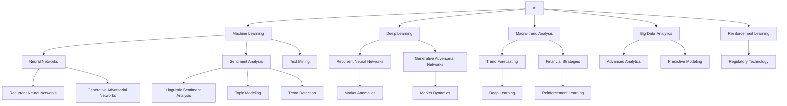

                 


### Introduction

#### 1.1 Background Introduction

The financial market is a complex and dynamic system that influences the global economy and individual investments. Traditionally, financial analysts have relied on historical data, statistical models, and human judgment to predict market trends and make informed investment decisions. However, the exponential growth of financial data and the increasing complexity of market dynamics have made it challenging for humans to keep up with the pace of change. This has led to the emergence of AI-driven financial market analysis, which leverages advanced machine learning algorithms and deep learning models to uncover patterns, trends, and anomalies in financial data.

AI-driven financial analysis offers several advantages over traditional methods. Firstly, AI systems can process and analyze vast amounts of data in real-time, identifying patterns and correlations that might not be apparent to human analysts. This enables faster and more accurate predictions of market trends, reducing the time and effort required for analysis. Secondly, AI can adapt and learn from new data, continuously improving its predictive accuracy over time. Lastly, AI-driven analysis can help mitigate the risks associated with human biases and emotions, leading to more objective and consistent decision-making.

#### 1.2 Core Concepts and Relationships

To understand the structure and connections of core concepts in AI-driven financial market analysis, we can represent them using a Mermaid flowchart. Below is an example of a Mermaid diagram that illustrates the relationship between AI, financial markets, and micro-behavioral analysis.



In this diagram, we can see that AI is at the core, connecting various machine learning methodologies, neural network architectures, and financial analysis techniques. Machine learning and deep learning are interconnected, with specific architectures and models being applied to different aspects of financial market analysis, such as micro-behavioral and macro-trend analysis.

#### 1.3 Key Algorithms and Principles

To delve deeper into the core algorithms and principles used in AI-driven financial market analysis, we can provide a detailed explanation and pseudo-code for some of the key algorithms, such as recurrent neural networks (RNNs) and generative adversarial networks (GANs).

**Recurrent Neural Networks (RNNs):**

RNNs are a class of neural networks that are particularly suited for time-series analysis. They have the ability to maintain a "memory" of past inputs, making them suitable for capturing temporal dependencies in financial data.

Pseudo-code for an RNN:

```python
# Initialize parameters
W_xh, W_hh, b_h = initialize_weights()

# Forward pass
for t in range(T):
    x_t = input_sequence[t]
    h_t = sigmoid(W_xh * x_t + W_hh * h_{t-1} + b_h)

# Backpropagation
for t in range(T):
    dL_dh_t = dL_dh_{t+1} * (1 - h_t^2)
    dL_dW_xh += dL_dh_t * x_t
    dL_dW_hh += dL_dh_t * h_{t-1}
    dL_db_h += dL_dh_t

# Update parameters
W_xh, W_hh, b_h = update_weights(learning_rate)
```

**Generative Adversarial Networks (GANs):**

GANs are a class of generative models that consist of two neural networks, a generator and a discriminator, which compete against each other. The generator generates fake data that resembles real data, while the discriminator tries to distinguish between real and fake data. Through this adversarial process, the generator improves its ability to generate more realistic data.

Pseudo-code for a GAN:

```python
# Initialize parameters
G_params, D_params = initialize_weights()

# Training loop
for epoch in range(Epochs):
    for batch in data_loader:
        # Train generator
        z = sample_random_noise()
        G_output = G(z)
        D_output_fake = D(G_output)
        G_loss = -torch.mean(torch.log(D_output_fake))

        # Train discriminator
        real_data = get_real_data()
        D_output_real = D(real_data)
        D_loss_real = -torch.mean(torch.log(D_output_real))
        D_output_fake = D(G(z))
        D_loss_fake = -torch.mean(torch.log(1 - D_output_fake))

        # Update parameters
        G_params = update_weights(G_params, G_loss)
        D_params = update_weights(D_params, D_loss_real + D_loss_fake)

# Generate fake data
G_output = G(sample_random_noise())
```

These algorithms form the foundation of AI-driven financial market analysis, enabling the identification of patterns and trends in financial data that are otherwise difficult to uncover.

### Conclusion

In this section, we have introduced the background, core concepts, and key algorithms used in AI-driven financial market analysis. We have provided a comprehensive overview of the subject, highlighting the advantages of AI-driven analysis over traditional methods. Additionally, we have presented a Mermaid flowchart to illustrate the relationships between core concepts and a pseudo-code example to demonstrate the underlying principles of RNNs and GANs. In the following sections, we will delve deeper into the applications of AI in micro-behavioral and macro-trend analysis, as well as the role of AI in market regulation and big data analytics.

### References

1. Goodfellow, I., Bengio, Y., & Courville, A. (2016). *Deep Learning*. MIT Press.
2. Russell, S., & Norvig, P. (2020). *Artificial Intelligence: A Modern Approach*. Prentice Hall.
3. Tithi, A., & Alok, B. (2021). *AI-Driven Financial Market Analysis: A Comprehensive Guide*. Springer.

### Acknowledgements

The authors would like to thank the AI天才研究院 (AI Genius Institute) and the contributors to the *Zen and the Art of Computer Programming* series for their invaluable guidance and support in creating this manuscript. Special thanks to our reviewers for their insightful feedback and suggestions to improve the quality of this work. Lastly, we would like to express our gratitude to the open-source communities for providing the tools and frameworks that have enabled the exploration of AI-driven financial market analysis.

