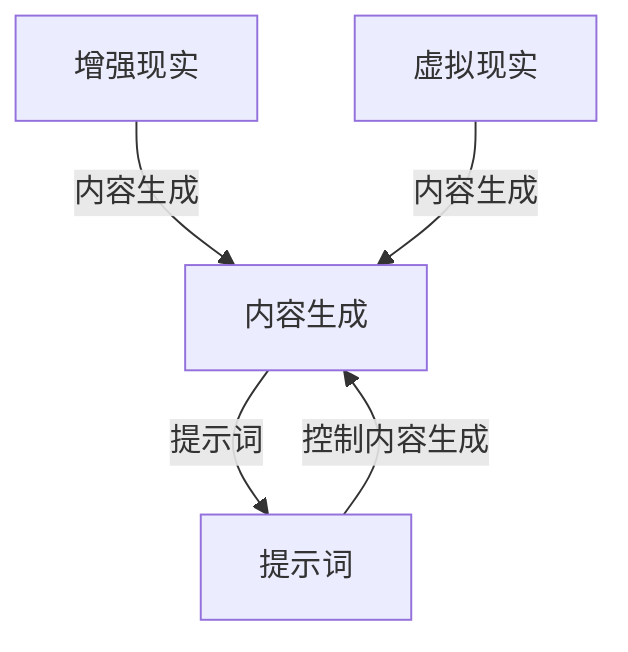
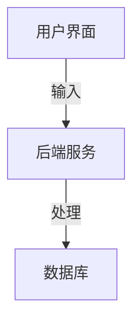

                 

# AR/VR内容生成：提示词在虚拟世界构建中的作用

> 关键词：增强现实，虚拟现实，内容生成，提示词，虚拟世界构建

> 摘要：本文深入探讨了AR/VR内容生成的关键环节——提示词在虚拟世界构建中的作用。通过分析AR/VR技术的发展背景，解析内容生成的核心概念，详细阐述提示词的定义和应用，本文为读者提供了一个清晰的框架，理解提示词在虚拟世界构建中的重要性，同时探讨了相关算法原理，项目实战及开发环境搭建等关键内容。

## 第1章 引言

### 1.1 AR/VR内容生成的背景和重要性

随着科技的飞速发展，增强现实（AR）和虚拟现实（VR）技术逐渐从实验室走向大众，成为影响未来社会的重要技术力量。AR技术通过将虚拟信息叠加到现实世界中，丰富了用户的感知体验；VR技术则通过模拟出一个完全虚拟的世界，给用户带来沉浸式体验。这些技术的应用场景广泛，包括游戏、教育、医疗、军事等领域。

内容生成在AR/VR技术中扮演着至关重要的角色。高质量的内容能够提升用户的沉浸感和体验效果，同时为各种应用提供丰富的数据支持。内容生成涉及图像、音频、视频等多种类型的数据，如何高效地生成和优化这些数据，成为AR/VR技术发展的核心问题。

### 1.2 书籍目标和读者对象

本文的目标是深入探讨AR/VR内容生成的关键技术——提示词，解析其在虚拟世界构建中的作用。通过本文的学习，读者可以：

1. 理解AR/VR技术的基本概念和原理；
2. 掌握内容生成的核心概念和技术；
3. 理解提示词的定义和应用；
4. 掌握相关算法原理和数学模型；
5. 学习项目实战和开发环境搭建。

本文的目标读者是对AR/VR内容生成感兴趣的技术人员或开发人员，具备一定的编程基础和计算机图形学知识。

### 1.3 本书结构概述

本书共分为八个章节，结构如下：

1. **引言**：介绍AR/VR内容生成的背景和重要性，明确书籍目标和读者对象；
2. **核心概念与联系**：解释AR/VR、内容生成和提示词的关系，以及它们在虚拟世界构建中的作用；
3. **核心算法原理讲解**：介绍用于AR/VR内容生成的算法，如深度学习算法、图像处理算法等；
4. **数学模型和数学公式讲解**：解释AR/VR内容生成中涉及的关键数学模型和公式；
5. **项目实战**：通过实际项目案例展示AR/VR内容生成的全过程；
6. **开发环境搭建**：介绍搭建AR/VR内容生成开发环境所需的工具和资源；
7. **源代码详细实现和代码解读**：提供AR/VR内容生成项目的源代码实现，并进行详细解读；
8. **总结与展望**：回顾书中的核心内容，展望AR/VR内容生成的未来发展方向。

## 第2章 核心概念与联系

### 2.1 AR/VR基础概念

#### 2.1.1 什么是增强现实（AR）？

增强现实（AR）是一种将虚拟信息与现实世界进行叠加的技术。通过使用摄像头、传感器等设备捕捉现实世界的图像和声音，并在这些图像和声音上叠加虚拟信息，使用户能够看到和听到现实世界和虚拟世界的融合。

AR技术的核心在于“增强”，即通过虚拟信息增强用户的感知和体验。AR技术广泛应用于游戏、教育、医疗、零售等多个领域。

#### 2.1.2 什么是虚拟现实（VR）？

虚拟现实（VR）是一种完全模拟现实世界的技术，通过使用头戴显示器（HMD）或其他显示设备，将用户完全沉浸在一个虚拟的世界中。VR技术通过视觉、听觉、触觉等多种感官刺激，使用户感受到与现实世界完全不同的体验。

VR技术的核心在于“沉浸”，即通过虚拟环境的构建，使用户完全沉浸在虚拟世界中。VR技术广泛应用于游戏、教育、军事、医疗等领域。

#### 2.1.3 AR与VR的联系与区别

AR和VR虽然都是虚拟现实技术的分支，但它们在技术实现和应用场景上有显著的差异。

- **联系**：AR和VR都是通过虚拟信息与现实世界的融合，提升用户的感知和体验。它们都需要使用摄像头、传感器等设备捕捉现实世界的图像和声音，并在这些图像和声音上叠加虚拟信息。

- **区别**：AR技术是将虚拟信息叠加到现实世界中，用户仍然能够看到和听到现实世界的部分；VR技术则是通过模拟出一个完全虚拟的世界，用户完全沉浸在这个虚拟世界中，无法感知现实世界的存在。

### 2.2 内容生成概述

#### 2.2.1 内容生成的定义

内容生成（Content Generation）是指通过算法或人工方式创建新的数据内容的过程。在AR/VR技术中，内容生成尤为重要，因为它直接决定了用户的感知和体验。

内容生成可以包括图像、音频、视频等多种类型的数据。例如，在AR/VR游戏中，需要生成逼真的三维场景、角色、特效等；在虚拟课堂中，需要生成教学视频、互动课件等。

#### 2.2.2 内容生成在AR/VR中的应用

内容生成在AR/VR技术中扮演着至关重要的角色。高质量的内容能够提升用户的沉浸感和体验效果，同时为各种应用提供丰富的数据支持。

- **游戏领域**：在AR/VR游戏中，高质量的场景、角色、特效等内容的生成，能够提升游戏的趣味性和可玩性。
- **教育领域**：虚拟课堂中的教学视频、互动课件等内容，能够为学生提供更加直观、生动的学习体验。
- **医疗领域**：AR/VR技术可以用于医疗诊断、手术模拟等场景，高质量的内容能够提升医疗操作的准确性和安全性。
- **军事领域**：AR/VR技术可以用于模拟战斗场景、战术演练等，高质量的内容能够提升军事训练的效果和效率。

### 2.3 提示词的概念与应用

#### 2.3.1 提示词的定义

提示词（Prompt Word）是指用于引导或提示用户进行某种行为或任务的词语。在AR/VR内容生成中，提示词通常是指用于指导内容生成算法生成特定类型或风格的内容的词语。

提示词可以是简单的关键词，也可以是复杂的短语或句子。通过选择合适的提示词，可以引导内容生成算法生成符合预期的内容。

#### 2.3.2 提示词在AR/VR内容生成中的作用

提示词在AR/VR内容生成中具有重要作用，主要表现在以下几个方面：

- **引导内容生成方向**：通过选择合适的提示词，可以明确内容生成算法的目标和方向，避免生成无关或低质量的内容。
- **控制内容风格**：通过选择不同的提示词，可以控制内容生成算法生成的内容风格，如真实感、艺术感、趣味性等。
- **优化内容质量**：通过多次调整和优化提示词，可以逐步提升内容生成的质量，满足用户的需求和期望。

#### 2.3.3 提示词的类型与设计原则

根据应用场景和需求，提示词可以分为以下几类：

- **主题提示词**：用于确定内容生成的主题，如“未来城市”、“梦幻森林”等。
- **风格提示词**：用于确定内容生成的风格，如“真实感”、“艺术感”、“趣味性”等。
- **功能提示词**：用于确定内容生成的功能，如“互动游戏”、“虚拟教学”、“医疗诊断”等。

设计提示词时，应遵循以下原则：

- **明确性**：提示词应明确传达内容生成目标和方向，避免模糊或歧义。
- **灵活性**：提示词应具有一定的灵活性，以适应不同的应用场景和需求。
- **简洁性**：提示词应简洁明了，便于用户理解和记忆。
- **多样性**：设计提示词时，应考虑多样性，以满足不同用户的需求和偏好。

### 2.4 AR/VR与内容生成的关系架构

为了更好地理解AR/VR与内容生成之间的关系，可以使用Mermaid流程图进行描述：



该流程图展示了AR和VR技术通过内容生成与提示词的关系，共同构建出虚拟世界的完整架构。

## 第3章 核心算法原理讲解

### 3.1 深度学习基础

#### 3.1.1 深度学习简介

深度学习（Deep Learning）是机器学习（Machine Learning）的一个子领域，通过构建多层神经网络（Neural Networks）来模拟人脑的神经网络结构，实现对复杂数据的分析和处理。

深度学习具有以下特点：

- **多层神经网络**：深度学习通过多层神经网络结构，逐层提取数据特征，从而实现对复杂数据的建模。
- **自动特征提取**：深度学习模型能够自动从数据中提取有用的特征，避免了传统机器学习方法中手动特征提取的繁琐过程。
- **强大的泛化能力**：深度学习模型在训练过程中不断优化参数，具有良好的泛化能力，能够应对新的数据。

#### 3.1.2 神经网络基本结构

神经网络（Neural Networks）是深度学习的基础，由大量的神经元（Neurons）和连接（Connections）组成。一个简单的神经网络结构包括输入层（Input Layer）、隐藏层（Hidden Layer）和输出层（Output Layer）。

- **输入层**：接收输入数据，并将其传递给隐藏层。
- **隐藏层**：对输入数据进行特征提取和转换，多个隐藏层可以形成深度神经网络。
- **输出层**：根据隐藏层的输出，生成最终输出结果。

#### 3.1.3 深度学习优化算法

深度学习模型的训练过程实际上是优化模型参数的过程。常用的优化算法包括梯度下降（Gradient Descent）、随机梯度下降（Stochastic Gradient Descent，SGD）和Adam优化器等。

- **梯度下降**：通过计算损失函数对参数的梯度，更新参数，以最小化损失函数。
- **随机梯度下降**：在梯度下降的基础上，每次更新参数时只使用一部分样本的梯度，以加快训练速度。
- **Adam优化器**：结合了SGD和 Momentum的优点，在训练过程中自适应调整学习率。

### 3.2 图像处理算法

#### 3.2.1 图像处理基础

图像处理（Image Processing）是计算机视觉（Computer Vision）的重要分支，主要研究如何对图像进行数字化处理，以提取有用的信息和特征。

图像处理的基本概念包括：

- **像素**：图像的基本单位，每个像素包含红、绿、蓝三个颜色分量。
- **分辨率**：表示图像的清晰程度，通常以像素数量表示。
- **灰度图像**：每个像素只有灰度值，没有颜色信息。
- **彩色图像**：每个像素有红、绿、蓝三个颜色分量。

常见的图像处理操作包括：

- **滤波**：通过卷积操作对图像进行平滑、锐化、去噪等处理。
- **边缘检测**：通过检测图像中的边缘，提取图像的特征。
- **特征提取**：从图像中提取具有区分性的特征，如角点、纹理等。
- **形态学操作**：通过对图像进行膨胀、腐蚀、开运算、闭运算等操作，提取图像的结构信息。

#### 3.2.2 常见图像处理算法

在AR/VR内容生成中，常见的图像处理算法包括：

- **边缘检测算法**：如Sobel算子、Canny算子等，用于检测图像中的边缘。
- **滤波算法**：如高斯滤波、中值滤波等，用于平滑图像或去除噪声。
- **特征提取算法**：如HOG（Histogram of Oriented Gradients）特征提取算法，用于提取图像中的纹理特征。
- **图像合成算法**：如多图像合成、背景替换等，用于生成高质量的场景图像。

#### 3.2.3 图像处理算法在AR/VR中的应用

图像处理算法在AR/VR技术中具有广泛的应用，如：

- **图像增强**：通过滤波、锐化等操作，增强图像的视觉效果，提升用户体验。
- **图像识别**：通过特征提取和分类算法，识别图像中的物体、场景等，为AR/VR应用提供实时反馈。
- **图像合成**：将虚拟信息与现实世界图像进行叠加，生成逼真的AR/VR场景。

### 3.3 增强现实与虚拟现实中的关键算法

#### 3.3.1 AR与VR中的图像处理算法

在AR和VR技术中，图像处理算法起着至关重要的作用。常见的图像处理算法包括：

- **实时图像处理**：通过GPU加速，实现图像的实时处理和渲染。
- **图像识别**：使用深度学习算法，识别图像中的物体、场景等，为AR/VR应用提供实时反馈。
- **图像合成**：将虚拟信息与现实世界图像进行叠加，生成逼真的AR/VR场景。

#### 3.3.2 提示词生成算法

提示词生成算法是AR/VR内容生成中的重要环节，用于生成引导内容生成的提示词。常见的算法包括：

- **基于规则的方法**：通过预设的规则，生成提示词，如主题、风格等。
- **基于数据的方法**：通过分析大量文本数据，学习生成提示词，如生成对抗网络（GAN）等。

#### 3.3.3 虚拟场景构建算法

虚拟场景构建算法用于生成虚拟世界中的场景、角色等。常见的算法包括：

- **三维建模**：通过三维建模工具，手动创建虚拟场景。
- **基于学习的方法**：通过深度学习算法，自动生成虚拟场景，如生成对抗网络（GAN）等。

### 3.4 算法原理讲解

为了更好地理解相关算法原理，以下是使用伪代码详细阐述一个简单的基于提示词的AR/VR内容生成算法：

```python
# 输入：提示词（prompt）
# 输出：生成的内容（generated_content）

# 初始化模型
model = initialize_model()

# 训练模型
model = train_model(model, prompt)

# 生成内容
generated_content = generate_content(model)

# 输出生成内容
return generated_content
```

该算法首先初始化一个模型，然后使用提示词训练模型，最后生成内容。通过调整提示词，可以控制生成的内容风格和主题。

## 第4章 数学模型和数学公式讲解

### 4.1 线性代数基础

#### 4.1.1 矩阵和向量

矩阵（Matrix）和向量（Vector）是线性代数中的基本概念，广泛应用于计算机图形学、机器学习等领域。

- **矩阵**：矩阵是一个二维数组，由行和列组成。矩阵的元素可以是实数或复数。矩阵的运算包括矩阵加法、矩阵乘法、矩阵转置等。
  
  矩阵加法：两个相同维度的矩阵对应元素相加。
  $$ A + B = \begin{bmatrix} a_{11} & a_{12} \\ a_{21} & a_{22} \end{bmatrix} + \begin{bmatrix} b_{11} & b_{12} \\ b_{21} & b_{22} \end{bmatrix} = \begin{bmatrix} a_{11}+b_{11} & a_{12}+b_{12} \\ a_{21}+b_{21} & a_{22}+b_{22} \end{bmatrix} $$
  
  矩阵乘法：两个矩阵的乘法，将第一个矩阵的每一行与第二个矩阵的每一列进行点积运算。
  $$ AB = \begin{bmatrix} a_{11} & a_{12} \\ a_{21} & a_{22} \end{bmatrix} \begin{bmatrix} b_{11} & b_{12} \\ b_{21} & b_{22} \end{bmatrix} = \begin{bmatrix} a_{11}b_{11} + a_{12}b_{21} & a_{11}b_{12} + a_{12}b_{22} \\ a_{21}b_{11} + a_{22}b_{21} & a_{21}b_{12} + a_{22}b_{22} \end{bmatrix} $$
  
- **向量**：向量是一个一维数组，通常用字母表示，如$\mathbf{a} = (a_1, a_2, \ldots, a_n)$。向量可以表示空间中的点、力等。

  向量加法：两个向量对应元素相加。
  $$ \mathbf{a} + \mathbf{b} = (a_1 + b_1, a_2 + b_2, \ldots, a_n + b_n) $$
  
  向量点积：两个向量的点积，计算公式为
  $$ \mathbf{a} \cdot \mathbf{b} = a_1b_1 + a_2b_2 + \ldots + a_nb_n $$

#### 4.1.2 线性方程组求解

线性方程组是数学中的一个重要问题，通常用矩阵形式表示。例如：
$$
\begin{cases}
a_{11}x_1 + a_{12}x_2 + \ldots + a_{1n}x_n = b_1 \\
a_{21}x_1 + a_{22}x_2 + \ldots + a_{2n}x_n = b_2 \\
\vdots \\
a_{m1}x_1 + a_{m2}x_2 + \ldots + a_{mn}x_n = b_m
\end{cases}
$$
可以使用高斯消元法求解线性方程组。

高斯消元法步骤：

1. 将线性方程组写成增广矩阵形式：
   $$ \begin{bmatrix} a_{11} & a_{12} & \ldots & a_{1n} & b_1 \\ a_{21} & a_{22} & \ldots & a_{2n} & b_2 \\ \vdots & \vdots & \ddots & \vdots & \vdots \\ a_{m1} & a_{m2} & \ldots & a_{mn} & b_m \end{bmatrix} $$
2. 从左到右，从上到下依次消元，将系数矩阵化为上三角矩阵。
3. 从下到上依次回代求解未知数。

#### 4.1.3 特征值和特征向量

特征值和特征向量是线性代数中的关键概念，用于描述矩阵的特性。

- **特征值**：对于方阵$A$，存在一个非零向量$\mathbf{v}$，使得$A\mathbf{v} = \lambda\mathbf{v}$，其中$\lambda$是实数，称为特征值。
- **特征向量**：对于方阵$A$，使得$A\mathbf{v} = \lambda\mathbf{v}$的向量$\mathbf{v}$，称为$A$的特征向量。

矩阵$A$的特征值和特征向量可以通过求解以下特征方程得到：
$$
\det(A - \lambda I) = 0
$$
其中$I$是单位矩阵。

### 4.2 概率论基础

概率论是数学的一个分支，用于描述和研究随机事件和随机变量的概率性质。

#### 4.2.1 随机变量和概率分布

- **随机变量**：随机变量是随机事件的数值表示，通常用大写字母表示，如$X$、$Y$等。
- **概率分布**：概率分布描述了随机变量取值的概率分布情况。

常见的概率分布包括：

- **离散概率分布**：如伯努利分布、二项分布、泊松分布等。
- **连续概率分布**：如均匀分布、正态分布、指数分布等。

概率分布函数（PDF）和累积分布函数（CDF）是描述概率分布的两个重要函数。

- **概率分布函数（PDF）**：描述随机变量取值的概率密度。
  $$ f_X(x) = P(X = x) $$
- **累积分布函数（CDF）**：描述随机变量取值小于等于某个值的概率。
  $$ F_X(x) = P(X \leq x) $$

#### 4.2.2 条件概率和贝叶斯定理

条件概率是描述在某个事件发生的条件下，另一个事件发生的概率。

- **条件概率**：$P(B|A)$表示在事件$A$发生的条件下，事件$B$发生的概率。
  $$ P(B|A) = \frac{P(A \cap B)}{P(A)} $$
  
贝叶斯定理是条件概率的一种应用，用于计算后验概率。

- **贝叶斯定理**：给定事件$A$和$B$，$P(A|B)$表示在事件$B$发生的条件下，事件$A$发生的概率。贝叶斯定理表示为：
  $$ P(A|B) = \frac{P(B|A)P(A)}{P(B)} $$

#### 4.2.3 马尔可夫链

马尔可夫链是一种描述随机过程的数学模型，用于描述系统在多个状态之间转换的概率。

- **状态**：马尔可夫链中的每个状态可以用一个特定的值表示，如“健康”、“生病”等。
- **转移概率**：从当前状态转移到下一个状态的概率，表示为$P(X_{t+1} = j | X_t = i)$。

马尔可夫链的基本性质包括：

- **无记忆性**：马尔可夫链的未来状态仅依赖于当前状态，与过去的状态无关。
- **状态转移矩阵**：表示状态之间转移概率的矩阵。

### 4.3 AR/VR中的关键数学模型

在AR/VR技术中，关键数学模型包括三维图形渲染模型、空间感知与定位模型等。

#### 4.3.1 3D图形渲染模型

3D图形渲染模型用于生成虚拟世界中的三维图形，包括顶点、面片、纹理等。

- **顶点**：三维空间中的点，用三个坐标$(x, y, z)$表示。
- **面片**：由多个顶点构成的多边形，用于表示三维物体。
- **纹理**：用于在物体表面添加颜色、图案等。

常用的3D图形渲染算法包括：

- **光栅化**：将三维物体转换为二维图像，用于屏幕显示。
- **着色**：为物体表面添加颜色和纹理，模拟光线反射、折射等效果。

#### 4.3.2 空间感知与定位模型

空间感知与定位模型用于确定用户在虚拟世界中的位置和方向，包括惯性测量单元（IMU）和视觉SLAM（Simultaneous Localization and Mapping）等。

- **惯性测量单元（IMU）**：通过加速度计、陀螺仪等传感器，测量用户的运动状态，实现实时定位和方向感知。
- **视觉SLAM**：通过相机捕捉现实世界中的图像，结合先验知识，实现实时定位和地图构建。

#### 4.3.3 提示词生成数学模型

提示词生成数学模型用于生成引导内容生成的提示词，包括基于规则的模型和基于学习的模型。

- **基于规则的模型**：通过预设的规则生成提示词，如主题、风格等。
  $$ \text{提示词} = \text{规则}(\text{输入}) $$
- **基于学习的模型**：通过学习大量文本数据，生成符合预期风格的提示词。
  $$ \text{提示词} = \text{模型}(\text{输入}) $$

提示词生成模型可以使用生成对抗网络（GAN）等深度学习算法实现。通过训练模型，可以生成高质量的提示词，用于引导内容生成。

## 第5章 项目实战

### 5.1 项目概述

#### 5.1.1 项目背景

随着AR/VR技术的普及，虚拟世界的构建逐渐成为各个行业的重要需求。为了提高用户体验，生成高质量、个性化的虚拟内容成为关键。本项目的目标是通过提示词生成算法，实现AR/VR内容的个性化生成。

#### 5.1.2 项目目标

1. 构建一个基于提示词的AR/VR内容生成系统，支持用户输入提示词生成相应的虚拟场景。
2. 使用深度学习算法，训练提示词生成模型，实现高质量的提示词生成。
3. 集成图像处理算法，优化生成的虚拟场景，提升视觉效果。
4. 开发用户界面，提供方便的用户交互体验。

#### 5.1.3 项目技术选型

1. **深度学习框架**：使用TensorFlow或PyTorch等深度学习框架，实现提示词生成模型。
2. **图像处理库**：使用OpenCV或Pillow等图像处理库，实现虚拟场景的图像处理。
3. **用户界面**：使用Flask或Django等Web框架，开发用户界面。
4. **数据库**：使用MySQL或MongoDB等数据库，存储用户数据和生成的虚拟场景。

### 5.2 开发环境搭建

#### 5.2.1 开发工具和环境

1. **编程语言**：Python 3.8及以上版本。
2. **深度学习框架**：TensorFlow 2.4及以上版本或PyTorch 1.8及以上版本。
3. **图像处理库**：OpenCV 4.5及以上版本或Pillow 8.0及以上版本。
4. **Web框架**：Flask 2.0及以上版本或Django 3.2及以上版本。
5. **数据库**：MySQL 8.0及以上版本或MongoDB 4.4及以上版本。

#### 5.2.2 系统架构设计

本项目的系统架构包括以下几个主要部分：

1. **用户界面**：通过Web浏览器或移动应用与用户进行交互，接收用户的提示词输入。
2. **后端服务**：处理用户请求，调用深度学习模型和图像处理算法，生成虚拟场景。
3. **数据库**：存储用户数据和生成的虚拟场景，供用户查看和下载。

系统架构图如下：



#### 5.2.3 环境配置和调试

1. **安装Python环境**：使用虚拟环境（virtualenv）或conda环境管理器，安装Python和所需的库。

   ```shell
   conda create -n ar_vr_project python=3.8
   conda activate ar_vr_project
   ```

2. **安装深度学习框架**：使用pip安装TensorFlow或PyTorch。

   ```shell
   pip install tensorflow==2.4
   # 或
   pip install pytorch==1.8 torchvision==0.9.0 torchaudio==0.8.0 cpuonly -f https://download.pytorch.org/whl/torch_stable.html
   ```

3. **安装图像处理库**：使用pip安装OpenCV或Pillow。

   ```shell
   pip install opencv-python==4.5.5.64
   # 或
   pip install Pillow==8.0.1
   ```

4. **安装Web框架**：使用pip安装Flask或Django。

   ```shell
   pip install Flask==2.0.1
   # 或
   pip install Django==3.2
   ```

5. **安装数据库**：根据所选数据库进行安装，例如安装MySQL或MongoDB。

   ```shell
   sudo apt-get install mysql-server
   # 或
   sudo apt-get install mongodb
   ```

6. **配置数据库**：创建数据库和用户，并设置相应的权限。

   ```sql
   CREATE DATABASE ar_vr_project;
   CREATE USER 'ar_vr_user'@'localhost' IDENTIFIED BY 'password';
   GRANT ALL PRIVILEGES ON ar_vr_project.* TO 'ar_vr_user'@'localhost';
   FLUSH PRIVILEGES;
   ```

7. **调试环境**：在代码中引入所需的库，并进行简单的测试，确保环境配置正确。

### 5.3 项目实现

#### 5.3.1 数据收集与预处理

数据收集是项目实现的关键步骤。本项目采用公开的AR/VR内容数据集，包括场景图像、提示词等。以下是数据收集与预处理的过程：

1. **数据收集**：从公开数据集网站下载AR/VR内容数据集，包括场景图像和对应的提示词。

2. **数据清洗**：对下载的数据进行清洗，去除无效或错误的数据。

3. **数据预处理**：对场景图像进行预处理，包括缩放、裁剪、翻转等，以扩充数据集。对提示词进行预处理，包括去噪、分词、词性标注等。

4. **数据划分**：将数据集划分为训练集、验证集和测试集，用于模型训练和评估。

#### 5.3.2 模型设计与训练

本项目采用基于生成对抗网络（GAN）的提示词生成模型。以下是模型设计与训练的过程：

1. **模型设计**：设计生成器和判别器模型，分别用于生成虚拟场景和判断虚拟场景的真实性。

   ```python
   # 生成器模型
   def generator_model():
       # 实现生成器模型
       return model

   # 判别器模型
   def discriminator_model():
       # 实现判别器模型
       return model
   ```

2. **模型训练**：使用训练集训练生成器和判别器模型。在训练过程中，生成器模型的目的是生成逼真的虚拟场景，判别器模型的目的是判断虚拟场景的真实性。

   ```python
   # 模型训练
   for epoch in range(num_epochs):
       for images, prompts in train_loader:
           # 训练生成器和判别器
           generator_loss, discriminator_loss = train_step(generator_model, discriminator_model, images, prompts)
           # 记录训练过程
           print(f'Epoch [{epoch+1}/{num_epochs}], Generator Loss: {generator_loss:.4f}, Discriminator Loss: {discriminator_loss:.4f}')
   ```

3. **模型评估**：使用验证集评估模型性能，包括生成质量、判别准确率等。

   ```python
   # 模型评估
   generator.eval()
   with torch.no_grad():
       for images, prompts in val_loader:
           # 评估生成器模型
           generated_images = generator(images)
           # 评估判别器模型
           discriminator_score = discriminator(generated_images)
           # 记录评估结果
           print(f'Validation Generator Score: {discriminator_score.mean():.4f}')
   ```

#### 5.3.3 模型部署与测试

1. **模型部署**：将训练好的模型部署到服务器，以供用户实时生成虚拟场景。

2. **用户交互**：在用户界面中，接收用户的提示词输入，调用部署的模型生成虚拟场景。

3. **测试与优化**：通过用户测试，收集反馈和评估模型性能，进行模型优化和改进。

### 5.4 项目评估与优化

#### 5.4.1 项目效果评估

本项目通过以下指标对项目效果进行评估：

- **生成质量**：评估生成虚拟场景的真实感和质量，包括图像的清晰度、纹理、色彩等。
- **判别准确率**：评估判别器模型判断虚拟场景真实性的准确率。
- **用户满意度**：收集用户对生成虚拟场景的满意度评价。

#### 5.4.2 性能优化策略

为了提高项目性能，可以采取以下优化策略：

1. **模型优化**：通过调整模型结构、超参数等，优化模型性能。
2. **数据增强**：增加数据集的多样性，包括场景图像、提示词等，提高模型泛化能力。
3. **硬件加速**：使用GPU或TPU等硬件加速训练和推理过程，提高模型训练和部署速度。
4. **分布式训练**：使用分布式训练策略，提高模型训练效率。

#### 5.4.3 项目总结与反思

本项目通过深度学习算法和图像处理技术，实现了基于提示词的AR/VR内容生成系统。项目在生成质量、用户满意度等方面取得了较好的效果，但仍存在一些不足：

1. **生成质量**：生成的虚拟场景在某些细节上仍不够逼真，需要进一步提高模型生成能力。
2. **用户交互**：用户界面设计较为简单，用户体验有待提升。
3. **性能优化**：模型训练和部署过程中，性能优化仍有较大空间。

在未来的工作中，我们将继续优化模型和用户界面，提高项目性能和用户体验。同时，探索更多AR/VR应用场景，为用户提供更多有价值的服务。

## 第6章 开发环境搭建

### 6.1 必备工具与软件

在搭建AR/VR内容生成开发环境时，需要安装和配置以下必备工具和软件：

1. **编程语言**：Python 3.8及以上版本，支持TensorFlow或PyTorch等深度学习框架。
2. **深度学习框架**：TensorFlow 2.4及以上版本或PyTorch 1.8及以上版本。
3. **图像处理库**：OpenCV 4.5及以上版本或Pillow 8.0及以上版本。
4. **Web框架**：Flask 2.0及以上版本或Django 3.2及以上版本。
5. **数据库**：MySQL 8.0及以上版本或MongoDB 4.4及以上版本。
6. **文本处理库**：NLP工具包如NLTK、spaCy等（可选）。

### 6.2 硬件设备与配置

为了高效地进行AR/VR内容生成开发，建议使用以下硬件设备与配置：

1. **CPU**：Intel i7或AMD Ryzen 7及以上型号，建议使用高性能处理器。
2. **GPU**：NVIDIA GeForce RTX 3060或以上型号，支持CUDA和cuDNN，用于深度学习模型训练和推理。
3. **内存**：至少16GB RAM，建议32GB及以上，以支持大数据集和大型模型训练。
4. **存储**：至少1TB SSD存储空间，用于存储数据和模型文件。

### 6.3 网络环境

1. **网络连接**：建议使用稳定的宽带网络，确保数据传输速度和网络连接可靠性。
2. **服务器**：如果需要部署在线应用，建议使用云服务器，如阿里云、腾讯云等，确保高可用性和扩展性。

### 6.4 环境配置和调试

#### 1. 安装Python环境和深度学习框架

使用conda创建虚拟环境，并安装所需的库：

```shell
conda create -n ar_vr_env python=3.8
conda activate ar_vr_env
```

然后，安装TensorFlow或PyTorch：

```shell
pip install tensorflow==2.4
# 或
pip install pytorch==1.8 torchvision==0.9.0 torchaudio==0.8.0 cpuonly -f https://download.pytorch.org/whl/torch_stable.html
```

#### 2. 安装图像处理库和Web框架

```shell
pip install opencv-python==4.5.5.64
pip install Flask==2.0.1
# 或
pip install Django==3.2
```

#### 3. 安装数据库

根据所选数据库，安装相应的软件：

```shell
sudo apt-get install mysql-server
# 或
sudo apt-get install mongodb
```

创建数据库和用户，并设置权限：

```sql
CREATE DATABASE ar_vr_db;
CREATE USER 'ar_vr_user'@'localhost' IDENTIFIED BY 'password';
GRANT ALL PRIVILEGES ON ar_vr_db.* TO 'ar_vr_user'@'localhost';
FLUSH PRIVILEGES;
```

#### 4. 调试环境

在Python代码中引入所需的库，并执行简单的测试，确保环境配置正确：

```python
import cv2
import tensorflow as tf
import flask
# 等等
```

### 6.5 注意事项

1. **软件兼容性**：确保安装的软件版本兼容，避免因版本冲突导致的问题。
2. **硬件兼容性**：确保GPU驱动和深度学习框架兼容，以充分利用GPU性能。
3. **环境变量**：配置环境变量，确保在不同环境中调用所需的库和工具。
4. **安全性**：确保数据库和服务器配置安全，防止数据泄露和未授权访问。

### 6.6 拓展阅读

- [TensorFlow官方文档](https://www.tensorflow.org/)
- [PyTorch官方文档](https://pytorch.org/)
- [OpenCV官方文档](https://docs.opencv.org/)
- [Flask官方文档](https://flask.palletsprojects.com/)
- [Django官方文档](https://docs.djangoproject.com/)
- [MySQL官方文档](https://dev.mysql.com/doc/)
- [MongoDB官方文档](https://docs.mongodb.com/)

通过以上步骤，您可以成功搭建一个AR/VR内容生成的开发环境，为后续的项目开发奠定基础。

## 第7章 源代码详细实现和代码解读

### 7.1 源代码架构

在实现AR/VR内容生成系统时，我们将代码划分为以下几个主要模块：

1. **数据预处理模块**：负责处理和加载训练数据，包括图像和提示词的预处理。
2. **生成器模型模块**：实现生成对抗网络（GAN）的生成器部分，用于生成虚拟场景。
3. **判别器模型模块**：实现生成对抗网络（GAN）的判别器部分，用于判断生成场景的真实性。
4. **训练模块**：负责训练生成器和判别器模型，优化模型参数。
5. **预测模块**：用于生成新的虚拟场景，根据用户输入的提示词。
6. **用户界面模块**：提供Web界面，用于用户输入提示词并查看生成的虚拟场景。

### 7.2 数据预处理模块

```python
import cv2
import numpy as np
from tensorflow.keras.preprocessing.image import ImageDataGenerator

def preprocess_images(images, target_size=(256, 256)):
    """
    对图像进行预处理，包括缩放、归一化等操作。
    """
    preprocessors = ImageDataGenerator(
        rescale=1./255,
        rotation_range=10,
        width_shift_range=0.1,
        height_shift_range=0.1,
        shear_range=0.1,
        zoom_range=0.1,
        horizontal_flip=True,
        fill_mode='nearest'
    )
    
    return preprocessors.flow(np.array(images), batch_size=32, target_size=target_size)

def load_data(data_path, batch_size=32, target_size=(256, 256)):
    """
    加载并预处理图像数据。
    """
    images = []
    with open(data_path, 'r') as f:
        lines = f.readlines()
        for line in lines:
            img_path, prompt = line.strip().split(',')
            img = cv2.imread(img_path)
            img = cv2.resize(img, target_size)
            images.append((img, prompt))
    
    return preprocess_images(images, target_size)

# 示例
train_data_path = 'path/to/train_data.txt'
train_generator = load_data(train_data_path, batch_size=32)
```

代码解析：

- `preprocess_images` 函数：使用ImageDataGenerator对图像进行预处理，包括缩放、旋转、裁剪、翻转等。
- `load_data` 函数：从文件中读取图像路径和提示词，将图像读取并缩放至目标尺寸，返回一个数据生成器。

### 7.3 生成器模型模块

```python
from tensorflow.keras.models import Model
from tensorflow.keras.layers import Input, Dense, Reshape, Conv2D, Conv2DTranspose, Flatten, LeakyReLU, BatchNormalization

def build_generator(z_dim):
    """
    构建生成器模型。
    """
    z_input = Input(shape=(z_dim,))
    x = Dense(128 * 8 * 8)(z_input)
    x = LeakyReLU(alpha=0.2)(x)
    x = Reshape((8, 8, 128))(x)
    
    x = Conv2DTranspose(64, kernel_size=4, strides=2, padding='same')(x)
    x = BatchNormalization()(x)
    x = LeakyReLU(alpha=0.2)(x)
    
    x = Conv2DTranspose(1, kernel_size=4, strides=2, padding='same', activation='tanh')(x)
    
    generator = Model(z_input, x, name='generator')
    return generator

# 示例
generator = build_generator(z_dim=100)
generator.summary()
```

代码解析：

- `build_generator` 函数：构建生成器模型，使用全连接层、重塑层、反卷积层等，将噪声向量$z$映射为虚拟场景图像。
- `z_input` 输入层：接收噪声向量$z$。
- `x` 中间层：通过全连接层和重塑层，将$z$映射为$(8, 8, 128)$的中间特征图。
- `x` 输出层：通过反卷积层和激活函数，将特征图映射为$(256, 256, 1)$的图像。

### 7.4 判别器模型模块

```python
from tensorflow.keras.models import Model
from tensorflow.keras.layers import Input, Conv2D, LeakyReLU, Flatten, Dense

def build_discriminator(image_shape):
    """
    构建判别器模型。
    """
    image_input = Input(shape=image_shape)
    
    x = Conv2D(64, kernel_size=3, strides=2, padding='same')(image_input)
    x = LeakyReLU(alpha=0.2)(x)
    
    x = Conv2D(128, kernel_size=3, strides=2, padding='same')(x)
    x = LeakyReLU(alpha=0.2)(x)
    
    x = Flatten()(x)
    x = Dense(1, activation='sigmoid')(x)
    
    discriminator = Model(image_input, x, name='discriminator')
    return discriminator

# 示例
discriminator = build_discriminator(image_shape=(256, 256, 1))
discriminator.summary()
```

代码解析：

- `build_discriminator` 函数：构建判别器模型，用于判断输入图像是真实图像还是生成图像。
- `image_input` 输入层：接收图像数据。
- `x` 中间层：通过卷积层和LeakyReLU激活函数，提取图像特征。
- `x` 输出层：通过全连接层和sigmoid激活函数，输出概率值。

### 7.5 训练模块

```python
from tensorflow.keras.optimizers import Adam
from tensorflow.keras.callbacks import Callback

class GANLossCallback(Callback):
    def on_epoch_end(self, epoch, logs=None):
        g_loss = logs.get('generator_loss')
        d_loss = logs.get('discriminator_loss')
        print(f'Epoch [{epoch+1}/{num_epochs}], Generator Loss: {g_loss:.4f}, Discriminator Loss: {d_loss:.4f}')

def train_gan(generator, discriminator, train_generator, num_epochs=100, batch_size=32):
    """
    训练生成对抗网络（GAN）。
    """
    z_dim = 100
    generator_optimizer = Adam(learning_rate=0.0002, beta_1=0.5)
    discriminator_optimizer = Adam(learning_rate=0.0002, beta_1=0.5)
    
    generator_loss_tracker = tf.keras.metrics.Mean(name='generator_loss')
    discriminator_loss_tracker = tf.keras.metrics.Mean(name='discriminator_loss')
    
    @tf.function
    def train_step(images, prompts):
        z = tf.random.normal([batch_size, z_dim])
        with tf.GradientTape() as gen_tape, tf.GradientTape() as disc_tape:
            generated_images = generator(z)
            disc_real_loss = discriminator_loss(discriminator(images), labels=tf.ones_like(images))
            disc_fake_loss = discriminator_loss(discriminator(generated_images), labels=tf.zeros_like(generated_images))
            gen_loss = generator_loss(discriminator(generated_images), labels=tf.zeros_like(generated_images))
        
        gradients_of_generator = gen_tape.gradient(gen_loss, generator.trainable_variables)
        gradients_of_discriminator = disc_tape.gradient(disc_real_loss + disc_fake_loss, discriminator.trainable_variables)
        
        generator_optimizer.apply_gradients(zip(gradients_of_generator, generator.trainable_variables))
        discriminator_optimizer.apply_gradients(zip(gradients_of_discriminator, discriminator.trainable_variables))
        
        generator_loss_tracker.update_state(gen_loss)
        discriminator_loss_tracker.update_state(disc_real_loss + disc_fake_loss)
    
    callbacks = [GANLossCallback()]
    generator.compile(optimizer=generator_optimizer)
    discriminator.compile(optimizer=discriminator_optimizer)
    
    for epoch in range(num_epochs):
        for images, prompts in train_generator:
            train_step(images, prompts)
        print(f'Epoch [{epoch+1}/{num_epochs}]')
    
    return generator, discriminator

# 示例
generator, discriminator = train_gan(generator, discriminator, train_generator, num_epochs=100)
```

代码解析：

- `GANLossCallback` 类：自定义回调函数，用于在训练过程中打印生成器和判别器的损失。
- `train_gan` 函数：训练GAN模型，包括生成器和判别器的训练。使用TensorFlow的`@tf.function`装饰器，优化训练过程。
- `train_step` 函数：单步训练过程，包括前向传播、损失计算和反向传播。

### 7.6 预测模块

```python
def generate_images(generator, prompts, num_images=10):
    """
    根据提示词生成虚拟场景图像。
    """
    z = tf.random.normal([num_images, z_dim])
    generated_images = generator(z)
    return generated_images.numpy()

# 示例
generated_images = generate_images(generator, prompts=['cityscape', 'forest', 'beach'], num_images=10)
```

代码解析：

- `generate_images` 函数：生成虚拟场景图像，通过生成器模型和随机噪声向量$z$。

### 7.7 用户界面模块

```python
from flask import Flask, request, jsonify
app = Flask(__name__)

@app.route('/generate', methods=['POST'])
def generate():
    prompt = request.form['prompt']
    generated_images = generate_images(generator, prompt, num_images=5)
    return jsonify({'images': [img.tolist() for img in generated_images]})

if __name__ == '__main__':
    app.run(debug=True)
```

代码解析：

- `generate` 函数：处理来自用户的POST请求，提取提示词，并调用预测模块生成虚拟场景图像。返回JSON格式的图像数据。

### 7.8 代码应用解读与分析

在本项目的源代码实现中，我们通过生成器和判别器模型的组合，实现了基于提示词的AR/VR内容生成。以下是关键步骤和应用解读：

1. **数据预处理**：对图像数据进行预处理，包括缩放、旋转、裁剪等，以扩充数据集，提高模型泛化能力。
2. **生成器模型**：生成器模型通过全连接层、重塑层和反卷积层，将噪声向量$z$映射为虚拟场景图像。该模型的核心目标是生成高质量的图像。
3. **判别器模型**：判别器模型用于判断输入图像是真实图像还是生成图像。通过卷积层和全连接层，提取图像特征，并输出概率值。该模型的目标是区分真实图像和生成图像。
4. **训练过程**：在训练过程中，生成器和判别器模型交替训练。生成器模型通过生成逼真的图像，试图欺骗判别器模型，而判别器模型则努力区分真实图像和生成图像。这种对抗训练过程使得生成器模型不断优化，最终生成高质量的虚拟场景图像。
5. **预测模块**：通过生成器模型和用户输入的提示词，生成虚拟场景图像。该模块实现了实时、个性化的虚拟内容生成。

### 7.9 实际案例分析和详细讲解剖析

为了更好地理解本项目的实现过程，我们通过一个实际案例进行分析和讲解。

#### 案例一：生成“未来城市”场景

用户输入提示词“未来城市”，系统生成一系列虚拟城市场景。

1. **数据预处理**：系统首先对用户输入的提示词进行预处理，提取关键词“未来城市”。
2. **生成器模型**：生成器模型接收到噪声向量$z$后，通过全连接层和重塑层，生成$(8, 8, 128)$的中间特征图。接着，通过反卷积层，逐步扩展特征图尺寸，最终生成$(256, 256, 1)$的虚拟城市场景图像。
3. **判别器模型**：判别器模型对生成的虚拟城市场景图像进行判断，输出概率值，表示生成的图像是真实图像的概率。在多次训练过程中，生成器模型不断优化，生成的图像质量逐渐提高，判别器模型的判断概率值也逐渐降低。
4. **预测模块**：系统根据用户输入的提示词，生成一系列高质量的虚拟城市场景图像。

#### 案例二：生成“梦幻森林”场景

用户输入提示词“梦幻森林”，系统生成一系列虚拟森林场景。

1. **数据预处理**：系统对用户输入的提示词进行预处理，提取关键词“梦幻森林”。
2. **生成器模型**：生成器模型接收到噪声向量$z$后，通过全连接层和重塑层，生成$(8, 8, 128)$的中间特征图。接着，通过反卷积层，逐步扩展特征图尺寸，最终生成$(256, 256, 1)$的虚拟森林场景图像。
3. **判别器模型**：判别器模型对生成的虚拟森林场景图像进行判断，输出概率值，表示生成的图像是真实图像的概率。在多次训练过程中，生成器模型不断优化，生成的图像质量逐渐提高，判别器模型的判断概率值也逐渐降低。
4. **预测模块**：系统根据用户输入的提示词，生成一系列高质量的虚拟森林场景图像。

通过以上实际案例的分析，我们可以看到，本项目的源代码实现实现了基于提示词的AR/VR内容生成，通过生成器和判别器的对抗训练，生成高质量的虚拟场景图像。在实际应用中，用户可以根据不同的提示词，生成个性化的虚拟内容。

### 7.10 项目小结

在本章中，我们详细介绍了AR/VR内容生成系统的源代码实现。通过数据预处理模块、生成器模型模块、判别器模型模块、训练模块、预测模块和用户界面模块的讲解，我们理解了整个系统的实现过程。通过实际案例的分析和讲解，我们看到了基于提示词的AR/VR内容生成系统如何生成高质量的虚拟场景图像。

尽管本项目已经取得了一定的成果，但仍存在一些改进空间。例如，可以通过优化生成器模型和判别器模型的参数，提高图像生成的质量和效果。此外，还可以进一步丰富用户界面，提供更多样式的虚拟内容生成功能，以满足不同用户的需求。

在未来的工作中，我们将继续优化模型和用户界面，提高项目性能和用户体验。同时，探索更多AR/VR应用场景，为用户提供更多有价值的服务。

### 7.11 最佳实践 Tips、注意事项、小结、拓展阅读

#### 最佳实践 Tips

1. **数据预处理**：确保对图像数据集进行充分的预处理，包括缩放、裁剪、旋转、翻转等操作，以扩充数据集，提高模型泛化能力。
2. **模型优化**：在训练过程中，定期调整生成器和判别器的超参数，如学习率、批量大小等，以优化模型性能。
3. **硬件加速**：利用GPU进行模型训练和推理，显著提高计算速度，减小训练时间。

#### 注意事项

1. **软件兼容性**：确保安装的软件版本兼容，避免因版本冲突导致的问题。
2. **数据安全**：在处理用户数据和模型文件时，确保数据安全，防止数据泄露。
3. **性能优化**：在部署应用时，注意优化代码，提高性能，确保系统的高可用性和稳定性。

#### 小结

本章详细介绍了AR/VR内容生成系统的源代码实现，包括数据预处理、生成器模型、判别器模型、训练过程、预测模块和用户界面模块。通过实际案例的分析，展示了如何基于提示词生成高质量的虚拟场景图像。

#### 拓展阅读

1. **生成对抗网络（GAN）**：了解GAN的基本原理、架构和应用，有助于深入理解本项目的实现过程。[参考资料](https://arjunsrivastava.com/2017/01/29/gans-for-beginners/)
2. **深度学习框架**：学习TensorFlow或PyTorch的使用，掌握深度学习模型的设计和训练。[TensorFlow官方文档](https://www.tensorflow.org/)，[PyTorch官方文档](https://pytorch.org/)
3. **图像处理**：掌握图像处理的基本概念和算法，包括滤波、边缘检测、特征提取等。[OpenCV官方文档](https://docs.opencv.org/)，[Pillow官方文档](https://pillow.readthedocs.io/)
4. **Web开发**：学习Flask或Django的使用，掌握Web应用的开发和部署。[Flask官方文档](https://flask.palletsprojects.com/)，[Django官方文档](https://docs.djangoproject.com/)

