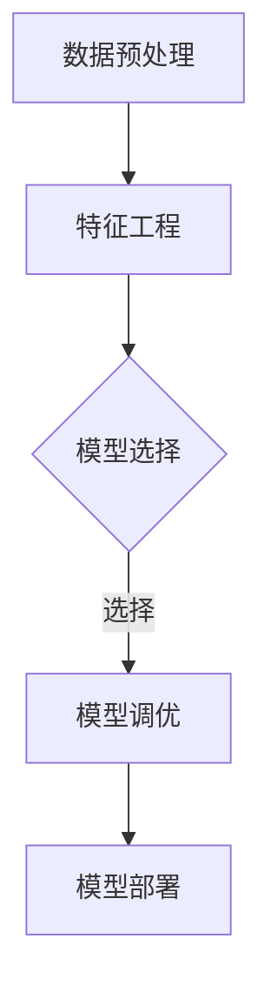
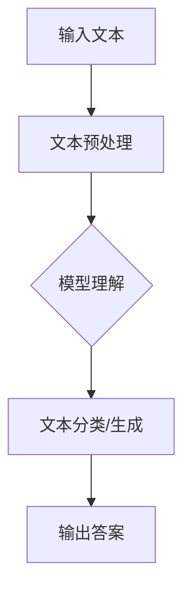

                 

### 文章标题：AutoML在LLM应用开发中的应用与局限

#### 关键词：AutoML，LLM，应用开发，局限，流程，工具，案例

> 摘要：本文将探讨自动机器学习（AutoML）在大规模语言模型（LLM）应用开发中的角色。通过详细分析AutoML的基本概念、应用场景、局限性以及未来展望，本文旨在为数据科学家和AI开发者提供一份全面的技术指南，帮助他们在LLM领域实现高效的模型开发和优化。

## 第一部分：基础理论与技术

### 第1章：AutoML与LLM概述

#### 1.1 AutoML的基本概念

**背景介绍**：

自动机器学习（AutoML）是一种自动化机器学习流程的方法，旨在简化数据科学家的工作，使非专家用户也能够轻松地创建高性能的机器学习模型。它通过自动化数据预处理、特征工程、模型选择和调优等步骤，提高了模型开发效率和准确性。

**核心概念与联系**：

- **数据预处理**：自动处理数据清洗、归一化和分割等任务。
- **特征工程**：自动生成和选择对模型性能有显著影响的关键特征。
- **模型选择**：自动化地选择合适的算法和模型架构。
- **模型调优**：自动化地调整模型参数，以最大化性能。


**Mermaid流程图示例**：



#### 1.2 大型语言模型（LLM）概述

**背景介绍**：

大型语言模型（LLM）是一种基于深度学习技术的自然语言处理模型，能够理解和生成人类语言。它们通常具有数十亿甚至数万亿个参数，能够处理复杂的语言任务，如文本分类、自然语言生成和问答系统。

**核心概念与联系**：

- **文本分类**：将文本数据分类到预定义的类别中。
- **自然语言生成**：根据输入的文本或指令生成新的文本。
- **问答系统**：理解用户的问题并生成相关的答案。


**Mermaid流程图示例**：



## 第2章：AutoML在LLM中的应用

### 2.1 AutoML的优势与挑战

**背景介绍**：

AutoML在LLM应用中的优势在于能够显著降低开发复杂度，提高模型性能。然而，它也面临一些挑战，如模型可解释性和数据隐私问题。

**核心概念与联系**：

- **优势**：自动化流程、高性能模型、快速迭代。
- **挑战**：模型可解释性、数据隐私、算法透明度。


### 2.2 AutoML在文本分类中的应用

**背景介绍**：

文本分类是LLM应用中的一个重要任务，AutoML通过自动化处理数据预处理和模型调优，提高了分类准确率。

**核心算法原理讲解**：

```python
# 伪代码：文本分类中的AutoML流程
def auto_ml_text_classification(data):
    # 数据预处理
    processed_data = preprocess_data(data)
    
    # 模型选择
    model = select_best_model(processed_data)
    
    # 模型调优
    best_model = optimize_model(model, processed_data)
    
    # 预测
    predictions = best_model.predict(processed_data)
    
    return predictions
```

### 2.3 AutoML在自然语言生成中的应用

**背景介绍**：

自然语言生成是另一个关键应用场景，AutoML通过自动化模型调优，实现了高质量的文本生成。

**核心算法原理讲解**：

```python
# 伪代码：自然语言生成中的AutoML流程
def auto_ml_nlg(prompt):
    # 数据预处理
    processed_prompt = preprocess_prompt(prompt)
    
    # 模型选择
    model = select_best_nlg_model(processed_prompt)
    
    # 模型调优
    best_nlg_model = optimize_nlg_model(model, processed_prompt)
    
    # 生成文本
    generated_text = best_nlg_model.generate_text(processed_prompt)
    
    return generated_text
```

## 第3章：AutoML架构与流程

### 3.1 数据预处理

**背景介绍**：

数据预处理是AutoML的关键步骤，它包括数据清洗、归一化和分割等任务。

**核心概念与联系**：

- **数据清洗**：去除噪声、填补缺失值等。
- **归一化**：调整数据范围，提高算法性能。
- **数据分割**：将数据划分为训练集、验证集和测试集。


### 3.2 模型选择与优化

**背景介绍**：

模型选择与优化是AutoML的核心步骤，它涉及选择合适的模型和调整模型参数。

**核心概念与联系**：

- **模型选择**：自动化选择最佳模型。
- **模型优化**：调整模型参数，提高性能。


### 3.3 模型评估与调优

**背景介绍**：

模型评估与调优是确保模型性能的重要环节，它包括评估模型性能和进一步优化模型。

**核心概念与联系**：

- **模型评估**：使用准确率、召回率等指标评估模型性能。
- **模型调优**：根据评估结果调整模型参数，提高性能。


## 第二部分：应用案例分析

### 第5章：AutoML在LLM应用中的成功案例

#### 5.1 案例一：智能客服系统

**背景介绍**：

智能客服系统是LLM应用中的一个重要场景，通过AutoML实现自动化问答和问题解决。

**核心算法原理讲解**：

```python
# 伪代码：智能客服系统中的AutoML流程
def auto_ml_smart_crm(question):
    # 数据预处理
    processed_question = preprocess_question(question)
    
    # 模型选择
    model = select_best_crm_model(processed_question)
    
    # 模型调优
    best_crm_model = optimize_crm_model(model, processed_question)
    
    # 生成答案
    answer = best_crm_model.answer_question(processed_question)
    
    return answer
```

#### 5.2 案例二：自动新闻生成

**背景介绍**：

自动新闻生成是另一个有前景的应用场景，通过AutoML实现高效的内容生成。

**核心算法原理讲解**：

```python
# 伪代码：自动新闻生成中的AutoML流程
def auto_ml_news_generation(topic):
    # 数据预处理
    processed_topic = preprocess_topic(topic)
    
    # 模型选择
    model = select_best_news_model(processed_topic)
    
    # 模型调优
    best_news_model = optimize_news_model(model, processed_topic)
    
    # 生成新闻
    news = best_news_model.generate_news(processed_topic)
    
    return news
```

#### 5.3 案例三：问答系统

**背景介绍**：

问答系统是LLM应用中的一个基本任务，通过AutoML实现高效的问答功能。

**核心算法原理讲解**：

```python
# 伪代码：问答系统中的AutoML流程
def auto_ml_question_answering(question):
    # 数据预处理
    processed_question = preprocess_question(question)
    
    # 模型选择
    model = select_best_qa_model(processed_question)
    
    # 模型调优
    best_qa_model = optimize_qa_model(model, processed_question)
    
    # 生成答案
    answer = best_qa_model.answer_question(processed_question)
    
    return answer
```

### 第6章：AutoML在LLM应用中的局限性分析

#### 6.1 数据限制与隐私问题

**背景介绍**：

数据限制和隐私问题是AutoML在LLM应用中的一个重要挑战，它影响到模型的训练和部署。

**核心概念与联系**：

- **数据限制**：数据量不足或数据质量差。
- **隐私问题**：敏感数据泄露的风险。


#### 6.2 模型可解释性与可靠性

**背景介绍**：

模型可解释性和可靠性是确保AI系统安全性和可信性的关键，尤其是在LLM应用中。

**核心概念与联系**：

- **模型可解释性**：理解模型的决策过程。
- **可靠性**：确保模型输出的准确性和一致性。


#### 6.3 法律法规与社会影响

**背景介绍**：

法律法规和社会影响是AI应用中的一个重要考虑因素，尤其是在LLM领域。

**核心概念与联系**：

- **法律法规**：遵守相关法律法规，确保合规性。
- **社会影响**：AI系统对社会的影响和责任。


### 第7章：未来展望与挑战

#### 7.1 AutoML与LLM技术的发展趋势

**背景介绍**：

随着AI技术的快速发展，AutoML与LLM技术也在不断进步，未来将会有更多创新和突破。

**核心概念与联系**：

- **发展趋势**：自动化程度提高、模型可解释性增强、跨领域应用。
- **突破方向**：更高效的算法、更丰富的数据源、更强大的计算能力。


#### 7.2 潜在的解决方案与突破方向

**背景介绍**：

针对AutoML与LLM应用中的挑战，需要寻找潜在的解决方案和突破方向。

**核心概念与联系**：

- **解决方案**：改进数据预处理、增强模型可解释性、加强隐私保护。
- **突破方向**：算法创新、数据驱动的方法、跨学科合作。


#### 7.3 对AI伦理与道德的思考

**背景介绍**：

AI伦理与道德是AI应用中的一个重要议题，尤其是在LLM领域。

**核心概念与联系**：

- **伦理问题**：公平性、透明性、责任归属。
- **道德责任**：AI系统的开发者、用户和监管者都应承担相应的道德责任。


## 附录

### 附录A：AutoML与LLM相关资源

**背景介绍**：

附录A提供了AutoML与LLM相关的资源，包括开源工具、文献和教程等。

**内容详细讲解**：

- **开源工具**：介绍常见的AutoML开源工具，如AutoSklearn、H2O.ai等。
- **文献与教程**：推荐相关领域的经典文献和技术教程。

### 附录B：数学公式与伪代码示例

**背景介绍**：

附录B展示了本文中使用的数学公式和伪代码示例。

**内容详细讲解**：

- **数学公式**：使用LaTeX格式展示关键公式，如损失函数、优化算法等。
- **伪代码示例**：提供详细的伪代码示例，帮助读者理解算法流程。

### 附录C：实战案例代码与解读

**背景介绍**：

附录C提供了本文中提到的实战案例的源代码和详细解读。

**内容详细讲解**：

- **源代码**：展示完整的代码实现，包括数据预处理、模型训练和评估等步骤。
- **代码解读**：对关键代码段进行详细解读，帮助读者理解实现细节。

## 作者信息

**作者：AI天才研究院/AI Genius Institute & 禅与计算机程序设计艺术 /Zen And The Art of Computer Programming**

**版权声明：本文内容受版权保护，未经授权禁止转载和使用。**

**感谢您的阅读，希望本文能对您在AutoML与LLM领域的学习和实践提供帮助。**

