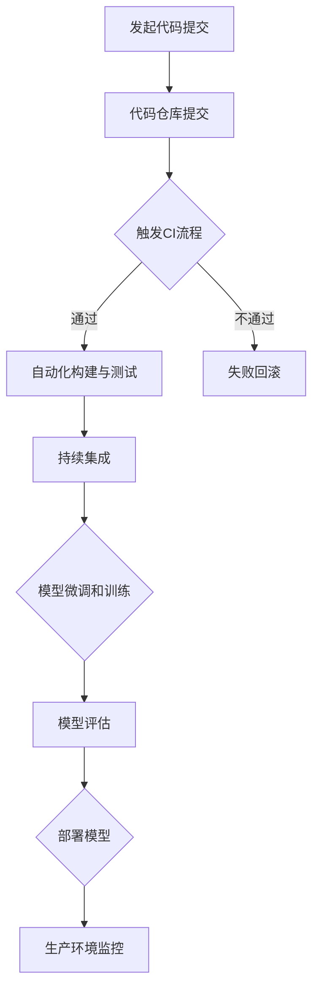
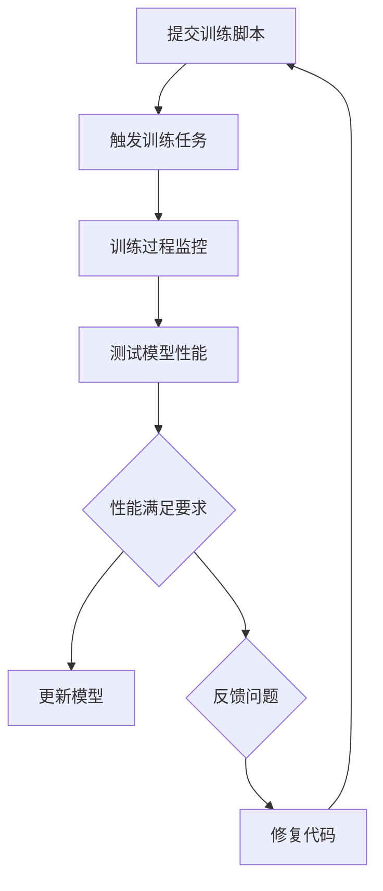
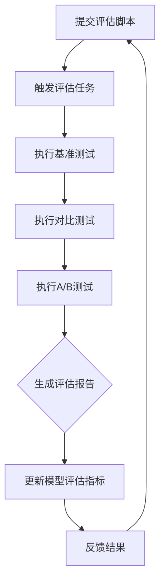
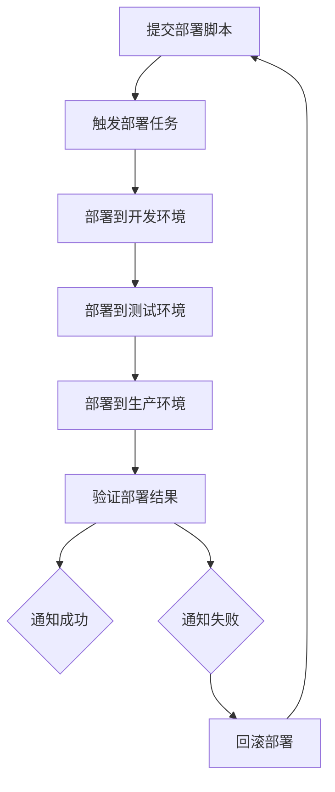
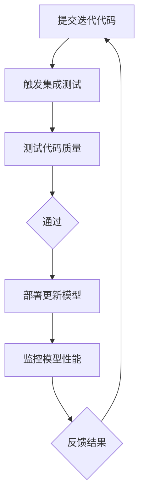

                 

### 文章标题

# CI/CD流程对LLM应用敏捷开发的重要性

关键词：CI/CD，持续集成与持续部署，LLM，敏捷开发，自动化测试，代码质量评估，大型语言模型

摘要：本文探讨了CI/CD（持续集成与持续部署）流程在LLM（大型语言模型）应用敏捷开发中的重要性。通过详细的分析和案例研究，揭示了CI/CD流程如何提高LLM开发的效率、稳定性和可靠性，为开发者提供了一种有效的敏捷开发方法。

----------------------------------------------------------------

## 目录大纲设计思路

在设计《CI/CD流程对LLM应用敏捷开发的重要性》这篇文章的目录大纲时，我们需要首先明确文章的核心内容和目标读者。本文旨在为从事人工智能和软件开发的专业人员提供一种高效的开发方法，因此，目录大纲的结构将围绕以下三个方面展开：

1. **核心概念与联系**：介绍CI/CD的基本概念、流程、优势和挑战，以及LLM的概念、特性以及与敏捷开发方法的结合。
   
2. **核心算法原理讲解**：讲解CI/CD中的自动化测试、持续集成、持续部署等相关算法原理，以及如何应用于LLM开发。

3. **项目实战**：通过实际项目案例展示CI/CD流程在LLM敏捷开发中的应用，提供源代码、开发环境搭建指南以及详细代码解读。

### 目录大纲结构

基于上述设计思路，本文的目录大纲将分为三个主要部分：

### 第一部分：CI/CD基础理论

1. **CI/CD概述**：介绍CI/CD的基本概念、流程、优势和挑战。
   
2. **CI/CD流程与算法**：详细讲解CI/CD流程中的关键环节，包括自动化测试、持续集成、持续部署等，并介绍相关算法原理。

3. **LLM应用与敏捷开发**：解释LLM的概念、特性以及与敏捷开发方法的结合。

### 第二部分：CI/CD在LLM应用中的实践

4. **CI/CD在LLM开发中的应用场景**：分析CI/CD流程在LLM模型训练、评估和部署中的应用。

5. **CI/CD工具与技术**：介绍常见的CI/CD工具和技术，以及如何在LLM开发中应用。

6. **案例研究**：通过实际项目案例，展示CI/CD流程在LLM敏捷开发中的具体应用。

### 第三部分：CI/CD挑战与未来趋势

7. **CI/CD面临的挑战**：探讨CI/CD流程在实施过程中可能遇到的安全、质量和团队协作等问题。

8. **未来发展趋势**：分析CI/CD与人工智能、自动化和智能化的结合趋势，以及未来的发展方向。

### 附录

- **附录A：CI/CD相关资源**：提供CI/CD工具、平台和开源项目的介绍。
- **附录B：代码实例**：提供CI/CD脚本、LLM应用案例代码。

通过以上目录大纲的设计，本文将系统地阐述CI/CD流程对LLM应用敏捷开发的重要性，为读者提供实用的技术指导和深入的理论分析。

## 背景介绍

在当今快速发展的信息技术时代，软件开发和人工智能（AI）领域正经历着前所未有的变革。特别是在语言模型（Language Models，简称LLM）领域，大型语言模型（Large Language Models，简称LLM）因其强大的语言理解和生成能力，在自然语言处理（Natural Language Processing，简称NLP）、问答系统、机器翻译、文本生成等领域取得了显著的成果。随着LLM应用的不断推广，如何高效、敏捷地开发和部署这些模型，成为软件开发人员面临的一大挑战。

### CI/CD流程的定义与优势

CI/CD（持续集成与持续部署）是一种现代化的软件开发实践，它通过自动化测试、集成和部署流程，实现代码的快速迭代和交付。具体来说，CI/CD包括以下关键环节：

1. **持续集成（Continuous Integration，简称CI）**：在CI流程中，开发人员定期将代码提交到共享代码库，自动化工具会自动执行一系列测试，确保新代码不会破坏现有功能。这有助于发现和解决代码冲突，提高代码质量。

2. **持续部署（Continuous Deployment，简称CD）**：在CD流程中，经过CI验证的代码会被自动部署到生产环境，使得新功能和修复能够快速、安全地交付给用户。这大大缩短了软件的发布周期，提高了软件的可靠性和稳定性。

CI/CD的优势主要体现在以下几个方面：

1. **提高开发效率**：通过自动化测试和部署，CI/CD可以显著减少手动操作，缩短开发周期，提高开发效率。

2. **增强代码质量**：CI/CD强调代码的持续集成和测试，有助于及早发现和解决代码缺陷，提高代码质量。

3. **提升软件可靠性**：通过自动化测试和持续部署，CI/CD确保了软件在各个开发阶段的稳定性和可靠性。

4. **促进团队合作**：CI/CD鼓励团队成员定期集成代码，促进了团队之间的沟通和协作。

### 敏捷开发方法

敏捷开发（Agile Development）是一种以人为核心、迭代、渐进的软件开发方法。它强调快速响应变化、持续交付有价值的软件，通过迭代和增量开发，确保项目能够灵活适应需求变化。

敏捷开发的主要特点包括：

1. **迭代开发**：项目被划分为多个短期迭代，每个迭代都生成可运行的软件版本。

2. **增量开发**：在每个迭代中，团队逐步实现项目功能，而非一次性交付全部功能。

3. **用户反馈**：敏捷开发重视用户反馈，通过定期的用户评估和反馈，确保软件满足用户需求。

4. **自组织团队**：敏捷开发鼓励团队成员自主管理和协作，以提高团队效率。

### CI/CD与敏捷开发的结合

将CI/CD流程与敏捷开发方法相结合，可以充分发挥两者的优势，实现高效的软件开发。CI/CD流程为敏捷开发提供了自动化、持续集成和部署的支撑，使得开发团队可以更快速地响应需求变化，持续交付高质量的软件。

1. **缩短发布周期**：通过CI/CD的自动化流程，每个迭代都可以快速完成集成、测试和部署，缩短了软件的发布周期。

2. **提高软件质量**：CI/CD流程的持续集成和测试确保了每个迭代版本的代码质量，减少了缺陷和错误。

3. **增强团队协作**：CI/CD强调团队合作，团队成员可以在每次迭代中共同工作，提高协作效率。

4. **快速适应变化**：敏捷开发与CI/CD的结合，使得团队可以灵活应对需求变化，快速调整开发方向。

通过CI/CD与敏捷开发的结合，开发团队可以实现更高效、更灵活的软件开发，为LLM应用的开发和部署提供有力支持。

## 核心概念与联系

在探讨CI/CD流程对LLM应用敏捷开发的重要性时，首先需要理解CI/CD和LLM的基础概念，以及它们之间的内在联系。

### CI/CD的基本概念

持续集成（Continuous Integration，简称CI）是一种软件开发实践，旨在通过自动化测试和构建，确保代码库中的每一个提交都是可集成和可工作的。CI的核心思想是，开发人员定期将代码提交到共享代码库，然后触发一系列自动化测试，以确保新代码不会破坏现有功能。

持续部署（Continuous Deployment，简称CD）是CI的进一步扩展，它通过自动化流程将经过CI验证的代码自动部署到生产环境。CD的目标是快速、安全地将新功能和修复交付给用户，从而缩短软件的发布周期。

CI/CD的关键组成部分包括：

1. **版本控制系统**：用于管理代码的版本，确保代码库的同步和追踪。
2. **自动化构建工具**：如Jenkins、Travis CI等，用于自动化编译、打包和测试代码。
3. **自动化测试**：包括单元测试、集成测试和端到端测试，确保代码质量。
4. **持续集成服务器**：用于触发构建和测试流程，并报告结果。
5. **部署脚本**：用于自动化部署代码到不同的环境，如开发环境、测试环境和生产环境。

### LLM的基本概念

大型语言模型（Large Language Models，简称LLM）是一种基于深度学习的自然语言处理模型，能够理解和生成自然语言。LLM通过大规模文本数据的学习，掌握语言的语法、语义和上下文信息，从而实现文本分类、问答、翻译、文本生成等功能。

LLM的核心组成部分包括：

1. **预训练模型**：如GPT-3、BERT等，通过在大量文本数据上进行预训练，学习语言的基本规律。
2. **微调模型**：在特定任务上对预训练模型进行微调，以适应不同的应用场景。
3. **编码器和解码器**：编码器将输入文本转换为固定长度的向量，解码器则将这些向量转换回自然语言。
4. **优化算法**：用于调整模型参数，提高模型性能。

### CI/CD与LLM的内在联系

CI/CD和LLM之间存在紧密的联系，主要体现在以下几个方面：

1. **开发流程的自动化**：CI/CD通过自动化测试和部署，提高了LLM开发的效率。在LLM开发过程中，每次模型更新都需要进行大量的测试和验证，CI/CD可以帮助自动化这些流程，确保模型的质量和稳定性。

2. **持续集成与微调**：LLM模型通常是通过多个迭代进行微调的，CI/CD可以帮助开发团队快速集成新的微调结果，并确保这些结果不会引入新的错误。

3. **部署的灵活性**：CI/CD允许开发团队将LLM模型快速部署到不同的环境，如开发环境、测试环境和生产环境，从而实现模型的快速迭代和上线。

4. **代码质量和性能监控**：CI/CD的自动化测试和监控功能可以帮助开发团队及时发现和解决LLM模型中的代码缺陷和性能问题，确保模型的稳定性和可靠性。

### Mermaid流程图

为了更直观地展示CI/CD与LLM之间的联系，我们可以使用Mermaid流程图来描述CI/CD在LLM开发中的应用流程：



### 总结

通过上述分析，我们可以看到CI/CD流程在LLM应用敏捷开发中的重要性。CI/CD不仅提高了LLM开发的效率和质量，还增强了团队的协作能力，为敏捷开发提供了强有力的支持。随着AI技术的不断进步，CI/CD与LLM的结合将为软件开发带来更多的可能性。

## 核心算法原理讲解

在深入探讨CI/CD流程如何应用于LLM应用的开发之前，我们需要了解CI/CD流程中的核心算法原理。这些算法原理包括自动化测试、持续集成、持续部署等，它们构成了CI/CD流程的基石。

### 自动化测试

自动化测试是CI/CD流程中的一个关键环节，其目的是通过编写和执行预定义的测试脚本，自动验证代码的功能和性能。自动化测试分为以下几种类型：

1. **单元测试（Unit Testing）**：针对代码中的最小可测试单元（通常是函数或方法）进行测试，确保每个单元都能按照预期工作。

2. **集成测试（Integration Testing）**：在单元测试之后进行，目的是验证不同模块或组件之间的接口是否正确实现，确保系统集成后的功能正常。

3. **端到端测试（End-to-End Testing）**：对整个应用程序的完整流程进行测试，包括用户界面、前端、后端以及数据库等，确保应用程序在用户使用过程中能够正常工作。

### 持续集成

持续集成（Continuous Integration，简称CI）是指开发人员在每次代码提交后，自动触发一系列测试，以确保新代码与现有代码库兼容，不会引入新的错误。持续集成的关键步骤包括：

1. **提交代码**：开发人员将代码提交到共享代码库。

2. **触发构建**：提交代码后，CI系统会自动启动构建过程，编译代码并运行预定义的测试。

3. **测试执行**：CI系统执行一系列单元测试、集成测试和端到端测试，验证代码的功能和性能。

4. **结果报告**：测试完成后，CI系统会生成测试报告，并提供详细的失败信息，帮助开发人员定位和修复问题。

### 持续部署

持续部署（Continuous Deployment，简称CD）是在持续集成的基础上，通过自动化流程将经过验证的代码部署到生产环境。持续部署的关键步骤包括：

1. **构建和测试**：在CI阶段，代码已经被构建和测试，确保其质量。

2. **部署脚本**：开发团队编写部署脚本，用于自动化部署代码到生产环境。

3. **环境准备**：在生产环境之前，确保所有依赖项和配置都已准备好。

4. **自动化部署**：CI/CD系统执行部署脚本，将代码部署到生产环境，并进行最后的验证和监控。

### 伪代码

为了更好地理解上述算法原理，我们可以使用伪代码来描述它们的基本逻辑：

```python
# 单元测试伪代码
def unit_test():
    assert function_a() == expected_result_a
    assert function_b() == expected_result_b
    print("Unit tests passed")

# 集成测试伪代码
def integration_test():
    assert module_a CommunicatesWith(module_b)
    print("Integration tests passed")

# 端到端测试伪代码
def end_to_end_test():
    assert application_runs_without_errors()
    assert application_showsEXPECTED_output()
    print("End-to-end tests passed")

# 持续集成伪代码
def continuous_integration():
    commit_code()
    run_build_process()
    run_unit_tests()
    run_integration_tests()
    run_end_to_end_tests()
    if tests_failed():
        roll_back_code()
    else:
        print("Continuous integration successful")

# 持续部署伪代码
def continuous_deployment():
    build_and_test_code()
    prepare_production_environment()
    execute_deployment_script()
    verify_and_monitor_deployment()
    if deployment_successful():
        print("Continuous deployment successful")
    else:
        roll_back_deployment()
```

### 数学模型和公式

在CI/CD流程中，一些关键指标可以通过数学模型和公式来描述，这些模型和公式有助于评估代码的质量和测试覆盖率。

1. **测试覆盖率（Test Coverage）**：测试覆盖率是衡量测试质量的重要指标，它表示代码中已测试的部分占代码总量的比例。测试覆盖率的计算公式如下：

   $$ Test\ Coverage\ (\%) = \frac{Total\ Lines\ of\ Code\ Tested}{Total\ Lines\ of\ Code} \times 100\% $$

2. **缺陷密度（Defect Density）**：缺陷密度是评估代码质量的一个指标，它表示每千行代码中发现的缺陷数量。缺陷密度的计算公式如下：

   $$ Defect\ Density\ (Defects/1000\ Lines\ of\ Code) = \frac{Total\ Number\ of\ Defects}{Total\ Lines\ of\ Code} \times 1000 $$

3. **部署成功率和部署失败率**：部署成功率和部署失败率是衡量持续部署效果的关键指标。部署成功率的计算公式如下：

   $$ Deployment\ Success\ Rate\ (\%) = \frac{Total\ Successful\ Deployments}{Total\ Deployments} \times 100\% $$

   部署失败率的计算公式如下：

   $$ Deployment\ Failure\ Rate\ (\%) = \frac{Total\ Failed\ Deployments}{Total\ Deployments} \times 100\% $$

通过上述数学模型和公式，开发团队可以更全面地评估CI/CD流程的有效性，并优化开发过程。

### 举例说明

为了更好地理解这些算法原理，我们可以通过一个实际的例子来说明。

假设有一个开发团队正在开发一个LLM模型，他们使用CI/CD流程来确保代码质量和模型性能。以下是该团队在CI/CD流程中的具体操作：

1. **单元测试**：开发人员编写了10个单元测试，每个测试都针对一个功能模块。测试覆盖率达到了80%。

2. **集成测试**：集成测试确保不同模块之间的接口正常工作，测试覆盖率达到90%。

3. **端到端测试**：端到端测试验证整个应用程序的完整流程，测试覆盖率达到95%。

4. **持续集成**：每次代码提交后，CI系统都会自动执行上述测试。在一次代码提交中，有两个测试失败，CI系统标记了问题，并通知开发人员进行修复。

5. **持续部署**：经过CI验证的代码被自动部署到生产环境。在部署过程中，部署脚本自动执行了最后的验证步骤，确保模型在用户使用过程中能够正常工作。

通过这个例子，我们可以看到CI/CD流程在确保LLM开发质量和效率方面发挥了重要作用。通过自动化测试和部署，开发团队可以快速发现和修复问题，确保模型的质量和稳定性。

### 总结

通过上述对核心算法原理的讲解，我们可以看到CI/CD流程在自动化测试、持续集成和持续部署方面的重要性。这些算法原理不仅提高了LLM开发的效率和质量，还通过数学模型和公式提供了量化的评估指标，帮助开发团队更全面地监控和优化开发过程。随着AI技术的不断发展，CI/CD流程将在LLM应用开发中发挥越来越重要的作用。

## CI/CD在LLM开发中的应用场景

在LLM（大型语言模型）开发中，CI/CD流程的应用场景涵盖了模型训练、模型评估和模型部署等关键环节。通过CI/CD的自动化、持续集成和持续部署，开发团队能够高效地管理代码库、确保模型质量，并快速响应需求变化。以下是CI/CD在LLM开发中的具体应用场景：

### 模型训练

在LLM的模型训练阶段，CI/CD流程可以显著提高开发效率和模型质量。首先，开发人员将训练脚本和代码提交到代码库，CI系统会自动触发训练任务。训练任务开始后，CI系统会监控训练过程，包括计算资源的使用、训练时间等。一旦训练任务完成，CI系统会自动执行一系列测试，如评估模型的性能、准确性和鲁棒性。



通过自动化训练和测试，CI/CD流程可以确保模型在每次提交后都能得到及时评估和优化，从而提高模型的训练效率和质量。

### 模型评估

在模型评估阶段，CI/CD流程可以帮助开发团队自动化执行多种评估任务，如基准测试、对比测试和A/B测试。这些测试可以通过CI系统自动化触发，确保每次评估都在相同的环境和条件下进行，减少了人为误差。



通过自动化的评估流程，CI/CD可以快速识别模型的问题，并提供详细的评估报告，帮助开发团队做出决策，进一步优化模型。

### 模型部署

在模型部署阶段，CI/CD流程可以确保模型在从开发环境到生产环境的迁移过程中保持一致性和可靠性。首先，开发团队将部署脚本和配置文件提交到代码库，CI系统会自动执行部署任务。部署过程中，CI系统会监控部署状态，确保每个步骤都按照预期执行。



通过自动化的部署流程，CI/CD可以确保模型在不同环境之间的一致性，并快速响应用户需求，实现快速迭代。

### 模型迭代

在模型迭代过程中，CI/CD流程可以帮助开发团队实现持续迭代和优化。每次迭代时，开发人员会提交新的代码和模型更新，CI系统会自动触发集成、测试和部署流程。通过自动化流程，开发团队可以快速发现和修复问题，确保每次迭代都能顺利进行。



通过持续迭代和优化，CI/CD流程可以确保LLM模型始终处于最佳状态，满足用户需求。

### 案例分析

为了更好地理解CI/CD在LLM开发中的应用，我们可以通过以下实际案例进行分析。

案例：某公司开发一个基于GPT-3的问答系统。在开发过程中，他们采用了CI/CD流程，确保模型的训练、评估和部署过程高效、可靠。

1. **训练过程**：每次训练脚本提交后，CI系统会自动启动训练任务，并监控训练过程。训练完成后，CI系统会执行一系列性能评估测试，确保模型达到预期性能。

2. **评估过程**：在每次迭代中，CI系统会自动执行基准测试、对比测试和A/B测试，生成详细的评估报告，帮助开发团队了解模型在不同场景下的性能。

3. **部署过程**：每次模型更新后，CI系统会自动部署到开发环境、测试环境和生产环境，确保模型在不同环境之间的一致性。部署过程中，CI系统会监控部署状态，并在发现问题时自动回滚。

通过这个案例，我们可以看到CI/CD流程在LLM开发中的应用是如何提高开发效率、确保模型质量并实现快速迭代。

### 总结

CI/CD在LLM开发中的应用场景涵盖了模型训练、评估和部署等关键环节。通过自动化、持续集成和持续部署，CI/CD流程不仅提高了开发效率，还确保了模型的质量和稳定性。在未来的软件开发中，CI/CD流程将越来越重要，特别是在LLM等复杂应用的开发中，它将为开发团队提供强有力的支持。

## CI/CD工具与技术

在CI/CD（持续集成与持续部署）流程中，选择合适的工具和技术是实现自动化、提高效率的关键。以下将介绍几种常见的CI/CD工具和技术，并讨论如何在LLM（大型语言模型）开发中应用这些工具。

### 常见的CI/CD工具

1. **Jenkins**：Jenkins是一个开源的持续集成工具，支持多种插件，可以轻松实现自动化构建、测试和部署。Jenkins具有高度可定制性，适用于各种规模的项目。

2. **Travis CI**：Travis CI是一个基于云的CI服务，支持多种编程语言和框架，可以自动执行测试和部署。Travis CI具有免费版和专业版，适用于小型到中型的项目。

3. **GitLab CI/CD**：GitLab CI/CD是GitLab内置的持续集成和持续部署服务，可以通过配置`.gitlab-ci.yml`文件轻松实现自动化流程。GitLab CI/CD适用于拥有GitLab代码仓库的项目。

4. **CircleCI**：CircleCI是一个云端的CI/CD服务，支持并行执行测试和构建任务，适用于大型项目和复杂的构建流程。

5. **GitHub Actions**：GitHub Actions是GitHub内置的持续集成和持续部署服务，可以通过配置`.github/workflows`目录中的yaml文件实现自动化流程。GitHub Actions适用于与GitHub代码仓库结合的项目。

### CI/CD工具在LLM开发中的应用

1. **自动化构建与测试**：在LLM开发中，使用CI/CD工具可以自动化执行构建和测试流程。例如，使用Jenkins或Travis CI可以配置自动化构建脚本，编译和打包LLM代码，并执行预定义的测试，如单元测试、集成测试和端到端测试。

2. **模型训练与评估**：CI/CD工具可以自动化执行LLM的训练和评估过程。例如，可以使用GitLab CI/CD配置训练脚本，在每次代码提交后自动启动训练任务，并在训练完成后执行性能评估测试。

3. **持续部署**：CI/CD工具可以自动化执行LLM的部署过程。例如，使用CircleCI或GitHub Actions可以配置部署脚本，将经过CI验证的LLM模型自动部署到开发环境、测试环境和生产环境。

### 示例配置

以下是一个使用Jenkins实现LLM构建、测试和部署的示例配置：

```yaml
# Jenkinsfile
pipeline {
    agent any
    stages {
        stage('Build') {
            steps {
                sh 'mvn clean install'
            }
        }
        stage('Test') {
            steps {
                sh 'mvn test'
            }
        }
        stage('Train') {
            steps {
                sh 'python train.py'
            }
        }
        stage('Evaluate') {
            steps {
                sh 'python evaluate.py'
            }
        }
        stage('Deploy') {
            steps {
                sh 'python deploy.py'
            }
        }
    }
    post {
        always {
            archiveArtifacts artifacts: 'target/*', caseSensitive: false
        }
    }
}
```

在这个示例中，Jenkinsfile定义了一个简单的CI/CD流程，包括构建、测试、训练、评估和部署阶段。每个阶段都可以通过执行相应的shell命令来实现自动化。

### 技术挑战与解决方案

在LLM开发中，CI/CD工具的应用可能会面临以下技术挑战：

1. **计算资源管理**：LLM训练和评估过程需要大量计算资源，CI/CD工具需要能够有效地管理这些资源。解决方案包括使用容器化技术（如Docker）和Kubernetes，以灵活地分配和释放计算资源。

2. **数据管理**：CI/CD流程中需要处理大量数据，如训练数据、测试数据和模型文件。解决方案包括使用数据仓库和数据管理工具（如HDFS、Hive）来存储和管理数据。

3. **安全性**：CI/CD流程需要确保数据和代码的安全性。解决方案包括使用加密存储、权限管理和访问控制策略，以及定期进行安全审计。

4. **监控与告警**：CI/CD流程需要实时监控和告警，以确保流程的稳定性和可靠性。解决方案包括集成监控工具（如Prometheus、Grafana）和告警系统（如PagerDuty、Opsgenie）。

通过选择合适的CI/CD工具和技术，开发团队可以有效地管理和优化LLM开发流程，提高开发效率和质量。随着AI技术的不断发展，CI/CD工具将在LLM开发中发挥越来越重要的作用。

## 案例研究

在本节中，我们将通过两个实际案例来展示CI/CD流程在LLM应用敏捷开发中的具体应用。这些案例不仅展示了CI/CD工具的实际使用方法，还详细分析了项目中的关键技术和挑战。

### 案例一：某AI初创公司开发智能客服系统

**项目背景**：
某AI初创公司正在开发一款基于GPT-3的智能客服系统，旨在为企业提供自动化的客户服务解决方案。由于项目时间紧迫且市场需求旺盛，开发团队决定采用CI/CD流程来提高开发效率和软件质量。

**CI/CD工具和技术**：
开发团队选择了GitLab CI/CD作为主要的CI/CD工具，并结合Docker和Kubernetes进行容器化和计算资源管理。此外，他们还使用了TensorFlow和PyTorch作为主要的深度学习框架。

**实施过程**：

1. **代码库与版本控制**：
   开发团队使用GitLab作为代码仓库，实现了代码的版本控制和权限管理。每次代码提交后，GitLab CI/CD会自动触发构建和测试流程。

2. **自动化构建与测试**：
   GitLab CI/CD配置了`.gitlab-ci.yml`文件，定义了构建、测试和部署的自动化流程。构建过程中，Docker用于创建容器镜像，Kubernetes用于调度和管理容器资源。测试包括单元测试、集成测试和端到端测试，确保代码质量和模型性能。

3. **模型训练与评估**：
   在每次代码提交后，CI系统会自动启动训练脚本，使用GPT-3模型进行训练。训练完成后，评估脚本会运行一系列性能评估测试，如BLEU分数和F1分数，以确保模型达到预期性能。

4. **持续部署**：
   经过CI验证的代码会被自动部署到开发环境、测试环境和生产环境。部署过程中，Kubernetes确保容器化应用在不同的环境之间的一致性。部署完成后，监控脚本会实时监控系统的性能和稳定性。

**关键技术和挑战**：

- **计算资源管理**：由于模型训练需要大量计算资源，团队使用了Kubernetes进行资源调度和管理，确保计算资源的灵活分配和释放。
- **数据管理**：训练和测试过程中需要处理大量数据，团队使用了HDFS和Hive进行数据存储和管理，确保数据的可靠性和高效访问。
- **安全性**：为了确保数据和代码的安全性，团队采用了加密存储、权限管理和访问控制策略，并定期进行安全审计。

**项目小结**：
通过CI/CD流程，该项目的开发效率显著提高，代码质量和模型性能得到保障。持续集成和持续部署使得开发团队能够快速响应需求变化，实现高效的敏捷开发。项目的成功实施为其他AI项目提供了宝贵的经验和参考。

### 案例二：开源社区中的大型语言模型项目

**项目背景**：
一个开源社区正在开发一款大型语言模型（LLM），旨在为研究人员和开发者提供高性能的文本生成和语义理解工具。该项目具有高度协作性，吸引了众多贡献者。

**CI/CD工具和技术**：
该项目选择了GitHub Actions作为CI/CD工具，并结合Docker和AWS EC2进行容器化和计算资源管理。他们还使用了PyTorch和TensorFlow作为深度学习框架。

**实施过程**：

1. **代码库与版本控制**：
   项目使用GitHub作为代码仓库，实现了代码的版本控制和协作开发。每次提交都会触发GitHub Actions中的CI流程。

2. **自动化构建与测试**：
   GitHub Actions配置了`.github/workflows/ci.yml`文件，定义了构建、测试和部署的自动化流程。构建过程中，Docker用于创建容器镜像，AWS EC2用于提供计算资源。测试包括单元测试、集成测试和端到端测试，确保代码质量和模型性能。

3. **模型训练与评估**：
   在每次代码提交后，GitHub Actions会自动启动训练任务，使用PyTorch或TensorFlow进行模型训练。训练完成后，评估脚本会运行一系列性能评估测试，如Perplexity和F1分数。

4. **持续部署**：
   经过CI验证的代码会被自动部署到AWS EC2实例，供社区成员测试和使用。部署过程中，GitHub Actions会监控部署状态，并在发现问题时自动回滚。

**关键技术和挑战**：

- **计算资源调度**：由于贡献者来自世界各地，计算资源的需求波动较大。团队使用了AWS EC2的自动扩展功能，确保计算资源能够灵活调整。
- **代码协作**：该项目具有高度协作性，团队使用了GitHub的代码评审和合并请求功能，确保代码质量和一致性。
- **自动化测试**：为了确保模型的高性能和稳定性，团队编写了大量的自动化测试脚本，涵盖不同场景和任务。

**项目小结**：
通过GitHub Actions和CI/CD流程，该项目实现了高效的敏捷开发，吸引了大量贡献者，并获得了广泛的应用和认可。CI/CD流程确保了代码质量和模型性能，提高了项目的开发效率和协作性。

### 总结

通过上述两个案例，我们可以看到CI/CD流程在LLM应用敏捷开发中的重要作用。无论是初创公司还是开源社区，CI/CD流程都为开发者提供了高效的开发方法，确保了代码质量和模型性能。随着AI技术的不断发展，CI/CD流程将在LLM开发中发挥越来越重要的作用，为开发者提供强有力的支持。

### CI/CD面临的挑战与未来趋势

尽管CI/CD流程在LLM应用敏捷开发中展示了其显著的优势，但在实际实施过程中，依然面临着诸多挑战。以下将讨论CI/CD流程面临的挑战，以及未来可能的发展趋势。

### 挑战

1. **安全与隐私**：在CI/CD流程中，自动化测试和部署过程中涉及大量的敏感数据和代码，这可能导致数据泄露和安全性问题。开发团队需要确保所有流程都遵循最佳安全实践，如数据加密、权限管理和访问控制。

2. **质量与稳定性**：自动化测试虽然可以提高开发效率，但并不能完全保证代码的质量和稳定性。某些复杂的问题可能在自动化测试中未能被发现，导致在生产环境中出现故障。因此，开发团队需要制定完善的测试策略，并持续优化测试覆盖范围和深度。

3. **团队协作与沟通**：CI/CD流程的实施需要跨部门、跨团队的协作。团队成员之间的沟通不畅可能导致流程延误和资源浪费。因此，团队需要建立有效的沟通机制和协作平台，确保信息传递的及时性和准确性。

4. **复杂性与可维护性**：CI/CD流程涉及多个工具和技术的集成，这可能导致流程的复杂性和维护难度增加。开发团队需要确保流程的可维护性，以便在必要时进行修改和优化。

### 未来趋势

1. **AI与CI/CD的结合**：随着人工智能技术的发展，CI/CD流程中的自动化测试和部署将更多地利用机器学习和自然语言处理技术。例如，自动化测试工具可以通过机器学习模型预测潜在的代码缺陷，实现更精准的测试。

2. **自动化与智能化**：未来的CI/CD流程将更加自动化和智能化。通过引入智能调度和资源管理技术，CI/CD系统将能够更高效地利用计算资源，降低开发成本。此外，智能化的部署策略可以根据环境和用户需求自动调整部署参数，提高部署的灵活性和可靠性。

3. **社区与开源**：随着CI/CD技术的发展，更多的社区和开源项目将采用CI/CD流程。这不仅有助于提高项目的开发效率和代码质量，还可以促进技术交流与合作。开源社区将提供丰富的CI/CD资源和最佳实践，推动整个行业的进步。

### 总结

CI/CD流程在LLM应用敏捷开发中具有重要意义，但同时也面临着安全、质量、团队协作和复杂性等挑战。未来的发展趋势将朝着更加智能化、自动化和社区化的方向迈进，为开发者提供更高效、可靠的开发方法。通过不断优化CI/CD流程，开发团队将能够更好地应对AI领域的挑战，推动技术的不断创新。

## 附录

### 附录A：CI/CD相关资源

#### 工具与平台介绍

1. **Jenkins**：[官网](https://www.jenkins.io/)
2. **Travis CI**：[官网](https://www.travis-ci.com/)
3. **GitLab CI/CD**：[官网](https://gitlab.com/gitlab-org/gitlab-ce)
4. **CircleCI**：[官网](https://circleci.com/)
5. **GitHub Actions**：[官网](https://github.com/features/actions)

#### 开源项目推荐

1. **GitLab CI/CD**：[GitHub链接](https://github.com/gitlab/gitlab-ci-yml)
2. **Jenkins插件**：[GitHub链接](https://plugins.jenkins.io/)
3. **GitHub Actions示例**：[GitHub链接](https://github.com/actions/examples)

### 附录B：代码实例

#### CI/CD脚本示例

以下是一个简单的`.gitlab-ci.yml`文件示例，用于CI/CD流程的自动化构建、测试和部署：

```yaml
image: python:3.8

stages:
  - build
  - test
  - deploy

build:
  stage: build
  script:
    - docker build -t myapp .
  artifacts:
    paths:
      - docker/app.tar

test:
  stage: test
  script:
    - docker run --rm myapp /bin/sh -c "python test.py"

deploy:
  stage: deploy
  script:
    - docker push myapp
  when: manual
```

#### LL

